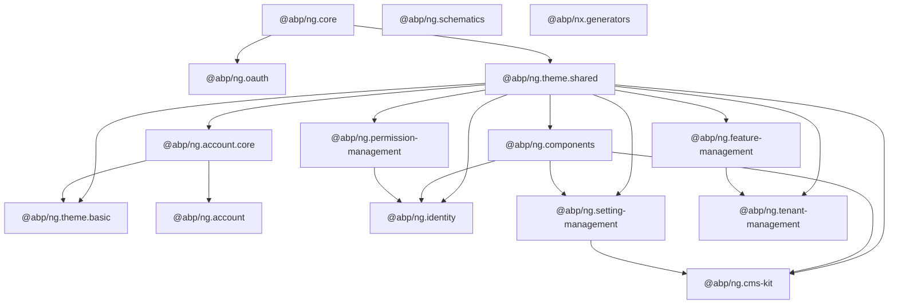

The ABP Angular UI lives in a single Nx workspace under [`npm/ng-packs/`](https://github.com/abpframework/abp/tree/dev/npm/ng-packs). It produces sixteen publishable libraries that map one-to-one onto ABP's backend application modules — `@abp/ng.core` mirrors `Volo.Abp.AspNetCore.Mvc`, `@abp/ng.identity` consumes the Identity module's HTTP APIs, `@abp/ng.cms-kit` calls the CMS Kit endpoints, and so on. This page is the orientation map: workspace structure, build tooling, the package dependency graph, and a directory of every library coding agents will encounter when extending or maintaining the Angular stack.

## Workspace layout

The workspace is a standard [Nx](https://nx.dev) monorepo with [Lerna](https://lerna.js.org) used only for publishing. The `libsDir` is `packages/` (declared in `nx.json`), there is no `apps/` directory — the only application is `dev-app` declared inline. Schematics are built separately via a bespoke script.

```
npm/ng-packs/
├── package.json          # workspace root, Angular 21 + Nx 21
├── nx.json               # workspaceLayout.libsDir = "packages"
├── lerna.version.json    # version 7.2.3 (legacy carry-over)
├── lerna.publish.json    # publishes from dist/packages/*
├── tsconfig.base.json    # path aliases for every @abp/ng.* package
├── packages/             # all 15 publishable libraries
│   ├── core/             # @abp/ng.core
│   ├── account/          # @abp/ng.account
│   ├── account-core/     # @abp/ng.account.core
│   ├── identity/         # @abp/ng.identity
│   ├── permission-management/
│   ├── setting-management/
│   ├── feature-management/
│   ├── tenant-management/
│   ├── cms-kit/
│   ├── components/       # @abp/ng.components (UI primitives umbrella)
│   ├── oauth/            # @abp/ng.oauth
│   ├── theme-shared/     # @abp/ng.theme.shared
│   ├── theme-basic/      # @abp/ng.theme.basic
│   ├── schematics/       # @abp/ng.schematics (Angular CLI schematics)
│   └── generators/       # @abp/nx.generators (Nx generators)
├── apps/                 # dev-app referenced by nx
├── guides/               # contributor docs
└── scripts/              # release + schematic build scripts
```

<Note>
The Nx workspace uses `workspaceLayout: { libsDir: "packages", appsDir: "" }`. That is why `packages/` contains libraries and apps live elsewhere (referenced by `project.json` files). Angular CLI builders are wrapped by Nx executors via `decorate-angular-cli.js`.
</Note>

## Build, test, and release scripts

The root `package.json` exposes a small set of Nx-aware commands that coding agents will use most often:

| Script | Purpose |
| --- | --- |
| `nx serve` (a.k.a. `npm start`) | Runs the `dev-app` for local testing of every package |
| `npm run build:all` | `nx run-many --target=build --all --exclude=dev-app,schematics --prod` followed by `build:schematics` |
| `npm run test:all` | Runs Jest across every project |
| `npm run test:vitest` | Newer Vitest test runner (used by `core`, `components`, `oauth`) |
| `npm run affected:build` | Builds only projects affected by the working tree |
| `npm run build:schematics` | Compiles `@abp/ng.schematics` from `scripts/` |
| `npm run debug:schematics` | Local end-to-end execution of `proxy-add` against a sample app |
| `npm run update-version` | Runs the `@abp/nx.generators:update-version` generator |
| `npm run dev:ssr` / `serve:ssr` | Server-Side Rendering build of `dev-app` |

Release flow uses Lerna's independent versioning (`lerna.version.json` pins `7.2.3` historically, but actual package versions are driven by `package.json` files — currently `10.2.0-rc.3`). Published artifacts come from `dist/packages/*`, declared in `lerna.publish.json`.

## Package dependency graph

The dependency layering is intentional: `@abp/ng.core` has zero ABP-package dependencies, every UI module depends on either `@abp/ng.theme.shared` (which depends on core) or on `@abp/ng.components`. The OAuth and theme layers sit between core and the user-facing modules.



<Tip>
The dependency edges above are derived from each package's `package.json#dependencies`. Run `npx nx graph` inside `npm/ng-packs/` to see the live, file-level graph generated from `import` statements.
</Tip>

## Package directory

Every package is published to npm under the `@abp` scope. Versions are aligned (`10.2.0-rc.3` at the time of writing) and bumped together via `nx generate @abp/nx.generators:update-version`.

| NPM package | Source path | Purpose |
| --- | --- | --- |
| `@abp/ng.core` | `packages/core` | Framework runtime: REST, config state, auth abstractions, localization, guards, interceptors, proxy of `Volo.Abp.AspNetCore.Mvc.ApplicationConfigurations` |
| `@abp/ng.oauth` | `packages/oauth` | OIDC / password-flow implementation of `AuthService` using `angular-oauth2-oidc` |
| `@abp/ng.theme.shared` | `packages/theme-shared` | Shared UI: breadcrumb, modal, confirmation, toast, datatable wrapper, loader bar |
| `@abp/ng.theme.basic` | `packages/theme-basic` | The default Bootstrap "Basic" theme layouts and chrome (top-bar, languages, current-user) |
| `@abp/ng.components` | `packages/components` | UI primitives: extensible tables/forms, page wrappers, lookups, charts, tree — consumed by feature modules |
| `@abp/ng.account.core` | `packages/account-core` | Shared `AuthWrapper` / `TenantBox` services used by both the bundled account UI and Lepton-X themes |
| `@abp/ng.account` | `packages/account` | Login, register, manage-profile, password-reset routes |
| `@abp/ng.identity` | `packages/identity` | Users + Roles management UI, generated proxies for `Volo.Abp.Identity` |
| `@abp/ng.permission-management` | `packages/permission-management` | The permission grid modal opened from Identity, Tenant Management, etc. |
| `@abp/ng.setting-management` | `packages/setting-management` | Settings page hosting Email, Time-Zone, and contributed tabs |
| `@abp/ng.feature-management` | `packages/feature-management` | Feature toggle UI used by Tenant Management and Edition Management |
| `@abp/ng.tenant-management` | `packages/tenant-management` | Tenant CRUD + per-tenant feature management |
| `@abp/ng.cms-kit` | `packages/cms-kit` | Admin (blog posts, pages, comments, tags, menus) and public-facing CMS Kit components |
| `@abp/ng.schematics` | `packages/schematics` | Angular CLI schematics: `proxy-add`, `create-lib`, `change-theme`, `ssr-add`, `ai-config` |
| `@abp/nx.generators` | `packages/generators` | Nx generators: `generate-proxy`, `update-version`, `change-theme` |

## Module integration model

Every feature module exposes a `createRoutes()` factory and a `provide<Module>()` providers function. Application shells lazy-load them with the standalone-routes pattern:

```typescript
// app.routes.ts (consumer application)
import { Routes } from '@angular/router';

export const APP_ROUTES: Routes = [
  {
    path: 'identity',
    loadChildren: () =>
      import('@abp/ng.identity').then(m => m.createRoutes()),
  },
  {
    path: 'tenant-management',
    loadChildren: () =>
      import('@abp/ng.tenant-management').then(m => m.createRoutes()),
  },
  {
    path: 'setting-management',
    loadChildren: () =>
      import('@abp/ng.setting-management').then(m => m.createRoutes()),
  },
  {
    path: 'account',
    loadChildren: () =>
      import('@abp/ng.account').then(m => m.createRoutes()),
  },
];
```

Root configuration uses the `provideAbpCore` + `provideAbpOAuth` + `provideThemeBasicConfig` triad:

```typescript
// app.config.ts
import { ApplicationConfig } from '@angular/core';
import { provideRouter } from '@angular/router';
import { provideAbpCore, withOptions } from '@abp/ng.core';
import { provideAbpOAuth } from '@abp/ng.oauth';
import { provideThemeBasicConfig } from '@abp/ng.theme.basic';
import { provideThemeShared } from '@abp/ng.theme.shared';
import { environment } from './environments/environment';
import { APP_ROUTES } from './app.routes';

export const appConfig: ApplicationConfig = {
  providers: [
    provideRouter(APP_ROUTES),
    provideAbpCore(withOptions({ environment })),
    provideAbpOAuth(),
    provideThemeShared(),
    provideThemeBasicConfig(),
  ],
};
```

## Replaceable component model

A recurring pattern across every package is the `ReplaceableRouteContainerComponent` / `ReplaceableComponents.RouteData` triple from `@abp/ng.core`. Every routed page is declared as:

```typescript
{
  path: 'users',
  component: ReplaceableRouteContainerComponent,
  data: {
    requiredPolicy: 'AbpIdentity.Users',
    replaceableComponent: {
      key: eIdentityComponents.Users,
      defaultComponent: UsersComponent,
    } as ReplaceableComponents.RouteData<UsersComponent>,
  },
}
```

This indirection allows applications to call `ReplaceableComponentsService.add({ key, component })` and swap any ABP page for a custom one without touching the package source. See [`angular/core`](/angular/core#replaceable-components) for the full mechanism.

## Generated proxies

Every backend HTTP API used by the Angular UI is consumed through TypeScript proxies that are generated from `/api/abp/api-definition`. The generator is `@abp/ng.schematics:proxy-add` (or its Nx-native equivalent `@abp/nx.generators:generate-proxy`). The output is a `proxy/` secondary entry point inside each package, e.g.:

- `packages/identity/proxy/src/lib/proxy/identity/`
- `packages/tenant-management/proxy/src/lib/proxy/`
- `packages/setting-management/proxy/`
- `packages/core/src/lib/proxy/volo/abp/asp-net-core/mvc/application-configurations/`

The same pipeline produces the C# client proxies described in [`/aspnetcore/mvc-client-proxies`](/aspnetcore/mvc-client-proxies). See [`angular/schematics-and-generators`](/angular/schematics-and-generators) for the schematic options and [`angular/core#proxy`](/angular/core#proxy-generation-output) for the runtime conventions.

## Where to go next

<CardGroup cols={2}>
  <Card title="Core runtime" icon="cube" href="/angular/core">
    `@abp/ng.core`: ConfigState, EnvironmentService, RestService, guards, interceptors, replaceable components.
  </Card>
  <Card title="OAuth integration" icon="key" href="/angular/oauth">
    `@abp/ng.oauth`: authorization-code and password-grant strategies, token storage, multi-tenant headers.
  </Card>
  <Card title="Theme layers" icon="palette" href="/angular/theme-basic-shared">
    `@abp/ng.theme.shared` + `@abp/ng.theme.basic`: layouts, modals, breadcrumb, language switcher.
  </Card>
  <Card title="Schematics" icon="terminal" href="/angular/schematics-and-generators">
    `@abp/ng.schematics` + `@abp/nx.generators`: proxy generation, module scaffolding, theme switching.
  </Card>
</CardGroup>

Related backend documentation:

- [`/aspnetcore/mvc-client-proxies`](/aspnetcore/mvc-client-proxies) — the same `/api/abp/api-definition` endpoint feeds Angular and C# clients.
- [`/auth/openid-connect`](/auth/openid-connect) — server-side OIDC that pairs with `@abp/ng.oauth`.
- [`/modules/account`](/modules/account), [`/modules/identity`](/modules/identity), [`/modules/cms-kit`](/modules/cms-kit) — module overviews whose Angular UI lives in the corresponding packages above.
