`@abp/ng.tenant-management` is the Angular host UI for the [Tenant Management module](/multitenancy/overview). It exposes a single `/tenant-management/tenants` page with create, update, delete, **Manage Connection Strings**, **Features**, **Permissions** row actions, and the standard extensible-table / extensible-form contributors. The package depends on `@abp/ng.feature-management` (for the per-tenant feature modal) and `@abp/ng.theme.shared`. Sources: [`npm/ng-packs/packages/tenant-management/`](https://github.com/abpframework/abp/tree/dev/npm/ng-packs/packages/tenant-management).

## Package metadata

| Field | Value |
| --- | --- |
| NPM name | `@abp/ng.tenant-management` |
| Secondary entry point | `@abp/ng.tenant-management/proxy` |
| Source | `packages/tenant-management/src/lib/` |
| Module class | `TenantManagementModule` |
| Routes factory | `createRoutes(options: TenantManagementConfigOptions)` |
| Providers factory | `provideTenantManagement(options)` |

## Lazy-load configuration

```typescript
// app.routes.ts
{
  path: 'tenant-management',
  loadChildren: () =>
    import('@abp/ng.tenant-management').then(m => m.createRoutes()),
},
```

`createRoutes` (in `src/lib/tenant-management.routes.ts`) produces:

| Path | Component slot | Required policy | Title |
| --- | --- | --- | --- |
| `''` → `tenants` | redirect | — | — |
| `tenants` | `eTenantManagementComponents.Tenants` → `TenantsComponent` | `AbpTenantManagement.Tenants` | `AbpTenantManagement::Tenants` |

Top-level guards: `[authGuard, permissionGuard]`. Top-level resolver: `tenantManagementExtensionsResolver`.

## `TenantsComponent`

`packages/tenant-management/src/lib/components/tenants/tenants.component.ts` is the single page in the package. It is built around the same extensibility-aware primitives every other ABP feature module uses:

- `ListService<TenantDto>` from `@abp/ng.core` for paging/sorting/filtering.
- `ExtensibleTableComponent` + `ExtensibleFormComponent` from `@abp/ng.components/extensible`.
- `ModalComponent` from `@abp/ng.theme.shared` for the create/edit drawer.
- `PermissionManagementComponent` (embedded conditionally for the *Permissions* action).
- `FeatureManagementComponent` (embedded for the *Features* action, with `providerName: 'T'`).
- `ConfirmationService` + `ToasterService` for delete + success messaging.
- `TenantService` (proxy) for HTTP I/O.

### Row actions and the Connection-strings drawer

The default row actions live in `defaults/default-tenants-entity-actions.ts`:

| Action key | Behaviour |
| --- | --- |
| `Edit` | Opens the extensible-form drawer pre-populated with the tenant DTO. |
| `Permissions` | Opens `<abp-permission-management>` with `providerName: 'T'`, `providerKey: tenant.id`. |
| `Features` | Opens `<abp-feature-management>` with `providerName: 'T'`, `providerKey: tenant.id`. |
| `ManageConnectionStrings` | Opens the connection-string editor drawer. |
| `Delete` | Confirmation + `TenantService.delete(id)`. |

The connection-strings editor calls four endpoints:

- `getDefaultConnectionString(id)`
- `updateDefaultConnectionString(id, defaultConnectionString)`
- `deleteDefaultConnectionString(id)`
- per-module connection strings (depend on the deployed module set; same DTO shape)

## Generated proxies

`packages/tenant-management/proxy/src/lib/proxy/`:

```text
tenant.service.ts        # Volo.Abp.TenantManagement.TenantAppService
models.ts                # TenantDto, GetTenantsInput, TenantCreateDto, TenantUpdateDto,
                         # TenantConnectionStringInfoDto, etc.
index.ts
```

`TenantService` surface (real signatures):

| Method | HTTP | Endpoint |
| --- | --- | --- |
| `create(input)` | POST | `/api/multi-tenancy/tenants` |
| `delete(id)` | DELETE | `/api/multi-tenancy/tenants/{id}` |
| `get(id)` | GET | `/api/multi-tenancy/tenants/{id}` |
| `getList(input)` | GET | `/api/multi-tenancy/tenants` |
| `update(id, input)` | PUT | `/api/multi-tenancy/tenants/{id}` |
| `getDefaultConnectionString(id)` | GET | `/api/multi-tenancy/tenants/{id}/default-connection-string` |
| `updateDefaultConnectionString(id, defaultConnectionString)` | PUT | (same) |
| `deleteDefaultConnectionString(id)` | DELETE | (same) |

`apiName = 'AbpTenantManagement'`.

```typescript
@Injectable({ providedIn: 'root' })
export class TenantService {
  private restService = inject(RestService);
  apiName = 'AbpTenantManagement';

  create = (input: TenantCreateDto) =>
    this.restService.request<any, TenantDto>({
      method: 'POST', url: '/api/multi-tenancy/tenants', body: input,
    }, { apiName: this.apiName });
}
```

## Extension contributors

`TenantManagementConfigOptions`:

```typescript
export interface TenantManagementConfigOptions {
  entityActionContributors?: EntityActionContributors;
  toolbarActionContributors?: ToolbarActionContributors;
  entityPropContributors?:    EntityPropContributors;
  createFormPropContributors?: CreateFormPropContributors;
  editFormPropContributors?:   EditFormPropContributors;
}
```

`provideTenantManagement(options)` wires each into one of these DI tokens (`tokens/extensions.token.ts`):

- `TENANT_MANAGEMENT_ENTITY_ACTION_CONTRIBUTORS`
- `TENANT_MANAGEMENT_TOOLBAR_ACTION_CONTRIBUTORS`
- `TENANT_MANAGEMENT_ENTITY_PROP_CONTRIBUTORS`
- `TENANT_MANAGEMENT_CREATE_FORM_PROP_CONTRIBUTORS`
- `TENANT_MANAGEMENT_EDIT_FORM_PROP_CONTRIBUTORS`

`tenantManagementExtensionsResolver` runs `ExtensionsService.applyExtensions` before the route activates, merging the contributor maps with the defaults in `defaults/`.

Sample — add a column showing the activation state:

```typescript
import { EntityPropContributors, EntityProp, ePropType } from '@abp/ng.components/extensible';
import { eTenantManagementComponents } from '@abp/ng.tenant-management';
import { TenantDto } from '@abp/ng.tenant-management/proxy';

const entityPropContributors: EntityPropContributors = {
  [eTenantManagementComponents.Tenants]: [
    propList => propList.addAfter(
      new EntityProp<TenantDto>({
        type: ePropType.Boolean,
        name: 'isActive',
        displayName: 'AbpTenantManagement::Active',
        sortable: true,
        valueResolver: data => of(data.record.isActive),
      }),
      'name',
      (a, b) => a.name === b,
    ),
  ],
};
```

## Defaults

| File | Provides |
| --- | --- |
| `defaults/default-tenants-entity-props.ts` | Tenant Name column (sortable) |
| `defaults/default-tenants-form-props.ts` | Create / edit form fields: `name`, optional admin email + password on create, optional `activationState` + `activationEndDate` |
| `defaults/default-tenants-entity-actions.ts` | Edit, Manage Features, Manage Permissions, Manage Connection Strings, Delete |
| `defaults/default-tenants-toolbar-actions.ts` | "New tenant" button |

## Enum identifiers

`enums/components.ts`:

```typescript
export enum eTenantManagementComponents {
  Tenants = 'TenantManagement.TenantsComponent',
}
```

Use it with `ReplaceableComponentsService.add({ key, component })` to swap the page entirely.

## DTOs cheat-sheet

From `packages/tenant-management/proxy/src/lib/proxy/models.ts`:

| DTO | Used for |
| --- | --- |
| `TenantDto` | Row record (`id`, `name`, `isActive`, `activationState`, `activationEndDate`, etc.) |
| `TenantCreateDto` | POST body — `name`, optional `adminEmailAddress`, optional `adminPassword`, activation fields |
| `TenantUpdateDto` | PUT body — same fields except admin creation |
| `TenantConnectionStringInfoDto` | `{ name: string; value: string }` returned from the connection-string editor |
| `GetTenantsInput` | Query params: `filter`, `sorting`, `skipCount`, `maxResultCount` |

## End-to-end open-features flow

```mermaid
graph LR
  row[Tenant row]
  features[Click 'Features']
  open[<abp-feature-management>\nproviderName='T']
  get[FeaturesService.get T tenantId]
  render[Render groups + toggles]
  save[Click Save]
  put[FeaturesService.update T tenantId]
  emit[featuresChange emit]
  refresh[Tenant list refresh]

  row --> features
  features --> open
  open --> get
  get --> render
  render --> save
  save --> put
  put --> emit
  emit --> refresh
```



The same shape applies to *Permissions* (`<abp-permission-management>` with `providerName: 'T'`).

## Component substitution

```typescript
provideAppInitializer(() => {
  inject(ReplaceableComponentsService).add({
    key: eTenantManagementComponents.Tenants,
    component: MyTenantsComponent,
  });
});
```

`ReplaceableRouteContainerComponent` swaps in `MyTenantsComponent` for `/tenant-management/tenants` from then on.

## Cross-references

<CardGroup cols={2}>
  <Card title="Tenant resolution" href="/multitenancy/tenant-resolution">
    How the `__tenant` cookie/header drives data isolation.
  </Card>
  <Card title="Features modal" href="/angular/feature-management">
    The component embedded for the *Features* row action.
  </Card>
  <Card title="Permission grid" href="/angular/permission-management">
    The component embedded for the *Permissions* row action.
  </Card>
  <Card title="Tenant Management module" href="/modules/tenant-management">
    Backend application service consumed by `TenantService`.
  </Card>
</CardGroup>
