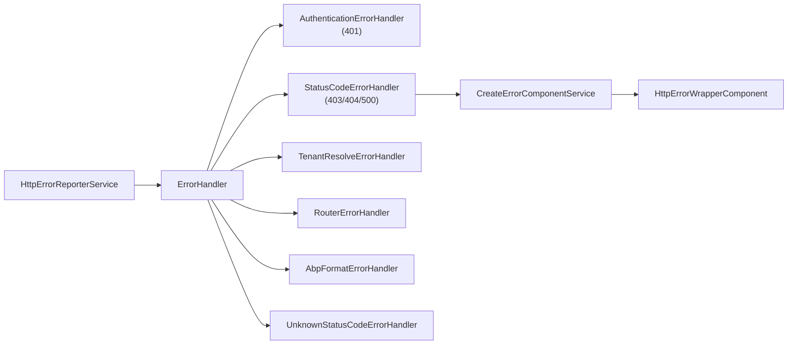

The Angular theme layer is split into two packages. `@abp/ng.theme.shared` is theme-agnostic — every theme (Basic, Lepton, Lepton-X) reuses its modal, confirmation, toaster, breadcrumb, loader bar, http-error wrapper, and global error handler. `@abp/ng.theme.basic` is the default Bootstrap-based theme implementation: three layouts (application, account, empty), the top-bar (`NavItemsComponent`, `LanguagesComponent`, `CurrentUserComponent`), and the lazy CSS loading machinery. Sources: [`npm/ng-packs/packages/theme-shared/`](https://github.com/abpframework/abp/tree/dev/npm/ng-packs/packages/theme-shared) and [`packages/theme-basic/`](https://github.com/abpframework/abp/tree/dev/npm/ng-packs/packages/theme-basic).

## Package metadata

| NPM name | Source | Module class | Provider function |
| --- | --- | --- | --- |
| `@abp/ng.theme.shared` | `packages/theme-shared/src/lib/` | `ThemeSharedModule` | `provideThemeShared()` |
| `@abp/ng.theme.basic` | `packages/theme-basic/src/lib/` | `BaseThemeBasicModule` / `ThemeBasicModule` | `provideThemeBasicConfig()` |

Runtime dependencies of `theme-shared`: `@ng-bootstrap/ng-bootstrap`, `@swimlane/ngx-datatable`, `bootstrap`, `@fortawesome/fontawesome-free`, `@ngx-validate/core`, `@popperjs/core`. `theme-basic` adds `@abp/ng.account.core`.

## `@abp/ng.theme.shared`

### Component inventory

`packages/theme-shared/src/lib/components/`:

| Folder | Component | Selector | Role |
| --- | --- | --- | --- |
| `breadcrumb` | `BreadcrumbComponent` | `abp-breadcrumb` | Breadcrumb wrapper consumed by layouts |
| `breadcrumb-items` | `BreadcrumbItemsComponent` | `abp-breadcrumb-items` | Renders the resolved trail using `RoutesService` |
| `button` | `ButtonComponent` | `abp-button` | Bootstrap button with `loading`, `disabled`, `buttonType` inputs |
| `card` | `CardComponent` | `abp-card` | `<abp-card>` Bootstrap card wrapper |
| `checkbox` | `FormCheckboxComponent` | `abp-checkbox` | ControlValueAccessor wrapper for checkboxes |
| `confirmation` | `ConfirmationComponent` | `abp-confirmation` | Dialog template used by `ConfirmationService` |
| `form-input` | `FormInputComponent` | `abp-form-input` | Bootstrap-styled reactive input |
| `http-error-wrapper` | `HttpErrorWrapperComponent` | (projected) | Renders the default 401/403/404/500 pages |
| `internet-connection-status` | `InternetConnectionStatusComponent` | `abp-internet-status` | Banner shown when offline |
| `loader-bar` | `LoaderBarComponent` | `abp-loader-bar` | Top-of-page progress bar driven by `HttpWaitService` |
| `loading` | `LoadingComponent` | `abp-loading` | Spinner placeholder |
| `modal` | `ModalComponent` + `ModalCloseDirective` | `abp-modal`, `[abpClose]` | Bootstrap modal with hard/soft dismiss |
| `password` | `PasswordComponent` | `abp-password` | Password input with show/hide toggle |
| `spinner` | `SpinnerComponent` | `abp-spinner` | Animated spinner |
| `toast` | `ToastComponent` | `abp-toast` | Single toast template |
| `toast-container` | `ToastContainerComponent` | `abp-toast-container` | Stack rendered by `ToasterService` |

### Directives

`directives/`:

| Selector | Purpose |
| --- | --- |
| `[abpDisabled]` | Strongly-typed `disabled` propagation to Bootstrap-style buttons |
| `[abpEllipsis]` | CSS line-clamp with tooltip on overflow |
| `[abpLoading]` | Inline loading spinner overlay |
| `ngx-datatable[default]` | Pre-configures `<ngx-datatable>` with ABP defaults (column mode, footer, messages) |
| `ngx-datatable[list]` | Adapter between `ListService` and `<ngx-datatable>` |
| `[abpVisible]` | Reactive `[hidden]` driven by an observable |

### Services

| Service | File | Role |
| --- | --- | --- |
| `ConfirmationService` | `services/confirmation.service.ts` | Programmatic confirmations using `ContentProjectionService` to mount `ConfirmationComponent` into the body |
| `ToasterService` | `services/toaster.service.ts` | Push toasts (`success`, `error`, `info`, `warn`); subscribed by every form-submit success path |
| `ModalRefService` | `components/modal/modal-ref.service.ts` | Tracks open `<abp-modal>` instances for `dismissAll(mode)` |
| `NavItemsService` | `services/nav-items.service.ts` | Top-bar item registry (`add`, `patch`, `remove`) |
| `UserMenuService` | `services/user-menu.service.ts` | User-menu (avatar) item registry |
| `AbstractMenuService` | `services/abstract-menu.service.ts` | Base class for the above two |
| `PageAlertService` | `services/page-alert.service.ts` | Top-of-page banner alerts |
| `StatusCodeErrorHandlerService` | `services/status-code-error-handler.service.ts` | Default 401/403/404/500 reactions |
| `AuthenticationErrorHandlerService` | `services/authentication-error-handler.service.ts` | 401 → redirect to login |
| `TenantResolveErrorHandlerService` | `services/tenant-resolve-error-handler.service.ts` | `TenantNotFound` toaster |
| `RouterErrorHandlerService` | `services/router-error-handler.service.ts` | NavigationError → toast |
| `AbpFormatErrorHandlerService` | `services/abp-format-error-handler.service.ts` | Decodes ABP `IBusinessException` payloads |
| `UnknownStatusCodeErrorHandlerService` | `services/unknown-status-code-error-handler.service.ts` | Fallback handler |
| `CreateErrorComponentService` | `services/create-error-component.service.ts` | Mounts `HttpErrorWrapperComponent` for fatal errors |

### `ConfirmationService`

Mounts a single `ConfirmationComponent` into `document.body` via `ContentProjectionService` (from `@abp/ng.core`). Public API:

```typescript
confirmation.info(message,  title, options?): Observable<Confirmation.Status>
confirmation.success(...)  // green icon
confirmation.warn(...)     // amber icon
confirmation.error(...)    // red icon
```

Returns `'confirm' | 'reject' | 'dismiss'` so callers can chain side effects:

```typescript
this.confirmation.warn(
  'AbpIdentity::UserDeletionConfirmationMessage', 'AbpIdentity::AreYouSure',
  { messageLocalizationParams: [user.userName] },
).subscribe(status => {
  if (status === Confirmation.Status.confirm) this.delete(user.id);
});
```

### Error handlers and `HttpErrorWrapperComponent`

`handlers/error.handler.ts` subscribes to `HttpErrorReporterService.reporter$` (from `@abp/ng.core`) and dispatches the error to the right handler:



`HttpErrorWrapperComponent` renders one of four templates (401, 403, 404, 500) — applications can replace it by overriding `HTTP_ERROR_CONFIG` (`tokens/http-error.token.ts`).

### Adapters and tokens

| Folder | Symbol | Purpose |
| --- | --- | --- |
| `adapters/date.adapter.ts` | `NgbDateNativeAdapter` | Maps `Date` ↔ `NgbDateStruct` |
| `adapters/datepicker-i18n.adapter.ts` | `NgbDatepickerI18n` impl | Localised month/day names via `LocalizationService` |
| `adapters/timepicker-i18n.adapter.ts` | `NgbTimepickerI18n` impl | Localised time picker |
| `tokens/confirmation-icons.token.ts` | `CONFIRMATION_ICONS` | Override the icon set used by `ConfirmationComponent` |
| `tokens/http-error.token.ts` | `HTTP_ERROR_CONFIG` | Override 401/403/404/500 templates and titles |
| `tokens/logo.token.ts` | `LOGO_URL` | Default logo location consumed by themes |
| `tokens/ngx-datatable-messages.token.ts` | `NGX_DATATABLE_MESSAGES` | Localised messages for the datatable |
| `tokens/suppress-unsaved-changes-warning.token.ts` | `SUPPRESS_UNSAVED_CHANGES_WARNING` | Disable the form-dirty `beforeunload` warning |
| `tokens/theme-change.token.ts` | `THEME_CHANGE_STREAM` | Emits when the theme toggles light/dark |
| `tokens/append-content.token.ts` | `APPEND_CONTENT` | Hook for layouts to project arbitrary content |

### `provideThemeShared()`

`providers/theme-shared-config.provider.ts` returns an `EnvironmentProviders` bundle that:

1. Subscribes the error-handler pipeline to `HttpErrorReporterService`.
2. Registers `NgbModal`, `NgbDatepickerConfig` defaults.
3. Provides the `RouteHandler` overrides for `tenant-not-found`.
4. Wires `LOGO_URL`, default `NGX_DATATABLE_MESSAGES`, and the theme-change stream.

## `@abp/ng.theme.basic`

### Layouts

`packages/theme-basic/src/lib/components/`:

| Layout | Component | Use |
| --- | --- | --- |
| Application | `ApplicationLayoutComponent` | The main authenticated chrome — sidebar/top-bar + `<router-outlet>` |
| Account | `AccountLayoutComponent` | Public auth pages — centered card with logo, tenant box, language switcher |
| Empty | `EmptyLayoutComponent` | Full-bleed surface for landing pages or full-screen wizards |

Layouts are registered in `DYNAMIC_LAYOUTS_TOKEN` via `provideThemeBasicConfig()`, so `DynamicLayoutComponent` (from `@abp/ng.core`) can render them by key (`eLayoutType.application`, `account`, `empty`).

### Chrome components

| Component | Selector | Role |
| --- | --- | --- |
| `LogoComponent` | `abp-logo` | Renders `LOGO_URL`, optional link |
| `AuthWrapperComponent` | `abp-auth-wrapper` | Account-layout login chrome backed by `AuthWrapperService` |
| `TenantBoxComponent` | `abp-tenant-box` | Tenant switcher rendered inside `AuthWrapperComponent` |
| `NavItemsComponent` | `abp-nav-items` | Top-bar items (right side) registered through `NavItemsService` |
| `RoutesComponent` | `abp-routes` | Sidebar nav from `RoutesService` |
| `CurrentUserComponent` | `abp-current-user` | Avatar + dropdown (manage profile, logout) |
| `LanguagesComponent` | `abp-languages` | Language switcher driven by `LocalizationService.languages$` |
| `PageAlertContainerComponent` | `abp-page-alert-container` | Renders banners pushed by `PageAlertService` |
| `ValidationErrorComponent` | `abp-validation-error` | Connects `@ngx-validate/core` to localized error messages |

### Providers

`providers/`:

| File | Purpose |
| --- | --- |
| `theme-basic-config.provider.ts` | `provideThemeBasicConfig()` — wires layouts, nav contributors, default styles |
| `nav-item.provider.ts` | Adds default top-bar items (language switcher, current user) |
| `user-menu.provider.ts` | Adds default user-menu items (Manage Profile, Sign out) |
| `styles.provider.ts` | Loads the Basic-theme Bootstrap variant via `LazyStyleHandler` |

### `LazyStyleHandler`

`handlers/lazy-style.handler.ts` dynamically appends `<link rel="stylesheet">` for theme CSS bundles (so theme switching at runtime is possible without reload). It is what `@abp/ng.schematics:change-theme` ultimately registers when swapping in Lepton-X.

### `LayoutService`

`services/layout.service.ts` exposes view-state observables consumed by the application layout (sidebar collapsed state, viewport size, RTL/LTR direction).

## Bootstrap

```typescript
// app.config.ts
import { provideThemeShared } from '@abp/ng.theme.shared';
import { provideThemeBasicConfig } from '@abp/ng.theme.basic';

export const appConfig: ApplicationConfig = {
  providers: [
    /* provideAbpCore(...), provideAbpOAuth(), … */
    provideThemeShared(),
    provideThemeBasicConfig({
      logoUrl: 'assets/logo.svg',
      smallLogoUrl: 'assets/logo-small.svg',
    }),
  ],
};
```

The order matters: `provideThemeShared()` registers the error pipeline, `provideThemeBasicConfig(...)` plugs the Basic-theme layouts into the dynamic-layout registry declared in core.

## Customising the top-bar

```typescript
provideAppInitializer(() => {
  inject(NavItemsService).add([{
    id: 'MyApp.Notifications',
    order: 90,
    component: NotificationsBellComponent,   // standalone component
  }]);
  inject(UserMenuService).add([{
    id: 'MyApp.Logout',
    order: 1000,
    text: 'AbpAccount::Logout',
    action: () => inject(AuthService).logout().subscribe(),
  }]);
});
```

`AbstractMenuService` (the base of `NavItemsService` / `UserMenuService`) lives in `theme-shared/src/lib/services/abstract-menu.service.ts`. Both registries are reactive — `items$` observables push the current item list to the components rendering them.

## Cross-references

<CardGroup cols={2}>
  <Card title="Core error pipeline" href="/angular/core">
    `HttpErrorReporterService`, `HttpWaitService`, `ContentProjectionService`.
  </Card>
  <Card title="Account UI uses AccountLayout" href="/angular/account">
    Login/register routes render inside `AccountLayoutComponent`.
  </Card>
  <Card title="Theme swap" href="/angular/schematics-and-generators">
    `change-theme` schematic switches Basic ↔ Lepton ↔ LeptonX.
  </Card>
  <Card title="Basic theme backend" href="/modules/basic-theme">
    The MVC counterpart of `@abp/ng.theme.basic`.
  </Card>
</CardGroup>
