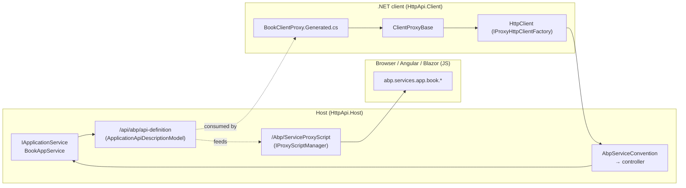
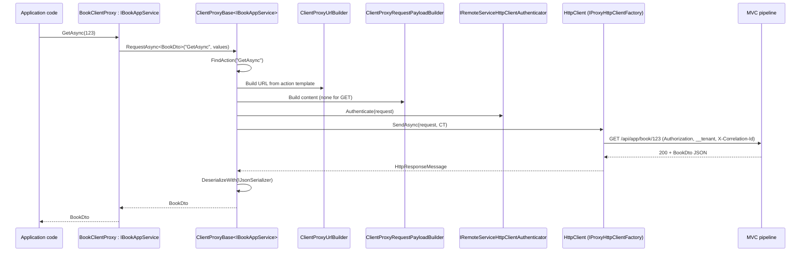

ABP generates client SDKs from server-side application services in two complementary flavours. The **dynamic JavaScript proxy** is served by the host at `/Abp/ServiceProxyScript` and produced on-demand from `IProxyScriptManager` (jQuery generator out of the box); JavaScript callers invoke `abp.services.app.book.getAsync(...)` without any code generation. The **static C# client proxy** is a `partial class` that derives from `ClientProxyBase<TService>` — generated by the `abp generate-proxy` CLI from the same `ApplicationApiDescriptionModel` JSON exposed at `/api/abp/api-definition` — and is registered with `[Dependency(ReplaceServices = true)] [ExposeServices(typeof(TService))]` so .NET callers consume the interface and the proxy makes HTTP calls under the hood.

## Overview



## Dynamic JS proxy

### Controller

`framework/src/Volo.Abp.AspNetCore.Mvc/Volo/Abp/AspNetCore/Mvc/ProxyScripting/AbpServiceProxyScriptController.cs`:

```csharp
[Area("Abp"), Route("Abp/ServiceProxyScript"), DisableAuditing,
 RemoteService(false), ApiExplorerSettings(IgnoreApi = true)]
public class AbpServiceProxyScriptController : AbpController
{
    [HttpGet]
    [Produces(MimeTypes.Application.Javascript, MimeTypes.Text.Plain)]
    public virtual ActionResult GetAll(ServiceProxyGenerationModel model)
    {
        model.Normalize();
        var script = ProxyScriptManager.GetScript(model.CreateOptions());
        return Content(
            Options.MinifyGeneratedScript == true
                ? JavascriptMinifier.Minify(script)
                : script,
            MimeTypes.Application.Javascript);
    }
}
```

`ServiceProxyGenerationModel` (`Mvc/ProxyScripting/ServiceProxyGenerationModel.cs`) accepts `?type=jquery&modules=app|account&controllers=Book&actions=GetList`. The generator pipeline lives in `Volo.Abp.Http`:

| Component | File | Purpose |
| --- | --- | --- |
| `IProxyScriptManager` / `ProxyScriptManager` | `Volo.Abp.Http/Volo/Abp/Http/ProxyScripting/ProxyScriptManager.cs` | Looks up the generator by name. |
| `IProxyScriptManagerCache` / `ProxyScriptManagerCache.cs` | same folder | Caches generated scripts by hash. |
| `ProxyScriptingModel.cs` | same folder | Generator inputs. |
| `IProxyScriptGenerator` | `ProxyScripting/Generators/IProxyScriptGenerator.cs` | Generator contract. |
| `JQueryProxyScriptGenerator` | `ProxyScripting/Generators/JQuery/JQueryProxyScriptGenerator.cs` | Default generator emitting `abp.ajax`-based JS. |
| `DynamicJavaScriptProxyOptions` | `ProxyScripting/Generators/JQuery/DynamicJavaScriptProxyOptions.cs` | `DisableModule("abp")` etc. |
| `ParameterBindingSources.cs` | `ProxyScripting/Generators/` | Maps MVC binding sources to JS argument positions. |
| `ProxyScriptingHelper.cs` / `ProxyScriptingJsFuncHelper.cs` | same folder | Helpers used by all generators. |

`AbpAspNetCoreMvcOptions.MinifyGeneratedScript` (auto-set to `true` in production by `AbpAspNetCoreMvcModule.PostConfigure`) controls minification through `IJavascriptMinifier`.

### Configuration

```csharp
Configure<DynamicJavaScriptProxyOptions>(options =>
{
    options.DisableModule("abp");     // ABP module already shipped by @abp/core npm
    options.DisableModule("identity"); // when the app uses the Angular SDK
});
```

`AbpAspNetCoreMvcModule.ConfigureServices` already disables the `abp` module by default.

### Layout integration

In MVC apps, the script is referenced from `_Layout.cshtml`:

```html
<script src="~/Abp/ServiceProxyScript?type=jquery"></script>
```

The output exposes a hierarchy under `abp.services.<remoteServiceName>.<controller>.<action>` that returns a jQuery promise.

## Application API description

Both proxies rely on `ApplicationApiDescriptionModel` (under `Volo.Abp.Http.Modeling`). It is produced by `AspNetCoreApiDescriptionModelProvider` (`framework/src/Volo.Abp.AspNetCore.Mvc/Volo/Abp/AspNetCore/Mvc/AspNetCoreApiDescriptionModelProvider.cs`) which walks MVC's `IApiDescriptionGroupCollectionProvider`, filters by `AspNetCoreApiDescriptionModelProviderOptions`, and produces a JSON-serialisable model of every conventional/remote-service action.

### `/api/abp/api-definition`

`Mvc/ApiExploring/AbpApiDefinitionController.cs`:

| Method | Route | Returns |
| --- | --- | --- |
| `GetAsync(includeTypes)` | `GET /api/abp/api-definition` | `ApplicationApiDescriptionModel` |
| `GetForModelAsync` | same with `?includeTypes=true` | Adds parameter type info needed for proxy generation |

`AbpNoContentApiDescriptionProvider` (same folder) injects 204 responses into the API description for `Task`/`void` actions. `AbpRemoteServiceApiDescriptionProvider(.Options).cs` injects 400/401/403/404/500/501 → `RemoteServiceErrorResponse` so generated proxies know about the error envelope.

## Static C# client proxies

### Base class

`framework/src/Volo.Abp.Http.Client/Volo/Abp/Http/Client/ClientProxying/ClientProxyBase.cs` is the runtime for every generated `partial class`. It is `ITransientDependency` and pulls everything it needs from `LazyServiceProvider`:

| Service | Purpose |
| --- | --- |
| `IClientProxyApiDescriptionFinder` | Lookup action metadata by `methodName`. |
| `ICancellationTokenProvider` | Forward request cancellation. |
| `ICorrelationIdProvider` + `AbpCorrelationIdOptions` | Propagate `X-Correlation-Id`. |
| `ICurrentTenant` | Send `__tenant` header / route. |
| `ICurrentTimezoneProvider` | Send `__abpTimezone` header. |
| `IProxyHttpClientFactory` | Get the `HttpClient` for the remote service name. |
| `IRemoteServiceConfigurationProvider` | Look up base URL etc. |
| `IRemoteServiceHttpClientAuthenticator` | Attach bearer/cookie auth. |
| `ClientProxyRequestPayloadBuilder` + `ClientProxyUrlBuilder` | Translate the typed call into URL/body. |
| `ICurrentApiVersionInfo` | Per-call API version selection. |
| `ILocalEventBus` | Publish `HttpRequestSentEventData`, etc. |
| `IJsonSerializer` + optional `AbpSystemTextJsonSerializerOptions` | Serialise/deserialise. |

Protected entry points:

```csharp
protected Task RequestAsync(string methodName, ClientProxyRequestTypeValue? arguments = null);
protected Task<T> RequestAsync<T>(string methodName, ClientProxyRequestTypeValue? arguments = null);
protected Task<IRemoteStreamContent?> RequestStreamAsync(string methodName, ClientProxyRequestTypeValue? args = null);
```

`ClientProxyRequestTypeValue` is a strongly-typed dictionary mapping parameter type → instance.

### Helpers

| Type | File | Use |
| --- | --- | --- |
| `ClientProxyRequestContext` | `ClientProxying/ClientProxyRequestContext.cs` | Captures method + parameters + action description. |
| `ClientProxyUrlBuilder` | `ClientProxying/ClientProxyUrlBuilder.cs` | Builds the URL from the action's route template + query string. |
| `ClientProxyRequestPayloadBuilder` | `ClientProxying/ClientProxyRequestPayloadBuilder.cs` | Builds `HttpContent` (form, JSON, multipart). |
| `IObjectToPath` / `IObjectToQueryString` / `IObjectToFormData` | same folder | Strategy interfaces used by the builders. |
| `ApiVersionInfo` / `CurrentApiVersionInfo` / `ICurrentApiVersionInfo` | same folder | Per-call version state. |
| `ExtraPropertyDictionaryConverts/` | folder | JSON converters for object-extension properties. |

### `IClientProxyApiDescriptionFinder`

`ClientProxying/ClientProxyApiDescriptionFinder.cs` is `ISingletonDependency` and loads the `ApplicationApiDescriptionModel` JSON from the virtual file system (embedded inside the `HttpApi.Client` assembly by the generator). It exposes:

```csharp
ActionApiDescriptionModel? FindAction(string methodName);
ApplicationApiDescriptionModel GetApiDescription();
```

`FindAction` matches the proxy's `nameof(GetAsync)` against the `Name` field; that's why generated methods use `nameof` rather than hard-coded strings — refactoring the interface's method names still works as long as the generator runs again.

### A generated proxy

`framework/src/Volo.Abp.AspNetCore.Mvc.Client.Common/ClientProxies/AbpApplicationConfigurationClientProxy.Generated.cs`:

```csharp
[Dependency(ReplaceServices = true)]
[ExposeServices(typeof(IAbpApplicationConfigurationAppService),
                typeof(AbpApplicationConfigurationClientProxy))]
public partial class AbpApplicationConfigurationClientProxy
    : ClientProxyBase<IAbpApplicationConfigurationAppService>,
      IAbpApplicationConfigurationAppService
{
    public virtual async Task<ApplicationConfigurationDto> GetAsync(ApplicationConfigurationRequestOptions options)
    {
        return await RequestAsync<ApplicationConfigurationDto>(
            nameof(GetAsync),
            new ClientProxyRequestTypeValue { { typeof(ApplicationConfigurationRequestOptions), options } });
    }
}
```

Companion `.cs` (non-Generated) is the place to hand-customise the proxy without losing edits on next regeneration.

The Common package also ships:

| Proxy | Service interface | Path |
| --- | --- | --- |
| `AbpApplicationConfigurationClientProxy` | `IAbpApplicationConfigurationAppService` | `/api/abp/application-configuration` |
| `AbpApplicationLocalizationClientProxy` | `IAbpApplicationLocalizationAppService` | `/api/abp/application-localization` |
| `AbpTenantClientProxy` | `IAbpTenantAppService` | `/api/abp/multi-tenancy/tenants/by-name`, `/.../by-id` |

These are the proxies used by Angular/Blazor WASM hosts and by the MVC client (`AbpAspNetCoreMvcClientModule`) to bootstrap configuration without copying source from the server.

## Remote service options

The route base URL, default headers and auth scheme are configured on `AbpRemoteServiceOptions` (from `Volo.Abp.Http.Client`):

```csharp
Configure<AbpRemoteServiceOptions>(options =>
{
    options.RemoteServices.Default = new RemoteServiceConfiguration("https://api.mycompany.io/")
    {
        UseCurrentAccessToken = true.ToString()
    };
    options.RemoteServices["BookStore"] =
        new RemoteServiceConfiguration("https://bookstore-api.mycompany.io/");
});
```

`ClientProxyBase` resolves `IRemoteServiceConfigurationProvider` per call. The remote service name on the proxy is the `ConventionalControllerSetting.RemoteServiceName` from the server side.

## Replacing services — the `Mvc.Client` module

`Volo.Abp.AspNetCore.Mvc.Client.Common` wires `Remote*` providers that delegate framework abstractions to HTTP calls when running in a client process (no shared database):

| Service | Replaces | Backed by |
| --- | --- | --- |
| `RemoteFeatureChecker` | `IFeatureChecker` | `AbpApplicationConfigurationDto.Features` (cached). |
| `RemotePermissionChecker` | `IPermissionChecker` | Cached configuration. |
| `RemoteSettingProvider` | `ISettingProvider` | Cached configuration. |
| `RemoteLanguageProvider` | `ILanguageProvider` | Localization configuration. |
| `RemoteLocalizationContributor` / `RemoteExternalLocalizationStore` | localisation pipeline | `AbpApplicationLocalizationClientProxy`. |
| `RemoteDynamicClaimsPrincipalContributor` | claims principal contributor | Pulls dynamic claims from server. |
| `MvcRemoteTenantStore` | `ITenantStore` | `AbpTenantClientProxy`. |
| `MvcCachedApplicationConfigurationClient` | `ICachedApplicationConfigurationClient` | Caches `ApplicationConfigurationDto` per user/tenant. |

`MvcCurrentApplicationConfigurationCacheResetEventHandler` listens for `CurrentApplicationConfigurationCacheResetEventData` (published by the server when permissions change) and evicts the local cache so the MVC host sees updated permissions on the next request.

## Sequence — a typed C# call



## Companion CLI

`abp generate-proxy -t csharp -m bookstore -u https://localhost:44300/` reads `/api/abp/api-definition?includeTypes=true` from the running host and writes the `*.Generated.cs` files into `MyApp.Application.HttpApi.Client/ClientProxies/`. Likewise `abp generate-proxy -t ng` produces Angular services. The CLI is documented under [CLI: generate-proxy](/cli/generate-proxy); the dynamic C# proxy fallback (no codegen) is documented under [Dynamic C# client proxy flow](/flows/dynamic-c-sharp-client-proxy).

## See also

<CardGroup cols={2}>
  <Card title="MVC integration" href="/aspnetcore/mvc-integration">
    `AbpServiceConvention` server-side that defines the routes consumed by proxies.
  </Card>
  <Card title="Remote services" href="/comm/remote-services">
    `AbpRemoteServiceOptions`, configuration resolution, multi-host scenarios.
  </Card>
  <Card title="HTTP client" href="/comm/http-client">
    Authentication and policies applied by `HttpClientFactory`.
  </Card>
  <Card title="Dynamic C# proxy flow" href="/flows/dynamic-c-sharp-client-proxy">
    The reflection-based fallback when no generated `*ClientProxy.cs` exists.
  </Card>
</CardGroup>
