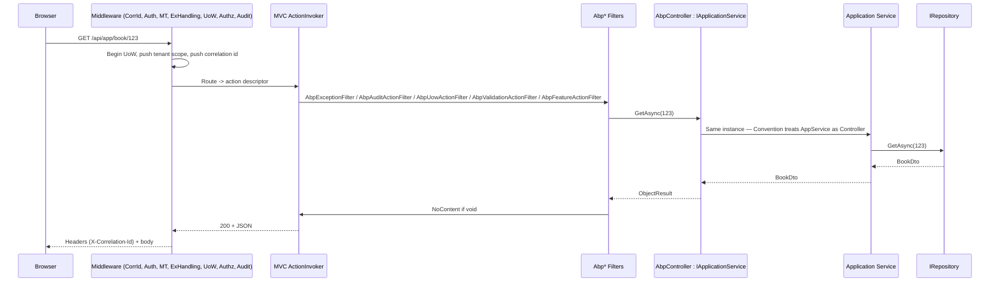

`framework/src/Volo.Abp.AspNetCore.Mvc/` is where ABP plugs DDD-style application services into ASP.NET Core MVC. The module turns every `IApplicationService` interface into an HTTP-exposed controller (via `AbpServiceConvention`), forces controllers and view components to be DI-resolved, adds filters for auditing, validation, exception handling, unit of work and features, registers ABP-flavoured model binders for `DateTime`, extra-property dictionaries and remote stream content, and exposes the `ApplicationConfiguration` and `ApplicationLocalization` HTTP endpoints that the client-side proxies consume.

## Module composition

`Volo/Abp/AspNetCore/Mvc/AbpAspNetCoreMvcModule.cs` (top of file shows the DependsOn list):

| `[DependsOn]` | Adds |
| --- | --- |
| `AbpAspNetCoreModule` | The base middleware/services. |
| `AbpLocalizationModule` | `AddViewLocalization`, `AddDataAnnotationsLocalization`. |
| `AbpApiVersioningAbstractionsModule` | `ApiVersion` types used by `ConventionalControllerSetting`. |
| `AbpAspNetCoreMvcContractsModule` | Application configuration DTOs. |
| `AbpUiNavigationModule` | Menu providers. |
| `AbpGlobalFeaturesModule` | `[RequiresGlobalFeature]` enforcement at controller level. |
| `AbpDddApplicationModule` | `IApplicationService` interfaces. |
| `AbpJsonSystemTextJsonModule` | Default JSON formatter. |

### PreConfigureServices

```csharp
DynamicProxyIgnoreTypes.Add<ControllerBase>();
DynamicProxyIgnoreTypes.Add<PageModel>();
DynamicProxyIgnoreTypes.Add<ViewComponent>();

context.Services.AddConventionalRegistrar(new AbpAspNetCoreMvcConventionalRegistrar());
```

The three `DynamicProxyIgnoreTypes` entries prevent Castle from intercepting MVC base classes — those are already wrapped by MVC's action invoker and filters. `AbpAspNetCoreMvcConventionalRegistrar` (`Mvc/DependencyInjection/AbpAspNetCoreMvcConventionalRegistrar.cs`) registers controllers / view components / page models with their concrete types as transient services, which is what `AddControllersAsServices` requires.

### ConfigureServices (highlights)

- `Configure<AbpApiDescriptionModelOptions>` ignores `IAsyncActionFilter`, `IFilterMetadata`, `IActionFilter` so the api-description model surfaced via `/api/abp/api-definition` skips internal filter interfaces.
- `Configure<AbpRemoteServiceApiDescriptionProviderOptions>` adds 401/403/400/404/500/501 → `RemoteServiceErrorResponse` to the supported responses list so generated client proxies know to deserialise errors.
- `PostConfigure<AbpAspNetCoreMvcOptions>` auto-enables `MinifyGeneratedScript` in production.
- `AddMvcCore(options => options.Filters.Add(new AbpAutoValidateAntiforgeryTokenAttribute()))` makes anti-forgery a global default.
- `AddMvc()` + `AddDataAnnotationsLocalization` + `AddViewLocalization` — DataAnnotation localizer falls back through `AbpMvcDataAnnotationsLocalizationOptions.AssemblyResources` so each module's DTOs use its own `LocalizationResource`.
- `AddControllersAsServices()` and `AddViewComponentsAsServices()` route activation through the ABP container, enabling property injection.
- `Services.Replace(ServiceDescriptor.Singleton<IPageModelActivatorProvider, ServiceBasedPageModelActivatorProvider>())` makes Razor Pages DI-activated as well.
- `partManager.FeatureProviders.Add(new AbpConventionalControllerFeatureProvider(application))` — the feature provider hands MVC the dynamically discovered controllers from `IApplicationService` assemblies.
- `Services.Replace(ServiceDescriptor.Singleton<IValidationAttributeAdapterProvider, AbpValidationAttributeAdapterProvider>())` — patches DataAnnotations to honour dynamic max-length/range/string-length values (from `AbpAspNetCoreMvcModule.cs`).
- `TryAddEnumerable(ServiceDescriptor.Transient<IActionDescriptorProvider, AbpMvcActionDescriptorProvider>())` adds an `IActionDescriptorProvider` that knows about ABP attributes (e.g. `[RemoteService(false)]`).
- `AddAbpOptions<MvcOptions>` calls `MvcOptions.AddAbp(...)` (defined in `Mvc/AbpMvcOptionsExtensions.cs`) which wires every ABP filter + model binder + convention into MVC.
- `Configure<AbpEndpointRouterOptions>` adds the default routes:

```csharp
endpointContext.Endpoints.MapControllerRoute("defaultWithArea", "{area}/{controller=Home}/{action=Index}/{id?}");
endpointContext.Endpoints.MapControllerRoute("default", "{controller=Home}/{action=Index}/{id?}").WithStaticAssets();
endpointContext.Endpoints.MapRazorPages().WithStaticAssets();
```

- `Configure<DynamicJavaScriptProxyOptions>(o => o.DisableModule("abp"))` prevents the legacy JS proxy from emitting the `abp.*` module which is now provided by `@abp/core`.
- `Services.Replace(ServiceDescriptor.Singleton<IHttpResponseStreamWriterFactory, AbpMemoryPoolHttpResponseStreamWriterFactory>())` uses a pooled writer that reduces LOH allocations on large responses.

### PostConfigureServices

`ApplicationPartSorter.Sort(...)` re-orders MVC's `ApplicationPartManager` to match the module dependency graph so that controller overrides registered in a downstream module always win. `DynamicProxyIgnoreTypes.Add(...)` then disables Castle interception for every conventional-controller type (they are intercepted by MVC filters instead).

### OnApplicationInitialization

`AddApplicationParts(context)` walks plug-in modules, conventional-controller assemblies and `IAbpModule.GetAdditionalAssemblies()` and adds each as an MVC `ApplicationPart`. `CheckLibs(context)` consults `IAbpMvcLibsService` (`Mvc/Libs/`) to emit a developer-friendly error page when the embedded `wwwroot/libs/*` files were not extracted (typical CI mistake).

## AbpController hierarchy

Both base classes live in `Mvc/AbpController.cs` and `Mvc/AbpControllerBase.cs`. They differ only in their MVC ancestor (`Controller` vs `ControllerBase`) — pick `AbpController` for view-returning MVC, `AbpControllerBase` for Web APIs.

| Property | Type | Backing service |
| --- | --- | --- |
| `LazyServiceProvider` | `IAbpLazyServiceProvider` | DI property-injected, used for every other accessor below. |
| `UnitOfWorkManager` | `IUnitOfWorkManager` | `Volo.Abp.Uow` |
| `ObjectMapper` | `IObjectMapper` | Honours `ObjectMapperContext` for per-action mapper context selection. |
| `GuidGenerator` | `IGuidGenerator` | Falls back to `SimpleGuidGenerator.Instance`. |
| `Logger` | `ILogger` | Created from the controller type's full name. |
| `CurrentUser` | `ICurrentUser` | Identity claims facade. |
| `CurrentTenant` | `ICurrentTenant` | Active tenant scope. |
| `AuthorizationService` | `IAuthorizationService` | Standard ASP.NET Core auth. |
| `CurrentUnitOfWork` | `IUnitOfWork?` | `UnitOfWorkManager.Current`. |
| `Clock` | `IClock` | Time abstraction. |
| `ModelValidator` | `IModelStateValidator` | Used by `ValidateModel()` override. |
| `FeatureChecker` | `IFeatureChecker` | Tenant feature gates. |
| `AppUrlProvider` | `IAppUrlProvider` | Used by `RedirectSafelyAsync` (AbpController only). |
| `StringLocalizerFactory` | `IStringLocalizerFactory` | Source for `L`. |
| `L` | `IStringLocalizer` | Default localizer; honours `LocalizationResource`. |
| `LocalizationResource` | `Type?` | Defaults to `typeof(DefaultResource)`; setting it resets `L`. |
| `AppliedCrossCuttingConcerns` | `List<string>` | Marker list consumed by `IAvoidDuplicateCrossCuttingConcerns`. |

`AbpController.RedirectSafelyAsync(returnUrl, returnUrlHash)` runs the return URL through `Url.IsLocalUrl` and `IAppUrlProvider.IsRedirectAllowedUrlAsync` to mitigate open-redirect attacks.

`AbpViewComponent` (`Mvc/AbpViewComponent.cs`) mirrors `AbpController` for view component scenarios — same lazy property pattern.

## Auto API controllers from application services

ABP's flagship MVC feature is auto-generation of controllers from `IApplicationService` interfaces. Three pieces collaborate:

1. **`AbpConventionalControllerOptions`** (`Mvc/Conventions/AbpConventionalControllerOptions.cs`) holds the registration list and per-app options:

   | Property | Default | Use |
   | --- | --- | --- |
   | `ConventionalControllerSettings` | empty | Add via `Create(Assembly, optionsAction)`. |
   | `FormBodyBindingIgnoredTypes` | `[IFormFile, IRemoteStreamContent]` | Excluded from `[FromBody]` inference. |
   | `UseV3UrlStyle` | `false` | Re-enables ABP v3 URL style globally. |
   | `IgnoredUrlSuffixesInControllerNames` | `["Integration"]` | Suffixes trimmed from controller URL segments. |

2. **`ConventionalControllerSetting`** (`Mvc/Conventions/ConventionalControllerSetting.cs`) is created per assembly:

   | Property | Default | Use |
   | --- | --- | --- |
   | `Assembly` | required | Scanned for `IRemoteService` types. |
   | `RootPath` | `ModuleApiDescriptionModel.DefaultRootPath` (`"app"`) | First URL segment. |
   | `RemoteServiceName` | `Default` | Logical service-group name for proxy generation. |
   | `UseV3UrlStyle` | `null` | Overrides global. |
   | `TypePredicate` | `null` | Custom filter. |
   | `ApplicationServiceTypes` | `All` | One of `All` / `ApplicationServices` / `IntegrationServices`. |
   | `ControllerModelConfigurer` | `null` | Mutate `ControllerModel` after defaults applied. |
   | `UrlControllerNameNormalizer` / `UrlActionNameNormalizer` | `null` | Per-controller/action URL token rewriters. |
   | `ApiVersions` / `MvcApiVersioningConfigurer` | `[]` / `null` | Adds API version routes. |

   `Initialize()` scans the assembly for public, non-abstract, non-generic types that (a) are not opted out via `[RemoteService(false)]` and (b) implement `IRemoteService`, applying the `ApplicationServiceTypes` filter through `IntegrationServiceAttribute.IsDefinedOrInherited(type)`.

3. **`AbpServiceConvention`** (`Mvc/Conventions/AbpServiceConvention.cs`) implements `IApplicationModelConvention`. For each discovered controller it:
   - Removes duplicate registrations.
   - Skips integration services when `AbpAspNetCoreMvcOptions.ExposeIntegrationServices == false`.
   - Calls `controller.ControllerName.RemovePostFix(ApplicationService.CommonPostfixes)` so `BookAppService` becomes the `Book` controller.
   - Invokes `configuration?.ControllerModelConfigurer?.Invoke(controller)`.
   - Calls `ConfigureRemoteService` which assigns areas, route templates (via `IConventionalRouteBuilder`), HTTP verbs (action name prefix → verb: `Get*` → GET, `Create*` → POST, `Update*` → PUT, `Delete*` → DELETE, otherwise POST), parameter binding sources, and exposed API descriptions.
   - Plain MVC controllers can also opt in by decorating with `[RemoteService]` (`Mvc/RemoteServiceAttribute.cs` in `Volo.Abp.Http`); the convention checks `ImplementsRemoteServiceInterface` first, then `RemoteServiceAttribute.IsEnabledFor(type)` for opt-in.

### Registering an assembly

```csharp
Configure<AbpAspNetCoreMvcOptions>(options =>
{
    options.ConventionalControllers.Create(
        typeof(MyApplicationModule).Assembly,
        setting =>
        {
            setting.RootPath = "books";
            setting.RemoteServiceName = "BookStore";
            setting.UrlControllerNameNormalizer = ctx => ctx.ControllerName.ToLowerInvariant();
        }
    );
});
```

### `RemoteServiceAttribute` opt-out / opt-in

`Volo.Abp.Http/Volo/Abp/Http/RemoteServiceAttribute.cs` (referenced from `AbpServiceConvention`) supports `IsEnabledFor(Type)` so a controller can be exposed/hidden per request context, and `IsMetadataEnabled` to control API-description visibility independently.

## Request flow



For service-style controllers, the application service **is** the controller; for view-style controllers, the `AbpController` simply orchestrates via `LazyServiceProvider` and returns `IActionResult`.

## MVC filters

`Mvc/AbpMvcOptionsExtensions.cs` exposes `MvcOptions.AddAbp(IServiceCollection)` which calls `AddPageFilters`, `AddActionFilters`, `AddModelBinders`, `AddMetadataProviders` and `AddFormatters`. The added filters are:

| Filter | File | Trigger |
| --- | --- | --- |
| `AbpAutoValidateAntiforgeryTokenAttribute` | `AntiForgery/AbpAutoValidateAntiforgeryTokenAttribute.cs` | Global; enforces anti-forgery on non-GET requests via `IAbpAntiForgeryManager`. |
| `AbpValidateAntiForgeryTokenAttribute` | `AntiForgery/` | Opt-in equivalent for specific actions. |
| `AbpExceptionFilter` / `AbpExceptionPageFilter` | `ExceptionHandling/` | Translates exceptions into `RemoteServiceErrorResponse`. |
| `AbpAuditActionFilter` / `AbpAuditPageFilter` | `Auditing/` | Per-action audit log entry. |
| `AbpUowActionFilter` / `AbpUowPageFilter` | `Uow/` | Opens UoW for non-Mvc-pipelined invocations (e.g. Razor Pages). |
| `AbpFeatureActionFilter` / `AbpFeaturePageFilter` | `Features/` | Enforces `[RequiresFeature]`. |
| `GlobalFeatureActionFilter` / `GlobalFeaturePageFilter` | `GlobalFeatures/` | Enforces `[RequiresGlobalFeature]`. |
| `AbpValidationActionFilter` | `Validation/AbpValidationActionFilter.cs` | Runs `IModelStateValidator`. |
| `AbpNoContentActionFilter` | `Response/AbpNoContentActionFilter.cs` | Converts null/void results to 204. |

## Model binding & content formatting

| Component | File | What it does |
| --- | --- | --- |
| `AbpDateTimeModelBinder` / `Provider` | `ModelBinding/AbpDateTimeModelBinder*.cs` | Normalises timezone using `IClock`. |
| `AbpExtraPropertiesDictionaryModelBinderProvider` | `ModelBinding/` | Binds `ExtraProperties` for object-extensions. |
| `AbpExtraPropertyModelBinder` + `ExtraPropertyBindingHelper` | `ModelBinding/` | Per-key binding for object-extension properties. |
| `AbpRemoteStreamContentModelBinder` + `Provider` | `ContentFormatters/` | Binds `IRemoteStreamContent` to `IFormFile` payloads. |
| `RemoteStreamContentOutputFormatter` | `ContentFormatters/` | Streams `IRemoteStreamContent` responses with correct content type. |
| `DynamicMaxLengthAttributeAdapter` etc. | `DataAnnotations/` | Pull max-length/range/string-length from `IOptionsMonitor` so validation respects runtime changes. |
| `AbpMvcAttributeValidationResultProvider` | `Localization/AbpMvcAttributeValidationResultProvider.cs` | Localises `ValidationResult` via the active resource. |
| `AbpValidationHtmlAttributeProvider` | `ViewFeatures/` | Emits client-side validation attributes that honour ABP dynamic limits. |

## Application configuration endpoints

The `Mvc/ApplicationConfigurations/` folder ships HTTP endpoints used by every client (Angular, Blazor WASM, MVC-on-Identity-Server) to fetch tenant- and culture-specific configuration in one round-trip:

| Controller / service | Path |
| --- | --- |
| `AbpApplicationConfigurationController` | `GET /api/abp/application-configuration` |
| `AbpApplicationLocalizationController` | `GET /api/abp/application-localization` |
| `AbpApplicationConfigurationScriptController` | `GET /Abp/ApplicationConfigurationScript` (JS bridge) |
| `AbpApplicationLocalizationScriptController` (in `Localization/`) | `GET /Abp/ApplicationLocalizationScript` |
| `AbpLanguagesController` | `POST /Abp/Languages/Switch` |
| `AbpApiDefinitionController` (in `ApiExploring/`) | `GET /api/abp/api-definition` for client proxy generators |
| `AbpServiceProxyScriptController` (in `ProxyScripting/`) | `GET /Abp/ServiceProxyScript` for the dynamic JS proxy |

The app service (`AbpApplicationConfigurationAppService.cs`) composes `ApplicationConfigurationDto` from every registered `IApplicationConfigurationContributor`, including current user, granted permissions, settings, features, current culture, object-extension metadata (`Mvc/ApplicationConfigurations/ObjectExtending/`).

## Static asset & library check

`Mvc/Libs/AbpMvcLibsService.cs` reads `AbpMvcLibsOptions.CheckLibs` (default `true` in development) and verifies every `_Libs` resource in the embedded virtual file system has a counterpart on disk. When missing, `AbpMvcLibsErrorPage.cshtml` is rendered with instructions to run `abp install-libs`. This avoids the classic "missing jQuery" 404 storm on a fresh clone.

## See also

<CardGroup cols={2}>
  <Card title="Application services" href="/ddd/application-services">
    The `IApplicationService` types that get auto-promoted to controllers.
  </Card>
  <Card title="UoW flow" href="/flows/unit-of-work-flow">
    What happens when `AbpUowActionFilter` opens a UoW.
  </Card>
  <Card title="Remote services" href="/comm/remote-services">
    Client-side proxy generation that consumes the api-definition endpoint.
  </Card>
  <Card title="Object extending" href="/ddd/object-extending">
    How `AbpExtraPropertyModelBinder` participates in entity extensions.
  </Card>
</CardGroup>
