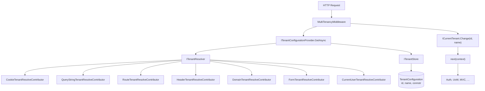

ABP's multi-tenancy integration with ASP.NET Core lives in two packages. `framework/src/Volo.Abp.AspNetCore.MultiTenancy/` carries the request-time resolution machinery: `MultiTenancyMiddleware` invokes `ITenantConfigurationProvider`, the framework-agnostic `Volo.Abp.MultiTenancy` walks `AbpTenantResolveOptions.TenantResolvers` (cookie / query / route / header / domain / current-user / form), and the middleware then opens an `ICurrentTenant.Change(...)` scope around the rest of the pipeline. `framework/src/Volo.Abp.AspNetCore.Mvc.UI.MultiTenancy/` adds an opinionated UI: a tenant-switch modal Razor page, the `AbpTenantController` that exposes `IAbpTenantAppService` over HTTP, and bundling/localization entries.

## Resolution pipeline



The two interfaces in play (from `Volo.Abp.MultiTenancy`):

| Service | Purpose |
| --- | --- |
| `ITenantConfigurationProvider` | Coordinates resolvers + store, returns `TenantConfiguration?`. |
| `ITenantResolver` | Iterates `AbpTenantResolveOptions.TenantResolvers`. |
| `ITenantResolveContext` | Carries `TenantIdOrName`, `Handled` flag, services. |
| `ITenantStore` | Looks up a `TenantConfiguration` by id / name. |
| `ITenantResolveResultAccessor` | Per-request accessor for the contributor that produced the value. |

## `MultiTenancyMiddleware`

`Volo.Abp.AspNetCore.MultiTenancy/Volo/Abp/AspNetCore/MultiTenancy/MultiTenancyMiddleware.cs`:

```csharp
public override async Task InvokeAsync(HttpContext context, RequestDelegate next)
{
    TenantConfiguration? tenant = null;
    try
    {
        tenant = await _tenantConfigurationProvider.GetAsync(saveResolveResult: true);
    }
    catch (Exception e)
    {
        Logger.LogException(e);
        if (await _options.MultiTenancyMiddlewareErrorPageBuilder(context, e)) return;
    }

    if (tenant?.Id != _currentTenant.Id)
    {
        using (_currentTenant.Change(tenant?.Id, tenant?.Name))
        {
            if (_tenantResolveResultAccessor.Result != null &&
                _tenantResolveResultAccessor.Result.AppliedResolvers.Contains(
                    QueryStringTenantResolveContributor.ContributorName))
            {
                AbpMultiTenancyCookieHelper.SetTenantCookie(context, _currentTenant.Id, _options.TenantKey);
            }

            var requestCulture = await TryGetRequestCultureAsync(context);
            if (requestCulture != null) { /* set culture + cookie */ }

            await next(context);
        }
    }
    else { await next(context); }
}
```

Highlights:

- `saveResolveResult: true` stores the applied resolver in `ITenantResolveResultAccessor.Result` so downstream code can see *how* the tenant was identified.
- If the query string resolved the tenant, the middleware persists the choice into a cookie via `AbpMultiTenancyCookieHelper.SetTenantCookie` so subsequent requests don't need the query parameter.
- The middleware also reads the tenant's `LocalizationSettingNames.DefaultLanguage` setting and applies it to `CultureInfo.CurrentCulture` / `CurrentUICulture`, marking the request via `AbpRequestLocalizationMiddleware.HttpContextItemName` so the localization middleware does not overwrite it.

### Options — `AbpAspNetCoreMultiTenancyOptions`

| Property | Default | Purpose |
| --- | --- | --- |
| `TenantKey` | `TenantResolverConsts.DefaultTenantKey` (`"__tenant"`) | Cookie/query/route/header key. |
| `MultiTenancyMiddlewareErrorPageBuilder` | Built-in HTML + JSON page | Customisable handler for tenant resolution failure. Returns `true` to short-circuit. |

The default `MultiTenancyMiddlewareErrorPageBuilder` (defined inline in `AbpAspNetCoreMultiTenancyOptions.cs`) is a fairly sophisticated function:

1. If the failure came from `CurrentUserTenantResolveContributor` alone and the user is cookie-authenticated, it signs the user out and (for non-AJAX GETs) redirects to the same URL so the next request has no user-bound tenant.
2. If the cookie tenant key is present, the cookie is cleared.
3. For AJAX requests it returns a JSON `RemoteServiceErrorResponse` with the exception message.
4. For browser requests it renders the `MultiTenancyMiddlewareErrorPage` Razor view (`MultiTenancy/Views/MultiTenancyMiddlewareErrorPage.Designer.cs`).

### Registration — `app.UseMultiTenancy()`

`Microsoft/AspNetCore/Builder/AbpAspNetCoreMultiTenancyApplicationBuilderExtensions.cs` emits a warning if `MultiTenancyMiddleware` is registered before `UseAuthentication()` when `CurrentUserTenantResolveContributor` is in the chain — because that contributor reads `httpContext.User.FindFirst(AbpClaimTypes.TenantId)`.

## Built-in resolvers

`AbpAspNetCoreMultiTenancyModule.ConfigureServices` registers four resolvers in this order:

```csharp
Configure<AbpTenantResolveOptions>(options =>
{
    options.TenantResolvers.Add(new QueryStringTenantResolveContributor());
    options.TenantResolvers.Add(new RouteTenantResolveContributor());
    options.TenantResolvers.Add(new HeaderTenantResolveContributor());
    options.TenantResolvers.Add(new CookieTenantResolveContributor());
});
```

The framework module `Volo.Abp.MultiTenancy` itself prepends `CurrentUserTenantResolveContributor` so the user's `tenantid` claim wins over everything else (matches OpenIddict bearer flows).

| Resolver | File | Source |
| --- | --- | --- |
| `QueryStringTenantResolveContributor` | `MultiTenancy/QueryStringTenantResolveContributor.cs` | `?__tenant=<id-or-name>` |
| `RouteTenantResolveContributor` | `MultiTenancy/RouteTenantResolveContributor.cs` | Route value `__tenant`. |
| `HeaderTenantResolveContributor` | `MultiTenancy/HeaderTenantResolveContributor.cs` | `__tenant` request header (used by client proxies). |
| `CookieTenantResolveContributor` | `MultiTenancy/CookieTenantResolveContributor.cs` | `Cookie: __tenant=...` |
| `FormTenantResolveContributor` | `MultiTenancy/FormTenantResolveContributor.cs` | Login form post body. |
| `DomainTenantResolveContributor(domainFormat)` | `MultiTenancy/DomainTenantResolveContributor.cs` | Subdomain match — opt-in. |
| Base: `HttpTenantResolveContributorBase` | `MultiTenancy/HttpTenantResolveContributorBase.cs` | Extracts `HttpContext` and dispatches. |

### Domain resolver

`new DomainTenantResolveContributor("{0}.mycompany.com")` extracts the `{0}` slot using `FormattedStringValueExtracter.Extract` — `acme.mycompany.com` resolves to tenant name `acme`. Add it via:

```csharp
Configure<AbpTenantResolveOptions>(options =>
{
    options.TenantResolvers.Insert(0, new DomainTenantResolveContributor("{0}.mycompany.com"));
});
```

The contributor sets `context.Handled = true` so subsequent resolvers do not fire for the same request.

### Custom resolver

```csharp
public class HmacHeaderTenantResolveContributor : HttpTenantResolveContributorBase
{
    public override string Name => "HmacHeader";
    protected override Task<string?> GetTenantIdOrNameFromHttpContextOrNullAsync(
        ITenantResolveContext context, HttpContext http)
    {
        if (http.Request.Headers.TryGetValue("X-Hmac-Tenant", out var v)) return Task.FromResult<string?>(v);
        return Task.FromResult<string?>(null);
    }
}
```

`AbpAspNetCoreMultiTenancyOptions.TenantKey` is exposed via `ITenantResolveContext.GetAbpAspNetCoreMultiTenancyOptions()` so custom contributors can re-use the configured key.

## Error page

`MultiTenancy/Views/MultiTenancyMiddlewareErrorPage.Designer.cs` is a pre-compiled Razor page (using `AbpCompilationRazorPageBase`) that renders a friendly HTML error with the exception message and details. The view model `MultiTenancyMiddlewareErrorPageModel.cs` carries `Message` and `Details`.

Customise globally:

```csharp
Configure<AbpAspNetCoreMultiTenancyOptions>(options =>
{
    options.MultiTenancyMiddlewareErrorPageBuilder = async (ctx, ex) =>
    {
        ctx.Response.StatusCode = 404;
        await ctx.Response.WriteAsync($"Unknown tenant: {ex.Message}");
        return true;
    };
});
```

## MVC UI module

`framework/src/Volo.Abp.AspNetCore.Mvc.UI.MultiTenancy/` adds:

| Asset | Location | Use |
| --- | --- | --- |
| `AbpTenantAppService` | `Pages/Abp/MultiTenancy/AbpTenantAppService.cs` | Implements `IAbpTenantAppService` (`FindTenantByNameAsync`, `FindTenantByIdAsync`). |
| `AbpTenantController` | `Pages/Abp/MultiTenancy/AbpTenantController.cs` | Conventional remote service controller wrapping the app service. |
| `TenantSwitchModal.cshtml(.cs)` | `Pages/Abp/MultiTenancy/` | Razor Page rendered by the theme's user menu. |
| `tenant-switch.js` | embedded — added to `StandardBundles.Scripts.Global` | Client-side handler for the modal. |
| `AbpUiMultiTenancyResource` | `Volo/Abp/AspNetCore/Mvc/UI/MultiTenancy/Localization/AbpUiMultiTenancyResource.cs` + JSON files | Localised strings. |

`AbpAspNetCoreMvcUiMultiTenancyModule` declarations of interest:

- `[DependsOn(typeof(AbpAspNetCoreMvcUiThemeSharedModule), typeof(AbpAspNetCoreMultiTenancyModule))]`
- `PreConfigure<AbpMvcDataAnnotationsLocalizationOptions>(o => o.AddAssemblyResource(typeof(AbpUiMultiTenancyResource), ...))` so the UI labels localise correctly via DataAnnotations.
- `Configure<AbpBundlingOptions>(o => o.ScriptBundles.Get(StandardBundles.Scripts.Global).AddFiles("/Pages/Abp/MultiTenancy/tenant-switch.js"))` — the JS is automatically merged into the global bundle.

### The switch flow

1. User clicks the tenant indicator in the theme (default Basic theme renders it through the `LoginDisplay` view component).
2. `TenantSwitchModal.cshtml` posts the chosen name to `AbpTenantController.FindByNameAsync`.
3. JavaScript writes the resolved id to the `__tenant` cookie via `abp.multiTenancy.setTenantCookie(id)`.
4. The page reloads — the next request enters `MultiTenancyMiddleware`, `CookieTenantResolveContributor` resolves, and the new tenant scope is opened.

## Cookie helper

`MultiTenancy/AbpMultiTenancyCookieHelper.cs` centralises cookie management:

| Method | Behaviour |
| --- | --- |
| `SetTenantCookie(HttpContext, Guid? tenantId, string key)` | Writes/clears the cookie; `tenantId == null` removes it. |
| `IsTenantCookieExpired(HttpContext, string key)` | Used by `AbpAspNetCoreMultiTenancyOptions.MultiTenancyMiddlewareErrorPageBuilder` to decide whether to clean a stale cookie. |

`HttpTenantResolveContributorBase` calls `GetAbpAspNetCoreMultiTenancyOptions()` (extension in `TenantResolveContextExtensions.cs`) to read `TenantKey` from the resolved options.

## See also

<CardGroup cols={2}>
  <Card title="Multi-tenancy overview" href="/multitenancy/overview">
    Framework-agnostic primitives.
  </Card>
  <Card title="ASP.NET Core integration" href="/multitenancy/aspnetcore-integration">
    End-to-end story including identity, settings and connection strings.
  </Card>
  <Card title="MVC UI" href="/multitenancy/mvc-ui">
    Theme integration of the tenant switch.
  </Card>
  <Card title="Multi-tenant request flow" href="/flows/multi-tenant-request">
    Step-by-step request trace using these contributors.
  </Card>
</CardGroup>
