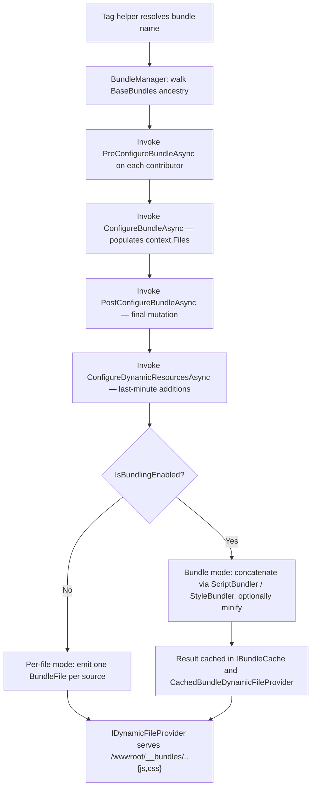

ABP's bundling system replaces the legacy `BundleConfig.cs` model with a code-first, module-aware pipeline. Bundles are defined in `AbpBundlingOptions` (style bundles vs script bundles), composed of ordered `IBundleContributor` instances whose `ConfigureBundle(BundleConfigurationContext)` adds files to the bundle, and rendered via `<abp-script-bundle>` / `<abp-style-bundle>` tag helpers. The runtime decides — based on `BundlingMode.Auto` or explicit configuration — whether to emit one minified file per bundle or one `<script>`/`<link>` tag per source file. The system is implemented across two packages: the abstractions in `framework/src/Volo.Abp.AspNetCore.Mvc.UI.Bundling.Abstractions/` (model and options) and the runtime in `framework/src/Volo.Abp.AspNetCore.Mvc.UI.Bundling/` (`BundleManager`, tag helpers, dynamic file provider).

## Module composition

`Volo.Abp.AspNetCore.Mvc.UI.Bundling/Volo/Abp/AspNetCore/Mvc/UI/Bundling/AbpAspNetCoreMvcUiBundlingModule.cs`:

```csharp
[DependsOn(
    typeof(AbpAspNetCoreMvcUiBootstrapModule),
    typeof(AbpAspNetCoreBundlingModule)
)]
public class AbpAspNetCoreMvcUiBundlingModule : AbpModule
{
    public override void ConfigureServices(ServiceConfigurationContext context)
    {
        if (!context.Services.IsDataMigrationEnvironment())
        {
            Configure<AbpMvcLibsOptions>(options => options.CheckLibs = true);
        }
    }

    public override async Task OnApplicationInitializationAsync(ApplicationInitializationContext context)
    {
        // 1) Compose IWebHostEnvironment.WebRootFileProvider with WebContentFileProvider
        // 2) Pre-render global assets (single minified Global.css / Global.js)
        await InitialGlobalAssetsAsync(context);
    }
}
```

`AbpAspNetCoreBundlingModule` (from `framework/src/Volo.Abp.AspNetCore.Bundling/`) holds the framework-agnostic minifiers (`Volo.Abp.Minify.Scripts.IJavascriptMinifier`, `Volo.Abp.Minify.Styles.ICssMinifier`) that the runtime delegates to.

## Options surface

`AbpBundlingOptions` (`Volo.Abp.AspNetCore.Mvc.UI.Bundling.Abstractions/Volo/Abp/AspNetCore/Mvc/UI/Bundling/AbpBundlingOptions.cs`):

| Property | Default | Purpose |
| --- | --- | --- |
| `StyleBundles` | `BundleConfigurationCollection` | Named style bundles keyed by `BundleName`. |
| `ScriptBundles` | `BundleConfigurationCollection` | Named script bundles. |
| `MinificationIgnoredFiles` | `HashSet<string>` | Files copied as-is even when minification is on. |
| `BundleFolderName` | `"__bundles"` | Output path under `wwwroot/`. |
| `Mode` | `BundlingMode.Auto` | `None` / `Auto` / `Bundle` / `BundleAndMinify` (see `BundlingMode.cs`). |
| `DeferScriptsByDefault` | `false` | Adds `defer` to every script tag. |
| `DeferScripts` | `List<string>` | Specific bundles to defer. |
| `PreloadStylesByDefault` | `false` | Emits `<link rel="preload">`. |
| `PreloadStyles` | `List<string>` | Specific bundles to preload. |
| `GlobalAssets` | `AbpBundlingGlobalAssetsOptions` | `Enabled`, `GlobalStyleBundleName`, `GlobalScriptBundleName`, `CssFileName`, `JavaScriptFileName`. |
| `Parameters` | `BundleParameterDictionary` | Per-render-call parameters available to contributors. |

`BundlingMode.Auto` semantics: `None` in `IHostEnvironment.IsDevelopment()`, otherwise `BundleAndMinify`. The decision is made once per `BundleManager` call by `BundleManager.IsBundlingEnabled()`.

## Building blocks

| Type | File | Purpose |
| --- | --- | --- |
| `BundleConfiguration` | `Abstractions/BundleConfiguration.cs` | Holds `Name`, `BaseBundles` (parent inheritance), `Contributors`. |
| `BundleConfigurationCollection` | `Abstractions/BundleConfigurationCollection.cs` | Indexer by name; methods like `Add`, `Configure`. |
| `BundleConfigurationContext` | `Abstractions/BundleConfigurationContext.cs` | Passed to `ConfigureBundle`; holds `Files` (`List<BundleFile>`), `Parameters`, `ServiceProvider`. |
| `BundleContributor` | `Abstractions/BundleContributor.cs` | Abstract base with 4 lifecycle hooks: `PreConfigureBundle`, `ConfigureBundle`, `PostConfigureBundle`, `ConfigureDynamicResources` (each with async variant). |
| `BundleContributorCollection` | `Abstractions/BundleContributorCollection.cs` | Ordered contributor list, supports add by type, add file, remove. |
| `BundleFile` | `Abstractions/BundleFile.cs` | `Source`, `IsExternal`, condition. |
| `BundleFileContributor` | `Abstractions/BundleFileContributor.cs` | A `BundleContributor` for a single file string. |
| `BundleParameterDictionary` | `Abstractions/BundleParameterDictionary.cs` | Strongly typed parameter bag for contributors. |
| `IBundleConfigurationContext` | `Abstractions/IBundleConfigurationContext.cs` | Same as the context, exposed as interface. |

`BundleConfigurationExtensions` (`Abstractions/BundleConfigurationExtensions.cs`) offers a fluent API:

```csharp
options.ScriptBundles
    .Add(StandardBundles.Scripts.Global, bundle =>
    {
        bundle.AddBaseBundles("MyBaseBundle")
              .AddContributors(typeof(MyExtraScriptsContributor))
              .AddFiles("/scripts/site.js")
              .AddExternalFiles("https://cdn.example.com/lib.js");
    });
```

## Runtime: `BundleManager`

`BundleManager` (`Volo.Abp.AspNetCore.Mvc.UI.Bundling/Volo/Abp/AspNetCore/Mvc/UI/Bundling/BundleManager.cs`) inherits `BundleManagerBase` (in `Volo.Abp.AspNetCore.Bundling`). It is `ITransientDependency` and is injected into the tag helpers.

Pipeline executed by `BundleManager.GetScriptBundleFilesAsync(name)` / `GetStyleBundleFilesAsync(name)`:



Key collaborators:

| Service | File | Role |
| --- | --- | --- |
| `IScriptBundler` / `ScriptBundler` | `Bundling/Scripts/ScriptBundler.cs` (`Volo.Abp.AspNetCore.Bundling/IScriptBundler.cs`) | Concatenates + minifies JS via `IJavascriptMinifier`. |
| `IStyleBundler` / `StyleBundler` | `Bundling/Styles/StyleBundler.cs` (`Volo.Abp.AspNetCore.Bundling/IStyleBundler.cs`) | Concatenates + minifies CSS via `ICssMinifier`. |
| `IBundleCache` / `BundleCache` / `BundleCacheItem` | `Volo.Abp.AspNetCore.Bundling/BundleCache.cs` | Singleton in-memory cache keyed by bundle name + content hash; entries are `BundleCacheItem`. |
| `BundleResult` | `Volo.Abp.AspNetCore.Bundling/BundleResult.cs` | Output of a `BundlerBase.Bundle(...)` call (content + extension). |
| `CachedBundleDynamicFileProvider` | `Bundling/CachedBundleDynamicFileProvider.cs` | Exposes the bundled output as virtual files; `InMemoryFileInfoCacheItem` holds each generated file. |
| `MvcUiBundlerBase` | `Bundling/MvcUiBundlerBase.cs` | Common bundling logic shared by script/style bundlers; derives from `BundlerBase` in `Volo.Abp.AspNetCore.Bundling`. |
| `IBundler` / `BundlerBase` / `IBundlerContext` / `BundlerContext` | `Volo.Abp.AspNetCore.Bundling/Bundler*.cs` | Strategy-style bundling primitives invoked by `BundleManager`. |

The minifiers come from `Volo.Abp.Minify` (`framework/src/Volo.Abp.Minify/`) — `NUglifyJavascriptMinifier`, `NUglifyCssMinifier`. `AbpBundlingOptions.MinificationIgnoredFiles` skips files that are already minified (e.g. CDN `*.min.js`).

## Tag helpers

`Bundling/TagHelpers/` ships the rendering side:

| Tag helper | File | Use |
| --- | --- | --- |
| `<abp-script-bundle>` | `AbpScriptBundleTagHelper(.Service).cs` | Renders a named script bundle. |
| `<abp-style-bundle>` | `AbpStyleBundleTagHelper(.Service).cs` | Renders a named style bundle. |
| `<abp-script>` | `AbpScriptTagHelper(.Service).cs` | Adds a single script file to the current request's bundle queue. |
| `<abp-style>` | `AbpStyleTagHelper(.Service).cs` | Same for CSS. |
| `<abp-bundle>` / `<abp-bundle-item>` | `AbpBundleTagHelper.cs`, `AbpBundleItemTagHelper.cs` | Ad-hoc inline bundle from a Razor view. |
| `script[abp-nonce]` extension | `ScriptNonceTagHelper.cs` | Adds a CSP nonce so `<script>` survives strict CSP. |
| `script` override | `ScriptTagHelper.cs` | Replaces stock script tag helper to be ABP-aware. |

Usage in a layout:

```html
<abp-style-bundle name="@StandardBundles.Styles.Global" />
...
<abp-script-bundle name="@StandardBundles.Scripts.Global" />
```

The `name` is resolved against `AbpBundlingOptions.ScriptBundles` / `StyleBundles`. If the bundle does not exist, the tag helper throws so misconfigurations surface at first render.

## Built-in bundles

`Volo.Abp.AspNetCore.Mvc.UI.Theme.Shared/Bundling/StandardBundles.cs` defines the names:

```csharp
public static class StandardBundles
{
    public static class Styles  { public static string Global = "Global"; }
    public static class Scripts { public static string Global = "Global"; }
}
```

The `Global` bundles are populated by the contributors in `Volo.Abp.AspNetCore.Mvc.UI.Theme.Shared/Bundling/`:

| Contributor | Pulls in (via `[DependsOn]`) | Adds files |
| --- | --- | --- |
| `SharedThemeGlobalStyleContributor` | `BootstrapStyleContributor`, `FontAwesomeStyleContributor`, `Select2StyleContributor`, etc. | Shared theme CSS files (`ui-extensions.css`, `forms.css`, …). |
| `SharedThemeGlobalScriptContributor` | `JQueryScriptContributor`, `BootstrapScriptContributor`, `LodashScriptContributor`, `JQueryValidationUnobtrusiveScriptContributor`, `Select2ScriptContributor`, `DatatablesNetBs5ScriptContributor`, `Sweetalert2ScriptContributor`, `MalihuCustomScrollbarPluginScriptBundleContributor`, `LuxonScriptContributor`, `TimeagoScriptContributor`, `BootstrapDatepickerScriptContributor`, `BootstrapDaterangepickerScriptContributor` | Shared theme JS (`ui-extensions.js`, jQuery extensions, …). |

## Package contributors catalog

`framework/src/Volo.Abp.AspNetCore.Mvc.UI.Packages/` ships one folder per third-party library. Each contains a `*StyleContributor.cs` and/or `*ScriptContributor.cs` that adds files from `/libs/<name>/...` (extracted by the `abp install-libs` tool).

| Folder | Libraries / files |
| --- | --- |
| `Anchor/` | `anchor.js` heading-anchor library |
| `Bootstrap/` | `bootstrap.bundle.js`, `bootstrap.css` |
| `BootstrapDatepicker/` | `bootstrap-datepicker.js`, `.css` |
| `BootstrapDaterangepicker/` | `bootstrap-daterangepicker.js`, `.css` |
| `ChartJs/` | `chart.umd.js` |
| `Clipboard/` | `clipboard.js` |
| `CmsKit/` | CMS Kit shared JS/CSS |
| `Codemirror/` | `codemirror.js`, `.css` |
| `Core/` | ABP core JS modules (`abp.js`, `abp.utils.js`, …) |
| `CropperJs/` | `cropper.js`, `.css` |
| `DatatablesNet/`, `DatatablesNetBs4/`, `DatatablesNetBs5/` | DataTables.net core + Bootstrap themes |
| `FlagIconCss/` | `flag-icon.css` |
| `FontAwesome/` | Font Awesome 6 |
| `HighlightJs/` | `highlight.js` |
| `JQuery/`, `JQueryValidation/`, `JQueryValidationUnobtrusive/` | jQuery 3 + validation |
| `JsTree/` | `jstree.js`, `.css` |
| `Lodash/` | `lodash.js` |
| `Luxon/` | `luxon.js` |
| `MalihuCustomScrollbar/` | `jquery.mCustomScrollbar.js`, `.css` |
| `MarkdownIt/` | `markdown-it.js` |
| `Moment/` | `moment.js` (legacy) |
| `OwlCarousel/` | `owl.carousel.js`, `.css` |
| `Popper/` | `popper.js` |
| `Prismjs/` | `prism.js`, `.css` |
| `QRCode/` | `qrcode.js` |
| `Select2/` | `select2.js`, `.css` |
| `SignalR/` | `signalr.js` client |
| `Slugify/` | `slugify.js` |
| `StarRatingSvg/` | star rating widget |
| `SweetAlert2/` | `sweetalert2.js`, `.css` |
| `Timeago/` | `timeago.js` |
| `TuiEditor/` | TOAST UI editor |
| `Uppy/` | `uppy.js`, `.css` |
| `Utils/` | Internal helpers re-used by other package contributors. |
| `VeeValidate/` | `vee-validate.js` (Vue) |
| `Vue/` | `vue.js` framework script |
| `Zxcvbn/` | `zxcvbn.js` password-strength estimator |

Each contributor uses `context.Files.AddIfNotContains("/libs/<lib>/file.js")` so transitive `[DependsOn]` chains cannot duplicate files. The `BootstrapScriptContributor` (`Packages/Bootstrap/BootstrapScriptContributor.cs`) is the canonical example:

```csharp
[DependsOn(typeof(JQueryScriptContributor))]
public class BootstrapScriptContributor : BundleContributor
{
    public override void ConfigureBundle(BundleConfigurationContext context)
    {
        context.Files.AddIfNotContains("/libs/bootstrap/js/bootstrap.bundle.js");
    }
}
```

## Authoring a bundle

```csharp
public class MyModuleScriptContributor : BundleContributor
{
    public override void ConfigureBundle(BundleConfigurationContext context)
    {
        context.Files.AddIfNotContains("/Pages/MyModule/index.js");
    }
}

public override void ConfigureServices(ServiceConfigurationContext context)
{
    Configure<AbpBundlingOptions>(options =>
    {
        options.ScriptBundles
            .Configure(StandardBundles.Scripts.Global,
                bundle => bundle.AddContributors(typeof(MyModuleScriptContributor)));
    });
}
```

For a brand-new bundle (e.g. only used on one page):

```csharp
options.ScriptBundles.Add("MyPageBundle", bundle =>
{
    bundle.AddBaseBundles(StandardBundles.Scripts.Global);
    bundle.AddContributors(typeof(MyModuleScriptContributor));
});
```

Then in the Razor view: `<abp-script-bundle name="MyPageBundle" />`.

## Global pre-rendered assets

`AbpBundlingGlobalAssetsOptions` plus `InitialGlobalAssetsAsync` (top of `AbpAspNetCoreMvcUiBundlingModule.cs`) pre-render two physical files (`Global.css`, `Global.js`) at startup, push them through `IDynamicFileProvider`, and let CDN edges cache them across requests. CSS relative paths are rewritten through `CssRelativePath.Adjust` (from `Volo.Abp.AspNetCore.Bundling`) so url(...) references resolve to absolute paths after concatenation.

## Library check

`Volo.Abp.AspNetCore.Mvc/Volo/Abp/AspNetCore/Mvc/Libs/AbpMvcLibsService.cs` runs at startup (gated by `AbpMvcLibsOptions.CheckLibs`) and verifies each file referenced from a contributor exists in `IWebHostEnvironment.WebRootFileProvider`. When missing, the application short-circuits to `AbpMvcLibsErrorPage.cshtml` with `abp install-libs` instructions.

## See also

<CardGroup cols={2}>
  <Card title="Themes" href="/aspnetcore/mvc-ui-themes">
    `SharedThemeGlobal*Contributor` belong to the basic theme.
  </Card>
  <Card title="Minify utility" href="/ui/minify">
    The minification engines used by ScriptBundler / StyleBundler.
  </Card>
  <Card title="Install libs CLI" href="/cli/install-libs">
    The companion CLI that copies the referenced files into wwwroot.
  </Card>
  <Card title="Virtual file system" href="/core/virtual-file-system">
    The embedded resource layer that backs the bundle inputs.
  </Card>
</CardGroup>
