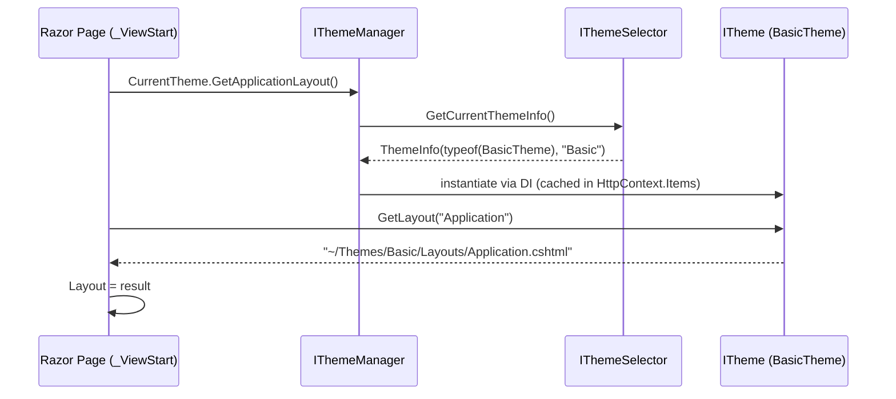

ABP's theming system decouples a Razor page's *layout* (master template) from the *theme* that supplies it. Pages declare a layout intent — `Application`, `Account`, `Public`, `Empty` — and the active theme resolves that name to a concrete `.cshtml` (or Blazor component). Swapping the theme module changes every shared layout, navbar, sidebar and toolbar without touching application pages. The framework defines the contracts in `framework/src/Volo.Abp.AspNetCore.Mvc.UI/Volo/Abp/AspNetCore/Mvc/UI/Theming/`; the Basic theme lives in `modules/basic-theme/`, and downstream commercial themes plug in the same way.

## Contracts

| Type | File | Responsibility |
| --- | --- | --- |
| `ITheme` | `Theming/ITheme.cs` | Single method `string GetLayout(string name, bool fallbackToDefault = true)`. |
| `IThemeManager` | `Theming/IThemeManager.cs` | `ITheme CurrentTheme { get; }` — used by Razor pages. |
| `IThemeSelector` | `Theming/IThemeSelector.cs` | `ThemeInfo GetCurrentThemeInfo()` — decides which registered theme is active. |
| `ThemeInfo` | `Theming/ThemeInfo.cs` | `ThemeType` + `Name` (read from `[ThemeName]`). |
| `ThemeNameAttribute` | `Theming/ThemeNameAttribute.cs` | `[ThemeName("Basic")]`; falls back to `themeType.Name`. |
| `ThemeDictionary` | `Theming/ThemeDictionary.cs` | `Dictionary<Type, ThemeInfo>` with `Add<TTheme>()` helper. |
| `AbpThemingOptions` | `Theming/AbpThemingOptions.cs` | `Themes` dictionary, `DefaultThemeName`, optional `BaseUrl` for `<base>` tag. |
| `StandardLayouts` | `Theming/StandardLayouts.cs` | Constants: `Application`, `Account`, `Public`, `Empty`. |
| `ThemeExtensions` | `Theming/ThemeExtensions.cs` | Sugar over `ITheme` (`GetApplicationLayout`, `GetAccountLayout`, …). |

### `StandardLayouts` constants

```csharp
public static class StandardLayouts
{
    public const string Application = "Application";  // authed app pages with menu + toolbar
    public const string Account     = "Account";      // login / register / forgot password
    public const string Public      = "Public";       // public landing pages
    public const string Empty       = "Empty";        // popup / iframe / printable
}
```

Razor pages reference these constants — they never hard-code paths.

## `DefaultThemeManager`

`Theming/DefaultThemeManager.cs`:

```csharp
public class DefaultThemeManager : IThemeManager, IScopedDependency
{
    private const string CurrentThemeHttpContextKey = "__AbpCurrentTheme";

    public ITheme CurrentTheme => GetCurrentTheme();

    protected virtual ITheme GetCurrentTheme()
    {
        var preSelectedTheme = HttpContextAccessor.HttpContext!
            .Items[CurrentThemeHttpContextKey] as ITheme;

        if (preSelectedTheme == null)
        {
            preSelectedTheme = (ITheme)ServiceProvider
                .GetRequiredService(ThemeSelector.GetCurrentThemeInfo().ThemeType);
            HttpContextAccessor.HttpContext.Items[CurrentThemeHttpContextKey] = preSelectedTheme;
        }

        return preSelectedTheme;
    }
}
```

Caching on `HttpContext.Items` ensures every Razor page rendered during a single request resolves the same theme instance, even though the manager is scoped — important because the theme resolves to a transient `BasicTheme` instance.

## `DefaultThemeSelector`

`Theming/DefaultThemeSelector.cs` picks the theme:

1. Throws if `AbpThemingOptions.Themes` is empty.
2. If `DefaultThemeName == null`, returns the first registered theme.
3. Otherwise finds a registered theme whose `Name` matches `DefaultThemeName`.

The selector is `ITransientDependency` so downstream modules can replace it with one that honours a per-user/tenant preference (e.g. light vs. dark).

## A concrete theme — `BasicTheme`

`modules/basic-theme/src/Volo.Abp.AspNetCore.Mvc.UI.Theme.Basic/BasicTheme.cs`:

```csharp
[ThemeName(Name)]
public class BasicTheme : ITheme, ITransientDependency
{
    public const string Name = "Basic";

    public virtual string GetLayout(string name, bool fallbackToDefault = true)
    {
        switch (name)
        {
            case StandardLayouts.Application: return "~/Themes/Basic/Layouts/Application.cshtml";
            case StandardLayouts.Account:     return "~/Themes/Basic/Layouts/Account.cshtml";
            case StandardLayouts.Empty:       return "~/Themes/Basic/Layouts/Empty.cshtml";
            default:
                return fallbackToDefault ? "~/Themes/Basic/Layouts/Application.cshtml" : null;
        }
    }
}
```

The Blazor counterpart in `modules/basic-theme/src/Volo.Abp.AspNetCore.Components.Web.BasicTheme/BasicTheme.cs` follows the same pattern but returns Blazor `Type` references (`MainLayout`/`NullLayout`).

### Registering a theme

The theme's module registers itself in `AbpThemingOptions`:

```csharp
public override void ConfigureServices(ServiceConfigurationContext context)
{
    Configure<AbpThemingOptions>(options =>
    {
        options.Themes.Add<BasicTheme>();
        if (options.DefaultThemeName == null)
        {
            options.DefaultThemeName = BasicTheme.Name;
        }
    });
}
```

`AbpAspNetCoreMvcUIBasicThemeModule.cs` (basic-theme module) also wires the virtual file system to expose the `~/Themes/Basic/Layouts/*.cshtml` files as embedded resources.

## How a Razor page picks its layout



In practice the page's `_ViewStart.cshtml` (shared in the theme module) looks like:

```cshtml
@using Volo.Abp.AspNetCore.Mvc.UI.Theming
@inject IThemeManager ThemeManager
@{
    Layout = ThemeManager.CurrentTheme.GetApplicationLayout();
}
```

`ThemeExtensions.GetApplicationLayout(ITheme theme)` (in `Theming/ThemeExtensions.cs`) is the typed wrapper around `GetLayout(StandardLayouts.Application)`.

## Page-toolbar contributors

A theme is more than a layout — it offers extensibility hooks for application code to inject content. The shared theme support module `framework/src/Volo.Abp.AspNetCore.Mvc.UI.Theme.Shared/` ships:

| Component | File | Purpose |
| --- | --- | --- |
| `IPageToolbarManager` / `PageToolbarManager` | `PageToolbars/` | Resolves the active toolbar by page key. |
| `IPageToolbarContributor` | `PageToolbars/IPageToolbarContributor.cs` | `Task ContributeAsync(PageToolbarContributionContext)`. |
| `PageToolbarContributor` | `PageToolbars/PageToolbarContributor.cs` | Abstract base. |
| `SimplePageToolbarContributor` | `PageToolbars/SimplePageToolbarContributor.cs` | Adds a single `PageToolbarItem`. |
| `AbpPageToolbarOptions` | `PageToolbars/AbpPageToolbarOptions.cs` | Dictionary of `PageToolbar`s keyed by page identifier. |
| `AbpPageToolbarViewComponent` | `Pages/Shared/Components/AbpPageToolbar/` | Renders the resolved toolbar items. |

Themes display the toolbar by rendering `<vc:abp-page-toolbar />` in their layout — the basic theme does this inside `Application.cshtml`.

## Layout hooks

`Volo.Abp.AspNetCore.Mvc.UI/Volo/Abp/AspNetCore/Mvc/UI/Components/LayoutHook/`:

- `LayoutHookViewComponent.cs` — `<vc:layout-hook name="Head.Last" />` for arbitrary HTML injection.
- `ViewComponentHelperLayoutHookExtensions.cs` — sugar for `InvokeLayoutHookAsync(name)`.
- Hook names are conventional strings (e.g. `Head.Last`, `Body.First`, `Body.Last`) that other modules can register against via `AbpLayoutHookOptions` (in `Volo.Abp.UI`).

This is the mechanism the `cms-kit` and `account` modules use to add stylesheets or scripts without modifying the theme.

## `AbpPage` / `AbpPageModel` base classes

`Volo.Abp.AspNetCore.Mvc.UI/Volo/Abp/AspNetCore/Mvc/UI/RazorPages/`:

| Type | File | Use |
| --- | --- | --- |
| `AbpPage` | `AbpPage.cs` | Razor page base; exposes `IThemeManager`, `IPageLayout`, `IStringLocalizer L`, current user/tenant via `LazyServiceProvider`. |
| `AbpPageModel` | `AbpPageModel.cs` | Page model base for `.cshtml.cs` files; same DI shortcuts as `AbpController`. |
| `ServiceBasedPageModelActivatorProvider` | `ServiceBasedPageModelActivatorProvider.cs` | Replaces MVC's default activator so page models are DI-resolved. |

### `IPageLayout`

`Volo.Abp.AspNetCore.Mvc.UI/Volo/Abp/AspNetCore/Mvc/UI/Layout/IPageLayout.cs` is a request-scoped state bag for layouts:

| Property | Type |
| --- | --- |
| `Content` | `ContentLayout` (page title, sidebar visibility) |
| `BreadCrumb` | `BreadCrumb` with `Items` |

Pages call `PageLayout.Content.Title = ...` so the layout can render `<title>` without coupling to specific page models.

## Theming options vs theme

`AbpThemingOptions.BaseUrl` is the one piece of cross-cutting config: if set, the theme renders `<base href="...">` so client-side routes resolve correctly when the app is hosted under a sub-path. Otherwise per-theme look-and-feel options belong inside the theme's own options class (`AbpBasicThemeOptions`, `AbpLeptonXThemeOptions`, …).

## Multiple themes scenario

```csharp
Configure<AbpThemingOptions>(options =>
{
    options.Themes.Add<BasicTheme>();
    options.Themes.Add<LeptonXLiteTheme>();
    // Choose by tenant setting at runtime
    options.DefaultThemeName = null;  // selector decides
});

services.Replace(ServiceDescriptor.Transient<IThemeSelector, MyTenantThemeSelector>());
```

`MyTenantThemeSelector` typically inspects `ICurrentTenant.Id` and `ISettingProvider` for a `MyApp.SelectedTheme` setting, falling back to `Options.Themes.Values.First()`.

## Related

<CardGroup cols={2}>
  <Card title="MVC UI Bootstrap" href="/aspnetcore/mvc-ui-bootstrap">
    Tag helpers used inside theme layouts.
  </Card>
  <Card title="UI bundling" href="/aspnetcore/mvc-ui-bundling">
    Each theme contributes scripts/styles via `BundleContributor`.
  </Card>
  <Card title="UI navigation menus" href="/ui/navigation-menus">
    `IMenuContributor` content rendered by theme layouts.
  </Card>
  <Card title="Basic theme module" href="/modules/basic-theme">
    Reference theme used by the application startup templates.
  </Card>
</CardGroup>
