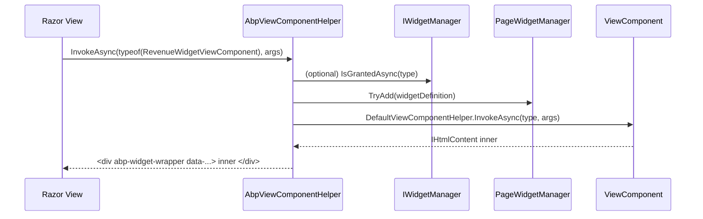

A widget in ABP is a regular ASP.NET Core `ViewComponent` annotated with `[Widget]` that participates in a runtime catalog. The catalog knows the widget's display name, required policies, dependent scripts/styles, refresh URL and dimensions, so dashboards can compose widgets dynamically — including only those the current user is authorised to see, and rendering the union of their resources exactly once. The package is `framework/src/Volo.Abp.AspNetCore.Mvc.UI.Widgets/` and the module is `AbpAspNetCoreMvcUiWidgetsModule`.

## Module

`Volo/Abp/AspNetCore/Mvc/UI/Widgets/AbpAspNetCoreMvcUiWidgetsModule.cs`:

```csharp
[DependsOn(
    typeof(AbpAspNetCoreMvcUiBootstrapModule),
    typeof(AbpAspNetCoreMvcUiBundlingModule)
)]
public class AbpAspNetCoreMvcUiWidgetsModule : AbpModule
{
    public override void PreConfigureServices(ServiceConfigurationContext context)
    {
        PreConfigure<IMvcBuilder>(mvc =>
            mvc.AddApplicationPartIfNotExists(typeof(AbpAspNetCoreMvcUiWidgetsModule).Assembly));

        AutoAddWidgets(context.Services);
    }

    public override void ConfigureServices(ServiceConfigurationContext context)
    {
        context.Services.AddTransient<DefaultViewComponentHelper>();
        Configure<AbpVirtualFileSystemOptions>(o => o.FileSets.AddEmbedded<AbpAspNetCoreMvcUiWidgetsModule>());
    }
}
```

`AutoAddWidgets` subscribes to `services.OnRegistered`; whenever a type with `[Widget]` is registered, it is captured and later inserted into `AbpWidgetOptions.Widgets` as a `WidgetDefinition`.

## `WidgetAttribute`

`Widgets/WidgetAttribute.cs`:

| Property | Type | Purpose |
| --- | --- | --- |
| `StyleFiles` | `string[]?` | CSS files relative to `wwwroot`. |
| `StyleTypes` | `Type[]?` | `BundleContributor` types contributing CSS. |
| `ScriptFiles` | `string[]?` | JS files. |
| `ScriptTypes` | `Type[]?` | `BundleContributor` types for JS. |
| `DisplayName` | `string?` | Localisation key. |
| `DisplayNameResource` | `Type?` | `LocalizationResource` for the key. |
| `RequiredPolicies` | `string[]?` | Policy names checked by `WidgetManager`. |
| `RequiresAuthentication` | `bool` | Implicit policy when none specified. |
| `RefreshUrl` | `string?` | URL the JS widget polls/refreshes from. |
| `AutoInitialize` | `bool` | `data-widget-auto-init="true"` attribute hint. |

`IsWidget(Type)` (static) returns `true` for `ViewComponent` subclasses decorated with `[Widget]`. `Get(Type)` retrieves the attribute or throws.

A typical declaration:

```csharp
[Widget(
    StyleTypes = new[] { typeof(MyDashboardWidgetStyleContributor) },
    ScriptTypes = new[] { typeof(MyDashboardWidgetScriptContributor) },
    DisplayName = "DashboardWidget:Revenue",
    DisplayNameResource = typeof(MyDashboardResource),
    RequiredPolicies = new[] { "MyApp.Dashboard.RevenueWidget" },
    RefreshUrl = "/api/app/dashboard/revenue",
    AutoInitialize = true)]
public class RevenueWidgetViewComponent : AbpViewComponent
{
    public IViewComponentResult Invoke() => View(new RevenueModel(...));
}
```

## `WidgetDefinition`

`Widgets/WidgetDefinition.cs` materialises a widget's metadata at registration time:

| Property | Source | Notes |
| --- | --- | --- |
| `Name` | `[ViewComponent(Name = ...)]` or `Type.Name.RemovePostFix("ViewComponent")` | Unique key. |
| `WidgetAttribute` | `WidgetAttribute.Get(type)` | The attribute instance. |
| `ViewComponentType` | constructor argument | Used by `DefaultViewComponentHelper`. |
| `DisplayName` | `FixedLocalizableString(Name)` if attribute lacks one; otherwise `LocalizableString(DisplayNameResource, DisplayName)`. |
| `RequiredPolicies` | `WidgetAttribute.RequiredPolicies` | Copy. |
| `RequiresAuthentication` | `WidgetAttribute.RequiresAuthentication` | Honoured only when `RequiredPolicies` is empty. |
| `Styles` | from `StyleFiles` + `StyleTypes` | `List<WidgetResourceItem>`. |
| `Scripts` | from `ScriptFiles` + `ScriptTypes` | Same. |
| `RefreshUrl`, `AutoInitialize` | passthrough. |

A `WidgetResourceItem` (`Widgets/WidgetResourceItem.cs`) is either a `Src` string or a `Type` (bundle contributor); the rendering pipeline handles both.

Fluent builders on the definition:

- `WithRequiredPolicies(params string[])`
- `WithRequiresAuthentication(bool = true)`
- `WithStyles(params string[] | params Type[])`
- `WithScripts(params string[] | params Type[])`
- `WithRefreshUrl(string)`

`WidgetDefinitionCollection` (`Widgets/WidgetDefinitionCollection.cs`) is a list with `Find(string name)` and `Find(Type type)` lookups.

## Authorisation — `IWidgetManager`

`Widgets/IWidgetManager.cs` declares two methods, both implemented by `Widgets/WidgetManager.cs`:

```csharp
public async Task<bool> IsGrantedAsync(Type widgetComponentType);
public async Task<bool> IsGrantedAsync(string name);
```

Decision tree (`WidgetManager.IsGrantedAsyncInternal`):

1. If the widget has `RequiredPolicies`, every policy must succeed via `IAuthorizationService.AuthorizeAsync`.
2. Otherwise if `RequiresAuthentication` is `true` and `ICurrentUser.IsAuthenticated` is `false`, return `false`.
3. Otherwise allowed.

Dashboards call `IsGrantedAsync` before invoking the view component so an unauthenticated/unauthorised viewer never sees the widget's HTML or JS.

## Per-request collection — `IPageWidgetManager`

`Widgets/IPageWidgetManager.cs` + `PageWidgetManager.cs` keep a `HttpContext.Items["__AbpCurrentWidgets"]` list of `WidgetDefinition`s rendered during this request. `TryAdd(widget)` uses `AddIfNotContains` to de-duplicate. The list is consumed by the two helper view components below to emit script/style tags exactly once.

## Rendering pipeline

`Widgets/AbpViewComponentHelper.cs` is registered with `[Dependency(ReplaceServices = true)]` so it overrides ASP.NET Core's `IViewComponentHelper`. The override:

1. Looks up the requested component (`name` or `Type`) in `AbpWidgetOptions.Widgets`.
2. If the type is not a widget, delegates to `DefaultViewComponentHelper`.
3. If it is a widget, registers it with `PageWidgetManager.TryAdd(widget)` and renders the inner view component wrapped in:

```html
<div class="abp-widget-wrapper"
     data-widget-name="<Name>"
     data-refresh-url="<RefreshUrl>"
     data-widget-auto-init="<AutoInitialize>">
   <!-- inner view component output -->
</div>
```

This wrapper is the contract for the client-side `abp.widgets.js` runtime — it can find the widget by name, hit the refresh URL via AJAX, and replace the inner content.



At the end of the page, the layout emits two view components from `Widgets/Components/`:

| View component | File | Output |
| --- | --- | --- |
| `WidgetStylesViewComponent` | `Components/WidgetStyles/` | `<link>` tags for every distinct `Styles` resource across `PageWidgetManager.GetAll()`. Bundle contributors are converted into `<abp-style-bundle>` style references. |
| `WidgetScriptsViewComponent` | `Components/WidgetScripts/` | Same for `<script>`. |

`WidgetResourcesViewModel` (`Components/WidgetResourcesViewModel.cs`) is the consolidated view model that holds the de-duplicated lists.

## Options

`AbpWidgetOptions` (`Widgets/AbpWidgetOptions.cs`):

```csharp
public class AbpWidgetOptions
{
    public WidgetDefinitionCollection Widgets { get; } = new();
}
```

Widgets are added automatically by the module's `OnRegistered` subscription, but applications can also call:

```csharp
Configure<AbpWidgetOptions>(options =>
{
    options.Widgets
        .Find(typeof(RevenueWidgetViewComponent))!
        .WithRequiredPolicies("MyApp.Dashboard.Revenue")
        .WithRefreshUrl("/api/app/dashboard/revenue?range=30d");
});
```

`WidgetDimensions` (`Widgets/WidgetDimensions.cs`) holds `Width`/`Height` for grid-based dashboards (used by the CMS Kit dashboard module).

## Hosting in a dashboard

In a Razor page:

```cshtml
@inject IWidgetManager WidgetManager

@if (await WidgetManager.IsGrantedAsync(typeof(RevenueWidgetViewComponent)))
{
    @await Component.InvokeAsync(typeof(RevenueWidgetViewComponent), new { range = "30d" })
}

@* End of layout *@
<vc:widget-styles />
<vc:widget-scripts />
```

Because `IPageWidgetManager` tracks the set of widgets rendered, the styles/scripts components emit each resource only once even if the page renders multiple widgets that share a dependency.

## Client-side runtime

The rendered wrapper drives the JS runtime shipped under `wwwroot/Volo/Abp/AspNetCore/Mvc/UI/Widgets/abp-widgets.js` (embedded into the assembly's virtual file system). It exposes `abp.widgets.refresh(name|element)` which:

1. Looks up `data-refresh-url`.
2. Issues `GET` (or POST for parametric widgets).
3. Replaces inner HTML and reapplies bindings.

`data-widget-auto-init="true"` invokes `refresh` automatically on `DOMContentLoaded`.

## Related

<CardGroup cols={2}>
  <Card title="MVC integration" href="/aspnetcore/mvc-integration">
    `AbpViewComponent` lazy DI used by widget view components.
  </Card>
  <Card title="UI bundling" href="/aspnetcore/mvc-ui-bundling">
    `BundleContributor`s referenced from `WidgetAttribute.ScriptTypes` / `StyleTypes`.
  </Card>
  <Card title="Authorization" href="/auth/authorization">
    Policy resolution behind `IWidgetManager.IsGrantedAsync`.
  </Card>
  <Card title="CMS Kit" href="/modules/cms-kit">
    A real consumer of the widget system (dashboard + page-builder widgets).
  </Card>
</CardGroup>
