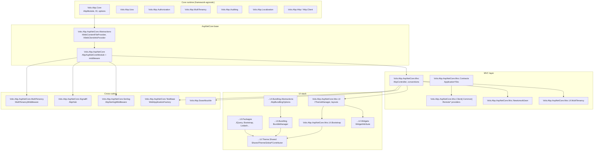

The `framework/src/Volo.Abp.AspNetCore.*` tree is the bridge between the framework-agnostic ABP runtime (modularity, DI, UoW, multi-tenancy, auditing, validation) and the ASP.NET Core hosting model. It registers HTTP-aware variants of ABP services (current user from `HttpContext`, correlation id from headers, request-scoped UoW), supplies a base controller hierarchy that exposes `IAbpLazyServiceProvider`, provides convention-based controller generation from `IApplicationService`, ships an MVC UI stack (theming, bundling, widgets, tag helpers), and integrates SignalR, Serilog and Swagger via dedicated DependsOn modules. This page maps every package in the group and shows how they wire into the request pipeline.

## Package map

## Package inventory

Every project below lives under `framework/src/`. The Module column lists the entry point `AbpModule` that other modules add to their `[DependsOn(...)]` lists.

| Project | Module | Purpose |
| --- | --- | --- |
| `Volo.Abp.AspNetCore.Abstractions` | `AbpAspNetCoreAbstractionsModule` | Hosting-agnostic interfaces: `IWebContentFileProvider`, `IWebClientInfoProvider`, `IAbpFilter`. |
| `Volo.Abp.AspNetCore` | `AbpAspNetCoreModule` | Middleware (`AbpCorrelationIdMiddleware`, `AbpExceptionHandlingMiddleware`, `AbpAuditingMiddleware`, `AbpUnitOfWorkMiddleware`, `AbpRequestLocalizationMiddleware`, `AbpSecurityHeadersMiddleware`, `AbpDynamicClaimsMiddleware`, `AbpTimeZoneMiddleware`); `IApplicationBuilder` extensions; static web asset wiring; `HttpContextAccessor`-backed providers. |
| `Volo.Abp.AspNetCore.Mvc` | `AbpAspNetCoreMvcModule` | `AbpController` / `AbpControllerBase`, `AbpServiceConvention` (auto-API for `IApplicationService`), `AbpExceptionFilter`, `AbpAuditActionFilter`, `AbpUowActionFilter`, `AbpFeatureActionFilter`, `AbpValidationActionFilter`, model binders, application-configuration endpoints. |
| `Volo.Abp.AspNetCore.Mvc.Contracts` | `AbpAspNetCoreMvcContractsModule` | DTOs for the `/api/abp/application-configuration` and `/api/abp/application-localization` endpoints. |
| `Volo.Abp.AspNetCore.Mvc.Client` | `AbpAspNetCoreMvcClientModule` | MVC-host client wiring of cached `ApplicationConfigurationDto`. |
| `Volo.Abp.AspNetCore.Mvc.Client.Common` | `AbpAspNetCoreMvcClientCommonModule` | Generated client proxies (`AbpApplicationConfigurationClientProxy`, `AbpTenantClientProxy`, `AbpApplicationLocalizationClientProxy`), remote permission/feature/setting providers. |
| `Volo.Abp.AspNetCore.Mvc.NewtonsoftJson` | `AbpAspNetCoreMvcNewtonsoftModule` | Opt-in Newtonsoft.Json integration alongside the default System.Text.Json. |
| `Volo.Abp.AspNetCore.MultiTenancy` | `AbpAspNetCoreMultiTenancyModule` | `MultiTenancyMiddleware`, query-string / route / header / cookie resolve contributors, error page. |
| `Volo.Abp.AspNetCore.Mvc.UI` | `AbpAspNetCoreMvcUiModule` | `IThemeManager`, `IThemeSelector`, `IPageLayout`, alerts, layout hooks, `AbpPage(Model)`. |
| `Volo.Abp.AspNetCore.Mvc.UI.Bootstrap` | `AbpAspNetCoreMvcUiBootstrapModule` | All Bootstrap 5 tag helpers (Alert, Card, Modal, Tab, Form, Grid, …). |
| `Volo.Abp.AspNetCore.Mvc.UI.Bundling.Abstractions` | `AbpAspNetCoreMvcUiBundlingAbstractionsModule` | Bundle model: `AbpBundlingOptions`, `BundleConfiguration`, `IBundleContributor`. |
| `Volo.Abp.AspNetCore.Mvc.UI.Bundling` | `AbpAspNetCoreMvcUiBundlingModule` | `BundleManager`, script/style bundlers, `<abp-script-bundle>` / `<abp-style-bundle>` tag helpers. |
| `Volo.Abp.AspNetCore.Mvc.UI.Packages` | `AbpAspNetCoreMvcUiPackagesModule` | One `BundleContributor` per third-party asset (jQuery, Bootstrap, DataTables, Lodash, Luxon, Select2, SweetAlert2, FontAwesome, …). |
| `Volo.Abp.AspNetCore.Mvc.UI.Theme.Shared` | `AbpAspNetCoreMvcUiThemeSharedModule` | `SharedThemeGlobalScriptContributor`, `SharedThemeGlobalStyleContributor`, `StandardBundles`, error pages, page-toolbar manager. |
| `Volo.Abp.AspNetCore.Mvc.UI.Widgets` | `AbpAspNetCoreMvcUiWidgetsModule` | `WidgetAttribute`, `IWidgetManager`, widget script/style view components. |
| `Volo.Abp.AspNetCore.Mvc.UI.MultiTenancy` | `AbpAspNetCoreMvcUiMultiTenancyModule` | Tenant switch modal Razor page + `AbpTenantController`. |
| `Volo.Abp.AspNetCore.SignalR` | `AbpAspNetCoreSignalRModule` | `AbpHub`, auto-discovery of hubs, `AbpAuthenticationHubFilter`, `AbpAuditHubFilter`. |
| `Volo.Abp.AspNetCore.Serilog` | `AbpAspNetCoreSerilogModule` | `AbpSerilogMiddleware` pushing `TenantId`/`UserId`/`ClientId`/`CorrelationId` into `LogContext`. |
| `Volo.Abp.AspNetCore.TestBase` | `AbpAspNetCoreTestBaseModule` | `WebApplicationFactory`-based `AbpWebApplicationFactoryIntegratedTest<TProgram>`, legacy `AbpAspNetCoreIntegratedTestBase`. |
| `Volo.Abp.Swashbuckle` | `AbpSwashbuckleModule` | `AddAbpSwaggerGen[WithOAuth/Oidc]`, `AbpSwashbuckleDocumentFilter`, `AbpSwashbuckleEnumSchemaFilter`. |

## Middleware ↔ ABP service mapping

The default pipeline assembled by template projects (`Program.cs` and templated `*HttpApiHostModule.OnApplicationInitialization`) wires the middleware below to ABP service abstractions. The middleware sources are listed beside the abstraction they feed.

| Middleware | Source | ABP service surface |
| --- | --- | --- |
| `AbpCorrelationIdMiddleware` | `Volo.Abp.AspNetCore/Volo/Abp/AspNetCore/Tracing/AbpCorrelationIdMiddleware.cs` | `ICorrelationIdProvider`, `AbpCorrelationIdOptions` |
| `AbpRequestLocalizationMiddleware` | `Volo.Abp.AspNetCore/Microsoft/AspNetCore/RequestLocalization/AbpRequestLocalizationMiddleware.cs` | `IAbpRequestLocalizationOptionsProvider`, `RequestLocalizationOptions` |
| `MultiTenancyMiddleware` | `Volo.Abp.AspNetCore.MultiTenancy/Volo/Abp/AspNetCore/MultiTenancy/MultiTenancyMiddleware.cs` | `ICurrentTenant`, `ITenantConfigurationProvider`, `ITenantResolveResultAccessor` |
| `AbpExceptionHandlingMiddleware` | `Volo.Abp.AspNetCore/Volo/Abp/AspNetCore/ExceptionHandling/AbpExceptionHandlingMiddleware.cs` | `IExceptionNotifier`, `IHttpExceptionStatusCodeFinder`, `IAbpAuthorizationExceptionHandler` |
| `AbpAuditingMiddleware` | `Volo.Abp.AspNetCore/Volo/Abp/AspNetCore/Auditing/AbpAuditingMiddleware.cs` | `IAuditingManager`, `AspNetCoreAuditLogContributor` |
| `AbpUnitOfWorkMiddleware` | `Volo.Abp.AspNetCore/Volo/Abp/AspNetCore/Uow/AbpUnitOfWorkMiddleware.cs` | `IUnitOfWorkManager`, `AbpAspNetCoreUnitOfWorkOptions` |
| `AbpDynamicClaimsMiddleware` | `Volo.Abp.AspNetCore/Volo/Abp/AspNetCore/Security/Claims/AbpDynamicClaimsMiddleware.cs` | `AbpDynamicClaimsPrincipalContributorCache` |
| `AbpSecurityHeadersMiddleware` | `Volo.Abp.AspNetCore/Volo/Abp/AspNetCore/Security/AbpSecurityHeadersMiddleware.cs` | `AbpSecurityHeadersOptions`, `AbpSecurityHeaderNonceHelper` |
| `AbpTimeZoneMiddleware` | `Volo.Abp.AspNetCore/Microsoft/AspNetCore/Timing/AbpTimeZoneMiddleware.cs` | `IClock`, `ITimezoneProvider`, `ITimeZoneSettingProvider` |
| `AbpSerilogMiddleware` | `Volo.Abp.AspNetCore.Serilog/Volo/Abp/AspNetCore/Serilog/AbpSerilogMiddleware.cs` | `LogContext` enrichers for tenant/user/client/correlation |

## Filters and conventions

`AbpAspNetCoreMvcModule.ConfigureServices` (`framework/src/Volo.Abp.AspNetCore.Mvc/Volo/Abp/AspNetCore/Mvc/AbpAspNetCoreMvcModule.cs`) registers MVC filters that mirror the middleware for non-Razor scenarios and for Razor Pages, and contributes the `AbpServiceConvention` that turns application services into controllers.

| Filter / convention | Source | Role |
| --- | --- | --- |
| `AbpAutoValidateAntiforgeryTokenAttribute` | `Mvc/AntiForgery/AbpAutoValidateAntiforgeryTokenAttribute.cs` | Default global filter; integrates with `IAbpAntiForgeryManager`. |
| `AbpExceptionFilter`, `AbpExceptionPageFilter` | `Mvc/ExceptionHandling/` | Converts exceptions into `RemoteServiceErrorResponse`. |
| `AbpAuditActionFilter`, `AbpAuditPageFilter` | `Mvc/Auditing/` | Per-action auditing via `IAuditingManager`. |
| `AbpUowActionFilter`, `AbpUowPageFilter` | `Mvc/Uow/` | Wraps actions in an `IUnitOfWork`. |
| `AbpFeatureActionFilter`, `AbpFeaturePageFilter` | `Mvc/Features/` | Enforces `[RequiresFeature]`. |
| `GlobalFeatureActionFilter`, `GlobalFeaturePageFilter` | `Mvc/GlobalFeatures/` | Gates controllers by `[RequiresGlobalFeature]`. |
| `AbpValidationActionFilter` | `Mvc/Validation/AbpValidationActionFilter.cs` | Runs `IModelStateValidator` and FluentValidation. |
| `AbpNoContentActionFilter` | `Mvc/Response/AbpNoContentActionFilter.cs` | Maps `void`/`Task` actions to HTTP 204. |
| `AbpServiceConvention` | `Mvc/Conventions/AbpServiceConvention.cs` | Routes/HTTP verbs for conventional controllers. |
| `AbpConventionalControllerFeatureProvider` | `Mvc/Conventions/AbpConventionalControllerFeatureProvider.cs` | Adds discovered `IApplicationService` types to the application part list. |

## Cross-cutting concerns wired by the base modules

When the ASP.NET Core integration loads, several cross-cutting subsystems are bridged to ABP services. The table maps each cross-cutting concern to the file in `framework/src/Volo.Abp.AspNetCore*` that owns its HTTP integration.

| Concern | Owner | Where wired |
| --- | --- | --- |
| Auditing | `AspNetCoreAuditLogContributor` | `Volo.Abp.AspNetCore/Volo/Abp/AspNetCore/Auditing/AspNetCoreAuditLogContributor.cs` (registered in `AbpAspNetCoreModule.ConfigureServices`). |
| Authorization | `AddAuthorization()` call | `AbpAspNetCoreModule.ConfigureServices`. |
| Validation | `AbpValidationActionFilter` | `Volo.Abp.AspNetCore.Mvc/Volo/Abp/AspNetCore/Mvc/Validation/`. |
| Anti-forgery | `AbpAutoValidateAntiforgeryTokenAttribute` global filter | `Volo.Abp.AspNetCore.Mvc/Volo/Abp/AspNetCore/Mvc/AntiForgery/`. |
| Unit of work | `AbpUnitOfWorkMiddleware` + `AbpUowActionFilter` + `AbpUowPageFilter` | `Volo.Abp.AspNetCore/.../Uow/`, `Volo.Abp.AspNetCore.Mvc/.../Uow/`. |
| Multi-tenancy | `MultiTenancyMiddleware` | `Volo.Abp.AspNetCore.MultiTenancy/`. |
| Localization | `AbpRequestLocalizationMiddleware`, `AbpDataAnnotationAutoLocalizationMetadataDetailsProvider`, `AbpApplicationLocalizationController` | `Volo.Abp.AspNetCore/`, `Volo.Abp.AspNetCore.Mvc/`. |
| Exception handling | `AbpExceptionHandlingMiddleware`, `AbpExceptionFilter`, `AbpExceptionPageFilter` | `Volo.Abp.AspNetCore/.../ExceptionHandling/`, `Volo.Abp.AspNetCore.Mvc/.../ExceptionHandling/`. |
| Tracing | `AbpCorrelationIdMiddleware` | `Volo.Abp.AspNetCore/.../Tracing/`. |
| Logging enrichment | `AbpSerilogMiddleware` | `Volo.Abp.AspNetCore.Serilog/`. |
| Security headers | `AbpSecurityHeadersMiddleware` | `Volo.Abp.AspNetCore/.../Security/`. |
| Time zone | `AbpTimeZoneMiddleware` | `Volo.Abp.AspNetCore/Microsoft/AspNetCore/Timing/`. |
| Dynamic claims | `AbpDynamicClaimsMiddleware`, `AbpClaimsTransformation`, `AbpClaimsMapMiddleware` | `Volo.Abp.AspNetCore/.../Security/Claims/`. |
| Static files | `AbpStaticFileProvider`, `WebContentFileProvider`, `AbpFileExtensionContentTypeProvider` | `Volo.Abp.AspNetCore/.../StaticFiles/`, `Volo.Abp.AspNetCore/.../VirtualFileSystem/`. |
| Web client info | `HttpContextWebClientInfoProvider` | `Volo.Abp.AspNetCore/.../WebClientInfo/`. |
| Cancellation token | `HttpContextCancellationTokenProvider` | `Volo.Abp.AspNetCore/.../Threading/`. |

## Folder map of `Volo.Abp.AspNetCore.Mvc/Volo/Abp/AspNetCore/Mvc/`

The MVC integration package is the largest in the group. Each folder below covers one functional area:

| Folder | Top-level types | Purpose |
| --- | --- | --- |
| `AntiForgery/` | `AbpAutoValidateAntiforgeryTokenAttribute`, `AspNetCoreAbpAntiForgeryManager`, `AbpAntiForgeryOptions` | Anti-forgery integration. |
| `ApiExploring/` | `AbpRemoteServiceApiDescriptionProvider`, `AbpApiDefinitionController`, `AbpNoContentApiDescriptionProvider` | API description for proxy generators. |
| `ApplicationConfigurations/` | `AbpApplicationConfigurationController`, `AbpApplicationLocalizationController`, `AbpApplicationConfigurationScriptController` | Bootstrapping endpoints for clients. |
| `Auditing/` | `AbpAuditActionFilter`, `AbpAuditPageFilter` | Per-action audit. |
| `Authentication/` | `ChallengeAccountController` | Authentication challenge fallback. |
| `ContentFormatters/` | `RemoteStreamContentOutputFormatter`, `AbpRemoteStreamContentModelBinder(Provider)` | File upload/download binding. |
| `Conventions/` | `AbpServiceConvention`, `ConventionalControllerSetting`, `AbpConventionalControllerOptions`, `IConventionalRouteBuilder` | Auto-API controllers. |
| `DataAnnotations/` | `AbpValidationAttributeAdapterProvider`, dynamic adapters | Runtime-aware DataAnnotation limits. |
| `DependencyInjection/` | `AbpAspNetCoreMvcConventionalRegistrar` | MVC type registration. |
| `ExceptionHandling/` | `AbpExceptionFilter`, `AbpExceptionPageFilter` | Translate exceptions to MVC results. |
| `Features/` + `GlobalFeatures/` | per-action filters | `[RequiresFeature]` / `[RequiresGlobalFeature]`. |
| `Infrastructure/` | `AbpMemoryPoolHttpResponseStreamWriterFactory` | Pooled stream writer. |
| `Json/` | `MvcCoreBuilderExtensions.AddAbpJson` | Default System.Text.Json hooks. |
| `Libs/` | `AbpMvcLibsService`, `AbpMvcLibsErrorPage` | `wwwroot/libs/*` integrity check. |
| `Localization/` | `AbpMvcDataAnnotationsLocalizationOptions`, `AbpLanguagesController`, `AbpApplicationLocalizationScriptController`, `AbpMvcAttributeValidationResultProvider`, `IQueryStringCultureReplacement` | MVC-aware localisation. |
| `ModelBinding/` | `AbpDateTimeModelBinder(Provider)`, `AbpExtraPropertyModelBinder`, `AbpExtraPropertiesDictionaryModelBinderProvider`, `ExtraPropertyBindingHelper`, `Metadata/` | Model-binders for ABP types. |
| `ProxyScripting/` | `AbpServiceProxyScriptController`, `ServiceProxyGenerationModel` | Dynamic JS proxy endpoint. |
| `Response/` | `AbpNoContentActionFilter` | 204 for void/Task. |
| `Uow/` | `AbpUowActionFilter`, `AbpUowPageFilter` | UoW for Razor pages and non-pipelined actions. |
| `Utils/` | `ArrayMatcher` | Helpers shared by filters. |
| `Validation/` | `AbpValidationActionFilter`, `IModelStateValidator`, `ModelStateValidator`, `ValidationAttributeHelper` | Validation pipeline. |
| `Versioning/` | `HttpContextRequestedApiVersion` | API version state. |
| `ViewFeatures/` | `AbpValidationHtmlAttributeProvider` | Client-side validation attribute emission. |

## How to read the rest of this section

<CardGroup cols={2}>
  <Card title="Base ASP.NET Core" href="/aspnetcore/volo-abp-aspnetcore">
    `AbpAspNetCoreModule`, all middleware, `IApplicationBuilder` extensions.
  </Card>
  <Card title="MVC Integration" href="/aspnetcore/mvc-integration">
    `AbpController`, conventional controllers, filters, model binding.
  </Card>
  <Card title="UI: Bootstrap" href="/aspnetcore/mvc-ui-bootstrap">
    Tag helpers shipped by the Bootstrap UI package.
  </Card>
  <Card title="UI: Bundling" href="/aspnetcore/mvc-ui-bundling">
    `IBundleManager`, contributors, `<abp-script-bundle>` tag helper.
  </Card>
  <Card title="UI: Themes" href="/aspnetcore/mvc-ui-themes">
    `IThemeManager`, layout selection, `StandardLayouts`.
  </Card>
  <Card title="UI: Widgets" href="/aspnetcore/mvc-ui-widgets">
    `WidgetAttribute`, `IWidgetManager`, widget resources.
  </Card>
  <Card title="Client Proxies" href="/aspnetcore/mvc-client-proxies">
    Dynamic JS proxies and static C# client proxies.
  </Card>
  <Card title="Newtonsoft" href="/aspnetcore/mvc-newtonsoft">
    Opt-in Newtonsoft.Json formatter alongside System.Text.Json.
  </Card>
  <Card title="Multi-tenancy" href="/aspnetcore/mvc-multitenancy">
    `MultiTenancyMiddleware` and tenant switch UI.
  </Card>
  <Card title="SignalR" href="/aspnetcore/signalr">
    `AbpHub`, hub auto-mapping, audit/auth filters.
  </Card>
  <Card title="Serilog" href="/aspnetcore/serilog">
    `AbpSerilogMiddleware` enrichers.
  </Card>
  <Card title="Swashbuckle" href="/aspnetcore/swashbuckle">
    `AddAbpSwaggerGen`, schema and document filters.
  </Card>
  <Card title="Test Base" href="/aspnetcore/test-base">
    `WebApplicationFactory` integration tests.
  </Card>
</CardGroup>

<Info>
The HTTP request lifecycle that threads through these middleware/filter stacks is documented end-to-end on [HTTP request lifecycle](/flows/http-request-lifecycle); the module-loading sequence that registers them is on [Module loading lifecycle](/flows/module-loading-lifecycle).
</Info>
