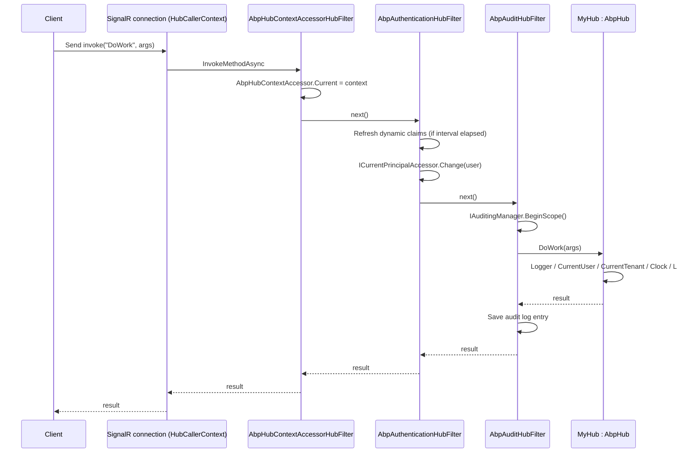

`framework/src/Volo.Abp.AspNetCore.SignalR/` connects SignalR to the ABP runtime. Hub classes derive from `AbpHub` / `AbpHub<T>` to get the same `LazyServiceProvider`-driven access to `ICurrentUser`, `ICurrentTenant`, `IAuthorizationService`, `IClock` and localisation that `AbpController` provides. Hubs are discovered automatically by a conventional registrar; the module's `OnApplicationInitialization` walks `AbpSignalROptions.Hubs` and calls `IEndpointRouteBuilder.MapHub<THub>()` per registered hub. Three hub filters are installed globally — `AbpHubContextAccessorHubFilter`, `AbpAuthenticationHubFilter` and `AbpAuditHubFilter` — so every hub method invocation runs inside a tenant-aware, audited, principal-bound scope.

## Module composition

`Volo/Abp/AspNetCore/SignalR/AbpAspNetCoreSignalRModule.cs`:

```csharp
[DependsOn(typeof(AbpAspNetCoreModule))]
public class AbpAspNetCoreSignalRModule : AbpModule
{
    public override void PreConfigureServices(ServiceConfigurationContext context)
    {
        context.Services.AddConventionalRegistrar(new AbpSignalRConventionalRegistrar());
        AutoAddHubTypes(context.Services);
    }

    public override void ConfigureServices(ServiceConfigurationContext context)
    {
        var routePatterns = new List<string> { "/signalr-hubs" };
        var signalRServerBuilder = context.Services.AddSignalR(options =>
        {
            options.DisableImplicitFromServicesParameters = true;
            options.AddFilter<AbpHubContextAccessorHubFilter>();
            options.AddFilter<AbpAuthenticationHubFilter>();
            options.AddFilter<AbpAuditHubFilter>();
        });

        context.Services.ExecutePreConfiguredActions(signalRServerBuilder);

        Configure<AbpEndpointRouterOptions>(options =>
        {
            options.EndpointConfigureActions.Add(endpointContext =>
            {
                /* iterate AbpSignalROptions.Hubs, call MapHub<THub>(routePattern, configure) */
            });
        });

        Configure<AbpAspNetCoreAuditingOptions>(options =>
        {
            foreach (var pattern in routePatterns)
                options.IgnoredUrls.AddIfNotContains(
                    x => pattern.StartsWith(x, StringComparison.OrdinalIgnoreCase), () => pattern);
        });

        Configure<AbpAuditingOptions>(options =>
        {
            options.Contributors.Add(new AspNetCoreSignalRAuditLogContributor());
        });
    }
}
```

Key observations:

- `DisableImplicitFromServicesParameters = true` opts out of SignalR 7+'s implicit DI parameter binding so ABP can do the binding via `LazyServiceProvider`.
- Three hub filters are added globally.
- Hub URLs are added to `AbpAspNetCoreAuditingOptions.IgnoredUrls` so the HTTP middleware does not produce audit logs for the SignalR negotiation requests — `AbpAuditHubFilter` produces hub-specific audit logs instead.
- A custom `AspNetCoreSignalRAuditLogContributor` (`SignalR/Auditing/AspNetCoreSignalRAuditLogContributor.cs`) enriches audit logs with hub method context.

## `AbpHub` base classes

`Volo/Abp/AspNetCore/SignalR/AbpHub.cs` ships both the untyped `AbpHub : Hub` and the strongly-typed-client variant `AbpHub<T> : Hub<T>`. They expose:

| Member | Type | Source |
| --- | --- | --- |
| `LazyServiceProvider` | `IAbpLazyServiceProvider` | Property-injected; backs all accessors. |
| `Logger` | `ILogger` | Created from hub type's full name. |
| `CurrentUser` | `ICurrentUser` | From `LazyServiceProvider`. |
| `CurrentTenant` | `ICurrentTenant` | From `LazyServiceProvider`. |
| `AuthorizationService` | `IAuthorizationService` | Standard ASP.NET Core authorisation. |
| `Clock` | `IClock` | Time abstraction. |
| `StringLocalizerFactory` | `IStringLocalizerFactory` | Source of `L`. |
| `L` | `IStringLocalizer` | Defaults to `DefaultResource`; reset by setting `LocalizationResource`. |
| `LocalizationResource` | `Type?` | Override per hub. |

Example hub:

```csharp
[Authorize, HubRoute("/signalr/notifications")]
public class NotificationsHub : AbpHub
{
    public async Task Subscribe(string topic)
    {
        Logger.LogInformation("User {UserId} subscribed to {Topic}", CurrentUser.Id, topic);
        await Groups.AddToGroupAsync(Context.ConnectionId, topic);
        await Clients.Caller.SendAsync("Subscribed", topic, await Clock.Now.ToString());
    }
}
```

## Auto-discovery + auto-mapping

### `AbpSignalRConventionalRegistrar`

`SignalR/AbpSignalRConventionalRegistrar.cs` registers every `Hub` subclass as transient (matching SignalR's expected lifetime). It overrides `DefaultConventionalRegistrar.IsConventionalRegistrationDisabled(type)` to return `true` for non-Hub types, so the registrar fires only for hubs.

### `AutoAddHubTypes`

The module subscribes to `services.OnRegistered`:

```csharp
services.OnRegistered(context =>
{
    if (IsHubClass(context) && !IsDisabledForAutoMap(context))
        hubTypes.Add(context.ImplementationType);
});

services.Configure<AbpSignalROptions>(options =>
{
    foreach (var hubType in hubTypes)
        options.Hubs.Add(HubConfig.Create(hubType));
});
```

`DisableAutoHubMapAttribute` (`SignalR/DisableAutoHubMapAttribute.cs`) opts a hub out of auto-mapping — useful when you want to map it under multiple routes manually.

### `HubRouteAttribute`

`SignalR/HubRouteAttribute.cs` lets a hub declare its route:

```csharp
public static string GetRoutePattern(Type hubType)
{
    var routeAttribute = hubType.GetSingleAttributeOrNull<HubRouteAttribute>();
    if (routeAttribute != null) return routeAttribute.GetRoutePatternForType(hubType);
    return "/signalr-hubs/" + hubType.Name.RemovePostFix("Hub").ToKebabCase();
}
```

So `NotificationsHub` without an attribute maps to `/signalr-hubs/notifications`. With `[HubRoute("/signalr/notifications")]` it maps to that exact path.

### `HubConfig` and `HubConfigList`

`SignalR/HubConfig.cs` carries `HubType`, `RoutePattern`, and a list of `Action<HttpConnectionDispatcherOptions>` configure actions (transports, KeepAliveInterval, etc.). `HubConfigList` (`SignalR/HubConfigList.cs`) is `List<HubConfig>` with `Add<THub>()` sugar. Add custom configuration:

```csharp
Configure<AbpSignalROptions>(options =>
{
    var cfg = HubConfig.Create<NotificationsHub>();
    cfg.ConfigureActions.Add(o =>
    {
        o.Transports = HttpTransportType.WebSockets;
        o.ApplicationMaxBufferSize = 64 * 1024;
    });
    options.Hubs.Add(cfg);
});
```

### Endpoint configuration

The endpoint contribution inside `AbpAspNetCoreSignalRModule.ConfigureServices`:

```csharp
foreach (var hubConfig in signalROptions.Hubs)
{
    routePatterns.AddIfNotContains(hubConfig.RoutePattern);
    if (hubWithRoutePatterns.Any(x => x.Key == hubConfig.HubType && x.Value == hubConfig.RoutePattern))
        throw new AbpException($"The hub type {hubConfig.HubType.FullName} is already registered with route pattern {hubConfig.RoutePattern}");
    hubWithRoutePatterns.Add(new KeyValuePair<Type, string>(hubConfig.HubType, hubConfig.RoutePattern));
    MapHubType(hubConfig.HubType, endpointContext.Endpoints, hubConfig.RoutePattern,
        opts => { foreach (var configureAction in hubConfig.ConfigureActions) configureAction(opts); });
}
```

`MapHubType` uses a reflection-cached `MapHub<THub>` generic call (defined statically at module load to avoid per-request reflection).

## Hub filters

SignalR `IHubFilter` is the equivalent of MVC's action filter. Three filters are installed globally; each is `[DependsOn]`-ed in by `AbpAspNetCoreSignalRModule.AddSignalR(...)`.

### `AbpHubContextAccessorHubFilter`

`SignalR/AbpHubContextAccessorHubFilter.cs`. Wraps each hub invocation and lifetime event by setting `IAbpHubContextAccessor.Current` (`DefaultAbpHubContextAccessor` in `SignalR/DefaultAbpHubContextAccessor.cs`). `AbpHubContext` exposes the `HubCallerContext` and `HubInvocationContext` so non-hub services can inspect the calling connection.

### `AbpAuthenticationHubFilter`

`SignalR/Authentication/AbpAuthenticationHubFilter.cs` overrides three lifetime callbacks:

- `InvokeMethodAsync` — runs every hub method invocation.
- `OnConnectedAsync` — fires on connection establishment.
- `OnDisconnectedAsync` — counterpart on disconnect.

In each callback it:

1. Reads the `ClaimsPrincipal` from `HubCallerContext.User`.
2. Refreshes dynamic claims (subject to `AbpSignalROptions.CheckDynamicClaimsInterval`, default 5 s).
3. Opens `ICurrentPrincipalAccessor.Change(claimsPrincipal)` so every ABP service called from the hub sees the right user and tenant.

The dynamic-claims refresh skips the interval check on `OnConnectedAsync` so a freshly authenticated SignalR connection always gets the latest claims set.

### `AbpAuditHubFilter`

`SignalR/Auditing/AbpAuditHubFilter.cs` mirrors the MVC `AbpAuditActionFilter`:

1. Reads `AbpAuditingOptions.IsEnabled`.
2. Opens `IAuditingManager.BeginScope()`.
3. Captures the hub method name, parameters, and elapsed time into the current audit log info.
4. Marks the audit entry with `hasError = true` if the invocation throws.

`AspNetCoreSignalRAuditLogContributor` (same folder) augments `AuditLogInfo` with `Url = "/signalr-hubs/<hub>/<method>"` and HTTP-style client info from the underlying transport.

## `AbpSignalRUserIdProvider`

`SignalR/AbpSignalRUserIdProvider.cs` is registered via `[Dependency(ReplaceServices = true)]` as `IUserIdProvider`. It returns `CurrentUser.Id?.ToString()` so SignalR's `Clients.User(userId)` API matches ABP's `Guid` user identifier.

## Options — `AbpSignalROptions`

| Property | Default | Use |
| --- | --- | --- |
| `Hubs` | empty `HubConfigList` | Discovered hubs land here automatically; add custom config. |
| `CheckDynamicClaimsInterval` | `TimeSpan.FromSeconds(5)` | How often `AbpAuthenticationHubFilter` re-checks dynamic claims for an open connection. Set `null` to disable. |

## Pipeline diagram



## Hub context accessor

`SignalR/IAbpHubContextAccessor.cs` + `DefaultAbpHubContextAccessor.cs` allow non-hub code (background workers, application services, distributed-event handlers) to determine whether they are running inside a hub invocation:

```csharp
public class NotifyHandler : ILocalEventHandler<BookCreatedEto>
{
    private readonly IAbpHubContextAccessor _hubContextAccessor;
    public NotifyHandler(IAbpHubContextAccessor a) => _hubContextAccessor = a;

    public Task HandleEventAsync(BookCreatedEto e)
    {
        var ctx = _hubContextAccessor.Current; // null when not in a hub call
        if (ctx?.HubInvocationContext != null)
            return ctx.HubInvocationContext.Hub.Clients.All.SendAsync("BookCreated", e);
        return Task.CompletedTask;
    }
}
```

## Client connection example

```ts
// Angular / pure JS client
const connection = new signalR.HubConnectionBuilder()
    .withUrl("/signalr/notifications", {
        accessTokenFactory: () => abp.appPath /* ... */,
        // tenant id from cookie/header is sent automatically
    })
    .build();

connection.on("Subscribed", (topic, ts) => console.log(topic, ts));
await connection.start();
await connection.invoke("Subscribe", "books");
```

The `__tenant` cookie established by `MultiTenancyMiddleware` flows automatically with the WebSocket negotiation request, so `CurrentTenant.Id` inside the hub is correctly populated.

## Authoring & opting out

To prevent a hub from being auto-mapped:

```csharp
[DisableAutoHubMap]
public class ManualHub : AbpHub { ... }
```

Then map it explicitly during `Configure<AbpEndpointRouterOptions>` or in `OnApplicationInitialization` using `app.UseConfiguredEndpoints`.

## Related

<CardGroup cols={2}>
  <Card title="Base ASP.NET Core" href="/aspnetcore/volo-abp-aspnetcore">
    The module that SignalR depends on.
  </Card>
  <Card title="Authentication overview" href="/auth/overview">
    Claims flow into `AbpAuthenticationHubFilter`.
  </Card>
  <Card title="Auditing" href="/crosscut/auditing">
    `IAuditingManager` scope used by `AbpAuditHubFilter`.
  </Card>
  <Card title="Distributed events" href="/eventbus/distributed-event-bus">
    Fan-out patterns paired with hub broadcasts.
  </Card>
</CardGroup>
