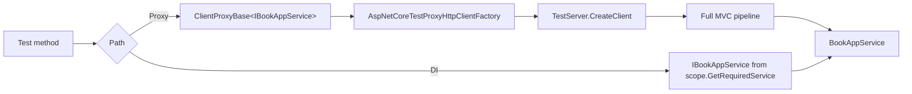

ABP layers two integration-test patterns on top of ASP.NET Core's `Microsoft.AspNetCore.Mvc.Testing.WebApplicationFactory<T>`. The modern path is `AbpWebApplicationFactoryIntegratedTest<TProgram>`, a derivative of `WebApplicationFactory<TProgram>` that flips the environment to `Production`, applies `appsettings.secrets.json`, and surfaces an `HttpClient` plus the `IServiceProvider`. The legacy path is `AbpAspNetCoreIntegratedTestBase<TStartupModule>` which uses `Microsoft.AspNetCore.TestHost.TestServer` directly and is now `[Obsolete]`. Both expose `ITestServerAccessor`, which the framework wires to override `IProxyHttpClientFactory` with a `TestServer`-backed `HttpClient` so dynamic C# client proxies invoke the real MVC pipeline in-process. Everything builds on the framework-agnostic `AbpIntegratedTest<TStartupModule>` (`framework/src/Volo.Abp.TestBase/`).

## Module composition

`Volo/Abp/AspNetCore/TestBase/AbpAspNetCoreTestBaseModule.cs`:

```csharp
[DependsOn(typeof(AbpHttpClientModule))]
[DependsOn(typeof(AbpAspNetCoreModule))]
[DependsOn(typeof(AbpTestBaseModule))]
[DependsOn(typeof(AbpAutofacModule))]
public class AbpAspNetCoreTestBaseModule : AbpModule { }
```

The `AbpAutofacModule` dependency means integration tests always run on Autofac (matching production solution templates). `AbpHttpClientModule` brings `ClientProxyBase` infrastructure; the `AspNetCoreTestProxyHttpClientFactory` (registered with `[Dependency(ReplaceServices = true)]`) intercepts proxy calls and routes them to the `TestServer` instead of opening a socket.

## `AbpIntegratedTest<TStartupModule>` (framework-agnostic)

`framework/src/Volo.Abp.TestBase/Volo/Abp/Testing/AbpIntegratedTest.cs` is the bedrock. It does **not** start any HTTP server — it only spins up the ABP container:

```csharp
public abstract class AbpIntegratedTest<TStartupModule> : AbpTestBaseWithServiceProvider, IDisposable
    where TStartupModule : IAbpModule
{
    protected IAbpApplication Application { get; }
    protected IServiceProvider RootServiceProvider { get; }
    protected IServiceScope TestServiceScope { get; }

    protected AbpIntegratedTest()
    {
        var services = CreateServiceCollection();           // virtual hook
        BeforeAddApplication(services);                     // virtual hook
        var application = services.AddApplication<TStartupModule>(SetAbpApplicationCreationOptions);
        Application = application;
        AfterAddApplication(services);                      // virtual hook
        RootServiceProvider = CreateServiceProvider(services); // BuildServiceProviderFromFactory()
        TestServiceScope = RootServiceProvider.CreateScope();
        application.Initialize(TestServiceScope.ServiceProvider);
        ServiceProvider = Application.ServiceProvider;
        AfterInitialize();                                  // virtual hook
    }
}
```

Hooks let test fixtures inject test doubles, register fake repositories or override settings before the application initialises. `AbpAsyncIntegratedTest` (`Testing/AbpAsyncIntegratedTest.cs`) is the asynchronous counterpart that uses `AddApplicationAsync` and `InitializeAsync`.

The framework-agnostic base is the one most unit/integration tests for application services and repositories inherit from directly (no MVC pipeline). The classes below add the HTTP layer on top.

## `AbpWebApplicationFactoryIntegratedTest<TProgram>`

`framework/src/Volo.Abp.AspNetCore.TestBase/Volo/Abp/AspNetCore/TestBase/AbpWebApplicationFactoryIntegratedTest.cs`:

```csharp
public abstract class AbpWebApplicationFactoryIntegratedTest<TProgram>
    : WebApplicationFactory<TProgram>
    where TProgram : class
{
    protected HttpClient Client { get; set; }
    protected IServiceProvider ServiceProvider => Services;

    protected AbpWebApplicationFactoryIntegratedTest()
    {
        Client = CreateClient(new WebApplicationFactoryClientOptions { AllowAutoRedirect = false });
        ServiceProvider.GetRequiredService<ITestServerAccessor>().Server = Server;
    }

    protected override IHost CreateHost(IHostBuilder builder)
    {
        builder
            .AddAppSettingsSecretsJson()
            .ConfigureServices(ConfigureServices);
        return base.CreateHost(builder);
    }

    protected override void ConfigureWebHost(IWebHostBuilder builder)
    {
        builder.ConfigureAppConfiguration((hostingContext, config) =>
        {
            hostingContext.HostingEnvironment.EnvironmentName = "Production";
        });
        base.ConfigureWebHost(builder);
    }
}
```

Key features:

- `Client` is constructed with `AllowAutoRedirect = false` so redirect responses are visible to assertions — important for testing OAuth challenge / `MultiTenancyMiddlewareErrorPageBuilder` redirect paths.
- `AddAppSettingsSecretsJson()` (extension in `Volo.Abp.AspNetCore`) layers `appsettings.secrets.json` for credentials that shouldn't be committed.
- `EnvironmentName = "Production"` ensures developer-only middleware (developer exception page, debug logging) is off and matches the deployed pipeline.
- Inside the constructor it pushes `Server` (the protected property from `WebApplicationFactory`) into `ITestServerAccessor` so other services in the DI graph (notably `AspNetCoreTestProxyHttpClientFactory`) can grab the in-process server.
- The base class also exposes `GetService<T>`, `GetRequiredService<T>`, keyed-service helpers, and the `GetUrl<TController>(...)` helpers (route resolution by controller type-name conventions).

### Sample

```csharp
public class BookApiTests : AbpWebApplicationFactoryIntegratedTest<Program>
{
    [Fact]
    public async Task Should_Create_Book()
    {
        var response = await Client.PostAsJsonAsync(GetUrl<BookAppService>("Create"),
            new CreateBookDto { Name = "ABP in Action" });
        response.EnsureSuccessStatusCode();
        var dto = await response.Content.ReadFromJsonAsync<BookDto>();
        dto!.Id.ShouldNotBe(Guid.Empty);
    }

    [Fact]
    public async Task Should_Inject_AppService_Directly()
    {
        // Call through DI without HTTP — same application instance
        await using var scope = ServiceProvider.CreateAsyncScope();
        var svc = scope.ServiceProvider.GetRequiredService<IBookAppService>();
        var dto = await svc.GetAsync(...);
        dto.ShouldNotBeNull();
    }
}
```

`TProgram` is the application's top-level `Program` class (the `.NET 6+` `Program.cs` "top-level statements" emit one).

## `AbpAspNetCoreIntegratedTestBase<TStartupModule>` (legacy)

`AbpAspNetCoreIntegratedTestBase.cs` is `[Obsolete("Use AbpWebApplicationFactoryIntegratedTest instead.")]`. It builds its own `IHostBuilder`:

```csharp
return Host.CreateDefaultBuilder()
    .AddAppSettingsSecretsJson()
    .ConfigureWebHostDefaults(webBuilder =>
    {
        if (typeof(TStartupModule).IsAssignableTo<IAbpModule>())
            webBuilder.UseStartup<TestStartup<TStartupModule>>();
        else
            webBuilder.UseStartup<TStartupModule>();
        webBuilder.UseAbpTestServer();
    })
    .UseAutofac()
    .ConfigureServices(ConfigureServices);
```

`TestStartup<TStartupModule>` (`Volo/Abp/AspNetCore/TestBase/TestStartup.cs`):

```csharp
internal class TestStartup<TStartupModule>
{
    public void ConfigureServices(IServiceCollection services)
        => AsyncHelper.RunSync(() => services.AddApplicationAsync(typeof(TStartupModule)));

    public void Configure(IApplicationBuilder app)
        => AsyncHelper.RunSync(app.InitializeApplicationAsync);
}
```

This is convenient when the test target *is* a module class rather than an ASP.NET Core `Startup` — it lets old-style apps that haven't moved to `Program.cs` participate in the test pipeline.

`AbpWebHostBuilderExtensions.UseAbpTestServer()`:

```csharp
public static IWebHostBuilder UseAbpTestServer(this IWebHostBuilder builder)
{
    return builder.ConfigureServices(services =>
    {
        services.AddScoped<IHostLifetime, AbpNoopHostLifetime>();
        services.AddScoped<IServer, TestServer>();
    });
}
```

Two ABP-specific hosts ship in this folder:

| Class | File | Purpose |
| --- | --- | --- |
| `AbpNoopHostLifetime` | `AbpNoopHostLifetime.cs` | Replaces console-lifetime so tests don't wait for `Ctrl+C`. |
| `TestNoopHostLifetime` | `TestNoopHostLifetime.cs` | Older variant kept for compatibility. |

## `ITestServerAccessor`

`Volo/Abp/AspNetCore/TestBase/ITestServerAccessor.cs` and `TestServerAccessor.cs`:

```csharp
public interface ITestServerAccessor
{
    TestServer Server { get; set; }
}
```

Registered as a singleton. It is the seam that lets infrastructure services reach the in-process test server. The most important consumer is the proxy HTTP-client override below.

## `AspNetCoreTestProxyHttpClientFactory`

`Volo/Abp/AspNetCore/TestBase/DynamicProxying/AspNetCoreTestProxyHttpClientFactory.cs`:

```csharp
[Dependency(ReplaceServices = true)]
public class AspNetCoreTestProxyHttpClientFactory : IProxyHttpClientFactory, ITransientDependency
{
    private readonly ITestServerAccessor _testServerAccessor;

    public HttpClient Create() => _testServerAccessor.Server.CreateClient();
    public HttpClient Create(string name) => Create();
}
```

This replaces the production `IProxyHttpClientFactory` so dynamic C# proxy calls (`IBookAppService` resolved through `Volo.Abp.Http.Client.DynamicProxying`) route through the `TestServer` instead of opening sockets. Practical consequence: an integration test can mix DI calls and HTTP-proxy calls without spinning up Kestrel.



## `WebProjectPatchHelper`

`Volo/Abp/AspNetCore/TestBase/WebProjectPatchHelper.cs` rewrites the runtime's content root to point at the web project's directory so that Razor view discovery, static files and embedded resource probing find the right base path. It is invoked automatically by `WebApplicationFactory` thanks to MSBuild-generated `WebApplicationFactoryContentRoot` attributes on test assemblies.

## Test helpers

### `GetUrl<TController>(...)`

Both `AbpWebApplicationFactoryIntegratedTest` and `AbpAspNetCoreIntegratedTestBase` expose URL helpers that mirror the route naming used by `AbpServiceConvention`:

```csharp
protected virtual string GetUrl<TController>()
{
    return "/" + typeof(TController).Name.RemovePostFix(
        "Controller", "AppService", "ApplicationService",
        "IntService", "IntegrationService", "Service");
}
```

So `GetUrl<BookAppService>("Create")` returns `/Book/Create`. The third overload appends query-string parameters from an anonymous object.

### `ConfigureServices(IServiceCollection)`

Override to register test doubles (mock email sender, fake clock):

```csharp
protected override void ConfigureServices(IServiceCollection services)
{
    services.AddSingleton<IEmailSender, NullEmailSender>();
    services.AddSingleton<IClock, FakeClock>();
}
```

In `AbpWebApplicationFactoryIntegratedTest` this is wired by `CreateHost(builder)`. In the legacy base it is wired by `.ConfigureServices(ConfigureServices)` in `CreateHostBuilder`.

## `WebApplicationBuilderExtensions.RunAbpModuleAsync<TModule>`

`Volo/Abp/AspNetCore/TestBase/WebApplicationBuilderExtensions.cs`:

```csharp
public static async Task RunAbpModuleAsync<TModule>(this WebApplicationBuilder builder, ...)
    where TModule : IAbpModule
{
    builder.Environment.ApplicationName = typeof(TModule).Assembly.GetName().Name;
    builder.Host.UseAutofac();
    await builder.AddApplicationAsync<TModule>(optionsAction);
    var app = builder.Build();
    await app.InitializeApplicationAsync();
    await app.RunAsync();
}
```

Helper for tests that want to host a module with the minimal hosting model — usually used inside `Program.cs` of a test web project so `AbpWebApplicationFactoryIntegratedTest<Program>` has a target.

## Recommended test layout

| Layer | Base class | Purpose |
| --- | --- | --- |
| Domain / application services | `AbpIntegratedTest<TStartupModule>` (or `AbpAsyncIntegratedTest`) | Pure in-process — fast. Use to test repositories, app services, domain services. |
| Controllers / Web API | `AbpWebApplicationFactoryIntegratedTest<Program>` | End-to-end HTTP. Use for routing, filters, auth, formatters. |
| C# client proxies | Same as above | The `IProxyHttpClientFactory` override routes calls to `TestServer`. |
| Legacy projects | `AbpAspNetCoreIntegratedTestBase<TStartupModule>` | Only when the host doesn't expose a `Program` class. |

## See also

<CardGroup cols={2}>
  <Card title="Base ASP.NET Core" href="/aspnetcore/volo-abp-aspnetcore">
    The middleware exercised by integration tests.
  </Card>
  <Card title="MVC integration" href="/aspnetcore/mvc-integration">
    `AbpServiceConvention` routes asserted by `GetUrl<T>`.
  </Card>
  <Card title="MVC client proxies" href="/aspnetcore/mvc-client-proxies">
    `IProxyHttpClientFactory` is the integration seam.
  </Card>
  <Card title="ops/test-base" href="/ops/test-base">
    CI build conventions for ABP test projects.
  </Card>
</CardGroup>
