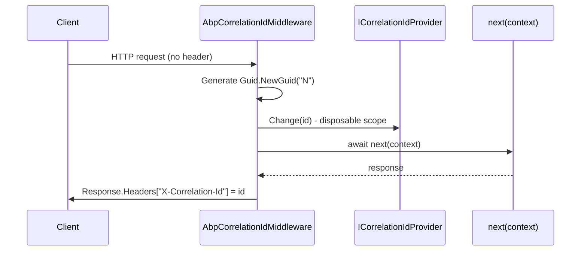

`framework/src/Volo.Abp.AspNetCore/` is the foundational package that turns an ABP application into an ASP.NET Core application. It registers `IHttpContextAccessor`-backed implementations of `ICurrentTenant`, `ICurrentUser`, `ICancellationTokenProvider`, `IClientInfoProvider` and `IClaimsPrincipalAccessor`; ships every ABP middleware (correlation id, exception handling, auditing, unit of work, request localization, dynamic claims, security headers, time zone); composes the virtual file system into `IWebHostEnvironment.WebRootFileProvider`; and adds `ObjectAccessor<IApplicationBuilder>`, `ObjectAccessor<WebApplication>`, `ObjectAccessor<IHost>` and `ObjectAccessor<IEndpointRouteBuilder>` so that any ABP service can reach the host primitives without a constructor dependency.

## Module definition

`Volo.Abp.AspNetCore/Volo/Abp/AspNetCore/AbpAspNetCoreModule.cs` declares this dependency list:

| `[DependsOn]` module | Why |
| --- | --- |
| `AbpAuditingModule` | Provides `IAuditingManager` consumed by `AbpAuditingMiddleware`. |
| `AbpSecurityModule` | `ICurrentPrincipalAccessor` and friends. |
| `AbpVirtualFileSystemModule` | Embedded asset overlay merged into `WebRootFileProvider`. |
| `AbpUnitOfWorkModule` | `IUnitOfWorkManager` for `AbpUnitOfWorkMiddleware`. |
| `AbpHttpModule` | Shared HTTP error contracts (`RemoteServiceErrorResponse`). |
| `AbpAuthorizationModule` | Wires `AddAuthorization` and policy providers. |
| `AbpValidationModule` | Request payload validation. |
| `AbpExceptionHandlingModule` | `IExceptionNotifier` plumbing. |
| `AbpAspNetCoreAbstractionsModule` | Hosting-agnostic interfaces. |

### PreConfigureServices

```csharp
public override void PreConfigureServices(ServiceConfigurationContext context)
{
    var abpHostEnvironment = context.Services.GetSingletonInstance<IAbpHostEnvironment>();
    if (abpHostEnvironment.EnvironmentName.IsNullOrWhiteSpace())
    {
        abpHostEnvironment.EnvironmentName = context.Services.GetHostingEnvironment().EnvironmentName;
    }
}
```

`IAbpHostEnvironment` is the framework-agnostic counterpart to `IWebHostEnvironment`; this line copies the environment name so non-AspNetCore code (background workers, blob storage, modules under test) sees the same value.

### ConfigureServices

The following actions execute in order inside `ConfigureServices`:

1. `AddAuthorization()` — registers the default authorization stack so `[Authorize]` works without further configuration.
2. `Configure<AbpAuditingOptions>` adds `AspNetCoreAuditLogContributor` so audit logs carry HTTP context (URL, method, browser info, IP).
3. `Configure<StaticFileOptions>` replaces the content-type provider with `AbpFileExtensionContentTypeProvider` (`Volo.Abp.AspNetCore/Volo/Abp/AspNetCore/VirtualFileSystem/`) which knows about ABP-defined MIME types.
4. `AddHttpContextAccessor()` enables `IHttpContextAccessor`-based providers in the abstractions module.
5. `AddObjectAccessor<IApplicationBuilder>()`, `AddObjectAccessor<WebApplication>()`, `AddObjectAccessor<IHost>()` and `AddObjectAccessor<IEndpointRouteBuilder>()` reserve slots that get populated by `InitializeApplication(Async)` (see below).
6. `AddAbpDynamicOptions<RequestLocalizationOptions, AbpRequestLocalizationOptionsManager>()` rebuilds `RequestLocalizationOptions` whenever a new culture is added at runtime.
7. `StaticWebAssetsLoader.UseStaticWebAssets(...)` is called early so RCL assets resolve before `Configure`.
8. `AddHttpUserAgentCachedParser()` registers MyCSharp's cached UA parser, used by `HttpContextWebClientInfoProvider`.

### OnApplicationInitialization

```csharp
public override void OnApplicationInitialization(ApplicationInitializationContext context)
{
    var environment = context.GetEnvironmentOrNull();
    if (environment != null)
    {
        environment.WebRootFileProvider =
            new CompositeFileProvider(
                context.GetEnvironment().WebRootFileProvider,
                context.ServiceProvider.GetRequiredService<IWebContentFileProvider>()
            );
    }
}
```

`IWebContentFileProvider` (`Volo.Abp.AspNetCore.Abstractions/Volo/Abp/AspNetCore/VirtualFileSystem/IWebContentFileProvider.cs`) is the bridge from the ABP virtual file system into `IWebHostEnvironment`. The composite provider lets RCLs and modules ship `wwwroot` assets via embedded resources without copying them to disk.

## Request pipeline middleware

The middleware classes live under `Volo.Abp.AspNetCore/Volo/Abp/AspNetCore/<area>/`. All inherit `AbpMiddlewareBase` (`Volo/Abp/AspNetCore/Middleware/AbpMiddlewareBase.cs`) which uses convention-based factory dispatch from `UseMiddleware<T>`.

### Correlation id

`Tracing/AbpCorrelationIdMiddleware.cs` reads `_options.HttpHeaderName` (default `X-Correlation-Id`) from the request, generates a GUID-N if missing, pushes it through `_correlationIdProvider.Change(correlationId)` so all downstream code (logs, audit, distributed events) sees the same value, and writes it back on `Response.OnStarting` when `SetResponseHeader` is on.



### Exception handling

`ExceptionHandling/AbpExceptionHandlingMiddleware.cs` catches every unhandled exception below it, resolves the appropriate HTTP status with `IHttpExceptionStatusCodeFinder` (defaults under `ExceptionHandling/DefaultHttpExceptionStatusCodeFinder.cs`), serialises a `RemoteServiceErrorResponse` (from `Volo.Abp.Http`), and notifies the `IExceptionNotifier` so audit/log subsystems record it. `AbpAuthorizationException` is delegated to `IAbpAuthorizationExceptionHandler`. The `_AbpExceptionHandlingMiddleware_Added` marker on `app.Properties` ensures double-registration is a no-op — `UseUnitOfWork` calls `UseAbpExceptionHandling` first to satisfy ordering even if the caller already added it.

### Auditing

`Auditing/AbpAuditingMiddleware.cs` opens an `IAuditLogScope` per request, filtered by `AbpAspNetCoreAuditingOptions.IgnoredUrls`. The companion `Auditing/AspNetCoreAuditLogContributor.cs` fills `AuditLogInfo` with `HttpMethod`, `Url`, `ClientIpAddress`, `BrowserInfo` from `HttpContextWebClientInfoProvider`.

### Unit of work

`Uow/AbpUnitOfWorkMiddleware.cs` calls `IUnitOfWorkManager.Begin(...)`, scoped by `AbpAspNetCoreUnitOfWorkOptions`. `Uow/AspNetCoreUnitOfWorkTransactionBehaviourProvider.cs` decides per request whether transactions are enabled — by default GET requests are non-transactional; configure via `AspNetCoreUnitOfWorkTransactionBehaviourProviderOptions` to override.

### Request localization

`Microsoft/AspNetCore/RequestLocalization/AbpRequestLocalizationMiddleware.cs` wraps the stock `RequestLocalizationMiddleware` but obtains its options from `IAbpRequestLocalizationOptionsProvider.GetLocalizationOptionsAsync()` so newly added languages take effect without a restart. `AbpRequestCultureCookieHelper.SetCultureCookie` writes the chosen culture back to a cookie on response start when the source was the query string provider.

### Dynamic claims

`Security/Claims/AbpDynamicClaimsMiddleware.cs` refreshes `ClaimsPrincipal` from `AbpDynamicClaimsPrincipalContributorCache` so that role/permission claim changes propagate to active sessions without a re-login.

### Security headers

`Security/AbpSecurityHeadersMiddleware.cs` applies the headers in `AbpSecurityHeadersOptions` (CSP, X-Frame-Options, X-Content-Type-Options, Referrer-Policy). `IgnoreAbpSecurityHeader` attribute on endpoints suppresses it.

### Time zone

`Microsoft/AspNetCore/Timing/AbpTimeZoneMiddleware.cs` reads the user's preferred time zone from the timing settings and pushes it into `IClock` via `ICurrentTimezoneProvider`. The doc-comment on `UseAbpTimeZone` instructs callers to place it **after** `UseMultiTenancy` so tenant-level timezone settings resolve correctly.

## `IApplicationBuilder` extensions

All extensions are defined in `Microsoft/AspNetCore/Builder/AbpApplicationBuilderExtensions.cs`. They are the canonical way to register the middleware above.

| Extension | Middleware registered | Notes |
| --- | --- | --- |
| `InitializeApplicationAsync(this IApplicationBuilder app)` | None | Publishes the app/`WebApplication`/`IHost`/`IEndpointRouteBuilder` to their `ObjectAccessor`s, hooks `ApplicationStopping`/`ApplicationStopped` to `IAbpApplicationWithExternalServiceProvider.ShutdownAsync`/`Dispose`, then calls `application.InitializeAsync(app.ApplicationServices)`. |
| `InitializeApplication(this IApplicationBuilder app)` | None | Sync variant. |
| `UseCorrelationId()` | `AbpCorrelationIdMiddleware` | Place very early; required for tracing the rest of the pipeline. |
| `UseAbpRequestLocalization(Action<RequestLocalizationOptions>?)` | `AbpRequestLocalizationMiddleware` | Caller can patch the dynamic options before middleware runs. |
| `UseAbpExceptionHandling()` | `AbpExceptionHandlingMiddleware` | Idempotent — uses a `Properties` marker. |
| `UseAuditing()` | `AbpAuditingMiddleware` | |
| `UseUnitOfWork()` | `AbpExceptionHandlingMiddleware` + `AbpUnitOfWorkMiddleware` | Always pairs exception handling before UoW. |
| `UseAbpSecurityHeaders()` | `AbpSecurityHeadersMiddleware` | |
| `UseDynamicClaims()` | `AbpDynamicClaimsMiddleware` | |
| `UseAbpTimeZone()` | `AbpTimeZoneMiddleware` | After `UseMultiTenancy()`. |
| `UseStaticFilesForPatterns(params string[] patterns)` | `StaticFiles` middleware wrapped by `AbpStaticFileProvider` | Glob-pattern static file serving. |
| `MapAbpStaticAssets(this WebApplication app, string?)` | `MapStaticAssets` + `UseVirtualStaticFiles` | New .NET 9 endpoint-routed static assets, plus the virtual file system overlay. |
| `UseVirtualStaticFiles()` | `StaticFiles` middleware over `WebContentFileProvider` | Serves embedded RCL `wwwroot` files. |
| `UseVirtualStaticFiles(string folder)` | `StaticFiles` middleware over `PhysicalFileProvider(folder)` | Only mounts if the folder exists on disk. |

## Canonical pipeline order

The pipeline order used by ABP's solution templates and verified by the modules in `framework/src` is:

```csharp
app.UseAbpRequestLocalization();
app.UseStaticFiles();              // or MapAbpStaticAssets in .NET 9 hosts
app.UseRouting();
app.UseAbpSecurityHeaders();
app.UseAuthentication();
app.UseAbpOpenIddictValidation();   // when OpenIddict is used
app.UseMultiTenancy();              // from Volo.Abp.AspNetCore.MultiTenancy
app.UseAbpTimeZone();
app.UseUnitOfWork();                // also installs AbpExceptionHandlingMiddleware
app.UseDynamicClaims();
app.UseAuthorization();
app.UseSwagger();
app.UseAbpSwaggerUI(...);
app.UseAuditing();
app.UseAbpSerilogEnrichers();
app.UseConfiguredEndpoints();       // from AbpEndpointRouterOptions
```


## `IWebHostEnvironment` integration

Two extensions live in `Microsoft/AspNetCore/Hosting/AbpHostingEnvironmentExtensions.cs` and the related DI helpers in `Microsoft/Extensions/DependencyInjection/`:

- `IServiceCollection.GetHostingEnvironment()` returns an `IWebHostEnvironment` from the captured `ServiceProvider` if available, or an `EmptyHostingEnvironment` fallback (`EmptyHostingEnvironment.cs`) so module configuration that runs before the web host is built still gets a sensible default.
- `EmptyHostingEnvironment` exposes `ContentRootPath = AppContext.BaseDirectory`, an in-memory `ContentRootFileProvider`, and is used by `UseVirtualStaticFiles()` when called from a non-web host (e.g. a unit test).

`WebApplicationBuilderExtensions.cs` exposes `RegisterAbpServiceProviderFactory` so the standard `WebApplication.CreateBuilder` pattern can opt into Autofac just like `Host.CreateDefaultBuilder` does.

## Auxiliary infrastructure

| Area | Source file | What it provides |
| --- | --- | --- |
| Action info | `Volo/Abp/AspNetCore/AbpActionInfoInHttpContext.cs` | Surfaces controller/action metadata to auditing and exception handling. |
| Constants | `Volo/Abp/AspNetCore/AbpAspNetCoreConsts.cs` | Cookie / header names used across the framework. |
| Replace controllers | `Volo/Abp/AspNetCore/Controllers/ReplaceControllersAttribute.cs` | Marks a controller as overriding another in the application part graph. |
| Client scope | `Volo/Abp/AspNetCore/DependencyInjection/HttpContextClientScopeServiceProviderAccessor.cs` | Wires per-request scope into `IClientScopeServiceProviderAccessor`. |
| Security log | `Volo/Abp/AspNetCore/SecurityLog/AspNetCoreSecurityLogManager.cs` | Saves security logs with browser info from HTTP context. |
| Cancellation | `Volo/Abp/AspNetCore/Threading/HttpContextCancellationTokenProvider.cs` | Returns `HttpContext.RequestAborted` for `ICancellationTokenProvider.Token`. |
| Web client info | `Volo/Abp/AspNetCore/WebClientInfo/HttpContextWebClientInfoProvider.cs` | Browser/IP info used by auditing. |
| Cookie config | `Microsoft/Extensions/DependencyInjection/CookieAuthenticationOptionsExtensions.cs` | Adds `OnRedirectToLogin` heuristics that return 401 for AJAX. |
| CORS | `Microsoft/AspNetCore/Cors/AbpCorsPolicyBuilderExtensions.cs` | `WithAbpExposedHeaders` exposes `X-Correlation-Id`, `Abp-Tenant-Resolve-Error` and similar diagnostics to browsers. |
| Routing | `Microsoft/AspNetCore/Routing/AbpEndpointRouterOptions.cs` + `EndpointRouteBuilderContext.cs` | Lets every module add endpoint contributions executed by `UseConfiguredEndpoints`. |

## `RazorViews` base page

`Volo/Abp/AspNetCore/RazorViews/AbpCompilationRazorPageBase.cs` is the lightweight Razor page base used by error pages (`MultiTenancyMiddlewareErrorPage`, `AbpMvcLibsErrorPage`) that need to render without the full MVC pipeline. It includes helpers like `WriteAttributeTo` and `WriteLiteralTo` plus tiny `AttributeValue` / `HelperResult` types in the same folder.

## Where to go next

<CardGroup cols={2}>
  <Card title="MVC Integration" href="/aspnetcore/mvc-integration">
    The MVC layer that depends on this module.
  </Card>
  <Card title="HTTP request lifecycle" href="/flows/http-request-lifecycle">
    End-to-end trace of a request through these middleware classes.
  </Card>
  <Card title="Modularity system" href="/core/modularity-system">
    How module DependsOn graphs and `OnApplicationInitialization` ordering are computed.
  </Card>
  <Card title="Logging & tracing" href="/core/logging-and-tracing">
    `ICorrelationIdProvider`, `AbpCorrelationIdOptions`, distributed tracing.
  </Card>
</CardGroup>
