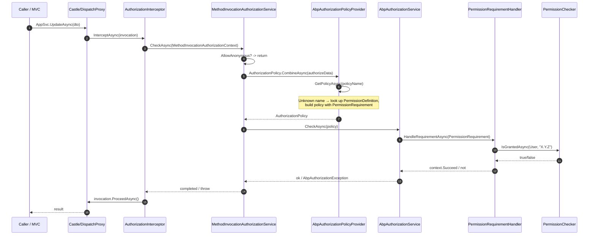

`framework/src/Volo.Abp.Authorization/` plugs into the standard ASP.NET Core authorization model and adds two things on top: a **dynamic-proxy interceptor** that runs `[Authorize]` checks for any DI-resolved class (not just MVC controllers) and a **policy provider** that auto-promotes permission names into `AuthorizationPolicy` instances backed by `IPermissionChecker`.

## Module wiring

`AbpAuthorizationModule` (`Volo/Abp/Authorization/AbpAuthorizationModule.cs`) depends on `AbpAuthorizationAbstractionsModule`, `AbpSecurityModule`, `AbpLocalizationModule` and `AbpMultiTenancyModule`. In `PreConfigureServices` it hooks `AuthorizationInterceptorRegistrar.RegisterIfNeeded` into `IServiceCollection.OnRegistered` and auto-discovers every `IPermissionDefinitionProvider`. In `ConfigureServices` it:

- Calls `AddAuthorizationCore()` (the ASP.NET Core authorization handlers, options).
- Registers `PermissionRequirementHandler` and `PermissionsRequirementHandler` as singletons.
- Adds the default value providers — `UserPermissionValueProvider`, `RolePermissionValueProvider`, `ClientPermissionValueProvider` — and their resource-permission counterparts to `AbpPermissionOptions`.
- Registers the embedded localization resource `AbpAuthorizationResource` and maps the `Volo.Authorization` exception namespace to it.

```csharp
// framework/src/Volo.Abp.Authorization/Volo/Abp/Authorization/AbpAuthorizationModule.cs
context.Services.OnRegistered(AuthorizationInterceptorRegistrar.RegisterIfNeeded);

context.Services.AddAuthorizationCore();
context.Services.AddSingleton<IAuthorizationHandler, PermissionRequirementHandler>();
context.Services.AddSingleton<IAuthorizationHandler, PermissionsRequirementHandler>();

Configure<AbpPermissionOptions>(options =>
{
    options.ValueProviders.Add<UserPermissionValueProvider>();
    options.ValueProviders.Add<RolePermissionValueProvider>();
    options.ValueProviders.Add<ClientPermissionValueProvider>();
    // + resource value providers
});
```

## `AbpAuthorizationService`

`Volo/Abp/Authorization/AbpAuthorizationService.cs` is registered with `[Dependency(ReplaceServices = true)]` and derives from ASP.NET Core's `DefaultAuthorizationService`. The only behavioural change is that it captures `ICurrentPrincipalAccessor` and exposes `CurrentPrincipal` so the `AbpAuthorizationServiceExtensions` (in `Microsoft/AspNetCore/Authorization/AbpAuthorizationServiceExtensions.cs`) can offer a "no resource, no principal" overload set:

```csharp
public static async Task<AuthorizationResult> AuthorizeAsync(this IAuthorizationService authorizationService, string policyName)
    => await AuthorizeAsync(authorizationService, null, policyName);

public static async Task<AuthorizationResult> AuthorizeAsync(this IAuthorizationService authorizationService, object? resource, string policyName)
    => await authorizationService.AuthorizeAsync(
        authorizationService.AsAbpAuthorizationService().CurrentPrincipal,
        resource,
        policyName);
```

The same file adds `IsGrantedAsync`, `IsGrantedAnyAsync` and `CheckAsync` shortcuts that throw `AbpAuthorizationException` carrying one of the `AbpAuthorizationErrorCodes` constants (see below).

## `MethodInvocationAuthorizationService`

`MethodInvocationAuthorizationService.CheckAsync(MethodInvocationAuthorizationContext context)` (`Volo/Abp/Authorization/MethodInvocationAuthorizationService.cs`) is the engine behind every interception:

1. If the method or anything on its declaring type implements `IAllowAnonymous`, return.
2. Combine every `IAuthorizeData` attribute on the method **and** its declaring type into a single `AuthorizationPolicy` via `AuthorizationPolicy.CombineAsync(IAbpAuthorizationPolicyProvider, …)`.
3. Call `IAbpAuthorizationService.CheckAsync(authorizationPolicy)`, which delegates to the ASP.NET Core engine and throws on failure.

```csharp
public virtual async Task CheckAsync(MethodInvocationAuthorizationContext context)
{
    if (AllowAnonymous(context)) return;

    var authorizationPolicy = await AuthorizationPolicy.CombineAsync(
        _abpAuthorizationPolicyProvider,
        GetAuthorizationDataAttributes(context.Method));

    if (authorizationPolicy == null) return;

    await _abpAuthorizationService.CheckAsync(authorizationPolicy);
}
```

`GetAuthorizationDataAttributes` only unions class-level `[Authorize]` attributes when the method is public, matching the ASP.NET Core convention that non-public methods are not authorization boundaries.

## The dynamic-proxy interceptor

`AuthorizationInterceptor` (`Volo/Abp/Authorization/AuthorizationInterceptor.cs`) is an `AbpInterceptor` (see [`/core/dynamic-proxy-and-aspects`](/core/dynamic-proxy-and-aspects)) that calls `MethodInvocationAuthorizationService` before forwarding the invocation:

```csharp
public override async Task InterceptAsync(IAbpMethodInvocation invocation)
{
    await AuthorizeAsync(invocation);
    await invocation.ProceedAsync();
}
```

`AuthorizationInterceptorRegistrar.ShouldIntercept` (`Volo/Abp/Authorization/AuthorizationInterceptorRegistrar.cs`) decides which DI registrations get the interceptor:

- The type must not be in `DynamicProxyIgnoreTypes`.
- The type itself or any of its public/non-public instance methods must carry `[Authorize]`.

That means **every application service or domain service that uses `[Authorize]` is automatically intercepted** — even if it is invoked directly from another service rather than through MVC. This is the canonical way to authorize application-layer methods without re-checking in the controller.

### Method-invocation flow



## `AbpAuthorizationPolicyProvider`

`AbpAuthorizationPolicyProvider` (`Volo/Abp/Authorization/AbpAuthorizationPolicyProvider.cs`) extends ASP.NET Core's `DefaultAuthorizationPolicyProvider`. `GetPolicyAsync` first tries the normal options-based lookup. If that returns `null`, it asks `IPermissionDefinitionManager` for a permission with that exact name, and if found, builds an ad-hoc policy:

```csharp
var permission = await _permissionDefinitionManager.GetOrNullAsync(policyName);
if (permission != null)
{
    var policyBuilder = new AuthorizationPolicyBuilder(Array.Empty<string>());
    policyBuilder.Requirements.Add(new PermissionRequirement(policyName));
    return policyBuilder.Build();
}
```

If the name matches a resource permission instead, it wraps a `ResourcePermissionRequirement` (`framework/src/Volo.Abp.Authorization.Abstractions/Volo/Abp/Authorization/ResourcePermissionRequirement.cs`). `GetPoliciesNamesAsync` returns the union of statically registered policy names and every defined permission name — this is what `dotnet abp` tooling and SignalR endpoint metadata use to enumerate available policies. The source includes a `//TODO: Optimize & Cache!` comment — currently the builder is recreated on each call.

## Requirement handlers

- `PermissionRequirement(Handler)` — single permission. The constructor takes `string permissionName`. The handler calls `IPermissionChecker.IsGrantedAsync(context.User, requirement.PermissionName)` and `context.Succeed` on success. Source: `framework/src/Volo.Abp.Authorization.Abstractions/Volo/Abp/Authorization/PermissionRequirement.cs` and `PermissionRequirementHandler.cs`. This is the requirement that `AbpAuthorizationPolicyProvider` synthesises for unknown policy names.
- `PermissionsRequirement(Handler)` — batch with `string[] PermissionNames` and a `bool RequiresAll` flag. Calls the batched `IPermissionChecker.IsGrantedAsync(string[])` overload, then succeeds if `RequiresAll ? AllGranted : Any(x => x.Value == Granted)`. There is no built-in attribute that emits this requirement; callers compose it themselves via `AuthorizationPolicyBuilder.AddRequirements(new PermissionsRequirement(names, requiresAll: true))` and reference the resulting policy by name.
- `ResourcePermissionRequirement` (`framework/src/Volo.Abp.Authorization.Abstractions/Volo/Abp/Authorization/ResourcePermissionRequirement.cs`) and `KeyedObjectResourcePermissionRequirementHandler` (`framework/src/Volo.Abp.Authorization/Volo/Abp/Authorization/Permissions/Resources/KeyedObjectResourcePermissionRequirementHandler.cs`) — same idea for resource permissions. The handler is `AuthorizationHandler<ResourcePermissionRequirement, IKeyedObject>`: it pulls `resource.GetType().FullName` and `resource.GetObjectKey()` and calls `IResourcePermissionChecker.IsGrantedAsync(user, name, resourceName, resourceKey)`. The policy provider creates this requirement when the policy name matches an entry returned by `IPermissionDefinitionManager.GetResourcePermissionsAsync()`.

The handlers are always registered as singletons (`AddSingleton<IAuthorizationHandler, …>`), so they must not capture scoped state — that is why they take `IPermissionChecker` (transient) through the framework's `IServiceProvider` indirection.

## Error codes and exception

`AbpAuthorizationErrorCodes` (`Volo/Abp/Authorization/AbpAuthorizationErrorCodes.cs`) enumerates the codes that the `CheckAsync` extensions attach to thrown `AbpAuthorizationException` instances:

| Code | When |
|---|---|
| `Volo.Authorization:010001` | `CheckAsync(IAuthorizationService, AuthorizationPolicy)` failed (no resource, no policy name). |
| `Volo.Authorization:010002` | `CheckAsync(IAuthorizationService, string policyName)` failed — `PolicyName` attached as data. |
| `Volo.Authorization:010003` | `CheckAsync(IAuthorizationService, object resource, AuthorizationPolicy/string policyName)` failed. |
| `Volo.Authorization:010004` | `CheckAsync(IAuthorizationService, object resource, IAuthorizationRequirement)` failed. |
| `Volo.Authorization:010005` | `CheckAsync(IAuthorizationService, object resource, IEnumerable<IAuthorizationRequirement>)` failed. |

`AbpAuthorizationException` (`framework/src/Volo.Abp.Security/Volo/Abp/Authorization/AbpAuthorizationException.cs`) implements `IHasLogLevel` (default `Warning`) and `IHasErrorCode`. The HTTP exception filter maps it to **401** when the user is not authenticated, and **403** when the user is authenticated but lacks the permission — see [`/aspnetcore/overview`](/aspnetcore/overview).

## Day-to-day usage

```csharp
[Authorize] // intercepted at the type level
public class BookAppService : ApplicationService, IBookAppService
{
    [Authorize(BookPermissions.Create)] // policyName auto-promoted via PermissionDefinition
    public Task<BookDto> CreateAsync(CreateBookDto input) { ... }

    [AllowAnonymous]
    public Task<BookDto> GetAsync(Guid id) { ... }
}
```

The interceptor sees the class-level `[Authorize]` and intercepts. For `CreateAsync` the combined attributes resolve to a policy named `BookPermissions.Create`; `AbpAuthorizationPolicyProvider` finds the matching `PermissionDefinition` and builds a `PermissionRequirement`; `PermissionRequirementHandler` calls `IPermissionChecker`, which fans out through `UserPermissionValueProvider`, `RolePermissionValueProvider`, and `ClientPermissionValueProvider` — see [`auth/permissions`](/auth/permissions).

For ad-hoc checks inside method bodies, prefer the extension methods so they pick up `CurrentPrincipal` automatically:

```csharp
await AuthorizationService.CheckAsync(BookPermissions.Create);
if (await AuthorizationService.IsGrantedAnyAsync(BookPermissions.Edit, BookPermissions.Delete)) { ... }
```

## See also

- Permission definitions, value providers and storage — [`auth/permissions`](/auth/permissions).
- Claims principal and `CurrentUser` — [`auth/security-and-claims`](/auth/security-and-claims).
- Dynamic-proxy mechanics — [`/core/dynamic-proxy-and-aspects`](/core/dynamic-proxy-and-aspects).
- HTTP exception mapping — [`/aspnetcore/overview`](/aspnetcore/overview).
