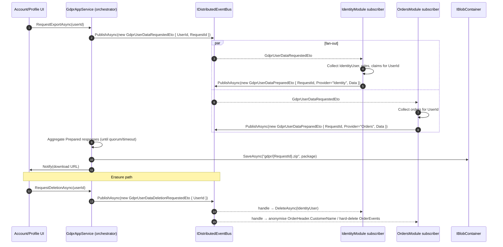

`Volo.Abp.Gdpr.Abstractions` (`framework/src/Volo.Abp.Gdpr.Abstractions/`) is a contracts-only package. It defines the **distributed event payloads** and the **provider context** used by ABP's data-subject access (Article 15) and right-to-erasure (Article 17) flows. The implementations — orchestration, request storage, file packaging, hard-delete cascade — live in commercial modules and in `modules/identity`, but the wire format is here so any third-party module can participate without taking a dependency on those higher-level modules.

The whole package is small enough to list in one go:

```text
Volo.Abp.Gdpr.Abstractions/Volo/Abp/Gdpr/
├── AbpGdprAbstractionsModule.cs
├── GdprDataInfo.cs
├── GdprUserDataDeletionRequestedEto.cs
├── GdprUserDataPreparedEto.cs
├── GdprUserDataProviderContext.cs
└── GdprUserDataRequestedEto.cs
```

## Module

`AbpGdprAbstractionsModule` (`AbpGdprAbstractionsModule.cs`):

```csharp
public class AbpGdprAbstractionsModule : AbpModule { }
```

There is nothing to register. The module exists so concrete implementations and downstream modules have a stable `[DependsOn]` target.

## Data shape

### `GdprDataInfo`

`GdprDataInfo.cs` is just a typed dictionary:

```csharp
[Serializable]
public class GdprDataInfo : Dictionary<string, string> { }
```

Each `(key, value)` pair is one column of exported data. The convention used by ABP modules:

- `key` is a logical column name (e.g. `"UserName"`, `"Email"`, `"PhoneNumber"`).
- `value` is the JSON or string representation of the value at request time.

Because the payload is `Dictionary<string, string>`, **every value must be string-encoded** before it goes into the ETO. For richer shapes (collections, blobs), serialise to JSON and store the JSON text — the consumer will rehydrate when assembling the final export file.

### `GdprUserDataProviderContext`

`GdprUserDataProviderContext.cs`:

```csharp
public class GdprUserDataProviderContext
{
    public Guid UserId { get; set; }
}
```

A provider that contributes data to an export gets this context. There is intentionally no `TenantId` on the context — providers run inside an existing `ICurrentTenant` scope set up by the orchestrator, so they should resolve current-tenant from DI rather than from the payload.

## The three ETOs

ABP's distributed event bus is the glue. The export flow is request → fan-out to providers → response per provider; the deletion flow is request → fan-out to handlers. All payloads are `[Serializable]` so they round-trip through any `IDistributedEventBus` implementation (in-memory, RabbitMQ, Kafka, Azure Service Bus, Dapr — see [`/eventbus/distributed-event-bus`](/eventbus/distributed-event-bus)).

### `GdprUserDataRequestedEto` — "please collect data for this user"

`GdprUserDataRequestedEto.cs`:

```csharp
[Serializable]
public class GdprUserDataRequestedEto
{
    public Guid UserId { get; set; }
    public Guid RequestId { get; set; }
}
```

Published by the orchestrator (typically an Identity-side `GdprAppService`) when a data-subject access request is registered. Every module that owns user-related data is expected to subscribe with a `IDistributedEventHandler<GdprUserDataRequestedEto>`, gather its rows for `UserId`, build a `GdprDataInfo`, and publish back a `GdprUserDataPreparedEto`.

### `GdprUserDataPreparedEto` — "here is my contribution"

`GdprUserDataPreparedEto.cs`:

```csharp
[Serializable]
public class GdprUserDataPreparedEto
{
    public Guid RequestId { get; set; }
    public string Provider { get; set; } = default!;
    public GdprDataInfo Data { get; set; } = default!;
}
```

- `RequestId` correlates the response back to the original `GdprUserDataRequestedEto` so the orchestrator can aggregate.
- `Provider` is a free-form string identifying the producer (recommended: the assembly name or a domain prefix — `"Volo.Abp.Identity"`, `"BookStore.Orders"`). The orchestrator uses it to namespace keys in the assembled package and to detect duplicates.
- `Data` is the actual key/value contribution.

The orchestrator typically waits for "enough" responses by holding the request open for a configurable timeout or until every registered provider has replied, then packages the union of contributions into a downloadable archive.

### `GdprUserDataDeletionRequestedEto` — "delete this user"

`GdprUserDataDeletionRequestedEto.cs`:

```csharp
[Serializable]
public class GdprUserDataDeletionRequestedEto
{
    public Guid UserId { get; set; }
}
```

Published when an erasure request reaches "approved" state. Every module that stores user-linked data subscribes and performs the appropriate erasure — hard delete, anonymisation, or pseudonymisation depending on the legal retention policy that applies to its data.

There is no "deletion completed" ETO in the abstractions. If your flow needs confirmation, define your own.

## Personal-data protection (`IPersonalDataProtector`)

The framework abstractions do not declare an `IPersonalDataProtector` interface; the closest in-tree primitive is `IStringEncryptionService` (`framework/src/Volo.Abp.Security/Volo/Abp/Security/Encryption/IStringEncryptionService.cs`), which is what `IdentityUser` fields use when they need transparent encryption at rest. Modules that ship richer PII handling (e.g. ABP Suite-generated entities marked with `[PersonalData]` attribute compatible with `Microsoft.AspNetCore.Identity`) re-use the same encryption service. Inject `IStringEncryptionService` directly when you need encrypt/decrypt within a GDPR provider.

## Putting it together — distributed flow



## Implementing a provider

A producer is just an `IDistributedEventHandler<GdprUserDataRequestedEto>`:

```csharp
public class OrdersGdprProvider :
    IDistributedEventHandler<GdprUserDataRequestedEto>,
    ITransientDependency
{
    private readonly IOrderRepository _repo;
    private readonly IDistributedEventBus _bus;

    public OrdersGdprProvider(IOrderRepository repo, IDistributedEventBus bus)
    {
        _repo = repo;
        _bus = bus;
    }

    public async Task HandleEventAsync(GdprUserDataRequestedEto eventData)
    {
        var orders = await _repo.GetListByCustomerIdAsync(eventData.UserId);

        var data = new GdprDataInfo();
        foreach (var order in orders)
        {
            // string-encode every value
            data[$"Order_{order.Id}"] = JsonSerializer.Serialize(new
            {
                order.OrderNumber, order.Total, order.PlacedAt, order.ShippingAddress
            });
        }

        await _bus.PublishAsync(new GdprUserDataPreparedEto
        {
            RequestId = eventData.RequestId,
            Provider = "BookStore.Orders",
            Data = data
        });
    }
}
```

A consumer of the deletion event is the symmetrical handler:

```csharp
public class OrdersGdprDeletionHandler :
    IDistributedEventHandler<GdprUserDataDeletionRequestedEto>,
    ITransientDependency
{
    private readonly IOrderRepository _repo;

    public OrdersGdprDeletionHandler(IOrderRepository repo) => _repo = repo;

    public async Task HandleEventAsync(GdprUserDataDeletionRequestedEto eventData)
    {
        // Anonymise to keep accounting records but strip PII
        await _repo.AnonymiseCustomerAsync(eventData.UserId);
    }
}
```

The same pattern applies whether you process synchronously (in-memory event bus, single host) or asynchronously across services (RabbitMQ/Kafka).

## Implementation hosts

- `modules/identity` is the canonical producer of `IdentityUser`/`IdentityRole`/`IdentityUserClaim` contributions, and the consumer that performs the user hard-delete on `GdprUserDataDeletionRequestedEto`.
- ABP Commercial Account Pro provides the orchestrator (`GdprAppService`, request storage, audit) and the UI for requesting export and deletion.
- The community-maintained samples in the ABP repository show third-party modules contributing rows via the same ETO contracts.

If you are writing a fresh module today, target only `Volo.Abp.Gdpr.Abstractions` — that keeps your code portable across the commercial and community orchestrators.

## See also

- Distributed event bus internals — [`/eventbus/distributed-event-bus`](/eventbus/distributed-event-bus).
- Identity user / role aggregates that participate in export/deletion — [`/modules/identity`](/modules/identity).
- String encryption used to protect PII at rest — [`auth/security-and-claims`](/auth/security-and-claims).
- BLOB storing for the assembled export archive — [`/blob/blob-storing-overview`](/blob/blob-storing-overview).
- Auditing of the GDPR request lifecycle itself — [`/crosscut/auditing`](/crosscut/auditing).
