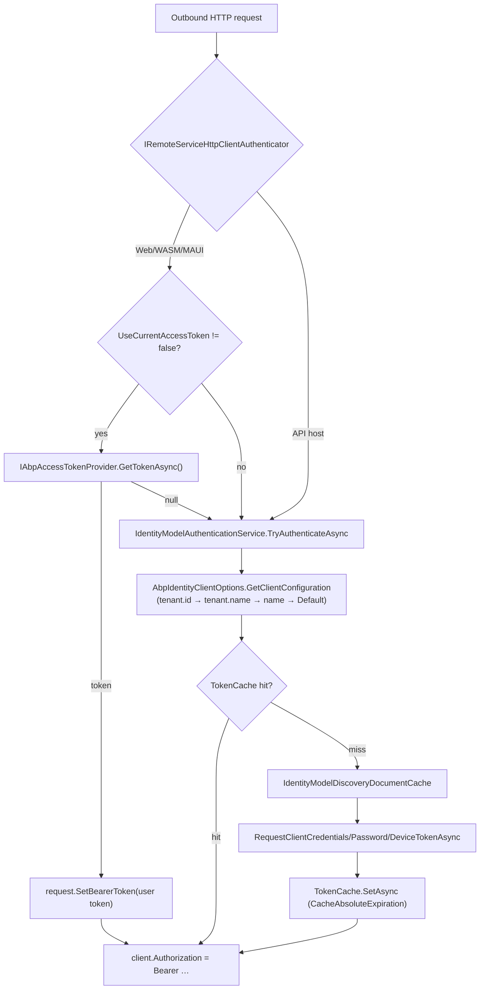

`Volo.Abp.IdentityModel` (`framework/src/Volo.Abp.IdentityModel/`) is the server-side OAuth2 client. It is a thin, opinionated wrapper over [Duende `IdentityModel.Client`](https://github.com/IdentityModel/IdentityModel) that adds: per-tenant client configuration lookup, distributed caching for tokens and discovery documents, and DI integration with `IHttpClientFactory`. The four `Volo.Abp.Http.Client.IdentityModel*` packages plug it into ABP's `IRemoteServiceHttpClientAuthenticator` for each host kind.

## Module

`AbpIdentityModelModule` (`Volo/Abp/IdentityModel/AbpIdentityModelModule.cs`):

```csharp
[DependsOn(typeof(AbpThreadingModule), typeof(AbpMultiTenancyModule), typeof(AbpCachingModule))]
public class AbpIdentityModelModule : AbpModule
{
    public override void ConfigureServices(ServiceConfigurationContext context)
    {
        var configuration = context.Services.GetConfiguration();
        context.Services.AddHttpClient(IdentityModelAuthenticationService.HttpClientName);
        Configure<AbpIdentityClientOptions>(configuration);
    }
}
```

The dedicated `IHttpClient` name `"IdentityModelAuthenticationServiceHttpClientName"` is what you should target if you need to inject `DelegatingHandler`s (Polly, proxy, mTLS) only on token-endpoint traffic.

`AbpIdentityClientOptions` is bound to configuration root — the convention is an `IdentityClients` section:

```json
{
  "IdentityClients": {
    "Default": {
      "GrantType": "client_credentials",
      "ClientId": "BookStore_App",
      "ClientSecret": "1q2w3e*",
      "Authority": "https://auth.bookstore.local",
      "Scope": "BookStore"
    }
  }
}
```

## `IdentityClientConfiguration`

`IdentityClientConfiguration` (`Volo/Abp/IdentityModel/IdentityClientConfiguration.cs`) is a `Dictionary<string, string?>` with strongly-typed accessors so additional protocol parameters can be carried through unchanged:

| Property | Default | Used by |
|---|---|---|
| `GrantType` | `"client_credentials"` | `GetTokenResponse` switch. Accepts `client_credentials`, `password`, `DeviceCode` (`OidcConstants.GrantTypes.DeviceCode`). |
| `ClientId`, `ClientSecret` | – | All grant types. |
| `Authority` | – | Discovery document. |
| `Scope` | – | Token request. |
| `UserName`, `UserPassword` | – | Only valid for `password`. |
| `RequireHttps` | `true` | `DiscoveryDocumentRequest.Policy`. |
| `CacheAbsoluteExpiration` | `1800s` | Distributed cache TTL for `IdentityModelTokenCacheItem` and `IdentityModelDiscoveryDocumentCacheItem`. |
| `ValidateIssuerName` | `true` | Discovery policy. |
| `ValidateEndpoints` | `true` | Discovery policy. |

Any additional `(key, value)` pair stored in the dictionary is forwarded to the token endpoint by `AddParametersToRequestAsync`, so custom OpenIddict claims like `__tenant`, `acr_values`, or your own protocol extensions can be propagated through configuration alone.

## `AbpIdentityClientOptions.GetClientConfiguration`

`IdentityClientConfigurationDictionary` (`IdentityClientConfigurationDictionary.cs`) stores client configurations keyed by name. The default key is `IdentityClientConfigurationDictionary.DefaultName` (`"Default"`).

`AbpIdentityClientOptions.GetClientConfiguration` (`AbpIdentityClientOptions.cs`) implements per-tenant override lookup:

```csharp
public IdentityClientConfiguration? GetClientConfiguration(ICurrentTenant currentTenant, string? identityClientName = null)
{
    if (identityClientName.IsNullOrWhiteSpace())
        identityClientName = IdentityClientConfigurationDictionary.DefaultName;

    if (currentTenant.Id.HasValue)
    {
        var tenantConfiguration = IdentityClients.FirstOrDefault(x => x.Key == $"{identityClientName}.{currentTenant.Id}");
        if (tenantConfiguration.Key == null && !currentTenant.Name.IsNullOrWhiteSpace())
            tenantConfiguration = IdentityClients.FirstOrDefault(x => x.Key == $"{identityClientName}.{currentTenant.Name}");

        if (tenantConfiguration.Key != null) return tenantConfiguration.Value;
    }

    return IdentityClients.GetOrDefault(identityClientName!) ?? IdentityClients.Default;
}
```

Resolution order: `<name>.<tenantId>` → `<name>.<tenantName>` → `<name>` → `Default`. A multi-tenant SaaS that needs a different OAuth2 client per tenant can add `Default.<tenantId>` entries to `IdentityClients`.

## `IIdentityModelAuthenticationService`

The contract (`Volo/Abp/IdentityModel/IIdentityModelAuthenticationService.cs`):

```csharp
public interface IIdentityModelAuthenticationService
{
    Task<bool> TryAuthenticateAsync(HttpClient client, string? identityClientName = null);
    Task<string> GetAccessTokenAsync(IdentityClientConfiguration configuration);
}
```

`TryAuthenticateAsync` is what `IRemoteServiceHttpClientAuthenticator` uses — it attaches the token directly to an `HttpClient.DefaultRequestHeaders.Authorization`. `GetAccessTokenAsync` is the lower-level call used by background jobs and any custom authenticator that needs just the token string.

`IdentityModelAuthenticationService` (`IdentityModelAuthenticationService.cs`, ~320 lines) is the only implementation. Highlights:

```csharp
[Dependency(ReplaceServices = true)]
public class IdentityModelAuthenticationService : IIdentityModelAuthenticationService, ITransientDependency
{
    public const string HttpClientName = "IdentityModelAuthenticationServiceHttpClientName";

    public async Task<bool> TryAuthenticateAsync(HttpClient client, string? identityClientName = null)
    {
        var accessToken = await GetAccessTokenOrNullAsync(identityClientName);
        if (accessToken == null) return false;
        SetAccessToken(client, accessToken);
        return true;
    }

    public virtual async Task<string> GetAccessTokenAsync(IdentityClientConfiguration configuration)
    {
        var cacheKey = CalculateTokenCacheKey(configuration);
        var tokenCacheItem = await TokenCache.GetAsync(cacheKey);
        if (tokenCacheItem == null)
        {
            var tokenResponse = await GetTokenResponse(configuration);
            // ... raises AbpException on tokenResponse.IsError
            tokenCacheItem = new IdentityModelTokenCacheItem(tokenResponse.AccessToken!);
            await TokenCache.SetAsync(cacheKey, tokenCacheItem, new DistributedCacheEntryOptions
            {
                AbsoluteExpirationRelativeToNow = AbpHostEnvironment.IsDevelopment()
                    ? TimeSpan.FromSeconds(5)
                    : TimeSpan.FromSeconds(configuration.CacheAbsoluteExpiration)
            });
        }
        return tokenCacheItem.AccessToken;
    }
}
```

Behaviours worth knowing:

- **Cache key** is `string.Join(",", configuration.Select(x => x.Key + ":" + x.Value)).ToSha256()` — every field of the `IdentityClientConfiguration` participates, so switching tenant, scope or grant type yields a different cache entry.
- **In development the TTL is forced to 5 seconds** to keep iteration fast. Production uses `CacheAbsoluteExpiration` (default 30 minutes). Make sure that value is shorter than the access token's `expires_in`.
- The bearer header is hard-coded to `"Bearer"` in `SetAccessToken` (`// TODO: "Bearer" should be configurable`).
- Errors from the token endpoint are unwrapped: the long Duende error payload is split on `<eof/>` so the resulting `AbpException` message stays readable.

### Discovery cache

`GetDiscoveryResponse` calls `httpClient.GetDiscoveryDocumentAsync` once per authority and caches the result in `IDistributedCache<IdentityModelDiscoveryDocumentCacheItem>` keyed by `configuration.Authority.ToLower().ToSha256()`. The cache item holds both the `TokenEndpoint` and `DeviceAuthorizationEndpoint` — see `IdentityModelDiscoveryDocumentCacheItem.cs`. The policy (`RequireHttps`, `ValidateIssuerName`, `ValidateEndpoints`) is taken from the configuration.

### Grant types

`GetTokenResponse` dispatches by `configuration.GrantType`:

| Grant type | Method | Token request type |
|---|---|---|
| `client_credentials` | `CreateClientCredentialsTokenRequestAsync` → `httpClient.RequestClientCredentialsTokenAsync` | `ClientCredentialsTokenRequest` |
| `password` | `CreatePasswordTokenRequestAsync` → `httpClient.RequestPasswordTokenAsync` | `PasswordTokenRequest` with `UserName` / `Password` |
| `DeviceCode` | `RequestDeviceAuthorizationAsync` | `DeviceAuthorizationRequest`; polls `RequestDeviceTokenAsync` until `slow_down` / `authorization_pending` clears |

Anything else throws `AbpException("Grant type was not implemented: …")`. The `Refresh token` flow is not exposed here — long-lived service identities use `client_credentials`, interactive users use cookies/OIDC.

`AddParametersToRequestAsync` (called from each `Create…TokenRequestAsync`) loops over the `IdentityClientConfiguration` dictionary and copies anything that is not a known property into the request's `Parameters`. That is how you propagate custom parameters like `acr_values` or `__tenant`.

`IdentityModelHttpRequestMessageOptions` (`IdentityModelHttpRequestMessageOptions.cs`) lets you mutate the outgoing `HttpRequestMessage` (e.g. set additional headers) globally — register the options in `ConfigureServices`.

## Wiring into outbound HTTP — the `Http.Client.IdentityModel*` family

ABP's dynamic HTTP client proxy (see [`/comm/http-client`](/comm/http-client) and [`/flows/dynamic-c-sharp-client-proxy`](/flows/dynamic-c-sharp-client-proxy)) calls `IRemoteServiceHttpClientAuthenticator.Authenticate` before every request. Each host kind has its own authenticator.

### Base: `Volo.Abp.Http.Client.IdentityModel`

`IdentityModelRemoteServiceHttpClientAuthenticator` (`Volo.Abp.Http.Client.IdentityModel/Volo/Abp/Http/Client/IdentityModel/IdentityModelRemoteServiceHttpClientAuthenticator.cs`):

```csharp
[Dependency(ReplaceServices = true)]
public class IdentityModelRemoteServiceHttpClientAuthenticator : IRemoteServiceHttpClientAuthenticator, ITransientDependency
{
    public virtual async Task Authenticate(RemoteServiceHttpClientAuthenticateContext context)
    {
        await IdentityModelAuthenticationService.TryAuthenticateAsync(
            context.Client,
            context.RemoteService.GetIdentityClient() ?? context.RemoteServiceName);
    }
}
```

The remote-service config can override the identity-client name via `RemoteServiceConfiguration.SetIdentityClient(…)` (`RemoteServiceConfigurationExtensions.cs`). This is the pattern when one host calls multiple downstream APIs with different OAuth2 clients — each remote-service block points at a different `IdentityClients` entry.

```json
"RemoteServices": {
  "Default":        { "BaseUrl": "https://api.bookstore.local/", "IdentityClient": "Default" },
  "AbpIdentity":    { "BaseUrl": "https://identity.bookstore.local/", "IdentityClient": "Identity" }
}
```

### Web: reuse the request's access token

`HttpContextIdentityModelRemoteServiceHttpClientAuthenticator` (`Volo.Abp.Http.Client.IdentityModel.Web/.../HttpContextIdentityModelRemoteServiceHttpClientAuthenticator.cs`) overrides the base to prefer the **current request's** bearer token:

```csharp
public async override Task Authenticate(RemoteServiceHttpClientAuthenticateContext context)
{
    if (context.RemoteService.GetUseCurrentAccessToken() != false)
    {
        var accessToken = await AccessTokenProvider.GetTokenAsync();
        if (accessToken != null)
        {
            context.Request.SetBearerToken(accessToken);
            return;
        }
    }

    await base.Authenticate(context);
}
```

`HttpContextAbpAccessTokenProvider` (`HttpContextAbpAccessTokenProvider.cs`) returns `await httpContext.GetTokenAsync("access_token")` only when `ICurrentUser.IsAuthenticated` is `true`. This is the classic BFF behaviour: forward the user's token to downstream APIs (so the API sees the original `sub`/`role` claims) and only fall back to a machine token when no user is present.

Set `RemoteServices:Default:UseCurrentAccessToken = false` (`RemoteServiceConfigurationExtensions.SetUseCurrentAccessToken`) to force machine-to-machine even inside an authenticated request.

### Blazor WebAssembly

`AccessTokenProviderIdentityModelRemoteServiceHttpClientAuthenticator` (`Volo.Abp.Http.Client.IdentityModel.WebAssembly/.../AccessTokenProviderIdentityModelRemoteServiceHttpClientAuthenticator.cs`) follows the same pattern but reads the token from `Microsoft.AspNetCore.Components.WebAssembly.Authentication.IAccessTokenProvider`:

```csharp
public virtual async Task<string?> GetTokenAsync()
{
    if (AccessTokenProvider == null) return null;
    var result = await AccessTokenProvider.RequestAccessToken();
    if (result.Status != AccessTokenResultStatus.Success) return null;
    result.TryGetToken(out var token);
    return token?.Value;
}
```

If the user is not signed in (`AccessTokenResultStatus.Success == false`), the chain falls back to client credentials — which on a WASM client typically yields no useful token, but the contract is consistent.

### MAUI / Blazor Hybrid

`MauiBlazorIdentityModelRemoteServiceHttpClientAuthenticator` (`Volo.Abp.Http.Client.IdentityModel.MauiBlazor/.../MauiIBlazorIdentityModelRemoteServiceHttpClientAuthenticator.cs`) uses the same template, but the default `MauiBlazorAbpAccessTokenProvider.GetTokenAsync` returns `null`:

```csharp
public virtual Task<string?> GetTokenAsync() => Task.FromResult(null as string);
```

Replace it (e.g. with a token from `WebAuthenticator`/`SecureStorage`) in your MAUI startup. See [`/ui/blazor-maui`](/ui/blazor-maui) for the full MAUI-Blazor pattern.

## Decision flow



## See also

- Token validation on the API side — [`auth/jwt-bearer`](/auth/jwt-bearer).
- Outbound HTTP service proxy generation — [`/comm/http-client`](/comm/http-client) and [`/comm/remote-services`](/comm/remote-services).
- Issuers — [`/modules/openiddict`](/modules/openiddict), [`/modules/identityserver`](/modules/identityserver).
- BFF/OIDC handshake — [`auth/openid-connect`](/auth/openid-connect).
- Multi-tenant token routing — [`/multitenancy/connection-string-resolver`](/multitenancy/connection-string-resolver) for the analogous pattern over connection strings.
