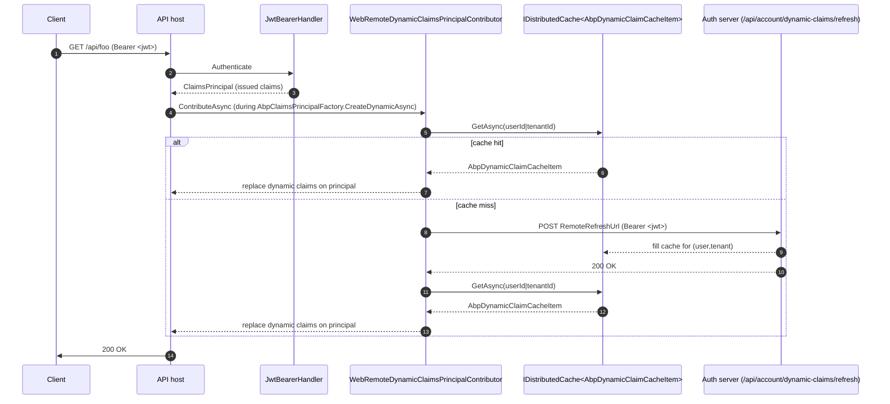

`Volo.Abp.AspNetCore.Authentication.JwtBearer` (`framework/src/Volo.Abp.AspNetCore.Authentication.JwtBearer/`) is the API-host integration of `Microsoft.AspNetCore.Authentication.JwtBearer`. It is small on purpose — the package adds three things to the stock handler: error-message propagation, optional access-token fallback middleware and the wiring for remote refresh of dynamic claims.

## Module

`AbpAspNetCoreAuthenticationJwtBearerModule` (`Volo/Abp/AspNetCore/Authentication/JwtBearer/AbpAspNetCoreAuthenticationJwtBearerModule.cs`):

```csharp
[DependsOn(typeof(AbpSecurityModule), typeof(AbpCachingModule), typeof(AbpAspNetCoreAbstractionsModule))]
public class AbpAspNetCoreAuthenticationJwtBearerModule : AbpModule
{
    public override void ConfigureServices(ServiceConfigurationContext context)
    {
        context.Services.AddHttpClient();
        context.Services.AddHttpContextAccessor();

        if (context.Services.ExecutePreConfiguredActions<WebRemoteDynamicClaimsPrincipalContributorOptions>().IsEnabled &&
            context.Services.ExecutePreConfiguredActions<AbpClaimsPrincipalFactoryOptions>().IsRemoteRefreshEnabled)
        {
            context.Services.AddTransient<WebRemoteDynamicClaimsPrincipalContributor>();
            context.Services.AddTransient<WebRemoteDynamicClaimsPrincipalContributorCache>();
        }
    }
}
```

The dynamic-claims contributors are only registered when both flags are flipped during pre-configuration — see [Dynamic-claim refresh](#dynamic-claim-refresh) below.

## `AddAbpJwtBearer`

`AbpJwtBearerExtensions` (`Microsoft/Extensions/DependencyInjection/AbpJwtBearerExtensions.cs`) wraps `AddJwtBearer` with three overloads. Each one ultimately calls the four-argument variant:

```csharp
public static AuthenticationBuilder AddAbpJwtBearer(
    this AuthenticationBuilder builder,
    string authenticationScheme,
    string displayName,
    Action<JwtBearerOptions> configureOptions)
{
    builder.Services.Configure<AbpClaimsPrincipalFactoryOptions>(options =>
    {
        var jwtBearerOption = new JwtBearerOptions();
        configureOptions?.Invoke(jwtBearerOption);
        if (!jwtBearerOption.Authority.IsNullOrEmpty())
        {
            options.RemoteRefreshUrl = jwtBearerOption.Authority.RemovePostFix("/") + options.RemoteRefreshUrl;
        }
    });

    return builder.AddJwtBearer(authenticationScheme, displayName, options =>
    {
        configureOptions?.Invoke(options);

        options.Events ??= new JwtBearerEvents();
        var previousOnChallenge = options.Events.OnChallenge;
        options.Events.OnChallenge = async eventContext =>
        {
            await previousOnChallenge(eventContext);
            if (eventContext.Handled ||
                !string.IsNullOrEmpty(eventContext.Error) ||
                !string.IsNullOrEmpty(eventContext.ErrorDescription) ||
                !string.IsNullOrEmpty(eventContext.ErrorUri)) return;

            var tokenUnauthorizedErrorInfo = eventContext.HttpContext.RequestServices
                .GetRequiredService<AbpAspNetCoreTokenUnauthorizedErrorInfo>();
            if (string.IsNullOrEmpty(tokenUnauthorizedErrorInfo.Error) &&
                string.IsNullOrEmpty(tokenUnauthorizedErrorInfo.ErrorDescription) &&
                string.IsNullOrEmpty(tokenUnauthorizedErrorInfo.ErrorUri)) return;

            eventContext.Error = tokenUnauthorizedErrorInfo.Error;
            eventContext.ErrorDescription = tokenUnauthorizedErrorInfo.ErrorDescription;
            eventContext.ErrorUri = tokenUnauthorizedErrorInfo.ErrorUri;
        };
    });
}
```

Two things to note:

- **Authority-based `RemoteRefreshUrl` patching.** When `JwtBearerOptions.Authority` is set, the issuer URL is prepended to `AbpClaimsPrincipalFactoryOptions.RemoteRefreshUrl` (default `/api/account/dynamic-claims/refresh`). This lets the API host call back to the OIDC server to invalidate dynamic claims.
- **`OnChallenge` enrichment.** ABP defines `AbpAspNetCoreTokenUnauthorizedErrorInfo` (in `Volo.Abp.AspNetCore.Abstractions`) — request-scoped state that lets your code report a custom `error` / `error_description` / `error_uri` in the `WWW-Authenticate` header. This is how, for example, the dynamic-claims refresh endpoint can tell a client "your token is stale, refresh".

A minimal API host wiring:

```csharp
context.Services.AddAuthentication(JwtBearerDefaults.AuthenticationScheme)
    .AddAbpJwtBearer(options =>
    {
        options.Authority = configuration["AuthServer:Authority"];
        options.RequireHttpsMetadata = configuration.GetValue<bool>("AuthServer:RequireHttpsMetadata");
        options.Audience = "BookStore";
    });
```

The standard `JwtBearerOptions` (token validation parameters, signing keys, etc.) keep working — ABP wraps but never replaces them. Multiple schemes can coexist: pass a custom `authenticationScheme` string to register additional bearer handlers (typical for hybrid Cookie + JWT setups).

## `UseJwtTokenMiddleware`

`ApplicationBuilderAbpJwtTokenMiddlewareExtension` (`Microsoft/AspNetCore/Builder/ApplicationBuilderAbpJwtTokenMiddlewareExtension.cs`) adds an optional bridge for hosts that mix cookies and JWT:

```csharp
public static IApplicationBuilder UseJwtTokenMiddleware(this IApplicationBuilder app, string schema = JwtBearerDefaults.AuthenticationScheme)
{
    return app.Use(async (ctx, next) =>
    {
        if (ctx.User.Identity?.IsAuthenticated != true)
        {
            var result = await ctx.AuthenticateAsync(schema);
            if (result.Succeeded && result.Principal != null)
            {
                ctx.User = result.Principal;
            }
        }
        await next();
    });
}
```

This forces an authentication round against the JWT scheme even when the default scheme is cookies. It is useful for endpoints that accept either credential — for example the public SwaggerUI of an API gateway that prefers cookies but accepts service-to-service bearer tokens. Place the call after `UseAuthentication`.

## Dynamic-claim refresh

A long-lived JWT carries a snapshot of the user's claims as of the time it was issued. When the user gets a new role or the host disables a claim, the token still says the old thing. ABP solves this with **dynamic claims**: every value-providing claim (role, email, etc. — full list in `AbpClaimsPrincipalFactoryOptions.DynamicClaims`) can be re-resolved on each request out of a distributed cache that the auth server populates. See [`auth/security-and-claims`](/auth/security-and-claims) for the data flow on the server side.

`WebRemoteDynamicClaimsPrincipalContributorOptions` (`Volo/Abp/AspNetCore/Authentication/JwtBearer/DynamicClaims/WebRemoteDynamicClaimsPrincipalContributorOptions.cs`) controls the client side from the API host:

```csharp
public class WebRemoteDynamicClaimsPrincipalContributorOptions
{
    public bool IsEnabled { get; set; }
    public string AuthenticationScheme { get; set; }
    public WebRemoteDynamicClaimsPrincipalContributorOptions()
    {
        IsEnabled = false;
        AuthenticationScheme = JwtBearerDefaults.AuthenticationScheme;
    }
}
```

Enable it from a depending module's `PreConfigureServices`:

```csharp
PreConfigure<WebRemoteDynamicClaimsPrincipalContributorOptions>(o => o.IsEnabled = true);
PreConfigure<AbpClaimsPrincipalFactoryOptions>(o => o.IsRemoteRefreshEnabled = true);
```

Once both flags are on, `AbpAspNetCoreAuthenticationJwtBearerModule.ConfigureServices` registers two transients:

- `WebRemoteDynamicClaimsPrincipalContributor` (`DynamicClaims/WebRemoteDynamicClaimsPrincipalContributor.cs`) — empty subclass; it is `[DisableConventionalRegistration]` and inherits `RemoteDynamicClaimsPrincipalContributorBase<TContributor, TContributorCache>` from `Volo.Abp.Security`. The base reads the cached `AbpDynamicClaimCacheItem`, replaces the matching claims on the current identity, and clears the principal entirely when the user can no longer be resolved.
- `WebRemoteDynamicClaimsPrincipalContributorCache` (`DynamicClaims/WebRemoteDynamicClaimsPrincipalContributorCache.cs`) — the cache adapter. `GetCacheAsync` looks up `AbpDynamicClaimCacheItem.CalculateCacheKey(userId, tenantId)` in the distributed cache; on miss, `RefreshAsync` re-authenticates the current request against the configured scheme, extracts the `access_token` from the auth properties, and POSTs to the auth server's `RemoteRefreshUrl`:

```csharp
var authenticateResult = await HttpContextAccessor.HttpContext.AuthenticateAsync(Options.Value.AuthenticationScheme);
var accessToken = authenticateResult.Properties?.GetTokenValue("access_token");
var client = HttpClientFactory.CreateClient(HttpClientName);
var requestMessage = new HttpRequestMessage(HttpMethod.Post, AbpClaimsPrincipalFactoryOptions.Value.RemoteRefreshUrl);
requestMessage.SetBearerToken(accessToken);
var response = await client.SendAsync(requestMessage);
response.EnsureSuccessStatusCode();
```

`HttpClientName` is the public const `nameof(WebRemoteDynamicClaimsPrincipalContributorCache)` — register a typed `IHttpClient` with that name to inject Polly policies, an outbound proxy, etc.

## Putting it together



## When to use this package

- An ASP.NET Core API host that consumes tokens issued by an external authority (OpenIddict, IdentityServer, Auth0, Entra ID, …). The host does not need cookies, login pages or OIDC handshake — only JWT validation.
- A microservice behind an API gateway where every inbound request is already a bearer token.
- A Blazor Server host that combines `AddAuthentication().AddCookie()...AddAbpJwtBearer(...)` to authenticate both the SignalR negotiate request and direct API calls.

For the OIDC handshake — login, callback, code exchange — use `Volo.Abp.AspNetCore.Authentication.OpenIdConnect`. For server-to-server token acquisition, use `Volo.Abp.IdentityModel` (see [`auth/identity-model`](/auth/identity-model)).

## See also

- Claim contributors and `AbpClaimsPrincipalFactory` — [`auth/security-and-claims`](/auth/security-and-claims).
- The OIDC client that issues the tokens — [`auth/openid-connect`](/auth/openid-connect).
- OpenIddict, the default issuer in template apps — [`/modules/openiddict`](/modules/openiddict).
- HTTP request lifecycle and middleware ordering — [`/flows/http-request-lifecycle`](/flows/http-request-lifecycle).
