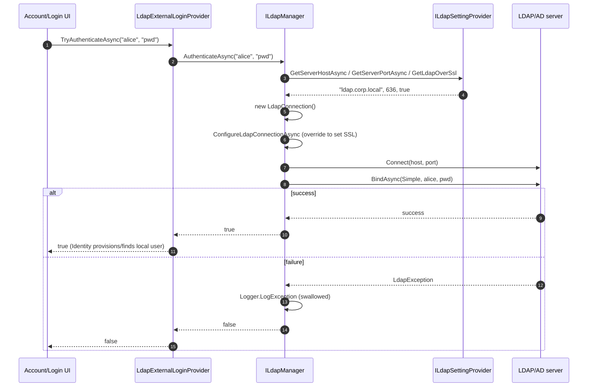

`Volo.Abp.Ldap.Abstractions` (`framework/src/Volo.Abp.Ldap.Abstractions/`) and `Volo.Abp.Ldap` (`framework/src/Volo.Abp.Ldap/`) ship a thin, settings-driven wrapper around the cross-platform [LdapForNet](https://github.com/flamencist/ldap4net) library. The package's only public capability is `ILdapManager.AuthenticateAsync(username, password)` — i.e. a **simple bind**. There is no directory-search API, no group enumeration and no claims projection at this layer; those responsibilities live in higher-level modules that consume this manager.

## Abstractions package

### `ILdapManager`

`framework/src/Volo.Abp.Ldap.Abstractions/Volo/Abp/Ldap/ILdapManager.cs`:

```csharp
public interface ILdapManager
{
    Task<bool> AuthenticateAsync(string username, string password);
}
```

A single boolean answer: did the bind succeed? Implementations are expected to **swallow exceptions and log** so the caller can branch on the boolean without a try/catch.

### `ILdapSettingProvider`

`framework/src/Volo.Abp.Ldap.Abstractions/Volo/Abp/Ldap/ILdapSettingProvider.cs`:

```csharp
public interface ILdapSettingProvider
{
    Task<bool>    GetLdapOverSsl();
    Task<string?> GetServerHostAsync();
    Task<int>     GetServerPortAsync();
    Task<string?> GetBaseDcAsync();
    Task<string?> GetDomainAsync();
    Task<string?> GetUserNameAsync();
    Task<string?> GetPasswordAsync();
}
```

The host (`ServerHost`/`ServerPort`) is what the `LdapManager` uses to connect. `BaseDc` and `Domain` are exposed for downstream consumers (search-base, distinguished-name composition); the base implementation in `Volo.Abp.Ldap` only consumes host/port. `UserName`/`Password` are the service-account credentials that a higher-level module would bind with before searching for the actual user.

### Setting names

`LdapSettingNames` (`Volo/Abp/Ldap/LdapSettingNames.cs`) is the catalog of setting keys used by the Setting Management module:

```csharp
public const string Ldaps      = "Abp.Ldap.Ldaps";       // bool, default false
public const string ServerHost = "Abp.Ldap.ServerHost";  // string
public const string ServerPort = "Abp.Ldap.ServerPort";  // int,   default 389
public const string BaseDc     = "Abp.Ldap.BaseDc";      // string
public const string Domain     = "Abp.Ldap.Domain";      // string
public const string UserName   = "Abp.Ldap.UserName";    // string (service account)
public const string Password   = "Abp.Ldap.Password";    // string (encrypted)
```

`AbpLdapAbstractionsModule` (`Volo/Abp/Ldap/AbpLdapAbstractionsModule.cs`) is empty — its only purpose is to give downstream modules a stable `[DependsOn]` target.

## Implementation package

### `AbpLdapModule`

```csharp
[DependsOn(typeof(AbpLdapAbstractionsModule), typeof(AbpSettingsModule))]
public class AbpLdapModule : AbpModule { }
```

The dependency on `AbpSettingsModule` is mandatory — the default `LdapSettingProvider` reads through `ISettingProvider`.

### `LdapSettingProvider`

`Volo/Abp/Ldap/LdapSettingProvider.cs` is a straight pass-through to `ISettingProvider`:

```csharp
public virtual async Task<string?> GetServerHostAsync()
    => await SettingProvider.GetOrNullAsync(LdapSettingNames.ServerHost);

public virtual async Task<int> GetServerPortAsync()
    => (await SettingProvider.GetOrNullAsync(LdapSettingNames.ServerPort))?.To<int>() ?? default;

public virtual async Task<bool> GetLdapOverSsl()
    => (await SettingProvider.GetOrNullAsync(LdapSettingNames.Ldaps))?.To<bool>() ?? default;
```

Because every getter routes through `ISettingProvider`, the values are **per-tenant by default** when the Setting Management module is installed — a tenant can override the LDAP server it authenticates against.

### `LdapSettingDefinitionProvider`

`Volo/Abp/Ldap/LdapSettingDefinitionProvider.cs` declares the seven settings to the Setting Management framework, with defaults and localization (`LdapResource`):

```csharp
context.Add(
    new SettingDefinition(LdapSettingNames.Ldaps,      "false", L("DisplayName:Abp.Ldap.Ldaps"),      L("Description:Abp.Ldap.Ldaps")),
    new SettingDefinition(LdapSettingNames.ServerHost, "",      L("DisplayName:Abp.Ldap.ServerHost"), L("Description:Abp.Ldap.ServerHost")),
    new SettingDefinition(LdapSettingNames.ServerPort, "389",   L("DisplayName:Abp.Ldap.ServerPort"), L("Description:Abp.Ldap.ServerPort")),
    new SettingDefinition(LdapSettingNames.BaseDc,     "",      L("DisplayName:Abp.Ldap.BaseDc"),     L("Description:Abp.Ldap.BaseDc")),
    new SettingDefinition(LdapSettingNames.Domain,     "",      L("DisplayName:Abp.Ldap.Domain"),     L("Description:Abp.Ldap.Domain")),
    new SettingDefinition(LdapSettingNames.UserName,   "",      L("DisplayName:Abp.Ldap.UserName"),   L("Description:Abp.Ldap.UserName")),
    new SettingDefinition(LdapSettingNames.Password,   "",      L("DisplayName:Abp.Ldap.Password"),   L("Description:Abp.Ldap.Password"), isEncrypted: true)
);
```

The `Password` setting is marked `isEncrypted: true`, which means the Setting Management module stores it through `IStringEncryptionService` (`framework/src/Volo.Abp.Security/Volo/Abp/Security/Encryption/StringEncryptionService.cs`). Make sure `StringEncryption:DefaultPassPhrase` is set in every environment that reads it.

### `LdapManager`

`Volo/Abp/Ldap/LdapManager.cs` is the default `ILdapManager`:

```csharp
public class LdapManager : ILdapManager, ITransientDependency
{
    public ILogger<LdapManager> Logger { get; set; }
    protected ILdapSettingProvider LdapSettingProvider { get; }

    public virtual async Task<bool> AuthenticateAsync(string username, string password)
    {
        try
        {
            using (var conn = await CreateLdapConnectionAsync())
            {
                await AuthenticateLdapConnectionAsync(conn, username, password);
                return true;
            }
        }
        catch (Exception ex)
        {
            Logger.LogException(ex);
            return false;
        }
    }

    protected virtual async Task<ILdapConnection> CreateLdapConnectionAsync()
    {
        var ldapConnection = new LdapConnection();
        await ConfigureLdapConnectionAsync(ldapConnection);
        await ConnectAsync(ldapConnection);
        return ldapConnection;
    }

    protected virtual Task ConfigureLdapConnectionAsync(ILdapConnection ldapConnection) => Task.CompletedTask;

    protected virtual async Task ConnectAsync(ILdapConnection ldapConnection)
    {
        ldapConnection.Connect(
            await LdapSettingProvider.GetServerHostAsync(),
            await LdapSettingProvider.GetServerPortAsync());
    }

    protected virtual async Task AuthenticateLdapConnectionAsync(ILdapConnection connection, string username, string password)
    {
        await connection.BindAsync(Native.LdapAuthType.Simple, new LdapCredential()
        {
            UserName = username,
            Password = password
        });
    }
}
```

Extension points are intentionally generous — each step is its own `protected virtual`:

| Override | Use case |
|---|---|
| `CreateLdapConnectionAsync` | Inject a mock for tests, or pin a specific `LdapVersion`. |
| `ConfigureLdapConnectionAsync` | Set `SessionOptions.SecureSocketLayer = true` when `GetLdapOverSsl()` returns `true`. The base implementation does **not** read the `Ldaps` setting — you must override this method to honour it. |
| `ConnectAsync` | Connect to a different host (e.g. AD DS Global Catalog port 3268), or wrap with retry. |
| `AuthenticateLdapConnectionAsync` | Prefix the `UserName` with the `Domain` setting (`DOMAIN\\user` or `user@domain`) before binding. Switch to `Native.LdapAuthType.Negotiate` for Kerberos/SSPI. |

Important: the default `AuthenticateLdapConnectionAsync` passes the username as-is. For Active Directory you usually need to compose `domain\\user` or `user@upn-suffix` from `GetDomainAsync()` — extend `LdapManager` in your module.

## Integration with Identity external login

The framework does not register a `Volo.Abp.Identity` external-login provider for LDAP — that integration lives in the commercial ABP Identity Pro / LDAP module. The framework-side contract for plugging in such a provider is `IExternalLoginProvider` in `modules/identity/src/Volo.Abp.Identity.Domain/`. The expected flow is:

1. The Account module's login flow receives `(userNameOrEmail, password)`.
2. After the built-in `IdentityUserManager.CheckPasswordAsync` fails (or is skipped), it iterates registered `IExternalLoginProvider`s.
3. The LDAP provider calls `ILdapManager.AuthenticateAsync(userNameOrEmail, password)`.
4. On success it either finds the matching local `IdentityUser` (by `userName`/`email`) or provisions a new one, optionally setting roles based on LDAP groups (which requires a search call that you'd add by extending `LdapManager` with a `SearchAsync` method using `LdapForNet`'s `SearchAsync(SearchRequest)`).

A minimal custom provider that uses the framework `ILdapManager`:

```csharp
public class LdapExternalLoginProvider : IExternalLoginProvider, ITransientDependency
{
    public const string Name = "LDAP";

    protected ILdapManager LdapManager { get; }
    protected IIdentityUserRepository UserRepository { get; }
    protected IdentityUserManager UserManager { get; }

    public async Task<bool> TryAuthenticateAsync(string userName, string plainPassword)
        => await LdapManager.AuthenticateAsync(userName, plainPassword);

    public async Task<IdentityUser?> GetUserOrNullAsync(string userName)
        => await UserRepository.FindByNormalizedUserNameAsync(UserManager.NormalizeName(userName));

    public Task<IdentityUser> CreateUserAsync(string userName, string providerName)
    {
        // create with email taken from LDAP search if you implemented one
        // ...
    }
}
```

Register the provider and add it to the Identity options:

```csharp
Configure<AbpIdentityOptions>(options =>
{
    options.ExternalLoginProviders.Add<LdapExternalLoginProvider>(LdapExternalLoginProvider.Name);
});
```

See [`/modules/identity`](/modules/identity) for the full external-login lifecycle.

## Configuration cookbook

### Settings UI (recommended)

Once `AbpLdapModule` is referenced and `LdapSettingDefinitionProvider` is loaded, an admin can change LDAP configuration per host or tenant through the Setting Management page (`/setting-management`). No code change is required.

### `appsettings.json` (fallback via setting providers)

ABP's setting management supports a configuration-backed value provider. With it in place:

```json
{
  "Settings": {
    "Abp.Ldap.ServerHost": "ldap.corp.local",
    "Abp.Ldap.ServerPort": "636",
    "Abp.Ldap.Ldaps": "true",
    "Abp.Ldap.BaseDc": "DC=corp,DC=local",
    "Abp.Ldap.Domain": "corp.local"
  }
}
```

The password should never live in `appsettings.json` — store it through the Setting Management UI so it is encrypted at rest.

## Connection / bind flow



## Testing

`framework/test/Volo.Abp.Ldap.Tests/Volo/Abp/Ldap/LdapManager_Tests.cs` is the reference shape; the test module simply registers the abstractions + `AbpLdapModule` and the test asserts `ILdapManager` is resolvable. Production tests typically substitute `ILdapSettingProvider` with an in-memory implementation pointed at a local OpenLDAP / `Lightwave` test container, or replace `ILdapManager` with a fake that returns `true` for known credentials.

## See also

- Settings infrastructure used by `LdapSettingProvider` — [`/crosscut/settings`](/crosscut/settings).
- Password encryption — [`auth/security-and-claims`](/auth/security-and-claims) (the `Volo.Abp.Security/Encryption/` section).
- External login lifecycle — [`/modules/identity`](/modules/identity), [`/modules/account`](/modules/account).
- Multi-tenant settings (so a tenant can have its own LDAP server) — [`/multitenancy/overview`](/multitenancy/overview).
