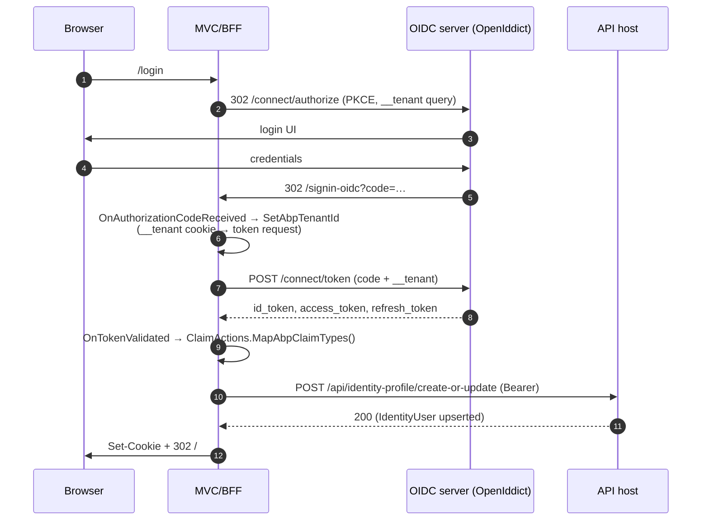

`Volo.Abp.AspNetCore.Authentication.OpenIdConnect` (`framework/src/Volo.Abp.AspNetCore.Authentication.OpenIdConnect/`) is the BFF/MVC integration of `Microsoft.AspNetCore.Authentication.OpenIdConnect`. It wraps `AddOpenIdConnect` with three responsibilities:

1. Map OIDC userinfo claims onto `AbpClaimTypes` (via the OAuth helpers in [`auth/oauth`](/auth/oauth)).
2. Carry the tenant identifier into the token request so the authority issues tenant-scoped tokens.
3. Optionally provision a local `IdentityUser` on the API back end after the very first token validation.

## Module

`AbpAspNetCoreAuthenticationOpenIdConnectModule` (`Volo/Abp/AspNetCore/Authentication/OpenIdConnect/AbpAspNetCoreAuthenticationOpenIdConnectModule.cs`):

```csharp
[DependsOn(
    typeof(AbpMultiTenancyModule),
    typeof(AbpAspNetCoreAuthenticationOAuthModule),
    typeof(AbpRemoteServicesModule))]
public class AbpAspNetCoreAuthenticationOpenIdConnectModule : AbpModule
{
    public override void ConfigureServices(ServiceConfigurationContext context)
    {
        context.Services.AddHttpClient();

        Configure<AbpSecurityHeadersOptions>(options =>
        {
            options.IgnoredScriptNoncePaths.Add("/signout-oidc");
        });
    }
}
```

The dependency on `AbpRemoteServicesModule` is for the local-user provisioning client; the security-headers tweak prevents ABP's CSP `script-src` nonce middleware from breaking the OIDC sign-out POST.

## `AddAbpOpenIdConnect`

`AbpOpenIdConnectExtensions` (`Microsoft/Extensions/DependencyInjection/AbpOpenIdConnectExtensions.cs`) exposes four overloads; all forward to the four-argument variant:

```csharp
public static AuthenticationBuilder AddAbpOpenIdConnect(
    this AuthenticationBuilder builder,
    string authenticationScheme,
    string displayName,
    Action<OpenIdConnectOptions> configureOptions)
{
    builder.Services.Configure<AbpClaimsPrincipalFactoryOptions>(options =>
    {
        var openIdConnectOptions = new OpenIdConnectOptions();
        configureOptions?.Invoke(openIdConnectOptions);
        if (!openIdConnectOptions.Authority.IsNullOrEmpty())
        {
            options.RemoteRefreshUrl = openIdConnectOptions.Authority.RemovePostFix("/") + options.RemoteRefreshUrl;
        }
    });

    return builder.AddOpenIdConnect(authenticationScheme, displayName, options =>
    {
        options.ClaimActions.MapAbpClaimTypes();

        options.Events ??= new OpenIdConnectEvents();
        var authorizationCodeReceived = options.Events.OnAuthorizationCodeReceived ?? (_ => Task.CompletedTask);

        options.Events.OnAuthorizationCodeReceived = receivedContext =>
        {
            SetAbpTenantId(receivedContext);
            return authorizationCodeReceived.Invoke(receivedContext);
        };

        options.AccessDeniedPath = "/";

        options.Events.OnTokenValidated = async context => { /* local user provisioning + culture cookies */ };

        // PAR is opt-in — see comment below
        options.PushedAuthorizationBehavior = PushedAuthorizationBehavior.Disable;
        configureOptions?.Invoke(options);
    });
}
```

Notice the configuration order: the user's `configureOptions` callback runs **twice**. Once early (to pre-compute `RemoteRefreshUrl` from `Authority`), then again at the end so user overrides win over ABP defaults (e.g. you can flip `PushedAuthorizationBehavior` back on if your OpenIddict server grants `Permissions.Endpoints.PushedAuthorization`).

### Default claim-action mapping

`options.ClaimActions.MapAbpClaimTypes()` swaps the JSON keys `name`, `given_name`, `family_name`, `email`, `email_verified`, `phone_number`, `phone_number_verified` and `role` onto `AbpClaimTypes.UserName`, `Name`, `SurName`, `Email`, etc. The `role` mapping uses `MultipleClaimAction` so users with multiple roles arrive with one claim per role. Details are in [`auth/oauth`](/auth/oauth).

### Tenant propagation: `SetAbpTenantId`

When the BFF receives the authorization-code callback, ABP forwards the tenant cookie to the token endpoint so the OIDC server can scope the exchange to the right tenant:

```csharp
private static void SetAbpTenantId(AuthorizationCodeReceivedContext receivedContext)
{
    var tenantKey = receivedContext.HttpContext.RequestServices
        .GetRequiredService<IOptions<AbpAspNetCoreMultiTenancyOptions>>().Value.TenantKey;

    if (receivedContext.Request.Cookies.ContainsKey(tenantKey))
    {
        receivedContext.TokenEndpointRequest?.SetParameter(tenantKey, receivedContext.Request.Cookies[tenantKey]);
    }
}
```

`AbpAspNetCoreMultiTenancyOptions.TenantKey` defaults to `__tenant`. On the OIDC server, the `AbpQueryStringTenantResolveContributor` reads the parameter back. End-to-end this is what makes "tenant subdomain → cookie → token exchange → tenant-scoped tokens" work — see [`/multitenancy/aspnetcore-integration`](/multitenancy/aspnetcore-integration).

### Local-user provisioning: `OnTokenValidated`

After the ID token is validated, ABP optionally calls back into the API host's profile endpoint so a corresponding local `IdentityUser` is created or refreshed. The hook also forwards the `culture` / `ui-culture` query parameters into the ABP request-culture cookie.

```csharp
options.Events.OnTokenValidated = async context =>
{
    var logger = context.HttpContext.RequestServices.GetRequiredService<ILogger<AbpAspNetCoreAuthenticationOpenIdConnectModule>>();
    var client = context.HttpContext.RequestServices.GetRequiredService<IOpenIdLocalUserCreationClient>();
    try { await client.CreateOrUpdateAsync(context); }
    catch (Exception ex) { logger.LogException(ex); }

    var culture = context.ProtocolMessage.GetParameter("culture");
    var uiCulture = context.ProtocolMessage.GetParameter("ui-culture");
    if (CultureHelper.IsValidCultureCode(culture) && CultureHelper.IsValidCultureCode(uiCulture))
    {
        context.Response.OnStarting(() =>
        {
            AbpRequestCultureCookieHelper.SetCultureCookie(
                context.HttpContext,
                new RequestCulture(culture, uiCulture));
            return Task.CompletedTask;
        });
    }
};
```

Exceptions from `CreateOrUpdateAsync` are **caught and logged**, never thrown, so a transient API outage on the profile endpoint cannot lock the user out.

### Pushed Authorization Requests (PAR)

The OIDC handler is configured with `PushedAuthorizationBehavior.Disable` by default because OpenIddict requires the client to hold the `Permissions.Endpoints.PushedAuthorization` permission before PAR is allowed. The inline comment in source documents this; flip it to `Require` after granting the permission on the server:

```csharp
options.PushedAuthorizationBehavior = PushedAuthorizationBehavior.Disable;
```

The user's `configureOptions` runs last, so a downstream override wins.

## `IOpenIdLocalUserCreationClient`

`IOpenIdLocalUserCreationClient` (`Volo/Abp/AspNetCore/Authentication/OpenIdConnect/IOpenIdLocalUserCreationClient.cs`):

```csharp
public interface IOpenIdLocalUserCreationClient
{
    Task CreateOrUpdateAsync(TokenValidatedContext tokenValidatedContext);
}
```

The default implementation `OpenIdLocalUserCreationClient` (`OpenIdLocalUserCreationClient.cs`) is opt-in:

```csharp
public virtual async Task CreateOrUpdateAsync(TokenValidatedContext context)
{
    if (!Options.IsEnabled) return;

    using (var httpClient = HttpClientFactory.CreateClient(Options.HttpClientName))
    {
        if (!Options.RemoteServiceName.IsNullOrWhiteSpace())
        {
            var configuration = await RemoteServiceConfigurationProvider.GetConfigurationOrDefaultAsync(Options.RemoteServiceName);
            if (configuration.BaseUrl != null)
            {
                httpClient.BaseAddress = new Uri(configuration.BaseUrl);
            }
        }

        httpClient.DefaultRequestHeaders.Add(HeaderNames.Authorization, "Bearer " + context.SecurityToken.RawData);

        var response = await httpClient.PostAsync(Options.Url, new StringContent(string.Empty));
        response.EnsureSuccessStatusCode();
    }
}
```

`OpenIdLocalUserCreationClientOptions` (`OpenIdLocalUserCreationClientOptions.cs`):

| Property | Default | Purpose |
|---|---|---|
| `IsEnabled` | `false` | Master switch. Defaults off so empty hosts do not POST to a non-existent endpoint. |
| `RemoteServiceName` | `"AbpIdentity"` | Resolved via `IRemoteServiceConfigurationProvider`. Falls back to the `Default` remote service block when `AbpIdentity` is missing. Set to `null` to use an absolute `Url`. |
| `Url` | `"/api/identity-profile/create-or-update"` | Endpoint on the API host. The identity profile endpoint in `modules/account` accepts the bearer token and creates/updates the matching `IdentityUser`. |
| `HttpClientName` | `""` (default) | Optional named `IHttpClient` for policies/handlers. |

Enable it from `ConfigureServices`:

```csharp
Configure<OpenIdLocalUserCreationClientOptions>(options =>
{
    options.IsEnabled = true;
    // options.RemoteServiceName = "AbpIdentity"; // default
});
```

## Typical MVC/BFF wiring

```csharp
context.Services.AddAuthentication(options =>
{
    options.DefaultScheme = "Cookies";
    options.DefaultChallengeScheme = "oidc";
})
.AddCookie("Cookies")
.AddAbpOpenIdConnect("oidc", options =>
{
    options.Authority = configuration["AuthServer:Authority"];
    options.RequireHttpsMetadata = configuration.GetValue<bool>("AuthServer:RequireHttpsMetadata");
    options.ResponseType = OpenIdConnectResponseType.Code;

    options.ClientId = configuration["AuthServer:ClientId"];
    options.ClientSecret = configuration["AuthServer:ClientSecret"];

    options.UsePkce = true;
    options.SaveTokens = true;

    options.Scope.Add("openid");
    options.Scope.Add("offline_access");
    options.Scope.Add("BookStore");
    options.Scope.Add("roles");
    options.Scope.Add("email");
});
```

## Flow



## See also

- Claim-action helpers used by `MapAbpClaimTypes` — [`auth/oauth`](/auth/oauth).
- Token validation on the API side — [`auth/jwt-bearer`](/auth/jwt-bearer).
- Default OIDC server used by ABP templates — [`/modules/openiddict`](/modules/openiddict).
- Legacy alternative — [`/modules/identityserver`](/modules/identityserver).
- Tenant resolution and the `__tenant` key — [`/multitenancy/aspnetcore-integration`](/multitenancy/aspnetcore-integration).
- Account module (login UI, external login, profile endpoint) — [`/modules/account`](/modules/account).
