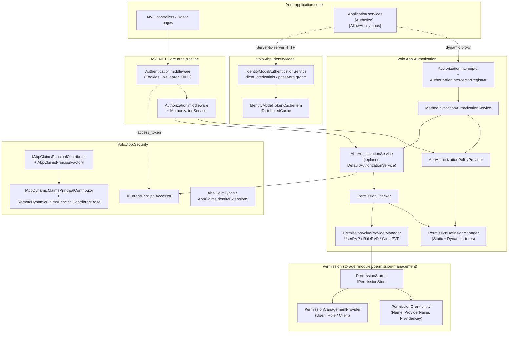

ABP ships authentication and authorization as a stack of independent NuGet packages under `framework/src/`. The core split is:

- **Authorization** decides whether a known principal may perform a method or hit a policy. It lives in `Volo.Abp.Authorization.Abstractions` (contracts, requirements, `IPermissionChecker`) and `Volo.Abp.Authorization` (default `AbpAuthorizationService`, interceptor, policy provider, permission value providers, permission definition manager).
- **Security primitives** — `ICurrentPrincipalAccessor`, `ICurrentUser`, `ICurrentClient`, `AbpClaimTypes`, the dynamic-claims pipeline and `AbpAuthorizationException` — live in `framework/src/Volo.Abp.Security/`. Every other package depends on this one.
- **Authentication adapters** wrap ASP.NET Core's authentication handlers and the Duende `IdentityModel` client library: `Volo.Abp.AspNetCore.Authentication.JwtBearer`, `Volo.Abp.AspNetCore.Authentication.OAuth`, `Volo.Abp.AspNetCore.Authentication.OpenIdConnect`, plus the server-to-server token-acquisition stack in `Volo.Abp.IdentityModel` and `Volo.Abp.Http.Client.IdentityModel*`.
- **Directory and compliance abstractions** — `Volo.Abp.Ldap` / `Volo.Abp.Ldap.Abstractions` for LDAP/AD bind, and `Volo.Abp.Gdpr.Abstractions` for user-data export/erasure ETOs.

The framework itself never picks an identity provider, never owns a user database and never implements RBAC — those live in `modules/identity`, `modules/openiddict`, `modules/identityserver`, `modules/permission-management` and `modules/account`. The framework only defines the seams.

## Layered view

## Package inventory

### Framework packages

| Package (`framework/src/`) | Purpose | Key types |
|---|---|---|
| `Volo.Abp.Security` | Claims primitives, current principal, dynamic claims, security log, string encryption | `ICurrentPrincipalAccessor`, `AbpClaimTypes`, `AbpClaimsPrincipalFactory`, `IAbpClaimsPrincipalContributor`, `AbpDynamicClaimsPrincipalContributorBase`, `AbpAuthorizationException`, `ICurrentUser`, `ICurrentClient`, `ISecurityLogManager` |
| `Volo.Abp.Authorization.Abstractions` | Policy/permission/resource-permission contracts and requirement handlers | `IAbpAuthorizationService`, `IMethodInvocationAuthorizationService`, `IPermissionChecker`, `IPermissionStore`, `IPermissionValueProvider`, `IPermissionDefinitionManager`, `IPermissionDefinitionProvider`, `PermissionDefinition`, `PermissionGroupDefinition`, `PermissionRequirement(Handler)`, `ResourcePermissionRequirement`, `AbpPermissionOptions` |
| `Volo.Abp.Authorization` | Default implementations and dynamic-proxy integration | `AbpAuthorizationModule`, `AbpAuthorizationService`, `MethodInvocationAuthorizationService`, `AuthorizationInterceptor`, `AuthorizationInterceptorRegistrar`, `AbpAuthorizationPolicyProvider`, `PermissionChecker`, `PermissionDefinitionManager`, `UserPermissionValueProvider`, `RolePermissionValueProvider`, `ClientPermissionValueProvider`, `PermissionValueProviderManager`, `StaticPermissionDefinitionStore` |
| `Volo.Abp.AspNetCore.Authentication.JwtBearer` | ASP.NET Core JWT Bearer integration with ABP error mapping and dynamic-claim refresh | `AbpAspNetCoreAuthenticationJwtBearerModule`, `AbpJwtBearerExtensions.AddAbpJwtBearer`, `WebRemoteDynamicClaimsPrincipalContributor(Cache)`, `UseJwtTokenMiddleware` |
| `Volo.Abp.AspNetCore.Authentication.OAuth` | Claim-action helpers shared by OAuth/OIDC | `AbpAspNetCoreAuthenticationOAuthModule`, `AbpClaimActionCollectionExtensions.MapAbpClaimTypes`, `MultipleClaimAction`, `RemoveDuplicateClaimAction` |
| `Volo.Abp.AspNetCore.Authentication.OpenIdConnect` | OpenID Connect handler with tenant propagation and local-user provisioning | `AbpAspNetCoreAuthenticationOpenIdConnectModule`, `AbpOpenIdConnectExtensions.AddAbpOpenIdConnect`, `IOpenIdLocalUserCreationClient`, `OpenIdLocalUserCreationClientOptions` |
| `Volo.Abp.IdentityModel` | Server-side OAuth2 client (Duende `IdentityModel.Client` wrapper) | `IIdentityModelAuthenticationService`, `IdentityModelAuthenticationService`, `IdentityClientConfiguration`, `AbpIdentityClientOptions`, `IdentityModelTokenCacheItem`, `IdentityModelDiscoveryDocumentCacheItem`, `IdentityModelHttpRequestMessageOptions` |
| `Volo.Abp.Http.Client.IdentityModel` | Wires `IIdentityModelAuthenticationService` into `IRemoteServiceHttpClientAuthenticator` | `IdentityModelRemoteServiceHttpClientAuthenticator`, `RemoteServiceConfigurationExtensions.GetIdentityClient` |
| `Volo.Abp.Http.Client.IdentityModel.Web` | Reuses the current request's `access_token` from `HttpContext` before falling back to client credentials | `HttpContextIdentityModelRemoteServiceHttpClientAuthenticator`, `HttpContextAbpAccessTokenProvider` |
| `Volo.Abp.Http.Client.IdentityModel.WebAssembly` | Same for Blazor WebAssembly via `IAccessTokenProvider` | `AccessTokenProviderIdentityModelRemoteServiceHttpClientAuthenticator`, `WebAssemblyAbpAccessTokenProvider` |
| `Volo.Abp.Http.Client.IdentityModel.MauiBlazor` | MAUI/Blazor Hybrid stub | `MauiBlazorIdentityModelRemoteServiceHttpClientAuthenticator`, `MauiBlazorAbpAccessTokenProvider` |
| `Volo.Abp.Ldap.Abstractions` | Contracts and setting names for LDAP/AD authentication | `ILdapManager`, `ILdapSettingProvider`, `LdapSettingNames` |
| `Volo.Abp.Ldap` | Default `LdapManager` (uses `LdapForNet`) + setting provider/definitions | `AbpLdapModule`, `LdapManager`, `LdapSettingProvider`, `LdapSettingDefinitionProvider` |
| `Volo.Abp.Gdpr.Abstractions` | Distributed event payloads and provider context for GDPR export/deletion | `GdprDataInfo`, `GdprUserDataRequestedEto`, `GdprUserDataPreparedEto`, `GdprUserDataDeletionRequestedEto`, `GdprUserDataProviderContext` |

### Related module packages

| Module | Path | Role |
|---|---|---|
| Permission Management | `modules/permission-management/src/Volo.Abp.PermissionManagement.Domain/` | Implements `IPermissionStore` (`PermissionStore`), `PermissionGrant` aggregate, `PermissionManagementProvider`, `DynamicPermissionDefinitionStore` |
| Identity | `modules/identity/src/Volo.Abp.Identity.Domain/` | `IdentityDynamicClaimsPrincipalContributor(+Cache)` — the canonical wiring of the dynamic-claims pipeline |
| OpenIddict | `modules/openiddict/` | Default OAuth/OIDC server used by `ABP Studio` templates |
| IdentityServer | `modules/identityserver/` | Legacy alternative server stack (Duende `IdentityServer`) |
| Account | `modules/account/` | Login UI, dynamic-claims refresh endpoint (`/api/account/dynamic-claims/refresh`), external login glue (where LDAP plugs in) |

## How a single request flows

1. The ASP.NET Core authentication middleware (cookies, `JwtBearer`, or `OpenIdConnect`) builds a `ClaimsPrincipal`. ABP installs `ICurrentPrincipalAccessor` (`HttpContextPrincipalAccessor` in the AspNetCore module, `ThreadCurrentPrincipalAccessor` outside HTTP) so the principal becomes ambient — see [`auth/security-and-claims`](/auth/security-and-claims).
2. For controllers and Razor pages, the standard `AuthorizationMiddleware` runs and resolves policies through `AbpAuthorizationPolicyProvider`. Unknown policy names that match a permission are auto-promoted to a `PermissionRequirement` — see [`auth/authorization`](/auth/authorization).
3. For application services and any other DI-resolved class that carries `[Authorize]`, `AuthorizationInterceptorRegistrar` adds `AuthorizationInterceptor` via ABP's dynamic-proxy pipeline. The interceptor runs `MethodInvocationAuthorizationService.CheckAsync`, which throws `AbpAuthorizationException` on failure.
4. `PermissionChecker` walks every `IPermissionValueProvider` (User → Role → Client by default) and asks `IPermissionStore` whether `(name, providerName, providerKey)` is granted. The store is implemented by `PermissionStore` in `modules/permission-management` and caches results in `IDistributedCache<PermissionGrantCacheItem>` — see [`auth/permissions`](/auth/permissions).
5. For dynamic-claim updates (e.g. role change), the principal can be rebuilt via `IAbpClaimsPrincipalFactory.CreateDynamicAsync`, which fan-outs to `IAbpDynamicClaimsPrincipalContributor` instances — see [`auth/security-and-claims`](/auth/security-and-claims) and [`/modules/identity`](/modules/identity).

## Cross-references

- Server tokens for outbound HTTP — [`auth/identity-model`](/auth/identity-model).
- JWT bearer for API hosts — [`auth/jwt-bearer`](/auth/jwt-bearer).
- BFF / MVC pattern with OIDC — [`auth/openid-connect`](/auth/openid-connect) and [`auth/oauth`](/auth/oauth).
- Tenant resolution that feeds `ICurrentTenant` (used by `ClientPermissionValueProvider`) — [`/multitenancy/overview`](/multitenancy/overview).
- Permission/grant persistence and the management UI — [`/modules/permission-management`](/modules/permission-management).
- OAuth2 server implementations — [`/modules/openiddict`](/modules/openiddict), [`/modules/identityserver`](/modules/identityserver).
- LDAP/AD as an external login source — [`auth/ldap`](/auth/ldap).
- User data export and deletion ETO contracts — [`auth/gdpr`](/auth/gdpr).
