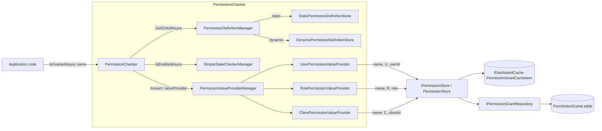

ABP's permission system is two layers stacked over ASP.NET Core authorization:

1. A **definition layer** (`IPermissionDefinitionManager` + providers) declaring what permissions exist, how they group and what state checkers apply. Source: `framework/src/Volo.Abp.Authorization.Abstractions/Volo/Abp/Authorization/Permissions/`.
2. A **value layer** (`IPermissionChecker` → `IPermissionValueProvider`s → `IPermissionStore`) deciding whether a specific principal currently holds a permission. Source: `framework/src/Volo.Abp.Authorization/Volo/Abp/Authorization/Permissions/`, persistence in `modules/permission-management/src/Volo.Abp.PermissionManagement.Domain/`.

A permission is **never** intrinsic to a user — the user's `(name, providerName, providerKey)` triples are looked up by a value provider, and the value provider drives the answer. That indirection is what lets the same permission be granted to a user, all members of a role, an OAuth client, or an arbitrary key.

## Defining permissions

Permissions are declared inside an `IPermissionDefinitionProvider` (`framework/src/Volo.Abp.Authorization.Abstractions/Volo/Abp/Authorization/Permissions/IPermissionDefinitionProvider.cs`):

```csharp
public interface IPermissionDefinitionProvider
{
    void PreDefine(IPermissionDefinitionContext context);
    void Define(IPermissionDefinitionContext context);
    void PostDefine(IPermissionDefinitionContext context);
}
```

`AbpAuthorizationModule.PreConfigureServices` walks the DI container via `services.OnRegistered` and adds every `IPermissionDefinitionProvider` discovery target into `AbpPermissionOptions.DefinitionProviders`. A typical implementation extends `PermissionDefinitionProvider` (the abstract base) and uses the fluent `IPermissionDefinitionContext`:

```csharp
public class BookStorePermissionDefinitionProvider : PermissionDefinitionProvider
{
    public override void Define(IPermissionDefinitionContext context)
    {
        var group = context.AddGroup(BookStorePermissions.GroupName, L("Permission:BookStore"));
        var books = group.AddPermission(BookStorePermissions.Books.Default, L("Permission:Books"));
        books.AddChild(BookStorePermissions.Books.Create, L("Permission:Books.Create"));
        books.AddChild(BookStorePermissions.Books.Edit,   L("Permission:Books.Edit"));
        books.AddChild(BookStorePermissions.Books.Delete, L("Permission:Books.Delete"));
    }
}
```

`PermissionGroupDefinition.AddPermission` (`framework/src/Volo.Abp.Authorization.Abstractions/Volo/Abp/Authorization/Permissions/PermissionGroupDefinition.cs`) and `PermissionDefinition.AddChild` (`PermissionDefinition.cs`) carry the `_CurrentProviderName` property forward so the framework can attribute every definition to the provider type that created it.

### `PermissionDefinition` fields

`PermissionDefinition` (`Volo/Abp/Authorization/Permissions/PermissionDefinition.cs`) holds:

| Member | Notes |
|---|---|
| `Name` | Unique key, used as the policy name. |
| `DisplayName` | `ILocalizableString` for the management UI. |
| `Parent` / `Children` | Hierarchy. A child can only be granted when the parent is. `AddChild` throws if the permission is a resource permission. |
| `MultiTenancySide` | `Host`, `Tenant` or `Both`. `PermissionChecker` short-circuits when this flag does not include the current side. |
| `Providers` | Whitelist of value-provider names (e.g. `"U"`, `"R"`). Empty = all providers. |
| `StateCheckers` | List of `ISimpleStateChecker<PermissionDefinition>` — e.g. `RequireAuthenticatedSimpleStateChecker`, `RequirePermissionsSimpleBatchStateChecker`. Drives feature-gating and "must hold another permission first" semantics. |
| `IsEnabled` | Globally disable. Disabled permissions are visible (so the UI does not break) but always evaluate to `false`. |
| `Properties` | Open dictionary; used for metadata such as the originating provider name. |
| `ResourceName`, `ManagementPermissionName` | Populated only via `IPermissionDefinitionContext.AddResourcePermission(name, resourceName, managementPermissionName)`. Resource permissions cannot have children. |

### Groups and resource permissions

`PermissionDefinitionContext` (`framework/src/Volo.Abp.Authorization.Abstractions/Volo/Abp/Authorization/Permissions/PermissionDefinitionContext.cs`) holds the dictionary of `PermissionGroupDefinition` plus a flat `ResourcePermissions` list. `AddGroup`, `RemoveGroup`, `AddResourcePermission`, `GetPermissionOrNull` and `GetResourcePermissionOrNull` are the only legal mutators. `AbpPermissionOptions.DeletedPermissions` / `DeletedPermissionGroups` is the supported way for a downstream module to suppress a permission defined upstream (the cleanup happens in `PostDefine`).

## Static and dynamic stores

`PermissionDefinitionManager` (`framework/src/Volo.Abp.Authorization/Volo/Abp/Authorization/Permissions/PermissionDefinitionManager.cs`) combines two stores:

```csharp
public PermissionDefinitionManager(
    IStaticPermissionDefinitionStore staticStore,
    IDynamicPermissionDefinitionStore dynamicStore) { ... }

public virtual async Task<PermissionDefinition?> GetOrNullAsync(string name)
    => await _staticStore.GetOrNullAsync(name) ?? await _dynamicStore.GetOrNullAsync(name);

public virtual async Task<IReadOnlyList<PermissionDefinition>> GetPermissionsAsync()
{
    var staticPermissions = await _staticStore.GetPermissionsAsync();
    var staticPermissionNames = staticPermissions.Select(p => p.Name).ToImmutableHashSet();
    var dynamicPermissions = await _dynamicStore.GetPermissionsAsync();
    // We prefer static permissions over dynamics
    return staticPermissions.Concat(dynamicPermissions.Where(d => !staticPermissionNames.Contains(d.Name))).ToImmutableList();
}
```

- `StaticPermissionDefinitionStore` (`Volo/Abp/Authorization/Permissions/StaticPermissionDefinitionStore.cs`) is a singleton that runs every `IPermissionDefinitionProvider` once (in `CreatePermissionDefinitionsAsync`) inside a new DI scope, and caches the result in `IStaticDefinitionCache<…>`. `StaticPermissionDefinitionChangedEvent` flushes the cache.
- `NullDynamicPermissionDefinitionStore` is the fallback when the `permission-management` module is not installed.
- `DynamicPermissionDefinitionStore` (`modules/permission-management/src/Volo.Abp.PermissionManagement.Domain/Volo/Abp/PermissionManagement/DynamicPermissionDefinitionStore.cs`) replaces the null one when `PermissionManagementOptions.IsDynamicPermissionStoreEnabled` is `true`. It reads `PermissionGroupDefinitionRecord` / `PermissionDefinitionRecord` rows from the database, deserializes them via `IPermissionDefinitionSerializer`, takes a distributed lock and caches the result in `IDynamicPermissionDefinitionStoreInMemoryCache`. Static beats dynamic on name conflicts.

## Value providers

`AbpAuthorizationModule` registers three value providers by default (`Volo/Abp/Authorization/AbpAuthorizationModule.cs`):

```csharp
options.ValueProviders.Add<UserPermissionValueProvider>();
options.ValueProviders.Add<RolePermissionValueProvider>();
options.ValueProviders.Add<ClientPermissionValueProvider>();
```

All three derive from `PermissionValueProvider` and use the same `IPermissionStore`. Each one is keyed by a short provider name and reads a different claim:

| Provider | `Name` constant | Claim consulted | Notes |
|---|---|---|---|
| `UserPermissionValueProvider` (`Volo/Abp/Authorization/Permissions/UserPermissionValueProvider.cs`) | `"U"` | `AbpClaimTypes.UserId` | Returns `Granted` if the store says so, otherwise `Undefined`. |
| `RolePermissionValueProvider` (`RolePermissionValueProvider.cs`) | `"R"` | All `AbpClaimTypes.Role` claims | Iterates distinct role names; first granted role wins. The batched overload accumulates results across roles and breaks out early on `AllGranted` / `AllProhibited`. |
| `ClientPermissionValueProvider` (`ClientPermissionValueProvider.cs`) | `"C"` | `AbpClaimTypes.ClientId` | Wraps the store call in `CurrentTenant.Change(null)` so client-level grants are always queried in the host context, never against tenant-scoped data. |

`PermissionValueProviderManager` (`Volo/Abp/Authorization/Permissions/PermissionValueProviderManager.cs`) materialises the providers from `AbpPermissionOptions.ValueProviders` lazily, validates that no two providers share the same `Name`, and exposes the ordered list to `PermissionChecker`.

To add a value provider — for example, an "OrganizationUnit" provider — register a class deriving from `PermissionValueProvider`, set a unique `Name`, and call `options.ValueProviders.Add<…>()` in a module's `ConfigureServices`. ABP also discovers `IPermissionValueProvider` registrations automatically through `OnRegistered`.

## `PermissionChecker`

`PermissionChecker` (`Volo/Abp/Authorization/Permissions/PermissionChecker.cs`) implements `IPermissionChecker` and is the single entry point used by `PermissionRequirementHandler`, application services and the extension methods on `IAuthorizationService`.

Single-permission flow:

```csharp
public virtual async Task<bool> IsGrantedAsync(ClaimsPrincipal? claimsPrincipal, string name)
{
    var permission = await PermissionDefinitionManager.GetOrNullAsync(name);
    if (permission == null) return false;
    if (!permission.IsEnabled) return false;
    if (!await StateCheckerManager.IsEnabledAsync(permission)) return false;

    var multiTenancySide = claimsPrincipal?.GetMultiTenancySide() ?? CurrentTenant.GetMultiTenancySide();
    if (!permission.MultiTenancySide.HasFlag(multiTenancySide)) return false;

    var isGranted = false;
    var context = new PermissionValueCheckContext(permission, claimsPrincipal);
    foreach (var provider in PermissionValueProviderManager.ValueProviders)
    {
        if (context.Permission.Providers.Any() &&
            !context.Permission.Providers.Contains(provider.Name)) continue;

        var result = await provider.CheckAsync(context);
        if (result == PermissionGrantResult.Granted) isGranted = true;
        else if (result == PermissionGrantResult.Prohibited) return false;
    }

    return isGranted;
}
```

Key invariants encoded here:

- **Undefined permission ⇒ `false`.** Never silently grant for unknown names.
- **`IsEnabled = false` ⇒ `false`** without consulting any provider — useful for kill-switching a feature flag.
- **State checkers are gating.** They run before value providers (see `RequireAuthenticatedSimpleStateChecker.cs`, `RequirePermissionsSimpleStateChecker.cs`).
- **MultiTenancy side** is computed from the principal's `TenantId` claim, falling back to `ICurrentTenant`. A `Host`-only permission can never be granted from inside a tenant principal.
- Value providers are walked **in declaration order**. The first `Prohibited` short-circuits; any `Granted` is remembered. This means a denylist provider must come *after* the allowlist ones to override them.

The batched `IsGrantedAsync(string[])` keeps a `MultiplePermissionGrantResult` (`Result : Dictionary<string, PermissionGrantResult>`) and prunes its working set as providers prohibit permissions, breaking out early when `result.AllProhibited` becomes `true`.

## `IPermissionStore` and the management module

`IPermissionStore` (`framework/src/Volo.Abp.Authorization.Abstractions/Volo/Abp/Authorization/Permissions/IPermissionStore.cs`):

```csharp
public interface IPermissionStore
{
    Task<bool> IsGrantedAsync(string name, string providerName, string providerKey);
    Task<MultiplePermissionGrantResult> IsGrantedAsync(string[] names, string providerName, string providerKey);
}
```

The framework ships `NullPermissionStore` (`Volo/Abp/Authorization/Permissions/NullPermissionStore.cs`) and `AlwaysAllowPermissionChecker` (used inside unit tests that opt out of authorization).

The production implementation is `PermissionStore` in `modules/permission-management/src/Volo.Abp.PermissionManagement.Domain/Volo/Abp/PermissionManagement/PermissionStore.cs`. It:

1. Computes a cache key `pn:<providerName>,pk:<providerKey>,n:<name>` and consults `IDistributedCache<PermissionGrantCacheItem>` (`PermissionGrantCacheItem.cs`).
2. On a miss, calls `IPermissionGrantRepository.GetListAsync(providerName, providerKey)` exactly once and **populates a cache entry for every defined permission** — granted or not — through `Cache.SetManyAsync`. Subsequent calls for any name of the same `(providerName, providerKey)` pair are then a single cache lookup.
3. Disables EF Core change tracking around the repository read.

The persisted entity is `PermissionGrant` (`modules/permission-management/src/Volo.Abp.PermissionManagement.Domain/Volo/Abp/PermissionManagement/PermissionGrant.cs`):

```csharp
public class PermissionGrant : Entity<Guid>, IMultiTenant
{
    public virtual Guid? TenantId { get; protected set; }
    public virtual string Name { get; protected set; }
    public virtual string ProviderName { get; protected set; } // "U" | "R" | "C" | custom
    public virtual string ProviderKey { get; protected internal set; } // userId / roleName / clientId
}
```

Mutations go through `PermissionManagementProvider` (one subclass per provider name — `UserPermissionManagementProvider`, `RolePermissionManagementProvider`, `ClientPermissionManagementProvider` in the same folder). The abstract base lives in `PermissionManagementProvider.cs`:

```csharp
public virtual async Task<MultiplePermissionValueProviderGrantInfo> CheckAsync(string[] names, string providerName, string providerKey)
{
    if (providerName != Name) return new MultiplePermissionValueProviderGrantInfo(names);
    var permissionGrants = await PermissionGrantRepository.GetListAsync(names, providerName, providerKey);
    // ...
}

public virtual Task SetAsync(string name, string providerKey, bool isGranted)
    => isGranted ? GrantAsync(name, providerKey) : RevokeAsync(name, providerKey);
```

`PermissionGrantCacheItemInvalidator` listens for entity-changed events on `PermissionGrant` and removes the matching cache key — see [`/modules/permission-management`](/modules/permission-management).

## Resource permissions

A resource permission targets a `(resourceName, name, resourceKey)` triple — used for per-object grants (e.g. "Read on Book #42"). Highlights:

- `IPermissionDefinitionContext.AddResourcePermission(name, resourceName, managementPermissionName)` registers them; their `ManagementPermissionName` is the conventional permission the caller needs to grant/revoke other users on the resource.
- `IResourcePermissionStore` (`framework/src/Volo.Abp.Authorization.Abstractions/Volo/Abp/Authorization/Permissions/Resources/IResourcePermissionStore.cs`) is the per-resource counterpart of `IPermissionStore`.
- `ResourcePermissionChecker` (`framework/src/Volo.Abp.Authorization/Volo/Abp/Authorization/Permissions/Resources/ResourcePermissionChecker.cs`) and the `User/Role/ClientResourcePermissionValueProvider` siblings drive evaluation.
- `KeyedObjectResourcePermissionRequirementHandler` is the requirement handler used when `AbpAuthorizationPolicyProvider` recognises a resource-permission policy.
- Storage in the management module lives in `ResourcePermissionGrant.cs`, `ResourcePermissionStore.cs` and `ResourcePermissionManagementProvider.cs`.

## End-to-end check



## See also

- Interceptor and policy provider — [`auth/authorization`](/auth/authorization).
- Claims and principal — [`auth/security-and-claims`](/auth/security-and-claims).
- Permission management UI, endpoints and seeding — [`/modules/permission-management`](/modules/permission-management).
- Identity user / role aggregates that supply `UserId` and `Role` claims — [`/modules/identity`](/modules/identity).
- Multi-tenancy filter that gates host/tenant permissions — [`/multitenancy/overview`](/multitenancy/overview).
