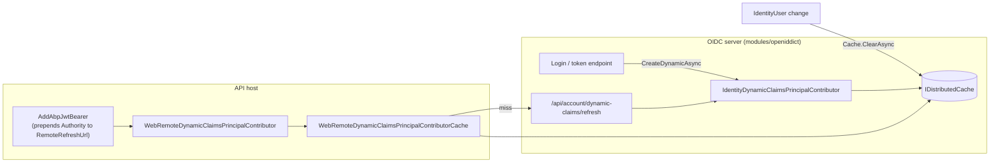

`framework/src/Volo.Abp.Security/` is the foundation everything else in the auth stack stands on. It owns the **current principal**, the **claim-type vocabulary**, the **claims-principal factory**, the **dynamic-claims pipeline** and `AbpAuthorizationException`. There is no module dependency on ASP.NET Core in this assembly — it works equally well from a console host or background worker.

## Module

`AbpSecurityModule` (`Volo/Abp/Security/AbpSecurityModule.cs`) does three things:

1. Auto-discovers `IAbpClaimsPrincipalContributor` and `IAbpDynamicClaimsPrincipalContributor` implementations across the application and adds their service types into `AbpClaimsPrincipalFactoryOptions.Contributors` / `DynamicContributors`. This is why a module can ship a new claim contributor by simply registering it — no extra wiring needed.
2. Sets `AbpSecurityLogOptions.ApplicationName` from `IServiceCollection.GetApplicationName()`.
3. Reads `StringEncryption:*` from configuration into `AbpStringEncryptionOptions`.

```csharp
public override void PostConfigureServices(ServiceConfigurationContext context)
{
    AutoAddClaimsPrincipalContributors(context.Services);
}

private static void AutoAddClaimsPrincipalContributors(IServiceCollection services)
{
    var contributorTypes = new List<Type>();
    var dynamicContributorTypes = new List<Type>();

    services.OnRegistered(context =>
    {
        if (typeof(IAbpClaimsPrincipalContributor).IsAssignableFrom(context.ImplementationType))
            contributorTypes.Add(context.ImplementationType);
        if (typeof(IAbpDynamicClaimsPrincipalContributor).IsAssignableFrom(context.ImplementationType))
            dynamicContributorTypes.Add(context.ImplementationType);
    });

    services.Configure<AbpClaimsPrincipalFactoryOptions>(options =>
    {
        options.Contributors.AddIfNotContains(contributorTypes);
        options.DynamicContributors.AddIfNotContains(dynamicContributorTypes);
    });
}
```

## `ICurrentPrincipalAccessor`

Most ABP services read claims through this interface (`Volo/Abp/Security/Claims/ICurrentPrincipalAccessor.cs`) rather than `IHttpContextAccessor`:

```csharp
public interface ICurrentPrincipalAccessor
{
    ClaimsPrincipal Principal { get; }
    IDisposable Change(ClaimsPrincipal principal);
}
```

The abstract base `CurrentPrincipalAccessorBase` (`CurrentPrincipalAccessorBase.cs`) stores the override in an `AsyncLocal<ClaimsPrincipal>` so `Change` is async-safe:

```csharp
public abstract class CurrentPrincipalAccessorBase : ICurrentPrincipalAccessor
{
    public ClaimsPrincipal Principal => _currentPrincipal.Value ?? GetClaimsPrincipal();
    private readonly AsyncLocal<ClaimsPrincipal> _currentPrincipal = new AsyncLocal<ClaimsPrincipal>();
    protected abstract ClaimsPrincipal GetClaimsPrincipal();

    public virtual IDisposable Change(ClaimsPrincipal principal)
    {
        var parent = Principal;
        _currentPrincipal.Value = principal;
        return new DisposeAction<(AsyncLocal<ClaimsPrincipal>, ClaimsPrincipal)>(
            static state => state.Item1.Value = state.Item2,
            (_currentPrincipal, parent));
    }
}
```

Two concrete implementations ship:

- `ThreadCurrentPrincipalAccessor` (`ThreadCurrentPrincipalAccessor.cs`, singleton) — reads from `Thread.CurrentPrincipal`. Used in console/worker hosts and unit tests.
- `HttpContextPrincipalAccessor` (in `Volo.Abp.AspNetCore`) — reads from `HttpContext.User`.

`Change` is the canonical way to run code as a different principal:

```csharp
await using (_currentPrincipalAccessor.Change(systemPrincipal))
{
    await DoBackgroundWorkAsync();
}
```

The dispose action restores the previous principal, even if it was `null`. This is how background jobs and event handlers stamp `(TenantId, UserId)` onto the work they execute.

## `AbpClaimTypes`

`AbpClaimTypes` (`Volo/Abp/Security/Claims/AbpClaimTypes.cs`) is a static catalog of mutable claim-type names. ABP code reads claims through these constants instead of hard-coded ASP.NET Core strings so the deployment can change the wire format without touching the framework:

| Property | Default value | Notes |
|---|---|---|
| `UserName` | `ClaimTypes.Name` | Override to `"preferred_username"` for OIDC interop. |
| `Name` | `ClaimTypes.GivenName` | First/given name. |
| `SurName` | `ClaimTypes.Surname` | – |
| `UserId` | `ClaimTypes.NameIdentifier` | Must parse as `Guid`. |
| `Role` | `ClaimTypes.Role` | – |
| `Email` | `ClaimTypes.Email` | – |
| `EmailVerified` | `"email_verified"` | – |
| `PhoneNumber` | `"phone_number"` | – |
| `PhoneNumberVerified` | `"phone_number_verified"` | – |
| `TenantId` | `"tenantid"` | Must parse as `Guid`. |
| `EditionId` | `"editionid"` | – |
| `ClientId` | `"client_id"` | Used by `ClientPermissionValueProvider`. |
| `ImpersonatorTenantId` / `ImpersonatorUserId` / `ImpersonatorTenantName` / `ImpersonatorUserName` | `"impersonator_*"` | Set by Identity's impersonation flow. |
| `Picture` | `"picture"` | – |
| `RememberMe` | `"remember_me"` | – |
| `SessionId` | `"session_id"` | Used by session management in `modules/identity`. |

Override these in your application's `Startup` (or, better, in a single module's `ConfigureServices`) **once** before any user authenticates:

```csharp
AbpClaimTypes.UserName = "preferred_username";
AbpClaimTypes.UserId   = "sub";
```

The companion `AbpClaimsIdentityExtensions` class (`System/Security/Principal/AbpClaimsIdentityExtensions.cs`) exposes the matching `FindUserId`, `FindTenantId`, `FindClientId`, `FindEditionId`, `FindImpersonatorUserId`, `FindImpersonatorTenantId`, `FindSessionId`, plus mutation helpers `AddIfNotContains`, `AddOrReplace`, `RemoveAll`, `AddIdentityIfNotContains`. All of them honour the current `AbpClaimTypes` values.

## `ICurrentUser` / `ICurrentClient`

`CurrentUser` (`Volo/Abp/Users/CurrentUser.cs`) is the per-request projection that application code actually injects:

```csharp
public virtual Guid? Id => _principalAccessor.Principal?.FindUserId();
public virtual string? UserName => this.FindClaimValue(AbpClaimTypes.UserName);
public virtual string[] Roles => FindClaims(AbpClaimTypes.Role).Select(c => c.Value).Distinct().ToArray();
public virtual Guid? TenantId => _principalAccessor.Principal?.FindTenantId();
public virtual bool IsAuthenticated => Id.HasValue;
```

`CurrentClient` (`Volo/Abp/Clients/CurrentClient.cs`) does the same for the OAuth2 `client_id` claim. Both are `ITransientDependency` and back onto `ICurrentPrincipalAccessor` — never inject `IHttpContextAccessor` in business code.

## The claims-principal factory pipeline

When an application produces a fresh `ClaimsPrincipal` (login, refresh, dynamic-claims rebuild), it should call `IAbpClaimsPrincipalFactory.CreateAsync`. `AbpClaimsPrincipalFactory` (`Volo/Abp/Security/Claims/AbpClaimsPrincipalFactory.cs`):

```csharp
public virtual async Task<ClaimsPrincipal> CreateAsync(ClaimsPrincipal? existsClaimsPrincipal = null)
    => await InternalCreateAsync(Options, existsClaimsPrincipal, false);

public virtual async Task<ClaimsPrincipal> CreateDynamicAsync(ClaimsPrincipal? existsClaimsPrincipal = null)
    => await InternalCreateAsync(Options, existsClaimsPrincipal, true);

public virtual async Task<ClaimsPrincipal> InternalCreateAsync(...)
{
    var claimsPrincipal = existsClaimsPrincipal ?? new ClaimsPrincipal(new ClaimsIdentity(
        AuthenticationType, AbpClaimTypes.UserName, AbpClaimTypes.Role));

    var context = new AbpClaimsPrincipalContributorContext(claimsPrincipal, ServiceProvider);

    if (!isDynamic)
        foreach (var t in options.Contributors)
            await ((IAbpClaimsPrincipalContributor)ServiceProvider.GetRequiredService(t)).ContributeAsync(context);
    else
        foreach (var t in options.DynamicContributors)
            await ((IAbpDynamicClaimsPrincipalContributor)ServiceProvider.GetRequiredService(t)).ContributeAsync(context);

    return context.ClaimsPrincipal;
}
```

`AuthenticationType` is the constant `"Abp.Application"`. The `ClaimsIdentity` is constructed with `AbpClaimTypes.UserName` as its `nameType` and `AbpClaimTypes.Role` as its `roleType`, so `principal.IsInRole(...)` and `principal.Identity!.Name` work as expected without further mapping.

### `IAbpClaimsPrincipalContributor`

```csharp
public interface IAbpClaimsPrincipalContributor
{
    Task ContributeAsync(AbpClaimsPrincipalContributorContext context);
}
```

Contributors get `context.ClaimsPrincipal` (mutable) and `context.ServiceProvider`. Common use cases:

- Adding `TenantId` after the user picks a tenant.
- Adding session id / device id claims.
- Mapping external IdP claims (`oid` → `UserId`).

`Volo.Abp.AspNetCore` ships several contributors; modules like `Identity` and `OpenIddict` add more.

### `IAbpDynamicClaimsPrincipalContributor` and the cache pattern

Dynamic claims are claims whose values can change while a token is alive — roles, email-verified flag, custom permission claims. The contract is identical:

```csharp
public interface IAbpDynamicClaimsPrincipalContributor
{
    Task ContributeAsync(AbpClaimsPrincipalContributorContext context);
}
```

`AbpDynamicClaimsPrincipalContributorBase` (`AbpDynamicClaimsPrincipalContributorBase.cs`) gives subclasses the merge logic — for every `(claimType, value)` listed in `AbpClaimsPrincipalFactoryOptions.ClaimsMap`, it removes the existing claim from the identity and adds the fresh values:

```csharp
protected virtual async Task AddDynamicClaimsAsync(
    AbpClaimsPrincipalContributorContext context, ClaimsIdentity identity, List<AbpDynamicClaim> dynamicClaims)
{
    var options = context.GetRequiredService<IOptions<AbpClaimsPrincipalFactoryOptions>>().Value;
    foreach (var map in options.ClaimsMap)
        await MapClaimAsync(identity, dynamicClaims, map.Key, map.Value.ToArray());

    foreach (var claimGroup in dynamicClaims.GroupBy(x => x.Type))
    {
        identity.RemoveAll(claimGroup.First().Type);
        identity.AddClaims(claimGroup.Where(c => c.Value != null)
            .Select(c => new Claim(claimGroup.First().Type, c.Value!)));
    }
}
```

`AbpClaimsPrincipalFactoryOptions` (`AbpClaimsPrincipalFactoryOptions.cs`) defaults:

```csharp
DynamicClaims = new List<string>
{
    AbpClaimTypes.UserName, AbpClaimTypes.Name, AbpClaimTypes.SurName,
    AbpClaimTypes.Role, AbpClaimTypes.Email, AbpClaimTypes.EmailVerified,
    AbpClaimTypes.PhoneNumber, AbpClaimTypes.PhoneNumberVerified
};

RemoteRefreshUrl = "/api/account/dynamic-claims/refresh";
IsRemoteRefreshEnabled = true;
IsDynamicClaimsEnabled = false;

ClaimsMap = new Dictionary<string, List<string>>
{
    { AbpClaimTypes.UserName, new() { "preferred_username", "unique_name", ClaimTypes.Name } },
    { AbpClaimTypes.Name,     new() { "given_name",  ClaimTypes.GivenName } },
    { AbpClaimTypes.SurName,  new() { "family_name", ClaimTypes.Surname } },
    { AbpClaimTypes.Role,     new() { "role", "roles", ClaimTypes.Role } },
    { AbpClaimTypes.Email,    new() { "email", ClaimTypes.Email } },
};
```

`IsDynamicClaimsEnabled` is **opt-in**. Turn it on per host. `RemoteRefreshUrl` is then prefixed with the authority URL by `AddAbpJwtBearer` / `AddAbpOpenIdConnect`.

### Cache shape

`AbpDynamicClaim` (`AbpDynamicClaim.cs`) and `AbpDynamicClaimCacheItem` (`AbpDynamicClaimCacheItem.cs`) define the wire format:

```csharp
[Serializable]
public class AbpDynamicClaim { public string Type; public string? Value; }

[Serializable]
public class AbpDynamicClaimCacheItem
{
    public List<AbpDynamicClaim> Claims { get; set; }
    public static string CalculateCacheKey(Guid userId, Guid? tenantId) => $"{tenantId}-{userId}";
}
```

The cache is shared across the issuing server and every API host that needs fresh claims.

### Remote contributors

`RemoteDynamicClaimsPrincipalContributorBase<TContributor, TContributorCache>` (`RemoteDynamicClaimsPrincipalContributorBase.cs`) is the client side: read the cache, merge it. If the cache fetch throws, the principal is replaced by an empty `ClaimsPrincipal` so the request fails closed:

```csharp
try { dynamicClaims = await dynamicClaimsCache.GetAsync(userId.Value, identity.FindTenantId()); }
catch (Exception e)
{
    context.ClaimsPrincipal = new ClaimsPrincipal(new ClaimsIdentity()); // force-anonymous
    logger.LogWarning(e, $"Failed to refresh remote dynamic claims cache for user: {userId.Value}");
    return;
}
```

`RemoteDynamicClaimsPrincipalContributorCacheBase` is the abstract cache. `WebRemoteDynamicClaimsPrincipalContributor(Cache)` in `Volo.Abp.AspNetCore.Authentication.JwtBearer` is the concrete implementation that calls the auth server's `RemoteRefreshUrl` on miss — see [`auth/jwt-bearer`](/auth/jwt-bearer).

### The producer in `modules/identity`

`IdentityDynamicClaimsPrincipalContributor` (`modules/identity/src/Volo.Abp.Identity.Domain/Volo/Abp/Identity/IdentityDynamicClaimsPrincipalContributor.cs`) is the canonical producer:

```csharp
public async override Task ContributeAsync(AbpClaimsPrincipalContributorContext context)
{
    var identity = context.ClaimsPrincipal.Identities.FirstOrDefault();
    var userId = identity?.FindUserId();
    if (userId == null) return;

    var dynamicClaimsCache = context.GetRequiredService<IdentityDynamicClaimsPrincipalContributorCache>();
    AbpDynamicClaimCacheItem dynamicClaims;
    try { dynamicClaims = await dynamicClaimsCache.GetAsync(userId.Value, identity.FindTenantId()); }
    catch (EntityNotFoundException e)
    {
        context.ClaimsPrincipal = new ClaimsPrincipal(new ClaimsIdentity()); // user vanished → fail closed
        logger.LogWarning(e, $"User not found: {userId.Value}");
        return;
    }
    if (dynamicClaims.Claims.IsNullOrEmpty()) return;
    await AddDynamicClaimsAsync(context, identity, dynamicClaims.Claims);
}
```

`IdentityDynamicClaimsPrincipalContributorCache.GetAsync` (same folder) is the back-end cache filler. On miss it loads the `IdentityUser` via `IdentityUserManager.GetByIdAsync`, asks `IUserClaimsPrincipalFactory<IdentityUser>` to materialise the claims, then for each entry in `AbpClaimsPrincipalFactoryOptions.DynamicClaims` it captures the matching claims into an `AbpDynamicClaimCacheItem`:

```csharp
var user = await UserManager.GetByIdAsync(userId);
var principal = await UserClaimsPrincipalFactory.CreateAsync(user);

var dynamicClaims = new AbpDynamicClaimCacheItem();
foreach (var claimType in AbpClaimsPrincipalFactoryOptions.Value.DynamicClaims)
{
    var claims = principal.Claims.Where(x => x.Type == claimType).ToList();
    if (claims.Any())
        dynamicClaims.Claims.AddRange(claims.Select(c => new AbpDynamicClaim(claimType, c.Value)));
    else
        dynamicClaims.Claims.Add(new AbpDynamicClaim(claimType, null));
}
```

`ClearAsync(userId, tenantId)` is what the Identity app service calls after the user's roles or profile change — see [`/modules/identity`](/modules/identity).

## End-to-end dynamic claims



## Security log and string encryption

The `Volo.Abp.SecurityLog/` sub-tree is the audit log for security-relevant operations (login success/failure, password change). `ISecurityLogManager.SaveAsync(SecurityLogInfo)` is the entry point; `SimpleSecurityLogStore` is the in-memory default that the Identity module replaces with a database-backed one. `AbpSecurityLogOptions.ApplicationName` defaults to the application name registered with the modularity system.

`AbpStringEncryptionOptions` + `StringEncryptionService` (`Encryption/`) are used by sensitive settings (e.g. LDAP password, see [`auth/ldap`](/auth/ldap)). Configuration keys: `StringEncryption:KeySize`, `StringEncryption:DefaultPassPhrase`, `StringEncryption:InitVectorBytes`, `StringEncryption:DefaultSalt`. Override `DefaultPassPhrase` per environment.

## `AbpAuthorizationException`

`AbpAuthorizationException` (`Volo/Abp/Authorization/AbpAuthorizationException.cs`) is the canonical "not allowed" exception. It implements both `IHasLogLevel` (defaults to `LogLevel.Warning`) and `IHasErrorCode`, and exposes a `WithData(string, object)` helper. The `Code` field carries the `AbpAuthorizationErrorCodes` constants from [`auth/authorization`](/auth/authorization). The HTTP exception filter in `Volo.Abp.AspNetCore.Mvc` returns **401** when `ICurrentUser.IsAuthenticated == false` and **403** otherwise.

## Cheat sheet

| Need | Use |
|---|---|
| Read current user id/tenant inside a service | Inject `ICurrentUser` |
| Read current OAuth client id | Inject `ICurrentClient` |
| Run code as a different principal (background job, system) | `ICurrentPrincipalAccessor.Change(principal)` inside `using` |
| Build a `ClaimsPrincipal` from an `IdentityUser` (server) | `IAbpClaimsPrincipalFactory.CreateAsync` |
| Refresh dynamic claims for a user (server) | `IAbpClaimsPrincipalFactory.CreateDynamicAsync` |
| Invalidate dynamic claims after a role change | `IdentityDynamicClaimsPrincipalContributorCache.ClearAsync(userId, tenantId)` |
| Throw a 403 from anywhere | `throw new AbpAuthorizationException(...)` |
| Add an extra claim on login | Implement `IAbpClaimsPrincipalContributor`, register it (auto-discovered) |

## See also

- Authorization pipeline (interceptor, policy provider) — [`auth/authorization`](/auth/authorization).
- Permission checker and value providers — [`auth/permissions`](/auth/permissions).
- JWT bearer host (dynamic-claims refresh on the wire) — [`auth/jwt-bearer`](/auth/jwt-bearer).
- Identity user store and dynamic-claims producer — [`/modules/identity`](/modules/identity).
- Multi-tenancy claims (`TenantId`, impersonation) — [`/multitenancy/overview`](/multitenancy/overview).
