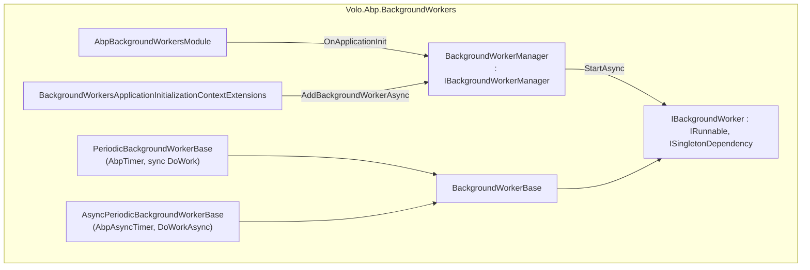

ABP's **background workers** subsystem provides a small, allocation-friendly abstraction over long-lived, in-process services — workers that the host starts on application initialization and stops on shutdown. The contract is `IBackgroundWorker` (`IRunnable`); base classes layer a periodic timer on top so most workers reduce to overriding a single `DoWork` or `DoWorkAsync` method. The implementations live in `framework/src/Volo.Abp.BackgroundWorkers/Volo/Abp/BackgroundWorkers/`.

This is the substrate that the [background jobs](/background/background-jobs) polling worker (`BackgroundJobWorker`) is built on, and the substrate that the event-bus outbox/inbox processors (`OutboxSenderManager`, `InboxProcessManager`) plug into. Many ABP modules ship a worker as their "ambient" task: it is therefore the simplest extension point in the framework.

## Component model



`BackgroundWorkerManager` is registered as `ISingletonDependency` and owns the list. `AbpBackgroundWorkersModule` is the lifecycle anchor: its `OnApplicationInitializationAsync` calls `BackgroundWorkerManager.StartAsync(hostApplicationLifetime.ApplicationStopping)`, and `OnApplicationShutdownAsync` calls `StopAsync`. Adding a worker through `context.AddBackgroundWorkerAsync<T>` resolves the worker from DI and hands it to `IBackgroundWorkerManager.AddAsync` — if the manager has already started, the new worker is started immediately.

## The contract

### `IBackgroundWorker`

`framework/src/Volo.Abp.BackgroundWorkers/Volo/Abp/BackgroundWorkers/IBackgroundWorker.cs`:

```csharp
public interface IBackgroundWorker : IRunnable, ISingletonDependency { }
```

`IRunnable` (from `Volo.Abp.Threading`) exposes `Task StartAsync(CancellationToken)` and `Task StopAsync(CancellationToken)`. The `ISingletonDependency` marker means a worker is registered automatically by the conventional registrar — you never have to call `services.AddSingleton<MyWorker>()`.

### `BackgroundWorkerBase`

`framework/src/Volo.Abp.BackgroundWorkers/Volo/Abp/BackgroundWorkers/BackgroundWorkerBase.cs` is the recommended starting point. Highlights:

- Property-injected `IAbpLazyServiceProvider LazyServiceProvider` for late-resolved dependencies (so the worker class itself stays small).
- `Logger` via `LoggerFactory.CreateLogger(GetType().FullName)`.
- `StoppingTokenSource` / `StoppingToken` — a `CancellationTokenSource` cancelled by the default `StopAsync` so derived workers can `await Task.Delay(..., StoppingToken)` without writing their own plumbing.

```csharp
public virtual Task StopAsync(CancellationToken cancellationToken = default)
{
    Logger.LogDebug("Stopped background worker: " + ToString());
    StoppingTokenSource.Cancel();
    StoppingTokenSource.Dispose();
    return Task.CompletedTask;
}
```

### `IBackgroundWorkerManager`

`framework/src/Volo.Abp.BackgroundWorkers/Volo/Abp/BackgroundWorkers/IBackgroundWorkerManager.cs`:

```csharp
public interface IBackgroundWorkerManager : IRunnable
{
    Task AddAsync(IBackgroundWorker worker, CancellationToken cancellationToken = default);
}
```

`BackgroundWorkerManager.AddAsync` simply appends to `_backgroundWorkers` and, if `IsRunning == true`, immediately calls `worker.StartAsync`. `StartAsync` iterates all registered workers in order. There is no priority or dependency graph — order of addition is the order of `StartAsync`.

## The periodic bases

ABP ships two periodic bases that differ only in the timer they use:

### `PeriodicBackgroundWorkerBase` (sync)

`framework/src/Volo.Abp.BackgroundWorkers/Volo/Abp/BackgroundWorkers/PeriodicBackgroundWorkerBase.cs` uses `AbpTimer` (a thin wrapper over `System.Timers.Timer`). The hot path:

```csharp
private void Timer_Elapsed(object? sender, System.EventArgs e)
{
    using (var scope = ServiceScopeFactory.CreateScope())
    {
        try
        {
            DoWork(new PeriodicBackgroundWorkerContext(scope.ServiceProvider));
        }
        catch (Exception ex)
        {
            var exceptionNotifier = scope.ServiceProvider.GetRequiredService<IExceptionNotifier>();
            AsyncHelper.RunSync(() => exceptionNotifier.NotifyAsync(new ExceptionNotificationContext(ex)));
            Logger.LogException(ex);
        }
    }
}

protected abstract void DoWork(PeriodicBackgroundWorkerContext workerContext);
```

Two pieces of behaviour to note:

1. **A new DI scope per tick.** `IServiceScopeFactory.CreateScope()` is invoked every period, which means any scoped service (notably `IUnitOfWorkManager`, `ICurrentTenant`, repositories) is fresh on each invocation. Persisting state across ticks requires fields on the worker class itself.
2. **Exception handling is local.** `IExceptionNotifier` is resolved from the per-tick scope so the application-level exception subscriptions still fire even though the timer fires outside any request scope.

### `AsyncPeriodicBackgroundWorkerBase` (async)

`framework/src/Volo.Abp.BackgroundWorkers/Volo/Abp/BackgroundWorkers/AsyncPeriodicBackgroundWorkerBase.cs` uses `AbpAsyncTimer` (a `Task`-based loop). Its `StartAsync` captures the `cancellationToken` into `StartCancellationToken` so subclasses can chain it into their own awaits:

```csharp
public async override Task StartAsync(CancellationToken cancellationToken = default)
{
    StartCancellationToken = cancellationToken;
    await base.StartAsync(cancellationToken);
    Timer.Start(cancellationToken);
}

private async Task Timer_Elapsed(AbpAsyncTimer timer)
{
    await DoWorkAsync(StartCancellationToken);
}

private async Task DoWorkAsync(CancellationToken cancellationToken = default)
{
    using (var scope = ServiceScopeFactory.CreateScope())
    {
        try { await DoWorkAsync(new PeriodicBackgroundWorkerContext(scope.ServiceProvider, cancellationToken)); }
        catch (Exception ex)
        {
            await scope.ServiceProvider.GetRequiredService<IExceptionNotifier>()
                .NotifyAsync(new ExceptionNotificationContext(ex));
            Logger.LogException(ex);
        }
    }
}

protected abstract Task DoWorkAsync(PeriodicBackgroundWorkerContext workerContext);
```

Both bases expose a `CronExpression` string in addition to `Timer.Period`. **`CronExpression` is purely informational at this layer** — the in-process `AbpTimer`/`AbpAsyncTimer` only honour `Period`. It is consumed by the provider managers (Hangfire, Quartz, TickerQ) when they re-host the worker on their own scheduler, so the property exists on the periodic base to let a worker declare its desired cron once and run under any provider.

### `PeriodicBackgroundWorkerContext`

`PeriodicBackgroundWorkerContext.cs`:

```csharp
public class PeriodicBackgroundWorkerContext
{
    public IServiceProvider ServiceProvider { get; }
    public CancellationToken CancellationToken { get; }
}
```

You always resolve scoped services from `workerContext.ServiceProvider`, not from `BackgroundWorkerBase.ServiceProvider` (which is the root provider). Using the wrong one is the most common bug in custom workers — scoped lifetime services resolved from the root provider behave like singletons and leak state across ticks.

## Lifecycle wiring

### Two registration paths

ABP supports two complementary patterns:

<Tabs>
  <Tab title="Via AddBackgroundWorkerAsync (recommended)">
    Add the worker explicitly in `OnApplicationInitializationAsync`:

    ```csharp
    public override async Task OnApplicationInitializationAsync(
        ApplicationInitializationContext context)
    {
        await context.AddBackgroundWorkerAsync<MyPeriodicWorker>();
    }
    ```

    The extension is `BackgroundWorkersApplicationInitializationContextExtensions.AddBackgroundWorkerAsync<TWorker>`. Internally:

    ```csharp
    if (cancellationToken == default)
    {
        var hostApplicationLifetime = context.ServiceProvider.GetService<IHostApplicationLifetime>();
        if (hostApplicationLifetime != null)
            cancellationToken = hostApplicationLifetime.ApplicationStopping;
    }

    await context.ServiceProvider
        .GetRequiredService<IBackgroundWorkerManager>()
        .AddAsync(
            (IBackgroundWorker)context.ServiceProvider.GetRequiredService(workerType),
            cancellationToken);
    ```

    Note the **default `CancellationToken` defaulting to `IHostApplicationLifetime.ApplicationStopping`** — workers added through this extension automatically receive the host's shutdown token, so `await Task.Delay(..., ct)` inside `DoWorkAsync` cleanly unwinds on Ctrl+C.
  </Tab>
  <Tab title="Manual via IBackgroundWorkerManager">
    For workers conditionally added at runtime:

    ```csharp
    var bwm = sp.GetRequiredService<IBackgroundWorkerManager>();
    var worker = sp.GetRequiredService<MyConditionalWorker>();
    await bwm.AddAsync(worker, hostLifetime.ApplicationStopping);
    ```

    Because `AddAsync` starts the worker immediately when the manager `IsRunning`, this works at any point after `AbpBackgroundWorkersModule.OnApplicationInitializationAsync`.
  </Tab>
</Tabs>

### Module-level kill switch

`AbpBackgroundWorkerOptions.IsEnabled` (default `true`) controls whether the manager starts at all:

```csharp
public override async Task OnApplicationInitializationAsync(ApplicationInitializationContext context)
{
    var options = sp.GetRequiredService<IOptions<AbpBackgroundWorkerOptions>>().Value;
    if (options.IsEnabled)
    {
        var hostApplicationLifetime = sp.GetService<IHostApplicationLifetime>();
        var cancellationToken = hostApplicationLifetime?.ApplicationStopping ?? CancellationToken.None;
        await sp.GetRequiredService<IBackgroundWorkerManager>().StartAsync(cancellationToken);
    }
}
```

`AbpBackgroundWorkersModule.ConfigureServices` short-circuits the value to `false` when `context.Services.IsDataMigrationEnvironment()` is `true`. **This means workers never run during `dotnet ef database update` or seed-only runs**, which is critical: the data-migration host typically lacks a fully-initialized config (Redis, RabbitMQ etc.) and starting workers would crash the migration.

```csharp
public override void ConfigureServices(ServiceConfigurationContext context)
{
    if (context.Services.IsDataMigrationEnvironment())
    {
        Configure<AbpBackgroundWorkerOptions>(options => { options.IsEnabled = false; });
    }
}
```

To force-disable for any reason (tests, single-node debugging) set `Configure<AbpBackgroundWorkerOptions>(o => o.IsEnabled = false)` in your top module.

## Naming

`BackgroundWorkerNameAttribute` (`BackgroundWorkerNameAttribute.cs`) parallels `BackgroundJobNameAttribute`:

```csharp
[BackgroundWorkerName("metrics-aggregator")]
public class MetricsAggregator : AsyncPeriodicBackgroundWorkerBase { ... }
```

`BackgroundWorkerNameAttribute.GetName(type)` returns the attribute value or `type.FullName`. The Hangfire adapter (`HangfirePeriodicBackgroundWorkerAdapter<TWorker>`) reads this in its constructor:

```csharp
RecurringJobId = BackgroundWorkerNameAttribute.GetNameOrNull<TWorker>();
```

so cron-based providers can give your worker a stable identifier in their dashboards even after refactoring the C# type.

## Writing a periodic worker

<Steps>
  <Step title="Pick the base">
    Use `AsyncPeriodicBackgroundWorkerBase` unless you absolutely need a sync method. The async timer is `await`-friendly and does not block thread-pool threads while idle.
  </Step>
  <Step title="Set the period">
    Always set `Timer.Period` in the constructor (milliseconds):

    ```csharp
    public class CleanupWorker : AsyncPeriodicBackgroundWorkerBase
    {
        public CleanupWorker(AbpAsyncTimer timer, IServiceScopeFactory ssf)
            : base(timer, ssf)
        {
            Timer.Period = 60_000; // 1 minute
        }

        protected override async Task DoWorkAsync(PeriodicBackgroundWorkerContext workerContext)
        {
            var repo = workerContext.ServiceProvider.GetRequiredService<ICleanupRepository>();
            await repo.PurgeOldRowsAsync(workerContext.CancellationToken);
        }
    }
    ```
  </Step>
  <Step title="Register at startup">
    ```csharp
    public override async Task OnApplicationInitializationAsync(
        ApplicationInitializationContext context)
    {
        await context.AddBackgroundWorkerAsync<CleanupWorker>();
    }
    ```
  </Step>
  <Step title="Resolve scoped dependencies inside DoWorkAsync">
    Never inject `IRepository<>` or `IUnitOfWorkManager` into the worker constructor — they would be captured as part of the singleton. Always pull them from `workerContext.ServiceProvider`.
  </Step>
  <Step title="Honour the cancellation token">
    `workerContext.CancellationToken` is wired to `StartCancellationToken` (which is the host shutdown token under `AddBackgroundWorkerAsync`). Pass it into every async call you make.
  </Step>
</Steps>

<Warning>
  Long-running ticks block the timer. If your `DoWorkAsync` takes 90 seconds and `Timer.Period = 60_000`, the next tick is not skipped — `AbpAsyncTimer` waits for the current invocation to complete and then waits another `Period` before firing. To "drift-free" scheduling, use the Quartz or TickerQ adapter with a cron expression instead.
</Warning>

## Replacing the manager

`BackgroundWorkerManager` is marked `ISingletonDependency` and has no `[Dependency(ReplaceServices = true)]`, so provider packages just inherit it and use the same attribute themselves. Examples in the tree:

| Provider | Manager class | Path |
|---|---|---|
| Hangfire | `HangfireBackgroundWorkerManager` | `framework/src/Volo.Abp.BackgroundWorkers.Hangfire/Volo/Abp/BackgroundWorkers/Hangfire/HangfireBackgroundWorkerManager.cs` |
| Quartz | `QuartzBackgroundWorkerManager` | `framework/src/Volo.Abp.BackgroundWorkers.Quartz/Volo/Abp/BackgroundWorkers/Quartz/QuartzBackgroundWorkerManager.cs` |
| TickerQ | `AbpTickerQBackgroundWorkerManager` | `framework/src/Volo.Abp.BackgroundWorkers.TickerQ/Volo/Abp/BackgroundWorkers/TickerQ/AbpTickerQBackgroundWorkerManager.cs` |

Each overrides `AddAsync(IBackgroundWorker)` to **intercept periodic workers** and translate them into recurring jobs on the underlying scheduler. Non-periodic `IBackgroundWorker` instances fall through to the base implementation and behave like the in-process default.

## Common patterns

<Accordion title="Conditional registration based on configuration">
  ```csharp
  public override async Task OnApplicationInitializationAsync(ApplicationInitializationContext context)
  {
      var config = context.ServiceProvider.GetRequiredService<IConfiguration>();
      if (config.GetValue<bool>("Workers:EnableMetrics"))
          await context.AddBackgroundWorkerAsync<MetricsAggregator>();
  }
  ```
</Accordion>

<Accordion title="Multi-instance leader election with a distributed lock">
  ```csharp
  protected override async Task DoWorkAsync(PeriodicBackgroundWorkerContext ctx)
  {
      var dl = ctx.ServiceProvider.GetRequiredService<IAbpDistributedLock>();
      await using var handle = await dl.TryAcquireAsync("metrics-aggregator", cancellationToken: ctx.CancellationToken);
      if (handle == null) return; // another instance is the leader

      // ... single-leader work ...
  }
  ```

  This is exactly what `BackgroundJobWorker.DoWorkAsync` does — see [background jobs](/background/background-jobs).
</Accordion>

<Accordion title="One-shot worker">
  Inherit `BackgroundWorkerBase` directly (no periodic base), override `StartAsync` to do the work once, and don't reschedule. Useful for "warm caches at boot" tasks.

  ```csharp
  public class CacheWarmupWorker : BackgroundWorkerBase
  {
      public override async Task StartAsync(CancellationToken cancellationToken = default)
      {
          await base.StartAsync(cancellationToken);
          // Warm cache once, fire-and-forget
          _ = Task.Run(async () =>
          {
              using var scope = ServiceProvider.CreateScope();
              var cache = scope.ServiceProvider.GetRequiredService<IDistributedCache>();
              // ...
          }, StoppingToken);
      }
  }
  ```
</Accordion>

<Accordion title="Coordinating with the ABP Unit of Work">
  Wrap the work in a UoW so every tick is its own transaction:

  ```csharp
  protected override async Task DoWorkAsync(PeriodicBackgroundWorkerContext ctx)
  {
      var uowMgr = ctx.ServiceProvider.GetRequiredService<IUnitOfWorkManager>();
      using var uow = uowMgr.Begin(requiresNew: true);
      // do work...
      await uow.CompleteAsync(ctx.CancellationToken);
  }
  ```
</Accordion>

## Related reading

- [Background jobs](/background/background-jobs) — `BackgroundJobWorker` is the canonical use of `AsyncPeriodicBackgroundWorkerBase` + distributed lock.
- [Hangfire](/background/hangfire), [Quartz](/background/quartz), [TickerQ](/background/tickerq) — workers hosted on external schedulers.
- [Threading and async helpers](/core/threading-and-async) — `AbpTimer`, `AbpAsyncTimer`, `AsyncHelper.RunSync`.
- [Event bus overview](/eventbus/overview) — outbox/inbox use these periodic bases.
- [Background job execution flow](/flows/background-job-execution) — end-to-end trace.
