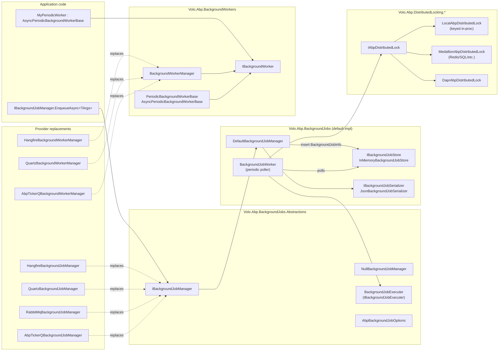

ABP ships **two independent but co-operating subsystems** for long-running and scheduled work: **background jobs** (fire-and-forget, persistent, retried tasks invoked through `IBackgroundJobManager`) and **background workers** (long-lived services that run periodically or on a cron schedule, managed by `IBackgroundWorkerManager`). Both have a default in-process implementation and pluggable provider packages for Hangfire, Quartz, RabbitMQ and TickerQ. A third subsystem, **distributed locking** (`IAbpDistributedLock`), underpins safe multi-instance polling of the job store and is independently usable.

The default wiring lives in `framework/src/Volo.Abp.BackgroundJobs/Volo/Abp/BackgroundJobs/AbpBackgroundJobsModule.cs` and `framework/src/Volo.Abp.BackgroundWorkers/Volo/Abp/BackgroundWorkers/AbpBackgroundWorkersModule.cs`. The former depends on the latter (and on `AbpDistributedLockingAbstractionsModule`), so adding the jobs module to your composition automatically pulls in worker hosting and the no-op `LocalAbpDistributedLock`.

<Info>
  **Audience reminder.** This section deliberately documents implementation classes (e.g. `BackgroundJobWorker`, `DefaultBackgroundJobManager`, `HangfireBackgroundWorkerManager`) — that is the API surface coding agents need to reason about extensibility points. End-user how-tos for the official UI module live in `/modules/background-jobs-module`.
</Info>

## Component model



The diagram captures the **replacement** points: every provider package marks its manager with `[Dependency(ReplaceServices = true)]` (e.g. `HangfireBackgroundJobManager`, `QuartzBackgroundJobManager`, `RabbitMqBackgroundJobManager`, `AbpTickerQBackgroundJobManager`) so that adding one of them to your module composition swaps out `DefaultBackgroundJobManager` without code changes. Workers use the same pattern: `HangfireBackgroundWorkerManager` and `QuartzBackgroundWorkerManager` extend `BackgroundWorkerManager` and reroute `AddAsync` to the underlying scheduler.

## Package catalogue

### Background jobs packages

| Package | Module | Default `IBackgroundJobManager` | Notable types |
|---|---|---|---|
| `Volo.Abp.BackgroundJobs.Abstractions` | `AbpBackgroundJobsAbstractionsModule` | `NullBackgroundJobManager` | `IBackgroundJobManager`, `IBackgroundJob<TArgs>`, `IAsyncBackgroundJob<TArgs>`, `BackgroundJobExecuter`, `AbpBackgroundJobOptions`, `BackgroundJobNameAttribute`, `BackgroundJobPriority` |
| `Volo.Abp.BackgroundJobs` | `AbpBackgroundJobsModule` | `DefaultBackgroundJobManager` | `BackgroundJobInfo`, `IBackgroundJobStore`, `InMemoryBackgroundJobStore`, `BackgroundJobWorker`, `JsonBackgroundJobSerializer`, `AbpBackgroundJobWorkerOptions` |
| `Volo.Abp.BackgroundJobs.HangFire` | `AbpBackgroundJobsHangfireModule` | `HangfireBackgroundJobManager` | `HangfireJobExecutionAdapter<TArgs>`, `AbpDashboardOptionsProvider`, `AbpHangfireApplicationBuilderExtensions.UseAbpHangfireDashboard` |
| `Volo.Abp.BackgroundJobs.Quartz` | `AbpBackgroundJobsQuartzModule` | `QuartzBackgroundJobManager` | `QuartzJobExecutionAdapter<TArgs>`, `AbpBackgroundJobQuartzOptions` (`RetryCount`, `RetryIntervalMillisecond`, `RetryStrategy`) |
| `Volo.Abp.BackgroundJobs.RabbitMQ` | `AbpBackgroundJobsRabbitMqModule` | `RabbitMqBackgroundJobManager` | `IJobQueue<TArgs>`, `JobQueueManager`, `JobQueueConfiguration`, `AbpRabbitMqBackgroundJobOptions` |
| `Volo.Abp.BackgroundJobs.TickerQ` | `AbpBackgroundJobsTickerQModule` | `AbpTickerQBackgroundJobManager` | `AbpBackgroundJobsTickerQOptions`, `AbpBackgroundJobsTimeTickerConfiguration` |

### Background workers packages

| Package | Module | Default `IBackgroundWorkerManager` | Notable types |
|---|---|---|---|
| `Volo.Abp.BackgroundWorkers` | `AbpBackgroundWorkersModule` | `BackgroundWorkerManager` | `IBackgroundWorker`, `BackgroundWorkerBase`, `PeriodicBackgroundWorkerBase`, `AsyncPeriodicBackgroundWorkerBase`, `PeriodicBackgroundWorkerContext`, `BackgroundWorkerNameAttribute`, `BackgroundWorkersApplicationInitializationContextExtensions.AddBackgroundWorkerAsync` |
| `Volo.Abp.BackgroundWorkers.Hangfire` | `AbpBackgroundWorkersHangfireModule` | `HangfireBackgroundWorkerManager` | `IHangfireBackgroundWorker`, `HangfireBackgroundWorkerBase`, `HangfirePeriodicBackgroundWorkerAdapter<TWorker>`, `AbpHangfirePeriodicBackgroundWorkerAdapterOptions` |
| `Volo.Abp.BackgroundWorkers.Quartz` | `AbpBackgroundWorkersQuartzModule` | `QuartzBackgroundWorkerManager` | `IQuartzBackgroundWorker`, `QuartzBackgroundWorkerBase`, `QuartzPeriodicBackgroundWorkerAdapter<TWorker>`, `AbpQuartzConventionalRegistrar`, `AbpBackgroundWorkerQuartzOptions` |
| `Volo.Abp.BackgroundWorkers.TickerQ` | `AbpBackgroundWorkersTickerQModule` | `AbpTickerQBackgroundWorkerManager` | `AbpTickerQBackgroundWorkersProvider`, `AbpTickerQPeriodicBackgroundWorkerInvoker`, `AbpTickerQCronBackgroundWorker`, `AbpBackgroundWorkersTickerQOptions` |

### Scheduler integration packages

| Package | Module | Purpose |
|---|---|---|
| `Volo.Abp.HangFire` | `AbpHangfireModule` | Registers `Hangfire` via `services.AddHangfire(...)`, exposes `AbpHangfireOptions` (queue prefix, `BackgroundJobServerFactory`, `ServerOptions`), and constructs `AbpHangfireBackgroundJobServer` for lifecycle control. |
| `Volo.Abp.Quartz` | `AbpQuartzModule` | Registers `Quartz` via `services.AddQuartz(...)` with sensible defaults (`UseInMemoryStore`, `UseDefaultThreadPool`, `UseTimeZoneConverter`); exposes `AbpQuartzOptions` (`Properties`, `Configurator`, `StartDelay`, `StartSchedulerFactory`). |
| `Volo.Abp.TickerQ` | `AbpTickerQModule` | Registers TickerQ via `services.AddTickerQ(...)` with `NodeIdentifier = ApplicationName`, exposes `AbpTickerQFunctionProvider`, activated through `UseAbpTickerQ`. |

### Distributed locking packages

| Package | Module | Default `IAbpDistributedLock` | Notable types |
|---|---|---|---|
| `Volo.Abp.DistributedLocking.Abstractions` | `AbpDistributedLockingAbstractionsModule` | `LocalAbpDistributedLock` (singleton, in-proc via `KeyedLock`) | `IAbpDistributedLock`, `IAbpDistributedLockHandle`, `AbpDistributedLockOptions.KeyPrefix`, `IDistributedLockKeyNormalizer`, `NullAbpDistributedLock` |
| `Volo.Abp.DistributedLocking` | `AbpDistributedLockingModule` | `MedallionAbpDistributedLock` (transient) | Backed by `Medallion.Threading`'s `IDistributedLockProvider` (you register the provider, e.g. Redis, SQL Server, Postgres); `AbpDistributedLockHandleExtensions.ToDistributedSynchronizationHandle` |
| `Volo.Abp.DistributedLocking.Dapr` | `AbpDistributedLockingDaprModule` | `DaprAbpDistributedLock` | `AbpDistributedLockDaprOptions` (`StoreName`, `Owner`, `DefaultExpirationTimeout`), `DaprAbpDistributedLockHandle` |

### Persistent storage module

The official `Volo.Abp.BackgroundJobs` module ships an EF Core + MongoDB-backed `IBackgroundJobStore` so jobs survive restarts:

| Package | Highlights |
|---|---|
| `modules/background-jobs/src/Volo.Abp.BackgroundJobs.Domain` | `BackgroundJobRecord : AggregateRoot<Guid>`, `IBackgroundJobRepository.GetWaitingListAsync`, `BackgroundJobStore : IBackgroundJobStore`, Mapperly mapping in `BackgroundJobsDomainMapperlyMappers` |
| `modules/background-jobs/src/Volo.Abp.BackgroundJobs.EntityFrameworkCore` | `BackgroundJobsDbContext`, `EfCoreBackgroundJobRepository` |
| `modules/background-jobs/src/Volo.Abp.BackgroundJobs.MongoDB` | `BackgroundJobsMongoDbContext`, `MongoBackgroundJobRepository` |

<Note>
  When the application-modules `Volo.Abp.BackgroundJobs.Domain` package is loaded, its `BackgroundJobStore` is registered as `ITransientDependency` and **shadows** `InMemoryBackgroundJobStore`. The polling worker (`BackgroundJobWorker`) is identical — only the store changes.
</Note>

## Subsystem decision matrix

<CardGroup cols={2}>
  <Card title="Persistent fire-and-forget jobs" icon="database" href="/background/background-jobs">
    Use `IBackgroundJobManager` with the EF Core / Mongo `BackgroundJobStore`. Exponential backoff retries, in-process polling worker, `IMultiTenant` aware via `BackgroundJobExecuter`.
  </Card>
  <Card title="Recurring/cron schedules" icon="clock" href="/background/background-workers">
    Inherit `AsyncPeriodicBackgroundWorkerBase`, set `Timer.Period` or `CronExpression`, and register through `context.AddBackgroundWorkerAsync<T>` in `OnApplicationInitializationAsync`.
  </Card>
  <Card title="Hangfire dashboard required" icon="chart-line" href="/background/hangfire">
    Add `AbpBackgroundJobsHangfireModule` + `AbpBackgroundWorkersHangfireModule`. The default `DefaultBackgroundJobManager` is replaced by `HangfireBackgroundJobManager`.
  </Card>
  <Card title="Cron-driven workers with Quartz" icon="calendar" href="/background/quartz">
    Inherit `QuartzBackgroundWorkerBase`, build `JobDetail` + `Trigger` (cron or simple). `AbpQuartzConventionalRegistrar` auto-registers `IQuartzBackgroundWorker` implementations.
  </Card>
  <Card title="Cross-microservice job dispatch" icon="rabbit" href="/background/rabbitmq-jobs">
    `RabbitMqBackgroundJobManager` publishes to a per-type queue; consumers pick up via `IJobQueue<TArgs>` and run through the same `IBackgroundJobExecuter`.
  </Card>
  <Card title="Lightweight in-DB scheduler" icon="bolt" href="/background/tickerq">
    TickerQ stores `TimeTickerEntity` / `CronTickerEntity` rows and dispatches via `AbpTickerQFunctionProvider`. No external server.
  </Card>
</CardGroup>

## Lifecycle wiring

The end-to-end startup sequence for the default in-process configuration looks like this:

```mermaid
sequenceDiagram
    participant Host as IHost
    participant Mod as AbpBackgroundWorkersModule
    participant Jobs as AbpBackgroundJobsModule
    participant Mgr as IBackgroundWorkerManager
    participant Worker as BackgroundJobWorker
    participant Store as IBackgroundJobStore

    Host->>Mod: OnApplicationInitializationAsync
    Mod->>Mgr: StartAsync(ApplicationStopping)
    Host->>Jobs: OnApplicationInitializationAsync
    Jobs->>Jobs: context.AddBackgroundWorkerAsync&lt;IBackgroundJobWorker&gt;()
    Jobs->>Mgr: AddAsync(BackgroundJobWorker)
    Mgr->>Worker: StartAsync()
    loop every JobPollPeriod ms
        Worker->>Store: GetWaitingJobsAsync(app, max)
        Worker->>Worker: execute via IBackgroundJobExecuter
    end
    Host->>Mod: OnApplicationShutdownAsync
    Mod->>Mgr: StopAsync()
    Mgr->>Worker: StopAsync()
```

Note that `AbpBackgroundWorkersModule` short-circuits when `services.IsDataMigrationEnvironment()` is `true` — the module sets `AbpBackgroundWorkerOptions.IsEnabled = false`, preventing workers (including `BackgroundJobWorker`) from starting during `dotnet ef database update` style runs.

## Where to go next

<CardGroup cols={2}>
  <Card title="Background jobs (default)" icon="circle-play" href="/background/background-jobs">
    Polling, retry math, store implementations, `IBackgroundJob<TArgs>` semantics.
  </Card>
  <Card title="Background workers" icon="gear" href="/background/background-workers">
    `PeriodicBackgroundWorkerBase`, `AsyncPeriodicBackgroundWorkerBase`, manager registration.
  </Card>
  <Card title="Hangfire provider" icon="chart-line" href="/background/hangfire">
    Replacing the manager and worker manager with the Hangfire scheduler.
  </Card>
  <Card title="Quartz provider" icon="calendar-days" href="/background/quartz">
    Quartz scheduler integration and adapters.
  </Card>
  <Card title="RabbitMQ-backed jobs" icon="rabbit" href="/background/rabbitmq-jobs">
    Queue topology, delayed queues, prefetch, retry semantics.
  </Card>
  <Card title="TickerQ provider" icon="bolt" href="/background/tickerq">
    In-database scheduler with TickerQ.
  </Card>
  <Card title="Distributed locking" icon="lock" href="/background/distributed-locking">
    `IAbpDistributedLock`, Medallion-backed providers, Dapr.
  </Card>
  <Card title="Background-jobs module (UI)" icon="window" href="/modules/background-jobs-module">
    The application module shipping persistent `BackgroundJobStore` + management UI.
  </Card>
</CardGroup>

## Related reading

- [Event bus and messaging overview](/eventbus/overview) — many workers (`OutboxSenderManager`, `InboxProcessManager`) are themselves `AsyncPeriodicBackgroundWorkerBase` instances.
- [Threading and async helpers](/core/threading-and-async) — `AbpAsyncTimer`, `AbpTimer`, `AsyncHelper.RunSync`, `KeyedLock`.
- [Background job execution flow](/flows/background-job-execution) — step-by-step trace through `EnqueueAsync` → `BackgroundJobWorker.DoWorkAsync` → `BackgroundJobExecuter.ExecuteAsync`.
- [Connection strings](/data/connection-strings) — wiring the persistent store's connection.
- [Background-jobs module](/modules/background-jobs-module) — the official application module that ships `BackgroundJobStore`.
