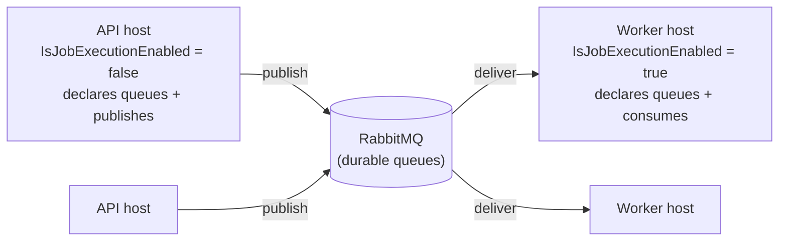

`Volo.Abp.BackgroundJobs.RabbitMQ` replaces ABP's `IBackgroundJobManager` with a broker-backed implementation that publishes each enqueue as a RabbitMQ message and consumes it on a per-args-type queue. Unlike Hangfire or Quartz, there is no shared scheduler and no central persistent store inside the app — RabbitMQ itself is the queue, the durable storage and the delivery mechanism. The framework gives you per-job-type queues, dead-letter-based delayed delivery, prefetch tuning and a `JobQueueManager` that starts one consumer per registered job at boot.

The package lives at `framework/src/Volo.Abp.BackgroundJobs.RabbitMQ/`. It depends on `Volo.Abp.BackgroundJobs.Abstractions` (for `IBackgroundJobManager`, `AbpBackgroundJobOptions`, `IBackgroundJobExecuter`, `BackgroundJobConfiguration`) and `Volo.Abp.RabbitMQ` (for `IChannelPool`, `IRabbitMqSerializer`, `QueueDeclareConfiguration`).

<Info>
  This page is only about **background jobs over RabbitMQ**. The distributed event bus over RabbitMQ (`Volo.Abp.EventBus.RabbitMQ`) is a different module — see `/eventbus/distributed-event-bus`. The two can coexist in the same host and share `IChannelPool`, but they create separate queues and consumers.
</Info>

## Topology

```mermaid
sequenceDiagram
    participant App as Application code
    participant Mgr as RabbitMqBackgroundJobManager
    participant QMgr as JobQueueManager
    participant Q as JobQueue&lt;TArgs&gt;
    participant Ch as IChannelPool
    participant MQ as RabbitMQ broker
    participant Consumer as AsyncEventingBasicConsumer
    participant Exec as IBackgroundJobExecuter

    App->>Mgr: EnqueueAsync(args, priority, delay)
    Mgr->>QMgr: GetAsync&lt;TArgs&gt;()
    QMgr->>Q: resolve singleton, StartAsync (first time)
    Q->>Ch: AcquireAsync(channelKey, connectionName)
    Q->>MQ: QueueDeclare(queue), QueueDeclare(delayedQueue)
    alt delay == null
        Q->>MQ: BasicPublish to queue
    else delay != null
        Q->>MQ: BasicPublish to delayedQueue with TTL = delay
        Note over MQ: TTL expires → dead-letters to queue
    end
    MQ->>Consumer: deliver message
    Consumer->>Exec: ExecuteAsync(JobExecutionContext)
    alt success
        Consumer->>MQ: BasicAck
    else BackgroundJobExecutionException
        Consumer->>MQ: BasicReject(requeue: true)
    else other exception
        Consumer->>MQ: BasicReject(requeue: false)
    end
```

There is one classic queue per registered `TArgs` (`AbpBackgroundJobs.<JobName>`) and one parallel delayed queue (`AbpBackgroundJobsDelayed.<JobName>`). Delayed delivery is implemented via TTL + dead-letter exchange: the producer publishes to the delayed queue with `expiration = delay`, the broker expires the message after that interval and dead-letters it onto the main queue.

## Module wiring

`framework/src/Volo.Abp.BackgroundJobs.RabbitMQ/Volo/Abp/BackgroundJobs/RabbitMQ/AbpBackgroundJobsRabbitMqModule.cs`:

```csharp
[DependsOn(
    typeof(AbpBackgroundJobsAbstractionsModule),
    typeof(AbpRabbitMqModule),
    typeof(AbpThreadingModule)
)]
public class AbpBackgroundJobsRabbitMqModule : AbpModule
{
    public override void ConfigureServices(ServiceConfigurationContext context)
    {
        context.Services.AddSingleton(typeof(IJobQueue<>), typeof(JobQueue<>));
    }

    public async override Task OnApplicationInitializationAsync(ApplicationInitializationContext context)
    {
        await context.ServiceProvider.GetRequiredService<IJobQueueManager>().StartAsync();
    }

    public async override Task OnApplicationShutdownAsync(ApplicationShutdownContext context)
    {
        await context.ServiceProvider.GetRequiredService<IJobQueueManager>().StopAsync();
    }
}
```

Notes:

1. **`IJobQueue<TArgs>` is a singleton open generic** — there is exactly one consumer per args type per host. The same instance is used by the producer (`EnqueueAsync`) and the consumer (the channel `Received` event).
2. **`JobQueueManager.StartAsync` runs during app init.** It enumerates every job from `AbpBackgroundJobOptions.GetJobs()` and starts a queue for each one. That means a job must be registered in `AbpBackgroundJobOptions` (via `AddJob<MyJob>()` or auto-discovery through `[BackgroundJobName]`) **before** `OnApplicationInitializationAsync` runs, otherwise its queue never starts.
3. **`OnApplicationShutdownAsync` calls `StopAsync` and disposes channel accessors.** This is what releases your AMQP channels back to the pool when the host stops.

## `RabbitMqBackgroundJobManager`

The replacement implementation of `IBackgroundJobManager` is a thin facade over `IJobQueueManager`:

```csharp
[Dependency(ReplaceServices = true)]
public class RabbitMqBackgroundJobManager : IBackgroundJobManager, ITransientDependency
{
    private readonly IJobQueueManager _jobQueueManager;

    public RabbitMqBackgroundJobManager(IJobQueueManager jobQueueManager)
    {
        _jobQueueManager = jobQueueManager;
    }

    public async Task<string> EnqueueAsync<TArgs>(
        TArgs args,
        BackgroundJobPriority priority = BackgroundJobPriority.Normal,
        TimeSpan? delay = null)
    {
        var jobQueue = await _jobQueueManager.GetAsync<TArgs>();
        return (await jobQueue.EnqueueAsync(args, priority, delay))!;
    }
}
```

Two facts to internalise:

- **`BackgroundJobPriority` is silently dropped.** RabbitMQ supports priority queues but neither `JobQueue<TArgs>` nor `JobQueueConfiguration` set `x-max-priority` or include the priority on the basic properties. If you need it, sub-class `JobQueue<TArgs>` and override `PublishAsync`.
- **The return value is `null`** (`!` is forcing the compiler). `JobQueue<TArgs>.EnqueueAsync` returns `Task<string?>` and the body returns `null` — there is no broker-assigned id surfaced. Callers that rely on a real handle should generate one in `TArgs` and propagate it.

## `IJobQueueManager` and `JobQueueManager`

```csharp
public interface IJobQueueManager : IRunnable
{
    Task<IJobQueue<TArgs>> GetAsync<TArgs>();
}

public class JobQueueManager : IJobQueueManager, ISingletonDependency
{
    protected ConcurrentDictionary<string, IRunnable> JobQueues { get; }
    protected SemaphoreSlim SyncSemaphore { get; }

    public async Task StartAsync(CancellationToken cancellationToken = default)
    {
        if (!Options.IsJobExecutionEnabled) return;

        foreach (var jobConfiguration in Options.GetJobs())
        {
            var jobQueue = (IRunnable)ServiceProvider
                .GetRequiredService(typeof(IJobQueue<>).MakeGenericType(jobConfiguration.ArgsType));
            await jobQueue.StartAsync(cancellationToken);
            JobQueues[jobConfiguration.JobName] = jobQueue;
        }
    }

    public async Task<IJobQueue<TArgs>> GetAsync<TArgs>()
    {
        var jobConfiguration = Options.GetJob(typeof(TArgs));

        if (JobQueues.TryGetValue(jobConfiguration.JobName, out var jobQueue))
            return (IJobQueue<TArgs>)jobQueue;

        using (await SyncSemaphore.LockAsync())
        {
            if (JobQueues.TryGetValue(jobConfiguration.JobName, out jobQueue))
                return (IJobQueue<TArgs>)jobQueue;

            jobQueue = (IJobQueue<TArgs>)ServiceProvider
                .GetRequiredService(typeof(IJobQueue<>).MakeGenericType(typeof(TArgs)));

            await jobQueue.StartAsync();
            JobQueues.TryAdd(jobConfiguration.JobName, jobQueue);

            return (IJobQueue<TArgs>)jobQueue;
        }
    }
}
```

Key behaviours:

1. **`StartAsync` is gated by `AbpBackgroundJobOptions.IsJobExecutionEnabled`.** When false, **no queues are started**, which means the host will not consume — but the publisher path still runs through `GetAsync`, which lazily starts a publisher-side queue. This is intentional and explained below.
2. **The cache key is `JobConfiguration.JobName`**, not the args type. This matches the queue name (which is derived from the job name) and means two job types sharing a `[BackgroundJobName("foo")]` will collide.
3. **`GetAsync` is double-checked under `SemaphoreSlim`.** A first cache hit avoids the lock entirely; on a miss, the semaphore serialises a single `StartAsync` per args type. The publisher-driven start path is what lets jobs that aren't pre-registered with the manager publish at runtime — though in practice they should be registered via `AbpBackgroundJobOptions.AddJob` so the consumer side starts at boot.

## `JobQueue<TArgs>`

This is where the real work happens. Stripped to its core:

```csharp
public class JobQueue<TArgs> : IJobQueue<TArgs>
{
    private const string ChannelPrefix = "JobQueue.";

    public virtual async Task<string?> EnqueueAsync(TArgs args,
        BackgroundJobPriority priority = BackgroundJobPriority.Normal, TimeSpan? delay = null)
    {
        CheckDisposed();
        using (await SyncObj.LockAsync())
        {
            await EnsureInitializedAsync();
            await PublishAsync(args, priority, delay);
            return null;
        }
    }

    protected virtual async Task EnsureInitializedAsync()
    {
        if (ChannelAccessor != null && ChannelAccessor.Channel.IsOpen) return;

        ChannelAccessor = await ChannelPool.AcquireAsync(
            ChannelPrefix + QueueConfiguration.QueueName,
            QueueConfiguration.ConnectionName);

        var result = await QueueConfiguration.DeclareAsync(ChannelAccessor.Channel);
        await QueueConfiguration.DeclareDelayedAsync(ChannelAccessor.Channel);

        if (AbpBackgroundJobOptions.IsJobExecutionEnabled)
        {
            if (QueueConfiguration.PrefetchCount.HasValue)
            {
                await ChannelAccessor.Channel.BasicQosAsync(0, QueueConfiguration.PrefetchCount.Value, false);
            }

            Consumer = new AsyncEventingBasicConsumer(ChannelAccessor.Channel);
            Consumer.ReceivedAsync += MessageReceived;

            await ChannelAccessor.Channel.BasicConsumeAsync(
                queue: QueueConfiguration.QueueName,
                autoAck: false,
                consumer: Consumer);
        }
    }

    protected virtual async Task PublishAsync(TArgs args,
        BackgroundJobPriority priority = BackgroundJobPriority.Normal, TimeSpan? delay = null)
    {
        var routingKey = QueueConfiguration.QueueName;
        var basicProperties = new BasicProperties
        {
            Persistent = true,
            CorrelationId = CorrelationIdProvider.Get()
        };

        if (delay.HasValue)
        {
            routingKey = QueueConfiguration.DelayedQueueName;
            basicProperties.Expiration = delay.Value.TotalMilliseconds.ToString(CultureInfo.InvariantCulture);
        }

        await ChannelAccessor!.Channel.BasicPublishAsync(
            exchange: "",
            routingKey: routingKey,
            mandatory: false,
            basicProperties: basicProperties,
            body: Serializer.Serialize(args!));
    }
}
```

The mental model:

1. **One channel per queue** — `IChannelPool.AcquireAsync` is called with key `JobQueue.AbpBackgroundJobs.MyJob`. Re-use across publish and consume on the same channel is intentional; AMQP serialises commands on a channel so concurrent enqueue calls hit `SyncObj` (a `SemaphoreSlim`) before reaching the channel.
2. **Persistent messages.** `BasicProperties.Persistent = true` writes messages to disk on durable queues, surviving broker restarts.
3. **Correlation ids flow through.** The current `ICorrelationIdProvider` value is stamped on the publish; the consumer (`MessageReceived`) restores it via `CorrelationIdProvider.Change(...)` so logs on both sides correlate.
4. **`BasicQosAsync(0, prefetchCount, global: false)`** is only applied when `PrefetchCount` is set on the per-job configuration (or `AbpRabbitMqBackgroundJobOptions.PrefetchCount` globally). Without it, RabbitMQ pushes the entire queue at the consumer.
5. **Producer-only mode is supported.** When `IsJobExecutionEnabled` is false, the queues are still declared and the channel is still acquired — but no `BasicConsume` is issued. This is how you split publishers and workers across hosts.

### Message receipt and ack policy

```csharp
protected virtual async Task MessageReceived(object sender, BasicDeliverEventArgs ea)
{
    using (var scope = ServiceScopeFactory.CreateScope())
    {
        var context = new JobExecutionContext(
            scope.ServiceProvider,
            JobConfiguration.JobType,
            Serializer.Deserialize(ea.Body.ToArray(), typeof(TArgs)));

        try
        {
            using (CorrelationIdProvider.Change(ea.BasicProperties.CorrelationId))
            {
                await JobExecuter.ExecuteAsync(context);
            }
            await ChannelAccessor!.Channel.BasicAckAsync(deliveryTag: ea.DeliveryTag, multiple: false);
        }
        catch (BackgroundJobExecutionException)
        {
            await ChannelAccessor!.Channel.BasicRejectAsync(deliveryTag: ea.DeliveryTag, requeue: true);
        }
        catch (Exception)
        {
            await ChannelAccessor!.Channel.BasicRejectAsync(deliveryTag: ea.DeliveryTag, requeue: false);
        }
    }
}
```

The ack policy is the most consequential design choice:

| Outcome | Action | Effect |
|---|---|---|
| Success | `BasicAck` | Message removed from queue. |
| `BackgroundJobExecutionException` | `BasicReject` with `requeue: true` | Message returned to the **head** of the same queue. |
| Any other exception | `BasicReject` with `requeue: false` | Message discarded (or routed to a DLX if you configure one). |

<Warning>
  `requeue: true` rejection places the message back at the head of the queue — there is **no delay** between retries and **no retry count**. A poison message will spin in an infinite re-delivery loop, consuming a worker. Wrap your job in a circuit-breaker or override `MessageReceived` to count retries (e.g. via a header) before deciding to ack and dead-letter.
</Warning>

`BackgroundJobExecutionException` is what `BackgroundJobExecuter` wraps the inner exception in — every "expected" job failure is requeued; only infrastructural exceptions (DI resolution, serialisation) result in `requeue: false`.

## `JobQueueConfiguration`

```csharp
public class JobQueueConfiguration : QueueDeclareConfiguration
{
    public Type JobArgsType { get; }
    public string? ConnectionName { get; set; }
    public string DelayedQueueName { get; set; }

    public JobQueueConfiguration(
        Type jobArgsType,
        string queueName,
        string delayedQueueName,
        string? connectionName = null,
        bool durable = true,
        bool exclusive = false,
        bool autoDelete = false,
        ushort? prefetchCount = null)
        : base(queueName, durable, exclusive, autoDelete, prefetchCount)
    {
        JobArgsType = jobArgsType;
        ConnectionName = connectionName;
        DelayedQueueName = delayedQueueName;
    }

    public virtual async Task<QueueDeclareOk> DeclareDelayedAsync(IChannel channel)
    {
        var delayedArguments = new Dictionary<string, object?>(Arguments)
        {
            ["x-dead-letter-routing-key"] = QueueName,
            ["x-dead-letter-exchange"] = string.Empty
        };

        return await channel.QueueDeclareAsync(
            queue: DelayedQueueName,
            durable: Durable,
            exclusive: Exclusive,
            autoDelete: AutoDelete,
            arguments: delayedArguments);
    }
}
```

This is the delayed-delivery mechanism in full:

- **Two queues, one channel.** The main queue is declared with the standard `QueueDeclareConfiguration` arguments. The delayed queue gets two extra arguments that dead-letter expired messages straight onto the main queue via the default exchange.
- **`x-dead-letter-exchange = ""`** is the default exchange; routing keys equal to a queue name go directly to that queue.
- **No `x-message-ttl` on the queue itself.** TTL is set per-message via `BasicProperties.Expiration` so each enqueue can have its own delay.
- **The default `durable = true` is critical.** A non-durable delayed queue would drop pending delays on broker restart.

If you want per-job-type queue settings (different prefetch, dedicated connection name, non-default queue name), populate `AbpRabbitMqBackgroundJobOptions.JobQueues[typeof(TArgs)]` with a custom `JobQueueConfiguration`.

## `AbpRabbitMqBackgroundJobOptions`

```csharp
public class AbpRabbitMqBackgroundJobOptions
{
    public Dictionary<Type, JobQueueConfiguration> JobQueues { get; }
    public string DefaultQueueNamePrefix { get; set; }
    public string DefaultDelayedQueueNamePrefix { get; set; }
    public ushort? PrefetchCount { get; set; }

    public AbpRabbitMqBackgroundJobOptions()
    {
        JobQueues = new Dictionary<Type, JobQueueConfiguration>();
        DefaultQueueNamePrefix = "AbpBackgroundJobs.";
        DefaultDelayedQueueNamePrefix = "AbpBackgroundJobsDelayed.";
    }
}
```

| Property | Default | Effect |
|---|---|---|
| `JobQueues` | empty | Per-args overrides. Wins over the default prefix logic. |
| `DefaultQueueNamePrefix` | `"AbpBackgroundJobs."` | Prefix for main queues when no override. |
| `DefaultDelayedQueueNamePrefix` | `"AbpBackgroundJobsDelayed."` | Prefix for delayed queues when no override. |
| `PrefetchCount` | `null` | Default consumer prefetch. Without it, RabbitMQ pushes the whole queue at the consumer. |

Setting both prefixes is the simplest way to isolate jobs from multiple applications sharing one broker:

```csharp
Configure<AbpRabbitMqBackgroundJobOptions>(options =>
{
    options.DefaultQueueNamePrefix = "OrderingApp.Jobs.";
    options.DefaultDelayedQueueNamePrefix = "OrderingApp.JobsDelayed.";
    options.PrefetchCount = 8;

    options.JobQueues[typeof(EmailSendingArgs)] = new JobQueueConfiguration(
        jobArgsType: typeof(EmailSendingArgs),
        queueName: "OrderingApp.Jobs.Email",
        delayedQueueName: "OrderingApp.JobsDelayed.Email",
        connectionName: "Notifications",
        prefetchCount: 32);
});
```

`connectionName` resolves through `Volo.Abp.RabbitMQ`'s `AbpRabbitMqOptions.Connections` — useful when you keep email and order processing on physically different brokers.

## End-to-end example

A job, its args and the call site:

```csharp
public class EmailSendingArgs
{
    public string To { get; set; } = default!;
    public string Subject { get; set; } = default!;
    public string Body { get; set; } = default!;
}

[BackgroundJobName("Email")]
public class EmailSendingJob : AsyncBackgroundJob<EmailSendingArgs>, ITransientDependency
{
    private readonly IEmailSender _emailSender;
    public EmailSendingJob(IEmailSender emailSender) => _emailSender = emailSender;

    public override async Task ExecuteAsync(EmailSendingArgs args)
    {
        await _emailSender.SendAsync(args.To, args.Subject, args.Body);
    }
}

// Composition
[DependsOn(typeof(AbpBackgroundJobsRabbitMqModule))]
public class MyHostModule : AbpModule
{
    public override void ConfigureServices(ServiceConfigurationContext context)
    {
        Configure<AbpRabbitMqOptions>(options =>
        {
            options.Connections.Default.UserName = "guest";
            options.Connections.Default.Password = "guest";
            options.Connections.Default.HostName = "rabbitmq";
            options.Connections.Default.Port = 5672;
        });
    }
}

// Call site
public class CheckoutAppService : ApplicationService
{
    private readonly IBackgroundJobManager _bgm;
    public CheckoutAppService(IBackgroundJobManager bgm) => _bgm = bgm;

    public async Task CompleteAsync(Guid orderId)
    {
        // ...
        await _bgm.EnqueueAsync(new EmailSendingArgs
        {
            To = "customer@example.com",
            Subject = "Order received",
            Body = $"Order {orderId} is on its way."
        }, delay: TimeSpan.FromMinutes(5));
    }
}
```

The host needs:

- A reachable RabbitMQ broker.
- `[BackgroundJobName]` (or `Configure<AbpBackgroundJobOptions>(o => o.AddJob<EmailSendingJob>())`) registered before `OnApplicationInitializationAsync` runs.
- `IsJobExecutionEnabled = true` (the default) for consumer startup. Set to `false` on producer-only hosts (e.g. an API tier that publishes jobs the worker tier consumes).

## Producer/consumer split

A common deployment pattern:



The flag controls whether `EnsureInitializedAsync` issues `BasicConsume`. Both sides still declare the queues, which means the API hosts and worker hosts must agree on `DefaultQueueNamePrefix` and on every `JobQueues[typeof(TArgs)]` override (including durability, autoDelete, exclusive). If the declarations diverge, RabbitMQ rejects the second declaration as a precondition failure.

## Operational checklist

<Steps>
  <Step title="Set a sensible prefetch">
    Without `PrefetchCount`, a single consumer claims the whole queue. Start with `PrefetchCount = WorkerCount * 2` and tune from there.
  </Step>
  <Step title="Add a dead-letter exchange to the main queue">
    The framework does not configure a DLX on the main queue, so messages rejected with `requeue: false` are discarded. Add `Arguments["x-dead-letter-exchange"] = "abp.deadletter"` in a custom `JobQueueConfiguration` to keep them.
  </Step>
  <Step title="Decide on retry policy">
    `requeue: true` is infinite and immediate. Override `JobQueue&lt;TArgs&gt;.MessageReceived` to count retries (via a custom header) before ack+dead-letter, or stamp `args` with `RetryCount` and short-circuit there.
  </Step>
  <Step title="Plan queue declarations on startup">
    Queues are declared lazily on first `EnsureInitializedAsync`. To pre-declare at boot (so the broker shows them before any traffic), call `IJobQueueManager.GetAsync&lt;TArgs&gt;()` for each known type during your module's init.
  </Step>
  <Step title="Mind the delayed-queue TTL granularity">
    `BasicProperties.Expiration` is milliseconds. Very short delays compete with broker delivery latency; very long delays (hours) work but the messages all sit on one queue with FIFO TTL — long messages block shorter ones queued after them.
  </Step>
</Steps>

## Interactions with other ABP subsystems

- **Distributed locking is not used.** RabbitMQ already serialises delivery per message, and ack/reject defines the failure semantics. The default `IAbpDistributedLock` is still resolvable but no part of the RabbitMQ job path consumes it. See `/background/distributed-locking`.
- **Multi-tenancy.** `JobExecutionContext` does not carry `TenantId`. Persist it in `TArgs` and switch tenants inside `ExecuteAsync` via `ICurrentTenant.Change(tenantId)`. The correlation id flows automatically.
- **Distributed event bus over RabbitMQ.** A different module entirely; both can run in the same host and share `IChannelPool`, but their queues are namespaced separately. See `/eventbus/distributed-event-bus`.
- **Background workers.** This package does **not** replace `IBackgroundWorkerManager` — only jobs. Combine it with Quartz, Hangfire or TickerQ when you also need scheduled workers. See `/background/background-workers`.

## Related pages

- `/background/overview` — full subsystem map and module composition order.
- `/background/background-jobs` — `IBackgroundJobManager`, `AbpBackgroundJobOptions`, `IBackgroundJobExecuter` contract.
- `/background/background-workers` — pair RabbitMQ jobs with a worker provider for periodic tasks.
- `/background/hangfire` — alternative provider for jobs and workers.
- `/background/quartz` — Quartz-based provider with shared scheduler for jobs and workers.
- `/background/tickerq` — TickerQ-based provider with EF Core or in-memory ticker storage.
- `/background/distributed-locking` — `IAbpDistributedLock` used by other ABP subsystems.
- `/eventbus/distributed-event-bus` — RabbitMQ as a distributed event transport.
