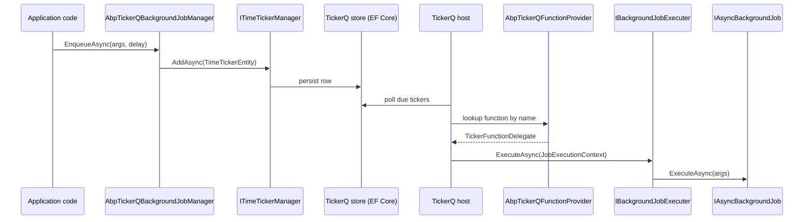

ABP integrates [TickerQ](https://tickerq.arcenox.com/) — a code-first .NET scheduler that persists time-based and cron-based "tickers" through Entity Framework Core — through three packages that mirror the Hangfire/Quartz integrations:

- `Volo.Abp.TickerQ` — base host integration. Wires `AddTickerQ`, owns the function/request-type registry and exposes the `UseAbpTickerQ` host extension.
- `Volo.Abp.BackgroundJobs.TickerQ` — replaces `IBackgroundJobManager` with `AbpTickerQBackgroundJobManager` so `EnqueueAsync` writes a `TimeTickerEntity`.
- `Volo.Abp.BackgroundWorkers.TickerQ` — replaces `IBackgroundWorkerManager` with `AbpTickerQBackgroundWorkerManager` so `AsyncPeriodicBackgroundWorkerBase` / `PeriodicBackgroundWorkerBase` instances run as TickerQ `CronTicker`s.

All three live under `framework/src/Volo.Abp.TickerQ/`, `framework/src/Volo.Abp.BackgroundJobs.TickerQ/` and `framework/src/Volo.Abp.BackgroundWorkers.TickerQ/`. Unlike Hangfire and Quartz, TickerQ has **two** ticker shapes — a one-shot `TimeTicker` (used for `EnqueueAsync`) and a recurring `CronTicker` (used for periodic workers) — and ABP funnels its background-job / background-worker abstractions into each.

## Topology



For background workers the picture is similar, except `OnPostApplicationInitializationAsync` writes a `CronTickerEntity` for each registered worker and the delegate forwards the tick to `AsyncPeriodicBackgroundWorkerBase.DoWorkAsync` via a compiled expression-tree invoker.

## `AbpTickerQModule`

`framework/src/Volo.Abp.TickerQ/Volo/Abp/TickerQ/AbpTickerQModule.cs` is intentionally tiny — it bootstraps TickerQ's DI and stamps the scheduler's `NodeIdentifier` with the ABP application name so multi-instance deployments can be distinguished in the TickerQ dashboard:

```csharp
public class AbpTickerQModule : AbpModule
{
    public override void ConfigureServices(ServiceConfigurationContext context)
    {
        context.Services.AddTickerQ(options =>
        {
            options.ConfigureScheduler(scheduler =>
            {
                scheduler.NodeIdentifier = context.Services.GetApplicationName();
            });
        });
    }
}
```

`AddTickerQ` is TickerQ's own root extension method (`TickerQ.DependencyInjection`). It registers the dispatcher, time-ticker manager and cron-ticker manager, but it does **not** start the scheduler. Starting is deferred until the host calls `UseAbpTickerQ` (see below) so ABP modules have time to populate the function registry inside `OnApplicationInitialization`.

<Note>
`AbpTickerQModule` does not configure persistence. You must install one of the TickerQ EF Core packages (e.g. `TickerQ.EntityFrameworkCore`) and call its store extension yourself; ABP only injects the abstractions.
</Note>

### `AbpTickerQFunctionProvider`

`AbpTickerQFunctionProvider` is a singleton bag that holds two dictionaries keyed by the **function name** (which is also the ABP job name or background-worker name):

```csharp
public class AbpTickerQFunctionProvider : ISingletonDependency
{
    public Dictionary<string, (string, TickerTaskPriority, TickerFunctionDelegate)> Functions { get; }
    public Dictionary<string, (string, Type)> RequestTypes { get; }
}
```

- `Functions` maps `name -> (description, priority, delegate)`. The delegate is the actual code TickerQ will invoke when the ticker fires.
- `RequestTypes` maps `name -> (typeName, type)` and lets TickerQ deserialize the JSON request stored in `TimeTickerEntity.Request` into the strongly-typed `TArgs`.

Both dictionaries are populated during `OnApplicationInitialization` of the two adapter modules and then handed to TickerQ via `TickerFunctionProvider.RegisterFunctions` / `TickerFunctionProvider.RegisterRequestType`.

### `UseAbpTickerQ`

`AbpTickerQApplicationBuilderExtensions.UseAbpTickerQ` is the bridge from ABP startup to TickerQ startup:

```csharp
public static IHost UseAbpTickerQ(this IHost app, TickerQStartMode qStartMode = TickerQStartMode.Immediate)
{
    var abpTickerQFunctionProvider = app.Services.GetRequiredService<AbpTickerQFunctionProvider>();
    TickerFunctionProvider.RegisterFunctions(abpTickerQFunctionProvider.Functions);
    TickerFunctionProvider.RegisterRequestType(abpTickerQFunctionProvider.RequestTypes);

    app.UseTickerQ(qStartMode);
    return app;
}
```

Two important details:

1. The host call must happen **after** `ApplicationInitialization` has run on all modules — otherwise the function registry is empty when TickerQ snapshots it. Calling `Initialize` on the ABP application then `UseAbpTickerQ` on the resulting `IHost` is the canonical order.
2. `TickerQStartMode.Immediate` (the default) makes the dispatcher start polling as soon as `UseTickerQ` runs. Pass `TickerQStartMode.Manual` if you want to control the lifecycle yourself (for example, to keep a CLI command from picking up jobs).

```csharp
var application = await AbpApplicationFactory.CreateAsync<MyHostModule>(...);
await application.InitializeAsync(host.Services);
host.UseAbpTickerQ();
await host.RunAsync();
```

## Background jobs — `AbpBackgroundJobsTickerQModule`

`framework/src/Volo.Abp.BackgroundJobs.TickerQ/Volo/Abp/BackgroundJobs/TickerQ/AbpBackgroundJobsTickerQModule.cs` does two things at application init: it walks every `BackgroundJobConfiguration` registered through `AbpBackgroundJobOptions` and produces a `TickerFunctionDelegate` for it; then it copies those delegates and their argument types into the singleton `AbpTickerQFunctionProvider`.

```csharp
foreach (var jobConfiguration in abpBackgroundJobOptions.Value.GetJobs())
{
    var genericMethod = GetTickerFunctionDelegateMethod.MakeGenericMethod(jobConfiguration.ArgsType);
    var tickerFunctionDelegate = (TickerFunctionDelegate)genericMethod.Invoke(null, [jobConfiguration.ArgsType])!;
    var config = abpBackgroundJobsTickerQOptions.Value.GetConfigurationOrNull(jobConfiguration.JobType);
    tickerFunctionDelegates.TryAdd(
        jobConfiguration.JobName,
        (string.Empty, config?.Priority ?? TickerTaskPriority.Normal, tickerFunctionDelegate));
    requestTypes.TryAdd(jobConfiguration.JobName, (jobConfiguration.ArgsType.FullName, jobConfiguration.ArgsType)!);
}
```

The module uses reflection (`MakeGenericMethod`) to build a strongly-typed delegate per registered job, because TickerQ's `TickerRequestProvider.GetRequestAsync<TArgs>` is generic in the argument type.

### What the delegate actually runs

`GetTickerFunctionDelegate<TArgs>` returns the closure TickerQ will invoke when a `TimeTicker` fires:

```csharp
private static TickerFunctionDelegate GetTickerFunctionDelegate<TArgs>(Type argsType)
{
    return async (cancellationToken, serviceProvider, context) =>
    {
        var options = serviceProvider.GetRequiredService<IOptions<AbpBackgroundJobOptions>>().Value;
        if (!options.IsJobExecutionEnabled)
        {
            throw new AbpException(
                "Background job execution is disabled. " +
                "This method should not be called! " +
                "If you want to enable the background job execution, " +
                $"set {nameof(AbpBackgroundJobOptions)}.{nameof(AbpBackgroundJobOptions.IsJobExecutionEnabled)} to true! " +
                "If you've intentionally disabled job execution and this seems a bug, please report it.");
        }

        using (var scope = serviceProvider.CreateScope())
        {
            var jobExecuter = serviceProvider.GetRequiredService<IBackgroundJobExecuter>();
            var args = await TickerRequestProvider.GetRequestAsync<TArgs>(context, cancellationToken);
            var jobType = options.GetJob(typeof(TArgs)).JobType;
            var jobExecutionContext = new JobExecutionContext(scope.ServiceProvider, jobType, args!, cancellationToken: cancellationToken);
            await jobExecuter.ExecuteAsync(jobExecutionContext);
        }
    };
}
```

Three things matter for coding agents:

1. The delegate checks `AbpBackgroundJobOptions.IsJobExecutionEnabled` on every fire. Producer-only services (admin sites, web fronts) should set this to `false` so a misconfigured TickerQ instance cannot accidentally drain the queue. See `/background/background-jobs` for the full split.
2. It creates its own DI scope — exactly like ABP's in-process `BackgroundJobWorker` — so each execution gets a fresh `IUnitOfWork`, current-user accessor, etc.
3. `TickerRequestProvider.GetRequestAsync<TArgs>(context, cancellationToken)` deserializes the row's stored `Request` blob into the typed args using the type ABP registered through `RequestTypes`.

### `AbpTickerQBackgroundJobManager`

`AbpTickerQBackgroundJobManager` replaces the default `IBackgroundJobManager`:

```csharp
[Dependency(ReplaceServices = true)]
public class AbpTickerQBackgroundJobManager : IBackgroundJobManager, ITransientDependency
{
    public virtual async Task<string> EnqueueAsync<TArgs>(TArgs args,
        BackgroundJobPriority priority = BackgroundJobPriority.Normal,
        TimeSpan? delay = null)
    {
        var job = Options.GetJob(typeof(TArgs));
        var timeTicker = new TimeTickerEntity
        {
            Id = Guid.NewGuid(),
            Function = job.JobName,
            ExecutionTime = delay == null ? DateTime.UtcNow : DateTime.UtcNow.Add(delay.Value),
            Request = TickerHelper.CreateTickerRequest<TArgs>(args),
        };

        var config = TickerQOptions.GetConfigurationOrNull(job.JobType);
        if (config != null)
        {
            timeTicker.Retries = config.Retries ?? timeTicker.Retries;
            timeTicker.RetryIntervals = config.RetryIntervals ?? timeTicker.RetryIntervals;
            timeTicker.RunCondition = config.RunCondition ?? timeTicker.RunCondition;
        }

        var result = await TimeTickerManager.AddAsync(timeTicker);
        return !result.IsSucceeded ? timeTicker.Id.ToString() : result.Result.Id.ToString();
    }
}
```

Notes:

- The `BackgroundJobPriority` passed by ABP callers is **ignored** here. TickerQ priority is taken from `AbpBackgroundJobsTickerQOptions` (see below) and pinned at registration time on the `Functions` entry, not per enqueue.
- `delay` is converted to an absolute UTC `ExecutionTime`. If `delay == null` the ticker fires as soon as the scheduler polls (`DateTime.UtcNow`).
- The return value is always a string GUID — either the entity's pre-assigned `Id` (if `AddAsync` failed) or the persisted id. Callers that want to cancel a job later should keep this id.
- `TickerHelper.CreateTickerRequest<TArgs>` serializes the args into TickerQ's `Request` envelope (binary-safe JSON keyed by the type registered through `RequestTypes`).

### Per-job TickerQ configuration

`AbpBackgroundJobsTickerQOptions` is a typed dictionary that lets you override TickerQ ticker metadata per job type:

```csharp
public class AbpBackgroundJobsTimeTickerConfiguration
{
    public int? Retries { get; set; }
    public int[]? RetryIntervals { get; set; }
    public TickerTaskPriority? Priority { get; set; }
    public RunCondition? RunCondition { get; set; }
}
```

Configure it inside your module:

```csharp
Configure<AbpBackgroundJobsTickerQOptions>(options =>
{
    options.AddConfiguration<EmailSendingJob>(new AbpBackgroundJobsTimeTickerConfiguration
    {
        Retries = 5,
        RetryIntervals = new[] { 30, 60, 120, 300, 600 },
        Priority = TickerTaskPriority.High,
    });
});
```

- `Retries` and `RetryIntervals` (seconds) override the defaults on `TimeTickerEntity` when `EnqueueAsync` runs.
- `Priority` is folded into `AbpTickerQFunctionProvider.Functions` at startup — it applies to every ticker for that function.
- `RunCondition` is TickerQ's expression for "only run if …" (e.g. only on a specific node, or only after a dependency completes).

If no configuration exists for the job type, defaults are used and priority falls back to `TickerTaskPriority.Normal`.

## Background workers — `AbpBackgroundWorkersTickerQModule`

`framework/src/Volo.Abp.BackgroundWorkers.TickerQ/Volo/Abp/BackgroundWorkers/TickerQ/AbpBackgroundWorkersTickerQModule.cs` wires ABP's periodic workers (`AsyncPeriodicBackgroundWorkerBase`, `PeriodicBackgroundWorkerBase`) into TickerQ as `CronTicker`s.

```csharp
[DependsOn(typeof(AbpBackgroundWorkersModule), typeof(AbpTickerQModule))]
public class AbpBackgroundWorkersTickerQModule : AbpModule
{
    public override async Task OnPostApplicationInitializationAsync(ApplicationInitializationContext context)
    {
        var abpTickerQBackgroundWorkersProvider = context.ServiceProvider.GetRequiredService<AbpTickerQBackgroundWorkersProvider>();
        var cronTickerManager = context.ServiceProvider.GetRequiredService<ICronTickerManager<CronTickerEntity>>();
        var abpBackgroundWorkersTickerQOptions = context.ServiceProvider.GetRequiredService<IOptions<AbpBackgroundWorkersTickerQOptions>>().Value;

        foreach (var backgroundWorker in abpTickerQBackgroundWorkersProvider.BackgroundWorkers)
        {
            var cronTicker = new CronTickerEntity
            {
                Function = backgroundWorker.Value.Function,
                Expression = backgroundWorker.Value.CronExpression
            };

            var config = abpBackgroundWorkersTickerQOptions.GetConfigurationOrNull(backgroundWorker.Value.WorkerType);
            if (config != null)
            {
                cronTicker.Retries = config.Retries ?? cronTicker.Retries;
                cronTicker.RetryIntervals = config.RetryIntervals ?? cronTicker.RetryIntervals;
            }

            await cronTickerManager.AddAsync(cronTicker);
        }
    }
}
```

Two observations:

- Registration happens in `OnPostApplicationInitializationAsync`, **after** `BackgroundWorkerManager.AddAsync` has been called for every worker. This ordering matters because `AbpTickerQBackgroundWorkerManager` (below) is what populates `AbpTickerQBackgroundWorkersProvider.BackgroundWorkers` — if the module ran earlier, the dictionary would be empty.
- `cronTickerManager.AddAsync` upserts the row, so restarting the application with the same worker registered does not duplicate the cron ticker.

### `AbpTickerQBackgroundWorkerManager`

`AbpTickerQBackgroundWorkerManager` extends ABP's default `BackgroundWorkerManager` and replaces it via DI:

```csharp
[Dependency(ReplaceServices = true)]
public class AbpTickerQBackgroundWorkerManager : BackgroundWorkerManager, ISingletonDependency
{
    public override async Task AddAsync(IBackgroundWorker worker, CancellationToken cancellationToken = default)
    {
        if (worker is AsyncPeriodicBackgroundWorkerBase or PeriodicBackgroundWorkerBase)
        {
            int? period = null;
            string? cronExpression = null;

            if (worker is AsyncPeriodicBackgroundWorkerBase asyncPeriodicBackgroundWorkerBase)
            {
                period = asyncPeriodicBackgroundWorkerBase.Period;
                cronExpression = asyncPeriodicBackgroundWorkerBase.CronExpression;
            }
            else if (worker is PeriodicBackgroundWorkerBase periodicBackgroundWorkerBase)
            {
                period = periodicBackgroundWorkerBase.Period;
                cronExpression = periodicBackgroundWorkerBase.CronExpression;
            }

            if (period == null && cronExpression.IsNullOrWhiteSpace())
            {
                throw new AbpException($"Both 'Period' and 'CronExpression' are not set for {worker.GetType().FullName}. You must set at least one of them.");
            }

            cronExpression = cronExpression ?? GetCron(period!.Value);
            var name = BackgroundWorkerNameAttribute.GetNameOrNull(worker.GetType()) ?? worker.GetType().FullName;

            var config = Options.GetConfigurationOrNull(ProxyHelper.GetUnProxiedType(worker));
            AbpTickerQFunctionProvider.Functions.TryAdd(name!, (string.Empty, config?.Priority ?? TickerTaskPriority.LongRunning,
                async (tickerQCancellationToken, serviceProvider, tickerFunctionContext) =>
                {
                    var workerInvoker = new AbpTickerQPeriodicBackgroundWorkerInvoker(worker, serviceProvider);
                    await workerInvoker.DoWorkAsync(tickerFunctionContext, tickerQCancellationToken);
                }));

            AbpTickerQBackgroundWorkersProvider.BackgroundWorkers.Add(name!, new AbpTickerQCronBackgroundWorker
            {
                Function = name!,
                CronExpression = cronExpression,
                WorkerType = ProxyHelper.GetUnProxiedType(worker)
            });
        }

        await base.AddAsync(worker, cancellationToken);
    }
}
```

Key behaviors:

- **Cron preferred, period accepted.** If a worker sets `CronExpression`, it is used verbatim. Otherwise the manager translates the `Period` (milliseconds) into a 5-field cron with `GetCron` (see next section).
- **Custom names.** `BackgroundWorkerNameAttribute` lets a worker override the function name. The fallback is the CLR type's `FullName`. The same string is used as the TickerQ function key, the `CronTickerEntity.Function` column and the dictionary key in `BackgroundWorkers`.
- **Default priority is `LongRunning`.** Workers are coarser than jobs, so TickerQ schedules them on its long-running pool unless `AbpBackgroundWorkersCronTickerConfiguration.Priority` overrides it.
- **Castle proxies.** `ProxyHelper.GetUnProxiedType(worker)` is used to look up the configuration so dynamic-proxy-wrapped workers still match the registered key.
- The base `BackgroundWorkerManager.AddAsync` is still called, which keeps tooling like `IBackgroundWorker.StartAsync` / `StopAsync` lifecycle hooks working as a no-op outside the TickerQ scheduler.

### Period-to-cron translation

ABP background workers historically express their cadence as a millisecond `Period`. TickerQ's `CronTicker` uses a 5-field cron expression. `GetCron` performs the conversion:

```csharp
protected virtual string GetCron(int period)
{
    var time = TimeSpan.FromMilliseconds(period);
    if (time.TotalMinutes < 1)
    {
        // Less than 1 minute — 5-field cron doesn't support seconds, so run every minute
        return "* * * * *";
    }
    if (time.TotalMinutes < 60)
    {
        var minutes = (int)Math.Round(time.TotalMinutes);
        return $"*/{minutes} * * * *";
    }
    if (time.TotalHours < 24)
    {
        var hours = (int)Math.Round(time.TotalHours);
        return $"0 */{hours} * * *";
    }
    if (time.TotalDays <= 31)
    {
        var days = (int)Math.Round(time.TotalDays);
        return $"0 0 */{days} * *";
    }
    throw new AbpException($"Cannot convert period: {period} to cron expression.");
}
```

The buckets:

| Period            | Cron emitted     | Behavior                              |
| ----------------- | ---------------- | ------------------------------------- |
| Sub-minute        | `* * * * *`      | Every minute (TickerQ has no seconds) |
| 1 to 59 minutes   | `*/N * * * *`    | Every N minutes, top of minute        |
| 1 to 23 hours     | `0 */N * * *`    | Every N hours, top of hour            |
| 1 to 31 days      | `0 0 */N * *`    | Every N days at midnight              |
| More than 31 days | throws           | Use an explicit `CronExpression`      |

<Warning>
Sub-minute `Period` values are silently rounded up to one minute. If your worker really needs to run every few seconds, do not use the TickerQ adapter — keep the in-process `AsyncPeriodicBackgroundWorkerBase` (the default `BackgroundWorkerManager`) or pick Quartz / Hangfire where sub-minute cadence is native. Also note that `GetCron` is `virtual`, so subclassing `AbpTickerQBackgroundWorkerManager` is a clean way to plug in your own cadence policy.
</Warning>

### `AbpTickerQPeriodicBackgroundWorkerInvoker`

When the cron ticker fires, TickerQ calls the delegate registered into `AbpTickerQFunctionProvider.Functions`. That delegate instantiates `AbpTickerQPeriodicBackgroundWorkerInvoker`:

```csharp
public class AbpTickerQPeriodicBackgroundWorkerInvoker
{
    private readonly Func<AsyncPeriodicBackgroundWorkerBase, PeriodicBackgroundWorkerContext, Task>? _doWorkAsyncDelegate;
    private readonly Action<PeriodicBackgroundWorkerBase, PeriodicBackgroundWorkerContext>? _doWorkDelegate;
    // ...
}
```

The invoker is interesting because `DoWorkAsync` (the override on `AsyncPeriodicBackgroundWorkerBase`) is `protected`. Rather than open the visibility on the base class, the invoker builds a compiled expression tree once per worker:

```csharp
var instanceParam = Expression.Parameter(typeof(AsyncPeriodicBackgroundWorkerBase), "worker");
var contextParam = Expression.Parameter(typeof(PeriodicBackgroundWorkerContext), "context");
var call = Expression.Call(Expression.Convert(instanceParam, workerType), method, contextParam);
var lambda = Expression.Lambda<Func<AsyncPeriodicBackgroundWorkerBase, PeriodicBackgroundWorkerContext, Task>>(call, instanceParam, contextParam);
_doWorkAsyncDelegate = lambda.Compile();
```

On each tick, `DoWorkAsync(TickerFunctionContext, CancellationToken)` builds a fresh `PeriodicBackgroundWorkerContext` over the scoped TickerQ `ServiceProvider` and dispatches to the compiled delegate. The same pattern (with `Action`/`DoWork`) is used for the synchronous `PeriodicBackgroundWorkerBase`.

Effects worth knowing:

- Each tick gets a fresh scope from TickerQ — the worker's `DoWorkAsync` overload should resolve its dependencies from `context.ServiceProvider`, not from constructor injection.
- The `TickerFunctionContext` is **not** passed into the worker. If your worker needs to access TickerQ metadata (retry count, ticker id), subclass `AbpTickerQPeriodicBackgroundWorkerInvoker` and stash it on a `IServiceProviderAccessor`-style scoped service.

### Per-worker TickerQ configuration

`AbpBackgroundWorkersTickerQOptions` mirrors the job-side options, with one less field (there is no `RunCondition` on cron tickers in the current adapter):

```csharp
public class AbpBackgroundWorkersCronTickerConfiguration
{
    public int? Retries { get; set; }
    public int[]? RetryIntervals { get; set; }
    public TickerTaskPriority? Priority { get; set; }
}
```

```csharp
Configure<AbpBackgroundWorkersTickerQOptions>(options =>
{
    options.AddConfiguration<CleanupExpiredTokensWorker>(new AbpBackgroundWorkersCronTickerConfiguration
    {
        Retries = 3,
        RetryIntervals = new[] { 60, 300, 900 },
        Priority = TickerTaskPriority.LongRunning,
    });
});
```

`Retries` and `RetryIntervals` are written onto the `CronTickerEntity` at startup. `Priority` is folded into the `Functions` entry and so applies to every tick.

## End-to-end registration

Putting everything together, a host that uses TickerQ for both background jobs and workers typically looks like this:

```csharp
[DependsOn(
    typeof(AbpBackgroundJobsTickerQModule),
    typeof(AbpBackgroundWorkersTickerQModule),
    typeof(AbpEntityFrameworkCoreSqlServerModule)
)]
public class MyHostModule : AbpModule
{
    public override void ConfigureServices(ServiceConfigurationContext context)
    {
        Configure<AbpBackgroundJobsTickerQOptions>(options =>
        {
            options.AddConfiguration<EmailSendingJob>(new AbpBackgroundJobsTimeTickerConfiguration
            {
                Retries = 5,
                Priority = TickerTaskPriority.High,
            });
        });

        // Configure TickerQ persistence (EF Core store) — provided by TickerQ itself
        context.Services.AddDbContext<MyTickerQDbContext>(opts => /* ... */);
        context.Services.AddTickerQEfCoreOperationalStore<MyTickerQDbContext>();
    }
}
```

And the host bootstrap:

```csharp
var builder = WebApplication.CreateBuilder(args);
await builder.AddApplicationAsync<MyHostModule>();
var app = builder.Build();
await app.InitializeApplicationAsync();
app.UseAbpTickerQ();
await app.RunAsync();
```

`InitializeApplicationAsync` runs every module's `OnApplicationInitialization` / `OnPostApplicationInitializationAsync`, which is what populates `AbpTickerQFunctionProvider` (jobs) and writes the `CronTickerEntity` rows (workers). `UseAbpTickerQ` then registers the function table with TickerQ and starts the scheduler.

## Comparison with other schedulers

<CardGroup cols={3}>
  <Card title="In-process" icon="microchip">
    `BackgroundJobWorker` polls `IBackgroundJobStore` and uses `IAbpDistributedLock` so only one node drains the queue. No external scheduler.
  </Card>
  <Card title="Hangfire" icon="fire">
    Replaces both managers with Hangfire-backed implementations. Recurring jobs and dashboard come for free. See `/background/hangfire`.
  </Card>
  <Card title="Quartz" icon="clock">
    Uses Quartz triggers for periodic workers and Quartz jobs for `EnqueueAsync`. See `/background/quartz`.
  </Card>
</CardGroup>

TickerQ's distinguishing traits compared with the others:

- **EF Core native.** The ticker store is just another DbContext, so it lives in the same database as your domain data and participates in the same migrations pipeline.
- **Two-shape model.** `TimeTicker` (one-shot, with `RunCondition`) is a much better match for ABP background jobs than Hangfire's `BackgroundJob.Schedule`, which always treats delay as a wall-clock offset. `RunCondition` lets you gate a queued job on external state without polling.
- **No dashboard yet.** TickerQ ships a dashboard, but the ABP adapter does not wire it into the ABP UI module pipeline; you must mount it manually if needed.
- **Coarser cron resolution.** TickerQ uses standard 5-field cron, so sub-minute workers are forced up to one minute.

## Gotchas for coding agents

<AccordionGroup>
  <Accordion title="The function registry must be populated before UseAbpTickerQ">
    `UseAbpTickerQ` snapshots `AbpTickerQFunctionProvider` into TickerQ's static `TickerFunctionProvider`. Adding jobs or workers after `UseTickerQ` runs will not register them with the scheduler. Always finish ABP initialization (`InitializeApplicationAsync`) before calling `UseAbpTickerQ`.
  </Accordion>
  <Accordion title="BackgroundJobPriority is ignored at enqueue time">
    `AbpTickerQBackgroundJobManager.EnqueueAsync` discards the `BackgroundJobPriority` parameter — TickerQ's priority is fixed at registration time. If you need per-call prioritization, configure separate job types or override the manager.
  </Accordion>
  <Accordion title="Sub-minute Period collapses to one minute">
    `GetCron` returns `"* * * * *"` for any `Period` under 60 seconds. If your worker assumes a 5-second cadence, it will silently slow to one-minute ticks. Switch schedulers or override `GetCron`.
  </Accordion>
  <Accordion title="IsJobExecutionEnabled is checked per tick">
    The job delegate throws if `AbpBackgroundJobOptions.IsJobExecutionEnabled` is `false`. Web fronts that should only enqueue need to set this on their module and run TickerQ workers in a separate consumer process.
  </Accordion>
  <Accordion title="Worker DI scope is owned by TickerQ">
    The `serviceProvider` passed to the worker delegate is TickerQ's per-tick scope. Inside `DoWorkAsync`, resolve scoped services from `PeriodicBackgroundWorkerContext.ServiceProvider`, not from the worker's constructor.
  </Accordion>
</AccordionGroup>

## Related references

- `/background/background-jobs` — the `IBackgroundJobManager` / `IBackgroundJobExecuter` contracts that this module plugs into.
- `/background/background-workers` — `AsyncPeriodicBackgroundWorkerBase` and the worker lifecycle that `AbpTickerQBackgroundWorkerManager` adapts.
- `/background/hangfire` and `/background/quartz` — alternative scheduler integrations with the same shape of replacements.
- `/background/distributed-locking` — used by the default in-process `BackgroundJobWorker` to prevent multiple consumers; TickerQ does its own coordination through the database, so the lock is not consulted here.
