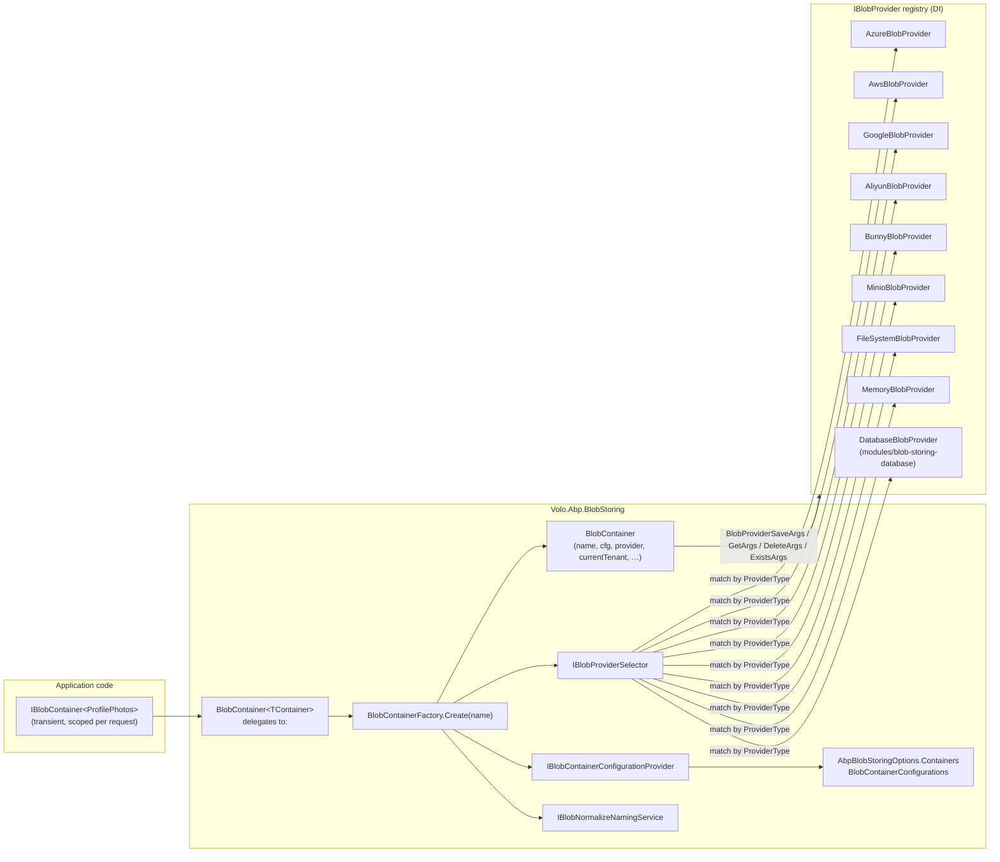

ABP's BLOB stack is a thin, provider-agnostic abstraction over "named container holding name → byte-stream entries". The whole core is in `framework/src/Volo.Abp.BlobStoring/Volo/Abp/BlobStoring/` and only adds three concepts on top of `IBlobProvider`:

1. **`IBlobContainer<TContainer>`** — typed handle injected into app code.
2. **`BlobContainerConfiguration`** — per-container settings (which provider, multi-tenancy, naming normalisers, provider-specific properties).
3. **`IBlobProviderSelector`** — picks the matching `IBlobProvider` registered in DI based on the configuration's `ProviderType`.

Provider packages (`Azure`, `Aws`, …) supply one `IBlobProvider` and a fluent `UseXxx(...)` extension method that fills in the configuration.

## File map (core)

| File | Role |
| --- | --- |
| `AbpBlobStoringModule.cs` | Registers `IBlobContainer<TContainer>` → `BlobContainer<TContainer>` (transient) and the default `IBlobContainer` → `IBlobContainer<DefaultContainer>`. |
| `AbpBlobStoringOptions.cs` | Holds `Containers : BlobContainerConfigurations`. |
| `BlobContainerConfigurations.cs` | Dictionary of per-container `BlobContainerConfiguration` keyed by name. `Configure<T>` / `Configure(name)` / `ConfigureDefault` / `ConfigureAll`. |
| `BlobContainerConfiguration.cs` | One container's settings: `ProviderType`, `IsMultiTenant`, `NamingNormalizers`, fallback container, opaque `_properties` bag used by `UseXxx(...)`. |
| `BlobContainerConfigurationExtensions.cs` | `GetConfiguration<T>(name)` / `GetConfiguration(name)` over the properties bag. |
| `BlobContainerNameAttribute.cs` | Names containers; defaults to `Type.FullName`. |
| `DefaultContainer.cs` | The fallback `[BlobContainerName("default")]` class used when you inject the non-generic `IBlobContainer`. |
| `IBlobContainer.cs` / `BlobContainer.cs` | `SaveAsync` / `GetAsync` / `GetOrNullAsync` / `DeleteAsync` / `ExistsAsync`. The non-generic `BlobContainer` is the runtime instance built by the factory; `BlobContainer<T>` is the DI-friendly wrapper. |
| `BlobContainerExtensions.cs` | `byte[]` shortcuts: `SaveAsync(byte[])`, `GetAllBytesAsync`, `GetAllBytesOrNullAsync`. |
| `IBlobContainerFactory.cs` / `BlobContainerFactory.cs` | `Create(name)` — resolves configuration, selects provider, returns a `BlobContainer`. Transient. |
| `IBlobContainerConfigurationProvider.cs` / `DefaultBlobContainerConfigurationProvider.cs` | Walks `AbpBlobStoringOptions.Containers`. |
| `IBlobProvider.cs` / `BlobProviderBase.cs` | Provider contract — four methods: `SaveAsync`, `DeleteAsync`, `ExistsAsync`, `GetOrNullAsync`. |
| `BlobProviderArgs.cs` + `BlobProviderGetArgs.cs` / `BlobProviderSaveArgs.cs` / `BlobProviderDeleteArgs.cs` / `BlobProviderExistsArgs.cs` | The args bundles passed to providers — container name, configuration, blob name, cancellation token, and for save: stream + `OverrideExisting`. |
| `IBlobProviderSelector.cs` / `DefaultBlobProviderSelector.cs` | Resolves an `IBlobProvider` whose runtime type matches `BlobContainerConfiguration.ProviderType` (uses `ProxyHelper.GetUnProxiedType` to handle DynamicProxy interception). |
| `IBlobNamingNormalizer.cs` | Provider-supplied container/blob name sanitiser. |
| `IBlobNormalizeNamingService.cs` / `BlobNormalizeNamingService.cs` / `BlobNormalizeNaming.cs` | Resolves the normalisers configured for a container (`BlobContainerConfiguration.NamingNormalizers`) inside a DI scope and applies them. |
| `BlobAlreadyExistsException.cs` | Thrown when `Save` is called without `overrideExisting: true` for an existing blob. |

## Component model



## Containers and the `[BlobContainerName]` attribute

A "container" is identified by a string name. To get a typed handle, define an empty class and inject `IBlobContainer<MyContainer>`:

```csharp
[BlobContainerName("profile-photos")]
public class ProfilePhotosContainer { }

public class UserPhotoAppService
{
    private readonly IBlobContainer<ProfilePhotosContainer> _photos;

    public UserPhotoAppService(IBlobContainer<ProfilePhotosContainer> photos) => _photos = photos;

    public Task SaveAsync(string fileName, byte[] bytes) =>
        _photos.SaveAsync(fileName, bytes, overrideExisting: true);
}
```

`BlobContainerNameAttribute.GetContainerName(Type)` returns the attribute's `Name` if present, otherwise `type.FullName`. The factory uses this string in two places: as the dictionary key into `BlobContainerConfigurations`, and as the value passed to the provider in `BlobProviderArgs.ContainerName` (i.e. the eventual bucket / file path segment).

The non-generic `IBlobContainer` injection resolves to `IBlobContainer<DefaultContainer>` (registered explicitly in `AbpBlobStoringModule`); `[BlobContainerName("default")] class DefaultContainer`.

## `AbpBlobStoringOptions.Containers`

`BlobContainerConfigurations` keeps a private `Dictionary<string, BlobContainerConfiguration>` seeded with one entry for `DefaultContainer`. Three configuration entry points:

| Method | Effect |
| --- | --- |
| `ConfigureDefault(Action<BlobContainerConfiguration>)` | Mutates the entry for `default`. Acts as fallback for any container without a specific entry — `Configure(name)` creates new entries with this default as their `_fallbackConfiguration`, so unset properties cascade. |
| `Configure<TContainer>(Action<BlobContainerConfiguration>)` | Creates or finds the entry keyed by `BlobContainerNameAttribute.GetContainerName<TContainer>()` and runs the action. The new entry's fallback is the default container. |
| `Configure(string name, Action<BlobContainerConfiguration>)` | Same but by raw name string. |

Cascade example:

```csharp
Configure<AbpBlobStoringOptions>(o =>
{
    o.Containers.ConfigureDefault(c =>
    {
        c.UseFileSystem(fs => fs.BasePath = "C:/app/blobs");  // all unmatched containers
    });

    o.Containers.Configure<ProfilePhotosContainer>(c =>
    {
        c.UseAzure(az =>
        {
            az.ConnectionString = config["Azure:Blob:ConnectionString"];
            az.ContainerName = "profile-photos";
            az.CreateContainerIfNotExists = true;
        });
    });
});
```

`DefaultBlobContainerConfigurationProvider.Get(name)` returns `Containers.GetConfiguration(name)`, which returns the matched entry **or** the default if no entry exists for `name`.

## `BlobContainerConfiguration` — properties bag

`BlobContainerConfiguration` exposes only three first-class properties:

| Property | Default | Purpose |
| --- | --- | --- |
| `ProviderType` | `null` | The CLR type of the `IBlobProvider` implementation (e.g. `typeof(AzureBlobProvider)`). Set by `UseXxx(...)` extension methods. The selector throws if null. |
| `IsMultiTenant` | `true` | When `true`, `BlobContainer` snapshots the current tenant id (`ICurrentTenant.Id`) on every call; providers' name calculators read it to scope blobs per tenant. When `false`, blobs are global even in a multi-tenant app. |
| `NamingNormalizers` | empty `TypeList<IBlobNamingNormalizer>` | Normalisers that mangle container/blob names to fit provider constraints (lowercase, length, character class). Filled by `UseXxx(...)`. |

Everything else — `Azure.ConnectionString`, `Aws.Region`, `FileSystem.BasePath`, `Minio.EndPoint`, … — lives in an internal `Dictionary<string, object?> _properties`, fetched through `GetConfigurationOrNull`/`GetConfigurationOrDefault<T>` with cascading lookup into `_fallbackConfiguration`. Each provider package ships:

- A `XxxBlobProviderConfigurationNames` static class with the dotted keys (`"Azure.ConnectionString"`, …).
- A `XxxBlobProviderConfiguration` typed view with C# properties that read/write the bag.
- A `XxxBlobContainerConfigurationExtensions` static class with `GetXxxConfiguration()` (returns the view) and `UseXxx(action)` (sets `ProviderType`, registers the naming normaliser, runs the action).

## `IBlobContainerFactory` and the runtime `BlobContainer`

`BlobContainerFactory.Create(name)` does three things on every call (it's `ITransientDependency`):

```csharp
public virtual IBlobContainer Create(string name)
{
    var configuration = ConfigurationProvider.Get(name);

    return new BlobContainer(
        name,
        configuration,
        ProviderSelector.Get(name),
        CurrentTenant,
        CancellationTokenProvider,
        BlobNormalizeNamingService,
        ServiceProvider);
}
```

The constructed `BlobContainer` then services `SaveAsync` / `GetAsync` / etc. by:

1. Wrapping the call in `using (CurrentTenant.Change(GetTenantIdOrNull()))` — `GetTenantIdOrNull()` returns `null` when `IsMultiTenant == false`, otherwise the current tenant. This pins the tenant scope for the duration of the provider call so name calculators see a stable id.
2. Calling `BlobNormalizeNamingService.NormalizeNaming(Configuration, ContainerName, name)` to produce the final `(ContainerName, BlobName)` pair using the registered `IBlobNamingNormalizer`s.
3. Building the corresponding `BlobProviderArgs` subclass and calling the provider.

Note that `GetAsync` throws `AbpException` if `GetOrNullAsync` returns null — use `GetOrNullAsync` when the blob may be absent.

## `BlobProviderArgs` hierarchy

```csharp
public abstract class BlobProviderArgs
{
    public string ContainerName { get; }
    public BlobContainerConfiguration Configuration { get; }
    public string BlobName { get; }
    public CancellationToken CancellationToken { get; }
}

public class BlobProviderSaveArgs   : BlobProviderArgs { public Stream BlobStream { get; } public bool OverrideExisting { get; } }
public class BlobProviderGetArgs    : BlobProviderArgs { }
public class BlobProviderDeleteArgs : BlobProviderArgs { }
public class BlobProviderExistsArgs : BlobProviderArgs { }
```

Providers receive everything they need on `args.Configuration` — they call `args.Configuration.GetAzureConfiguration()` (or `GetAwsConfiguration()`, etc.) to read provider-specific settings. This keeps the provider stateless across containers; each call is fully described by its args.

## Provider selection

`DefaultBlobProviderSelector.Get(containerName)`:

```csharp
var configuration = ConfigurationProvider.Get(containerName);

if (!BlobProviders.Any())
    throw new AbpException("No BLOB Storage provider was registered! …");

if (configuration.ProviderType == null)
    throw new AbpException("No BLOB Storage provider was used! …");

foreach (var provider in BlobProviders)
{
    if (ProxyHelper.GetUnProxiedType(provider).IsAssignableTo(configuration.ProviderType))
        return provider;
}

throw new AbpException(
    $"Could not find the BLOB Storage provider with the type ({configuration.ProviderType.AssemblyQualifiedName}) …");
```

Two corollaries:

- **Multiple providers can be registered simultaneously** (it's an `IEnumerable<IBlobProvider>`). Different containers can target different providers without any further wiring.
- The selector uses `ProxyHelper.GetUnProxiedType(provider)` to look through DynamicProxy interceptors, so audit/interception around providers still works.

## Naming normalisation

Cloud providers each have different naming rules (Azure: lowercase + dashes, 3-63 chars; S3: lowercase + dots + dashes; GCS: lowercase + dashes + underscores + dots, no `goog` prefix; Bunny: lowercase + dashes, globally unique; FileSystem: no `: * ? " < > |` on Windows). Each provider's `UseXxx` extension does:

```csharp
containerConfiguration.NamingNormalizers.TryAdd<XxxBlobNamingNormalizer>();
```

`BlobNormalizeNamingService.NormalizeNaming(cfg, containerName, blobName)`:

- Returns the inputs unchanged if `cfg.NamingNormalizers` is empty.
- Otherwise opens a DI scope and resolves each normaliser type as `IBlobNamingNormalizer`, applying `NormalizeContainerName` and `NormalizeBlobName` in registration order.

The `BlobContainer` uses this on every operation, so the provider always receives a name guaranteed to match the cloud service's rules even if your domain logic used a human-friendly form.

## Multi-tenancy and per-tenant routing

`BlobContainer.GetTenantIdOrNull()` reads `CurrentTenant.Id` only when `Configuration.IsMultiTenant`. Providers themselves don't usually inspect the tenant directly — they get it through a name calculator service registered by each provider package:

- `IAzureBlobNameCalculator` / `DefaultAzureBlobNameCalculator` → `host/{blob}` or `tenants/{tenantId:D}/{blob}`.
- `IAwsBlobNameCalculator`, `IGoogleBlobNameCalculator`, `IAliyunBlobNameCalculator`, `IMinioBlobNameCalculator`, `IBunnyBlobNameCalculator` — same shape.
- `IBlobFilePathCalculator` for the file-system provider — appends `host` or `tenants/{tenantId:D}` to `BasePath`.
- `MemoryBlobProvider.GetCacheKey` — `$"{CurrentTenant.Id}_{blobName}_{containerName}"`.

Setting `IsMultiTenant = false` skips the tenant change in `BlobContainer` and therefore makes the per-tenant prefix collapse to "host" — useful for shared static assets in a multi-tenant deployment.

See [Connection string resolver](/multitenancy/connection-string-resolver) for the analogous concept on the data side; BLOB configurations don't currently route through it — different containers can target different physical stores, but a single container points at a single configured backend regardless of tenant.

## Provider catalog

| Provider | Package | Page |
| --- | --- | --- |
| Azure Blob Storage | `Volo.Abp.BlobStoring.Azure` | [Azure Blob](/blob/azure-blob) |
| AWS S3 (and STS temporary credentials) | `Volo.Abp.BlobStoring.Aws` | [AWS S3](/blob/aws-s3) |
| Google Cloud Storage | `Volo.Abp.BlobStoring.Google` | [GCS](/blob/google-cloud-storage) |
| Aliyun OSS (+ STS) | `Volo.Abp.BlobStoring.Aliyun` | [Aliyun OSS](/blob/aliyun-oss) |
| Bunny CDN Edge Storage | `Volo.Abp.BlobStoring.Bunny` | [Bunny CDN](/blob/bunny-cdn) |
| MinIO (S3-compatible) | `Volo.Abp.BlobStoring.Minio` | [MinIO](/blob/minio) |
| Local file system | `Volo.Abp.BlobStoring.FileSystem` | [File system](/blob/file-system) |
| In-process memory | `Volo.Abp.BlobStoring.Memory` | [Memory](/blob/memory) |
| Database (EF Core / Mongo) | `Volo.Abp.BlobStoring.Database` (module) | [Database BLOB provider](/modules/blob-storing-database) |

## Cross-references

- [Caching overview](/caching/overview) — AWS / Aliyun / Bunny providers depend on `AbpCachingModule` to cache temporary credentials.
- [Connection string resolver](/multitenancy/connection-string-resolver) — not used here, but conceptually analogous for per-tenant data routing.
- [Database BLOB provider](/modules/blob-storing-database) — the module-side `DatabaseBlobProvider`.
