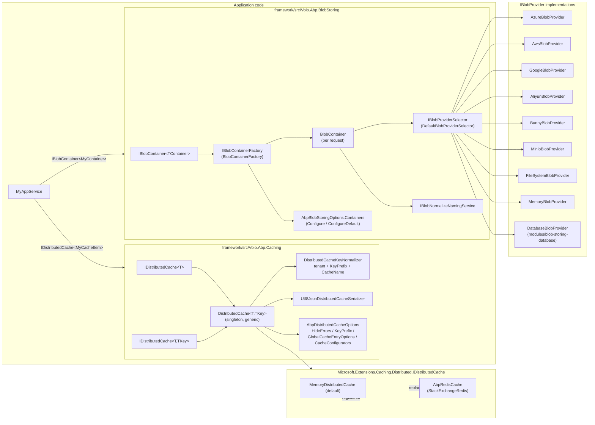

ABP groups two unrelated cross-cutting concerns under the same Wiki section because applications need both at the persistence boundary: small structured data that must be fast (the **distributed cache**) and arbitrarily large binary content that must be durable (the **BLOB store**).

- **Caching** is built on top of `Microsoft.Extensions.Caching.Distributed.IDistributedCache` and adds: typed `IDistributedCache<TCacheItem>`, multi-tenant key prefixing, JSON serialisation, sliding/absolute expiration configuration per cache, unit-of-work-aware reads/writes, and `GetOrAdd*` factory helpers. The provider is pluggable — `AbpCachingModule` registers `AddDistributedMemoryCache()` by default and the Redis package replaces it.
- **BLOB storing** is its own pluggable abstraction: `IBlobContainer` over `IBlobProvider`, picked by `IBlobProviderSelector` from the `ProviderType` set on a `BlobContainerConfiguration`. Each container can target a different physical store; multi-tenancy is built into the container, not the provider.

<Info>
  Entry points: `framework/src/Volo.Abp.Caching/Volo/Abp/Caching/AbpCachingModule.cs` and `framework/src/Volo.Abp.BlobStoring/Volo/Abp/BlobStoring/AbpBlobStoringModule.cs`.
</Info>

## Component layers

The two stacks intersect in three places worth knowing:

1. **AWS, Aliyun and Bunny providers depend on `AbpCachingModule`** — they cache STS / storage-zone credentials in `IDistributedCache<…CacheItem>` to avoid re-issuing tokens on every request.
2. Both stacks use **`ICurrentTenant`** to scope storage: caches prepend `t:{tenantId}` to the key (unless the cache item is `[IgnoreMultiTenancy]`), containers route into per-tenant sub-paths via name calculators when `BlobContainerConfiguration.IsMultiTenant` is `true` (the default).
3. Connection strings for both come from `IConnectionStringResolver` (see [Connection string resolver](/multitenancy/connection-string-resolver)) only indirectly — Caching reads `Redis:Configuration` straight from `IConfiguration`, and BLOB providers read connection info from each container's `BlobContainerConfiguration` properties.

## Caching packages

| Package | Folder | Purpose |
| --- | --- | --- |
| `Volo.Abp.Caching` | `framework/src/Volo.Abp.Caching` | Core abstractions — `IDistributedCache<T>`, `DistributedCache<T,TKey>`, options, key normaliser, JSON serializer, UoW-aware cache items, and the hybrid cache wrapper. Registers a `MemoryDistributedCache` by default. |
| `Volo.Abp.Caching.StackExchangeRedis` | `framework/src/Volo.Abp.Caching.StackExchangeRedis` | Replaces the `IDistributedCache` registration with `AbpRedisCache` (subclass of `RedisCache`) that adds `ICacheSupportsMultipleItems` pipelined multi-key Get/Set/Refresh/Remove. |

See [Distributed cache](/caching/distributed-cache) for the typed API and [Redis](/caching/redis) for the provider.

## BLOB storing packages

| Package | Folder | Provider type | SDK dependency |
| --- | --- | --- | --- |
| `Volo.Abp.BlobStoring` | `framework/src/Volo.Abp.BlobStoring` | — (abstractions) | — |
| `Volo.Abp.BlobStoring.Azure` | `…BlobStoring.Azure` | `AzureBlobProvider` | `Azure.Storage.Blobs` |
| `Volo.Abp.BlobStoring.Aws` | `…BlobStoring.Aws` | `AwsBlobProvider` | `AWSSDK.S3`, `AWSSDK.SecurityToken` |
| `Volo.Abp.BlobStoring.Google` | `…BlobStoring.Google` | `GoogleBlobProvider` | `Google.Cloud.Storage.V1` |
| `Volo.Abp.BlobStoring.Aliyun` | `…BlobStoring.Aliyun` | `AliyunBlobProvider` | `Aliyun.OSS.SDK`, `aliyun-net-sdk-sts` |
| `Volo.Abp.BlobStoring.Bunny` | `…BlobStoring.Bunny` | `BunnyBlobProvider` | `BunnyCDN.Net.Storage` + Bunny REST API |
| `Volo.Abp.BlobStoring.Minio` | `…BlobStoring.Minio` | `MinioBlobProvider` | `Minio` |
| `Volo.Abp.BlobStoring.FileSystem` | `…BlobStoring.FileSystem` | `FileSystemBlobProvider` | local disk + `Polly` |
| `Volo.Abp.BlobStoring.Memory` | `…BlobStoring.Memory` | `MemoryBlobProvider` | in-process `ConcurrentDictionary` |
| `Volo.Abp.BlobStoring.Database` | `modules/blob-storing-database/src/` | `DatabaseBlobProvider` | EF Core / Mongo (see [Database BLOB provider](/modules/blob-storing-database)) |

All provider modules `[DependsOn(typeof(AbpBlobStoringModule))]`. The AWS, Aliyun and Bunny modules additionally `DependsOn(typeof(AbpCachingModule))` so they can cache short-lived credentials.

<Tip>
  You can mix providers in the same app: e.g. set `ConfigureDefault` to `UseFileSystem(...)` for the catch-all container, then `Configure<ProfilePhotosContainer>(c =&gt; c.UseAzure(...))` for the typed one. The selector walks `BlobContainerConfiguration.ProviderType` per container.
</Tip>

## What to read next

- [Distributed cache](/caching/distributed-cache) — `IDistributedCache<TCacheItem[, TCacheKey]>`, UoW behaviour, `CacheNameAttribute`, key normalisation.
- [Redis](/caching/redis) — `AbpRedisCache`, instance prefix, `Redis:IsEnabled`/`Redis:Configuration`.
- [BLOB storing overview](/blob/blob-storing-overview) — `IBlobContainer`, `BlobContainerConfiguration`, naming normalisers, provider selection.
- Provider-specific pages: [Azure](/blob/azure-blob), [AWS S3](/blob/aws-s3), [Google Cloud Storage](/blob/google-cloud-storage), [Aliyun OSS](/blob/aliyun-oss), [Bunny CDN](/blob/bunny-cdn), [MinIO](/blob/minio), [file system](/blob/file-system), [memory](/blob/memory).
