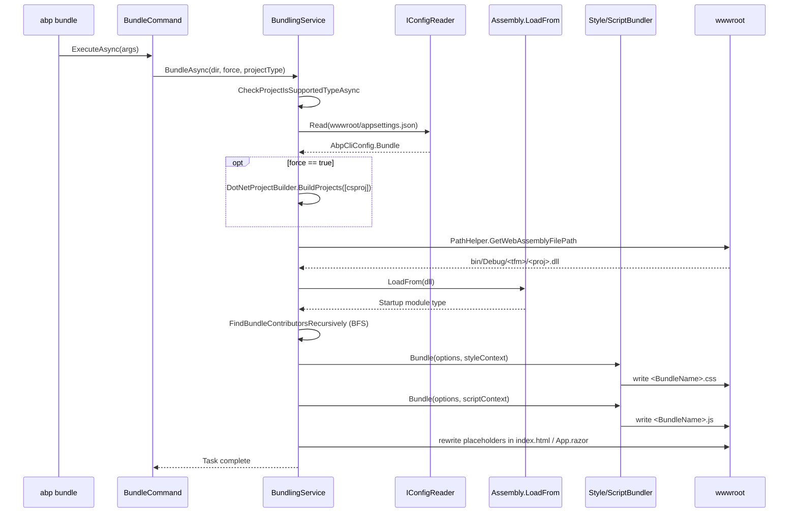
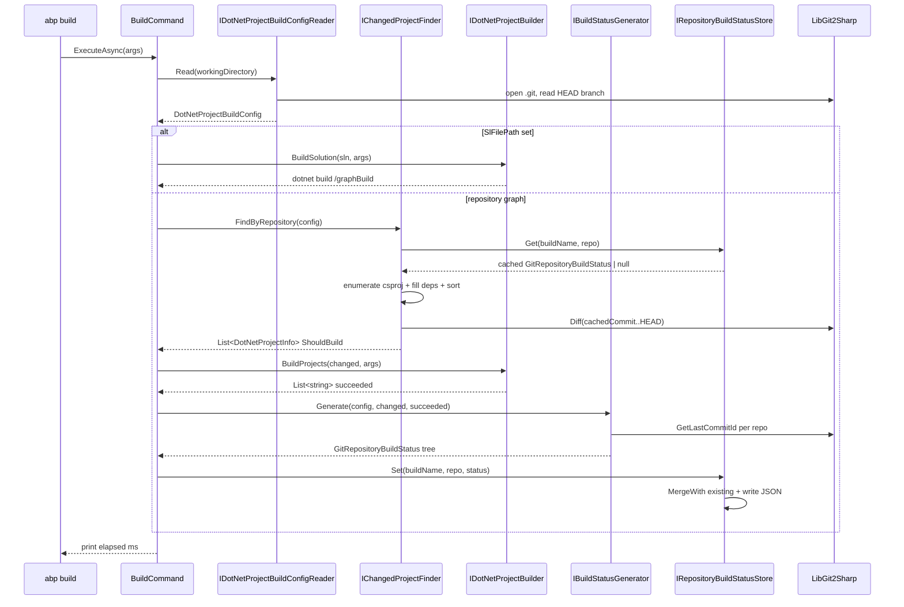

The `abp bundle` and `abp build` commands sit on top of two parallel subsystems inside `Volo.Abp.Cli.Core`: the `Bundling/` namespace, which walks Blazor module graphs and stitches together CSS and JavaScript from every `IBundleContributor` into a single bundle file in `wwwroot`; and the `Build/` namespace, which crawls one or more git repositories, computes a topologically sorted list of `.csproj` files, builds only what changed since the last successful run, and persists per-commit build status on disk. Both commands are implemented as `IConsoleCommand` + `ITransientDependency` classes — they parse `CommandLineArgs`, delegate to a service interface, and never do filesystem work directly themselves.

This page documents both pipelines end-to-end with the exact types, paths, and switches used by the source.

<CardGroup cols={2}>
  <Card title="Bundle pipeline" icon="layer-group" href="#abp-bundle">
    `BundleCommand` → `IBundlingService` → `IStyleBundler` + `IScriptBundler`. Targets Blazor WebAssembly and MAUI Blazor projects.
  </Card>
  <Card title="Build pipeline" icon="hammer" href="#abp-build">
    `BuildCommand` → config reader → changed-project finder → builder → status store. Targets git-tracked dotnet repositories.
  </Card>
</CardGroup>

## abp bundle

`BundleCommand` (`framework/src/Volo.Abp.Cli.Core/Volo/Abp/Cli/Commands/BundleCommand.cs`) is registered as `Name = "bundle"`. Its `ExecuteAsync` method does three things and then hands off to `IBundlingService.BundleAsync`:

1. Reads the working directory from `-wd|--working-directory`, defaulting to `Directory.GetCurrentDirectory()`.
2. Reads `-f|--force` as a bool flag.
3. Resolves `-t|--project-type` against `BundlingConsts.WebAssembly` (`"webassembly"`) or `BundlingConsts.MauiBlazor` (`"maui-blazor"`), throwing `CliUsageException` for any other value.

```csharp BundleCommand.ExecuteAsync (abridged)
var workingDirectory = workingDirectoryArg ?? Directory.GetCurrentDirectory();
var forceBuild = commandLineArgs.Options.ContainsKey(Options.ForceBuild.Short) ||
                 commandLineArgs.Options.ContainsKey(Options.ForceBuild.Long);
var projectType = GetProjectType(commandLineArgs);

if (!Directory.Exists(workingDirectory))
{
    throw new CliUsageException("Specified directory does not exist." + ...);
}

await BundlingService.BundleAsync(workingDirectory, forceBuild, projectType);
```

### Flags

| Short | Long                  | Default       | Effect                                                                                  |
| ----- | --------------------- | ------------- | --------------------------------------------------------------------------------------- |
| `-wd` | `--working-directory` | cwd           | Directory containing the Blazor `.csproj`. Must exist or `CliUsageException` is thrown. |
| `-f`  | `--force`             | `false`       | Forces a `dotnet build` of the project before reading assets.                            |
| `-t`  | `--project-type`      | `webassembly` | One of `webassembly` or `maui-blazor`. Anything else fails with an invalid-option error. |

<Note>
The MAUI Blazor branch is skipped on OSX. `BundlingService.BundleAsync` checks `RuntimeInformation.IsOSPlatform(OSPlatform.OSX)` and logs `"ABP bundle command does not support OSX for MAUI Blazor"` before returning.
</Note>

### BundlingService walkthrough

`BundlingService : IBundlingService` is the orchestrator. Its dependencies (all property-injected) are:

- `IDotNetProjectBuilder DotNetProjectBuilder` — invoked only when `forceBuild` is true.
- `IJavascriptMinifier JsMinifier`, `ICssMinifier CssMinifier` — actual minification happens inside `BundlerBase`.
- `IScriptBundler ScriptBundler`, `IStyleBundler StyleBundler` — emit the bundle file and the HTML reference fragment.
- `IConfigReader ConfigReader` — reads `appsettings.json`'s `AbpCli` section into `AbpCliConfig` (whose `Bundle` property is `BundleConfig`).
- `CliVersionService CliVersionService` — used to verify the project's `<TargetFramework>` matches the major version of the CLI.

The flow inside `BundleAsync`:

<Steps>
  <Step title="Locate the project file">
    Globs `*.csproj` in `directory`. Zero matches throws `BundlingException("No project file found in the directory...")`.
  </Step>
  <Step title="Validate SDK and target framework">
    `CheckProjectIsSupportedTypeAsync` opens the csproj as `XmlDocument` and reads `Sdk` from the root element. WebAssembly requires `Microsoft.NET.Sdk.BlazorWebAssembly`; MAUI Blazor requires `Microsoft.NET.Sdk.Razor`. The `<TargetFramework>` (or first `<TargetFrameworks>`) must contain `net{Major}.0` where `Major` comes from `CliVersionService.GetCurrentCliVersionAsync()`; otherwise a `BundlingException` is raised telling the user to install a matching CLI.
  </Step>
  <Step title="Read AbpCli:Bundle config">
    `ConfigReader.Read(...)` parses `appsettings.json` (with `JsonCommentHandling.Skip`) and pulls the `AbpCli` element. For WebAssembly the file is expected at `<directory>/wwwroot/appsettings.json`; for MAUI Blazor it's at `<directory>/appsettings.json`.
  </Step>
  <Step title="Optional pre-build">
    If `forceBuild` is true, builds the csproj via `DotNetProjectBuilder.BuildProjects(...)` with empty arguments before reading the assembly.
  </Step>
  <Step title="Resolve the compiled assembly">
    `PathHelper.GetWebAssemblyFilePath(directory, frameworkVersion, projectName)` returns `<directory>/bin/Debug/<tfm>/<projectName>.dll` if it exists, else `null`. For MAUI Blazor, `GetMauiBlazorAssemblyFilePath` recursively searches `bin/` for a matching DLL, excluding `android` and `windows10` build outputs. Missing assembly → `BundlingException("No assembly file found. Please build the project first.")`.
  </Step>
  <Step title="Walk the module graph">
    `GetStartupModule` loads the assembly with `Assembly.LoadFrom` and finds the single type satisfying `AbpModule.IsAbpModule`. `FindBundleContributorsRecursively` then descends through every `IDependedTypesProvider` attribute (i.e. `[DependsOn]`), collecting one `IBundleContributor` per module assembly into a `List<BundleTypeDefinition>`. Each definition carries a `Level` (BFS depth) and a `BundleContributorType`. The list is sorted `OrderByDescending(t => t.Level)` so deepest dependencies emit first.

    <Warning>
    `FindBundleContributorsRecursively` throws `BundlingException` if any single assembly contains more than one non-abstract `IBundleContributor` implementation: *"Each project must contain only one class implementing IBundleContributor."*
    </Warning>
  </Step>
  <Step title="Build style and script contexts">
    For each `BundleTypeDefinition`, `Activator.CreateInstance` constructs the contributor and calls `AddStyles` / `AddScripts` on a fresh `BundleContext`. For WebAssembly projects that are not Blazor Web Apps, `_framework/blazor.webassembly.js` is auto-added to the script context before any contributor runs.
  </Step>
  <Step title="Emit bundle or just references">
    If `bundleConfig.Mode` is `BundlingMode.Bundle` or `BundlingMode.BundleAndMinify`, `StyleBundler.Bundle(options, ctx)` and `ScriptBundler.Bundle(options, ctx)` are called. Otherwise `GenerateStyleDefinitions` / `GenerateScriptDefinitions` emit plain `<link>` / `<script>` tags for each `BundleDefinition.Source`.
  </Step>
  <Step title="Patch index.html or App.razor">
    Unless `bundleConfig.InteractiveAuto` is true, the placeholders `<!--ABP:Styles-->...<!--/ABP:Styles-->` and `<!--ABP:Scripts-->...<!--/ABP:Scripts-->` are replaced in `wwwroot/index.html` (plain WASM) or `App.razor` (Blazor Web App — searched in the sibling project obtained by replacing `.Client` with `""` or `.Blazor` with `.Host`). File encoding is preserved via `StreamReader.CurrentEncoding`.
  </Step>
</Steps>

### Sequence



### Bundling/ types in detail

<AccordionGroup>
  <Accordion title="IBundlingService / BundlingService">
    Single-method interface: `Task BundleAsync(string directory, bool forceBuild, string projectType = BundlingConsts.WebAssembly)`. `BundlingService` is the only implementation and is wired as a transient dependency.
  </Accordion>
  <Accordion title="IBundler / BundlerBase">
    `IBundler` exposes `string Bundle(BundleOptions options, BundleContext context)`. `BundlerBase : IBundler, ITransientDependency` is the shared base for `ScriptBundler` and `StyleBundler`:

    - Computes the output path as `<wwwroot>/<BundleName><FileExtension>` using `PathHelper.GetWwwRootPath`.
    - Splits the `BundleContext.BundleDefinitions` into "bundle into file" vs `ExcludeFromBundle == true` (rendered as plain references next to the bundle reference).
    - Switches on `options.ProjectType` to call `BundleWebAssemblyFiles` or `BundleMauiBlazorFiles`.
    - In `BundleWebAssemblyFiles`, opens `<dir>/bin/Debug/<tfm>/<proj>.staticwebassets.runtime.json`, parses its `ContentRoots` array, and resolves `_content/<package>/...` sources to absolute on-disk paths (preferring `ContentRoots` entries that are not under an `/obj/` folder and contain the package directory). `_framework/...` sources resolve under `PathHelper.GetWebAssemblyFrameworkFolderPath` (`bin/Debug/<tfm>/wwwroot/_framework`). All other sources resolve under `wwwroot`.

      <Warning>
      Missing `staticwebassets.runtime.json` → `BundlingException("Unable to find static web assets file. You need to build the project to generate static web assets file.")`.
      </Warning>
    - `GetFileContent` minifies via the injected `IMinifier` unless the file already looks minified (`.min.<ext>` / `.prod.<ext>` suffix, or fewer than 10 lines). `NUglifyException` is caught and downgraded to a warning so the offending file is included verbatim.
    - `ProcessBeforeAddingToTheBundle` is the per-bundler hook for content rewriting.
  </Accordion>
  <Accordion title="ScriptBundler">
    `FileExtension => ".js"`. Constructed with `IJavascriptMinifier`. `ProcessBeforeAddingToTheBundle` calls `EnsureEndsWith(';')` and appends `Environment.NewLine` so concatenated files don't collide. `GenerateDefinition` emits the `<script>` tag with a cache-buster: `?_v={File.GetLastWriteTime(bundleFilePath).Ticks}`, plus a `<script>` for each `ExcludeFromBundle` definition.
  </Accordion>
  <Accordion title="StyleBundler">
    `FileExtension => ".css"`. Constructed with `ICssMinifier`. `ProcessBeforeAddingToTheBundle` calls `CssRelativePath.Adjust(content, referencePath, bundleDirectory)` to rewrite relative `url(...)` references so they still resolve from the bundle output location. Emits a `<link rel="stylesheet">` with the same `?_v=<ticks>` cache-buster pattern.
  </Accordion>
  <Accordion title="BundleConfig / BundleOptions / BundleTypeDefinition">
    - `BundleConfig` is what the CLI reads from `AbpCli:Bundle` in `appsettings.json`. Properties: `IsBlazorWebApp` (bool, default false), `InteractiveAuto` (bool, default false), `Mode` (`BundlingMode`, default `BundleAndMinify`), `Name` (string, default `"global"`), `Parameters` (`BundleParameterDictionary`).
    - `BundleOptions` is what `BundlerBase` consumes: `Directory`, `BundleName`, `FrameworkVersion`, `ProjectFileName`, `ProjectType`, and `Minify`.
    - `BundleTypeDefinition` (internal) is just `{ int Level; Type BundleContributorType; }` used during the BFS walk.
  </Accordion>
  <Accordion title="BundlingMode">
    Enum with three values: `None` (emit plain `<link>`/`<script>` references, no bundle file), `Bundle` (concatenate but don't minify), `BundleAndMinify` (concatenate and minify via NUglify).
  </Accordion>
  <Accordion title="BundlingConsts">
    Internal constants. Placeholder markers (`<!--ABP:Styles-->`, `<!--/ABP:Styles-->`, `<!--ABP:Scripts-->`, `<!--/ABP:Scripts-->`), supported SDK identifiers (`Microsoft.NET.Sdk.BlazorWebAssembly`, `Microsoft.NET.Sdk.Razor`), and project-type tokens (`"webassembly"`, `"maui-blazor"`).
  </Accordion>
  <Accordion title="PathHelper">
    Static helper. Methods:

    ```csharp
    GetWebAssemblyFrameworkFolderPath(dir, tfm) => Path.Combine(dir, "bin", "Debug", tfm, "wwwroot", "_framework")
    GetWebAssemblyFilePath(dir, tfm, proj)      => Path.Combine(dir, "bin", "Debug", tfm, proj + ".dll") or null if missing
    GetMauiBlazorAssemblyFilePath(dir, proj)    => first *.dll under bin/ that ends with "<proj>.dll" and is not under android/windows10
    GetWwwRootPath(dir)                         => Path.Combine(dir, "wwwroot")
    ```
  </Accordion>
  <Accordion title="BundlingException">
    Specialised `AbpException`. Thrown for missing csproj, unsupported SDK, mismatched target framework, missing compiled assembly, missing `staticwebassets.runtime.json`, multiple `IBundleContributor` implementations in one assembly, and missing `App.razor`.
  </Accordion>
</AccordionGroup>

<Tip>
There is no separate `BundleConfigReader` or `AssemblyLoadContextManager` class in this codebase — the config side is handled by the general `IConfigReader` from `Volo.Abp.Cli.Configuration`, and assemblies are loaded directly via `Assembly.LoadFrom` inside `BundlingService.GetStartupModule`. If you need an isolated load context, that is a contribution opportunity.
</Tip>

## abp build

`BuildCommand` (`Volo/Abp/Cli/Commands/BuildCommand.cs`, `Name = "build"`) is fundamentally different from `dotnet build`: it can build *across multiple git repositories*, only rebuilding the projects whose source has changed since the last successful run, and respecting dependency order. It is the tool the ABP team uses internally for module / template / commercial-repo super-builds.

The command has two distinct branches gated on whether the working directory contains exactly one solution file:

```csharp BuildCommand.ExecuteAsync (abridged)
var buildConfig = DotNetProjectBuildConfigReader.Read(workingDirectory ?? Directory.GetCurrentDirectory());
buildConfig.BuildName = buildName;
buildConfig.ForceBuild = forceBuild;

if (string.IsNullOrEmpty(buildConfig.SlFilePath))
{
    var changedProjectFiles = ChangedProjectFinder.FindByRepository(buildConfig);
    var buildSucceededProjects = DotNetProjectBuilder.BuildProjects(changedProjectFiles, dotnetBuildArguments ?? "");
    var buildStatus = BuildStatusGenerator.Generate(buildConfig, changedProjectFiles, buildSucceededProjects);
    RepositoryBuildStatusStore.Set(buildName, buildConfig.GitRepository, buildStatus);
}
else
{
    DotNetProjectBuilder.BuildSolution(buildConfig.SlFilePath, dotnetBuildArguments ?? "");
}
```

The solution branch is the simple "graph build" path used for microservice solutions — it just delegates to `dotnet build <sln> /graphBuild <args>`. The repository branch is the incremental, multi-repo path described below.

### Flags

| Short | Long                      | Default | Effect                                                                                                                                                |
| ----- | ------------------------- | ------- | ----------------------------------------------------------------------------------------------------------------------------------------------------- |
| `-wd` | `--working-directory`     | cwd     | Root passed to `IDotNetProjectBuildConfigReader.Read`.                                                                                                |
| `-m`  | `--max-parallel-builds`   | `1`     | Listed in usage; `DefaultDotNetProjectBuilder` currently builds projects serially.                                                                    |
| `-a`  | `--dotnet-build-arguments`| empty   | Forwarded verbatim to `dotnet build` after trimming surrounding quotes.                                                                                |
| `-n`  | `--build-name`            | empty   | Prefix used to namespace the on-disk build status file so multiple build profiles (e.g. CI vs local) can coexist.                                      |
| `-f`  | `--force`                 | `false` | Marks every project in the repository graph as `ShouldBuild = true`, ignoring any cached commit state.                                                |

### Resolving the build config

`FileSystemDotNetProjectBuildConfigReader.Read(directory)` returns a `DotNetProjectBuildConfig` with:

- `SlFilePath` — set if exactly one `*.sln` or `*.slnx` is found in the directory; otherwise empty.
- `GitRepository` — a `GitRepository(name, branchName, rootPath)` tree.

Resolution rules, in order:

<Steps>
  <Step title="Solution present">
    Finds `*.sln` + `*.slnx` at the top of the directory. If exactly one solution file exists, walks up parents looking for an `abp-build-config.json`. If found, deserialises it into a `GitRepository` (with `DependingRepositories` and `IgnoredDirectories`). If not found, calls `GetGitRepositoryUsingDirectory` to climb until a `.git` folder is found and derives the repository name from `origin`'s URL.
  </Step>
  <Step title="No solution, single config">
    Looks for exactly one `abp-build-config.json` in the directory and deserialises it.
  </Step>
  <Step title="No solution, multiple configs">
    Throws `"There are more than 1 config (abp-build-config.json) file in the directory!"`.
  </Step>
  <Step title="Neither">
    Falls back to `GetGitRepositoryUsingDirectory`. If no ancestor has a `.git` folder, throws `"There is no solution file (*.sln or *.slnx) and abp-build-config.json in the working directory and working directory is not a GIT repository!"`.
  </Step>
</Steps>

After resolution, `SetBranchNames` walks the repository tree opening each `.git` with LibGit2Sharp and stamps `BranchName = repo.Head.FriendlyName` so cached status keys are branch-scoped.

### Finding changed projects

`DefaultChangedProjectFinder.FindByRepository(buildConfig)` is the heart of the incremental logic.

<Steps>
  <Step title="Enumerate all csproj">
    `AddProjectsOfRepository` recursively globs `*.csproj` under `GitRepository.RootPath` (and every `DependingRepository`) and produces `DotNetProjectInfo(repoName, csProjPath, shouldBuild: false)` entries.
  </Step>
  <Step title="Fill dependencies">
    `DotNetProjectDependencyFiller.Fill` reads each csproj with `XElement.Load` and walks `ItemGroup/ProjectReference` nodes. Each `Include` path is resolved relative to the csproj's directory and pushed onto `DotNetProjectInfo.Dependencies`.
  </Step>
  <Step title="Topological sort">
    `DefaultBuildProjectListSorter.SortByDependencies` runs Kahn-style DFS using `DotNetProjectInfoEqualityComparer` (compares on `CsProjPath`). Cycles raise `ArgumentException("Cyclic dependency found! Item: ...")`.
  </Step>
  <Step title="Filter ignored directories">
    `FilterIgnoredDirectories` removes any csproj under `<repoRoot>/<IgnoredDirectories[i]>` for the repo and each depending repo.
  </Step>
  <Step title="Load previous status">
    `IRepositoryBuildStatusStore.Get(buildName, gitRepository)` reads the JSON file under `CliPaths.Build` whose name is `<buildName>_<md5(repoName_branch[_dep_branch...])>.json`. Returns `null` on a cold cache.
  </Step>
  <Step title="Decide what to build">
    `MarkProjectsForBuild` recursion:

    - If `forceBuild` is set, or there is no cached status, or the cached `CommitId` is empty → mark every project `ShouldBuild = true`.
    - Otherwise call `MarkChangedProjectsForBuild`: opens the repository via LibGit2Sharp, diffs `status.CommitId`'s tree against `repo.Head.Tip.Tree`, filters by extension (`.cs`, `.csproj`, `.cshtml`) and skips `ChangeKind.Deleted` entries. For each touched file it walks up directories to find the owning `.csproj`, then marks that project plus everything transitively dependent on it via `AddDependingProjectsToList`. Projects whose `(CsProjPath, lastCommitId)` already appears in `SucceedProjects` are skipped, providing per-file resume.

      <Tip>
      Three file extensions trigger rebuilds: `.cs`, `.csproj`, `.cshtml`. Anything else (assets, configuration, scripts) is invisible to the change detector — bump a project's version or touch its csproj if you need to force just one project.
      </Tip>
  </Step>
  <Step title="Return work list">
    `allSortedProjectList.Where(e => e.ShouldBuild).ToList()` is the final ordered list returned to `BuildCommand`.
  </Step>
</Steps>

### Running the build

`DefaultDotNetProjectBuilder` shells out via `ICmdHelper.RunCmdAndGetOutput`:

```csharp DefaultDotNetProjectBuilder (excerpt)
public List<string> BuildProjects(List<DotNetProjectInfo> projects, string arguments)
{
    var builtProjects = new ConcurrentBag<string>();
    foreach (var project in projects)
    {
        if (builtProjects.Contains(project.CsProjPath)) continue;
        BuildInternal(project, arguments, builtProjects); // dotnet build "<csproj>" <args>
    }
    return builtProjects.ToList();
}

public void BuildSolution(string slnPath, string arguments)
{
    var buildArguments = "/graphBuild " + arguments.TrimStart('"').TrimEnd('"');
    CmdHelper.RunCmdAndGetOutput("dotnet build " + slnPath + " " + buildArguments, out int buildStatus);
    if (buildStatus != 0) throw new Exception("Build failed!");
}
```

A failing per-project build colour-prints the output red, throws `Exception("Build failed!")`, and the surrounding `try/catch` in `BuildProjects` logs the exception. Successful projects are added to `builtProjects` and returned. The solution path uses MSBuild's `/graphBuild` to leverage MSBuild's own parallelism and graph awareness — this is the recommended branch for microservice solutions where you already have a curated `.sln`.

### Persisting build status

`DefaultBuildStatusGenerator.Generate` produces a `GitRepositoryBuildStatus` tree mirroring the `GitRepository` tree:

- `CommitId` is set to `GetLastCommitId(repo)` **only when** the build was complete — i.e. `changedProjects.Count == buildSucceededProjects.Count` and both are non-zero, and `SlFilePath` is empty. Partial builds leave `CommitId` null so the next run still sees diffs from the previous good commit.
- `SucceedProjects` lists each successfully built csproj together with the current commit id, allowing the per-project resume logic in `MarkChangedProjectsForBuild`.
- `DependingRepositories` is recursively populated via `GenerateBuildStatusInternal`.

`FileSystemRepositoryBuildStatusStore.Set` then either creates a fresh JSON file or merges into the existing one via `GitRepositoryBuildStatus.MergeWith`, which:

- Overwrites `CommitId` only if the new value is non-empty.
- Adds or updates each `DotNetProjectBuildStatus` by `CsProjPath` via `AddOrUpdateProjectStatus`.
- Recurses into matching depending repositories by name.

Status files live under `CliPaths.Build` and are keyed by `(buildName, md5(repoName_branch + dependingRepoName_branch ...))` via `GitRepository.GetUniqueName` / `GitRepositoryBuildStatus.GetUniqueName`. This means the same physical repo on two branches keeps independent caches, and adding a new dependency to a build profile invalidates the cache key (forcing a clean rebuild).

### Build/ types in detail

<AccordionGroup>
  <Accordion title="IDotNetProjectBuildConfigReader / FileSystemDotNetProjectBuildConfigReader">
    Reads `abp-build-config.json` (or derives a single-repo config from `.git`) and discovers a single `.sln`/`.slnx`. Stamps `BranchName` on every node via LibGit2Sharp before returning.
  </Accordion>
  <Accordion title="DotNetProjectBuildConfig">
    POCO: `BuildName`, `SlFilePath`, `GitRepository`, `ForceBuild`. Passed by value through the entire pipeline.
  </Accordion>
  <Accordion title="GitRepository">
    Tree node: `Name`, `BranchName`, `RootPath`, `DependingRepositories`, `IgnoredDirectories`. `GetUniqueName(prefix)` builds an MD5-hashed cache key including every depending repo + branch. `FindRepositoryOf(csProjPath)` walks the tree to attribute a project to its source repo.
  </Accordion>
  <Accordion title="IChangedProjectFinder / DefaultChangedProjectFinder">
    Drives the entire selection pipeline (enumerate → dependency fill → sort → filter → diff → mark transitive → return). Holds the change-detection extension list (`.cs`, `.csproj`, `.cshtml`) as a private field — fork the class to add new triggers.
  </Accordion>
  <Accordion title="IDotNetProjectDependencyFiller / DotNetProjectDependencyFiller">
    Pure-XML reader: parses each csproj and turns `<ProjectReference Include="..." />` into `DotNetProjectInfo.Dependencies` entries. Does *not* follow `<PackageReference>` — package graphs are MSBuild's concern.
  </Accordion>
  <Accordion title="IBuildProjectListSorter / DefaultBuildProjectListSorter">
    Standard topological sort with `Dictionary<DotNetProjectInfo, bool>` for "in-process" detection. Throws `ArgumentException` on cycles.
  </Accordion>
  <Accordion title="IDotNetProjectBuilder / DefaultDotNetProjectBuilder">
    Shells `dotnet build "<csproj>" <args>` per project (serially today, despite the `-m` flag in the usage text) and `dotnet build <sln> /graphBuild <args>` for the solution branch. Treats any non-zero exit as a hard failure that throws.
  </Accordion>
  <Accordion title="IBuildStatusGenerator / DefaultBuildStatusGenerator">
    Builds the `GitRepositoryBuildStatus` tree from the latest result. Critically, only stamps `CommitId` when every targeted project succeeded — partial builds remain "dirty" for the next run.
  </Accordion>
  <Accordion title="IRepositoryBuildStatusStore / FileSystemRepositoryBuildStatusStore">
    JSON file cache under `CliPaths.Build`. Read with Newtonsoft on cold cache, otherwise reads the existing file, calls `MergeWith` to combine, and rewrites. The file name is `<buildName>_<md5(repo+branch tree)>.json`.
  </Accordion>
  <Accordion title="IGitRepositoryHelper / GitRepositoryHelper">
    Thin LibGit2Sharp wrapper exposing only `GetLastCommitId` and `GetFriendlyName`. Centralises the repo open so swapping git backends is a one-class change.
  </Accordion>
  <Accordion title="DotNetProjectInfo + extensions">
    `DotNetProjectInfo { RepositoryName, CsProjPath, ShouldBuild, Dependencies }`. `DotNetProjectInfoExtensions` provides `MarkForBuild` / `IsMarkedForBuild` lookups by `(RepositoryName, CsProjPath)`. `DotNetProjectInfoEqualityComparer` keys by `CsProjPath` alone — paths are assumed unique across the repository tree.
  </Accordion>
  <Accordion title="GitRepositoryBuildStatus / DotNetProjectBuildStatus">
    Persistence DTOs. `GitRepositoryBuildStatus` carries `CommitId`, `SucceedProjects`, and a recursive `DependingRepositories` list. `MergeWith` is the merge semantics for partial-build resume.
  </Accordion>
</AccordionGroup>

### End-to-end sequence



## When to reach for which

<CardGroup cols={2}>
  <Card title="Use abp bundle when..." icon="layer-group">
    You ship a Blazor WebAssembly or MAUI Blazor app whose `IBundleContributor` set changed (new module added, theme swap, custom contributor). Re-running bundle rewrites `wwwroot/<name>.css|.js` and patches the placeholders in `index.html` / `App.razor`.
  </Card>
  <Card title="Use abp build when..." icon="hammer">
    You work across several ABP source repositories (framework + commercial + your app) and want incremental rebuilds based on git diffs. For a single microservice solution, point it at the `.sln` and let the `/graphBuild` branch handle parallelism.
  </Card>
</CardGroup>

<Note>
`abp build` requires a real `.git` directory (LibGit2Sharp paths concatenate `\.git`, which works on both Windows and Unix for typical clones but assumes git, not worktrees pointing at an external gitdir). CI environments using shallow clones must `git fetch --unshallow` deep enough to include the cached `CommitId` or the change detector will fall back to full builds.
</Note>

## Related pages

- [`/cli/overview`](/cli/overview) — top-level CLI architecture and `IConsoleCommand` registration.
- [`/cli/commands`](/cli/commands) — the full command table with names and handlers.
- [`/aspnetcore/mvc-ui-bundling`](/aspnetcore/mvc-ui-bundling) — the runtime-side MVC bundling and minification system that complements this build-time bundler.
- [`/ui/blazor-components-webassembly`](/ui/blazor-components-webassembly) — Blazor WASM module structure that the bundler walks via `IDependedTypesProvider`.
