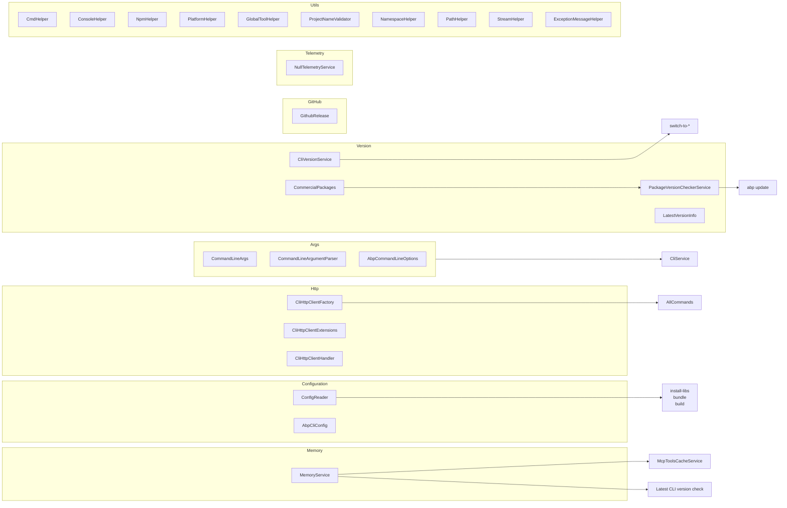
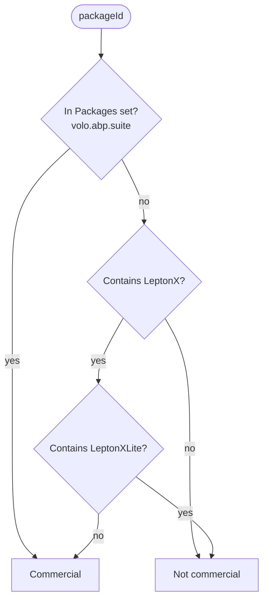
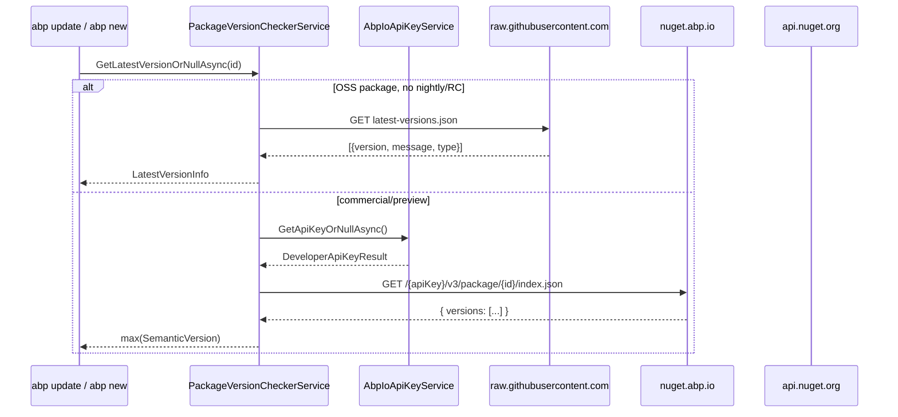
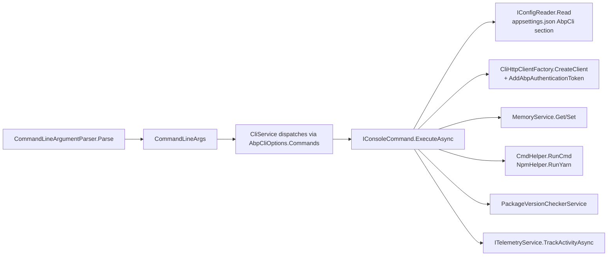

`Volo.Abp.Cli.Core` is the support library every command leans on. Above the command layer it provides argument parsing (`Args/`), the per-solution `AbpCli` configuration reader (`Configuration/`), a single typed HTTP client factory with Polly retries (`Http/`), a tiny line-oriented key/value store on disk (`Memory/`), telemetry hooks, OS-agnostic shell/process helpers (`Utils/`), and the package-version/CLI-version inspection layer (`Version/`). This page walks each sub-folder, links the types to their consumers and documents the well-known files under `~/.abp/`.



## `Args/` — command-line parsing

| Type | Role |
| --- | --- |
| `CommandLineArgs` | Immutable DTO: `Command`, `Target`, `Options` (AbpCommandLineOptions). |
| `CommandLineArgumentParser` | Implements `ICommandLineArgumentParser`. Two `Parse` overloads: `string[]` and one full line. Registered as `ITransientDependency`. |
| `AbpCommandLineOptions` | `Dictionary<string, string>` + `GetOrNull(name, params altNames)` helper. |
| `CommandLineArgsExtensions` | Misc convenience extensions (look-ups, has-option). |

### Parsing rules

```csharp
public CommandLineArgs Parse(string[] args)
{
    if (args.IsNullOrEmpty()) return CommandLineArgs.Empty();

    var command = argumentList[0];                  // first positional
    argumentList.RemoveAt(0);

    var target = argumentList[0];
    if (target.StartsWith("-")) target = null;      // no positional target
    else                         argumentList.RemoveAt(0);

    // remaining tokens are -flag / --flag value pairs.
    // Bare flag followed by another flag or EOL → value = null
}
```

Three subtleties:

1. **Target is optional.** `abp login` has `Target = null`; `abp login john` has `Target = "john"`. Detection is purely "does the next token start with `-`?".
2. **Flag without value is allowed.** `abp translate --verify` ends with `Options["verify"] = null`. Commands check existence with `Options.ContainsKey("verify")`, not value truthiness.
3. **Short vs long flag names** are *prefix-only*. There is no semantic mapping; the command is responsible for asking for both forms via `Options.GetOrNull("o", "organization")`. Convention in source: every command exposes `public static class Options { public static class Foo { public const string Short = "f"; public const string Long = "foo"; } }`.

### Line-mode parser

`Parse(string lineText)` is what `abp cli` interactive mode (and `prompt` in the commercial build) calls. It handles quoted arguments with `isInQuotes` toggling on `"`, splits on unquoted spaces, and forwards to the array overload. Useful when scripting:

```csharp
var args = parser.Parse("new Acme.Bookstore -t module --no-ui --no-tests");
```

### `AbpCommandLineOptions.GetOrNull`

```csharp
public string GetOrNull(string name, params string[] alternativeNames)
{
    var value = this.GetOrDefault(name);
    if (!value.IsNullOrWhiteSpace()) return value;
    foreach (var alt in alternativeNames ?? Array.Empty<string>())
    {
        value = this.GetOrDefault(alt);
        if (!value.IsNullOrWhiteSpace()) return value;
    }
    return null;
}
```

Whitespace-only values are treated as missing, so `--password ""` will not satisfy the check.

## `Configuration/` — per-solution `appsettings.json` reader

`ConfigReader` pulls the `AbpCli` subsection out of an `appsettings.json` *adjacent to the command's working directory*:

```csharp
const string appSettingFileName = "appsettings.json";

public AbpCliConfig Read(string directory)
{
    var settingsFilePath = Path.Combine(directory, appSettingFileName);
    if (!File.Exists(settingsFilePath))
        throw new FileNotFoundException($"appsettings file could not be found. Path:{settingsFilePath}");

    using var document = JsonDocument.Parse(File.ReadAllText(settingsFilePath),
                                            new JsonDocumentOptions { CommentHandling = JsonCommentHandling.Skip });

    if (document.RootElement.TryGetProperty("AbpCli", out var element))
    {
        return JsonSerializer.Deserialize<AbpCliConfig>(element.GetRawText(),
            new JsonSerializerOptions
            {
                Converters = { new JsonStringEnumConverter() },
                ReadCommentHandling = JsonCommentHandling.Skip
            });
    }
    return new AbpCliConfig();
}
```

`AbpCliConfig` currently holds a single property `Bundle: BundleConfig` consumed by [/cli/bundle-and-build](/cli/bundle-and-build). Example fragment:

```json title="appsettings.json"
{
  "AbpCli": {
    "Bundle": {
      "Mode": "OnePerProject",
      "Parameters": { "LeptonXTheme.Layout": "side-menu" }
    }
  }
}
```

`InstallLibsCommand`, `BundleCommand` and `BuildCommand` all call `IConfigReader.Read(currentDirectory)` to pick up bundle settings. JSON comments are tolerated (`/* */` and `//`) because Visual Studio writes commented appsettings by default.

## `GitHub/` — release model

`GithubRelease` is a single 4-property Newtonsoft DTO:

```csharp
public class GithubRelease
{
    [JsonProperty("id")]           public int Id { get; set; }
    [JsonProperty("name")]         public string Name { get; set; }
    [JsonProperty("prerelease")]   public bool IsPrerelease { get; set; }
    [JsonProperty("published_at")] public DateTime PublishTime { get; set; }
}
```

It maps the `https://api.github.com/repos/abpframework/abp/releases` response. Consumers (in the commercial Cli) iterate releases to surface "what's new in this version". The GitHub HTTP client is set up in `AbpCliCoreModule`:

```csharp
context.Services.AddHttpClient(CliConsts.GithubHttpClientName, client =>
{
    client.DefaultRequestHeaders.UserAgent.ParseAdd("MyAgent/1.0");
});
```

GitHub requires the `User-Agent` header — a request without one is `403`-ed.

The `CliConsts.GithubHttpClientName` (string `"GithubHttpClient"`) selects this configured client when calling `CliHttpClientFactory.CreateClient(clientName: CliConsts.GithubHttpClientName, ...)`. The same client is used to fetch `CliUrls.LatestVersionCheckFullPath` (`https://raw.githubusercontent.com/abpframework/abp/dev/latest-versions.json`).

## `Http/` — one factory, one retry policy, system proxy aware

Three small types, central to every outbound call:

### `CliHttpClientFactory`

```csharp
public HttpClient CreateClient(bool needsAuthentication = true, TimeSpan? timeout = null, string clientName = null)
{
    var httpClient = _clientFactory.CreateClient(clientName ?? CliConsts.HttpClientName);
    httpClient.Timeout = timeout ?? DefaultTimeout;            // 2 minutes
    if (needsAuthentication) httpClient.AddAbpAuthenticationToken();
    return httpClient;
}

public CancellationToken GetCancellationToken(TimeSpan? timeout = null) { /* ... */ }
```

Defaults:

| Knob | Value | Where |
| --- | --- | --- |
| `DefaultTimeout` | 2 minutes | `CliHttpClientFactory.DefaultTimeout` |
| HTTP client name | `"AbpHttpClient"` | `CliConsts.HttpClientName` |
| Primary handler | `CliHttpClientHandler` | `AbpCliCoreModule.ConfigureServices` |
| User-Agent (GitHub) | `"MyAgent/1.0"` | named client `GithubHttpClient` |

### `CliHttpClientHandler`

```csharp
public class CliHttpClientHandler : HttpClientHandler
{
    public CliHttpClientHandler()
    {
        Proxy = WebRequest.GetSystemWebProxy();
        DefaultProxyCredentials = CredentialCache.DefaultCredentials;
    }
}
```

This is the *primary* handler for `CliConsts.HttpClientName`. It honours `HTTP_PROXY`/`HTTPS_PROXY` (Linux/macOS), WPAD/Internet Explorer settings (Windows), and forwards default Windows credentials — which is what makes the CLI usable behind NTLM corporate proxies without extra configuration.

### `CliHttpClientExtensions`

Two public APIs:

- `AddAbpAuthenticationToken(this HttpClient)` — see [/cli/login-and-licensing](/cli/login-and-licensing). Reads `~/.abp/cli/access-token.bin` every call and applies `SetBearerToken`.
- `GetHttpResponseMessageWithRetryAsync<T>(this HttpClient, url, cancellationToken, logger, sleepDurations)` — wraps `GetAsync` in `Polly.HttpPolicyExtensions.HandleTransientHttpError().OrResult(msg => !msg.IsSuccessStatusCode)` with three retries:

```csharp
sleepDurations = new[]
{
    TimeSpan.FromSeconds(2),
    TimeSpan.FromSeconds(4),
    TimeSpan.FromSeconds(7)
};
```

The handler logs each retry through the caller's `ILogger<T>` with the HTTP status code or exception type. Total worst case is roughly `13s` of sleep plus four request attempts; combined with `DefaultTimeout = 2m` it can stretch to ~10 minutes worst-case for one failing endpoint.

<Warning>
The retry policy retries on **any non-success status**, including `401` and `403`. If an endpoint hard-rejects your bearer token you will still see three retries before the final failure. To avoid noisy logs during licensing 401s, callers like `AbpIoApiKeyService` short-circuit on `!response.IsSuccessStatusCode` instead.
</Warning>

## `Memory/` — line-oriented disk KV store

`MemoryService` is the CLI's tiny persistent state. The backing file is **next to the executable**, not under `~/.abp/`:

```csharp
public static string Memory => Path.Combine(
    Path.GetDirectoryName(System.Reflection.Assembly.GetExecutingAssembly().Location)!,
    "memory.bin");
```

Format: one `key ||| value` line per entry, newline separated.

```csharp
private const string KeyValueSeparator = "|||";

public async Task<string> GetAsync(string key)
{
    if (!File.Exists(CliPaths.Memory)) return null;
    return (await FileHelper.ReadAllTextAsync(CliPaths.Memory))
        .Split(new[] { Environment.NewLine, "\n" }, StringSplitOptions.None)
        .FirstOrDefault(x => x.StartsWith($"{key} "))
        ?.Split(KeyValueSeparator).Last().Trim();
}

public async Task SetAsync(string key, string value)
{
    // removes any existing line for the key, appends fresh
    memoryContentLines.RemoveAll(x => x.StartsWith(key));
    memoryContentLines.Add($"{key} {KeyValueSeparator} {value}");
}
```

Known keys (`CliConsts.MemoryKeys`):

| Key | Set by | Read by |
| --- | --- | --- |
| `LatestCliVersionCheckDate` | Latest-version check after CLI startup | Same — to skip re-check within ~24h |
| `McpToolsLastFetchDate` | `McpToolsCacheService.GetToolDefinitionsAsync` | `McpToolsCacheService.IsCacheValidAsync` (24h validity) |

<Note>
Because the file lives next to the assembly, a `dotnet tool update -g Volo.Abp.Cli` may install into a sibling directory and *appear* to "lose" the timestamps. That is by design — newer CLI versions deserve a fresh version-check cycle.
</Note>

## `Telemetry/`

`NullTelemetryService` is the OSS implementation of `ITelemetryService` (from `Volo.Abp.Internal.Telemetry`). All four `TrackActivity*`/`AddErrorActivityAsync` methods return `NullAsyncDisposable.Instance` / `Task.CompletedTask`.

The default wiring in `AbpCliCoreModule.ConfigureTelemetry`:

```csharp
var enableTelemetry = Environment.GetEnvironmentVariable("ABP_STUDIO_ENABLE_TELEMETRY", EnvironmentVariableTarget.Machine)
                  ?? Environment.GetEnvironmentVariable("ABP_STUDIO_ENABLE_TELEMETRY", EnvironmentVariableTarget.User)
                  ?? Environment.GetEnvironmentVariable("ABP_STUDIO_ENABLE_TELEMETRY", EnvironmentVariableTarget.Process);

if (enableTelemetry.IsNullOrEmpty() || !enableTelemetry.Equals("false", StringComparison.InvariantCultureIgnoreCase))
{
    services.Remove(services.First(p => p.ImplementationType == typeof(TelemetrySessionInfoEnricher)));
}
else
{
    services.Replace(ServiceDescriptor.Singleton<ITelemetryService, NullTelemetryService>());
}
```

In other words: **set `ABP_STUDIO_ENABLE_TELEMETRY=false`** at any environment-variable scope to replace `ITelemetryService` with the no-op `NullTelemetryService`. Anything else (unset, `true`, or other strings) keeps the real telemetry registration but removes the session-info enricher.

## `Utils/` — host helpers

| Helper | Purpose |
| --- | --- |
| `CmdHelper` / `ICmdHelper` | Cross-OS shell process runner. |
| `ConsoleHelper.ReadSecret()` | Reads a password without echoing. |
| `GlobalToolHelper.IsGlobalToolInstalled(name)` | Existence check for `~/.dotnet/tools/<name>(.exe)`. |
| `NamespaceHelper.NormalizeNamespace(value)` | Regex-normalises an arbitrary string into a valid .NET namespace. |
| `NpmHelper` | Checks for `npm`/`yarn`, runs `npx yarn`, install commands. |
| `PathHelper.NormalizePath(path)` | If relative, prepends `Directory.GetCurrentDirectory()`. |
| `PlatformHelper` | `RuntimePlatform` enum (`Windows`, `LinuxOrMacOs`) and OS detection. |
| `ProjectNameValidator.Validate(name)` | Rejects `..`, control chars, reserved names (`CON`, `AUX`, `LPT2`, …), placeholder names like `MyProjectName`, and disallowed keywords (`Blazor`, `MauiBlazor` as bare segments). |
| `StreamHelper.GenerateStreamFromString(s)` | Newline-preserving `Stream` from a string for the project builder. |
| `ExceptionMessageHelper` | One-liner `GetInvalidOptionExceptionMessage(name)`. |

### `CmdHelper` essentials

```csharp
public string GetFileName()
{
    if (RuntimeInformation.IsOSPlatform(OSPlatform.Windows)) return "cmd.exe";
    if (File.Exists("/bin/bash")) return "/bin/bash";
    if (File.Exists("/bin/sh"))   return "/bin/sh"; // Alpine
    throw new AbpException(...);
}

public string GetArguments(string command, int? delaySeconds = null)
{
    if (Linux || macOS)
        return delaySeconds == null
            ? "-c \"" + command + "\""
            : "-c \"" + $"sleep {delaySeconds} > /dev/null && " + command + "\"";
    // Windows
    return delaySeconds == null
        ? "/C \"" + command + "\""
        : "/C \"" + $"timeout /nobreak /t {delaySeconds} >null && " + command + "\"";
}
```

`Open(pathOrUrl)` picks `cmd /c start ""`, `xdg-open`, or `open` based on OS, with quote-escaping for paths containing spaces and `&` escaping on Windows.

The `delaySeconds` overload of `GetArguments` is how `RunCmdAndExit` schedules a follow-up command (used after `dotnet tool update -g` so that the new process starts only after the current one fully exits).

When `CliOptions.AlwaysHideExternalCommandOutput` is true (configurable through `AbpCliOptions`), child windows are launched with `ProcessWindowStyle.Hidden` + `CreateNoWindow`.

### `NpmHelper`

- `IsNpmInstalled()` / `IsYarnAvailable()` shell out to `npm -v` / `yarn -v` and parse output as `SemanticVersion`. `yarn` is considered "available" only if version > `1.20.0`.
- `RunYarn(directory)` always uses `npx yarn` — no global yarn install required.
- Two legacy methods (`RunNpmInstall`, `NpmInstallPackage`) are marked `[Obsolete]` in favour of the npx-yarn variants.
- `InstallYarn()` runs `npm install yarn -g`.

`NpmHelper` is the bridge `InstallLibsCommand` uses to materialise client-side assets — see [/cli/install-libs](/cli/install-libs).

### `ConsoleHelper.ReadSecret`

```csharp
public static string ReadSecret()
{
    var sb = new StringBuilder();
    while (true)
    {
        var keyInfo = Console.ReadKey(true);
        if (keyInfo.Key == ConsoleKey.Enter) break;
        sb.Append(keyInfo.KeyChar);
    }
    return sb.ToString();
}
```

Notable: **no backspace handling** and no mask character. A user mistyping their password cannot correct it inline — they must hit Enter (which fails the auth call) and re-run.

### `ProjectNameValidator`

```csharp
private static readonly string[] IllegalProjectNames = new[]
{
    "MyCompanyName.MyProjectName", "MyProjectName",
    "CON", "AUX", "PRN", "COM1", "LPT2"
};

private static readonly string[] IllegalKeywords = new[] { "MauiBlazor", "Blazor" };
```

The "Blazor" / "MauiBlazor" keyword check is applied per dot-segment (`projectName.Split(".").Contains(illegalKeyword)`) — `Blazored.LocalStorage` is fine, `Acme.Blazor.Bookstore` is rejected. This avoids confusing solutions whose name collides with project types that the template emits.

## `Version/` — CLI and package versions

### `CliVersionService.GetCurrentCliVersionAsync`

```csharp
var consoleOutput = new StringReader(CmdHelper.RunCmdAndGetOutput("dotnet tool list -g", out int exitCode));
string line;
while ((line = await consoleOutput.ReadLineAsync()) != null)
{
    if (line.StartsWith("volo.abp.cli", StringComparison.InvariantCultureIgnoreCase))
    {
        var version = line.Split(new char[0], StringSplitOptions.RemoveEmptyEntries)[1];
        SemanticVersion.TryParse(version, out currentCliVersion);
        break;
    }
    if (line.StartsWith("volo.abp.studio.cli", StringComparison.InvariantCultureIgnoreCase))
    {
        var assemblyVersion = string.Join(".",
            Assembly.GetExecutingAssembly().GetFileVersion().Split('.').Take(3));
        return SemanticVersion.Parse(assemblyVersion + "-studio");
    }
}

if (currentCliVersion == null)
{
    var assemblyVersion = string.Join(".",
        Assembly.GetExecutingAssembly().GetFileVersion().Split('.').Take(3));
    return SemanticVersion.Parse(assemblyVersion + "-dev");
}
return currentCliVersion;
```

Reading the version from `dotnet tool list -g` rather than `Assembly.GetExecutingAssembly()` lets the CLI know **how the user installed it** (global tool vs Studio bundle vs local dev build) — the suffix (`-studio`, `-dev`) is appended for telemetry and `abp switch-to-*` heuristics.

### `CommercialPackages.IsCommercial`

```csharp
private readonly static HashSet<string> Packages = new() { "volo.abp.suite" };

public static bool IsCommercial(string packageId)
    => Packages.Contains(packageId.ToLowerInvariant()) || IsLeptonXPackage(packageId);

private static bool IsLeptonXPackage(string packageId)
    => !IsLeptonXLitePackage(packageId) && packageId.Contains("LeptonX");

private static bool IsLeptonXLitePackage(string packageId)
    => packageId.Contains("LeptonXLite");
```

Decision tree:



`LeptonXLite` is the OSS variant shipped via nuget.org; `LeptonX` (and `LeptonX.Pro`) are paid and live on `nuget.abp.io`.

### `PackageVersionCheckerService`

This service is the workhorse behind `abp update` and template version selection. Three feeds, one routing function:

```csharp
public async Task<List<string>> GetPackageVersionListAsync(string packageId, bool includeNightly = false)
{
    if (includeNightly)
        return await GetPackageVersionsFromMyGet(packageId);

    if (await IsCommercialPackageAsync(packageId))
        return await GetPackageVersionsFromAbpCommercialNuGetAsync(packageId);

    return await GetPackageVersionsFromNuGetOrgAsync(packageId) ?? new List<string>();
}
```

Feed URLs:

| Feed | URL pattern |
| --- | --- |
| nuget.org (OSS) | `https://api.nuget.org/v3-flatcontainer/{id}/index.json` |
| nuget.abp.io (commercial) | `CliUrls.GetNuGetPackageInfoUrl(apiKey, id)` → `{NuGetRootPath}{apiKey}/v3/package/{id}/index.json` |
| MyGet nightly | `https://www.myget.org/F/abp-nightly/api/v3/flatcontainer/{id}/index.json` |

`IsCommercialPackageAsync` first consults the static `CommercialPackages.IsCommercial` (fast path: LeptonX, Volo.Abp.Suite). If still ambiguous it falls back to **searching** the user-specific commercial feed using their API key:

```csharp
var searchUrl = CliUrls.GetNuGetPackageSearchUrl(_apiKeyResult.ApiKey, packageId);
isCommercial = await HasAnyPackageAsync(searchUrl, packageId);
```

Results are memoised in a static `ConcurrentDictionary<string, bool> CommercialPackagesCache` for the process lifetime.

`GetLatestStableVersionFromGithubAsync` short-circuits the whole NuGet dance for unambiguously-OSS packages by downloading `https://raw.githubusercontent.com/abpframework/abp/dev/latest-versions.json` and picking the first `Type == "stable"` entry. The JSON shape:

```json
[
  {
    "version": "10.2.0",
    "releaseDate": "2025-...",
    "type": "stable",
    "message": "...",
    "leptonX": { "version": "5.2.0" }
  }
]
```

`LatestVersionInfo` wraps just `{ Version, Message }`; the LeptonX sub-version is consumed separately by the project builder when stamping template files.



## Well-known files under `~/.abp/cli/`

Every CLI session can leave artefacts under `CliPaths.Root` (`~/.abp/cli/`). Consolidated table:

| File | Owner | Content |
| --- | --- | --- |
| `access-token.bin` | `AuthService` | OIDC bearer token (UTF-8 plaintext) |
| `computer-id.bin` | Telemetry session enricher | Stable per-machine GUID |
| `mcp-config.json` | User-managed | `{ "serverUrl": "..." }` to override `mcp.abp.io` |
| `mcp-tools.json` | `McpToolsCacheService` | Cached `List<McpToolDefinition>` (24-hour TTL) |
| `logs/mcp.log` | `McpLogger` | MCP server diagnostic log |
| `templates/` | Project builder | Cached `.zip` templates downloaded from server |

Plus two outside `~/.abp/`:

- `<temp>/AbpLicense.bin` — cached license blob (see [/cli/login-and-licensing](/cli/login-and-licensing)).
- `<install-dir>/memory.bin` — `MemoryService` KV store.

## How a command resolves these pieces



This is the contract every page in this section assumes: argument parsing is centralised, HTTP is centralised (with auth + retry), persistent state is two flat files, and the project-builder pieces (templates, licensing, package versions) hang off the same `CliHttpClientFactory` + `IApiKeyService` + `PackageVersionCheckerService` trio.

## Extending the CLI

To add a new command:

1. Implement `IConsoleCommand` + `ITransientDependency` in a class named `XxxCommand`.
2. Register in `AbpCliOptions.Commands` (in your own module's `ConfigureServices`):
   ```csharp
   Configure<AbpCliOptions>(opts => opts.Commands["xxx"] = typeof(XxxCommand));
   ```
3. Consume `CommandLineArgs`; use `Options.GetOrNull("s", "short", "long")` for compatibility.
4. For HTTP, **always** go through `CliHttpClientFactory` so retries, the system proxy and bearer-token injection apply.
5. For background config (e.g. "skip this for 24 hours"), use `MemoryService` with a key under `CliConsts.MemoryKeys`.
6. If the command launches subprocesses, use `ICmdHelper` so OS-specific shell selection and the hide-window setting are respected.

## Related pages

- [/cli/overview](/cli/overview) — host wiring, module dependencies
- [/cli/commands](/cli/commands) — every registered command name
- [/cli/login-and-licensing](/cli/login-and-licensing) — `AuthService`, `AbpIoApiKeyService`
- [/cli/install-libs](/cli/install-libs) — consumer of `NpmHelper` and `ConfigReader`
- [/cli/bundle-and-build](/cli/bundle-and-build) — consumer of `AbpCliConfig.Bundle`
- [/cli/mcp-and-translate](/cli/mcp-and-translate) — consumer of `MemoryService` and `McpHttpClientService`
