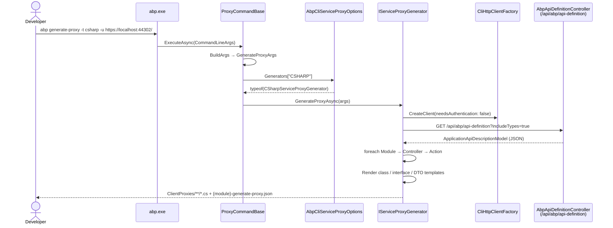

The `abp generate-proxy` command turns a running ABP backend's auto-generated API description into typed client code. It calls `GET /api/abp/api-definition`, deserialises the response into an `ApplicationApiDescriptionModel`, walks every `ModuleApiDescriptionModel` → `ControllerApiDescriptionModel` → `ActionApiDescriptionModel`, and asks the matching `IServiceProxyGenerator` (C#, JavaScript, or Angular schematic) to render proxy classes, interfaces and DTOs into your client project. This page documents the wiring end-to-end so an agent can extend, automate or troubleshoot proxy generation.

## Where the command lives

| File | Role |
| --- | --- |
| `framework/src/Volo.Abp.Cli.Core/Volo/Abp/Cli/Commands/GenerateProxyCommand.cs` | Public `abp generate-proxy` entry. Inherits all behaviour from `ProxyCommandBase`. |
| `framework/src/Volo.Abp.Cli.Core/Volo/Abp/Cli/Commands/RemoveProxyCommand.cs` | Sibling `abp remove-proxy` — uses the *same* base, dispatches `CommandName == "remove-proxy"` to the generator's delete branch. |
| `framework/src/Volo.Abp.Cli.Core/Volo/Abp/Cli/Commands/ProxyCommandBase.cs` | Parses flags, builds a `GenerateProxyArgs`, resolves the generator from `AbpCliServiceProxyOptions.Generators` and invokes `IServiceProxyGenerator.GenerateProxyAsync`. |
| `framework/src/Volo.Abp.Cli.Core/Volo/Abp/Cli/ServiceProxying/AbpCliServiceProxyOptions.cs` | `IDictionary<string, Type> Generators` — the type → generator dispatch table. |
| `framework/src/Volo.Abp.Cli.Core/Volo/Abp/Cli/AbpCliCoreModule.cs` | Registers `CSHARP`, `JS`, `NG` generators in `ConfigureServices`. |

Both `generate-proxy` and `remove-proxy` are registered in `AbpCliCoreModule` and resolved through `CommandSelector` — see [CLI overview](/cli/overview) and the [command reference](/cli/commands).

## End-to-end sequence



## Command surface

### Flags (resolved in `ProxyCommandBase.BuildArgs`)

<ParamField path="-t | --type" type="csharp | js | ng" required>
  Selects the generator. Value is upper-cased and looked up in `AbpCliServiceProxyOptions.Generators`. Missing or unknown values throw `CliUsageException`.
</ParamField>

<ParamField path="-u | --url" type="string">
  Base URL of the running backend. The generator appends `api/abp/api-definition` via `CliUrls.GetApiDefinitionUrl`. Required for `csharp` and `js`; the Angular generator forwards it to the schematic.
</ParamField>

<ParamField path="-m | --module" type="string" default="app">
  `ModuleApiDescriptionModel.RootPath` to select from the response. Anything else is filtered out before generation. `app` is the default ABP application module (`ModuleApiDescriptionModel.DefaultRootPath`).
</ParamField>

<ParamField path="-o | --output" type="string">
  Output path. JavaScript only — `.js` is appended/expected. C# uses `--folder` instead; Angular forwards target via schematic.
</ParamField>

<ParamField path="--folder" type="string" default="ClientProxies">
  C# only. Folder under the working directory to write proxy and DTO files into. Must be a directory (no extension) or `CliUsageException` is thrown.
</ParamField>

<ParamField path="-c | --without-contracts" type="bool" default="false">
  C# only. Skips generating the `IXxxAppService` interface, DTOs and enums. The generator also passes `IncludeTypes = false` to the server so the response excludes `Types`.
</ParamField>

<ParamField path="-a | --api-name" type="string" default="default">
  Angular only. Name of the API endpoint defined in `src/environments/environment.ts`.
</ParamField>

<ParamField path="-s | --source" type="string" default="defaultProject">
  Angular only. Source project to resolve the root namespace and API URL from.
</ParamField>

<ParamField path="--target" type="string" default="defaultProject">
  Angular only. Target project in which to place generated code.
</ParamField>

<ParamField path="-p | --prompt" type="bool">
  Angular only. Asks for missing options interactively (forwarded to the schematic).
</ParamField>

<ParamField path="-wd | --working-directory" type="string" default="Directory.GetCurrentDirectory()">
  Execution directory. For C#/JS it must contain a `*.csproj` (otherwise `CliUsageException`).
</ParamField>

<ParamField path="-st | --service-type" type="application | integration | all">
  Filters controllers by `ControllerApiDescriptionModel.IsIntegrationService`. Mapped to the `ServiceType` enum (`All=0`, `Application=1`, `Integration=2`).
</ParamField>

<ParamField path="-ep | --entry-point" type="string">
  Angular only. Forwarded to the schematic as `--entry-point`.
</ParamField>

### Type / UI matrix

| `--type` value | Generator class | DI registration key | Default `ServiceType` | Requires |
| --- | --- | --- | --- | --- |
| `csharp` | `CSharpServiceProxyGenerator` | `CSHARP` | `ServiceType.All` | A `*.csproj` in `WorkDirectory` |
| `js` | `JavaScriptServiceProxyGenerator` | `JS` | `ServiceType.Application` | A `*.csproj` in `WorkDirectory` |
| `ng` | `AngularServiceProxyGenerator` | `NG` | `ServiceType.Application` | `angular.json` + `@abp/ng.schematics` devDependency |

<Note>
There is no separate TypeScript generator class — Angular emits TypeScript files via the `@abp/ng.schematics` NPM package (`npx ng g @abp/ng.schematics:proxy-add`). Plain TypeScript without Angular is not a built-in `--type`.
</Note>

## The server contract

The HTTP source is `AbpApiDefinitionController` in `framework/src/Volo.Abp.AspNetCore.Mvc/Volo/Abp/AspNetCore/Mvc/ApiExploring/AbpApiDefinitionController.cs`:

```csharp
[Area("abp")]
[RemoteService(Name = "abp")]
[Route("api/abp/api-definition")]
public class AbpApiDefinitionController : AbpController, IRemoteService
{
    [HttpGet]
    public virtual ApplicationApiDescriptionModel Get(ApplicationApiDescriptionModelRequestDto model)
    {
        return ModelProvider.CreateApiModel(model);
    }
}
```

`ApplicationApiDescriptionModelRequestDto` carries a single flag:

```csharp
public class ApplicationApiDescriptionModelRequestDto
{
    public bool IncludeTypes { get; set; }
}
```

`CliUrls.GetApiDefinitionUrl` builds the URL exactly once and only sets the query string when types are wanted:

```csharp
public static string GetApiDefinitionUrl(string url, ApplicationApiDescriptionModelRequestDto model = null)
{
    url = url.EnsureEndsWith('/');
    return $"{url}api/abp/api-definition" +
           (model != null ? model.IncludeTypes ? "?includeTypes=true" : string.Empty : string.Empty);
}
```

The response shape (`framework/src/Volo.Abp.Http/Volo/Abp/Http/Modeling/`):

| Type | Key fields |
| --- | --- |
| `ApplicationApiDescriptionModel` | `IDictionary<string, ModuleApiDescriptionModel> Modules`, `IDictionary<string, TypeApiDescriptionModel> Types` |
| `ModuleApiDescriptionModel` | `RootPath`, `RemoteServiceName`, `IDictionary<string, ControllerApiDescriptionModel> Controllers` |
| `ControllerApiDescriptionModel` | `ControllerName`, `Type` (full name), `IsRemoteService`, `IsIntegrationService`, `Interfaces`, `Dictionary<string, ActionApiDescriptionModel> Actions` |
| `ActionApiDescriptionModel` | `Name`, `UniqueName`, `HttpMethod`, `Url`, `ReturnValue`, `Parameters`, `ParametersOnMethod`, `ImplementFrom` |
| `TypeApiDescriptionModel` | `BaseType`, `IsEnum`, `EnumNames`, `EnumValues`, `Properties`, `GenericArguments` |

## Shared pipeline in `ProxyCommandBase`

```csharp
public async Task ExecuteAsync(CommandLineArgs commandLineArgs)
{
    var generateType = commandLineArgs.Options
        .GetOrNull(Options.GenerateType.Short, Options.GenerateType.Long)?.ToUpper();

    if (string.IsNullOrWhiteSpace(generateType))
        throw new CliUsageException("Option Type is required" + Environment.NewLine + GetUsageInfo());

    if (!ServiceProxyOptions.Generators.ContainsKey(generateType))
        throw new CliUsageException("Option Type value is invalid" + Environment.NewLine + GetUsageInfo());

    using (var scope = ServiceScopeFactory.CreateScope())
    {
        var generatorType = ServiceProxyOptions.Generators[generateType];
        var serviceProxyGenerator = scope.ServiceProvider
            .GetService(generatorType).As<IServiceProxyGenerator>();

        await serviceProxyGenerator.GenerateProxyAsync(BuildArgs(commandLineArgs));
    }
}
```

`BuildArgs` packs every flag into a single `GenerateProxyArgs` DTO, including the `CommandName` itself — that is how the same generator handles both `generate-proxy` and `remove-proxy`. The `--service-type` flag is mapped here:

```csharp
serviceType = serviceTypeArg.ToLower() == "application"
    ? ServiceType.Application
    : serviceTypeArg.ToLower() == "integration"
        ? ServiceType.Integration
        : ServiceType.All;
```

`ServiceType` (`ServiceProxying/ServiceType.cs`) is a 3-value enum used by `ServiceProxyGeneratorBase.GetApplicationApiDescriptionModelAsync` to filter `moduleDefinition.Controllers`:

```csharp
case ServiceType.Application:
    moduleDefinition.Controllers.RemoveAll(x => x.Value.IsIntegrationService);
    break;
case ServiceType.Integration:
    moduleDefinition.Controllers.RemoveAll(x => !x.Value.IsIntegrationService);
    break;
```

## The `ServiceProxying/` folder

```text
Volo/Abp/Cli/ServiceProxying/
├── AbpCliServiceProxyOptions.cs   ← Generators dictionary
├── GenerateProxyArgs.cs           ← DTO passed to every generator
├── IServiceProxyGenerator.cs      ← single method: GenerateProxyAsync(args)
├── ServiceProxyGeneratorBase.cs   ← HTTP + module/controller filtering
├── ServiceType.cs                 ← All | Application | Integration
├── Angular/AngularServiceProxyGenerator.cs
├── CSharp/CSharpServiceProxyGenerator.cs
└── JavaScript/JavaScriptServiceProxyGenerator.cs
```

<Note>
There is no `TypeScript/` subfolder in the repo. Angular generation delegates entirely to the `@abp/ng.schematics` package and only the schematic itself emits `.ts` files.
</Note>

### `ServiceProxyGeneratorBase`

All concrete generators inherit from `ServiceProxyGeneratorBase<T>` and reuse `GetApplicationApiDescriptionModelAsync`:

```csharp
protected virtual async Task<ApplicationApiDescriptionModel> GetApplicationApiDescriptionModelAsync(
    GenerateProxyArgs args,
    ApplicationApiDescriptionModelRequestDto requestDto = null)
{
    Check.NotNull(args.Url, nameof(args.Url));

    var client = CliHttpClientFactory.CreateClient(needsAuthentication: false);
    var apiDefinitionResult = await client.GetStringAsync(CliUrls.GetApiDefinitionUrl(args.Url, requestDto));
    var apiDefinition = JsonSerializer.Deserialize<ApplicationApiDescriptionModel>(apiDefinitionResult);

    var moduleDefinition = apiDefinition.Modules
        .FirstOrDefault(x => string.Equals(x.Key, args.Module, StringComparison.CurrentCultureIgnoreCase)).Value;
    if (moduleDefinition == null)
        throw new CliUsageException($"Module name: {args.Module} is invalid");

    // filter controllers by ServiceType ...

    var apiDescriptionModel = ApplicationApiDescriptionModel.Create();
    apiDescriptionModel.Types = apiDefinition.Types;
    apiDescriptionModel.AddModule(moduleDefinition);
    return apiDescriptionModel;
}
```

Note that the request is unauthenticated (`needsAuthentication: false`). If your backend hides `/api/abp/api-definition` behind auth, expose it via `AlwaysAllowAuthorizationPolicyProvider` or run the CLI against a development URL.

## CSharp generator deep-dive

`CSharpServiceProxyGenerator.GenerateProxyAsync` orchestrates four steps:

```csharp
public override async Task GenerateProxyAsync(GenerateProxyArgs args)
{
    CheckWorkDirectory(args.WorkDirectory);
    CheckFolder(args.Folder);

    if (args.CommandName == RemoveProxyCommand.Name)
    {
        var folder = args.Folder.IsNullOrWhiteSpace() ? ProxyDirectory : args.Folder;
        var folderPath = Path.Combine(args.WorkDirectory, folder);
        if (Directory.Exists(folderPath)) Directory.Delete(folderPath, true);
        return;
    }

    var applicationApiDescriptionModel = await GetApplicationApiDescriptionModelAsync(args,
        new ApplicationApiDescriptionModelRequestDto { IncludeTypes = !args.WithoutContracts });

    foreach (var controller in applicationApiDescriptionModel.Modules.Values
        .SelectMany(x => x.Controllers)
        .Where(x => x.Value.Interfaces.Any() &&
                    ServicePostfixes.Any(s => x.Value.Interfaces.Last().Type.EndsWith(s))))
    {
        await GenerateClassFileAsync(args, controller.Value);
    }

    if (!args.WithoutContracts)
        await GenerateDtoFileAsync(args, applicationApiDescriptionModel);

    await CreateJsonFile(args, applicationApiDescriptionModel);
}
```

Key constants:

- `ProxyDirectory = "ClientProxies"` — default `--folder`.
- `ServicePostfixes = { "AppService", "ApplicationService", "IntService", "IntegrationService", "Service" }` — only controllers whose *last* interface ends in one of these are generated.
- `AppServicePrefix = "Volo.Abp.Application.Services"` — used by `ShouldGenerateMethod` to skip inherited framework methods.

### Templates

The class is split into two files — a hand-editable empty partial and a regenerated `*.Generated.cs`:

```csharp
private static readonly string ClassTemplate = "// This file is automatically generated by ABP framework to use MVC Controllers from CSharp" +
    $"{Environment.NewLine}<using>" +
    $"{Environment.NewLine}" +
    $"{Environment.NewLine}// ReSharper disable once CheckNamespace" +
    $"{Environment.NewLine}namespace <namespace>;" +
    $"{Environment.NewLine}" +
    $"{Environment.NewLine}[Dependency(ReplaceServices = true)]" +
    $"{Environment.NewLine}[ExposeServices(typeof(<serviceInterface>), typeof(<className>))]" +
    $"{Environment.NewLine}[IntegrationService]" +
    $"{Environment.NewLine}public partial class <className> : ClientProxyBase<<serviceInterface>>, <serviceInterface>" +
    "...";
```

`[IntegrationService]` is stripped when `controllerApiDescription.IsIntegrationService` is `false`. The interface (`InterfaceTemplate`) and DTOs (`DtoTemplate`) follow the same placeholder pattern (`<using>`, `<namespace>`, `<className>`, `<serviceInterface>`, `<method>`, `<property>`).

Standard usings always injected into the class file:

```csharp
private static readonly List<string> ClassUsingNamespaceList = new()
{
    "using System;",
    "using System.Collections.Generic;",
    "using System.Threading.Tasks;",
    "using Volo.Abp;",
    "using Volo.Abp.Application.Dtos;",
    "using Volo.Abp.Http.Client;",
    "using Volo.Abp.Http.Modeling;",
    "using Volo.Abp.DependencyInjection;",
    "using Volo.Abp.Http.Client.ClientProxying;"
};
```

### Method emission

For each `ActionApiDescriptionModel` whose name ends in `Async`, `GenerateAsyncClassMethod` produces:

```csharp
public virtual async Task<TResult> XxxAsync(T1 a, T2 b)
{
    return await RequestAsync<TResult>(nameof(XxxAsync), new ClientProxyRequestTypeValue
    {
        { typeof(T1), a },
        { typeof(T2), b },
    });
}
```

Special cases handled by the same routine:

- `IAsyncEnumerable<T>` → calls `RequestAsyncEnumerable<T>` and is *not* marked `async`.
- `void`/`Task` return → `await RequestAsync(...)`.
- Empty parameter list → omits the `new ClientProxyRequestTypeValue { ... }` arg.

Synchronous methods throw `NotImplementedException` — the generated comment explicitly tells you to call the async equivalent.

`ShouldGenerateMethod` filters out members inherited from the base application service:

```csharp
private bool ShouldGenerateMethod(string appServiceTypeName, ActionApiDescriptionModel action)
{
    return action.ImplementFrom.StartsWith(AppServicePrefix) ||
           action.ImplementFrom.StartsWith(appServiceTypeName) ||
           IsAppServiceInterface(GetRealTypeName(action.ImplementFrom));
}
```

### DTO emission

`GenerateDtoFileAsync` walks every controller, collects every type whose key starts with the controller's namespace, unwraps generic argument names (e.g. `Volo.Abp.Application.Dtos.PagedResultDto<T0>` → `T0`), and writes one file per type. Enums use the `<enumName> = <value>` form; classes emit `public <Type> <Name> { get; set; }` for every `TypeApiDescriptionModel.Properties` entry. Base types are rendered via `BaseType`.

Each run also writes a side-car `{module}-generate-proxy.json` snapshot of the filtered `ApplicationApiDescriptionModel` into the same folder — useful for diffing API surface changes between runs.

## JavaScript generator

`JavaScriptServiceProxyGenerator` is much simpler — it delegates the actual script construction to `JQueryProxyScriptGenerator` (the same component the `/Abp/ServiceProxyScript` middleware uses):

```csharp
public async override Task GenerateProxyAsync(GenerateProxyArgs args)
{
    CheckWorkDirectory(args.WorkDirectory);

    var output = Path.Combine(args.WorkDirectory, DefaultOutput, $"{args.Module}-proxy.js");
    if (!args.Output.IsNullOrWhiteSpace())
    {
        output = args.Output.EndsWith(".js")
            ? Path.Combine(args.WorkDirectory, args.Output)
            : Path.Combine(args.WorkDirectory, Path.GetDirectoryName(args.Output), $"{args.Module}-proxy.js");
    }

    if (args.CommandName == RemoveProxyCommand.Name) { RemoveProxy(args, output); return; }

    var applicationApiDescriptionModel = await GetApplicationApiDescriptionModelAsync(args);
    var script = RemoveInitializedEventTrigger(
        _jQueryProxyScriptGenerator.CreateScript(applicationApiDescriptionModel));

    Directory.CreateDirectory(Path.GetDirectoryName(output));
    using (var writer = new StreamWriter(output)) await writer.WriteAsync(script);
}
```

Notes:

- Default output is `wwwroot/client-proxies/{module}-proxy.js`.
- The trailing `abp.event.trigger('abp.serviceProxyScriptInitialized');` line is stripped so the file can be imported without firing the runtime init event twice.
- Default `ServiceType` is `Application` — integration controllers are excluded.

## Angular generator

`AngularServiceProxyGenerator` does *not* render code itself. It validates the working directory, then shells out to the official schematic:

```csharp
var schematicsCommandName = args.CommandName == RemoveProxyCommand.Name
    ? "proxy-remove"
    : "proxy-add";

var commandBuilder = new StringBuilder("npx ng g @abp/ng.schematics:" + schematicsCommandName);
// --module, --api-name, --source, --target, --url, --entry-point appended when set
commandBuilder.Append($" --service-type {serviceType.ToString().ToLower()}");

_cmdhelper.RunCmd(commandBuilder.ToString());
```

Pre-flight checks:

- `angular.json` must exist in the current directory (`CheckAngularJsonFile`).
- `package.json` must declare `@abp/ng.schematics` under `devDependencies` (`CheckNgSchematicsAsync`).
- A warning is logged when the installed schematics SemVer is lower than the running CLI version.

The defaults `__default` are passed when the user did not supply `--prompt`, signalling the schematic to use its own defaults instead of prompting. See [Angular schematics & generators](/angular/schematics-and-generators) for the schematic-side details.

## `remove-proxy`

`RemoveProxyCommand` inherits the same `ProxyCommandBase` and only differs in `CommandName == "remove-proxy"`. Each generator checks that string and switches to delete mode:

- C#: `Directory.Delete(folderPath, recursive: true)` on `args.Folder ?? "ClientProxies"`.
- JavaScript: `File.Delete(output)` on the resolved `*.js` path.
- Angular: invokes `npx ng g @abp/ng.schematics:proxy-remove` with the same flag forwarding.

Examples from `RemoveProxyCommand.GetUsageInfo`:

```bash
abp remove-proxy -t ng
abp remove-proxy -t js -m identity -o Pages/Identity/client-proxies.js
abp remove-proxy -t csharp --folder MyProxies/InnerFolder
```

## Worked examples

```bash
# Angular: regenerate proxies for the default module
abp generate-proxy -t ng

# JavaScript: identity module proxy into a Razor Pages folder
abp generate-proxy -t js -m identity \
  -o Pages/Identity/client-proxies.js \
  -url https://localhost:44302/

# C#: place proxies under MyProxies/InnerFolder
abp generate-proxy -t csharp \
  --folder MyProxies/InnerFolder \
  -url https://localhost:44302/

# C#: skip interfaces and DTO classes (when contracts already exist)
abp generate-proxy -t csharp \
  -url https://localhost:44302/ \
  --without-contracts
```

## Failure modes & exceptions

| Trigger | Exception | Source |
| --- | --- | --- |
| Missing `--type` | `CliUsageException("Option Type is required")` | `ProxyCommandBase.ExecuteAsync` |
| Unknown `--type` value | `CliUsageException("Option Type value is invalid")` | `ProxyCommandBase.ExecuteAsync` |
| Missing `--url` | `ArgumentException` via `Check.NotNull(args.Url)` | `ServiceProxyGeneratorBase.GetApplicationApiDescriptionModelAsync` |
| Module not in response | `CliUsageException("Module name: {Module} is invalid")` | `ServiceProxyGeneratorBase` |
| `WorkDirectory` has no `*.csproj` (C#/JS) | `CliUsageException("No project file …")` | `CheckWorkDirectory` |
| `--folder` has a file extension | `CliUsageException("Option folder should be a directory.")` | `CSharpServiceProxyGenerator.CheckFolder` |
| `angular.json` missing | `CliUsageException("angular.json file not found …")` | `AngularServiceProxyGenerator.CheckAngularJsonFile` |
| `@abp/ng.schematics` not in `devDependencies` | `CliUsageException` | `AngularServiceProxyGenerator.CheckNgSchematicsAsync` |

## Extending the matrix

Because dispatch happens through `AbpCliServiceProxyOptions.Generators`, you can register your own generator without forking the CLI:

```csharp
[DependsOn(typeof(AbpCliCoreModule))]
public class MyToolingModule : AbpModule
{
    public override void ConfigureServices(ServiceConfigurationContext context)
    {
        Configure<AbpCliServiceProxyOptions>(options =>
        {
            options.Generators["PY"] = typeof(PythonServiceProxyGenerator);
        });
    }
}

public class PythonServiceProxyGenerator
    : ServiceProxyGeneratorBase<PythonServiceProxyGenerator>, ITransientDependency
{
    public PythonServiceProxyGenerator(CliHttpClientFactory http, IJsonSerializer json)
        : base(http, json) { }

    public override async Task GenerateProxyAsync(GenerateProxyArgs args)
    {
        var model = await GetApplicationApiDescriptionModelAsync(args);
        // walk model.Modules → Controllers → Actions and emit .py
    }

    protected override ServiceType? GetDefaultServiceType(GenerateProxyArgs args)
        => ServiceType.Application;
}
```

After loading your module from the CLI host the new key becomes a valid `--type` argument (`abp generate-proxy -t py …`).

## Related pages

- [ASP.NET Core MVC Client Proxies](/aspnetcore/mvc-client-proxies) — runtime side of the generated C# proxies (`ClientProxyBase<T>`, `RequestAsync`, `IRemoteServiceConfiguration`).
- [CLI overview](/cli/overview) — how `AbpCliHostedService` discovers commands and resolves `IConsoleCommand` instances.
- [CLI command reference](/cli/commands) — every other registered sub-command.
- [Angular schematics & generators](/angular/schematics-and-generators) — what `@abp/ng.schematics:proxy-add` does once the CLI hands off.
