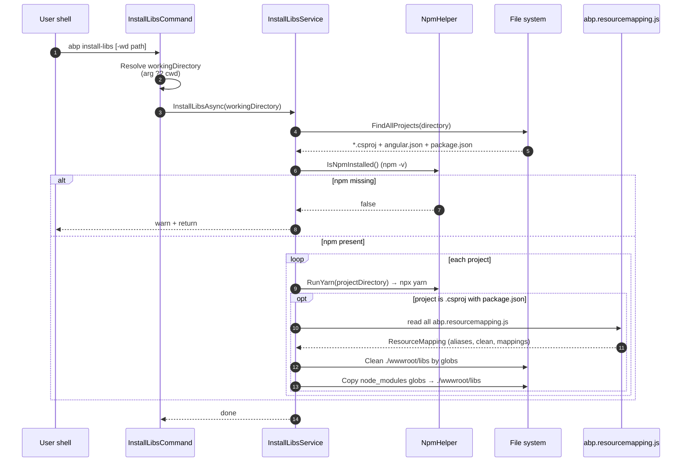

`abp install-libs` is the bridge between the JavaScript ecosystem and an ABP web project's static asset folder. For each project it finds under the working directory it runs `npx yarn` to populate `node_modules`, then — for .NET web projects only — reads every `abp.resourcemapping.js` file under that project and copies the matched files from `node_modules` into `wwwroot/libs` according to the configured globs. This page documents the command flags, the `IInstallLibsService` contract, the default implementation's project-discovery and copy algorithm, and the shape of the `abp.resourcemapping.js` config consumed by it.

<Note>
Source-of-truth files cited throughout:

- `framework/src/Volo.Abp.Cli.Core/Volo/Abp/Cli/Commands/InstallLibsCommand.cs`
- `framework/src/Volo.Abp.Cli.Core/Volo/Abp/Cli/LIbs/IInstallLibsService.cs` (note the `LIbs` folder typo — it exists in the real repo)
- `framework/src/Volo.Abp.Cli.Core/Volo/Abp/Cli/LIbs/InstallLibsService.cs`
- `framework/src/Volo.Abp.Cli.Core/Volo/Abp/Cli/LIbs/ResourceMapping.cs`
- `framework/src/Volo.Abp.Cli.Core/Volo/Abp/Cli/LIbs/FileMatchResult.cs`
- `framework/src/Volo.Abp.Cli.Core/Volo/Abp/Cli/Utils/NpmHelper.cs`
</Note>

## When you would run it

<CardGroup cols={2}>
  <Card title="After cloning" icon="download">
    A freshly cloned ABP solution does not include `node_modules` or `wwwroot/libs`. `abp install-libs` brings both up in one shot.
  </Card>
  <Card title="After adding a module" icon="cube">
    `abp add-module` may modify `package.json` and `abp.resourcemapping.js`. Re-run `install-libs` to bring new client assets into `wwwroot/libs`.
  </Card>
  <Card title="After updating ABP" icon="arrow-up">
    `abp update` bumps `@abp/*` npm packages. `install-libs` re-copies the updated CSS/JS into `wwwroot/libs` so the bundling pipeline sees them.
  </Card>
  <Card title="From scaffolding" icon="bolt">
    The `new` and project-creation flows invoke `install-libs` automatically unless `-sib|--skip-installing-libs` is passed.
  </Card>
</CardGroup>

## Command surface

`InstallLibsCommand` is a thin `IConsoleCommand`: it parses one option, validates the directory exists, and delegates to `IInstallLibsService.InstallLibsAsync`.

```csharp InstallLibsCommand.cs
public class InstallLibsCommand : IConsoleCommand, ITransientDependency
{
    public const string Name = "install-libs";

    protected IInstallLibsService InstallLibsService { get; }

    public async Task ExecuteAsync(CommandLineArgs commandLineArgs)
    {
        var workingDirectoryArg = commandLineArgs.Options.GetOrNull(
            Options.WorkingDirectory.Short,
            Options.WorkingDirectory.Long
        );

        var workingDirectory = workingDirectoryArg ?? Directory.GetCurrentDirectory();

        if (!Directory.Exists(workingDirectory))
        {
            throw new CliUsageException(
                "Specified directory does not exist." +
                Environment.NewLine + Environment.NewLine +
                GetUsageInfo()
            );
        }

        await InstallLibsService.InstallLibsAsync(workingDirectory);
    }

    public static class Options
    {
        public static class WorkingDirectory
        {
            public const string Short = "wd";
            public const string Long  = "working-directory";
        }
    }
}
```

### Flags

| Flag | Maps to | Default | Behavior |
| --- | --- | --- | --- |
| `-wd <path>` | `Options.WorkingDirectory.Short` | `Directory.GetCurrentDirectory()` | Root folder to recursively scan for projects. |
| `--working-directory <path>` | `Options.WorkingDirectory.Long` | same as above | Long form of the same option. |

<Tip>
The command class declares only `-wd/--working-directory`. Some documentation and shell aliases also reference a `-d/--directory` short form — that pair is **not** parsed by `InstallLibsCommand`. Use `-wd` or `--working-directory` to be safe. If the path does not exist the command throws `CliUsageException` and prints the usage block from `GetUsageInfo()`.
</Tip>

### Short description (shown in `abp help`)

```csharp
public static string GetShortDescription()
{
    return "Install NPM Packages for MVC / Razor Pages and Blazor Server UI types.";
}
```

## The `IInstallLibsService` contract

```csharp IInstallLibsService.cs
namespace Volo.Abp.Cli.LIbs;

public interface IInstallLibsService
{
    Task InstallLibsAsync(string directory);
}
```

One method, one input — the working directory. The default implementation `InstallLibsService` is `ITransientDependency`-registered, so you can swap it in your own CLI hosting by replacing the registration. Anything that scans a tree and produces `wwwroot/libs` output is contract-conformant.

## What the default `InstallLibsService` actually does



### Step 1 — discover projects

`FindAllProjects(directory)` walks the tree with `SearchOption.AllDirectories` and collects three kinds of project markers, skipping a fixed exclude list:

```csharp InstallLibsService.cs
private readonly static List<string> ExcludeDirectory = new List<string>()
{
    "node_modules",
    ".git",
    ".idea",
    "_templates",
    Path.Combine("bin", "debug"),
    Path.Combine("obj", "debug")
};
```

The matchers, in order:

<Steps>
  <Step title="C# web projects">
    `*.csproj` files that sit next to a `package.json` and whose contents reference one of:
    - `Microsoft.NET.Sdk.Web`
    - `Microsoft.NET.Sdk.Razor`
    - `Microsoft.NET.Sdk.BlazorWebAssembly`

    These are MVC / Razor Pages, Razor Class Libraries with client assets, and Blazor projects.
  </Step>
  <Step title="Angular workspaces">
    Any `angular.json` outside the exclude list. The whole folder is treated as a Yarn workspace — no resource-mapping copy step runs.
  </Step>
  <Step title="JavaScript framework projects">
    `package.json` files that are **not** already covered by an `angular.json` sibling or a `*.csproj` sibling. Each one is parsed and classified by dependency presence:

    | Dependency seen | Detected type |
    | --- | --- |
    | `react-native` | `ReactNative` (takes priority over plain React) |
    | `next` | `NextJs` |
    | `vue` | `Vue` |
    | `react` | `React` |
    | none of the above | `None` (skipped) |
  </Step>
</Steps>

Project paths are sorted alphabetically before processing.

### Step 2 — check `npm` is on PATH

Before doing anything else, the service verifies `npm` is installed:

```csharp NpmHelper.cs
public bool IsNpmInstalled()
{
    var output = CmdHelper.RunCmdAndGetOutput("npm -v").Trim();
    var outputLines = output.Split(new[] { '\r', '\n' }, StringSplitOptions.RemoveEmptyEntries);

    return outputLines.Any(ol => SemanticVersion.TryParse(ol, out _));
}
```

If `npm -v` does not produce a parseable SemVer, the service logs `NPM is not installed, visit https://nodejs.org/en/download/ and install NPM` and returns. **No** project is processed in that case.

<Note>
`InstallLibsService` calls `RunYarn`, which executes `npx yarn`. That means yarn does **not** need to be globally installed — `npx` resolves it from the npm registry on demand. The older `RunNpmInstall` / `NpmInstallPackage` helpers are marked `[Obsolete]` for exactly this reason.
</Note>

### Step 3 — per-project actions

```csharp InstallLibsService.cs (excerpt)
foreach (var projectPath in projectPaths)
{
    var projectDirectory = Path.GetDirectoryName(projectPath);

    // angular
    if (projectPath.EndsWith("angular.json"))
    {
        NpmHelper.RunYarn(projectDirectory);
    }

    // MVC or BLAZOR SERVER
    if (projectPath.EndsWith(".csproj"))
    {
        var packageJsonFilePath = Path.Combine(Path.GetDirectoryName(projectPath), "package.json");
        if (!File.Exists(packageJsonFilePath)) { continue; }

        NpmHelper.RunYarn(projectDirectory);
        await CleanAndCopyResources(projectDirectory);
    }

    // JavaScript frameworks (React Native, React, Vue, Next.js)
    if (projectPath.EndsWith("package.json"))
    {
        var frameworkType = DetectFrameworkTypeFromPackageJson(projectPath);
        if (frameworkType != JavaScriptFrameworkType.None)
        {
            NpmHelper.RunYarn(projectDirectory);
        }
    }
}
```

Key invariants:

- **Only `.csproj` projects** trigger `CleanAndCopyResources`. Angular / React / Vue / Next.js projects only get a yarn install — their build pipelines own their own asset placement.
- A `.csproj` without a sibling `package.json` is silently skipped (`continue`).
- `RunYarn(directory)` is `CmdHelper.RunCmd("npx yarn", directory)` — equivalent to running `npx yarn install` interactively in that folder. Yarn honours the project's own `yarn.lock` / `package-lock.json` semantics.

### Step 4 — clean and copy via `abp.resourcemapping.js`

```csharp InstallLibsService.cs (excerpt)
private async Task CleanAndCopyResources(string fileDirectory)
{
    var mappingFiles = Directory.GetFiles(fileDirectory, "abp.resourcemapping.js", SearchOption.AllDirectories);
    var resourceMapping = new ResourceMapping
    {
        Clean = new List<string> { LibsDirectory } // "./wwwroot/libs"
    };

    foreach (var mappingFile in mappingFiles)
    {
        var mappingFileContent = await File.ReadAllTextAsync(mappingFile);

        // System.Text.Json doesn't support property names without quotes.
        var mapping = Newtonsoft.Json.JsonConvert.DeserializeObject<ResourceMapping>(
            mappingFileContent
                .Replace("module.exports", string.Empty)
                .Replace("=", string.Empty)
                .Trim()
                .TrimEnd(';'));

        mapping.ReplaceAliases();

        mapping.Clean.ForEach(c => resourceMapping.Clean.AddIfNotContains(c));
        mapping.Aliases.ToList().ForEach(x =>
            resourceMapping.Aliases.AddIfNotContains(new KeyValuePair<string, string>(x.Key, x.Value)));
        mapping.Mappings.ToList().ForEach(x =>
            resourceMapping.Mappings.AddIfNotContains(new KeyValuePair<string, string>(x.Key, x.Value)));
    }

    EnsureLibsFolderExists(fileDirectory, LibsDirectory);
    CleanDirsAndFiles(fileDirectory, resourceMapping);
    CopyResourcesToLibs(fileDirectory, resourceMapping);
}
```

The parsing trick deserves attention: `abp.resourcemapping.js` is a CommonJS module, but ABP doesn't run JavaScript. Instead it strips `module.exports`, the `=` sign, and the trailing `;`, then asks **Newtonsoft.Json** to parse what's left. Newtonsoft accepts unquoted property names; that is exactly why the comment notes `System.Text.Json doesn't support the property name without quotes`. The implication for you: the file must be a single object literal — no computed expressions, no helper imports, no template strings.

#### Constant: target folder

```csharp
public const string LibsDirectory = "./wwwroot/libs";
```

This path is relative to the .csproj directory and is hardcoded — it cannot be reconfigured by the mapping file (only filtered/augmented through globs).

## The `abp.resourcemapping.js` file

`ResourceMapping` is the deserialization target:

```csharp ResourceMapping.cs
public class ResourceMapping
{
    public Dictionary<string, string> Aliases { get; set; }
    public List<string> Clean { get; set; }
    public Dictionary<string, string> Mappings { get; set; }

    public ResourceMapping()
    {
        Aliases = new Dictionary<string, string>
        {
            {"@node_modules", "./node_modules"},
            {"@libs",         "./wwwroot/libs"},
        };
        Clean = new List<string>();
        Mappings = new Dictionary<string, string>();
    }
}
```

A minimal real file, copied verbatim from `modules/basic-theme/test/Volo.Abp.AspNetCore.Mvc.UI.Bootstrap.Demo/abp.resourcemapping.js`:

```javascript abp.resourcemapping.js
module.exports = {
    aliases: { //TODO: Make some aliases default: node_modules, libs
        "@node_modules": "./node_modules",
        "@libs":         "./wwwroot/libs"
    },
    clean: [
        "@libs"
    ],
    mappings: {
        "@node_modules/highlight.js/**/*.*": "@libs/highlight.js/"
    }
}
```

### Field semantics

| Field | Type | Default | Purpose |
| --- | --- | --- | --- |
| `aliases` | `Dictionary<string,string>` | `{ "@node_modules": "./node_modules", "@libs": "./wwwroot/libs" }` | String-substitution macros applied to `clean` entries and to both sides of `mappings`. |
| `clean` | `List<string>` | Service prepends `"./wwwroot/libs"` automatically. | Glob patterns whose matched files are deleted before copying. |
| `mappings` | `Dictionary<string,string>` | empty | Source glob → destination directory. Source is typically `@node_modules/<pkg>/**/*.*`; destination is typically `@libs/<pkg>/`. |

### Alias expansion

`ResourceMapping.ReplaceAliases()` runs once per mapping file before patterns are evaluated:

```csharp ResourceMapping.cs
public void ReplaceAliases()
{
    for (var i = 0; i < Mappings.Count; i++)
    {
        var mapping = Mappings.ElementAt(i);
        Mappings.Remove(mapping.Key);

        var key   = mapping.Key;
        var value = mapping.Value;

        foreach (var alias in Aliases)
        {
            key   = key  .Replace(alias.Key, alias.Value);
            value = value.Replace(alias.Key, alias.Value);
        }

        Mappings[key] = value;
    }

    for (var i = 0; i < Clean.Count; i++)
    {
        foreach (var alias in Aliases)
        {
            Clean[i] = Clean[i].Replace(alias.Key, alias.Value);
        }
    }
}
```

So `"@node_modules/highlight.js/**/*.*"` becomes `"./node_modules/highlight.js/**/*.*"` and `"@libs/highlight.js/"` becomes `"./wwwroot/libs/highlight.js/"` before any I/O happens.

### Multiple mapping files

Inside one .csproj project, `Directory.GetFiles(fileDirectory, "abp.resourcemapping.js", SearchOption.AllDirectories)` collects every mapping file under the project. Their `clean`, `aliases`, and `mappings` are merged into a single `ResourceMapping` instance via `AddIfNotContains`. Duplicates are deduplicated by key — first writer wins.

## Glob matching

`InstallLibsService.FindFiles` uses `Microsoft.Extensions.FileSystemGlobbing.Matcher`:

```csharp InstallLibsService.cs (excerpt)
private List<FileMatchResult> FindFiles(string directory, params string[] patterns)
{
    var matcher = new Matcher();

    foreach (var pattern in patterns)
    {
        if (pattern.StartsWith("!"))
        {
            matcher.AddExclude(NormalizeGlob(pattern).TrimStart('!'));
        }
        else
        {
            matcher.AddInclude(NormalizeGlob(pattern));
        }
    }

    var result = matcher.Execute(new DirectoryInfoWrapper(new DirectoryInfo(directory)));

    return result.Files
        .Select(x => new FileMatchResult(Path.Combine(directory, x.Path), x.Stem))
        .ToList();
}

private string NormalizeGlob(string pattern)
{
    pattern = pattern.Replace("//", "/");

    if (!Path.HasExtension(pattern) && !pattern.EndsWith("*"))
    {
        return pattern.EnsureEndsWith('/') + "**";
    }

    return pattern;
}
```

Two patterns to internalize:

1. **Bang-prefix exclude.** A pattern starting with `!` becomes a Matcher exclude — useful in `clean` to protect a subfolder of `wwwroot/libs`, e.g. `"!./wwwroot/libs/my-custom/**"`.
2. **Implicit `/**` for directory-only patterns.** If a pattern has no file extension and does not already end in `*`, the service appends `/**`. So `"@libs"` (which expands to `"./wwwroot/libs"`) becomes `"./wwwroot/libs/**"` — a recursive wipe.

The result type is `FileMatchResult`:

```csharp FileMatchResult.cs
public class FileMatchResult
{
    public string Path { get; }
    public string Stem { get; }
}
```

`Stem` is the portion of the matched path **after** the first wildcard segment. That stem is what becomes the relative path inside the destination — so `@node_modules/highlight.js/styles/atom-one-dark.css` matched by `@node_modules/highlight.js/**/*.*` produces stem `styles/atom-one-dark.css`, which is copied to `./wwwroot/libs/highlight.js/styles/atom-one-dark.css`.

## Clean and copy details

### Cleaning

```csharp InstallLibsService.cs (excerpt)
private void CleanDirsAndFiles(string directory, ResourceMapping resourceMapping)
{
    var files = FindFiles(directory, resourceMapping.Clean.ToArray());

    foreach (var file in files)
    {
        if (File.Exists(file.Path))
        {
            File.Delete(file.Path);
        }
    }

    var directoryInfos = Directory.GetDirectories(
        Path.Combine(directory, resourceMapping.Clean.First()),
        "*",
        SearchOption.AllDirectories);

    directoryInfos.Reverse();
    foreach (var directoryInfo in directoryInfos)
    {
        if (!Directory.EnumerateFileSystemEntries(directoryInfo).Any())
        {
            Directory.Delete(directoryInfo);
        }
    }
}
```

Two passes:

1. Every file matched by any `clean` glob is deleted.
2. Every now-empty subdirectory under `resourceMapping.Clean.First()` (always `./wwwroot/libs` because the service seeds it) is removed bottom-up.

The result is a `wwwroot/libs` that is empty of all `clean`-matched content but preserves any subtree explicitly excluded with `!`.

### Copying

```csharp InstallLibsService.cs (excerpt)
private void CopyResourcesToLibs(string fileDirectory, ResourceMapping resourceMapping)
{
    foreach (var mapping in resourceMapping.Mappings)
    {
        var destPath = Path.Combine(fileDirectory, mapping.Value);
        var files    = FindFiles(fileDirectory, mapping.Key);

        foreach (var file in files)
        {
            var destFilePath = Path.Combine(destPath, file.Stem);
            if (File.Exists(destFilePath))
            {
                continue;
            }

            Directory.CreateDirectory(Path.GetDirectoryName(destFilePath));
            File.Copy(file.Path, destFilePath);
        }
    }
}
```

Two invariants to remember:

- **Existing destinations are preserved.** `if (File.Exists(destFilePath)) continue;` — `install-libs` never overwrites. Combined with the clean step, the net effect is "clean what's mapped, then copy in fresh files." If you hand-edit a file under `wwwroot/libs` and it is **not** in any `clean` pattern, it will survive forever.
- **Destination directories are created on demand.** No mkdir is performed up front.

## End-to-end example

For an MVC project at `src/MyApp.Web/` with the demo mapping above, on a clean checkout:

```bash terminal
cd src/MyApp.Web
abp install-libs
```

What happens:

```mermaid
flowchart TD
    A[FindAllProjects on src/MyApp.Web] --> B{has package.json next to .csproj?}
    B -- yes --> C[npx yarn → populates ./node_modules]
    C --> D[Read abp.resourcemapping.js<br/>strip module.exports / = / ;]
    D --> E[Newtonsoft.Json deserialize → ResourceMapping]
    E --> F[ReplaceAliases<br/>@node_modules → ./node_modules<br/>@libs → ./wwwroot/libs]
    F --> G[CleanDirsAndFiles<br/>delete files matching clean globs<br/>remove empty subdirs of ./wwwroot/libs]
    G --> H[CopyResourcesToLibs<br/>for each mapping copy files<br/>skip if dest already exists]
    H --> I[wwwroot/libs ready for bundling]
```

The freshly populated `wwwroot/libs/highlight.js/...` is then consumed by the MVC bundling pipeline.

## Working-directory layouts

<CardGroup cols={2}>
  <Card title="Single project" icon="folder">
    Run from inside `src/MyApp.Web/`. The current directory is the discovery root and the only `.csproj` found is the local one.
  </Card>
  <Card title="Solution root" icon="folder-tree">
    Run from the `.sln` directory. The service finds every `.csproj` with a sibling `package.json` and processes them all in alphabetical order.
  </Card>
  <Card title="Explicit path" icon="terminal">
    `abp install-libs -wd ./aspnet-core` — useful in tiered solutions where the .NET projects live under a sibling folder of the Angular workspace.
  </Card>
  <Card title="Monorepo with JS apps" icon="diagram-project">
    Angular, Next.js, Vue, React and React-Native subprojects all get a `yarn` install; only `.csproj` projects also get the `wwwroot/libs` copy step.
  </Card>
</CardGroup>

## Failure modes and diagnostics

| Symptom | Root cause | Fix |
| --- | --- | --- |
| `Specified directory does not exist.` (`CliUsageException`) | `-wd` argument points at a missing path. | Pass a real path, or omit the flag to use `Directory.GetCurrentDirectory()`. |
| `No project found in the directory.` (logged error, exit 0) | `FindAllProjects` returned an empty list. The exclude list filtered everything, no `package.json` next to `.csproj`, or you're above the solution root. | Run from inside the solution, or pass `-wd` to the right folder. |
| `NPM is not installed, visit https://nodejs.org/en/download/ and install NPM` | `npm -v` did not produce a parseable SemVer. | Install Node.js so that `npm` is on PATH. The check is **per service run**, not per project. |
| `yarn` step fails | `npx yarn` returned non-zero. ABP does not currently abort the loop; subsequent projects still attempt. | Inspect the project's `package.json` for unresolvable dependencies. |
| Files do not appear in `wwwroot/libs` | The `.csproj` had no sibling `package.json`, or the `.csproj` SDK is not Web/Razor/BlazorWebAssembly, or the mapping glob did not match. | Verify the project's SDK string and that `abp.resourcemapping.js` exists somewhere under it. |
| Old files lingering in `wwwroot/libs` | They are not matched by any `clean` glob. | Add an explicit `clean` entry, e.g. `"@libs/old-package/**"`. |
| File not overwritten by an update | `CopyResourcesToLibs` skips when the destination already exists. | Ensure the file is in a `clean` glob so it is deleted before the copy pass. |

## Calling the service directly

Because the command is a thin wrapper, you can invoke the same logic from a custom CLI host or a build task:

```csharp Programmatic use
public class MyBuildTask
{
    private readonly IInstallLibsService _installLibs;

    public MyBuildTask(IInstallLibsService installLibs)
    {
        _installLibs = installLibs;
    }

    public Task RunAsync(string solutionRoot)
        => _installLibs.InstallLibsAsync(solutionRoot);
}
```

Replacing the implementation is a normal ABP DI swap — register your own `IInstallLibsService` with `ITransientDependency` (or via `Replace` in `ConfigureServices`) and the `InstallLibsCommand` will pick it up.

## Relationship with bundling

`abp install-libs` only places **files** into `wwwroot/libs`. It does **not**:

- Generate any bundle manifest.
- Touch `appsettings.json`.
- Modify Razor views.

The downstream consumer is the MVC UI bundling pipeline configured via `AbpBundlingOptions`. The standard ABP flow is:

1. `abp install-libs` — populate `wwwroot/libs`.
2. `abp bundle` — produce static bundle files for production.
3. Application start — ASP.NET Core serves the bundles or, in development, the dynamic bundling middleware serves the raw `wwwroot/libs` files.

See [`/aspnetcore/mvc-ui-bundling`](/aspnetcore/mvc-ui-bundling) for how those bundles reference the files this command provisions.

## Cross-references

<CardGroup cols={3}>
  <Card title="CLI overview" icon="circle-info" href="/cli/overview">
    The CLI's startup pipeline, module set, and how commands are resolved from `args[]`.
  </Card>
  <Card title="Command reference" icon="table-list" href="/cli/commands">
    Full table of `abp` sub-commands, including `install-libs` row and shared flags.
  </Card>
  <Card title="MVC UI bundling" icon="boxes-packing" href="/aspnetcore/mvc-ui-bundling">
    How `wwwroot/libs` content is composed into script and style bundles.
  </Card>
</CardGroup>

## Quick reference

```bash terminal
# Run in current directory
abp install-libs

# Run against an explicit folder
abp install-libs -wd ./aspnet-core
abp install-libs --working-directory ./aspnet-core

# Skip it during project creation
abp new Acme.BookStore --skip-installing-libs
```

```json Project layout the command expects (for the copy step)
{
  "src/MyApp.Web/": {
    "MyApp.Web.csproj":         "<Project Sdk=\"Microsoft.NET.Sdk.Web\">…",
    "package.json":             "{ \"dependencies\": { … } }",
    "abp.resourcemapping.js":   "module.exports = { aliases, clean, mappings }",
    "wwwroot/libs/":            "← populated by install-libs"
  }
}
```

<Note>
The folder on disk is literally `Volo/Abp/Cli/LIbs/` (capital `I`, lowercase `b`, lowercase `s`) and the namespace is `Volo.Abp.Cli.LIbs`. This is a long-standing typo in the ABP source tree — preserve the casing when you `grep` for these types.
</Note>
