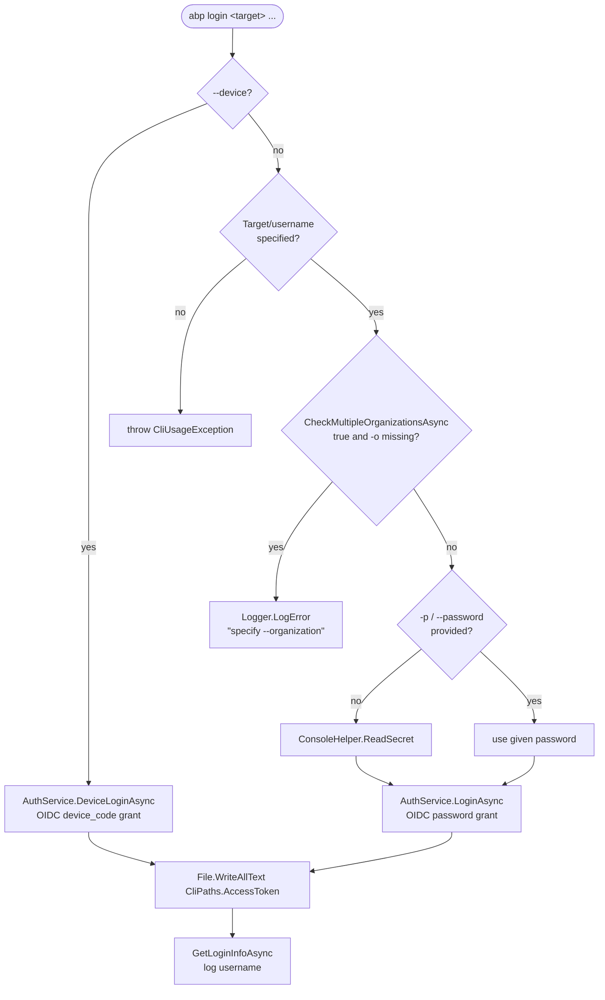
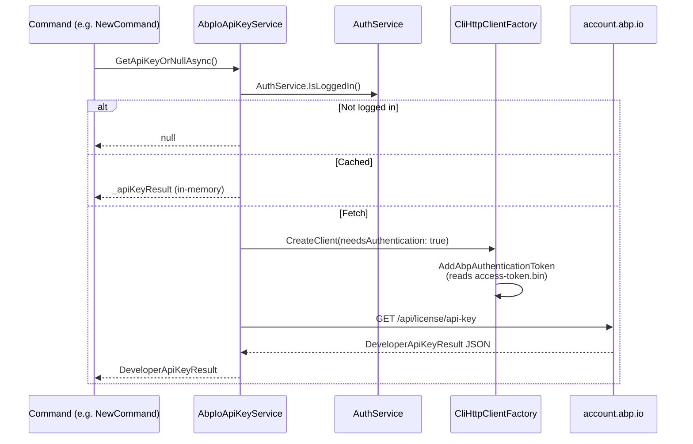
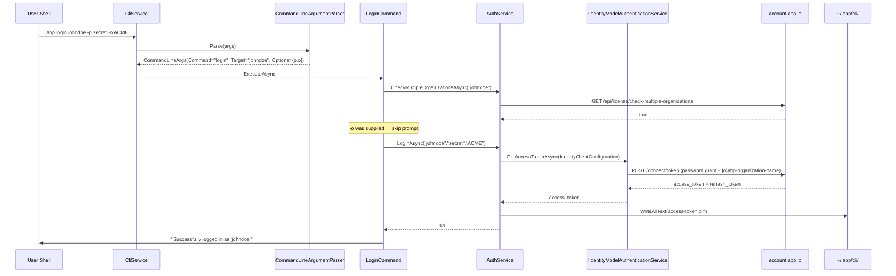

The `login`, `login-info` and `logout` commands all dispatch through a single `AuthService` that talks to `https://account.abp.io/`. Authentication tokens unlock three downstream capabilities: writing the user's commercial NuGet API key into project templates, downloading source code, and starting the `abp mcp` server. This page documents every file the auth flow touches, every endpoint it calls, and how the cached `DeveloperApiKeyResult` is consulted later by the version checker.

<Info>
All three commands are registered in `AbpCliCoreModule.ConfigureServices` and resolved via the standard `AbpCliOptions.Commands` dictionary — see [/cli/overview](/cli/overview) and [/cli/commands](/cli/commands) for the dispatcher.
</Info>

## Files and endpoints at a glance

| Concern | Source | Notes |
| --- | --- | --- |
| Command class | `Volo/Abp/Cli/Commands/LoginCommand.cs` | Password and device-code branches |
| Command class | `Volo/Abp/Cli/Commands/LoginInfoCommand.cs` | Pretty-prints `LoginInfo` |
| Command class | `Volo/Abp/Cli/Commands/LogoutCommand.cs` | Calls `AuthService.LogoutAsync` |
| Service | `Volo/Abp/Cli/Auth/AuthService.cs` | OIDC client, file persistence, exception decoding |
| DTO | `Volo/Abp/Cli/Auth/LoginInfo.cs` | `Name`, `Surname`, `Username`, `EmailAddress`, `Organization`, `HasSourceCodeAccess` |
| Licensing client | `Volo/Abp/Cli/Licensing/AbpIoApiKeyService.cs` | Fetches and in-memory caches the developer API key |
| Licensing DTO | `Volo/Abp/Cli/Licensing/DeveloperApiKeyResult.cs` | `ApiKey`, `LicenseType`, `LicenseEndTime`, `ErrorType`… |
| Licensing enum | `Volo/Abp/Cli/Licensing/LicenseType.cs` | `Personal` / `Team` / `Business` / `Enterprise` (+ discounted) |
| Path constants | `Volo/Abp/Cli/CliPaths.cs` | `AccessToken`, `Lic`, `Root` |
| URL constants | `Volo/Abp/Cli/CliUrls.cs` | `AccountAbpIo`, `NuGetRootPath`, switchable to local dev URLs |
| Auth header glue | `Volo/Abp/Cli/Http/CliHttpClientExtensions.cs` | `AddAbpAuthenticationToken` reads `access-token.bin` and calls `SetBearerToken` |

The persisted token file is **always** at `~/.abp/cli/access-token.bin` (Windows: `%USERPROFILE%\.abp\cli\access-token.bin`). The cached license blob is intentionally given an obfuscated filename built from ASCII bytes:

```csharp
// CliPaths.cs
public static string Lic => Path.Combine(
    Path.GetTempPath(),
    Encoding.ASCII.GetString(new byte[] { 65, 98, 112, 76, 105, 99, 101, 110, 115, 101, 46, 98, 105, 110 })
); // -> "AbpLicense.bin" under the OS temp directory
```

`AuthService.IsLoggedIn()` is a single `File.Exists(CliPaths.AccessToken)` check — every other CLI subsystem (including `CliHttpClientExtensions.AddAbpAuthenticationToken`, `AbpIoApiKeyService`, `McpCommand.ValidateLicenseAsync`) gates itself on that file.

## `abp login` — two paths through one command

`LoginCommand.ExecuteAsync` branches on whether `--device` was specified.



### Password grant

`AuthService.LoginAsync` builds a standard `IdentityClientConfiguration` against `CliUrls.AccountAbpIo`:

```csharp
// AuthService.cs
var configuration = new IdentityClientConfiguration(
    CliUrls.AccountAbpIo,
    "abpio offline_access",
    "abp-cli",
    null,
    OidcConstants.GrantTypes.Password,
    userName,
    password
);

if (!organizationName.IsNullOrWhiteSpace())
{
    configuration["[o]abp-organization-name"] = organizationName; // protocol parameter
}

var accessToken = await AuthenticationService.GetAccessTokenAsync(configuration);

if (!Directory.Exists(CliPaths.Root))
{
    Directory.CreateDirectory(CliPaths.Root);
}
File.WriteAllText(CliPaths.AccessToken, accessToken, Encoding.UTF8);
```

The `IIdentityModelAuthenticationService` doing the OIDC handshake comes from the framework's `AbpIdentityModelModule` (this `AbpCliCoreModule` depends on it). The CLI does **not** call the token endpoint directly — Duende's `IdentityModel` library does.

The custom claim prefix `[o]` instructs `IdentityModelAuthenticationService` to forward the value as an `additional protocol parameter` on the token request. The server uses it to disambiguate accounts that belong to more than one organization (see `CheckMultipleOrganizationsAsync` below).

### Device-code grant

When `--device` is set, the command skips the username/password prompt entirely and calls `AuthService.DeviceLoginAsync`, which builds the same `IdentityClientConfiguration` with `OidcConstants.GrantTypes.DeviceCode`. The OIDC library handles the polling and prints the device code / verification URL to the console.

```csharp
public async Task DeviceLoginAsync()
{
    var configuration = new IdentityClientConfiguration(
        CliUrls.AccountAbpIo,
        "abpio offline_access",
        "abp-cli",
        null,
        OidcConstants.GrantTypes.DeviceCode
    );

    var accessToken = await AuthenticationService.GetAccessTokenAsync(configuration);
    File.WriteAllText(CliPaths.AccessToken, accessToken, Encoding.UTF8);
}
```

<Tip>
Device-code is the path the login error handler nudges users toward when the server returns `RequiresTwoFactor`: `LoginCommand.LogCliError` logs *"Two factor authentication is enabled for your account. Please use `abp login --device` command to login."*.
</Tip>

### Multi-organization gate

Before sending credentials, `LoginCommand.HasMultipleOrganizationAndThisNotSpecified` calls `AuthService.CheckMultipleOrganizationsAsync`, which hits:

```text
GET https://account.abp.io/api/license/check-multiple-organizations?username=<target>
```

If the response is `true` and the user did not pass `-o|--organization`, the command logs an error and returns *without* attempting login. This avoids picking the wrong tenant silently.

### Server-side error decoding

If the OIDC call throws, `LoginCommand.LogCliError` tries three transformations before falling back to `ex.Message`:

1. Literal `"Invalid username or password"` → friendly message.
2. Literal `"RequiresTwoFactor"` → 2FA suggestion.
3. HTML page containing `error-page-container` → regex `<h2 class="text-danger.*">(.*?)</h2>` extracts the surfaced error.

The HTML branch exists because some reverse-proxy 4xx responses come back as full pages.

```csharp
// LoginCommand.cs (excerpt)
var error = Regex.Match(decodedHtml,
    @"<h2\ class=""text-danger.*"">(.*?)</h2>",
    RegexOptions.IgnoreCase | RegexOptions.IgnorePatternWhitespace |
    RegexOptions.Singleline | RegexOptions.Multiline);
```

## `abp login-info`

`LoginInfoCommand` is a thin wrapper over `AuthService.GetLoginInfoAsync()`:

```csharp
public async Task ExecuteAsync(CommandLineArgs commandLineArgs)
{
    if (!AuthService.IsLoggedIn())
    {
        Logger.LogError("You are not logged in.");
        return;
    }

    var loginInfo = await AuthService.GetLoginInfoAsync();
    // ... prints Name, Surname, Username, EmailAddress, Organization
}
```

`AuthService.GetLoginInfoAsync` calls `GET {AccountAbpIo}api/license/login-info` with the bearer token attached by `CliHttpClientFactory.CreateClient(needsAuthentication: true)` and deserializes the result into `LoginInfo`. The `HasSourceCodeAccess` boolean on the DTO is used by other commands (e.g. `GetSourceCommand`) to decide whether the user is entitled to clone module/template source.

## `abp logout`

```csharp
public async Task LogoutAsync()
{
    string accessToken = null;
    if (File.Exists(CliPaths.AccessToken))
    {
        accessToken = File.ReadAllText(CliPaths.AccessToken);
        File.Delete(CliPaths.AccessToken);
    }

    if (File.Exists(CliPaths.Lic))
    {
        if (!string.IsNullOrWhiteSpace(accessToken))
        {
            await LogoutAsync(accessToken); // POST account.abp.io/api/license/logout { token }
        }
        File.Delete(CliPaths.Lic);
    }
}
```

Notable behaviour:

- The token is **read before deletion** so it can be revoked server-side.
- The server-side logout endpoint is `CliConsts.LogoutUrl` (`{AccountAbpIo}api/license/logout`). Failure logs a warning but does not throw — local cleanup always wins.
- Both `access-token.bin` *and* the cached `AbpLicense.bin` are removed, so the next `abp` invocation re-fetches a license on demand.

## Licensing: from token to NuGet API key

The commercial NuGet feed is private. Templates need a developer-specific API key embedded so generated solutions can restore `Volo.*` packages. `AbpIoApiKeyService` is the bridge.



### Cache scope

`AbpIoApiKeyService` is `ITransientDependency` but holds an instance field `_apiKeyResult`, so the cache lives only for the lifetime of the current command invocation. To force a refresh inside one command, pass `invalidateCache: true`:

```csharp
public async Task<DeveloperApiKeyResult> GetApiKeyOrNullAsync(bool invalidateCache = false)
{
    if (!AuthService.IsLoggedIn()) { return null; }
    if (invalidateCache) { _apiKeyResult = null; }
    if (_apiKeyResult != null) { return _apiKeyResult; }

    var url = $"{CliUrls.AccountAbpIo}api/license/api-key";
    // ... GetHttpResponseMessageWithRetryAsync (Polly: 2s, 4s, 7s)
    return JsonSerializer.Deserialize<DeveloperApiKeyResult>(responseContent);
}
```

### `DeveloperApiKeyResult` fields

| Property | Use |
| --- | --- |
| `ApiKey` | Token segment injected into NuGet URLs — see `CliUrls.GetNuGetServiceIndexUrl(apiKey)` |
| `HasActiveLicense` | Gate for commands like `abp mcp` (`McpCommand.ValidateLicenseAsync`) |
| `OrganizationName` | Stamped into generated solutions and used for telemetry |
| `LicenseEndTime` / `LicenseStartTime` | Expiry check — `McpCommand` rejects if `LicenseEndTime < UtcNow` |
| `CanDownloadSourceCode` | Used by `GetSourceCommand` and the project builder |
| `LicenseCode` | Replaces `CliConsts.LicenseCodePlaceHolder` (`<LICENSE_CODE/>`) in template files |
| `LicenseType` | `Personal`, `Team`, `Business`, `Enterprise` (+ `_Discounted` variants) |
| `IsTrialLicense` | Triggers trial-specific messaging |
| `ErrorType` | `NotAuthenticated`, `NotMemberOfAnOrganization`, `NoActiveLicense`, `NotDeveloperOfTheOrganization` |
| `ErrorMessage` | Free-form server text |

The NuGet URL helpers in `CliUrls` show why the key matters:

```csharp
public static string GetNuGetServiceIndexUrl(string apiKey)
    => $"{NuGetRootPath}{apiKey}/v3/index.json";

public static string GetNuGetPackageInfoUrl(string apiKey, string packageId)
    => $"{NuGetRootPath}{apiKey}/v3/package/{packageId}/index.json";
```

`NuGetRootPath` defaults to `https://nuget.abp.io/`. There are also dev overrides (`AccountAbpIoDevelopment`, `NuGetRootPathDevelopment`) that an internal smoke test rig can flip by assigning `CliUrls.AccountAbpIo = CliUrls.AccountAbpIoDevelopment` before construction — every other component reads through the property getter, so the swap is global.

## Bearer-token injection

Every CLI HTTP call that needs the user identity passes through `CliHttpClientFactory.CreateClient(needsAuthentication: true)`. That call into `CliHttpClientExtensions.AddAbpAuthenticationToken` reads the token from disk on every request:

```csharp
public static void AddAbpAuthenticationToken(this HttpClient httpClient)
{
    if (!AuthService.IsLoggedIn()) { return; }

    var accessToken = File.ReadAllText(CliPaths.AccessToken, Encoding.UTF8);
    if (!accessToken.IsNullOrEmpty())
    {
        httpClient.SetBearerToken(accessToken);
    }
}
```

`SetBearerToken` comes from `Duende.IdentityModel.Client` and writes `Authorization: Bearer <token>`. Because reads are not cached, a `logout` from another shell will be picked up on the next request without restarting any process.

<Warning>
The token is stored **in plaintext UTF-8** inside the user profile. There is no DPAPI/Keychain encryption. Treat `~/.abp/cli/access-token.bin` like an SSH key — file-system ACLs are the only protection.
</Warning>

## End-to-end sequence: `abp login johndoe`



## Interactions with other commands

Commands that depend on a valid login + license:

| Command | Behaviour without login | Behaviour without license |
| --- | --- | --- |
| `abp mcp` | `CliUsageException("Please log in with your account!")` | `CliUsageException(errorMessage)` from `DeveloperApiKeyResult.ErrorMessage` |
| `abp new` (commercial templates) | `AbpIoApiKeyService.GetApiKeyOrNullAsync` returns `null` → falls back to community feed | Templates miss `LicenseCode` substitution |
| `abp install-libs` (commercial themes) | NPM auth header missing | Fetching LeptonX packages may 401 |
| `abp get-source` | Refused | Refused (`HasSourceCodeAccess == false`) |
| `abp update` | Personal feed only | Pro packages skipped — see `CommercialPackages.IsCommercial` in [/cli/cli-core](/cli/cli-core) |

## Troubleshooting cheat sheet

<AccordionGroup>
<Accordion title="abp login hangs after password prompt">
The OIDC call uses the system HTTP proxy via `CliHttpClientHandler` (`Proxy = WebRequest.GetSystemWebProxy(); DefaultProxyCredentials = CredentialCache.DefaultCredentials`). Mis-configured corporate proxies cause the token request to stall until the 2-minute `CliHttpClientFactory.DefaultTimeout`.
</Accordion>
<Accordion title='"You have multiple organizations, please specify your organization"'>
Either your AbpIo account is a member of more than one organization or the server thinks so. Add `-o <org-slug>` (the URL slug, not the display name). This is enforced *before* the password hits the wire.
</Accordion>
<Accordion title="abp commands keep using the old organization after switching">
`logout` deletes `~/.abp/cli/access-token.bin` and `<temp>/AbpLicense.bin`. If only one is removed, `AbpIoApiKeyService` will pick the stale cached file. Always re-login *after* a clean `logout`.
</Accordion>
<Accordion title="HTTPS errors against the dev environment">
`CliUrls.AccountAbpIoDevelopment = https://localhost:44333/`. The default `CliHttpClientHandler` does **not** disable certificate validation — you must install your local dev cert or replace the handler when testing.
</Accordion>
</AccordionGroup>

## Related pages

- [/cli/overview](/cli/overview) — host wiring and command dispatcher
- [/cli/commands](/cli/commands) — full command catalogue
- [/cli/cli-core](/cli/cli-core) — `CliHttpClientFactory`, retry policy, `DeveloperApiKeyResult` cache plumbing
- [/cli/mcp-and-translate](/cli/mcp-and-translate) — first consumer that hard-requires `HasActiveLicense`
- [/auth/identity-model](/auth/identity-model) — the `AbpIdentityModelModule` providing `IIdentityModelAuthenticationService`
