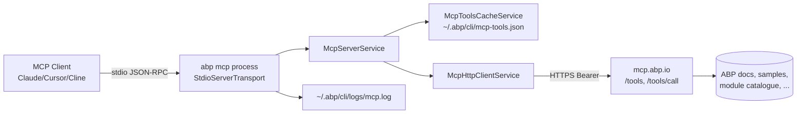
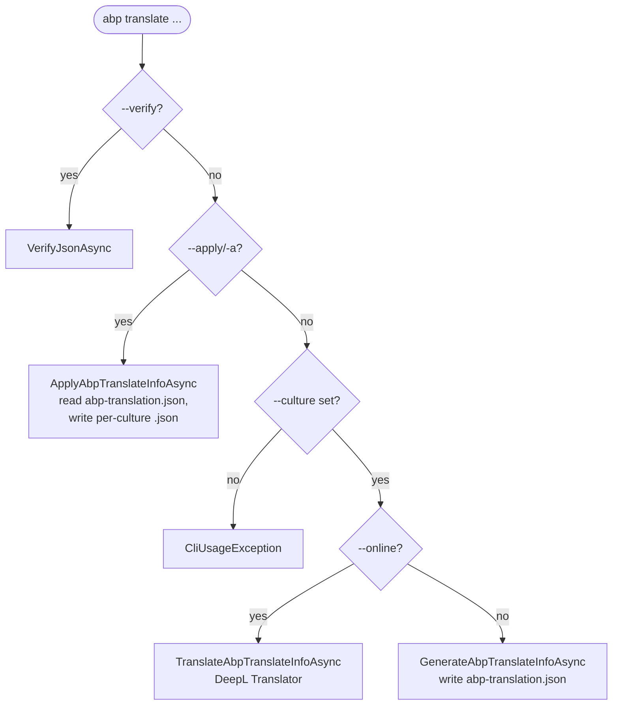

Three commands cluster around AI-assisted developer workflows: `abp mcp` exposes the ABP knowledge base to any Model Context Protocol client; `abp translate` scans a solution for ABP JSON localization files and shuttles them through DeepL or an interchange file; `abp prompt` is a registered-but-empty placeholder. This page covers each end-to-end from `ExecuteAsync` to the on-disk artefacts.

## Command sources

| Command | File | Lines |
| --- | --- | --- |
| `abp mcp` | `Volo/Abp/Cli/Commands/McpCommand.cs` | 196 |
| `abp translate` | `Volo/Abp/Cli/Commands/TranslateCommand.cs` | 648 |
| `abp prompt` | `Volo/Abp/Cli/Commands/PromptCommand.cs` | 34 |

Supporting services for `abp mcp` live in `Volo/Abp/Cli/Commands/Services/`: `McpServerService`, `McpHttpClientService`, `McpToolsCacheService`, `McpLogger`, `AbpMcpServerTool`.

## `abp mcp` — Model Context Protocol stdio server

`McpCommand` boots a local MCP server that AI clients (Claude Desktop, Cursor, Cline, etc.) launch as a child process. The server speaks JSON-RPC over stdio using `ModelContextProtocol.Server.McpServer` from the `ModelContextProtocol` NuGet package, but the actual tool implementations are *remote* — every tool call is forwarded to `https://mcp.abp.io/` over HTTPS.



### Entry point and gates

```csharp
// McpCommand.ExecuteAsync (simplified)
await ValidateLicenseAsync();                                // requires active license

if (option?.Equals("get-config", StringComparison.OrdinalIgnoreCase) == true)
{
    await PrintConfigurationAsync();                         // print JSON snippet and exit
    return;
}

await using var _ = _telemetryService.TrackActivityAsync(ActivityNameConsts.AbpCliCommandsMcp);

var isHealthy = await _mcpHttpClient.CheckServerHealthAsync();
if (!isHealthy)
{
    throw new CliUsageException(
        "Could not connect to ABP.IO MCP Server. " +
        "The MCP server requires a connection to fetch tool definitions. " +
        "Please check your internet connection and try again.");
}

await _mcpServerService.RunAsync(cts.Token);                 // blocks until Ctrl+C
```

`ValidateLicenseAsync` chains three checks:

```csharp
private async Task ValidateLicenseAsync()
{
    var loginInfo = await _authService.GetLoginInfoAsync();
    if (string.IsNullOrEmpty(loginInfo?.Organization))
        throw new CliUsageException("Please log in with your account!");

    var licenseResult = await _apiKeyService.GetApiKeyOrNullAsync();
    if (licenseResult == null || !licenseResult.HasActiveLicense)
        throw new CliUsageException(licenseResult?.ErrorMessage ?? "No active license found.");

    if (licenseResult.LicenseEndTime.HasValue && licenseResult.LicenseEndTime.Value < DateTime.UtcNow)
        throw new CliUsageException("Your license has expired. Please renew your license to use the MCP server.");
}
```

See [/cli/login-and-licensing](/cli/login-and-licensing) for `AuthService` and `IApiKeyService` details.

### `abp mcp get-config` — emit MCP client configuration

The `get-config` sub-target prints a JSON snippet that can be pasted into any MCP-aware client's settings file:

```csharp
private Task PrintConfigurationAsync()
{
    var config = new McpClientConfiguration
    {
        McpServers = new Dictionary<string, McpServerConfig>
        {
            ["abp"] = new McpServerConfig
            {
                Command = "abp",
                Args = new List<string> { "mcp" },
                Env = new Dictionary<string, string>()
            }
        }
    };
    // ... WriteIndented, CamelCase
    Console.WriteLine(json);
    return Task.CompletedTask;
}
```

Output:

```json
{
  "mcpServers": {
    "abp": {
      "command": "abp",
      "args": ["mcp"],
      "env": {}
    }
  }
}
```

### Tool registration via the remote catalogue

`McpServerService.RunAsync` registers tools *dynamically* — there are no static `[McpServerTool]` attributes. Definitions are fetched lazily through `McpToolsCacheService`, which caches the catalogue for **24 hours**:

```csharp
public class McpToolsCacheService : ITransientDependency
{
    private const int CacheValidityHours = 24;

    public async Task<List<McpToolDefinition>> GetToolDefinitionsAsync()
    {
        if (await IsCacheValidAsync())
        {
            var cachedTools = await LoadFromCacheAsync();
            if (cachedTools != null)
            {
                _mcpHttpClient.InitializeToolNames(cachedTools); // sets whitelist
                return cachedTools;
            }
        }

        var tools = await _mcpHttpClient.GetToolDefinitionsAsync();
        if (tools == null || tools.Count == 0)
        {
            throw new CliUsageException(
                "Failed to fetch tool definitions from ABP.IO MCP Server. ...");
        }

        await SaveToCacheAsync(tools);                                    // -> ~/.abp/cli/mcp-tools.json
        await _memoryService.SetAsync(
            CliConsts.MemoryKeys.McpToolsLastFetchDate,
            DateTime.Now.ToString(CultureInfo.InvariantCulture));         // -> ~/.abp/cli/<bin>/memory.bin
        return tools;
    }
}
```

`IsCacheValidAsync` is `true` only if both `mcp-tools.json` exists **and** `MemoryService` has a `McpToolsLastFetchDate` newer than 24 hours ago.

Each `McpToolDefinition` is fed into `AbpMcpServerTool` (a custom subclass of `McpServerTool` accepting a delegate):

```csharp
var tool = new AbpMcpServerTool(
    name,
    description,
    JsonSerializer.SerializeToElement(inputSchema, JsonCamelCaseOptions),
    outputSchema,
    (context, cancellationToken) => HandleToolInvocationAsync(name, context, cancellationToken)
);
options.ToolCollection.Add(tool);
```

The invocation handler forwards the call:

```csharp
var argumentsJson = JsonSerializer.SerializeToElement(context.Params.Arguments);
var resultJson = await _mcpHttpClient.CallToolAsync(toolName, argumentsJson);
var callToolResult = TryDeserializeResult(resultJson, toolName);
```

`McpHttpClientService.CallToolAsync` posts to `{serverUrl}/tools/call` with `{ name, arguments }`, with `Authorization: Bearer <access-token>` added by `CliHttpClientFactory.CreateClient(needsAuthentication: true)`. The local server is essentially a typed, validated, bearer-authenticated MCP proxy.

### Server URL resolution

`McpHttpClientService.GetMcpServerUrlInternalAsync` checks `~/.abp/cli/mcp-config.json`:

```csharp
if (File.Exists(CliPaths.McpConfig))
{
    var json = await FileHelper.ReadAllTextAsync(CliPaths.McpConfig);
    var config = JsonSerializer.Deserialize<McpConfig>(json, JsonSerializerOptionsWeb);
    if (!string.IsNullOrWhiteSpace(config?.ServerUrl))
        return config.ServerUrl.TrimEnd('/');
}
return CliConsts.DefaultMcpServerUrl;  // "https://mcp.abp.io"
```

Override by writing:

```json title="~/.abp/cli/mcp-config.json"
{ "serverUrl": "http://localhost:5293" }
```

The result is memoised via `Lazy<Task<string>>` so the file is read once per process.

### Tool-name whitelist

`McpHttpClientService` keeps `_validToolNames` populated either from `InitializeToolNames` (cache path) or from `GetToolDefinitionsAsync` (network path). Any subsequent `CallToolAsync(toolName, ...)` whose `toolName` is not in this list short-circuits with `"Unknown tool: <name>"` and never touches the network — defence-in-depth against a compromised or stale client sending fabricated tool names.

### Error mapping

`McpHttpClientService.GetSanitizedHttpErrorMessage` translates server status codes into UI-friendly strings:

| HTTP | Message |
| --- | --- |
| `401` | *"Authentication failed. Please ensure you are logged in with a valid account."* |
| `403` | *"Access denied. You do not have permission to use this tool."* |
| `404` | *"The requested tool could not be found..."* |
| `400` | *"The tool request was invalid..."* |
| `429` | *"Rate limit exceeded..."* |
| `503` | *"The service is temporarily unavailable..."* |
| `500` | *"The tool execution encountered an internal error..."* |
| other | *"The tool execution failed..."* |

These are wrapped into a MCP `CallToolResult { IsError = true }` so the AI client surfaces them as tool errors rather than transport errors.

### Logging — `IMcpLogger`

The MCP server cannot write to stdout (stdio is the protocol channel), so `McpLogger` routes:

- **All** logs ≥ configured level → `~/.abp/cli/logs/mcp.log` via the standard `ILogger` (Serilog).
- **Warning and Error** → also stderr (which MCP clients capture for diagnostics).
- Level is set by env-var `CliConsts.McpLogLevelEnvironmentVariable` = `ABP_MCP_LOG_LEVEL` (`Debug` / `Info` / `Warning` / `Error` / `None`).
- Even `ModelContextProtocol`'s internal `ILoggerFactory` is forced to `NullLoggerFactory` so the library cannot leak diagnostics onto stdio.

```csharp
var server = McpServer.Create(
    new StdioServerTransport("abp-mcp-server", NullLoggerFactory.Instance),
    options
);
```

### Graceful shutdown

`McpCommand` registers a `Console.CancelKeyPress` handler that cancels the linked `CancellationTokenSource`, swallows `OperationCanceledException`, and unsubscribes on exit. This avoids the classic Ctrl+C double-press the underlying `Process.WaitForExit` would otherwise require on Windows.

## `abp translate` — JSON localization round-trip

`TranslateCommand` operates on the **ABP JSON resource format** that lives under `Localization/*.json` folders inside each module. A canonical file looks like:

```json
{
  "culture": "en",
  "texts": {
    "Volo.Abp.AspNetCore.Mvc.UI.Theme.Shared:Menu:Home": "Home",
    "AppName": "MyApp"
  }
}
```

The shape (`culture` + `texts` dictionary) is what `JsonLocalizationDictionaryBuilder.BuildFromJsonString` consumes at runtime. See [/crosscut/localization](/crosscut/localization).

### Five operating modes

The command's mode is chosen by which options are passed:

| Flags | Mode |
| --- | --- |
| `--verify` | Validate every `*.json` resource under cwd. |
| `--apply` / `-a` | Apply edits from `abp-translation.json` back to per-culture files. |
| `--culture` + `--online` + `--deepl-auth-key` | Translate via DeepL and write target files directly. |
| `--culture` (no `--online`) | Generate `abp-translation.json` exchange file for hand-editing. |
| (none) | Throw `CliUsageException`. |



### Discovering culture files

`GetCultureJsonFiles` recursively scans the current directory for `*.json` files whose **filename without extension** matches a known `CultureInfo.Name`, excluding `node_modules`, `wwwroot`, `.git`, `bin`, `obj`:

```csharp
var allCultureNames = CultureInfo.GetCultures(CultureTypes.AllCultures)
    .Where(x => !x.Name.IsNullOrWhiteSpace())
    .Select(x => x.Name).ToList();

return Directory.GetFiles(path, "*.json", SearchOption.AllDirectories)
    .Where(file => excludeDirectory.All(x => file.IndexOf(x, StringComparison.OrdinalIgnoreCase) == -1))
    .Where(file => allCultureNames.Any(x => Path.GetFileName(file).Equals($"{x}.json", StringComparison.OrdinalIgnoreCase)))
    .WhereIf(!cultureName.IsNullOrWhiteSpace(),
             jsonFile => Path.GetFileName(jsonFile).Equals($"{cultureName}.json", StringComparison.OrdinalIgnoreCase));
```

So `en.json`, `tr.json`, `zh-Hans.json` are picked up; `appsettings.json` is not.

### Parsing a resource (`GetAbpLocalizationInfoOrNull`)

Both `culture` and `Culture` (PascalCase) keys are accepted; same for `texts` / `Texts`. Files that fail to parse as JSON or that lack both fields **return `null` and are silently skipped** — non-ABP JSON files in the tree do not block the command.

```csharp
var culture = jObject.GetValue("culture") ?? jObject.GetValue("Culture");
var texts   = jObject.GetValue("texts")   ?? jObject.GetValue("Texts");
if (culture == null || texts == null) return null;
```

### Generating `abp-translation.json` (offline workflow)

```bash
abp translate -c tr           # default reference culture = en
# → ./abp-translation.json
```

`GenerateAbpTranslateInfoAsync` builds an `AbpTranslateInfo`:

```csharp
public class AbpTranslateInfo
{
    public string ReferenceCulture { get; set; }
    public string TargetCulture { get; set; }
    public List<AbpTranslateResource> Resources { get; set; }
}

public class AbpTranslateResource
{
    public string ResourcePath { get; set; }       // directory containing the JSON files
    public List<AbpTranslateResourceText> Texts { get; set; }
}

public class AbpTranslateResourceText
{
    public string LocalizationKey { get; set; }    // key from reference file
    public string Reference { get; set; }          // value in reference culture
    public string Target { get; set; }             // existing value in target (or "")
}
```

By default `allValues=false` removes texts that already have a non-empty target, so only **missing keys** end up in the exchange file. Pass `--all-values` / `-all` to include everything (useful when bulk-editing).

A translator hand-edits the `Target` field, then:

```bash
abp translate --apply           # reads ./abp-translation.json by default
```

`ApplyAbpTranslateInfoAsync` walks each `Resource`, opens `<ResourcePath>/<TargetCulture>.json` (creating it if missing), inserts/updates the keys, sorts the result to match the reference culture's key order, writes the file back, and **deletes the exchange JSON**.

### Sorting to match the reference

```csharp
private static AbpLocalizationInfo SortLocalizedKeys(
    AbpLocalizationInfo targetLocalizationInfo,
    AbpLocalizationInfo referenceLocalizationInfo)
{
    // For each text in reference order, pick the matching target text.
    // Texts present only in target are dropped — keep both files in lockstep.
}
```

<Warning>
Keys present **only** in the target culture but not in the reference culture are dropped after sorting. Treat the reference culture (typically `en.json`) as the source of truth; do not hand-add tenant-specific keys to other cultures without also adding them to the reference.
</Warning>

### Serialisation

`AbpLocalizationInfoToJsonFile` writes the canonical form using `Newtonsoft.Json` (so order is deterministic — `JObject` preserves insertion order):

```csharp
var jObject = new JObject { { "culture", localizationInfo.Culture } };
var value = new JObject();
foreach (var text in localizationInfo.Texts) value.Add(text.Name, text.Value);
jObject.Add("texts", value);
return jObject.ToString();
```

### Online mode with DeepL

```bash
abp translate -c zh-Hans --online --deepl-auth-key <key>
```

`TranslateAbpTranslateInfoAsync` runs the same diff as generate mode, then calls DeepL's `Translator.TranslateTextAsync` (from the `DeepL.net` package) batching all texts in one request per resource:

```csharp
var translator = new Translator(authKey);
var texts = resource.Texts.Select(x => x.Reference);
var translations = await translator.TranslateTextAsync(
    texts,
    await GetDeeplLanguageCode(referenceCulture),
    await GetDeeplLanguageCode(targetCulture));

for (var i = 0; i < translations.Length; i++)
    resource.Texts[i].Target = translations[i].Text;
```

### Culture-code mapping

`GetDeeplLanguageCode` maps ABP culture names to DeepL `LanguageCode` constants. Supported set: `bg, cs, da, de, el, en, en-GB, en-US, es, et, fi, fr, hu, id, it, ja, ko, lt, lv, nb, nl, pl, pt, pt-BR, pt-PT, ro, ru, sk, sl, sv, tr, uk, zh`. Special case: `zh-Hans` → `LanguageCode.Chinese`. Any other culture (e.g. `ar`, `vi`) throws `CliUsageException`.

### `--verify`

```csharp
private Task VerifyJsonAsync(string currentDirectory)
{
    var jsonFiles = GetCultureJsonFiles(currentDirectory);
    foreach (var jsonFile in jsonFiles)
    {
        try { _ = JsonLocalizationDictionaryBuilder.BuildFromJsonString(File.ReadAllText(jsonFile)); }
        catch { Logger.LogError($"Invalid json file: {jsonFile}"); hasInvalidJsonFile = true; }
    }
    Logger.LogInformation(!hasInvalidJsonFile ? "All json files are valid." : "Some json files are invalid.");
}
```

This runs the **same parser the runtime uses** (`JsonLocalizationDictionaryBuilder.BuildFromJsonString` from `Volo.Abp.Localization.Json`), so anything the verifier rejects would fail at app startup too.

### Option table

| Short | Long | Purpose |
| --- | --- | --- |
| `-c` | `--culture` | Target culture (required for generate/online) |
| `-r` | `--reference-culture` | Reference culture, default `en` |
| `-o` | `--output` | Output filename for generate, default `abp-translation.json` |
| `-all` | `--all-values` | Include keys that already have a target |
| `-a` | `--apply` | Apply mode |
| `-f` | `--file` | Filename for apply mode, default `abp-translation.json` |
|  | `--online` | Use DeepL instead of producing exchange file |
| `-deepl-auth-key` |  | DeepL API key (note: also accepted as short form) |
|  | `--verify` | Validate all culture JSONs |

<Note>
`--deepl-auth-key` has a quirky parsing definition in source: both `Short` and `Long` constants are set to the same string `"deepl-auth-key"`, so `--deepl-auth-key <key>` is what works. Single-letter aliases are not registered.
</Note>

## `abp prompt` — registered placeholder

```csharp
public class PromptCommand : IConsoleCommand, ITransientDependency
{
    public const string Name = "prompt";

    public Task ExecuteAsync(CommandLineArgs commandLineArgs) => Task.CompletedTask;

    public string GetUsageInfo() { /* prints "Usage: abp prompt" */ }
    public static string GetShortDescription() => "Starts with prompt mode.";
}
```

It is registered in `AbpCliCoreModule` (`options.Commands[PromptCommand.Name] = typeof(PromptCommand)`) but the body is empty. In the Volo.Abp.Studio.Cli build (the commercial sibling that shares this Core assembly) `prompt` boots an interactive REPL; in the OSS `Volo.Abp.Cli` package the no-op stub keeps the dispatcher happy without forcing every consumer to ship the REPL UI.

<Tip>
Agents discovering this command via `abp help` should not assume it does anything — it is the canonical example of "registered for help listing, behaviour supplied by a downstream package".
</Tip>

## Related pages

- [/cli/overview](/cli/overview) — host wiring
- [/cli/commands](/cli/commands) — full command table
- [/cli/login-and-licensing](/cli/login-and-licensing) — preconditions for `abp mcp`
- [/cli/cli-core](/cli/cli-core) — `MemoryService` (24-hour cache stamp), `CliHttpClientFactory`
- [/crosscut/localization](/crosscut/localization) — runtime use of the ABP JSON resource format
