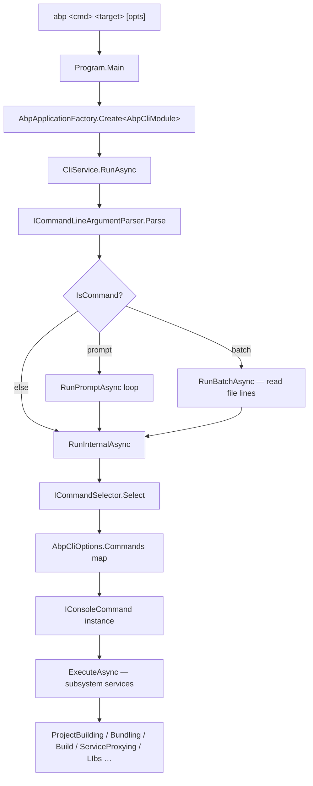

The ABP CLI is a `dotnet tool` packaged as `Volo.Abp.Cli` whose runtime entry point is a tiny `Program.Main` that bootstraps an ABP application around `AbpCliModule` and hands control to a single service — `CliService.RunAsync`. The CLI is split into two assemblies: `Volo.Abp.Cli` (the executable host) and `Volo.Abp.Cli.Core` (every command, every helper, every generator). This page walks the boot path, the command dispatch flow, and the folder layout of `Volo.Abp.Cli.Core` so you can locate any subsystem in one hop.

## Two-assembly layout

The repository contains two projects under `framework/src/`:

<CardGroup cols={2}>
  <Card title="Volo.Abp.Cli" icon="terminal">
    Console host: `Program.cs`, `AbpCliModule.cs`, Telemetry hookup.
  </Card>
  <Card title="Volo.Abp.Cli.Core" icon="layer-group">
    All command classes, project builders, bundlers, proxy generators, services.
  </Card>
</CardGroup>

```text
framework/src/Volo.Abp.Cli/Volo/Abp/Cli/
├── Program.cs              # static Main – bootstraps AbpApplicationFactory
├── AbpCliModule.cs         # [DependsOn(AbpCliCoreModule, AbpAutofacModule)]
└── Telemetry/              # CLI-host-side telemetry providers

framework/src/Volo.Abp.Cli.Core/Volo/Abp/Cli/
├── AbpCliCoreModule.cs     # registers Commands & ServiceProxy generators
├── AbpCliOptions.cs        # Commands dictionary (name → Type)
├── CliConsts.cs            # http client names, memory keys
├── CliPaths.cs             # ~/.abp paths, log paths, token cache
├── CliService.cs           # main RunAsync dispatcher
├── CliUrls.cs              # abp.io, account.abp.io, NuGet endpoints
├── CliUsageException.cs    # thrown to print usage and exit 1
└── (subfolders: see table below)
```

## Boot sequence

`Program.Main` in `framework/src/Volo.Abp.Cli/Volo/Abp/Cli/Program.cs` does five things:

<Steps>
  <Step title="Configure Serilog">
    Sets `Console.OutputEncoding = UTF8`. Configures Serilog with file sink under `CliPaths.Log` (`~/.abp/cli/logs/abp-cli-logs.txt`). For the `mcp` sub-command only a file sink is added — the console sink is omitted so the JSON-RPC stream over stdout is not corrupted.
  </Step>
  <Step title="Build the ABP application">
    `AbpApplicationFactory.Create<AbpCliModule>(...)` with `options.UseAutofac()`. The DI container, module loader, and conventional registration kick in.
  </Step>
  <Step title="Resolve CliService">
    `application.ServiceProvider.GetRequiredService<CliService>()` — registered as `ITransientDependency` in `CliService.cs`.
  </Step>
  <Step title="Run">
    `await cliService.RunAsync(args)`.
  </Step>
  <Step title="Shutdown">
    `application.Shutdown(); Log.CloseAndFlush();`.
  </Step>
</Steps>

## Dispatch pipeline



The selector is a one-liner:

```csharp
// CommandSelector.cs
public Type Select(CommandLineArgs commandLineArgs)
{
    if (commandLineArgs.Command.IsNullOrWhiteSpace())
    {
        return typeof(HelpCommand);
    }

    return Options.Commands.GetOrDefault(commandLineArgs.Command)
           ?? typeof(HelpCommand);
}
```

The registry lives in `AbpCliCoreModule.ConfigureServices` and populates `AbpCliOptions.Commands` (a case-insensitive `Dictionary<string, Type>`). Both `HelpCommand` and `CommandSelector` consume that dictionary.

<Note>
`CliService.RunAsync` also handles two pseudo-commands that are **not** in the registry: `prompt` (interactive REPL) and `batch` (read newline-separated commands from a file path). Both are special-cased before the registry lookup. See `RunPromptAsync` / `RunBatchAsync` in `CliService.cs`.
</Note>

## CliService responsibilities

`framework/src/Volo.Abp.Cli.Core/Volo/Abp/Cli/CliService.cs` does more than just dispatch:

| Responsibility | Where |
| --- | --- |
| Banner log (`ABP CLI {version}`) | `RunAsync` (skipped for `mcp`) |
| Telemetry activity start/stop | `ITelemetryService.TrackActivityAsync(ActivityNameConsts.AbpCliRun)` |
| Version-check throttling | `IsLatestVersionCheckExpiredAsync` — 1-day window stored in `MemoryService` under `CliConsts.MemoryKeys.LatestCliVersionCheckDate` |
| Update channel detection | `GetUpdateChannel(SemanticVersion)` — Stable / Prerelease / Nightly / Development |
| Update suggestion | `LogNewVersionInfo` prints `dotnet tool update -g Volo.Abp.Cli` etc. |
| `CliUsageException` handling | catches → `Logger.LogWarning(msg)` + `Environment.ExitCode = 1` |

## Command registry

`AbpCliCoreModule.ConfigureServices` populates the command map. The full table below lists every `*Command.cs` in `framework/src/Volo.Abp.Cli.Core/Volo/Abp/Cli/Commands/` plus its registered name.

| File | CLI name | Role |
| --- | --- | --- |
| `AddModuleCommand.cs` | `add-module` | Add a multi-package module to a solution |
| `AddPackageCommand.cs` | `add-package` | Add an ABP NuGet package + `[DependsOn]` wiring |
| `BuildCommand.cs` | `build` | Repository-aware `dotnet build` orchestrator |
| `BundleCommand.cs` | `bundle` | Blazor WASM / MAUI-Blazor static asset bundler |
| `CleanCommand.cs` | `clean` | `dotnet clean` + delete `bin`/`obj` recursively |
| `CliCommand.cs` | `cli` | Update or remove the `Volo.Abp.Cli` tool itself |
| `ClearDownloadCacheCommand.cs` | `clear-download-cache` | Wipe `CliPaths.TemplateCache` |
| `CreateMigrationAndRunMigratorCommand.cs` | `create-migration-and-run-migrator` | EF Core scaffolding then run `DbMigrator` |
| `GenerateProxyCommand.cs` | `generate-proxy` | Generate C#/JS/Angular client proxies |
| `GenerateRazorPage.cs` | `generate-razor-page` | Scaffold a Razor page + code-behind |
| `GetSourceCommand.cs` | `get-source` | Download module source from `nuget.abp.io` |
| `HelpCommand.cs` | `help` | Print usage from `IConsoleCommand.GetUsageInfo` |
| `InstallLibsCommand.cs` | `install-libs` | Run yarn + copy `wwwroot/libs` via mapping |
| `ListModulesCommand.cs` | `list-modules` | List open-source application modules |
| `ListTemplatesCommand.cs` | `list-templates` | List available solution templates |
| `LoginCommand.cs` | `login` | Auth to `account.abp.io` (password or device flow) |
| `LoginInfoCommand.cs` | `login-info` | Print current login user/organization |
| `LogoutCommand.cs` | `logout` | Delete cached token, hit `/api/license/logout` |
| `McpCommand.cs` | `mcp` | Run local MCP server, emit client config |
| `NewCommand.cs` | `new` | Generate a new solution from a template |
| `ProjectCreationCommandBase.cs` | (base) | Shared logic between `new` and `add-module` |
| `PromptCommand.cs` | `prompt` | REPL loop (handled in `CliService`) |
| `ProxyCommandBase.cs` | (base) | Shared logic for `generate-proxy` / `remove-proxy` |
| `RemoveProxyCommand.cs` | `remove-proxy` | Delete previously generated proxy files |
| `SuiteCommand.cs` | `suite` | Install / update / start ABP Suite |
| `SwitchToLocalCommand.cs` (class `SwitchToLocal`) | `switch-to-local` | Replace NuGet refs with local `<ProjectReference>` |
| `SwitchToNightlyCommand.cs` | `switch-to-nightly` | Move packages to nightly MyGet feed |
| `SwitchToPreRcCommand.cs` | `switch-to-prerc` | Switch npm packages to pre-rc track |
| `SwitchToPreviewCommand.cs` | `switch-to-preview` | Switch packages to preview channel |
| `SwitchToStableCommand.cs` | `switch-to-stable` | Move back to stable from a preview |
| `TranslateCommand.cs` | `translate` | Bulk JSON resource translation helper |
| `UpdateCommand.cs` | `update` | Bump NuGet/npm package versions in a solution |
| `Internal/RecreateInitialMigrationCommand.cs` | `recreate-initial-migration` | Hidden command (`[HideFromCommandList]`) that re-runs `dotnet ef migrations add Initial` for the bundled `DbContext` projects |

The `CommandSelector` uses the registered key, not the file name; the `Name` constant on each command class is the source of truth. Browse `AbpCliCoreModule.cs` to confirm every registration.

<Note>
`ProjectCreationCommandBase.cs` and `ProxyCommandBase.cs` are abstract bases — they are not registered in `AbpCliOptions.Commands`. They exist to share argument parsing and validation.
</Note>

## Cli.Core service folders

Inside `framework/src/Volo.Abp.Cli.Core/Volo/Abp/Cli/`, the following folders group related services. Each is a discrete subsystem with its own interfaces:

| Folder | Purpose | Entry types |
| --- | --- | --- |
| `Args/` | Command-line argument parser | `ICommandLineArgumentParser`, `CommandLineArgs` |
| `Auth/` | `account.abp.io` OAuth flow + token cache | `AuthService` |
| `Build/` | Repository-aware build pipeline for `abp build` | `IDotNetProjectBuilder`, `IChangedProjectFinder`, `IBuildStatusGenerator` |
| `Bundling/` | Blazor WebAssembly + MAUI Blazor static-asset bundler | `IBundlingService`, `BundlingService`, `IBundler`, `BundlerBase`, `Scripts/ScriptBundler`, `Styles/StyleBundler` |
| `Configuration/` | `appsettings.json` style config reader | `IConfigReader` |
| `GitHub/` | GitHub API helpers (rate-limited HTTP client) | `GithubHttpClientName` registration |
| `Http/` | Shared HttpClient factory with auth handler | `CliHttpClientFactory`, `CliHttpClientHandler` |
| `LIbs/` | `wwwroot/libs` copier (note the `LIbs` typo!) | `IInstallLibsService`, `InstallLibsService`, `ResourceMapping` |
| `Licensing/` | API-key / license services | `IApiKeyService` |
| `Memory/` | Persistent key-value store at `CliPaths.Memory` | `MemoryService` |
| `ProjectBuilding/` | Template download + zip extraction pipeline | `ITemplateInfoProvider`, `TemplateProjectBuilder`, `ISourceCodeStore` |
| `ProjectModification/` | NuGet/npm package mutation, theme adders | `VoloNugetPackagesVersionUpdater`, `NpmPackagesUpdater`, `ThemePackageAdder`, `AngularPwaSupportAdder`, `InitialMigrationCreator` |
| `ServiceProxying/` | Client proxy generators (`csharp`, `js`, `ng`) | `IServiceProxyGenerator`, `ServiceProxyGeneratorBase<T>` |
| `Telemetry/` | OSS no-op telemetry implementation | `NullTelemetryService` (real `ITelemetryService` + `TelemetrySessionInfoEnricher` live in `Volo.Abp.Core`) |
| `Utils/` | Cross-cutting helpers (`CmdHelper`, `NpmHelper`, `NamespaceHelper`, `ProjectNameValidator`) | `ICmdHelper`, `NpmHelper` |
| `Version/` | `Volo.Abp.Cli` self-version + NuGet probing | `CliVersionService`, `PackageVersionCheckerService` |

## Paths the CLI writes to

`CliPaths.cs` centralises every disk location:

```csharp
public static readonly string AbpRootPath =
    Path.Combine(Environment.GetFolderPath(SpecialFolder.UserProfile), ".abp");

public static string Root           => Path.Combine(AbpRootPath, "cli");
public static string Log            => Path.Combine(AbpRootPath, "cli", "logs");
public static string TemplateCache  => Path.Combine(AbpRootPath, "templates");
public static string AccessToken    => Path.Combine(AbpRootPath, "cli", "access-token.bin");
public static string ComputerId     => Path.Combine(AbpRootPath, "cli", "computer-id.bin");
public static string Build          => Path.Combine(AbpRootPath, "build");
public static string McpToolsCache  => Path.Combine(Root, "mcp-tools.json");
public static string McpConfig      => Path.Combine(Root, "mcp-config.json");
public static string McpLog         => Path.Combine(Log, "mcp.log");
```

`CliPaths.Memory` lives next to the executing assembly — it is shipped as part of the tool package and used by `MemoryService` (see `Memory/`).

## HTTP clients

`AbpCliCoreModule.ConfigureServices` registers two named `HttpClient`s via `IHttpClientFactory`:

```csharp
context.Services.AddHttpClient(CliConsts.HttpClientName)        // "AbpHttpClient"
    .ConfigurePrimaryHttpMessageHandler(() => new CliHttpClientHandler());

context.Services.AddHttpClient(CliConsts.GithubHttpClientName, c => // "GithubHttpClient"
{
    c.DefaultRequestHeaders.UserAgent.ParseAdd("MyAgent/1.0");
});
```

`CliHttpClientHandler` lives under `Http/` and injects the bearer token cached at `CliPaths.AccessToken` when present.

## Remote endpoints

All outbound URLs route through `CliUrls.cs`:

| Constant | Default value |
| --- | --- |
| `WwwAbpIo` | `https://abp.io/` |
| `AccountAbpIo` | `https://account.abp.io/` |
| `NuGetRootPath` | `https://nuget.abp.io/` |
| `LatestVersionCheckFullPath` | `https://raw.githubusercontent.com/abpframework/abp/dev/latest-versions.json` |
| `LogoutUrl` | `AccountAbpIo + "api/license/logout"` |
| `GetApiDefinitionUrl(url)` | `{url}api/abp/api-definition` (used by `generate-proxy`) |
| `GetNuGetServiceIndexUrl(apiKey)` | `{NuGetRoot}{apiKey}/v3/index.json` |
| `GetNuGetPackageInfoUrl(apiKey, id)` | `{NuGetRoot}{apiKey}/v3/package/{id}/index.json` |
| `GetNuGetPackageSearchUrl(apiKey, id)` | `{NuGetRoot}{apiKey}/v3/search?q={id}` |

The properties have setters because integration tests overwrite them with `*Development` localhost variants.

## Exception model

Two exception classes carry semantic meaning:

- `CliUsageException` (`CliUsageException.cs`) — thrown by command implementations when arguments are missing or invalid. `CliService` catches it, logs as warning, sets `Environment.ExitCode = 1`, and does **not** rethrow. Telemetry still records the activity.
- `BundlingException` (`Bundling/BundlingException.cs`) — bundler-specific; surfaces upward and is logged as an error.

Every other exception is logged via `Logger.LogException(ex)` then rethrown to break the process. For the `mcp` command both paths route through `IMcpLogger` instead of `ILogger` so stdout stays clean.

## Configurable options

`AbpCliOptions` (`AbpCliOptions.cs`) is the single Options class for the CLI:

```csharp
public class AbpCliOptions
{
    public Dictionary<string, Type> Commands { get; }     // name → IConsoleCommand
    public List<string> DisabledModulesToAddToSolution { get; set; }
    public bool CacheTemplates { get; set; } = true;
    public string ToolName { get; set; } = "CLI";
    public bool AlwaysHideExternalCommandOutput { get; set; }
}
```

- `Commands` — populated in `AbpCliCoreModule`; you can override an entry in your own module to swap an implementation.
- `DisabledModulesToAddToSolution` — modules `add-module` will refuse to install (defaults: `Volo.Abp.LeptonXTheme.Pro`, `Volo.Abp.LeptonXTheme.Lite`).
- `CacheTemplates` — when `false`, every `abp new` re-downloads the template zip even if `CliPaths.TemplateCache` has it.
- `ToolName` — used to differentiate `CLI` from `Suite` / `Studio` invocations in telemetry events.
- `AlwaysHideExternalCommandOutput` — silences stdout of child processes spawned via `ICmdHelper`.

`AbpCliServiceProxyOptions` (`ServiceProxying/AbpCliServiceProxyOptions.cs`) holds the proxy-generator map — see [Generate Proxy](/cli/generate-proxy).

## Telemetry

`AbpCliCoreModule.ConfigureTelemetry` inspects the `ABP_STUDIO_ENABLE_TELEMETRY` environment variable in Machine / User / Process scopes (in that order). The default is opt-in: if the variable is unset or anything other than literal `false`, the `TelemetrySessionInfoEnricher` is **removed** (anonymising the session) but activity tracking remains. If it equals `false`, `ITelemetryService` is replaced with `NullTelemetryService`.

<Tip>
For debugging, look in `~/.abp/cli/logs/abp-cli-logs.txt` — every command run is recorded with the Serilog file sink configured in `Program.Main`.
</Tip>

## Where to go next

<CardGroup cols={2}>
  <Card title="Commands reference" icon="list" href="/cli/commands">
    Every sub-command, every flag, and the handler class it resolves to.
  </Card>
  <Card title="Project creation" icon="plus" href="/cli/project-creation">
    Deep dive on `abp new` and the `ProjectBuilding/` pipeline.
  </Card>
  <Card title="install-libs" icon="box" href="/cli/install-libs">
    `LIbs/` folder, `abp.resourcemapping.js`, yarn + glob copy.
  </Card>
  <Card title="bundle &amp; build" icon="cube" href="/cli/bundle-and-build">
    Blazor WASM bundling and repository-aware `dotnet build`.
  </Card>
  <Card title="generate-proxy" icon="bolt" href="/cli/generate-proxy">
    `/api/abp/api-definition` discovery and C#/JS/NG generators.
  </Card>
</CardGroup>
