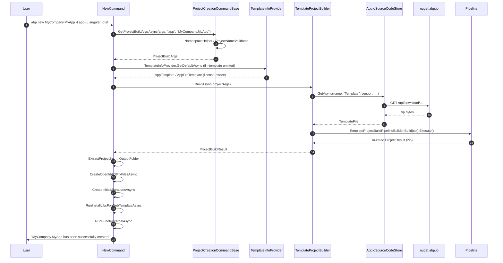

`abp new` is the most-used command in the CLI. It takes a project name plus a constellation of flags, picks the right template, downloads it from `nuget.abp.io`, runs a multi-step transformation pipeline on the zipped template, extracts the result to disk, and then chains into `install-libs`, `bundle`, and EF Core migration scaffolding. This page traces every moving part: `NewCommand`, the abstract base `ProjectCreationCommandBase`, the `ProjectBuilding/` subsystem, and every flag.

## Files involved

```text
framework/src/Volo.Abp.Cli.Core/Volo/Abp/Cli/Commands/
├── NewCommand.cs                       # public IConsoleCommand
└── ProjectCreationCommandBase.cs       # shared logic (NewCommand + add-module --new)

framework/src/Volo.Abp.Cli.Core/Volo/Abp/Cli/ProjectBuilding/
├── ITemplateInfoProvider.cs            # interface
├── TemplateInfoProvider.cs             # switch over TemplateName
├── ISourceCodeStore.cs                 # interface
├── AbpIoSourceCodeStore.cs             # default impl (nuget.abp.io)
├── IProjectBuilder.cs                  # interface
├── TemplateProjectBuilder.cs           # IProjectBuilder for app/module templates
├── ModuleProjectBuilder.cs             # IProjectBuilder for module add-module flow
├── ProjectBuildArgs.cs                 # POCO carrying every option
├── ProjectBuildResult.cs               # ZipContent + ProjectName
├── TemplateFile.cs                     # version + ZipContent loaded from cache
├── SourceCodeTypes.cs                  # "Template" | "Module"
├── SolutionName.cs                     # parses Acme.BookStore → Company/Project
├── Building/
│   ├── ProjectBuildContext.cs
│   ├── ProjectBuildPipeline.cs
│   ├── ProjectBuildPipelineStep.cs
│   ├── TemplateProjectBuildPipelineBuilder.cs   # static Build(context)
│   ├── DatabaseProvider.cs / DatabaseManagementSystem.cs / UiFramework.cs / Theme.cs / MobileApp.cs
│   ├── TemplateInfo.cs
│   └── Steps/...                       # 30+ individual mutation steps
├── Templates/
│   ├── App/        (AppTemplate, AppProTemplate, AppNoLayersTemplate, …)
│   ├── Microservice/ (MicroserviceProTemplate, MicroserviceServiceProTemplate)
│   ├── Module/     (ModuleTemplate, ModuleProTemplate)
│   ├── Console/    (ConsoleTemplate)
│   ├── Wpf/        (WpfTemplate)
│   └── Maui/       (MauiTemplate)
└── Events/         (ProjectCreationProgressEvent, ProjectPostRequirementsCheckedEvent)
```

## End-to-end sequence



## Stage 1 — Argument parsing in `NewCommand.ExecuteAsync`

`framework/src/Volo.Abp.Cli.Core/Volo/Abp/Cli/Commands/NewCommand.cs` begins:

```csharp
public async Task ExecuteAsync(CommandLineArgs commandLineArgs)
{
    var projectName = NamespaceHelper.NormalizeNamespace(commandLineArgs.Target);
    if (string.IsNullOrWhiteSpace(projectName))
    {
        throw new CliUsageException("Project name is missing!" +
            Environment.NewLine + Environment.NewLine + GetUsageInfo());
    }

    ProjectNameValidator.Validate(projectName);

    var template = commandLineArgs.Options.GetOrNull(Options.Template.Short, Options.Template.Long)
                   ?? (await TemplateInfoProvider.GetDefaultAsync()).Name;

    var projectArgs = await GetProjectBuildArgsAsync(commandLineArgs, template, projectName);
    await CheckCreatingRequirements(projectArgs);

    var result = await TemplateProjectBuilder.BuildAsync(projectArgs);
    ExtractProjectZip(result, projectArgs.OutputFolder);
    ...
}
```

- `NamespaceHelper.NormalizeNamespace` (in `Utils/`) trims `.csproj`, slashes and `.sln` from the target.
- `ProjectNameValidator` (in `Utils/`) rejects names containing invalid C# identifier characters and reserved words.
- The default template comes from `TemplateInfoProvider.GetDefaultAsync` — see [Stage 2](#stage-2-mdash-template-resolution).

## Stage 2 — Template resolution

`framework/src/Volo.Abp.Cli.Core/Volo/Abp/Cli/ProjectBuilding/TemplateInfoProvider.cs` exposes two methods:

```csharp
public async Task<TemplateInfo> GetDefaultAsync()
{
    var defaultTemplateName = await CheckProLicenseAsync()
        ? AppProTemplate.TemplateName
        : AppTemplate.TemplateName;
    return Get(defaultTemplateName);
}

public TemplateInfo Get(string name) => name switch
{
    AppTemplate.TemplateName            => new AppTemplate(),
    AppNoLayersTemplate.TemplateName    => new AppNoLayersTemplate(),
    AppNoLayersProTemplate.TemplateName => new AppNoLayersProTemplate(),
    AppProTemplate.TemplateName         => new AppProTemplate(),
    MicroserviceProTemplate.TemplateName        => new MicroserviceProTemplate(),
    MicroserviceServiceProTemplate.TemplateName => new MicroserviceServiceProTemplate(),
    ModuleTemplate.TemplateName         => new ModuleTemplate(),
    ModuleProTemplate.TemplateName      => new ModuleProTemplate(),
    ConsoleTemplate.TemplateName        => new ConsoleTemplate(),
    WpfTemplate.TemplateName            => new WpfTemplate(),
    MauiTemplate.TemplateName           => new MauiTemplate(),
    _ => throw new Exception("There is no template found with given name: " + name)
};
```

`CheckProLicenseAsync` hits `{AccountAbpIo}api/license/check-user` using the cached bearer token (when present). If the user has a Pro license the default template flips to `app-pro` — so `abp new MyApp` produces a different solution depending on `abp login` state.

<Note>
Custom templates are not registered here. The way to inject one is via `--template-source` (handled by `AbpIoSourceCodeStore`) or by subclassing `ITemplateInfoProvider` in a downstream module.
</Note>

The template name constants used above live with each template class — for example `AppTemplate.TemplateName = "app"`, `MicroserviceProTemplate.TemplateName = "microservice-pro"`. Browse `framework/src/Volo.Abp.Cli.Core/Volo/Abp/Cli/ProjectBuilding/Templates/`.

## Stage 3 — `ProjectBuildArgs` assembly

`ProjectCreationCommandBase.GetProjectBuildArgsAsync` aggregates every flag into a single `ProjectBuildArgs`:

```csharp
return new ProjectBuildArgs(
    solutionName,
    template,
    version,
    outputFolder,
    databaseProvider,
    databaseManagementSystem,
    uiFramework,
    mobileApp,
    publicWebSite,
    gitHubAbpLocalRepositoryPath,
    gitHubVoloLocalRepositoryPath,
    templateSource,
    commandLineArgs.Options,    // ExtraProperties
    connectionString,
    pwa,
    theme,
    themeStyle,
    skipCache,
    trustUserVersion);
```

`ProjectBuildArgs` fields map 1:1 to the public flags:

| Field | Source flag | Type |
| --- | --- | --- |
| `SolutionName` | `<target>` | `SolutionName` (`Company.Project` parser) |
| `TemplateName` | `-t/--template` | `string` |
| `Version` | `-v/--version` | `string` |
| `OutputFolder` | `-o/--output-folder` | `string` |
| `DatabaseProvider` | `-d/--database-provider` | `DatabaseProvider` enum |
| `DatabaseManagementSystem` | `--dbms` | `DatabaseManagementSystem` enum |
| `UiFramework` | `-u/--ui` (or `--no-ui`) | `UiFramework` enum |
| `MobileApp` | `-m/--mobile` | `MobileApp` enum |
| `PublicWebSite` | `--with-public-website` | `bool` |
| `AbpGitHubLocalRepositoryPath` | `--abp-path` | `string` |
| `VoloGitHubLocalRepositoryPath` | `--volo-path` | `string` |
| `TemplateSource` | `-ts/--template-source` | `string` |
| `ConnectionString` | `-cs/--connection-string` | `string` |
| `Pwa` | `--progressive-web-app` | `bool` |
| `Theme` | `--theme` | `Theme?` enum |
| `ThemeStyle` | `--theme-style` | `ThemeStyle?` enum |
| `SkipCache` | `-sc/--skip-cache` | `bool` |
| `TrustUserVersion` | `--trust-user-version` | `bool` |
| `ExtraProperties` | (rest of `Options`) | `Dictionary<string,string>` |

### Solution naming

`SolutionName.Parse(projectName)` splits on the **last** dot, so `Acme.Awesome.BookStore` becomes `CompanyName = "Acme.Awesome"`, `ProjectName = "BookStore"`, `FullName = "Acme.Awesome.BookStore"`. When the template is a microservice service template (`MicroserviceServiceProTemplate`), the parser is called with two arguments to bind the new service to the parent microservice solution.

### Output folder rules

```csharp
var outputFolderRoot = outputFolder != null
    ? Path.GetFullPath(outputFolder)
    : Directory.GetCurrentDirectory();

outputFolder = createSolutionFolder
    ? Path.Combine(outputFolderRoot, SolutionName.Parse(projectName).FullName)
    : outputFolderRoot;

IO.DirectoryHelper.CreateIfNotExists(outputFolder);
```

`-csf/--create-solution-folder` defaults to `true`. When `false`, the output is dumped directly into `outputFolderRoot`.

### Connection string inference

If no `--connection-string` is given but `--dbms` is not SQL Server, `ConnectionStringProvider.GetByDbms(dbms, outputFolder)` returns a sane default for MySQL, PostgreSQL, Oracle, etc.

## Stage 4 — Template download (`AbpIoSourceCodeStore`)

`TemplateProjectBuilder.BuildAsync` delegates first to `SourceCodeStore.GetAsync(name, type, version, templateSource, includePreReleases, trustUserVersion)`. The default implementation `AbpIoSourceCodeStore`:

<Steps>
  <Step title="Ensure cache directory">
    `DirectoryHelper.CreateIfNotExists(CliPaths.TemplateCache)` — `~/.abp/templates`.
  </Step>
  <Step title="Resolve version">
    If `--version` not given, calls `GetLatestSourceCodeVersionAsync(name, type, includePreReleases)` against `nuget.abp.io`. If the remote is unreachable, falls back to the cached file list and prints them as `Template Name / Version`.
  </Step>
  <Step title="Cache lookup">
    File path inside `TemplateCache` is `name-type-version.zip`. If present and `--skip-cache` is not set, the cached bytes are returned without HTTP.
  </Step>
  <Step title="Download">
    HTTP `GET` via `CliHttpClientFactory` (sends bearer token when authenticated, so Pro templates need a license). Body persisted to cache.
  </Step>
  <Step title="Return TemplateFile">
    `new TemplateFile(zipBytes, version)`.
  </Step>
</Steps>

<Warning>
Pro templates (`AppProTemplate`, `MicroserviceProTemplate`, etc.) require `ApiKeyService.GetApiKeyOrNullAsync()` to succeed. The CLI throws `UserFriendlyException` when `apiKeyResult.ApiKey == null` and the template is Pro — fail-fast happens inside `TemplateProjectBuilder.BuildAsync`.
</Warning>

## Stage 5 — Pipeline build

`TemplateProjectBuildPipelineBuilder.Build(context)` returns a `ProjectBuildPipeline` whose `Execute()` method runs each `ProjectBuildPipelineStep` in order. The steps are conditional on template name, UI framework, mobile choice, etc.

```csharp
pipeline.Steps.Add(new FileEntryListReadStep());                  // unzip in-memory

if (Version > 4.3.99)
    pipeline.Steps.Add(new CreateAppSettingsSecretsStep());

pipeline.Steps.AddRange(context.Template.GetCustomSteps(context)); // per-template steps

pipeline.Steps.Add(new ProjectReferenceReplaceStep());             // <ProjectReference> ↔ <PackageReference>
pipeline.Steps.Add(new TemplateCodeDeleteStep());                  // remove placeholders
pipeline.Steps.Add(new SolutionRenameStep());                      // Acme.BookStore everywhere

if (template.IsPro())
    pipeline.Steps.Add(new LicenseCodeReplaceStep());

if (template.Name == "app" || template.Name == "app-pro")
    pipeline.Steps.Add(new DatabaseManagementSystemChangeStep(...));

if (template.Name == "app-nolayers" || template.Name == "app-nolayers-pro")
    pipeline.Steps.Add(new AppNoLayersDatabaseManagementSystemChangeStep());

if (template.Name == "module" || template.Name == "module-pro")
    pipeline.Steps.Add(new AppModuleDatabaseManagementSystemChangeStep());

// strip the top-level wrapper folder for MVC/Blazor variants
if (uiFramework in {Mvc, Blazor, BlazorServer, BlazorWebApp} && mobile == None
    && template not in microservice family)
    pipeline.Steps.Add(new RemoveRootFolderStep());

pipeline.Steps.Add(new CheckRedisPreRequirements());
pipeline.Steps.Add(new CreateProjectResultZipStep());              // re-zip into ProjectResult.ZipContent
```

The full step library lives in `framework/src/Volo.Abp.Cli.Core/Volo/Abp/Cli/ProjectBuilding/Building/Steps/`. Notable steps:

| Step | What it does |
| --- | --- |
| `FileEntryListReadStep` | Unzips into in-memory `FileEntryList` (`Files`). |
| `SolutionRenameStep` | Replaces the literal `MyCompanyName.MyProjectName` and namespace tokens in every text file. |
| `ProjectReferenceReplaceStep` | Swaps `<ProjectReference>` lines with `<PackageReference>` ones, version-pinned. |
| `DatabaseManagementSystemChangeStep` | Edits `appsettings.json`, `DbContext`, `Module.cs` for the chosen DBMS. |
| `AngularEnvironmentFilePortChangeForSeparatedAuthServersStep` | Rewrites `src/environments/environment.ts` when `--separate-auth-server` is on. |
| `BlazorAppsettingsFilePortChangeForSeparatedAuthServersStep` | Same idea for Blazor. |
| `RandomizeStringEncryptionStep` | Replaces the encryption pass-phrase placeholder. |
| `RandomizeAuthServerPassPhraseStep` | Replaces auth-server crypto secret. |
| `TemplateRandomSslPortStep` | Picks a free localhost SSL port. |
| `RemoveUnnecessaryPortsStep` | Strips ports for layers that won't ship. |
| `TemplateProjectRenameStep` | Renames every `MyCompanyName.MyProjectName.csproj` file on disk. |
| `MicroserviceServiceStringEncryptionStep` | Per-service crypto bootstrap. |
| `CheckRedisPreRequirements` | Adds `PreRequirements:Redis` flag when Redis is needed. |
| `CreateProjectResultZipStep` | Re-zips `Files` into `Result.ZipContent`. |

## Stage 6 — Extraction

Back in `NewCommand.ExecuteAsync`:

```csharp
ExtractProjectZip(result, projectArgs.OutputFolder);
```

`ExtractProjectZip` uses `ICSharpCode.SharpZipLib.Zip.ZipInputStream` to write every entry under `OutputFolder`.

## Stage 7 — Post-creation chain

After extraction `NewCommand` runs a sequence of optional steps:

```csharp
await CheckCreatedRequirements(projectArgs);              // Redis check
await CreateOpenIddictPfxFilesAsync(projectArgs);         // generate .pfx for openiddict
await RunGraphBuildForMicroserviceServiceTemplate(args);  // dotnet graphbuild
await CreateInitialMigrationsAsync(projectArgs);          // ef migrations add Initial

await ConfigureAngularAfterMicroserviceServiceCreatedAsync(projectArgs, template);

if (!skipInstallLibs)
{
    await RunInstallLibsForWebTemplateAsync(projectArgs); // → InstallLibsService
    ConfigureAngularJsonForThemeSelection(projectArgs);
}

if (!skipBundling)
{
    await RunBundleInternalAsync(projectArgs);            // → BundlingService
}

await ConfigurePwaSupportForAngular(projectArgs);         // when --progressive-web-app

if (!commandLineArgs.Options.ContainsKey(Options.NoOpenWebPage.Long))
    OpenRelatedWebPage(projectArgs, template, isTiered, commandLineArgs);
```

`CreateInitialMigrationsAsync` is delegated to `InitialMigrationCreator` (`ProjectModification/InitialMigrationCreator.cs`) and only runs for EF Core projects.

`RunInstallLibsForWebTemplateAsync` calls `IInstallLibsService.InstallLibsAsync(outputFolder)` (see [install-libs](/cli/install-libs)).

`RunBundleInternalAsync` runs `BundlingService.BundleAsync` only when `UiFramework == Blazor` and the template is WASM-based (see [bundle &amp; build](/cli/bundle-and-build)).

## Flag reference

All flags below are declared on `NewCommand.Options` or `ProjectCreationCommandBase.Options` and consumed inside `GetProjectBuildArgsAsync`.

<Tabs>
  <Tab title="Identity">

| Short | Long | Effect |
| --- | --- | --- |
| `-t` | `--template` | Template name (default: result of `TemplateInfoProvider.GetDefaultAsync`). |
| `-v` | `--version` | Pin to a specific ABP version. |
| (none) | `--preview` | Use latest pre-release. Requires a pre-release CLI in non-DEBUG builds. |
| `-ts` | `--template-source` | Local path or URL of a pre-downloaded template zip. |
| `-sc` | `--skip-cache` | Bypass `CliPaths.TemplateCache`. |
| (none) | `--trust-user-version` | Skip the CLI/template version compatibility check. |

  </Tab>
  <Tab title="Tech stack">

| Short | Long | Values |
| --- | --- | --- |
| `-d` | `--database-provider` | `ef`, `mongodb` |
| (none) | `--dbms` | `sqlserver`, `mysql`, `postgresql`, `oracle`, `oracle-devart`, `sqlite` |
| `-u` | `--ui` | `mvc`, `blazor`, `blazor-server`, `blazor-webapp`, `angular`, `none` |
| (none) | `--no-ui` | Force `UiFramework.None` (module templates). |
| `-m` | `--mobile` | `none`, `react-native`, `maui` |
| (none) | `--theme` | `lepton-x` (default), `lepton-x-lite`, `basic` |
| (none) | `--theme-style` | `system`, `light`, `dark` (LeptonX). |

  </Tab>
  <Tab title="Layout">

| Short | Long | Default | Effect |
| --- | --- | --- | --- |
| `-o` | `--output-folder` | `cwd` | Where to extract the solution. |
| `-csf` | `--create-solution-folder` | `true` | Wrap output in `Acme.BookStore/`. |
| (none) | `--tiered` | `false` | Generate a tiered (split web + identity-server) solution. |
| (none) | `--separate-auth-server` | `false` | Spin a standalone AuthServer project. |
| (none) | `--with-public-website` | `false` | Adds the `*.PublicWeb` project. |
| (none) | `--no-random-port` | random | Use the template's literal port numbers. |

  </Tab>
  <Tab title="Database / Post-actions">

| Short | Long | Effect |
| --- | --- | --- |
| `-cs` | `--connection-string` | Replace the default connection string in `appsettings.json`. |
| (none) | `--progressive-web-app` | Enables PWA mode for Angular templates. |
| `-sib` | `--skip-installing-libs` | Don't run `install-libs` afterwards. |
| `-sb` | `--skip-bundling` | Don't run `bundle` afterwards. |
| (none) | `--no-open-web-page` | Don't open the docs URL in a browser at end. |
| (none) | `--local-framework-ref` | Keep `<ProjectReference>` lines pointing at local ABP clone. |
| (none) | `--abp-path <dir>` | Path to local `abp` clone (used with `--local-framework-ref`). |
| (none) | `--volo-path <dir>` | Path to local `volo` clone (used with `--local-framework-ref`). |

  </Tab>
</Tabs>

## Examples that map to pipeline branches

```bash
# Default: AppTemplate if not logged in; AppProTemplate if Pro user.
abp new Acme.BookStore

# Tiered MVC with PostgreSQL
abp new Acme.BookStore --tiered --dbms postgresql

# Angular SPA + MongoDB
abp new Acme.BookStore -u angular -d mongodb

# Microservice service added into existing solution (under -mainsln/--main-solution)
abp new Acme.BookStore.OrderService -t microservice-service-pro \
       -mainsln ./Acme.BookStore.sln

# Module template, no UI, custom output
abp new Acme.MyModule -t module --no-ui -o ./modules/mymodule
```

For the tiered case, `AppTemplateBase.GetCustomSteps(context)` injects `AppTemplateChangeConsoleTestClientPortSettingsStep` and `AppTemplateChangeDbMigratorPortSettingsStep`. For Mongo, the pipeline adds `AppTemplateSwitchEntityFrameworkCoreToMongoDbStep`. Inspect `framework/src/Volo.Abp.Cli.Core/Volo/Abp/Cli/ProjectBuilding/Templates/App/` for the rule list.

## Events emitted

The pipeline publishes progress events on the local event bus:

| Event | When |
| --- | --- |
| `ProjectCreationProgressEvent` (`Events/`) | "Downloading the solution template", "Customizing the solution template" |
| `ProjectPostRequirementsCheckedEvent` (`Events/`) | After `CheckCreatedRequirements` detects Redis/etc. is missing |

External tools (notably ABP Studio) subscribe via `ILocalEventBus` to drive a UI progress bar.

## Telemetry

`NewCommand` records two telemetry activities depending on template:

```csharp
var activityName = ModuleTemplateBase.IsModuleTemplate(template)
    ? ActivityNameConsts.AbpCliCommandsNewModule
    : ActivityNameConsts.AbpCliCommandsNewSolution;

await _telemetryService.AddActivityAsync(activityName, o =>
{
    o[ActivityPropertyNames.CreationTool] = AbpTool.OldCli;
    o[ActivityPropertyNames.Template] = template;
});
```

Combined with the wrapping `AbpCliRun` activity in `CliService`, every invocation emits at least three events.

## Extending the pipeline

Two extension points without forking the CLI:

1. **Custom template** — subclass `TemplateInfo`, register via `ITemplateInfoProvider`, and add a step list via `GetCustomSteps`. Use `--template-source` to point at a local zip while developing.
2. **New post-step** — implement `ProjectBuildPipelineStep`, add to `pipeline.Steps` inside a custom `IProjectBuilder` (replace `TemplateProjectBuilder` via DI).

```csharp
public class CompanySecretStep : ProjectBuildPipelineStep
{
    public override void Execute(ProjectBuildContext context)
    {
        var appsettings = context.Files
            .FirstOrDefault(f => f.Name.EndsWith("appsettings.json"));
        if (appsettings == null) return;
        appsettings.SetLines(appsettings.GetLines()
            .Select(l => l.Replace("__COMPANY_SECRET__", Environment.GetEnvironmentVariable("CO_SECRET")))
            .ToArray());
    }
}
```

## Reading order for agents

When debugging `abp new` problems, follow source files in this order:

1. `NewCommand.cs` → confirms the flag parsing.
2. `ProjectCreationCommandBase.cs` → confirms `ProjectBuildArgs` shape.
3. `TemplateInfoProvider.cs` → confirms template default + name → class mapping.
4. `AbpIoSourceCodeStore.cs` → confirms cache and remote URLs.
5. `TemplateProjectBuilder.cs` → confirms the high-level orchestration.
6. `TemplateProjectBuildPipelineBuilder.cs` → confirms which steps run.
7. `Building/Steps/<StepName>.cs` → drills into the actual file mutation.

## Related pages

<CardGroup cols={2}>
  <Card title="Commands" icon="list" href="/cli/commands">
    Full command reference including `add-module` and `add-package`.
  </Card>
  <Card title="install-libs" icon="box" href="/cli/install-libs">
    What `RunInstallLibsForWebTemplateAsync` actually does.
  </Card>
  <Card title="Bundle &amp; Build" icon="cube" href="/cli/bundle-and-build">
    Post-creation Blazor bundling.
  </Card>
  <Card title="Overview" icon="map" href="/cli/overview">
    Big-picture CLI architecture and folder map.
  </Card>
</CardGroup>
