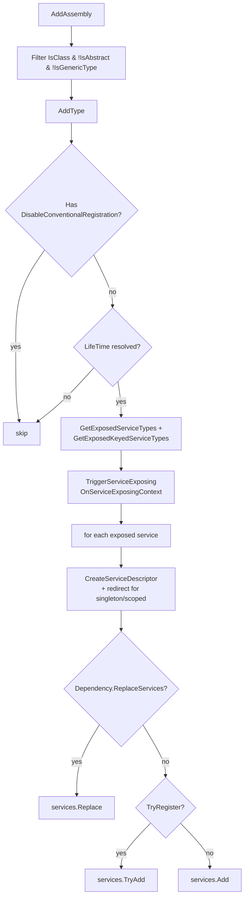

ABP layers a convention-based registration system on top of `Microsoft.Extensions.DependencyInjection`. Modules drop classes into their assembly, mark them with `ITransientDependency` / `IScopedDependency` / `ISingletonDependency` (or `[Dependency]`), and the framework registers them with the right lifetime and exposed services without the developer touching `services.AddTransient(...)`. This page enumerates every file in `framework/src/Volo.Abp.Core/Volo/Abp/DependencyInjection/` and the matching `Microsoft.Extensions.DependencyInjection` extensions that live in `framework/src/Volo.Abp.Core/Microsoft/Extensions/DependencyInjection/`.

## File map

`framework/src/Volo.Abp.Core/Volo/Abp/DependencyInjection/` contains:

| Category | Files |
| --- | --- |
| Lifetime markers | `ITransientDependency.cs`, `IScopedDependency.cs`, `ISingletonDependency.cs` |
| Registration attributes | `DependencyAttribute.cs`, `ExposeServicesAttribute.cs`, `ExposeKeyedServiceAttribute.cs`, `DisableConventionalRegistrationAttribute.cs`, `DisablePropertyInjectionAttribute.cs` |
| Provider interfaces | `IExposedServiceTypesProvider.cs`, `IExposedKeyedServiceTypesProvider.cs`, `IInjectPropertiesService.cs`, `NullInjectPropertiesService.cs` |
| Conventional registrar | `IConventionalRegistrar.cs`, `ConventionalRegistrarBase.cs`, `DefaultConventionalRegistrar.cs`, `ConventionalRegistrarList.cs`, `ExposedServiceExplorer.cs` |
| Service identifiers | `ServiceIdentifier.cs` |
| Lifetime pipelines | `OnServiceRegistredContext.cs` / `IOnServiceRegistredContext.cs`, `OnServiceExposingContext.cs` / `IOnServiceExposingContext.cs`, `OnServiceActivatedContext.cs` / `IOnServiceActivatedContext.cs`, `ServiceRegistrationActionList.cs`, `ServiceExposingActionList.cs`, `ServiceActivatedActionList.cs` |
| Interceptor selectors | `ClassInterceptorsSelectorList.cs`, `IClassInterceptorsSelectorList.cs` |
| Service providers | `IAbpLazyServiceProvider.cs`, `AbpLazyServiceProvider.cs`, `ICachedServiceProvider.cs`, `CachedServiceProvider.cs`, `ICachedServiceProviderBase.cs`, `CachedServiceProviderBase.cs`, `ITransientCachedServiceProvider.cs`, `TransientCachedServiceProvider.cs` |
| Scope/root access | `IServiceProviderAccessor.cs`, `IRootServiceProviderAccessor.cs`, `IClientScopeServiceProviderAccessor.cs`, `RootServiceProvider.cs` |
| Object accessor | `IObjectAccessor.cs`, `ObjectAccessor.cs` |

The companion extension methods live under `framework/src/Volo.Abp.Core/Microsoft/Extensions/DependencyInjection/` (`ServiceCollectionConventionalRegistrationExtensions.cs`, `ServiceCollectionObjectAccessorExtensions.cs`, `ServiceCollectionRegistrationActionExtensions.cs`, `ServiceCollectionLifetimeEventExtensions.cs`, `ServiceCollectionPreConfigureExtensions.cs`, `ServiceCollectionOptionsExtensions.cs`, `ServiceCollectionApplicationExtensions.cs`, `ServiceCollectionCommonExtensions.cs`, `ServiceCollectionConfigurationExtensions.cs`, `ServiceCollectionDynamicOptionsManagerExtensions.cs`, `ServiceCollectionLoggingExtensions.cs`, `ServiceDescriptorExtensions.cs`).

## Lifetime marker interfaces

`ITransientDependency`, `IScopedDependency`, and `ISingletonDependency` are empty marker interfaces:

```csharp
// Volo/Abp/DependencyInjection/ITransientDependency.cs
public interface ITransientDependency { }
// Volo/Abp/DependencyInjection/IScopedDependency.cs
public interface IScopedDependency { }
// Volo/Abp/DependencyInjection/ISingletonDependency.cs
public interface ISingletonDependency { }
```

When the convention engine inspects a class it walks the inheritance chain checking, in this order, `ITransientDependency` → `ISingletonDependency` → `IScopedDependency` (see `ConventionalRegistrarBase.GetServiceLifetimeFromClassHierarchy`). The first matching interface wins. The traversal uses `IsAssignableFrom`, so inheritance counts.

<Warning>If a class implements both `ITransientDependency` and `ISingletonDependency` (e.g. by mixing base classes), the transient interface wins because it is checked first.</Warning>

## Attributes

### `[Dependency]`

`Volo/Abp/DependencyInjection/DependencyAttribute.cs`:

```csharp
public class DependencyAttribute : Attribute
{
    public virtual ServiceLifetime? Lifetime { get; set; }
    public virtual bool TryRegister { get; set; }
    public virtual bool ReplaceServices { get; set; }
    public DependencyAttribute() { }
    public DependencyAttribute(ServiceLifetime lifetime) { Lifetime = lifetime; }
}
```

`DefaultConventionalRegistrar.AddType` reads it via `GetDependencyAttributeOrNull(type)`. The lifetime resolution order in `ConventionalRegistrarBase.GetLifeTimeOrNull` is:

1. `dependencyAttribute?.Lifetime`
2. `GetServiceLifetimeFromClassHierarchy(type)` (marker interfaces)
3. `GetDefaultLifeTimeOrNull(type)` (default returns `null` — the type is **not** registered)

If all three return `null` the registrar silently skips the class. `TryRegister` translates to `services.TryAdd(descriptor)` and `ReplaceServices` to `services.Replace(descriptor)`.

### `[ExposeServices]`

`Volo/Abp/DependencyInjection/ExposeServicesAttribute.cs` implements `IExposedServiceTypesProvider`:

```csharp
[AttributeUsage(AttributeTargets.Class, AllowMultiple = true)]
public class ExposeServicesAttribute : Attribute, IExposedServiceTypesProvider
{
    public Type[] ServiceTypes { get; }
    public bool IncludeDefaults { get; set; }
    public bool IncludeSelf { get; set; }
    public ExposeServicesAttribute(params Type[] serviceTypes) { ... }
    public Type[] GetExposedServiceTypes(Type targetType);
}
```

When `IncludeDefaults = true`, `GetDefaultServices(targetType)` adds every interface whose name (after stripping the leading `I` and any `'1` suffix) is a case-insensitive *suffix* of the class name. So `MyUserManager : IUserManager, IDisposable` automatically exposes `IUserManager` but not `IDisposable`. `IncludeSelf` adds the concrete type as another exposed service.

### `[ExposeKeyedService]`

`Volo/Abp/DependencyInjection/ExposeKeyedServiceAttribute.cs` implements `IExposedKeyedServiceTypesProvider` (similar shape, plus a `ServiceKey`). When a class has **only** keyed exposures and no `[ExposeServices]`, the registrar skips the default exposure path entirely (see `ExposedServiceExplorer.GetExposedServices`).

### `[DisableConventionalRegistration]`

`Volo/Abp/DependencyInjection/DisableConventionalRegistrationAttribute.cs` is checked by `ConventionalRegistrarBase.IsConventionalRegistrationDisabled(type)` via `type.IsDefined(typeof(DisableConventionalRegistrationAttribute), true)`. Marked classes are skipped completely.

### `[DisablePropertyInjection]`

`Volo/Abp/DependencyInjection/DisablePropertyInjectionAttribute.cs` is class- or property-targeted. The Autofac integration reads it to skip property injection on individual properties or whole classes.

### Default behaviour without attributes

`ExposedServiceExplorer.DefaultExposeServicesAttribute = new ExposeServicesAttribute { IncludeDefaults = true, IncludeSelf = true }`. When neither `[ExposeServices]` nor `[ExposeKeyedService]` is present, the explorer falls back to this default &mdash; meaning the class is registered as itself **and** as every interface whose name matches the suffix convention.

## `IConventionalRegistrar`

`Volo/Abp/DependencyInjection/IConventionalRegistrar.cs`:

```csharp
public interface IConventionalRegistrar
{
    void AddAssembly(IServiceCollection services, Assembly assembly);
    void AddTypes(IServiceCollection services, params Type[] types);
    void AddType(IServiceCollection services, Type type);
}
```

`ConventionalRegistrarBase` (`Volo/Abp/DependencyInjection/ConventionalRegistrarBase.cs`) supplies the heavy lifting. Its `AddAssembly` filters `IsClass && !IsAbstract && !IsGenericType` and gracefully handles `ReflectionTypeLoadException` by logging via `services.GetInitLogger<ConventionalRegistrarBase>()`.

### `DefaultConventionalRegistrar.AddType`

```csharp
public override void AddType(IServiceCollection services, Type type)
{
    if (IsConventionalRegistrationDisabled(type)) return;

    var dependencyAttribute = GetDependencyAttributeOrNull(type);
    var lifeTime = GetLifeTimeOrNull(type, dependencyAttribute);
    if (lifeTime == null) return;

    var exposedServiceAndKeyedServiceTypes = GetExposedKeyedServiceTypes(type)
        .Concat(GetExposedServiceTypes(type).Select(t => new ServiceIdentifier(t)))
        .ToList();

    TriggerServiceExposing(services, type, exposedServiceAndKeyedServiceTypes);

    foreach (var exposedServiceType in exposedServiceAndKeyedServiceTypes)
    {
        var allExposingServiceTypes = exposedServiceType.ServiceKey == null
            ? exposedServiceAndKeyedServiceTypes.Where(x => x.ServiceKey == null).ToList()
            : exposedServiceAndKeyedServiceTypes.Where(x => x.ServiceKey?.ToString() == exposedServiceType.ServiceKey?.ToString()).ToList();

        var serviceDescriptor = CreateServiceDescriptor(
            type,
            exposedServiceType.ServiceKey,
            exposedServiceType.ServiceType,
            allExposingServiceTypes,
            lifeTime.Value);

        if (dependencyAttribute?.ReplaceServices == true) services.Replace(serviceDescriptor);
        else if (dependencyAttribute?.TryRegister == true) services.TryAdd(serviceDescriptor);
        else services.Add(serviceDescriptor);
    }
}
```

### Redirected descriptors

For singleton and scoped lifetimes with multiple exposed services, `CreateServiceDescriptor` calls `GetRedirectedTypeOrNull(implementationType, exposingServiceType, allExposingServiceTypes)`. If found, it issues a `ServiceDescriptor.Describe(exposingServiceType, provider => provider.GetService(redirectedType)!, lifeTime)` so multiple exposed services share the **same** instance &mdash; e.g. `IUserStore` and `IUserPasswordStore` both resolved from the same `IdentityUserStore` singleton.



## Service identifiers

`Volo/Abp/DependencyInjection/ServiceIdentifier.cs` is a readonly struct holding `(object? ServiceKey, Type ServiceType)`. It mirrors the runtime's internal type from `Microsoft.Extensions.DependencyInjection.ServiceLookup.ServiceIdentifier` so the cache providers can key entries on both type and keyed key.

## Lifetime pipelines

ABP provides three lifecycle-event lists that modules subscribe to during `Pre/Configure/PostConfigureServices`. Each list is wrapped in an `IObjectAccessor<T>` so the registrar can mutate it across modules.

| Pipeline | Context | List | Hook method |
| --- | --- | --- | --- |
| OnExposing | `IOnServiceExposingContext` (`ImplementationType`, `List<ServiceIdentifier> ExposedTypes`) | `ServiceExposingActionList` | `services.OnExposing(ctx => ...)` |
| OnRegistred | `IOnServiceRegistredContext` (`ImplementationType`, `ITypeList<IAbpInterceptor> Interceptors`, `ServiceKey`) | `ServiceRegistrationActionList` | `services.OnRegistered(ctx => ...)` |
| OnActivated | `IOnServiceActivatedContext` (`Instance`) | `ServiceActivatedActionList` | `services.OnActivated(descriptor, ctx => ...)` |

The extension methods are in `framework/src/Volo.Abp.Core/Microsoft/Extensions/DependencyInjection/ServiceCollectionRegistrationActionExtensions.cs` and `ServiceCollectionLifetimeEventExtensions.cs`.

### OnRegistred — attaching interceptors

The Castle.Core wrapper invokes every action in `ServiceRegistrationActionList` for every concrete type that gets registered. Actions add `IAbpInterceptor` types to `ctx.Interceptors`. Example pseudo-flow used by auditing, authorization, validation, unit-of-work and feature-checking interceptors:

```csharp
public class AuditingRegistrar
{
    public static void RegisterIfNeeded(IOnServiceRegistredContext context)
    {
        if (ShouldIntercept(context.ImplementationType))
        {
            context.Interceptors.TryAdd<AuditingInterceptor>();
        }
    }
}
// Inside a module's PreConfigureServices:
context.Services.OnRegistered(AuditingRegistrar.RegisterIfNeeded);
```

`ServiceRegistrationActionList.IsClassInterceptorsDisabled` and `DisabledClassInterceptorsSelectors` let modules disable interceptor application globally or via `NamedTypeSelector` filters &mdash; see `services.DisableAbpClassInterceptors()` in `ServiceCollectionRegistrationActionExtensions`.

### OnExposing — filtering exposed services

`OnServiceExposingContext.ExposedTypes` is a mutable `List<ServiceIdentifier>`. An action can remove or add entries before they become `ServiceDescriptor`s. Example usage in `Volo.Abp.AspNetCore.Mvc` strips MVC controllers from the keyed registration list.

### OnActivated — post-construction hooks

`ServiceActivatedActionList` stores `(ServiceDescriptor, Action<IOnServiceActivatedContext>)` pairs. The Castle adapter or Autofac integration replays each action after a service instance is created, allowing property injection or setup work.

## ObjectAccessor pattern

`ObjectAccessor<T>` (`Volo/Abp/DependencyInjection/ObjectAccessor.cs`) is a mutable wrapper that lets the framework register a slot before the real instance exists.

```csharp
public class ObjectAccessor<T> : IObjectAccessor<T>
{
    public T? Value { get; set; }
    public ObjectAccessor() { }
    public ObjectAccessor(T? obj) { Value = obj; }
}
```

`AbpApplicationBase` registers `services.TryAddObjectAccessor<IServiceProvider>()` in its constructor and then sets `Value = serviceProvider` inside `SetServiceProvider` once the container is built. `RootServiceProvider` (`Volo/Abp/DependencyInjection/RootServiceProvider.cs`) reads the same accessor:

```csharp
[ExposeServices(typeof(IRootServiceProvider))]
public class RootServiceProvider : IRootServiceProvider, ISingletonDependency
{
    public RootServiceProvider(IObjectAccessor<IServiceProvider> objectAccessor)
    {
        ServiceProvider = objectAccessor.Value!;
    }
    ...
}
```

The `ServiceCollectionObjectAccessorExtensions` helpers `AddObjectAccessor<T>`, `TryAddObjectAccessor<T>`, `GetObject<T>` and `GetObjectOrNull<T>` insert the descriptor at index `0` for fast `services.GetSingletonInstance<...>()` retrieval during the boot phase, before any `IServiceProvider` exists.

<Tip>The `services.GetSingletonInstance<T>()` helper (in `ServiceCollectionCommonExtensions`) walks the `IServiceCollection` for a `ServiceDescriptor` with an `ImplementationInstance`. Combined with `AddObjectAccessor`, this is how the boot phase reads/writes shared state without a provider.</Tip>

## Cached and lazy service providers

ABP ships three cached provider implementations that share `CachedServiceProviderBase`:

| Class | Lifetime | Exposed as |
| --- | --- | --- |
| `CachedServiceProvider` | Scoped | `ICachedServiceProvider` |
| `TransientCachedServiceProvider` | Transient | `ITransientCachedServiceProvider` |
| `AbpLazyServiceProvider` | Transient (legacy) | `IAbpLazyServiceProvider` |

```csharp
public abstract class CachedServiceProviderBase : ICachedServiceProviderBase
{
    protected IServiceProvider ServiceProvider { get; }
    protected ConcurrentDictionary<ServiceIdentifier, Lazy<object?>> CachedServices { get; }

    public virtual object? GetService(Type serviceType)
        => CachedServices.GetOrAdd(
               new ServiceIdentifier(serviceType),
               _ => new Lazy<object?>(() => ServiceProvider.GetService(serviceType))).Value;
}
```

Note how the cache is keyed on `ServiceIdentifier`, so keyed and non-keyed registrations share the same cache without colliding. `GetService<T>(T defaultValue)` and `GetService(Type, Func<IServiceProvider, object>)` make property-injection scenarios (`LazyServiceProvider.LazyGetRequiredService<T>()`) cheap.

`AbpLazyServiceProvider` (`Volo/Abp/DependencyInjection/AbpLazyServiceProvider.cs`) is the legacy API used in pre-existing ABP base classes (e.g. `ApplicationService`). For new code prefer `ITransientCachedServiceProvider`.

## Scope/root accessors

| Interface | Purpose |
| --- | --- |
| `IServiceProviderAccessor` | Mutable property `IServiceProvider ServiceProvider`. Implemented by `ApplicationInitializationContext`. |
| `IRootServiceProviderAccessor` | Read-only handle on the root provider. |
| `IClientScopeServiceProviderAccessor` | Used by middleware (e.g. integration-event consumers) to capture the originating client scope. |
| `IInjectPropertiesService` | Allows the Autofac integration to push property injection through Castle-proxied classes. `NullInjectPropertiesService` is the default no-op. |

## Conventional registrar entry point

`ServiceCollectionConventionalRegistrationExtensions` (`framework/src/Volo.Abp.Core/Microsoft/Extensions/DependencyInjection/ServiceCollectionConventionalRegistrationExtensions.cs`) exposes the API consumed by `AbpApplicationBase.ConfigureServices`:

```csharp
public static IServiceCollection AddAssemblyOf<T>(this IServiceCollection services)
    => services.AddAssembly(typeof(T).GetTypeInfo().Assembly);

public static IServiceCollection AddAssembly(this IServiceCollection services, Assembly assembly)
{
    foreach (var registrar in services.GetConventionalRegistrars())
        registrar.AddAssembly(services, assembly);
    return services;
}
```

`GetOrCreateRegistrarList` lazily creates the list `new ConventionalRegistrarList { new DefaultConventionalRegistrar() }` and stashes it in a singleton `ObjectAccessor<ConventionalRegistrarList>`. To plug in your own registrar (e.g. for Mediator pattern or repository conventions), call `services.AddConventionalRegistrar(new MyRegistrar())` *before* `services.AddAssembly(...)` runs.

## Cross-references

- The interceptor types registered via `OnServiceRegistredContext.Interceptors` are realised by Castle.Core &mdash; see [Dynamic proxy & aspects](/core/dynamic-proxy-and-aspects).
- `AbpLazyServiceProvider`/`CachedServiceProvider` are constructor-injected into base classes such as `ApplicationService`, `DomainService`, and `AbpController` &mdash; the [DDD overview](/ddd/overview) covers those base classes.
- For the actual order of `AddAssembly(...)` calls during boot, see [Application startup flow](/flows/application-startup).
- The ASP.NET Core integration uses `IAbpApplicationWithExternalServiceProvider` so the host owns the container &mdash; see [ASP.NET Core overview](/aspnetcore/overview).
