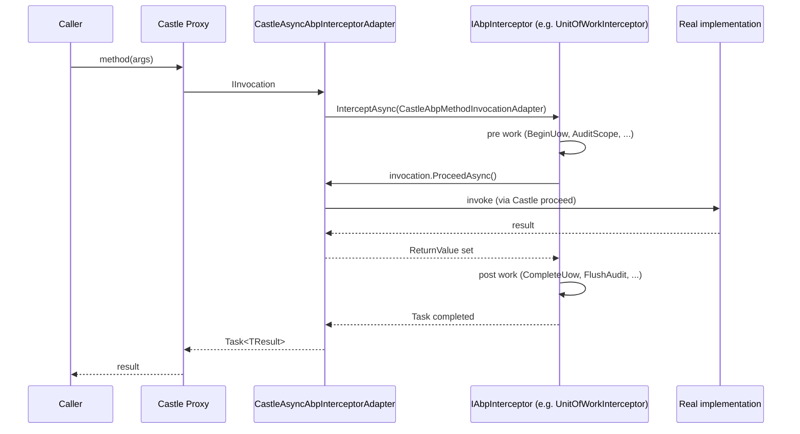
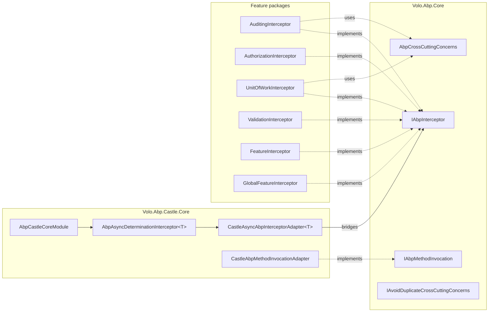

ABP implements its cross-cutting concerns &mdash; auditing, authorization, validation, unit-of-work, feature checking, global features &mdash; with interceptors that wrap services produced by the conventional registrar. The abstract `IAbpInterceptor` contract lives in `Volo.Abp.Core`; the Castle.DynamicProxy adapter lives in `Volo.Abp.Castle.Core`; the interceptor classes themselves live in dedicated feature packages. This page walks every file involved.

## Abstractions in Volo.Abp.Core

```
framework/src/Volo.Abp.Core/Volo/Abp/
├── Aspects/
│   ├── AbpCrossCuttingConcerns.cs
│   └── IAvoidDuplicateCrossCuttingConcerns.cs
└── DynamicProxy/
    ├── AbpInterceptor.cs
    ├── IAbpInterceptor.cs
    ├── IAbpMethodInvocation.cs
    ├── ProxyHelper.cs
    └── DynamicProxyIgnoreTypes.cs
```

### `IAbpInterceptor` and `AbpInterceptor`

```csharp
// Volo/Abp/DynamicProxy/IAbpInterceptor.cs
public interface IAbpInterceptor
{
    Task InterceptAsync(IAbpMethodInvocation invocation);
}

// Volo/Abp/DynamicProxy/AbpInterceptor.cs
public abstract class AbpInterceptor : IAbpInterceptor
{
    public abstract Task InterceptAsync(IAbpMethodInvocation invocation);
}
```

Every shipped interceptor inherits `AbpInterceptor`. The single async method receives an `IAbpMethodInvocation` and must call `invocation.ProceedAsync()` exactly once (typically with try/finally semantics) unless it intentionally short-circuits.

### `IAbpMethodInvocation`

`Volo/Abp/DynamicProxy/IAbpMethodInvocation.cs`:

```csharp
public interface IAbpMethodInvocation
{
    object?[] Arguments { get; }
    IReadOnlyDictionary<string, object?> ArgumentsDictionary { get; }
    Type[]? GenericArguments { get; }
    object? TargetObject { get; }
    MethodInfo Method { get; }
    object ReturnValue { get; set; }
    Task ProceedAsync();
}
```

The `ArgumentsDictionary` is lazily built by parameter name, so logging/auditing interceptors can describe inputs without inspecting `Method.GetParameters()` themselves.

### `ProxyHelper`

`Volo/Abp/DynamicProxy/ProxyHelper.cs` distinguishes proxied vs raw instances:

```csharp
private const string ProxyNamespace = "Castle.Proxies";
public static bool IsProxy(object obj) => obj.GetType().Namespace == ProxyNamespace;
public static object UnProxy(object obj) { ... }   // pulls the __target field
public static Type GetUnProxiedType(object obj) { ... }
```

`UnProxy` reflects on the private `__target` field that Castle.DynamicProxy adds to interface proxies. Used by auditing/validation when the original implementation type is needed for attribute discovery.

### `DynamicProxyIgnoreTypes`

`Volo/Abp/DynamicProxy/DynamicProxyIgnoreTypes.cs` is a process-wide opt-out list. Types in it are **not** proxied even if interceptors would otherwise apply, which is how MVC controllers and Razor pages avoid the Castle dynamic-proxy class-emission cost (the file's XML doc cites [https://github.com/castleproject/Core/issues/486](https://github.com/castleproject/Core/issues/486) and [https://github.com/abpframework/abp/issues/3180](https://github.com/abpframework/abp/issues/3180)).

```csharp
public static class DynamicProxyIgnoreTypes
{
    public static void Add<T>() { ... }
    public static void Add(params Type[] types) { ... }
    public static bool Contains(Type type, bool includeDerivedTypes = true) { ... }
}
```

<Warning>The list is mutated at boot from modules like `AbpAspNetCoreMvcModule` (controllers) and `AbpAspNetCorePagesModule` (Razor PageModels). Adding types after boot may not retroactively change registrations.</Warning>

### `AbpCrossCuttingConcerns`

`Volo/Abp/Aspects/AbpCrossCuttingConcerns.cs` defines string constants and `IAvoidDuplicateCrossCuttingConcerns` plumbing so an interceptor can detect "this concern already ran on this target object". The constants:

| Constant | Value |
| --- | --- |
| `AbpCrossCuttingConcerns.Auditing` | `"AbpAuditing"` |
| `AbpCrossCuttingConcerns.UnitOfWork` | `"AbpUnitOfWork"` |
| `AbpCrossCuttingConcerns.FeatureChecking` | `"AbpFeatureChecking"` |
| `AbpCrossCuttingConcerns.GlobalFeatureChecking` | `"AbpGlobalFeatureChecking"` |

```csharp
public static IDisposable Applying(object obj, params string[] concerns)
{
    AddApplied(obj, concerns);
    return new DisposeAction<ValueTuple<object, string[]>>(static state => {
        var (obj, concerns) = state;
        RemoveApplied(obj, concerns);
    }, (obj, concerns));
}

public static bool IsApplied(object? obj, [NotNull] string concern)
{
    if (obj == null) throw new ArgumentNullException(nameof(obj));
    return (obj as IAvoidDuplicateCrossCuttingConcerns)?
        .AppliedCrossCuttingConcerns.Contains(concern) ?? false;
}
```

The companion interface stores concerns on the **service instance** so re-entrant calls (e.g. an `ApplicationService` calling itself through an `IRepository` proxy) skip the duplicate audit:

```csharp
// Volo/Abp/Aspects/IAvoidDuplicateCrossCuttingConcerns.cs
public interface IAvoidDuplicateCrossCuttingConcerns
{
    List<string> AppliedCrossCuttingConcerns { get; }
}
```

`AuditingInterceptor.ShouldIntercept` calls `AbpCrossCuttingConcerns.IsApplied(invocation.TargetObject, AbpCrossCuttingConcerns.Auditing)` — see snippet below.

## Castle.DynamicProxy bridge

`framework/src/Volo.Abp.Castle.Core/` glues `IAbpInterceptor` to Castle's `IAsyncInterceptor`:

```
framework/src/Volo.Abp.Castle.Core/Volo/Abp/Castle/
├── AbpCastleCoreModule.cs
└── DynamicProxy/
    ├── AbpAsyncDeterminationInterceptor.cs
    ├── CastleAbpMethodInvocationAdapter.cs
    ├── CastleAbpMethodInvocationAdapterBase.cs
    ├── CastleAbpMethodInvocationAdapterWithReturnValue.cs
    └── CastleAsyncAbpInterceptorAdapter.cs
```

### `AbpCastleCoreModule`

```csharp
public class AbpCastleCoreModule : AbpModule
{
    public override void ConfigureServices(ServiceConfigurationContext context)
    {
        context.Services.AddTransient(typeof(AbpAsyncDeterminationInterceptor<>));
    }
}
```

The transient registration is a *generic* descriptor: whenever a higher-level DI container (Autofac via `Volo.Abp.Autofac`, or the Castle integration via Castle Windsor) needs an interceptor instance for a given `IAbpInterceptor`, it resolves `AbpAsyncDeterminationInterceptor<TInterceptor>` which in turn resolves the actual `IAbpInterceptor`.

### `AbpAsyncDeterminationInterceptor<T>`

```csharp
public class AbpAsyncDeterminationInterceptor<TInterceptor> : AsyncDeterminationInterceptor
    where TInterceptor : IAbpInterceptor
{
    public AbpAsyncDeterminationInterceptor(TInterceptor abpInterceptor)
        : base(new CastleAsyncAbpInterceptorAdapter<TInterceptor>(abpInterceptor))
    { }
}
```

`AsyncDeterminationInterceptor` comes from `Castle.Core.AsyncInterceptor` and dispatches the invocation to either the sync or async overload of `IAsyncInterceptor`.

### `CastleAsyncAbpInterceptorAdapter<T>`

```csharp
public class CastleAsyncAbpInterceptorAdapter<TInterceptor> : AsyncInterceptorBase
    where TInterceptor : IAbpInterceptor
{
    protected override async Task InterceptAsync(IInvocation invocation, IInvocationProceedInfo proceedInfo,
        Func<IInvocation, IInvocationProceedInfo, Task> proceed)
    {
        await _abpInterceptor.InterceptAsync(
            new CastleAbpMethodInvocationAdapter(invocation, proceedInfo, proceed));
    }

    protected override async Task<TResult> InterceptAsync<TResult>(IInvocation invocation, IInvocationProceedInfo proceedInfo,
        Func<IInvocation, IInvocationProceedInfo, Task<TResult>> proceed)
    {
        var adapter = new CastleAbpMethodInvocationAdapterWithReturnValue<TResult>(invocation, proceedInfo, proceed);
        await _abpInterceptor.InterceptAsync(adapter);
        return (TResult)adapter.ReturnValue;
    }
}
```

The `Task<TResult>` overload writes the result into the adapter's `ReturnValue` so the interceptor can read or mutate it. `CastleAbpMethodInvocationAdapterBase` (the base class) projects Castle's `IInvocation` onto ABP's `IAbpMethodInvocation`:

```csharp
public object?[] Arguments => Invocation.Arguments;
public object? TargetObject => Invocation.InvocationTarget ?? Invocation.MethodInvocationTarget;
public MethodInfo Method => Invocation.MethodInvocationTarget ?? Invocation.Method;
```

### Class vs interface proxies

When the type satisfies `DynamicProxyIgnoreTypes.Contains(...)` **or** `services.IsAbpClassInterceptorsDisabled()` returns `true` for the registration action list, ABP skips emitting a class proxy. For interface registrations, an interface proxy is generated unconditionally because they have negligible runtime cost.



## Hooking interceptors at registration

The framework does **not** attach interceptors during boot for every class. Each cross-cutting feature module subscribes to the `OnRegistred` pipeline (see [Dependency injection](/core/dependency-injection)) and decides per-type. The relevant API is `services.OnRegistered(ctx => ctx.Interceptors.TryAdd<MyInterceptor>())`.

The Castle Windsor (`Volo.Abp.Castle.Core`) and Autofac (`Volo.Abp.Autofac`) integrations replay this list during container build, picking the `ITypeList<IAbpInterceptor>` off each `IOnServiceRegistredContext` and wiring up Castle's `ProxyGenerationOptions` with `AbpAsyncDeterminationInterceptor<TInterceptor>` per entry.

`ServiceCollectionRegistrationActionExtensions.IsAbpClassInterceptorsDisabled(services)` and `services.DisableAbpClassInterceptors(selector)` provide global / selective opt-outs. The `[DisableAbpFeatures]` attribute (`framework/src/Volo.Abp.Core/Volo/Abp/DisableAbpFeaturesAttribute.cs`) with `DisableInterceptors = true` instructs the integration to skip class-proxy creation for that type.

## Shipped interceptors

Each interceptor sits in its own assembly under `framework/src/`. They all derive from `AbpInterceptor` and register themselves with `ITransientDependency`.

| Interceptor | File | Concern constant | Behaviour summary |
| --- | --- | --- | --- |
| `AuditingInterceptor` | `framework/src/Volo.Abp.Auditing/Volo/Abp/Auditing/AuditingInterceptor.cs` | `AbpAuditing` | Creates an `AuditLogActionInfo`, times the call with a `Stopwatch`, captures thrown exceptions, and either appends to an existing `IAuditingManager.Current` scope or opens a new one. |
| `AuthorizationInterceptor` | `framework/src/Volo.Abp.Authorization/Volo/Abp/Authorization/AuthorizationInterceptor.cs` | n/a | Resolves `IMethodInvocationAuthorizationService.CheckAsync(new MethodInvocationAuthorizationContext(invocation.Method))` before proceeding. |
| `UnitOfWorkInterceptor` | `framework/src/Volo.Abp.Uow/Volo/Abp/Uow/UnitOfWorkInterceptor.cs` | `AbpUnitOfWork` | Opens an `IUnitOfWork` (transactional or not based on `UnitOfWorkAttribute`) around `ProceedAsync`. |
| `ValidationInterceptor` | `framework/src/Volo.Abp.Validation/Volo/Abp/Validation/ValidationInterceptor.cs` | n/a | Resolves `IMethodInvocationValidator.ValidateAsync(...)` against `invocation.ArgumentsDictionary` and throws `AbpValidationException` on failure. |
| `FeatureInterceptor` | `framework/src/Volo.Abp.Features/Volo/Abp/Features/FeatureInterceptor.cs` | `AbpFeatureChecking` | Honours `[RequiresFeature]` attributes via `IMethodInvocationFeatureCheckerService`. |
| `GlobalFeatureInterceptor` | `framework/src/Volo.Abp.GlobalFeatures/Volo/Abp/GlobalFeatures/GlobalFeatureInterceptor.cs` | `AbpGlobalFeatureChecking` | Honours `[RequiresGlobalFeature]` against the static `GlobalFeatureManager`. |

### `AuditingInterceptor` snippet

```csharp
public class AuditingInterceptor : AbpInterceptor, ITransientDependency
{
    public override async Task InterceptAsync(IAbpMethodInvocation invocation)
    {
        using (var serviceScope = _serviceScopeFactory.CreateScope())
        {
            var auditingHelper = serviceScope.ServiceProvider.GetRequiredService<IAuditingHelper>();
            var auditingOptions = serviceScope.ServiceProvider.GetRequiredService<IOptions<AbpAuditingOptions>>().Value;
            if (!ShouldIntercept(invocation, auditingOptions, auditingHelper)) { await invocation.ProceedAsync(); return; }
            var auditingManager = serviceScope.ServiceProvider.GetRequiredService<IAuditingManager>();
            if (auditingManager.Current != null)
                await ProceedByLoggingAsync(invocation, auditingOptions, auditingHelper, auditingManager.Current);
            else
                await ProcessWithNewAuditingScopeAsync(...);
        }
    }
}
```

Notice `ShouldIntercept` short-circuits via `AbpCrossCuttingConcerns.IsApplied(invocation.TargetObject, AbpCrossCuttingConcerns.Auditing)` so a method already inside an auditing scope is not double-tracked.

### `AuthorizationInterceptor` snippet

```csharp
public override async Task InterceptAsync(IAbpMethodInvocation invocation)
{
    await AuthorizeAsync(invocation);
    await invocation.ProceedAsync();
}
```

The simplest possible pattern: guard, then proceed. The bulk of the logic lives in `IMethodInvocationAuthorizationService` so the interceptor remains a thin shell.

## Avoiding duplicate execution

Patterns repeated across interceptors:

<Steps>
  <Step title="Inspect the concern constant">`if (AbpCrossCuttingConcerns.IsApplied(invocation.TargetObject, AbpCrossCuttingConcerns.UnitOfWork)) { await invocation.ProceedAsync(); return; }`</Step>
  <Step title="Wrap work in `Applying`">`using (AbpCrossCuttingConcerns.Applying(invocation.TargetObject, AbpCrossCuttingConcerns.UnitOfWork)) { /* call into proceed */ }` so re-entrant calls skip themselves.</Step>
  <Step title="Disable via attribute">Decorate a class with `[DisableAbpFeatures(DisableInterceptors = true)]` to completely bypass class-proxy generation.</Step>
  <Step title="Disable via DynamicProxyIgnoreTypes">For framework infrastructure (controllers, page models), call `DynamicProxyIgnoreTypes.Add<MyControllerBase>()` during `PreConfigureServices`.</Step>
</Steps>

## Integration overview



## Related deep dives

- [Dependency injection](/core/dependency-injection) explains how `OnServiceRegistredContext.Interceptors` is populated.
- [Exception handling](/core/exception-handling) covers how exceptions thrown by `invocation.ProceedAsync()` reach `IExceptionNotifier`.
- The auditing, unit-of-work, validation, authorization, and feature subsystems each have their own deep dives outside this section.
- [ASP.NET Core overview](/aspnetcore/overview) explains why MVC controllers go onto `DynamicProxyIgnoreTypes` instead of being proxied.
