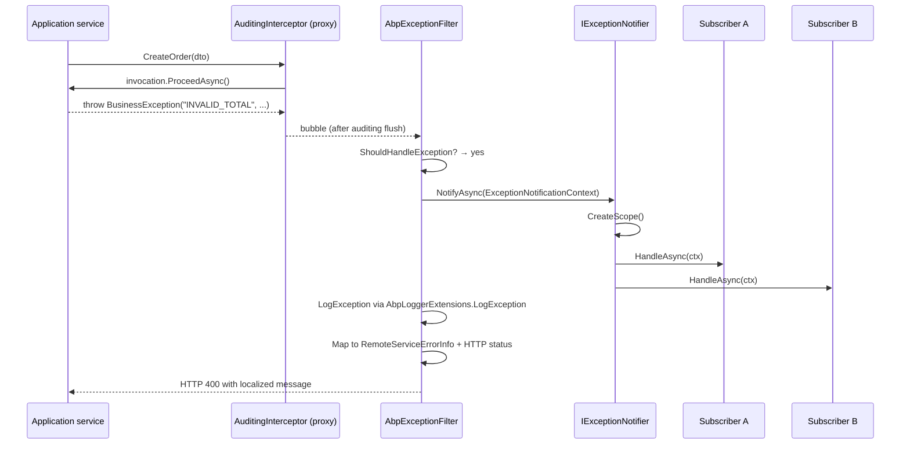

ABP's exception story is built on a handful of marker interfaces, a notifier/subscriber pipeline, and a set of feature-rich exception base classes (`BusinessException`, `UserFriendlyException`). Together they let every layer of the framework agree on what is "safe to show the user", what should be logged at what level, and what HTTP status code to surface. This page enumerates every file in `framework/src/Volo.Abp.Core/Volo/Abp/ExceptionHandling/` and shows how it connects to the MVC integration.

## File map

```
framework/src/Volo.Abp.Core/Volo/Abp/ExceptionHandling/
├── ExceptionNotificationContext.cs
├── ExceptionNotifier.cs
├── ExceptionNotifierExtensions.cs
├── ExceptionSubscriber.cs
├── IExceptionNotifier.cs
├── IExceptionSubscriber.cs
├── IHasErrorCode.cs
├── IHasErrorDetails.cs
├── IHasHttpStatusCode.cs
├── ILocalizeErrorMessage.cs
└── NullExceptionNotifier.cs
```

Related types living one level up under `framework/src/Volo.Abp.Core/Volo/Abp/`:

| File | Purpose |
| --- | --- |
| `AbpException.cs` | Framework-thrown base class. |
| `AbpInitializationException.cs` | Wraps any error during `ConfigureServices` / `OnApplicationInitialization`. |
| `AbpShutdownException.cs` | Wraps any error during `OnApplicationShutdown`. |
| `BusinessException.cs` | Implements `IBusinessException`, `IHasErrorCode`, `IHasErrorDetails`, `IHasLogLevel`. |
| `UserFriendlyException.cs` | Sub-class of `BusinessException` that also implements `IUserFriendlyException`. |
| `IBusinessException.cs` | Marker. |
| `IUserFriendlyException.cs` | Marker (`: IBusinessException`). |
| `System/AbpExceptionExtensions.cs` | `ReThrow()` (via `ExceptionDispatchInfo`) and `GetLogLevel(...)`. |
| `Microsoft/Extensions/Logging/AbpLoggerExtensions.cs` | `LogException(this ILogger, Exception, LogLevel?)`. |

## Marker interfaces

ABP treats exceptions as data: any type can opt into richer behaviour by implementing the following interfaces.

| Interface | File | Purpose |
| --- | --- | --- |
| `IBusinessException` | `Volo/Abp/IBusinessException.cs` | Marks an exception as "expected business condition" — not a bug. MVC filter / RPC layer surface the message to the caller without sanitisation. |
| `IUserFriendlyException` | `Volo/Abp/IUserFriendlyException.cs` | Stricter form of `IBusinessException`. Caller may treat the message text as already user-safe. |
| `IHasErrorCode` | `Volo/Abp/ExceptionHandling/IHasErrorCode.cs` | Exposes `string? Code`. Allows clients to dispatch on machine-readable codes. |
| `IHasErrorDetails` | `Volo/Abp/ExceptionHandling/IHasErrorDetails.cs` | Exposes `string? Details` — multi-line additional info. |
| `IHasHttpStatusCode` | `Volo/Abp/ExceptionHandling/IHasHttpStatusCode.cs` | Exposes `int HttpStatusCode` so the MVC layer can override the response status. |
| `IHasLogLevel` | `Volo/Abp/Logging/IHasLogLevel.cs` | Exposes `LogLevel LogLevel` so the logger can downgrade noise (warning vs error). |
| `ILocalizeErrorMessage` | `Volo/Abp/ExceptionHandling/ILocalizeErrorMessage.cs` | Returns the localized message given a `LocalizationContext`. |
| `IExceptionWithSelfLogging` | `Volo/Abp/Logging/IExceptionWithSelfLogging.cs` | Lets the exception emit additional log entries via `Log(ILogger)`. |

## `BusinessException`

`framework/src/Volo.Abp.Core/Volo/Abp/BusinessException.cs`:

```csharp
public class BusinessException : Exception,
    IBusinessException,
    IHasErrorCode,
    IHasErrorDetails,
    IHasLogLevel
{
    public string? Code { get; set; }
    public string? Details { get; set; }
    public LogLevel LogLevel { get; set; }

    public BusinessException(
        string? code = null,
        string? message = null,
        string? details = null,
        Exception? innerException = null,
        LogLevel logLevel = LogLevel.Warning) : base(message, innerException) { ... }

    public BusinessException WithData(string name, object value)
    {
        Data[name] = value;
        return this;
    }
}
```

The default log level is **Warning**, not Error &mdash; business validation failures should not pollute error dashboards.

## `UserFriendlyException`

`framework/src/Volo.Abp.Core/Volo/Abp/UserFriendlyException.cs` is a `BusinessException` that additionally implements `IUserFriendlyException`:

```csharp
public class UserFriendlyException : BusinessException, IUserFriendlyException
{
    public UserFriendlyException(string message, string? code = null, string? details = null,
        Exception? innerException = null, LogLevel logLevel = LogLevel.Warning)
        : base(code, message, details, innerException, logLevel) { Details = details; }
}
```

<Tip>Throw `UserFriendlyException` from application services when you want to flash a translated message to the caller directly. Use `BusinessException` (without `IUserFriendly`) when the message needs to be looked up via localization &mdash; `ILocalizeErrorMessage` is invoked by the MVC filter to convert error codes to translated text.</Tip>

## Notifier/subscriber pipeline

### `ExceptionNotificationContext`

```csharp
public class ExceptionNotificationContext
{
    public Exception Exception { get; }
    public LogLevel LogLevel { get; }
    public bool Handled { get; }

    public ExceptionNotificationContext(Exception exception, LogLevel? logLevel = null, bool handled = true)
    {
        Exception = Check.NotNull(exception, nameof(exception));
        LogLevel = logLevel ?? exception.GetLogLevel();
        Handled = handled;
    }
}
```

`Exception.GetLogLevel()` (from `System/AbpExceptionExtensions.cs`) returns `(exception as IHasLogLevel)?.LogLevel ?? LogLevel.Error`. `Handled = false` means a final unhandled-exception page emitted the context; subscribers may persist it without claiming responsibility.

### `IExceptionNotifier` and `ExceptionNotifier`

```csharp
public interface IExceptionNotifier
{
    Task NotifyAsync([NotNull] ExceptionNotificationContext context);
}

public class ExceptionNotifier : IExceptionNotifier, ITransientDependency
{
    public virtual async Task NotifyAsync(ExceptionNotificationContext context)
    {
        Check.NotNull(context, nameof(context));
        using (var scope = ServiceScopeFactory.CreateScope())
        {
            var exceptionSubscribers = scope.ServiceProvider.GetServices<IExceptionSubscriber>();
            foreach (var exceptionSubscriber in exceptionSubscribers)
            {
                try { await exceptionSubscriber.HandleAsync(context); }
                catch (Exception e)
                {
                    Logger.LogWarning($"Exception subscriber of type {exceptionSubscriber.GetType().AssemblyQualifiedName} has thrown an exception!");
                    Logger.LogException(e, LogLevel.Warning);
                }
            }
        }
    }
}
```

Each `NotifyAsync` opens a **fresh** scope so subscribers can resolve scoped services (e.g. `ICurrentUser`, `IUnitOfWorkManager`) without leaking onto the failing request's scope. Exceptions thrown *inside* a subscriber are logged at Warning and swallowed &mdash; the notifier must never throw.

### `IExceptionSubscriber` and `ExceptionSubscriber`

```csharp
public interface IExceptionSubscriber
{
    Task HandleAsync(ExceptionNotificationContext context);
}

[ExposeServices(typeof(IExceptionSubscriber))]
public abstract class ExceptionSubscriber : IExceptionSubscriber, ITransientDependency
{
    public abstract Task HandleAsync(ExceptionNotificationContext context);
}
```

Subscribers register themselves automatically by deriving from `ExceptionSubscriber`. Examples shipped by other modules:

- Audit logging: `AuditingExceptionSubscriber` records exceptions in the audit log.
- Background jobs: `BackgroundJobExceptionSubscriber` adjusts retry counts.

### `ExceptionNotifierExtensions`

```csharp
public static Task NotifyAsync(this IExceptionNotifier exceptionNotifier,
    Exception exception, LogLevel? logLevel = null, bool handled = true)
```

The overload accepting `Exception` directly is the call most code uses. The MVC filter (`AbpExceptionFilter`) calls `await context.GetRequiredService<IExceptionNotifier>().NotifyAsync(new ExceptionNotificationContext(context.Exception));`.

### `NullExceptionNotifier`

`Volo/Abp/ExceptionHandling/NullExceptionNotifier.cs` is a singleton no-op used by infrastructure components (e.g. `AbpAsyncTimer.ExceptionNotifier`) when DI is unavailable. Always exposed via `NullExceptionNotifier.Instance`.

## Sequence



## Logging integration

`framework/src/Volo.Abp.Core/Microsoft/Extensions/Logging/AbpLoggerExtensions.cs` provides the canonical `LogException` extension used throughout the framework:

```csharp
public static void LogException(this ILogger logger, Exception ex, LogLevel? level = null)
{
    var selectedLevel = level ?? ex.GetLogLevel();
    logger.LogWithLevel(selectedLevel, ex.Message, ex);
    LogKnownProperties(logger, ex, selectedLevel);
    LogSelfLogging(logger, ex);
    LogData(logger, ex, selectedLevel);
}
```

It writes:

1. The message + stack at the resolved level (via `LogWithLevel(LogLevel, string, Exception)`).
2. Any `IHasErrorCode.Code` and `IHasErrorDetails.Details`.
3. `IExceptionWithSelfLogging.Log(logger)` for both the exception and its `AggregateException` inner exceptions.
4. The entire `Exception.Data` dictionary (multi-line).

`LogWithLevel(ILogger, LogLevel, string)` is a tiny dispatcher that maps `LogLevel` enum values to `LogCritical/LogError/LogWarning/LogInformation/LogTrace`. `LogLevel.Debug` and `LogLevel.None` both fall through to `LogDebug`. See [Logging & tracing](/core/logging-and-tracing) for the broader logger story.

## MVC integration

The ASP.NET Core MVC filter that consumes these primitives lives at `framework/src/Volo.Abp.AspNetCore.Mvc/Volo/Abp/AspNetCore/Mvc/ExceptionHandling/AbpExceptionFilter.cs`:

```csharp
public class AbpExceptionFilter : IAsyncExceptionFilter, IAbpFilter, ITransientDependency
{
    public virtual async Task OnExceptionAsync(ExceptionContext context)
    {
        if (!ShouldHandleException(context)) { LogException(context, out _); return; }
        await HandleAndWrapException(context);
    }

    protected virtual bool ShouldHandleException(ExceptionContext context)
    {
        if (context.ExceptionHandled) return false;
        if (context.ActionDescriptor.IsControllerAction()
            && context.ActionDescriptor.HasObjectResult()) return true;
        if (context.HttpContext.Request.CanAccept(MimeTypes.Application.Json)) return true;
        if (context.HttpContext.Request.IsAjax()) return true;
        return false;
    }

    protected virtual async Task HandleAndWrapException(ExceptionContext context)
    {
        LogException(context, out var remoteServiceErrorInfo);
        await context.GetRequiredService<IExceptionNotifier>().NotifyAsync(
            new ExceptionNotificationContext(context.Exception));
        if (context.Exception is AbpAuthorizationException) { ... }
        else { ... }
    }
}
```

Decision flow:

| Condition | Outcome |
| --- | --- |
| `ExceptionHandled == true` | Skip; nothing to do. |
| Controller action returning an `ObjectResult` | Wrap. |
| Request accepts `application/json` (uses `MimeTypes.Application.Json` from `Volo/Abp/Http/MimeTypes.cs`) | Wrap. |
| Ajax request (`X-Requested-With: XMLHttpRequest`) | Wrap. |
| Otherwise | Log only; let ASP.NET render the standard error page. |

When the filter "wraps":

- Sets `Response.Headers["_AbpErrorFormat"] = "true"`.
- Converts the exception to `RemoteServiceErrorInfo` (using `IHasErrorCode`, `IHasErrorDetails`, `ILocalizeErrorMessage` and the localizer).
- Picks the HTTP status code via `IHasHttpStatusCode` if present, otherwise via `ExceptionHttpStatusCodeOptions` (look-up by code).
- For `AbpAuthorizationException` it delegates to `IAbpAuthorizationExceptionHandler` (challenge vs forbid).

## Exceptions in the boot pipeline

`AbpApplicationBase.ConfigureServices()` wraps any exception thrown by a module's `Pre/ConfigureServices/PostConfigureServices` in `AbpInitializationException`. `ModuleManager.InitializeModulesAsync` does the same for init contributors; `ModuleManager.ShutdownModulesAsync` wraps in `AbpShutdownException`. See [Modularity system](/core/modularity-system) for the exact strings.

## Putting it together

<Steps>
  <Step title="Throw a domain failure">`throw new BusinessException("Catalog:OutOfStock").WithData("Sku", sku);`</Step>
  <Step title="Auditing flushes the log entry">`AuditingInterceptor.ProceedByLoggingAsync` catches the exception, adds it to `auditLog.Exceptions`, and re-throws.</Step>
  <Step title="ASP.NET filter intercepts">`AbpExceptionFilter.OnExceptionAsync` recognises the request as JSON, calls `IExceptionNotifier.NotifyAsync`, logs via `ILogger.LogException`, and emits a 4xx response with error code `Catalog:OutOfStock`.</Step>
  <Step title="Subscribers persist context">A custom `ExceptionSubscriber` records the exception in a long-term store. Failures inside that subscriber are swallowed by `ExceptionNotifier`.</Step>
  <Step title="Client receives localized text">The client reads the `Code` and uses `ILocalizationManager` (via the response JSON) to render the right translation.</Step>
</Steps>

## See also

- [Logging & tracing](/core/logging-and-tracing) for `LogException` internals and Serilog bridge.
- [Dynamic proxy & aspects](/core/dynamic-proxy-and-aspects) for how the auditing/unit-of-work interceptors handle exceptions before they reach the filter.
- [ASP.NET Core overview](/aspnetcore/overview) for `AbpExceptionFilter` registration and the broader MVC filter pipeline.
