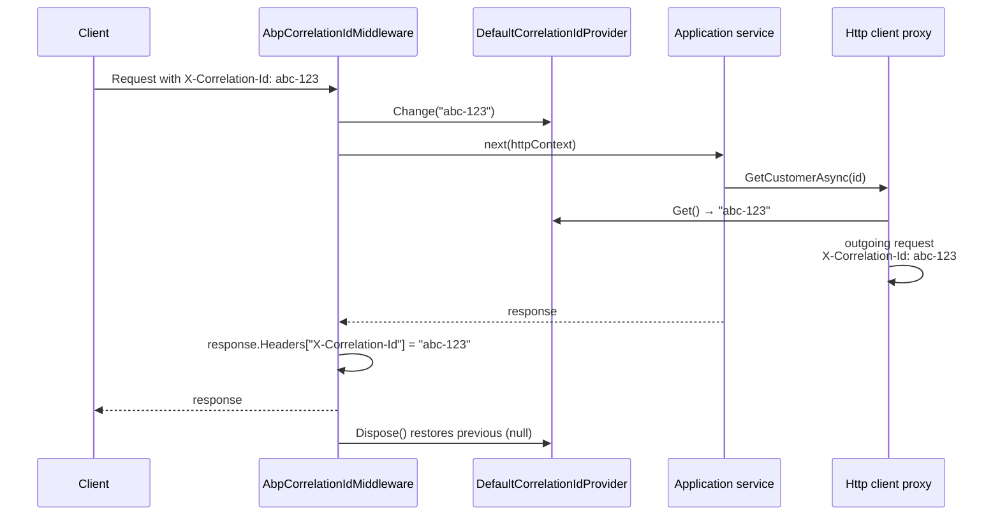

ABP runs its module loader and conventional registrar **before** any `ILoggerFactory` exists. To capture log messages from that window the framework ships an init logger that buffers entries until the real logger pipeline is built. After boot, exception-aware logging extensions and an `AsyncLocal`-backed correlation-id provider turn every log line into something traceable across requests. This page covers `framework/src/Volo.Abp.Core/Volo/Abp/Logging/`, `Volo/Abp/Tracing/`, the matching DI/logger extensions, and the Serilog bridge that lives in `framework/src/Volo.Abp.AspNetCore.Serilog/`.

## File map

```
framework/src/Volo.Abp.Core/Volo/Abp/Logging/
├── AbpInitLogEntry.cs
├── DefaultInitLogger.cs
├── DefaultInitLoggerFactory.cs
├── HasLogLevelExtensions.cs
├── IExceptionWithSelfLogging.cs
├── IHasLogLevel.cs
├── IInitLogger.cs
└── IInitLoggerFactory.cs

framework/src/Volo.Abp.Core/Volo/Abp/Tracing/
├── AbpCorrelationIdOptions.cs
├── DefaultCorrelationIdProvider.cs
└── ICorrelationIdProvider.cs

framework/src/Volo.Abp.Core/Microsoft/Extensions/Logging/
└── AbpLoggerExtensions.cs

framework/src/Volo.Abp.Core/Microsoft/Extensions/DependencyInjection/
└── ServiceCollectionLoggingExtensions.cs
```

## The init-phase logger

During `AbpApplicationBase.ConfigureServices()` (see [Volo.Abp.Core deep dive](/core/volo-abp-core)) the framework needs to log "loaded modules", reflection errors, and conventional-registrar failures &mdash; but `services.AddLogging()` has just run and no provider exists yet. The init logger sits in front of the real `ILoggerFactory` and stores log entries for later replay.

### `IInitLogger<T>` / `IInitLoggerFactory`

```csharp
public interface IInitLogger<out T> : ILogger<T>
{
    public List<AbpInitLogEntry> Entries { get; }
}

public interface IInitLoggerFactory
{
    IInitLogger<T> Create<T>();
}
```

`IInitLogger<T>` extends `ILogger<T>` so callers use the same `LogInformation/LogWarning/LogException` API. The factory caches loggers per type:

```csharp
public class DefaultInitLoggerFactory : IInitLoggerFactory
{
    private readonly Dictionary<Type, object> _cache = [];
    public virtual IInitLogger<T> Create<T>()
        => (IInitLogger<T>)_cache.GetOrAdd(typeof(T), () => new DefaultInitLogger<T>());
}
```

### `DefaultInitLogger<T>`

`Volo/Abp/Logging/DefaultInitLogger.cs` stores entries in a `List<AbpInitLogEntry>`:

```csharp
public virtual void Log<TState>(LogLevel logLevel, EventId eventId, TState state, Exception? exception, Func<TState, Exception?, string> formatter)
{
    Entries.Add(new AbpInitLogEntry
    {
        LogLevel = logLevel,
        EventId = eventId,
        State = state!,
        Exception = exception,
        Formatter = (s, e) => formatter((TState)s, e),
    });
}

public virtual bool IsEnabled(LogLevel logLevel) => logLevel != LogLevel.None;
public virtual IDisposable BeginScope<TState>(TState state) where TState : notnull => NullDisposable.Instance;
```

### `AbpInitLogEntry`

```csharp
public class AbpInitLogEntry
{
    public LogLevel LogLevel { get; set; }
    public EventId EventId { get; set; }
    public object State { get; set; } = default!;
    public Exception? Exception { get; set; }
    public Func<object, Exception?, string> Formatter { get; set; } = default!;
    public string Message => Formatter(State, Exception);
}
```

### Replay during `Initialize`

`AbpApplicationBase.WriteInitLogs(IServiceProvider)` is called inside `InitializeModules[Async]()` after the root container has been built:

```csharp
protected virtual void WriteInitLogs(IServiceProvider serviceProvider)
{
    var logger = serviceProvider.GetService<ILogger<AbpApplicationBase>>();
    if (logger == null) return;

    var initLogger = serviceProvider.GetRequiredService<IInitLoggerFactory>().Create<AbpApplicationBase>();
    foreach (var entry in initLogger.Entries)
    {
        logger.Log(entry.LogLevel, entry.EventId, entry.State, entry.Exception, entry.Formatter);
    }
    initLogger.Entries.Clear();
}
```

So the messages your modules logged before there was a logger appear in the real Serilog/Microsoft.Extensions.Logging sinks the first time module initialisation runs.

<Note>Only the `AbpApplicationBase`-typed init logger is replayed — other init loggers (e.g. `IInitLogger<TypeFinder>`) are not automatically forwarded. If you need their messages, replay them explicitly during your module's `OnApplicationInitialization`.</Note>

### Boot-time access

`framework/src/Volo.Abp.Core/Microsoft/Extensions/DependencyInjection/ServiceCollectionLoggingExtensions.cs` exposes the call ABP uses everywhere during boot:

```csharp
public static class ServiceCollectionLoggingExtensions
{
    public static ILogger<T> GetInitLogger<T>(this IServiceCollection services)
    {
        var loggerFactory = services.GetSingletonInstanceOrNull<IInitLoggerFactory>();
        return loggerFactory == null ? NullLogger<T>.Instance : loggerFactory.Create<T>();
    }
}
```

`AddCoreAbpServices` registers `IInitLoggerFactory` as a singleton instance (`new DefaultInitLoggerFactory()`) so `GetSingletonInstance<IInitLoggerFactory>()` works without a provider.

Callers in core:

| Caller | File |
| --- | --- |
| `ModuleLoader.FillModules` | `framework/src/Volo.Abp.Core/Volo/Abp/Modularity/ModuleLoader.cs` (logs each module name with indent). |
| `ConventionalRegistrarBase.AddAssembly` | `framework/src/Volo.Abp.Core/Volo/Abp/DependencyInjection/ConventionalRegistrarBase.cs` (logs `ReflectionTypeLoadException`). |
| `TypeFinder.FindAll` | `framework/src/Volo.Abp.Core/Volo/Abp/Reflection/TypeFinder.cs` (logs `ReflectionTypeLoadException`). |
| `AbpApplicationBase.InitializeTelemetryTracking` | swallows telemetry errors via `Services.GetInitLogger<AbpApplicationBase>().LogException(ex, LogLevel.Trace);` |

## Exception ↔ log mapping

Once the real logger is up, every framework component that catches an exception passes it through `AbpLoggerExtensions.LogException`. The implementation in `framework/src/Volo.Abp.Core/Microsoft/Extensions/Logging/AbpLoggerExtensions.cs`:

```csharp
public static void LogException(this ILogger logger, Exception ex, LogLevel? level = null)
{
    var selectedLevel = level ?? ex.GetLogLevel();
    logger.LogWithLevel(selectedLevel, ex.Message, ex);
    LogKnownProperties(logger, ex, selectedLevel);
    LogSelfLogging(logger, ex);
    LogData(logger, ex, selectedLevel);
}
```

### `LogWithLevel`

The dispatcher in the same file maps a `LogLevel` enum value to the appropriate logger call:

```csharp
public static void LogWithLevel(this ILogger logger, LogLevel logLevel, string message)
{
    switch (logLevel)
    {
        case LogLevel.Critical:    logger.LogCritical(message); break;
        case LogLevel.Error:       logger.LogError(message); break;
        case LogLevel.Warning:     logger.LogWarning(message); break;
        case LogLevel.Information: logger.LogInformation(message); break;
        case LogLevel.Trace:       logger.LogTrace(message); break;
        default:                   logger.LogDebug(message); break; // Debug and None both fall through
    }
}
```

The exception-typed overload is identical with `LogXxx(exception, message)` calls.

### Known properties

`LogKnownProperties` emits an extra line for any `IHasErrorCode.Code` and `IHasErrorDetails.Details`:

```
warn: Catalog.OrderService[0]
      The order is invalid.
warn: Catalog.OrderService[0]
      Code:Catalog:InvalidOrder
warn: Catalog.OrderService[0]
      Details:Total must be greater than zero.
```

### Self-logging

`IExceptionWithSelfLogging.Log(ILogger)` lets an exception emit arbitrary additional context. `LogSelfLogging` unwraps `AggregateException` and walks `InnerExceptions` so wrapped self-logging exceptions still get a chance to speak.

### `Exception.Data`

If `exception.Data.Count > 0`, the entire dictionary is appended via a `StringBuilder` block under `---------- Exception Data ----------`. This means `BusinessException.WithData("Sku", "ABC-123")` automatically appears in logs without bespoke code.

### `GetLogLevel`

`framework/src/Volo.Abp.Core/System/AbpExceptionExtensions.cs`:

```csharp
public static LogLevel GetLogLevel(this Exception exception, LogLevel defaultLevel = LogLevel.Error)
    => (exception as IHasLogLevel)?.LogLevel ?? defaultLevel;
```

So `BusinessException` (which sets `LogLevel = LogLevel.Warning` by default) is logged at warning, not error.

### `HasLogLevelExtensions`

`framework/src/Volo.Abp.Core/Volo/Abp/Logging/HasLogLevelExtensions.cs`:

```csharp
public static TException WithLogLevel<TException>(this TException exception, LogLevel logLevel)
    where TException : IHasLogLevel
{
    Check.NotNull(exception, nameof(exception));
    exception.LogLevel = logLevel;
    return exception;
}
```

Fluent helper: `throw new BusinessException(...).WithLogLevel(LogLevel.Information);`.

## Tracing: correlation IDs

### `ICorrelationIdProvider`

```csharp
public interface ICorrelationIdProvider
{
    string? Get();
    IDisposable Change(string? correlationId);
}
```

`DefaultCorrelationIdProvider` (`Volo/Abp/Tracing/DefaultCorrelationIdProvider.cs`) is registered as `ISingletonDependency` and backs the value with `AsyncLocal<string?>`:

```csharp
public class DefaultCorrelationIdProvider : ICorrelationIdProvider, ISingletonDependency
{
    private readonly AsyncLocal<string?> _currentCorrelationId = new AsyncLocal<string?>();
    public virtual string? Get() => _currentCorrelationId.Value;
    public virtual IDisposable Change(string? correlationId)
    {
        var parent = _currentCorrelationId.Value;
        _currentCorrelationId.Value = correlationId;
        return new DisposeAction(() => _currentCorrelationId.Value = parent);
    }
}
```

The `Change(...)` method's `DisposeAction` restores the previous value &mdash; supports nested scopes (e.g. a background worker handling a message scopes itself under the message's correlation id, then restores the original when the unit-of-work ends).

### `AbpCorrelationIdOptions`

```csharp
public class AbpCorrelationIdOptions
{
    public string HttpHeaderName { get; set; } = "X-Correlation-Id";
    public bool SetResponseHeader { get; set; } = true;
}
```

The ASP.NET Core integration ships an `AbpCorrelationIdMiddleware` that reads the header (default `X-Correlation-Id`) into the provider via `_correlationIdProvider.Change(headerValue)`. When `SetResponseHeader = true` it also writes the resolved id back on the response. HTTP client proxies (`Volo.Abp.Http.Client`) flow the value outbound by adding the same header to outgoing requests.



## Serilog bridge

`framework/src/Volo.Abp.AspNetCore.Serilog/Volo/Abp/AspNetCore/Serilog/` provides middleware-based enrichment that flows ABP's ambient values (tenant, user, client, correlation id) into Serilog's `LogContext`:

```csharp
[DependsOn(typeof(AbpMultiTenancyModule), typeof(AbpAspNetCoreModule))]
public class AbpAspNetCoreSerilogModule : AbpModule { }
```

### `AbpSerilogMiddleware`

```csharp
public class AbpSerilogMiddleware : AbpMiddlewareBase, ITransientDependency
{
    public async override Task InvokeAsync(HttpContext context, RequestDelegate next)
    {
        var enrichers = new List<ILogEventEnricher>();
        if (_currentTenant?.Id != null)  enrichers.Add(new PropertyEnricher(_options.EnricherPropertyNames.TenantId, _currentTenant.Id));
        if (_currentUser?.Id != null)    enrichers.Add(new PropertyEnricher(_options.EnricherPropertyNames.UserId, _currentUser.Id));
        if (_currentClient?.Id != null)  enrichers.Add(new PropertyEnricher(_options.EnricherPropertyNames.ClientId, _currentClient.Id));
        var correlationId = _correlationIdProvider.Get();
        if (!string.IsNullOrEmpty(correlationId))
            enrichers.Add(new PropertyEnricher(_options.EnricherPropertyNames.CorrelationId, correlationId));

        using (LogContext.Push(enrichers.ToArray()))
        {
            await next(context);
        }
    }
}
```

### `AbpAspNetCoreSerilogOptions`

```csharp
public class AbpAspNetCoreSerilogOptions
{
    public AllEnricherPropertyNames EnricherPropertyNames { get; } = new AllEnricherPropertyNames();
    public class AllEnricherPropertyNames
    {
        public string TenantId { get; set; }     = "TenantId";
        public string UserId { get; set; }       = "UserId";
        public string ClientId { get; set; }     = "ClientId";
        public string CorrelationId { get; set; } = "CorrelationId";
    }
}
```

Override the property names in your host module if you need to align with an existing log schema:

```csharp
Configure<AbpAspNetCoreSerilogOptions>(opt =>
{
    opt.EnricherPropertyNames.TenantId = "abp.tenant_id";
});
```

### Application builder hook

`Microsoft/AspNetCore/Builder/AbpAspNetCoreSerilogApplicationBuilderExtensions.cs`:

```csharp
public static IApplicationBuilder UseAbpSerilogEnrichers(this IApplicationBuilder app)
    => app.UseMiddleware<AbpSerilogMiddleware>();
```

Host modules typically call this right after authentication so the user id has already been populated:

```csharp
app.UseAuthentication();
app.UseAbpSerilogEnrichers();
app.UseAuthorization();
```

## End-to-end picture

```mermaid
flowchart TD
    subgraph Boot["AbpApplicationBase boot"]
      IL[DefaultInitLoggerFactory<br/>singleton]
      IL --> ML[ModuleLoader logs<br/>via GetInitLogger]
      IL --> CR[ConventionalRegistrarBase<br/>logs ReflectionTypeLoadException]
      IL --> TF[TypeFinder logs<br/>load errors]
    end
    subgraph Init["After ServiceProvider built"]
      WIL[AbpApplicationBase.WriteInitLogs]
      WIL --> Real[ILoggerFactory pipeline]
      Real --> Serilog[Serilog / Console / File sinks]
    end
    subgraph Request["Per request"]
      CID[AbpCorrelationIdMiddleware<br/>_correlationIdProvider.Change(...)]
      CID --> EN[AbpSerilogMiddleware<br/>LogContext.Push]
      EN --> Code[Application services<br/>logger.LogException]
      Code --> Real
    end
    IL -.replays into.-> WIL
```

## Cross-references

- [Exception handling](/core/exception-handling) for the `IHasLogLevel` and `IHasErrorCode` interfaces consumed by `LogException`.
- [Threading & async](/core/threading-and-async) for the `AsyncLocal<T>` semantics that `DefaultCorrelationIdProvider` relies on.
- [Modularity system](/core/modularity-system) for `IPreConfigureServices` / `IConfigureServices` where init-phase logs originate.
- [Application startup flow](/flows/application-startup) for the exact point at which `WriteInitLogs` runs.
- [ASP.NET Core overview](/aspnetcore/overview) for `AbpCorrelationIdMiddleware` and `UseAbpSerilogEnrichers` placement within the middleware pipeline.
