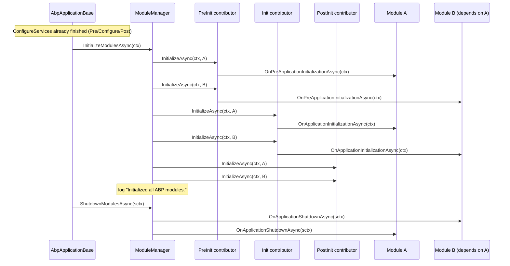

The modularity engine is what makes an ABP application different from a vanilla `Microsoft.Extensions.Hosting` app. Every distinct unit of functionality &mdash; persistence, identity, audit, MVC integration &mdash; is an `IAbpModule` that declares its dependencies via `[DependsOn(...)]`. This page traces every file in `framework/src/Volo.Abp.Core/Volo/Abp/Modularity/`, including the plug-in subsystem, lifecycle contributors, and the descriptor graph.

## File map

```
framework/src/Volo.Abp.Core/Volo/Abp/Modularity/
├── AbpModule.cs                              # default base class
├── AbpModuleDescriptor.cs                    # runtime view of one module
├── AbpModuleDescriptorExtensions.cs          # helpers (GetAllAssemblies, ...)
├── AbpModuleHelper.cs                        # discovery (walk DependsOn)
├── AbpModuleLifecycleOptions.cs              # contributor TypeList
├── AdditionalAssemblyAttribute.cs            # opt-in extra assemblies
├── DefaultModuleLifecycleContributor.cs      # 4 built-in contributors
├── DependsOnAttribute.cs                     # graph edges
├── IAbpModule.cs                             # the absolute minimum
├── IAbpModuleDescriptor.cs
├── IAdditionalModuleAssemblyProvider.cs
├── IDependedTypesProvider.cs
├── IModuleContainer.cs                       # IAbpApplication implements this
├── IModuleLifecycleContributor.cs            # extensibility point
├── IModuleLoader.cs                          # ModuleLoader is the only impl
├── IModuleManager.cs                         # ModuleManager is the only impl
├── IOnPostApplicationInitialization.cs
├── IOnPreApplicationInitialization.cs
├── IPostConfigureServices.cs
├── IPreConfigureServices.cs
├── ModuleLifecycleContributorBase.cs
├── ModuleLoader.cs                           # loads & sorts descriptors
├── ModuleManager.cs                          # runs contributors
├── ServiceConfigurationContext.cs            # passed to (Pre/Post)?ConfigureServices
└── PlugIns/                                  # File/Folder/Type plug-in sources
    ├── FilePlugInSource.cs
    ├── FolderPlugInSource.cs
    ├── IPlugInSource.cs
    ├── PlugInSourceExtensions.cs
    ├── PlugInSourceList.cs
    ├── PlugInSourceListExtensions.cs
    └── TypePlugInSource.cs
```

## `IAbpModule` and `AbpModule`

Every module ultimately implements `IAbpModule` (`Volo/Abp/Modularity/IAbpModule.cs`):

```csharp
public interface IAbpModule
{
    Task ConfigureServicesAsync(ServiceConfigurationContext context);
    void ConfigureServices(ServiceConfigurationContext context);
}
```

In practice modules inherit `AbpModule` (`Volo/Abp/Modularity/AbpModule.cs`) which implements every optional lifecycle interface at once: `IOnPreApplicationInitialization`, `IOnApplicationInitialization`, `IOnPostApplicationInitialization`, `IOnApplicationShutdown`, `IPreConfigureServices`, `IPostConfigureServices`. All seven phases have async + sync pairs whose default implementations are no-ops.

```csharp
public abstract class AbpModule :
    IAbpModule,
    IOnPreApplicationInitialization,
    IOnApplicationInitialization,
    IOnPostApplicationInitialization,
    IOnApplicationShutdown,
    IPreConfigureServices,
    IPostConfigureServices
{
    protected internal bool SkipAutoServiceRegistration { get; protected set; }

    protected internal ServiceConfigurationContext ServiceConfigurationContext { get; internal set; }
    // Configure<TOptions>, PreConfigure<TOptions>, PostConfigure<TOptions>, PostConfigureAll<TOptions>
}
```

`AbpModule` also gives modules access to the underlying service collection through six `Configure*<TOptions>` shortcuts that thin-wrap `services.Configure`, `services.PreConfigure`, `services.PostConfigure`, and `services.PostConfigureAll`. Outside the `(Pre|Post)?ConfigureServices` methods the `ServiceConfigurationContext` getter throws `AbpException` because the field is nulled out at the end of `AbpApplicationBase.ConfigureServices()`.

<Tip>Setting `SkipAutoServiceRegistration = true` in a module's constructor disables the conventional `services.AddAssembly(asm)` calls that `AbpApplicationBase.ConfigureServices` makes for that module's assemblies.</Tip>

### Static guards

`AbpModule.IsAbpModule(Type)` and the internal `AbpModule.CheckAbpModuleType(Type)` validate that the candidate is a concrete, non-generic class implementing `IAbpModule`. The loader uses both to fail fast.

```csharp
public static bool IsAbpModule(Type type)
{
    var typeInfo = type.GetTypeInfo();
    return typeInfo.IsClass &&
           !typeInfo.IsAbstract &&
           !typeInfo.IsGenericType &&
           typeof(IAbpModule).GetTypeInfo().IsAssignableFrom(type);
}
```

## Discovery via attributes

Two attributes drive discovery. Both live next to the module class and stack via `AllowMultiple = true`.

### `[DependsOn]`

`Volo/Abp/Modularity/DependsOnAttribute.cs` implements `IDependedTypesProvider`:

```csharp
[AttributeUsage(AttributeTargets.Class, AllowMultiple = true)]
public class DependsOnAttribute : Attribute, IDependedTypesProvider
{
    public Type[] DependedTypes { get; }
    public DependsOnAttribute(params Type[]? dependedTypes)
        => DependedTypes = dependedTypes ?? Type.EmptyTypes;
    public virtual Type[] GetDependedTypes() => DependedTypes;
}
```

`AbpModuleHelper.FindDependedModuleTypes(moduleType)` (`Volo/Abp/Modularity/AbpModuleHelper.cs`) reads **every** attribute that implements `IDependedTypesProvider`, not just `DependsOnAttribute`. That is the extensibility hook for custom dependency descriptors (e.g. an attribute that adds dependencies conditionally).

### `[AdditionalAssembly]`

`Volo/Abp/Modularity/AdditionalAssemblyAttribute.cs` implements `IAdditionalModuleAssemblyProvider`. Use it when a module's logical surface spans more than one assembly:

```csharp
[AttributeUsage(AttributeTargets.Class, AllowMultiple = true)]
public class AdditionalAssemblyAttribute : Attribute, IAdditionalModuleAssemblyProvider
{
    public Type[] TypesInAssemblies { get; }
    public virtual Assembly[] GetAssemblies()
        => TypesInAssemblies.Select(t => t.Assembly).Distinct().ToArray();
}
```

`AbpModuleHelper.GetAllAssemblies(Type)` aggregates these and appends `moduleType.Assembly` &mdash; the resulting list lives on `AbpModuleDescriptor.AllAssemblies`.

### Recursive walk

```csharp
public static List<Type> FindAllModuleTypes(Type startupModuleType, ILogger? logger)
{
    var moduleTypes = new List<Type>();
    logger?.Log(LogLevel.Debug, "Loaded ABP modules:");
    AddModuleAndDependenciesRecursively(moduleTypes, startupModuleType, logger);
    return moduleTypes;
}
```

`AddModuleAndDependenciesRecursively` checks `IsAbpModule`, skips duplicates, logs each module with an indent reflecting its depth, then recurses through `FindDependedModuleTypes`.

## `ModuleLoader`

`framework/src/Volo.Abp.Core/Volo/Abp/Modularity/ModuleLoader.cs` is the only `IModuleLoader` shipped by the framework. It is created in `InternalServiceCollectionExtensions.AddCoreAbpServices` and registered as a singleton.

```csharp
public IAbpModuleDescriptor[] LoadModules(
    IServiceCollection services,
    Type startupModuleType,
    PlugInSourceList plugInSources)
{
    var modules = GetDescriptors(services, startupModuleType, plugInSources);
    modules = SortByDependency(modules, startupModuleType);
    return modules.ToArray();
}
```

### Steps

<Steps>
  <Step title="Walk the module graph">`FillModules` calls `AbpModuleHelper.FindAllModuleTypes(startupModuleType, logger)` and creates an `AbpModuleDescriptor` for each via `CreateModuleDescriptor → CreateAndRegisterModule`. The latter does `Activator.CreateInstance(moduleType)` and `services.AddSingleton(moduleType, instance)` so the descriptor and the DI container share the same instance.</Step>
  <Step title="Apply plug-in sources">For every `IPlugInSource` in `PlugInSources.GetAllModules(logger)`, add a descriptor only if not already present and mark it `IsLoadedAsPlugIn = true`.</Step>
  <Step title="Wire dependencies">`SetDependencies(modules)` reads `AbpModuleHelper.FindDependedModuleTypes(module.Type)` and links descriptors via `module.AddDependency(...)`. A missing dependency throws `AbpException("Could not find a depended module ...")`.</Step>
  <Step title="Topological sort">`SortByDependency` calls `modules.SortByDependencies(m => m.Dependencies)` (from `Collections/CollectionExtensions`) and then `MoveItem` to push the startup module to the very end so it runs last.</Step>
</Steps>

### `AbpModuleDescriptor`

`Volo/Abp/Modularity/AbpModuleDescriptor.cs` exposes:

| Member | Notes |
| --- | --- |
| `Type Type` | The CLR type. |
| `Assembly Assembly` | `Type.Assembly`. |
| `Assembly[] AllAssemblies` | `AbpModuleHelper.GetAllAssemblies(type)` &mdash; module assembly + every `AdditionalAssemblyAttribute` target. |
| `IAbpModule Instance` | The module instance created by `Activator`. |
| `bool IsLoadedAsPlugIn` | True if the descriptor came from a plug-in source. |
| `IReadOnlyList<IAbpModuleDescriptor> Dependencies` | Filled by `SetDependencies`. Immutable snapshot. |

`AbpModuleDescriptorExtensions` exposes helpers (e.g. flattening dependencies) used by reporting/diagnostic code.

## `ServiceConfigurationContext`

`framework/src/Volo.Abp.Core/Volo/Abp/Modularity/ServiceConfigurationContext.cs`:

```csharp
public class ServiceConfigurationContext
{
    public IServiceCollection Services { get; }
    public IConfiguration Configuration => _configuration ??= Services.GetConfiguration();
    public IDictionary<string, object?> Items { get; }
    public object? this[string key] { get => Items.GetOrDefault(key); set => Items[key] = value; }
}
```

The same instance is used across every `Pre/Configure/PostConfigureServices` call so modules can communicate via the `Items` dictionary &mdash; e.g. `Volo.Abp.Authorization` stashes pre-configured permission definitions for `Volo.Abp.AspNetCore.Mvc` to pick up later.

## Lifecycle phases and contributors

`IModuleLifecycleContributor` is the extensibility point that drives every per-module callback:

```csharp
public interface IModuleLifecycleContributor : ITransientDependency
{
    Task InitializeAsync(ApplicationInitializationContext context, IAbpModule module);
    void Initialize(ApplicationInitializationContext context, IAbpModule module);
    Task ShutdownAsync(ApplicationShutdownContext context, IAbpModule module);
    void Shutdown(ApplicationShutdownContext context, IAbpModule module);
}
```

`ModuleLifecycleContributorBase` (`Volo/Abp/Modularity/ModuleLifecycleContributorBase.cs`) supplies no-op defaults so subclasses only override what they need. The four shipped contributors live in `DefaultModuleLifecycleContributor.cs` and each one targets a single interface:

| Contributor | Interface | Phase |
| --- | --- | --- |
| `OnPreApplicationInitializationModuleLifecycleContributor` | `IOnPreApplicationInitialization` | Pre-init |
| `OnApplicationInitializationModuleLifecycleContributor` | `IOnApplicationInitialization` | Init |
| `OnPostApplicationInitializationModuleLifecycleContributor` | `IOnPostApplicationInitialization` | Post-init |
| `OnApplicationShutdownModuleLifecycleContributor` | `IOnApplicationShutdown` | Shutdown (reverse order) |

The contributor type list is held by `AbpModuleLifecycleOptions.Contributors` (a `TypeList<IModuleLifecycleContributor>` from `Volo.Abp.Collections`) and pre-populated by `AddCoreAbpServices` in this **fixed order** (see `Volo/Abp/Internal/InternalServiceCollectionExtensions.cs`):

```csharp
services.Configure<AbpModuleLifecycleOptions>(options =>
{
    options.Contributors.Add<OnPreApplicationInitializationModuleLifecycleContributor>();
    options.Contributors.Add<OnApplicationInitializationModuleLifecycleContributor>();
    options.Contributors.Add<OnPostApplicationInitializationModuleLifecycleContributor>();
    options.Contributors.Add<OnApplicationShutdownModuleLifecycleContributor>();
});
```

You can `Configure<AbpModuleLifecycleOptions>(o => o.Contributors.Add<MyContributor>())` to splice extra phases (e.g. metric collection before/after each module's init).

## `ModuleManager`

`framework/src/Volo.Abp.Core/Volo/Abp/Modularity/ModuleManager.cs` runs the contributors. It is registered as a singleton implementing `IModuleManager, ISingletonDependency`:

```csharp
public ModuleManager(
    IModuleContainer moduleContainer,
    ILogger<ModuleManager> logger,
    IOptions<AbpModuleLifecycleOptions> options,
    IServiceProvider serviceProvider)
{
    _moduleContainer = moduleContainer;
    _logger = logger;
    _lifecycleContributors = options.Value
        .Contributors
        .Select(serviceProvider.GetRequiredService)
        .Cast<IModuleLifecycleContributor>()
        .ToArray();
}
```

`InitializeModulesAsync(context)` iterates **contributors outer, modules inner** — i.e. *all* modules go through Pre-init before *any* module goes through Init. Failures are wrapped:

```csharp
throw new AbpInitializationException($"An error occurred during the initialize {contributor.GetType().FullName} phase of the module {module.Type.AssemblyQualifiedName}: {ex.Message}. See the inner exception for details.", ex);
```

`ShutdownModulesAsync` first reverses the module list (`_moduleContainer.Modules.Reverse().ToList()`) before applying each contributor &mdash; this guarantees a module shuts down before the modules it depends on.

## Lifecycle sequence



## Plug-ins

`framework/src/Volo.Abp.Core/Volo/Abp/Modularity/PlugIns/` carries optional sources you can register in `AbpApplicationCreationOptions.PlugInSources`:

| Source | File | Description |
| --- | --- | --- |
| `PlugInSourceList` | `PlugInSourceList.cs` | The container exposed on `AbpApplicationCreationOptions`. Provides `GetAllModules(logger)` which flat-maps each source's `GetModules` and filters non-modules via `AbpModule.IsAbpModule`. |
| `TypePlugInSource` | `TypePlugInSource.cs` | Loads explicit module `Type`s. |
| `FilePlugInSource` | `FilePlugInSource.cs` | Loads modules from a list of assembly file paths via `AssemblyLoadContext`. |
| `FolderPlugInSource` | `FolderPlugInSource.cs` | Scans a directory (optionally `SearchOption.AllDirectories`) for `*.dll` / `*.exe` and loads their modules. Optional `Filter` predicate. |
| `PlugInSourceListExtensions` | `PlugInSourceListExtensions.cs` | Fluent `AddTypes(...)`, `AddFiles(...)`, `AddFolder(...)` helpers. |

`ModuleLoader.FillModules` will load plug-in module types *after* the startup graph and silently skip duplicates (`modules.Any(m => m.Type == moduleType)`), so a plug-in that also appears in a `[DependsOn]` graph is loaded only once and *not* flagged as a plug-in.

## Built-in module attributes you will encounter

These attribute-based metadata pieces are used throughout the codebase to influence module discovery, registration and runtime behaviour:

| Attribute | File | Effect |
| --- | --- | --- |
| `DependsOnAttribute` | `Modularity/DependsOnAttribute.cs` | Declares directed edges in the module graph. |
| `AdditionalAssemblyAttribute` | `Modularity/AdditionalAssemblyAttribute.cs` | Adds extra assemblies to `AbpModuleDescriptor.AllAssemblies` so the conventional registrar scans them. |
| `ExposeServicesAttribute` | `DependencyInjection/ExposeServicesAttribute.cs` | Module-discovered classes register under these service types. |
| `DependencyAttribute` | `DependencyInjection/DependencyAttribute.cs` | Overrides lifetime / TryRegister / ReplaceServices when the class lacks a marker interface. |
| `DisableConventionalRegistrationAttribute` | `DependencyInjection/DisableConventionalRegistrationAttribute.cs` | Skips a class entirely. |
| `IntegrationServiceAttribute` | `IntegrationServiceAttribute.cs` | Marks types as integration services for `ApplicationServiceTypes.IntegrationServices`. |

## `IModuleContainer`

`Volo/Abp/Modularity/IModuleContainer.cs` is implemented by `AbpApplicationBase` itself. The constructor registers `services.AddSingleton<IModuleContainer>(this)`, so anywhere in the app you can inject `IModuleContainer` and walk `Modules` to find descriptors, dependencies, or `IsLoadedAsPlugIn` flags.

## Related deep dives

- [Application startup flow](/flows/application-startup) &mdash; end-to-end from `Program.cs` to the first request.
- [Module loading lifecycle](/flows/module-loading-lifecycle) &mdash; expanded sequence diagram, including contributor extension points.
- [Dependency injection](/core/dependency-injection) &mdash; how `services.AddAssembly` invoked by `ConfigureServices` actually registers types.
- [DDD overview](/ddd/overview) &mdash; uses the modularity contract to layer domain, application and infrastructure modules.
