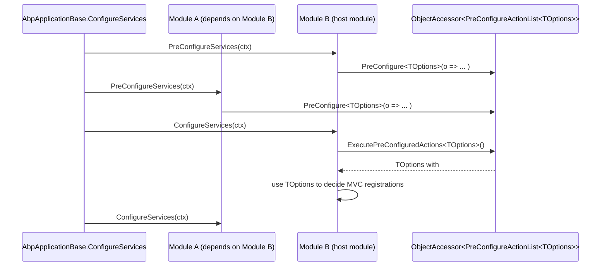

ABP's configuration layer is built on top of `Microsoft.Extensions.Options` but adds three things the vanilla pipeline lacks: a *pre-configure* phase that runs before standard `IConfigureOptions` callbacks, an options factory without locks (`AbpUnnamedOptionsManager<TOptions>`), and dynamic options managers that can refresh from a database at runtime. On top of that, ABP layers `IStaticDefinitionCache<TKey, TValue>` for one-shot definition materialisation and a "simple state checker" framework that powers permission and feature enable/disable predicates. This page enumerates `framework/src/Volo.Abp.Core/Volo/Abp/Options/`, `StaticDefinitions/`, `SimpleStateChecking/`, and the relevant DI extensions.

## Options folder

```
framework/src/Volo.Abp.Core/Volo/Abp/Options/
├── AbpDynamicOptionsManager.cs   # scoped manager that refreshes from external store
├── AbpOptionsFactory.cs          # OptionsFactory clone with validation hook
├── AbpUnnamedOptionsManager.cs   # lock-free IOptions<T> singleton
└── PreConfigureActionList.cs     # List<Action<TOptions>> with .Configure() helpers
```

### `AbpOptionsFactory<TOptions>`

`Volo/Abp/Options/AbpOptionsFactory.cs` is a near-copy of Microsoft's `OptionsFactory<T>` (see [https://github.com/dotnet/runtime/blob/release/8.0-rc1/src/libraries/Microsoft.Extensions.Options/src/OptionsFactory.cs](https://github.com/dotnet/runtime/blob/release/8.0-rc1/src/libraries/Microsoft.Extensions.Options/src/OptionsFactory.cs)) with explicit `protected virtual` methods so subclasses can override:

```csharp
public class AbpOptionsFactory<TOptions> : IOptionsFactory<TOptions> where TOptions : class, new()
{
    public AbpOptionsFactory(
        IEnumerable<IConfigureOptions<TOptions>> setups,
        IEnumerable<IPostConfigureOptions<TOptions>> postConfigures,
        IEnumerable<IValidateOptions<TOptions>> validations);

    public virtual TOptions Create(string name)
    {
        var options = CreateInstance(name);
        ConfigureOptions(name, options);
        PostConfigureOptions(name, options);
        ValidateOptions(name, options);
        return options;
    }

    protected virtual void ConfigureOptions(string name, TOptions options);
    protected virtual void PostConfigureOptions(string name, TOptions options);
    protected virtual void ValidateOptions(string name, TOptions options);
    protected virtual TOptions CreateInstance(string name) => Activator.CreateInstance<TOptions>();
}
```

`CreateInstance` is the most useful override: it gives derived factories a chance to honour custom constructors (e.g. dependency-inject a constructor parameter) without rewriting the validation loop.

### `AbpUnnamedOptionsManager<TOptions>`

`Volo/Abp/Options/AbpUnnamedOptionsManager.cs`:

```csharp
public class AbpUnnamedOptionsManager<TOptions> : IOptions<TOptions> where TOptions : class
{
    private readonly IOptionsFactory<TOptions> _factory;
    private TOptions? _value;

    public AbpUnnamedOptionsManager(IOptionsFactory<TOptions> factory) { _factory = factory; }

    public TOptions Value
    {
        get
        {
            if (_value is { } value) return value;
            _value = _factory.Create(Microsoft.Extensions.Options.Options.DefaultName);
            return _value;
        }
    }
}
```

The comment in the file explains the trade-off: *"Prevent deadlocks when accessing options in multiple threads."* Microsoft's `UnnamedOptionsManager<T>` uses a `lock` around `Value` &mdash; if the user-supplied `IConfigureOptions<TOptions>` resolves another `IOptions<T2>` whose factory also takes the same lock, you can dead-lock across two singletons. The ABP variant tolerates a benign double-construction race in exchange for being lock-free.

<Warning>If two threads race the first call to `Value`, both may run the configure pipeline. The factory is expected to be idempotent. Don't use this manager when configure callbacks have side effects.</Warning>

Register via `services.AddAbpOptions<TOptions>()` from `framework/src/Volo.Abp.Core/Microsoft/Extensions/DependencyInjection/ServiceCollectionOptionsExtensions.cs`:

```csharp
public static OptionsBuilder<TOptions> AddAbpOptions<TOptions>(this IServiceCollection services)
    where TOptions : class
{
    services.TryAddSingleton<IOptions<TOptions>, AbpUnnamedOptionsManager<TOptions>>();
    return services.AddOptions<TOptions>();
}
```

### `AbpDynamicOptionsManager<TOptions>`

`Volo/Abp/Options/AbpDynamicOptionsManager.cs`:

```csharp
public abstract class AbpDynamicOptionsManager<T> : OptionsManager<T> where T : class
{
    protected AbpDynamicOptionsManager(IOptionsFactory<T> factory) : base(factory) { }
    public Task SetAsync() => SetAsync(Microsoft.Extensions.Options.Options.DefaultName);
    public virtual Task SetAsync(string name) => OverrideOptionsAsync(name, base.Get(name));
    protected abstract Task OverrideOptionsAsync(string name, T options);
}
```

Dynamic managers extend the standard `OptionsManager<T>` so callers still consume `IOptions<T>` / `IOptionsSnapshot<T>`, but override `OverrideOptionsAsync` to mutate the options instance from external state (e.g. a settings table). The replacement is wired up via `services.AddAbpDynamicOptions<TOptions, TManager>()` in `ServiceCollectionDynamicOptionsManagerExtensions.cs`:

```csharp
public static IServiceCollection AddAbpDynamicOptions<TOptions, TManager>(this IServiceCollection services)
    where TOptions : class
    where TManager : AbpDynamicOptionsManager<TOptions>
{
    services.Replace(ServiceDescriptor.Scoped(typeof(IOptions<TOptions>), typeof(TManager)));
    services.Replace(ServiceDescriptor.Scoped(typeof(IOptionsSnapshot<TOptions>), typeof(TManager)));
    return services;
}
```

Both `IOptions<T>` and `IOptionsSnapshot<T>` get the manager, so consumers that pulled either contract see the refreshed values after `SetAsync()` is called (typically per request, after settings are read from storage).

### `PreConfigureActionList<TOptions>` and the PreConfigure pipeline

```csharp
public class PreConfigureActionList<TOptions> : List<Action<TOptions>>
{
    public void Configure(TOptions options)
    {
        foreach (var action in this) action(options);
    }

    public TOptions Configure()
    {
        var options = Activator.CreateInstance<TOptions>();
        Configure(options);
        return options;
    }
}
```

The list is stashed inside an `ObjectAccessor<PreConfigureActionList<TOptions>>` so the framework can mutate it during `Pre/ConfigureServices` **before** any `IOptions<TOptions>` instance exists. The DI extensions are in `framework/src/Volo.Abp.Core/Microsoft/Extensions/DependencyInjection/ServiceCollectionPreConfigureExtensions.cs`:

```csharp
public static IServiceCollection PreConfigure<TOptions>(this IServiceCollection services, Action<TOptions> optionsAction)
{
    services.GetPreConfigureActions<TOptions>().Add(optionsAction);
    return services;
}

public static TOptions ExecutePreConfiguredActions<TOptions>(this IServiceCollection services)
    where TOptions : new() => services.ExecutePreConfiguredActions(new TOptions());

public static TOptions ExecutePreConfiguredActions<TOptions>(this IServiceCollection services, TOptions options)
{
    services.GetPreConfigureActions<TOptions>().Configure(options);
    return options;
}
```

Why pre-configure exists: an early module (e.g. `AbpAspNetCoreMvcModule`) may need to inspect the *final* shape of `AbpEndpointRouterOptions` before its own `ConfigureServices` runs. Calling `PreConfigure<AbpEndpointRouterOptions>(o => o.AdditionalEndpoints.Add(...))` from a dependent module lets the early module read those values during its own `ConfigureServices` via `services.ExecutePreConfiguredActions<AbpEndpointRouterOptions>()`.



Module ordering reminder: `ModuleLoader.SortByDependency` pushes the startup module to the very end, but dependency edges flow startup → leaves. `PreConfigureServices` runs in the same order as `ConfigureServices`.

## SimpleStateChecking folder

```
framework/src/Volo.Abp.Core/Volo/Abp/SimpleStateChecking/
├── AbpSimpleStateCheckerOptions.cs
├── IHasSimpleStateCheckers.cs
├── ISimpleBatchStateChecker.cs
├── ISimpleStateChecker.cs
├── ISimpleStateCheckerManager.cs
├── ISimpleStateCheckerSerializer.cs
├── ISimpleStateCheckerSerializerContributor.cs
├── SimpleBatchStateCheckerBase.cs
├── SimpleBatchStateCheckerContext.cs
├── SimpleStateCheckerContext.cs
├── SimpleStateCheckerManager.cs
├── SimpleStateCheckerResult.cs
├── SimpleStateCheckerSerializer.cs
└── SimpleStateCheckerSerializerExtensions.cs
```

### Type relationships

```csharp
public interface IHasSimpleStateCheckers<TState> where TState : IHasSimpleStateCheckers<TState>
{
    List<ISimpleStateChecker<TState>> StateCheckers { get; }
}

public interface ISimpleStateChecker<TState> where TState : IHasSimpleStateCheckers<TState>
{
    Task<bool> IsEnabledAsync(SimpleStateCheckerContext<TState> context);
}

public interface ISimpleBatchStateChecker<TState> : ISimpleStateChecker<TState>
    where TState : IHasSimpleStateCheckers<TState>
{
    Task<SimpleStateCheckerResult<TState>> IsEnabledAsync(SimpleBatchStateCheckerContext<TState> context);
}
```

The pattern: `TState` (e.g. `PermissionDefinition`, `FeatureDefinition`, `SettingDefinition`) carries its own list of checkers. The manager iterates the checkers; if all return `true`, the state is enabled.

| Type | File | Notes |
| --- | --- | --- |
| `AbpSimpleStateCheckerOptions<TState>` | `AbpSimpleStateCheckerOptions.cs` | Holds `ITypeList<ISimpleStateChecker<TState>> GlobalStateCheckers` &mdash; applied to every state instance, in addition to its own `StateCheckers`. |
| `SimpleStateCheckerContext<TState>` | `SimpleStateCheckerContext.cs` | Carries `IServiceProvider` + `TState` State. |
| `SimpleBatchStateCheckerContext<TState>` | `SimpleBatchStateCheckerContext.cs` | Carries `IServiceProvider` + `TState[] States`. |
| `SimpleStateCheckerResult<TState>` | `SimpleStateCheckerResult.cs` | `Dictionary<TState, bool>` with optional `(IEnumerable<TState> states, bool initValue = true)` ctor. |
| `SimpleBatchStateCheckerBase<TState>` | `SimpleBatchStateCheckerBase.cs` | Helper that lets a checker implement only the batch overload; the single-state path delegates to it. |
| `SimpleStateCheckerManager<TState>` | `SimpleStateCheckerManager.cs` | The actual evaluation engine. |
| `ISimpleStateCheckerSerializer` | `ISimpleStateCheckerSerializer.cs` | Serialises checkers to JSON (used by ABP's settings-driven feature/permission definitions). |
| `SimpleStateCheckerSerializer` | `SimpleStateCheckerSerializer.cs` | Iterates `IEnumerable<ISimpleStateCheckerSerializerContributor>`; the first non-null result wins. |

### `SimpleStateCheckerManager<TState>` evaluation

`SimpleStateCheckerManager<TState>` is registered as a transient open generic:

```csharp
services.AddTransient(typeof(ISimpleStateCheckerManager<>), typeof(SimpleStateCheckerManager<>));
```

`IsEnabledAsync(TState[] states)` performs three batched passes inside a single DI scope:

1. **Per-state batch checkers** (those that implement `ISimpleBatchStateChecker<TState>`): grouped, evaluated with the matching `States`. Short-circuit returns once `result.Values.All(x => !x)`.
2. **Global batch checkers** from `AbpSimpleStateCheckerOptions<TState>.GlobalStateCheckers` that are also batch-capable. Only states currently `true` are passed.
3. **Single-state fallback** (`InternalIsEnabledAsync`): for each remaining state, iterate non-batch checkers (per-state + global) until one returns `false`.

`SimpleStateCheckerResult<TState>` indexer (`result[state]`) writes the boolean result. Consumers (permission/feature definition managers) call `IsEnabledAsync(definitions)` to filter out states that are off for the current actor.

```mermaid
flowchart TD
    In[TState[] states] --> P1[Per-state batch checkers]
    P1 -->|all false?| Out[return result]
    P1 --> P2[Global batch checkers from Options.GlobalStateCheckers]
    P2 --> P3[For each state with result=true]
    P3 --> P4[InternalIsEnabledAsync<br/>walks non-batch checkers]
    P4 --> Out
```

## StaticDefinitions folder

`framework/src/Volo.Abp.Core/Volo/Abp/StaticDefinitions/`:

```csharp
public interface IStaticDefinitionCache<TKey, TValue>
{
    Task<TValue> GetOrCreateAsync(Func<Task<TValue>> factory);
    Task ClearAsync();
}
```

```csharp
public class StaticDefinitionCache<TKey, TValue> : IStaticDefinitionCache<TKey, TValue>
{
    private Lazy<Task<TValue>>? _lazy;

    public virtual async Task<TValue> GetOrCreateAsync(Func<Task<TValue>> factory)
    {
        var lazy = _lazy;
        if (lazy != null) return await lazy.Value;
        var newLazy = new Lazy<Task<TValue>>(factory, LazyThreadSafetyMode.ExecutionAndPublication);
        lazy = Interlocked.CompareExchange(ref _lazy, newLazy, null) ?? newLazy;
        return await lazy.Value;
    }

    public virtual Task ClearAsync() { Interlocked.Exchange(ref _lazy, null); return Task.CompletedTask; }
}
```

`AddCoreAbpServices` (in `Volo/Abp/Internal/InternalServiceCollectionExtensions.cs`) registers the open generic as a singleton:

```csharp
services.AddSingleton(typeof(IStaticDefinitionCache<,>), typeof(StaticDefinitionCache<,>));
```

The pattern is "use the consumer's type as the cache key":

```csharp
public class PermissionDefinitionManager
{
    private readonly IStaticDefinitionCache<PermissionDefinitionManager, IDictionary<string, PermissionDefinition>> _cache;
    public Task<IDictionary<string, PermissionDefinition>> GetPermissionDefinitionsAsync()
        => _cache.GetOrCreateAsync(BuildPermissionDefinitionsAsync);
}
```

Because the DI resolution uses the closed `IStaticDefinitionCache<PermissionDefinitionManager, ...>`, each consumer gets its own singleton cache. Hot-reload scenarios call `ClearAsync()` to discard the cached `Task<TValue>`.

## Tracing folder

`framework/src/Volo.Abp.Core/Volo/Abp/Tracing/` ships three files:

| File | Type |
| --- | --- |
| `AbpCorrelationIdOptions.cs` | `string HttpHeaderName = "X-Correlation-Id"`, `bool SetResponseHeader = true`. |
| `ICorrelationIdProvider.cs` | `string? Get(); IDisposable Change(string? correlationId);` |
| `DefaultCorrelationIdProvider.cs` | `AsyncLocal<string?>`-backed implementation. |

The provider lives here because correlation-id propagation is consumed by both the logging subsystem and the HTTP-client subsystem &mdash; see [Logging & tracing](/core/logging-and-tracing) for the full pipeline.

## Putting it together

<Steps>
  <Step title="Register options early">A module's `PreConfigureServices` calls `context.Services.PreConfigure<AbpFooOptions>(o => o.Items.Add(...));`</Step>
  <Step title="Read the pre-configured options inside `ConfigureServices`">Another module materialises them with `var opts = context.Services.ExecutePreConfiguredActions<AbpFooOptions>();` and uses them to decide further registrations.</Step>
  <Step title="Default options pipeline runs at activation">`AbpOptionsFactory<TOptions>` is wired up so a normal `IOptions<AbpFooOptions>.Value` triggers Setup → PostConfigure → Validate.</Step>
  <Step title="Dynamic refresh">Subsystems that need DB-driven options derive `AbpDynamicOptionsManager<T>` and call `await manager.SetAsync()` per request.</Step>
  <Step title="Static definitions cached">Definition managers wrap their reflection-heavy load via `IStaticDefinitionCache<TSelf, TValue>` so the cost is paid once.</Step>
  <Step title="State checkers gate features">Each `TState` exposes `StateCheckers`. `SimpleStateCheckerManager<TState>.IsEnabledAsync` walks them in batches.</Step>
</Steps>

## See also

- [Modularity system](/core/modularity-system) for `IPreConfigureServices` / `IPostConfigureServices` invocation order.
- [Dependency injection](/core/dependency-injection) for `ObjectAccessor<T>` and `services.GetSingletonInstance<T>()`.
- [Reflection & collections](/core/reflection-and-collections) for `ITypeList<T>` (used by `AbpSimpleStateCheckerOptions<T>.GlobalStateCheckers`).
- [Logging & tracing](/core/logging-and-tracing) for the correlation-id pipeline.
