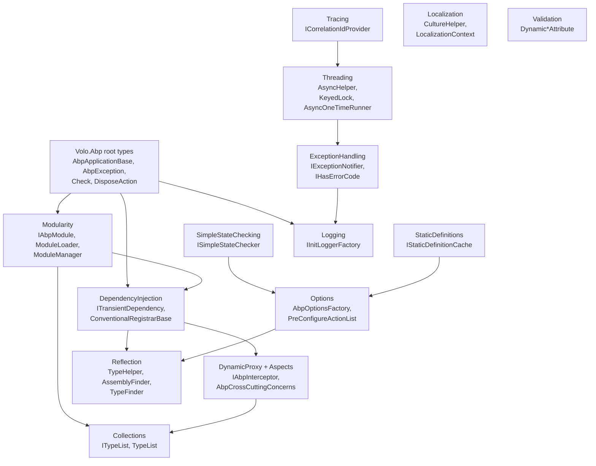

The ABP framework's kernel lives in **`framework/src/Volo.Abp.Core/`**. The `Volo.Abp.Core.csproj` assembly (multi-targeted `netstandard2.0;netstandard2.1;net8.0;net9.0;net10.0`, declared in `framework/src/Volo.Abp.Core/Volo.Abp.Core.csproj`) ships the bare minimum required to bootstrap an ABP application: the modularity contract, dependency-injection conventions, exception primitives, the dynamic-proxy/aspect base types, threading helpers, reflection utilities, the options pre-configuration pipeline, simple state-checking, virtual-file-system contracts (the implementation lives in a sibling package), tracing, and the init-phase logger. This page maps every subdirectory under `framework/src/Volo.Abp.Core/Volo/Abp/` to a dedicated deep-dive page and shows how they fit together.

<Info>
Source-of-truth files referenced here are absolute paths inside the read-only repo at `/home/daytona/repos/abpframework/abp/`. The `RootNamespace` element in `Volo.Abp.Core.csproj` is intentionally empty so each folder can pick its own `Volo.Abp.<Area>` namespace.
</Info>

## Component diagram

The diagram below shows the high-level dependencies between the namespaces inside `Volo.Abp.Core`. `AbpApplicationBase` is the orchestrator that wires the rest together.



## Page index

<CardGroup cols={2}>
  <Card title="Root assembly tour" href="/core/volo-abp-core">Boot pipeline, `AbpApplicationBase`, factories, root exception types, and convenience primitives.</Card>
  <Card title="Modularity" href="/core/modularity-system">Module discovery, dependency sorting, lifecycle contributors, plug-in sources.</Card>
  <Card title="Dependency injection" href="/core/dependency-injection">Conventional registrar, `ExposeServices`, lifetime marker interfaces, lazy/cached service providers.</Card>
  <Card title="Dynamic proxy & aspects" href="/core/dynamic-proxy-and-aspects">`IAbpInterceptor`, Castle adapter, `AbpCrossCuttingConcerns`, framework-shipped interceptors.</Card>
  <Card title="Exception handling" href="/core/exception-handling">`BusinessException`, `IUserFriendlyException`, `IExceptionNotifier`, MVC filter glue.</Card>
  <Card title="Threading & async" href="/core/threading-and-async">`AsyncHelper`, `AsyncLocalAmbientDataContext`, `AbpAsyncTimer`, cancellation overrides.</Card>
  <Card title="Reflection & collections" href="/core/reflection-and-collections">`TypeHelper`, `AssemblyFinder`, `ITypeList<T>`, named-type selectors.</Card>
  <Card title="Options & static definitions" href="/core/options-and-static-definitions">`AbpOptionsFactory`, pre-configure pipeline, simple state checkers, `IStaticDefinitionCache`.</Card>
  <Card title="Virtual file system" href="/core/virtual-file-system">`IVirtualFileProvider`, embedded vs physical providers, `AddEmbedded<TModule>()` pattern.</Card>
  <Card title="Logging & tracing" href="/core/logging-and-tracing">Init-phase logger, correlation IDs, exception-to-log mapping, Serilog bridge.</Card>
</CardGroup>

## Directory inventory

Every subfolder of `framework/src/Volo.Abp.Core/Volo/Abp/` and its primary contribution:

| Folder | Primary types | Documented in |
| --- | --- | --- |
| `Aspects/` | `AbpCrossCuttingConcerns`, `IAvoidDuplicateCrossCuttingConcerns` | [Dynamic proxy & aspects](/core/dynamic-proxy-and-aspects) |
| `Bundling/` | `BundleContext`, `BundleDefinition`, `IBundleContributor`, `BundleParameterDictionary`, `Styles/` | Used by `Volo.Abp.AspNetCore.Mvc.UI` &mdash; see [ASP.NET Core overview](/aspnetcore/overview) |
| `Collections/` | `ITypeList<TBaseType>`, `TypeList<TBaseType>`, `NamedObjectList`, `NamedActionList` | [Reflection & collections](/core/reflection-and-collections) |
| `Content/` | `IRemoteStreamContent`, `RemoteStreamContent` | Cross-cutting upload/download contracts |
| `DependencyInjection/` | `ITransientDependency`, `IScopedDependency`, `ISingletonDependency`, `ConventionalRegistrarBase`, `DefaultConventionalRegistrar`, `ExposeServicesAttribute`, `DependencyAttribute`, `AbpLazyServiceProvider`, `CachedServiceProvider`, `ObjectAccessor<T>`, `OnServiceRegistredContext` | [Dependency injection](/core/dependency-injection) |
| `DynamicProxy/` | `IAbpInterceptor`, `AbpInterceptor`, `IAbpMethodInvocation`, `ProxyHelper`, `DynamicProxyIgnoreTypes` | [Dynamic proxy & aspects](/core/dynamic-proxy-and-aspects) |
| `ExceptionHandling/` | `IExceptionNotifier`, `ExceptionNotifier`, `ExceptionNotificationContext`, `IExceptionSubscriber`, `IHasErrorCode`, `IHasErrorDetails`, `IHasHttpStatusCode`, `ILocalizeErrorMessage` | [Exception handling](/core/exception-handling) |
| `Http/` | `MimeTypes`, `UrlHelpers` | Reusable HTTP constants |
| `IO/` | `FileHelper`, `DirectoryHelper` | File-system helpers used by virtual files |
| `Internal/` | `InternalServiceCollectionExtensions`, `Telemetry/ITelemetryService`, `Utf8Helper` | [Root assembly tour](/core/volo-abp-core) |
| `Localization/` | `CultureHelper`, `LocalizationContext` | Foundation for `Volo.Abp.Localization` |
| `Logging/` | `IInitLoggerFactory`, `DefaultInitLogger`, `AbpInitLogEntry`, `IHasLogLevel`, `IExceptionWithSelfLogging` | [Logging & tracing](/core/logging-and-tracing) |
| `Modularity/` | `IAbpModule`, `AbpModule`, `ModuleLoader`, `ModuleManager`, `AbpModuleDescriptor`, `DependsOnAttribute`, `AdditionalAssemblyAttribute`, `IPreConfigureServices`, `IPostConfigureServices`, `IModuleLifecycleContributor`, `PlugIns/` | [Modularity](/core/modularity-system) |
| `Options/` | `AbpDynamicOptionsManager<T>`, `AbpOptionsFactory<TOptions>`, `AbpUnnamedOptionsManager<TOptions>`, `PreConfigureActionList<TOptions>` | [Options & static definitions](/core/options-and-static-definitions) |
| `Reflection/` | `AssemblyHelper`, `AssemblyFinder`, `TypeFinder`, `TypeHelper`, `ReflectionHelper` | [Reflection & collections](/core/reflection-and-collections) |
| `SimpleStateChecking/` | `ISimpleStateChecker<T>`, `SimpleStateCheckerManager<T>`, `SimpleBatchStateCheckerBase<T>`, `AbpSimpleStateCheckerOptions<T>` | [Options & static definitions](/core/options-and-static-definitions) |
| `StaticDefinitions/` | `IStaticDefinitionCache<TKey,TValue>`, `StaticDefinitionCache<TKey,TValue>` | [Options & static definitions](/core/options-and-static-definitions) |
| `Studio/` | `AbpStudioAnalyzeHelper` | ABP Studio analyze-mode flag |
| `Text/` | `StringHelper`, `Formatting/` | Text utilities |
| `Threading/` | `AsyncHelper`, `AsyncOneTimeRunner`, `OneTimeRunner`, `KeyedLock`, `SemaphoreSlimExtensions`, `LockExtensions`, `TaskCache`, `InternalAsyncHelper` | [Threading & async](/core/threading-and-async) |
| `Tracing/` | `AbpCorrelationIdOptions`, `DefaultCorrelationIdProvider`, `ICorrelationIdProvider` | [Logging & tracing](/core/logging-and-tracing) |
| `Validation/` | `DynamicMaxLengthAttribute`, `DynamicRangeAttribute`, `DynamicStringLengthAttribute` | Localizable validation attributes |

Root-level files such as `AbpApplicationBase.cs`, `Check.cs`, `DisposeAction.cs`, `BusinessException.cs`, `UserFriendlyException.cs`, `RandomHelper.cs`, `NamedObject.cs`, `KeyedObjectHelper.cs`, `ObjectHelper.cs`, `NullDisposable.cs`, `NullAsyncDisposable.cs`, `AsyncDisposeFunc.cs`, `NameValue.cs`, and `IntegrationServiceAttribute.cs` live directly under `framework/src/Volo.Abp.Core/Volo/Abp/` and are covered in the [root assembly tour](/core/volo-abp-core).

## Per-folder inventory with file counts

A flatter view, grouped by responsibility. Counts are approximate and may drift as the framework evolves; the file map in each linked page is the source of truth.

### Modularity (`Volo/Abp/Modularity/`)

`AbpModule.cs`, `IAbpModule.cs`, `AbpModuleDescriptor.cs`, `AbpModuleDescriptorExtensions.cs`, `AbpModuleHelper.cs`, `AbpModuleLifecycleOptions.cs`, `AdditionalAssemblyAttribute.cs`, `DefaultModuleLifecycleContributor.cs`, `DependsOnAttribute.cs`, `IAbpModuleDescriptor.cs`, `IAdditionalModuleAssemblyProvider.cs`, `IDependedTypesProvider.cs`, `IModuleContainer.cs`, `IModuleLifecycleContributor.cs`, `IModuleLoader.cs`, `IModuleManager.cs`, `IOnPostApplicationInitialization.cs`, `IOnPreApplicationInitialization.cs`, `IPostConfigureServices.cs`, `IPreConfigureServices.cs`, `ModuleLifecycleContributorBase.cs`, `ModuleLoader.cs`, `ModuleManager.cs`, `ServiceConfigurationContext.cs`, and `PlugIns/` (7 files).

### Dependency injection (`Volo/Abp/DependencyInjection/`)

42 files total: lifetime markers (3), attributes (5), provider interfaces (5), conventional registrar (5), service identifiers (1), lifetime pipelines (9), interceptor selectors (2), service providers (8), scope/root accessors (4), object accessor (2). Plus 12 helper extensions under `framework/src/Volo.Abp.Core/Microsoft/Extensions/DependencyInjection/`.

### Reflection & collections

`Reflection/` ships `AssemblyFinder`, `AssemblyHelper` (internal), `TypeFinder`, `IAssemblyFinder`, `ITypeFinder`, `ReflectionHelper`, `TypeHelper`. `Collections/` ships `ITypeList`, `TypeList`, `NamedActionList`, `NamedObjectList`. Plus root-level `NamedObject.cs`, `NameValue.cs`, `NamedAction.cs`, `NamedTypeSelector.cs`, `NamedTypeSelectorListExtensions.cs`.

### Exception handling (`Volo/Abp/ExceptionHandling/`)

11 files: `ExceptionNotificationContext.cs`, `ExceptionNotifier.cs`, `ExceptionNotifierExtensions.cs`, `ExceptionSubscriber.cs`, `IExceptionNotifier.cs`, `IExceptionSubscriber.cs`, `IHasErrorCode.cs`, `IHasErrorDetails.cs`, `IHasHttpStatusCode.cs`, `ILocalizeErrorMessage.cs`, `NullExceptionNotifier.cs`. Root-level partners: `AbpException.cs`, `AbpInitializationException.cs`, `AbpShutdownException.cs`, `BusinessException.cs`, `UserFriendlyException.cs`, `IBusinessException.cs`, `IUserFriendlyException.cs`.

### Threading (`Volo/Abp/Threading/`)

`AsyncHelper.cs`, `AsyncOneTimeRunner.cs`, `InternalAsyncHelper.cs`, `KeyedLock.cs`, `LockExtensions.cs`, `OneTimeRunner.cs`, `SemaphoreSlimExtensions.cs`, `TaskCache.cs`. The larger `Volo.Abp.Threading` assembly extends this with timers, ambient contexts, and cancellation providers.

### Options, definitions, state

- `Options/`: `AbpDynamicOptionsManager.cs`, `AbpOptionsFactory.cs`, `AbpUnnamedOptionsManager.cs`, `PreConfigureActionList.cs`.
- `StaticDefinitions/`: `IStaticDefinitionCache.cs`, `StaticDefinitionCache.cs`.
- `SimpleStateChecking/`: 14 files implementing the per-state evaluator framework.

### Virtual file system, logging, tracing

- VFS lives in its own assembly (`framework/src/Volo.Abp.VirtualFileSystem/`).
- `Volo/Abp/Logging/` ships init-logger plus marker interfaces (`IHasLogLevel`, `IExceptionWithSelfLogging`).
- `Volo/Abp/Tracing/` ships the correlation-id provider.

### Aspects & dynamic proxy

- `Aspects/`: `AbpCrossCuttingConcerns.cs`, `IAvoidDuplicateCrossCuttingConcerns.cs`.
- `DynamicProxy/`: `AbpInterceptor.cs`, `DynamicProxyIgnoreTypes.cs`, `IAbpInterceptor.cs`, `IAbpMethodInvocation.cs`, `ProxyHelper.cs`. The Castle adapter lives in `Volo.Abp.Castle.Core`.

### Bundling, validation, content, IO

These folders host smaller cross-cutting types used by `Volo.Abp.AspNetCore.Mvc.UI` (bundling), application services (validation), and remote services (content streams).

## Boot pipeline at a glance

The boot path is owned by `AbpApplicationBase` (`framework/src/Volo.Abp.Core/Volo/Abp/AbpApplicationBase.cs`). The full mermaid sequence is in [Root assembly tour](/core/volo-abp-core) and [Application startup flow](/flows/application-startup); here is the elevator pitch:

<Steps>
  <Step title="Construct">The constructor registers `IAbpApplication`, `IApplicationInfoAccessor`, `IModuleContainer`, and `IAbpHostEnvironment`, calls `services.AddCoreServices()` (options/logging/localization) and `services.AddCoreAbpServices(this, options)` from `Volo/Abp/Internal/InternalServiceCollectionExtensions.cs`.</Step>
  <Step title="Load modules">`LoadModules` invokes the singleton `IModuleLoader` (the `ModuleLoader` registered by `AddCoreAbpServices`) which walks `DependsOnAttribute` and `AdditionalAssemblyAttribute` transitively, creates `AbpModuleDescriptor` instances, and topologically sorts them.</Step>
  <Step title="Configure services">`ConfigureServices` (or its async sibling) iterates modules through `IPreConfigureServices` → `IAbpModule.ConfigureServices` → `IPostConfigureServices`, wrapping any failure in `AbpInitializationException`.</Step>
  <Step title="Initialize">`InitializeModules()` builds a scope and dispatches `IOnPreApplicationInitialization`, `IOnApplicationInitialization`, `IOnPostApplicationInitialization` through `ModuleManager` via `IModuleLifecycleContributor` instances.</Step>
  <Step title="Shutdown">`ShutdownAsync()` reverses module order and runs `IOnApplicationShutdown`, again through `ModuleManager`. Failures bubble up as `AbpShutdownException`.</Step>
</Steps>

<Tip>For the full lifecycle covering both the host pipeline and module callbacks, jump to [Module loading lifecycle](/flows/module-loading-lifecycle).</Tip>

## Namespace conventions

Even though `Volo.Abp.Core.csproj` declares `<RootNamespace />` (empty), every folder follows the convention `namespace Volo.Abp.<FolderName>;`. The handful of files that intentionally break the rule:

| File | Actual namespace | Reason |
| --- | --- | --- |
| `framework/src/Volo.Abp.Core/Volo/Abp/Collections/NamedObjectList.cs` | `Volo.Abp.AI` | Originally added for AI pipeline; the location was left in `Collections/` for cohesion. |
| `framework/src/Volo.Abp.Core/Volo/Abp/Collections/NamedActionList.cs` | `Volo.Abp.AI` | Same reason as above. |
| `framework/src/Volo.Abp.Core/Microsoft/Extensions/...` | `Microsoft.Extensions.*` | DI/Logging/Configuration extensions follow the upstream namespace so `using Microsoft.Extensions.DependencyInjection;` picks them up automatically. |
| `framework/src/Volo.Abp.Core/System/AbpExceptionExtensions.cs` | `System` | Extension methods on `Exception` are placed in `System` so they show up without `using` directives. |
| `framework/src/Volo.Abp.VirtualFileSystem/Microsoft/Extensions/FileProviders/AbpFileInfoExtensions.cs` | `Microsoft.Extensions.FileProviders` | Adds `IFileInfo.ReadAsString()`/`ReadBytes()` to the upstream namespace. |

`AssemblyInfo.cs` (under `Properties/`) is auto-generated; ABP suppresses `AssemblyConfiguration`, `AssemblyCompany`, and `AssemblyProduct` via the csproj's `GenerateAssembly*Attribute = false` flags so the embedded metadata stays minimal.

## Multi-targeting matrix

The framework ships against five target frameworks. The csproj uses conditional `ItemGroup`s so each TFM gets a tailored package set:

| TargetFramework | Notes |
| --- | --- |
| `netstandard2.0` | Pulls in `System.Threading.Tasks.Extensions` (no `ValueTask` in BCL). Uses `Nullable` package for `[NotNull]` polyfills. |
| `netstandard2.1` | Adds `System.ComponentModel.Annotations` for `[Required]` etc. |
| `net8.0` / `net9.0` / `net10.0` | Modern .NET; no compatibility shims. `FrozenSet` from `System.Collections.Frozen` is used by `TypeHelper`. |

`Microsoft.Extensions.*` packages are referenced **without** version numbers — the version is unified by `framework/common.props` and `framework/build.props` so every package in the framework ships against the same .NET Extensions release.

## Subsystem dependency cheat sheet

The subsystems in `Volo.Abp.Core` have an explicit ordering that the conventional registrar and module loader enforce. Knowing the order helps when debugging "why is X not registered before Y is asked for?".

| Phase | What runs | Where defined |
| --- | --- | --- |
| Constructor (sync, ABp) | `services.TryAddObjectAccessor<IServiceProvider>()`, `AddSingleton<IAbpApplication>(this)`, `AddSingleton<IModuleContainer>(this)`, `AddSingleton<IAbpHostEnvironment>(...)`, `AddCoreServices()`, `AddCoreAbpServices(this, options)`. | `framework/src/Volo.Abp.Core/Volo/Abp/AbpApplicationBase.cs` (the `internal AbpApplicationBase(...)` ctor, ~lines 39-72) |
| `AddCoreServices` | `services.AddOptions()`, `AddLogging()`, `AddLocalization()`. | `Volo/Abp/Internal/InternalServiceCollectionExtensions.cs` |
| `AddCoreAbpServices` | `ModuleLoader`, `AssemblyFinder`, `TypeFinder`, `IInitLoggerFactory`, `ISimpleStateCheckerManager<>`, `IStaticDefinitionCache<,>` + lifecycle contributors. | Same file. |
| `LoadModules` | Walk `[DependsOn]` graph; load plug-ins; sort topologically; emit `ServiceCollection` singletons for every module instance. | `Volo/Abp/Modularity/ModuleLoader.cs` |
| `ConfigureServices` | `PreConfigureServices` → `services.AddAssembly(moduleAssembly)` × N → `ConfigureServices` → `PostConfigureServices`. | `AbpApplicationBase.cs` (`ConfigureServicesAsync` at ~line 214; sync `ConfigureServices` at ~line 307) |
| `InitializeModules` (post-build) | `IModuleLifecycleContributor` instances in the order registered by `AbpModuleLifecycleOptions.Contributors`. | `Volo/Abp/Modularity/ModuleManager.cs` |
| `ShutdownModules` | Module list reversed, then each contributor's `Shutdown[Async]`. | Same file. |

The four built-in contributors are added in this fixed order: Pre-init, Init, Post-init, Shutdown. So `OnPreApplicationInitialization` runs on *every* module before any module receives `OnApplicationInitialization`.

## Complete index of root-level types in `Volo/Abp/`

Files that sit directly under `framework/src/Volo.Abp.Core/Volo/Abp/` (not in a subdirectory) form the "everywhere-imported" surface. The full list with one-line descriptions:

| File | Purpose |
| --- | --- |
| `AbpApplicationBase.cs` | Abstract base of both internal/external application flavours. |
| `AbpApplicationCreationOptions.cs` | Options bag for factory methods. |
| `AbpApplicationFactory.cs` | Static factory with `Create`/`CreateAsync` overloads. |
| `AbpApplicationWithInternalServiceProvider.cs` | ABP-owned `ServiceProvider` flavour. |
| `AbpApplicationWithExternalServiceProvider.cs` | Host-owned `ServiceProvider` flavour (ASP.NET Core). |
| `AbpException.cs` | Base framework exception. |
| `AbpHostEnvironment.cs` / `IAbpHostEnvironment.cs` | Pre-DI `EnvironmentName` accessor. |
| `AbpHostEnvironmentExtensions.cs` | `IsDevelopment/Staging/Production` helpers. |
| `AbpInitializationException.cs` / `AbpShutdownException.cs` | Phase-specific wrappers. |
| `ApplicationInitializationContext.cs` / `ApplicationShutdownContext.cs` | Init/shutdown context types. |
| `ApplicationServiceTypes.cs` | `[Flags]` enum for app vs integration services. |
| `AsyncDisposeFunc.cs` | `Func<ValueTask>` ⇒ `IAsyncDisposable`. |
| `BusinessException.cs` / `IBusinessException.cs` | Expected-business-failure base + marker. |
| `Check.cs` | `[DebuggerStepThrough]` argument-validation helpers. |
| `DisableAbpFeaturesAttribute.cs` | Skip interceptors / middleware / filters for a class. |
| `DisposeAction.cs` | `Action`-on-dispose wrapper plus generic state variant. |
| `IAbpApplication*.cs` (3 files) | Contracts for the three application flavours. |
| `IApplicationInfoAccessor.cs` | `ApplicationName` / `InstanceId`. |
| `IKeyedObject.cs` / `KeyedObjectHelper.cs` | String-keyed object identity. |
| `IntegrationServiceAttribute.cs` | Marks integration-service boundaries. |
| `IOnApplicationInitialization.cs` / `IOnApplicationShutdown.cs` | Module lifecycle hooks. |
| `IRemoteService.cs` | Marker for HTTP-API exposure. |
| `ISoftDelete.cs` | `IsDeleted` marker used by repositories. |
| `IUserFriendlyException.cs` / `UserFriendlyException.cs` | Show-to-user exception path. |
| `NameValue.cs` / `NamedAction.cs` / `NamedObject.cs` | Lightweight named DTOs. |
| `NamedTypeSelector.cs` / `NamedTypeSelectorListExtensions.cs` | Predicate + name pair plus helpers. |
| `NullAsyncDisposable.cs` / `NullDisposable.cs` | No-op disposables. |
| `ObjectHelper.cs` | Reflection-based property setting. |
| `RandomHelper.cs` | Thread-safe random helpers. |
| `RemoteServiceAttribute.cs` | Whether a service participates in HTTP-API generation. |

## Where ABP departs from upstream conventions

Reading the source it helps to know a few ABP-specific idioms that look unusual at first:

1. **Empty marker interfaces are everywhere.** `ITransientDependency`, `IBusinessException`, `IRemoteService`, `ISoftDelete` etc. are all empty. The framework treats them as compile-time tags inspected via `IsAssignableFrom`.
2. **`ObjectAccessor<T>` instead of factory delegates.** When the framework needs to register "we'll have a `T` later", it inserts an `ObjectAccessor<T>` at position 0 of the `IServiceCollection` (see `ServiceCollectionObjectAccessorExtensions.AddObjectAccessor`).
3. **Init logger buffers boot-time logs.** No `ILoggerFactory` exists during `ConfigureServices`, so `IInitLoggerFactory` records entries that `WriteInitLogs` replays after the provider is built.
4. **Exceptions carry log severity.** `BusinessException : IHasLogLevel` defaults to Warning; `LogException` honours `IHasLogLevel.LogLevel`. This avoids polluting error dashboards with expected failures.
5. **`AbpUnnamedOptionsManager<T>` over Microsoft's `UnnamedOptionsManager<T>`.** The framework chose to risk a benign double-construction in exchange for lock-free reads to avoid cross-options deadlocks.
6. **`AsyncContext.Run` over `Task.Result`.** `AsyncHelper.RunSync` uses Nito.AsyncEx so the rare sync-over-async path doesn't deadlock.

## Subsystem maturity and stability

Some pieces inside `Volo.Abp.Core` are stable, public, framework-level contracts. Others are intentionally `internal` or comment-marked as advisory:

| Subsystem | Stability |
| --- | --- |
| `IAbpApplication`, `IAbpModule`, `IModuleContainer`, `ITransientDependency`/`IScopedDependency`/`ISingletonDependency` | Stable — used by every ABP application. |
| `[DependsOn]`, `[ExposeServices]`, `[Dependency]`, `[DisableConventionalRegistration]` | Stable. |
| `BusinessException`, `UserFriendlyException`, `IExceptionNotifier` | Stable. |
| `AbpCrossCuttingConcerns` | Stable; the file's TODO note says "Move these constants to their own assemblies!" so concerns may relocate without breaking changes. |
| `AbpLazyServiceProvider` | Legacy; new code should use `ITransientCachedServiceProvider`. |
| `AbpStudioAnalyzeHelper.IsInAnalyzeMode` | Tooling-only flag; do not use it as a "feature toggle". |
| `Volo.Abp.Internal.*` | `internal` — not part of the public API. |
| `AssemblyHelper` | `internal static` — use `IAssemblyFinder` instead. |
| `ReflectionHelper` | Public with a TODO note `// Consider to make internal` — treat as best-effort. |

## Where to start reading

For a fresh agent walking this codebase, the recommended read order is:

<Steps>
  <Step title="Read the [root assembly tour](/core/volo-abp-core)">Understand `AbpApplicationBase`, the boot pipeline, and the universal interfaces.</Step>
  <Step title="Follow the [modularity system](/core/modularity-system)">Learn how `DependsOn`, `ModuleLoader`, and `ModuleManager` produce a sorted module list and call lifecycle contributors.</Step>
  <Step title="Trace a request through [dependency injection](/core/dependency-injection)">See how `services.AddAssembly(...)` and `OnRegistred` hooks bind types to lifetimes and attach interceptors.</Step>
  <Step title="Connect to [dynamic proxy & aspects](/core/dynamic-proxy-and-aspects)">Understand `IAbpInterceptor` and how auditing/UoW/authorization wrap services.</Step>
  <Step title="Drop into a feature subsystem">Pick a subsystem (exception handling, options, virtual file system, logging) and follow its dedicated page.</Step>
</Steps>

## Cross-references

`Volo.Abp.Core` is the prerequisite for every higher-level subsystem:

- The [DDD building blocks](/ddd/overview) (entities, repositories, domain services) ultimately resolve through the conventional registrar shipped in `DefaultConventionalRegistrar`.
- The [ASP.NET Core integration](/aspnetcore/overview) layers MVC/Minimal API specifics on top of `AbpApplicationWithExternalServiceProvider` from this assembly.
- Every interceptor described in [Dynamic proxy & aspects](/core/dynamic-proxy-and-aspects) implements the `IAbpInterceptor` contract defined in `Volo/Abp/DynamicProxy/IAbpInterceptor.cs`.

The remaining pages walk each subsystem in depth with file-level citations and concrete code snippets pulled from the source tree.

## Tips for navigating with a coding agent

<Tip>
Use these as breadcrumbs when answering questions about ABP's core:

- "Where do framework services register themselves?" → start at `AbpApplicationBase.cs:62-66` (the `AddCoreAbpServices` call) and follow into `Volo/Abp/Internal/InternalServiceCollectionExtensions.cs`.
- "Why is my service not registered?" → check `DefaultConventionalRegistrar.AddType`. The three short-circuits are `IsConventionalRegistrationDisabled`, missing `lifeTime`, and missing service exposure.
- "Where can I hook into registration?" → call `services.OnRegistered`, `services.OnExposing`, or `services.OnActivated` during `Pre/ConfigureServices`. See the [DI deep dive](/core/dependency-injection).
- "How do I add a cross-cutting concern?" → derive `AbpInterceptor`, mark the class `ITransientDependency`, then add `context.Interceptors.TryAdd<MyInterceptor>()` from an `OnRegistered` callback. See [Dynamic proxy & aspects](/core/dynamic-proxy-and-aspects).
- "Why does my exception render as `500 Internal Server Error`?" → it doesn't implement `IBusinessException` / `IHasHttpStatusCode`. See [Exception handling](/core/exception-handling).
</Tip>

## Open-source layout reference

The folders documented above live at the following exact paths inside the source tree:

```
abpframework/abp/
├── configureawait.props
├── Directory.Build.props
└── framework/
    └── src/
        ├── Volo.Abp.Core/           ← this section
        ├── Volo.Abp.Castle.Core/    ← Castle DynamicProxy bridge
        ├── Volo.Abp.VirtualFileSystem/
        ├── Volo.Abp.Threading/
        ├── Volo.Abp.AspNetCore.Serilog/  ← Serilog enricher middleware
        ├── Volo.Abp.AspNetCore.Mvc/      ← AbpExceptionFilter
        ├── Volo.Abp.Auditing/
        ├── Volo.Abp.Authorization/
        ├── Volo.Abp.Features/
        ├── Volo.Abp.GlobalFeatures/
        ├── Volo.Abp.Uow/
        └── Volo.Abp.Validation/
```

The seven feature packages on the right hand side each ship one `IAbpInterceptor`-derived interceptor, all of which are catalogued in the [dynamic proxy & aspects](/core/dynamic-proxy-and-aspects) deep dive.
