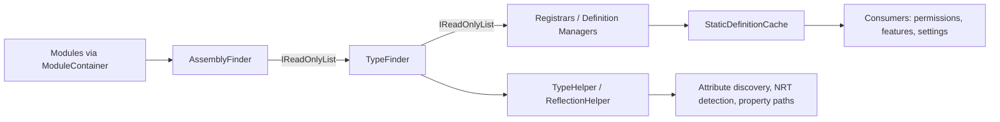

ABP's reflection layer is small but every higher-level subsystem leans on it: the conventional registrar needs to enumerate types, modularity needs to walk assemblies, and options/permission/feature definition managers cache type lookups. This page walks the `Reflection/` and `Collections/` folders inside `framework/src/Volo.Abp.Core/Volo/Abp/` along with the supporting `Internal/`, `Studio/`, and `StaticDefinitions/` namespaces.

## Reflection folder

```
framework/src/Volo.Abp.Core/Volo/Abp/Reflection/
├── AssemblyFinder.cs        # IAssemblyFinder impl walking IModuleContainer
├── AssemblyHelper.cs        # internal static helpers
├── IAssemblyFinder.cs       # IReadOnlyList<Assembly> Assemblies
├── ITypeFinder.cs           # IReadOnlyList<Type> Types
├── ReflectionHelper.cs      # attribute discovery, property-by-path, NRT
├── TypeFinder.cs            # walks IAssemblyFinder.Assemblies → all types
└── TypeHelper.cs            # primitives, nullable, IsEnumerable/IsDictionary
```

### `IAssemblyFinder` / `AssemblyFinder`

```csharp
public interface IAssemblyFinder
{
    IReadOnlyList<Assembly> Assemblies { get; }
}

public class AssemblyFinder : IAssemblyFinder
{
    private readonly IModuleContainer _moduleContainer;
    public AssemblyFinder(IModuleContainer moduleContainer)
    {
        _moduleContainer = moduleContainer;
        _assemblies = new Lazy<IReadOnlyList<Assembly>>(FindAll, LazyThreadSafetyMode.ExecutionAndPublication);
    }

    public IReadOnlyList<Assembly> Assemblies => _assemblies.Value;

    public IReadOnlyList<Assembly> FindAll()
    {
        var assemblies = new List<Assembly>();
        foreach (var module in _moduleContainer.Modules)
            assemblies.AddRange(module.AllAssemblies);
        return assemblies.Distinct().ToImmutableList();
    }
}
```

The finder is registered as a singleton inside `InternalServiceCollectionExtensions.AddCoreAbpServices`, **created from the still-being-constructed `IAbpApplication`** which implements `IModuleContainer`. The `Lazy` wrapper means the assembly walk happens the first time `Assemblies` is queried &mdash; after `LoadModules` has returned and `Modules` is populated.

### `ITypeFinder` / `TypeFinder`

```csharp
public class TypeFinder : ITypeFinder
{
    public TypeFinder(ILogger<TypeFinder> logger, IAssemblyFinder assemblyFinder)
    {
        _types = new Lazy<IReadOnlyList<Type>>(FindAll, LazyThreadSafetyMode.ExecutionAndPublication);
    }

    public IReadOnlyList<Type> Types => _types.Value;

    private IReadOnlyList<Type> FindAll()
    {
        var allTypes = new List<Type>();
        foreach (var assembly in _assemblyFinder.Assemblies)
        {
            try { allTypes.AddRange(AssemblyHelper.GetAllTypes(assembly).Where(t => t != null)); }
            catch (ReflectionTypeLoadException e)
            {
                allTypes = e.Types.Select(x => x!).ToList();
                _logger.LogException(e);
            }
            catch (Exception e) { _logger.LogException(e); }
        }
        return allTypes;
    }
}
```

`AssemblyHelper.GetAllTypes(assembly)` is just `assembly.GetTypes()`; the wrapper exists so future strategies (e.g. analyzer integration) can swap it.

### `AssemblyHelper`

`Volo/Abp/Reflection/AssemblyHelper.cs` is marked `internal static`. Its API is small:

```csharp
public static List<Assembly> LoadAssemblies(string folderPath, SearchOption searchOption)
    => GetAssemblyFiles(folderPath, searchOption)
       .Select(AssemblyLoadContext.Default.LoadFromAssemblyPath)
       .ToList();

public static IEnumerable<string> GetAssemblyFiles(string folderPath, SearchOption searchOption)
    => Directory.EnumerateFiles(folderPath, "*.*", searchOption)
                .Where(s => s.EndsWith(".dll") || s.EndsWith(".exe"));

public static IReadOnlyList<Type> GetAllTypes(Assembly assembly) => assembly.GetTypes();
```

`LoadAssemblies` is what `FolderPlugInSource` uses to load DLL/EXE files at runtime.

### `TypeHelper`

`Volo/Abp/Reflection/TypeHelper.cs` is a public static utility heavily used across the framework:

| Method | Purpose |
| --- | --- |
| `IsNonNullablePrimitiveType(Type)` | Membership test against a `FrozenSet<Type>` of `byte`, `short`, `int`, `long`, sbyte/ushort/uint/ulong, `bool`, `float`, `decimal`, `DateTime`, `DateTimeOffset`, `TimeSpan`, `Guid`. |
| `IsFunc(object)` / `IsFunc<TReturn>(object)` | Identify `Func<>` instances. |
| `IsPrimitiveExtended(Type, bool includeNullables, bool includeEnums)` | True for `IsPrimitive`, `string`, `decimal`, `DateTime`, `DateTimeOffset`, `DateOnly`, `TimeOnly`, `TimeSpan`, `Guid`. Optionally unwraps `Nullable<T>` and enum types. |
| `ChangeTypePrimitiveExtended<T>(object?)` | Robust conversion using `TypeDescriptor.GetConverter` for `Guid`, `Enum.Parse` for enums, `Convert.ChangeType(InvariantCulture)` otherwise. Throws `AbpException` for non-primitives. |
| `IsNullable(Type)` / `IsNullableEnum(Type)` | Detect `Nullable<T>` and its enum variant. |
| `GetFirstGenericArgumentIfNullable(this Type)` | Unwrap `T` from `Nullable<T>`. |
| `IsEnumerable(Type, out itemType, includePrimitives)` | True for `IEnumerable<>` implementers (and non-generic `IEnumerable`). |
| `IsDictionary(Type, out keyType, out valueType)` | Searches for `IDictionary<,>`, `IReadOnlyDictionary<,>`, `IImmutableDictionary<,>`. |
| `GetDefaultValue<T>()` | `default(T)` for both reference and value types. |

### `ReflectionHelper`

`Volo/Abp/Reflection/ReflectionHelper.cs` (currently public) is a grab-bag of attribute and property utilities used by validation, auditing, and the DDD layer. Highlights:

| Method | Purpose |
| --- | --- |
| `IsAssignableToGenericType(Type givenType, Type genericType)` | Detects `IRepository<TEntity>` even when given the closed type. |
| `GetImplementedGenericTypes(Type, Type genericType)` | Returns the closed generic interface(s) a class implements (used by `TypeHelper.IsDictionary/IsEnumerable`). |
| `GetSingleAttributeOrDefault<TAttribute>` | Bypasses `GetCustomAttribute` allocations on the no-attribute path via `IsDefined` check. |
| `GetSingleAttributeOfMemberOrDeclaringTypeOrDefault<TAttribute>` | Falls back from the member to its declaring type when looking for an attribute &mdash; e.g. `[Audited]` on a method or the class. |
| `GetAttributesOfMemberOrDeclaringType<TAttribute>` | Same idea but returns *every* attribute from both levels. |
| `GetValueByPath(obj, type, "A.B.C")` | Traverses nested properties &mdash; backbone of `IEntity` data lookups and audit log property tracking. |
| `SetValueByPath(...)` | Internal mirror used by EF Core change tracking helpers. |
| `GetPublicConstantsRecursively(Type)` | Walks `public const string` fields plus nested types (depth-limited to 8) &mdash; used by permission/feature definition discovery. |
| `IsNullable(PropertyInfo)` | `TypeHelper.IsNullable` plus a `NullabilityInfoContext` check on .NET 6+ for NRT properties. |

<Tip>Use `ReflectionHelper.GetSingleAttributeOfMemberOrDeclaringTypeOrDefault<MyAttribute>(methodInfo)` instead of writing inheritance walks by hand &mdash; it matches how `UnitOfWorkAttribute`, `AuditedAttribute`, `RequiresFeatureAttribute` are read by their interceptors.</Tip>

## Collections folder

```
framework/src/Volo.Abp.Core/Volo/Abp/Collections/
├── ITypeList.cs
├── NamedActionList.cs    (namespace Volo.Abp.AI in source)
├── NamedObjectList.cs    (namespace Volo.Abp.AI in source)
└── TypeList.cs
```

### `ITypeList<TBaseType>` and `TypeList<TBaseType>`

```csharp
public interface ITypeList<in TBaseType> : IList<Type>
{
    void Add<T>() where T : TBaseType;
    bool TryAdd<T>() where T : TBaseType;
    bool Contains<T>() where T : TBaseType;
    void Remove<T>() where T : TBaseType;
}

public interface ITypeList : ITypeList<object> { }
```

`TypeList<TBaseType>` wraps a `List<Type>` and validates every insertion via `CheckType(Type)`:

```csharp
public Type this[int index] {
    get => _typeList[index];
    set { CheckType(value); _typeList[index] = value; }
}
```

Used heavily by ABP for ordered configurations:

| Usage | Type |
| --- | --- |
| `OnServiceRegistredContext.Interceptors` | `ITypeList<IAbpInterceptor>` (see [Dynamic proxy & aspects](/core/dynamic-proxy-and-aspects)). |
| `AbpModuleLifecycleOptions.Contributors` | `ITypeList<IModuleLifecycleContributor>`. |
| `AbpSimpleStateCheckerOptions<T>.GlobalStateCheckers` | `ITypeList<ISimpleStateChecker<T>>`. |
| Validation options | `ITypeList<IObjectValidationContributor>`. |

### `NamedObjectList<T>` / `NamedActionList<T>`

These live in the source under namespace `Volo.Abp.AI` but the files sit in `Collections/`. They are convenience containers for "name + callback" pairs used by AI-pipeline contributors:

```csharp
public class NamedObjectList<T> : List<T> where T : NamedObject { }

public class NamedActionList<T> : NamedObjectList<NamedAction<T>>
{
    public void Add(Action<T> action) => this.Add(Guid.NewGuid().ToString("N"), action);
}
```

### Named primitives at the root

`framework/src/Volo.Abp.Core/Volo/Abp/` contains the building blocks that `NamedObjectList<T>` keys on:

| File | Type |
| --- | --- |
| `NamedObject.cs` | `public class NamedObject { public string Name { get; } }` &mdash; non-null guarded by `Check.NotNullOrWhiteSpace`. |
| `NamedAction.cs` | `public class NamedAction<T> : NamedObject { public Action<T> Action; }`. |
| `NameValue.cs` | `[Serializable] NameValue<T>` and `NameValue : NameValue<string>` &mdash; the canonical "key + value" DTO used by selection lists, dropdowns, and SignalR clients. |
| `NamedTypeSelector.cs` | `class NamedTypeSelector { string Name; Func<Type,bool> Predicate; }` &mdash; used by `services.DisableAbpClassInterceptors(NamedTypeSelector)` and `ClassInterceptorsSelectorList`. |
| `NamedTypeSelectorListExtensions.cs` | LINQ-flavoured `AddNew(name, predicate)` and lookup helpers. |

### Priority handling

ABP doesn't ship a generic `PriorityCollection` in this folder; ordering happens through the `ITypeList<T>` insertion order. Modules that need priority semantics define their own (e.g. `Volo.Abp.AspNetCore.Mvc.UI.Bundling` orders contributors via `BundleContext`).

## Internal

`framework/src/Volo.Abp.Core/Volo/Abp/Internal/` is mostly bootstrap glue:

| File | Purpose |
| --- | --- |
| `InternalServiceCollectionExtensions.cs` | The `AddCoreServices()` and `AddCoreAbpServices(IAbpApplication, AbpApplicationCreationOptions)` methods that `AbpApplicationBase` calls. Registers `ModuleLoader`, `AssemblyFinder`, `TypeFinder`, `IInitLoggerFactory`, `ISimpleStateCheckerManager<>`, `IStaticDefinitionCache<,>` and seeds `AbpModuleLifecycleOptions.Contributors`. |
| `Telemetry/ITelemetryService.cs` | Telemetry contract used by `AbpApplicationBase.SetupTelemetryTracking[Async]`. |
| `Telemetry/Constants/ActivityNameConsts.cs` | Names of OpenTelemetry activities emitted by the framework (e.g. `ApplicationRun`). |
| `Utf8Helper.cs` | Stub for fast UTF-8 ↔ string conversions. |

## Studio

`framework/src/Volo.Abp.Core/Volo/Abp/Studio/`:

```csharp
public static class AbpStudioAnalyzeHelper
{
    public static bool IsInAnalyzeMode { get; set; }
}
```

A single static flag. When ABP Studio runs an offline analysis of a solution, it flips this to `true` so framework code can skip expensive initialisation (e.g. background workers should not actually start during a static analysis pass).

## StaticDefinitions

`framework/src/Volo.Abp.Core/Volo/Abp/StaticDefinitions/`:

```csharp
public interface IStaticDefinitionCache<TKey, TValue>
{
    Task<TValue> GetOrCreateAsync(Func<Task<TValue>> factory);
    Task ClearAsync();
}
```

```csharp
public class StaticDefinitionCache<TKey, TValue> : IStaticDefinitionCache<TKey, TValue>
{
    private Lazy<Task<TValue>>? _lazy;

    public virtual async Task<TValue> GetOrCreateAsync(Func<Task<TValue>> factory)
    {
        var lazy = _lazy;
        if (lazy != null) return await lazy.Value;
        var newLazy = new Lazy<Task<TValue>>(factory, LazyThreadSafetyMode.ExecutionAndPublication);
        lazy = Interlocked.CompareExchange(ref _lazy, newLazy, null) ?? newLazy;
        return await lazy.Value;
    }

    public virtual Task ClearAsync() { Interlocked.Exchange(ref _lazy, null); return Task.CompletedTask; }
}
```

The cache is registered as a singleton open generic by `AddCoreAbpServices`: `services.AddSingleton(typeof(IStaticDefinitionCache<,>), typeof(StaticDefinitionCache<,>))`. Subsystems like permission, feature, setting, and notification definition managers create a `IStaticDefinitionCache<PermissionDefinitionManager, IDictionary<string, PermissionDefinition>>` and call `GetOrCreateAsync(...)` to materialise the definitions exactly once per process. `ClearAsync()` is used by hot-reload code paths (Volo Studio, the dynamic feature management module).

<Note>`TKey` is *not* used as a runtime key &mdash; it only differentiates the cache instance type for DI registration. The "key" is the cache instance itself.</Note>

## Putting reflection and collections together



The flow:

<Steps>
  <Step title="Module discovery seeds `IModuleContainer`">`AbpApplicationBase` registers itself as `IModuleContainer`, and `LoadModules` populates `Modules`.</Step>
  <Step title="`AssemblyFinder` enumerates module assemblies">Lazily walks `module.AllAssemblies` for every loaded module.</Step>
  <Step title="`TypeFinder` enumerates types">Same lazy walk over `assembly.GetTypes()`, swallowing `ReflectionTypeLoadException` into the init logger.</Step>
  <Step title="Definition managers query `IStaticDefinitionCache`">First call materialises definitions through reflection; subsequent calls return the cached `Task<TValue>`.</Step>
  <Step title="Helpers consume `ReflectionHelper` / `TypeHelper`">Attribute lookups (`GetSingleAttributeOfMemberOrDeclaringTypeOrDefault`), property-path traversal (`GetValueByPath`), and primitive coercion (`ChangeTypePrimitiveExtended`).</Step>
</Steps>

## Concrete consumers in the framework

The reflection layer has many production consumers; knowing them helps locate examples when writing new code that uses the same patterns:

| Consumer | What it pulls | Why |
| --- | --- | --- |
| `DefaultConventionalRegistrar.AddType` | `AssemblyHelper.GetAllTypes`, `TypeHelper.IsAssignableTo` | Conventional registration loop. |
| Permission/Feature/Setting/Notification definition managers | `AssemblyFinder.Assemblies`, `TypeFinder.Types` | Reflection-based discovery of `IDefinitionProvider` implementations. |
| Auditing & validation interceptors | `ReflectionHelper.GetSingleAttributeOfMemberOrDeclaringTypeOrDefault` | Read `[Audited]`, `[DisableAuditing]`, `[DisableValidation]` from method or class. |
| EF Core change tracker | `ReflectionHelper.GetValueByPath`, `SetValueByPath` | Property-path navigation when projecting audited fields. |
| `Volo.Abp.AutoMapper` mapping conventions | `TypeHelper.IsPrimitiveExtended`, `ChangeTypePrimitiveExtended` | Decide whether a property maps directly or needs conversion. |
| Object validator | `ReflectionHelper.IsNullable(PropertyInfo)` | NRT-aware "is this required?" check on .NET 6+. |
| Distributed event bus | `TypeHelper.IsEnumerable`, `IsDictionary` | Locate generic event types when deserializing. |

## Algorithmic notes

- `ReflectionHelper.GetPublicConstantsRecursively(Type)` caps recursion at depth 8 to defend against pathological nested-class graphs.
- `TypeList<TBaseType>` validates each insertion with `CheckType(Type)` &mdash; setting an item via the indexer triggers the same check, so out-of-order list manipulation cannot smuggle in an incompatible type.
- `AssemblyFinder.FindAll()` uses `Distinct()` to eliminate duplicates introduced by `AdditionalAssemblyAttribute` referring back to the module's own assembly.
- `TypeFinder.FindAll()` catches `ReflectionTypeLoadException` and falls back to `e.Types.Select(x => x!)` &mdash; allowing partial type enumeration when one assembly references a missing dependency.

```mermaid
flowchart LR
    subgraph Lazy["Lazy<IReadOnlyList<Assembly>>"]
      L1[ModuleContainer.Modules] --> L2[AssemblyFinder.FindAll]
    end
    L2 --> L3[Distinct + ToImmutableList]
    L3 -.first read.-> TF[TypeFinder]
    TF --> Try{assembly.GetTypes()}
    Try -->|ok| ListT[allTypes.AddRange]
    Try -->|RTLE| Log[init logger LogException]
    Log --> Fallback[e.Types.Where != null]
    Fallback --> ListT
```

## Related deep dives

- [Modularity system](/core/modularity-system) for what `IModuleContainer.Modules` and `AbpModuleDescriptor.AllAssemblies` look like.
- [Dependency injection](/core/dependency-injection) for how `ConventionalRegistrarBase.AddAssembly` uses `AssemblyHelper.GetAllTypes`.
- [Options & static definitions](/core/options-and-static-definitions) for the consumers of `IStaticDefinitionCache`.
- [DDD overview](/ddd/overview) for how `ReflectionHelper`/`TypeHelper` power entity-property inspection in repositories.
