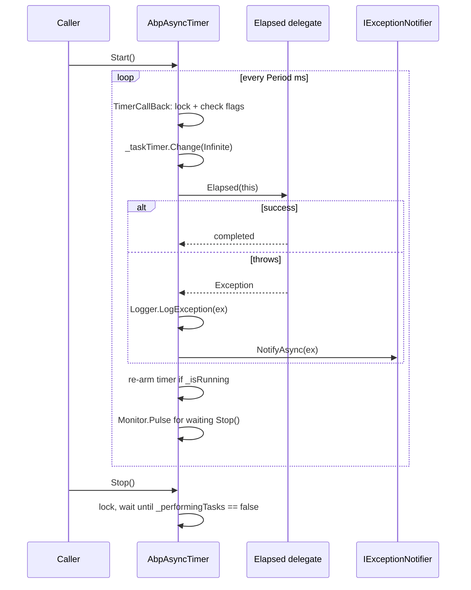
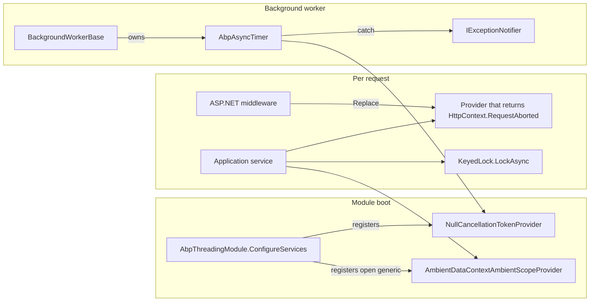

ABP layers a small set of utilities on top of `System.Threading` and `System.Threading.Tasks` so the framework can: run async code synchronously without deadlocks, share ambient data across `await` boundaries, override cancellation tokens in nested scopes, and run periodic work without overlap. Some pieces live in `Volo.Abp.Core` (`framework/src/Volo.Abp.Core/Volo/Abp/Threading/`); the heavier pieces &mdash; ambient contexts, timers, cancellation provider &mdash; live in the dedicated `Volo.Abp.Threading` assembly (`framework/src/Volo.Abp.Threading/Volo/Abp/Threading/`).

## File map

```
framework/src/Volo.Abp.Core/Volo/Abp/Threading/
├── AsyncHelper.cs               # RunSync, IsAsync, UnwrapTask
├── AsyncOneTimeRunner.cs        # double-checked async init
├── InternalAsyncHelper.cs       # internal continuations
├── KeyedLock.cs                 # per-key async lock
├── LockExtensions.cs            # source.Locking(Action)
├── OneTimeRunner.cs             # sync version of AsyncOneTimeRunner
├── SemaphoreSlimExtensions.cs   # LockAsync / Lock returning IDisposable
└── TaskCache.cs                 # cached completed Task<bool> singletons

framework/src/Volo.Abp.Threading/Volo/Abp/Threading/
├── AbpAsyncTimer.cs                              # async non-overlapping timer
├── AbpThreadingModule.cs                         # ConfigureServices entry point
├── AbpTimer.cs                                   # sync non-overlapping timer
├── AmbientDataContextAmbientScopeProvider.cs     # scope provider over IAmbientDataContext
├── AsyncLocalAmbientDataContext.cs               # ISingletonDependency backed by AsyncLocal
├── AsyncLocalSimpleScopeExtensions.cs            # using-friendly AsyncLocal scopes
├── CancellationTokenOverride.cs                  # ambient cancellation value
├── CancellationTokenProviderBase.cs              # uses AmbientScopeProvider
├── CancellationTokenProviderExtensions.cs        # FallbackToProvider(ct)
├── IAmbientDataContext.cs                        # SetData / GetData
├── IAmbientScopeProvider.cs                      # BeginScope / GetValue
├── ICancellationTokenProvider.cs                 # Token + Use(ct)
├── IRunnable.cs                                  # Start/Stop contract
├── NullCancellationTokenProvider.cs              # ICancellationTokenProvider singleton
```

The repo-wide `configureawait.props` (in `/home/daytona/repos/abpframework/abp/configureawait.props`) is imported by `Volo.Abp.Core.csproj` and adds the `ConfigureAwait.Fody` weaver in `Release` configuration. The weaver rewrites every `await` in framework code to `.ConfigureAwait(false)` so library code never re-captures the synchronization context.

```xml
<Project>
  <ItemGroup Condition="'$(Configuration)' == 'Release'">
      <PackageReference Include="ConfigureAwait.Fody" PrivateAssets="All" />
      <PackageReference Include="Fody"> ... </PackageReference>
  </ItemGroup>
</Project>
```

<Warning>The weaver only runs in Release. In Debug builds, asynchronous code may capture the synchronization context — be careful when reasoning about deadlocks during local development.</Warning>

## `AsyncHelper`

`framework/src/Volo.Abp.Core/Volo/Abp/Threading/AsyncHelper.cs` exposes a small set of well-known helpers. Crucially `RunSync(Func<Task>)` uses **Nito.AsyncEx**'s `AsyncContext.Run` (the package is referenced in `Volo.Abp.Core.csproj`).

```csharp
public static class AsyncHelper
{
    public static bool IsAsync(this MethodInfo method) => method.ReturnType.IsTaskOrTaskOfT();
    public static bool IsTaskOrTaskOfT(this Type type);
    public static bool IsTaskOfT(this Type type);
    public static Type UnwrapTask(Type type); // void / T / type
    public static TResult RunSync<TResult>(Func<Task<TResult>> func) => AsyncContext.Run(func);
    public static void RunSync(Func<Task> action)                    => AsyncContext.Run(action);
}
```

ABP calls `AsyncHelper.RunSync(...)` in two narrow situations:

1. `AbpApplicationBase.SetupTelemetryTracking()` (the sync path), so telemetry runs from sync host startup paths without an `async` chain.
2. `AbpTimer.TimerCallBack` (the synchronous timer), to invoke `IExceptionNotifier.NotifyAsync(ex)` from within a `System.Threading.Timer` callback.

<Note>`AsyncContext.Run` installs a single-threaded `SynchronizationContext` so awaits resume on the same logical "thread". This avoids the classic `.Result`/`.Wait()` deadlock pattern, but is **not** appropriate for hot paths.</Note>

## Run-once helpers

- `OneTimeRunner` (sync) and `AsyncOneTimeRunner` (async) implement double-checked locking around a single `Action` / `Func<Task>`. Both have a `volatile bool _runBefore` field. The async variant uses a `SemaphoreSlim(1,1)` plus `SemaphoreSlimExtensions.LockAsync` for the await-friendly critical section.

```csharp
public class AsyncOneTimeRunner
{
    public async Task RunAsync(Func<Task> action)
    {
        if (_runBefore) return;
        using (await _semaphore.LockAsync())
        {
            if (_runBefore) return;
            await action();
            _runBefore = true;
        }
    }
}
```

Use it as a `static` field to lazily initialise process-wide state (e.g. seeding a static cache exactly once).

## Locks

### `SemaphoreSlimExtensions`

`Volo/Abp/Threading/SemaphoreSlimExtensions.cs` decorates `SemaphoreSlim` with `Lock[Async]` overloads returning `IDisposable`/`ValueTask<IDisposable>` so callers can use `using (await sem.LockAsync()) { ... }`. The disposable is a `DisposeAction<SemaphoreSlim>` that calls `Release()`.

```csharp
public async static ValueTask<IDisposable> LockAsync(this SemaphoreSlim semaphoreSlim)
{
    await semaphoreSlim.WaitAsync();
    return GetDispose(semaphoreSlim);
}
```

Overloads exist for `CancellationToken`, `int millisecondsTimeout`, and `TimeSpan timeout` &mdash; timeout-style overloads throw `TimeoutException` on miss.

### `LockExtensions`

`Volo/Abp/Threading/LockExtensions.cs` adds `source.Locking(action)` and `source.Locking(state, action)` helpers that wrap a `Monitor.Enter`/`Monitor.Exit` around the delegate. They are intended for shared-state mutation in non-async code paths.

### `KeyedLock`

`Volo/Abp/Threading/KeyedLock.cs` implements a per-key async lock based on the pattern from [https://stackoverflow.com/a/31194647](https://stackoverflow.com/a/31194647). Keys are stored in a `Dictionary<object, RefCounted<SemaphoreSlim>>` so each unique key has at most one live `SemaphoreSlim`.

```csharp
using (await KeyedLock.LockAsync("my-critical-section", cts.Token))
{
    // protected work
}
```

Available overloads: `LockAsync(key)`, `LockAsync(key, CancellationToken)`, `TryLockAsync(key)`, `TryLockAsync(key, TimeSpan, CancellationToken)`. The `Releaser` returned by `LockAsync` decrements the refcount and disposes the underlying semaphore when no remaining waiters exist.

### `TaskCache`

`Volo/Abp/Threading/TaskCache.cs` exposes `Task<bool> True`, `Task<bool> False`, and similar cached completed tasks so methods like `IsEnabledAsync(...)` can return without allocating.

## Cancellation token plumbing

ABP exposes a single `ICancellationTokenProvider` (`Volo.Abp.Threading/Volo/Abp/Threading/ICancellationTokenProvider.cs`) so framework code can request "the current logical cancellation" without owning a `CancellationTokenSource`:

```csharp
public interface ICancellationTokenProvider
{
    CancellationToken Token { get; }
    IDisposable Use(CancellationToken cancellationToken);
}
```

`Use(ct)` pushes a temporary override onto the ambient stack and returns an `IDisposable` that pops it. Implementation lives in `CancellationTokenProviderBase`:

```csharp
public abstract class CancellationTokenProviderBase : ICancellationTokenProvider
{
    public const string CancellationTokenOverrideContextKey = "Volo.Abp.Threading.CancellationToken.Override";
    public abstract CancellationToken Token { get; }
    protected IAmbientScopeProvider<CancellationTokenOverride> CancellationTokenOverrideScopeProvider { get; }
    protected CancellationTokenOverride? OverrideValue
        => CancellationTokenOverrideScopeProvider.GetValue(CancellationTokenOverrideContextKey);

    public IDisposable Use(CancellationToken cancellationToken)
        => CancellationTokenOverrideScopeProvider.BeginScope(
               CancellationTokenOverrideContextKey,
               new CancellationTokenOverride(cancellationToken));
}
```

`NullCancellationTokenProvider` returns `CancellationToken.None` and is registered by `AbpThreadingModule.ConfigureServices` as the default singleton. The ASP.NET Core integration replaces it with a provider that returns `HttpContext.RequestAborted`.

`CancellationTokenProviderExtensions.FallbackToProvider(this ICancellationTokenProvider provider, CancellationToken preferred)` returns `preferred` if it can be cancelled, otherwise the provider's `Token`. This is the idiomatic guard inside `Task` helpers:

```csharp
var ct = _cancellationTokenProvider.FallbackToProvider(cancellationToken);
```

## Ambient data context

The ambient subsystem mirrors `System.Threading.AsyncLocal<T>` but plays well with DI.

### `IAmbientDataContext` & `AsyncLocalAmbientDataContext`

```csharp
// IAmbientDataContext.cs
public interface IAmbientDataContext
{
    void SetData(string key, object? value);
    object? GetData(string key);
}

// AsyncLocalAmbientDataContext.cs
public class AsyncLocalAmbientDataContext : IAmbientDataContext, ISingletonDependency
{
    private static readonly ConcurrentDictionary<string, AsyncLocal<object?>> AsyncLocalDictionary = new();
    public void SetData(string key, object? value) { ... }
    public object? GetData(string key) { ... }
}
```

A single `ConcurrentDictionary<string, AsyncLocal<object?>>` lets any number of unrelated subsystems share the same backing storage without colliding on key names.

### `IAmbientScopeProvider<T>` & `AmbientDataContextAmbientScopeProvider<T>`

```csharp
public interface IAmbientScopeProvider<T>
{
    T? GetValue(string contextKey);
    IDisposable BeginScope(string contextKey, T value);
}
```

The provider pushes a `ScopeItem` (with a unique GUID id) onto a static `ConcurrentDictionary<string, ScopeItem>` keyed by GUID, stores that id in the ambient `IAmbientDataContext` slot for `contextKey`, and the returned disposable restores the previous outer scope's id. `BeginScope` returns a `DisposeAction` so the pattern is `using (provider.BeginScope("MyKey", value)) { ... }`.

`AbpThreadingModule.ConfigureServices` registers the open generic:

```csharp
public override void ConfigureServices(ServiceConfigurationContext context)
{
    context.Services.AddSingleton<ICancellationTokenProvider>(NullCancellationTokenProvider.Instance);
    context.Services.AddSingleton(typeof(IAmbientScopeProvider<>), typeof(AmbientDataContextAmbientScopeProvider<>));
}
```

### `AsyncLocalSimpleScopeExtensions`

Sugar for the most common pattern of `using (x = AsyncLocalValue) { ... }`. Provides `Scope<T>(this AsyncLocal<T> local, T value)` returning `IDisposable` that restores the previous value on `Dispose()`.

## Timers

Two thread-safe non-overlapping timers ship with ABP. Both use a `System.Threading.Timer` plus `volatile bool _performingTasks` and `_isRunning` flags so a slow tick never starts a second tick on top of itself.

| Timer | File | Signature |
| --- | --- | --- |
| `AbpAsyncTimer` | `Volo.Abp.Threading/Volo/Abp/Threading/AbpAsyncTimer.cs` | `public Func<AbpAsyncTimer, Task> Elapsed; public int Period; public bool RunOnStart;` |
| `AbpTimer` | `Volo.Abp.Threading/Volo/Abp/Threading/AbpTimer.cs` | `public event EventHandler Elapsed; public int Period; public bool RunOnStart;` |

Both expose `Start(CancellationToken)` / `Stop(CancellationToken)` and require `Period > 0` (otherwise `Start` throws `AbpException("Period should be set before starting the timer!")`).



`AbpTimer` differs only in that `Elapsed` is a sync `EventHandler`. Inside the catch it does `AsyncHelper.RunSync(() => ExceptionNotifier.NotifyAsync(ex))` because the `System.Threading.Timer` callback signature is sync.

### `IRunnable`

`Volo.Abp.Threading/Volo/Abp/Threading/IRunnable.cs` is the minimal `Start[Async]`/`Stop[Async]` contract many background workers implement, including ABP background-job workers and SignalR connection clients.

## Built-in usages

| Subsystem | Threading primitive |
| --- | --- |
| `AbpApplicationBase.SetupTelemetryTracking()` | `AsyncHelper.RunSync` for sync host paths. |
| Auditing/UoW/Authorization interceptors | `AbpCrossCuttingConcerns.Applying` returns a `DisposeAction` from the `Volo.Abp` namespace; effective use of ambient state. |
| Background workers (`Volo.Abp.BackgroundWorkers`) | `AbpAsyncTimer` for periodic polling. |
| EF Core repositories | `IUnitOfWorkManager` uses `IAmbientScopeProvider<UnitOfWork>` from the threading module. |
| HTTP client proxies | `ICancellationTokenProvider.Use(ct)` to flow ASP.NET Core's `RequestAborted` into the proxy. |

## `AbpThreadingModule`

The threading assembly is itself an ABP module:

```csharp
public class AbpThreadingModule : AbpModule
{
    public override void ConfigureServices(ServiceConfigurationContext context)
    {
        context.Services.AddSingleton<ICancellationTokenProvider>(NullCancellationTokenProvider.Instance);
        context.Services.AddSingleton(typeof(IAmbientScopeProvider<>), typeof(AmbientDataContextAmbientScopeProvider<>));
    }
}
```

Modules that need timers, ambient scopes, or cancellation overrides simply add `[DependsOn(typeof(AbpThreadingModule))]`.

## Best practices encoded in source

The framework's threading conventions are not just suggestions — they show up in source code patterns:

| Convention | Where you'll see it | Source |
| --- | --- | --- |
| `ConfigureAwait(false)` in framework code | Repo-wide via `ConfigureAwait.Fody` weaver | `configureawait.props` imported by `Volo.Abp.Core.csproj` |
| Use `ICancellationTokenProvider` instead of capturing tokens | `IRepository`, `IDistributedCache<T>`, background workers | `Volo.Abp.Threading/Volo/Abp/Threading/ICancellationTokenProvider.cs` |
| Use `AmbientScopeProvider` for nested overrides | `IUnitOfWorkManager`, `ICurrentTenant`, `ICurrentUser` | `Volo.Abp.Threading/Volo/Abp/Threading/AmbientDataContextAmbientScopeProvider.cs` |
| Use `KeyedLock` for per-id critical sections | Settings cache invalidation, file-system hot reload | `Volo.Abp.Core/Volo/Abp/Threading/KeyedLock.cs` |
| Use `AbpAsyncTimer` instead of raw `System.Threading.Timer` | Background workers, distributed event polling | `Volo.Abp.Threading/Volo/Abp/Threading/AbpAsyncTimer.cs` |
| Use `AsyncOneTimeRunner` for lazy global init | Static-definition seeding, telemetry hardware fingerprint | `Volo.Abp.Core/Volo/Abp/Threading/AsyncOneTimeRunner.cs` |

## Common pitfalls

<Warning>
**Don't call `AsyncHelper.RunSync` from inside an `await`-able call chain.** `AsyncContext.Run` installs a one-thread synchronisation context that conflicts with the surrounding context. Always prefer making the API async if any caller can be async.
</Warning>

<Warning>
**The `IAmbientDataContext` slot is shared across the process.** Two unrelated subsystems must agree on key names or pick distinct ones. Use `typeof(MyClass).FullName` as a prefix to be safe.
</Warning>

<Warning>
**`KeyedLock` uses `Dictionary` equality.** Reference types must implement `Equals`/`GetHashCode` if you intend separate instances to share or differentiate the lock.
</Warning>

<Note>
`AbpAsyncTimer` and `AbpTimer` only guarantee no-overlap for **this instance**. Multiple replicas (e.g. ABP nodes in a Kubernetes deployment) all tick independently — coordinate via distributed locks or the `Volo.Abp.DistributedLocking` module.
</Note>

## Putting it together



## Cross-references

- [Modularity system](/core/modularity-system) for the `DependsOn(typeof(AbpThreadingModule))` pattern.
- [Logging & tracing](/core/logging-and-tracing) for how `AbpAsyncTimer.Logger` and `ExceptionNotifier` interact.
- [Application startup flow](/flows/application-startup) shows where `AsyncHelper.RunSync` is used in boot paths.
