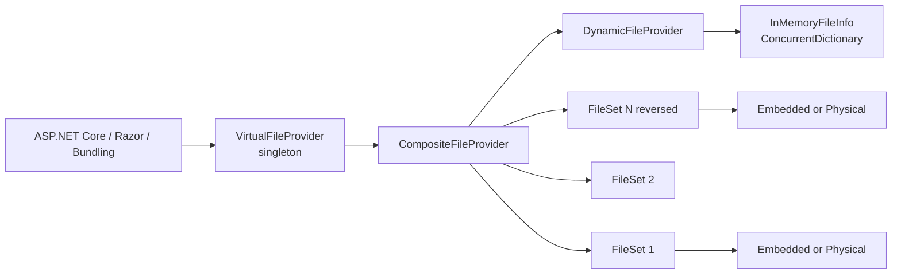
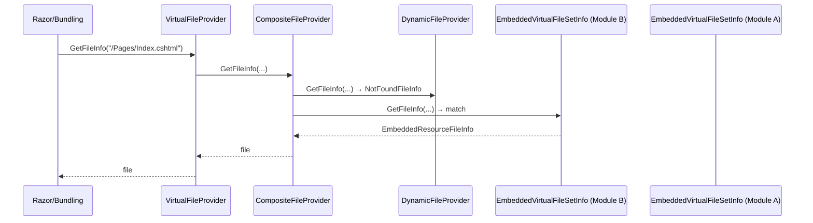

ABP's Virtual File System (VFS) layers embedded resources, physical folders, and in-memory dynamic files behind a single `IVirtualFileProvider`. Modules contribute by registering file sets in `ConfigureServices`; downstream subsystems (MVC views, Razor pages, JS bundles, localization JSONs) read files through `IVirtualFileProvider.GetFileInfo("/Foo/Bar.cshtml")` regardless of where the file physically lives. The implementation lives in `framework/src/Volo.Abp.VirtualFileSystem/`.

## File map

```
framework/src/Volo.Abp.VirtualFileSystem/
├── Microsoft/Extensions/FileProviders/
│   └── AbpFileInfoExtensions.cs
└── Volo/Abp/VirtualFileSystem/
    ├── AbpVirtualFileSystemModule.cs
    ├── AbpVirtualFileSystemOptions.cs
    ├── DictionaryBasedFileProvider.cs
    ├── DynamicFileProvider.cs
    ├── EnumerableDirectoryContents.cs
    ├── IDynamicFileProvider.cs
    ├── InMemoryFileInfo.cs
    ├── IVirtualFileProvider.cs
    ├── VirtualDirectoryFileInfo.cs
    ├── VirtualFilePathHelper.cs       (internal)
    ├── VirtualFileProvider.cs
    ├── VirtualFileSetInfo.cs
    ├── VirtualFileSetList.cs
    ├── VirtualFileSetListExtensions.cs
    ├── Embedded/
    │   ├── AbpEmbeddedFileProvider.cs
    │   ├── EmbeddedResourceFileInfo.cs
    │   └── EmbeddedVirtualFileSetInfo.cs
    └── Physical/
        └── PhysicalVirtualFileSetInfo.cs
```

## The module

`Volo/Abp/VirtualFileSystem/AbpVirtualFileSystemModule.cs` is intentionally empty:

```csharp
public class AbpVirtualFileSystemModule : AbpModule { }
```

The module exists so consumers can `[DependsOn(typeof(AbpVirtualFileSystemModule))]` to pull the assembly into the module graph. Concrete registrations come from the conventional registrar &mdash; the only `ISingletonDependency` is `VirtualFileProvider` itself.

## Options

```csharp
public class AbpVirtualFileSystemOptions
{
    public VirtualFileSetList FileSets { get; }
    public AbpVirtualFileSystemOptions() => FileSets = new VirtualFileSetList();
}

public class VirtualFileSetList : List<VirtualFileSetInfo> { }
```

A `VirtualFileSetInfo` wraps a `IFileProvider`:

```csharp
public class VirtualFileSetInfo
{
    public IFileProvider FileProvider { get; }
    public VirtualFileSetInfo([NotNull] IFileProvider fileProvider)
        => FileProvider = Check.NotNull(fileProvider, nameof(fileProvider));
}
```

Two subclasses ship: `EmbeddedVirtualFileSetInfo` (with `Assembly` and optional `BaseFolder`) and `PhysicalVirtualFileSetInfo` (with `Root` string).

## Adding file sets in a module

`Volo/Abp/VirtualFileSystem/VirtualFileSetListExtensions.cs` exposes the fluent helpers used by virtually every ABP module that ships embedded resources:

```csharp
public static void AddEmbedded<T>(this VirtualFileSetList list, string? baseNamespace = null, string? baseFolder = null)
{
    var assembly = typeof(T).Assembly;
    var fileProvider = CreateFileProvider(assembly, baseNamespace, baseFolder);
    list.Add(new EmbeddedVirtualFileSetInfo(fileProvider, assembly, baseFolder));
}

public static void AddPhysical(this VirtualFileSetList list, string root, ExclusionFilters exclusionFilters = ExclusionFilters.Sensitive)
{
    var fileProvider = new PhysicalFileProvider(root, exclusionFilters);
    list.Add(new PhysicalVirtualFileSetInfo(fileProvider, root));
}

public static void ReplaceEmbeddedByPhysical<T>(this VirtualFileSetList fileSets, string physicalPath);
```

`CreateFileProvider` picks one of three implementations depending on what `assembly.GetManifestResourceInfo("Microsoft.Extensions.FileProviders.Embedded.Manifest.xml")` returns:

| Embedded manifest? | `baseFolder` | Provider |
| --- | --- | --- |
| Absent | any | `AbpEmbeddedFileProvider(assembly, baseNamespace)` (ABP-built) |
| Present | `null` | `ManifestEmbeddedFileProvider(assembly)` (Microsoft) |
| Present | non-null | `ManifestEmbeddedFileProvider(assembly, baseFolder)` |

The typical call inside a module:

```csharp
public class MyModule : AbpModule
{
    public override void ConfigureServices(ServiceConfigurationContext context)
    {
        Configure<AbpVirtualFileSystemOptions>(options =>
        {
            options.FileSets.AddEmbedded<MyModule>();
        });
    }
}
```

The generic parameter `T` is used only to grab `typeof(T).Assembly`; by convention modules pass the module type itself.

### `ReplaceEmbeddedByPhysical<T>` for hot-reload

```csharp
public static void ReplaceEmbeddedByPhysical<T>(this VirtualFileSetList fileSets, string physicalPath)
{
    var assembly = typeof(T).Assembly;
    for (var i = 0; i < fileSets.Count; i++)
    {
        if (fileSets[i] is EmbeddedVirtualFileSetInfo embeddedVirtualFileSet
            && embeddedVirtualFileSet.Assembly == assembly)
        {
            var thisPath = physicalPath;
            if (!embeddedVirtualFileSet.BaseFolder.IsNullOrEmpty())
                thisPath = Path.Combine(thisPath, embeddedVirtualFileSet.BaseFolder!);
            fileSets[i] = new PhysicalVirtualFileSetInfo(new PhysicalFileProvider(thisPath), thisPath);
        }
    }
}
```

This is how the standard ABP `Acme.BookStore.HttpApi.Host` template lets you edit `.cshtml` files in another project and have ASP.NET Core file-watching pick them up without recompiling. Inside a development-only `IWebHostEnvironment.IsDevelopment()` block:

```csharp
Configure<AbpVirtualFileSystemOptions>(options =>
{
    options.FileSets.ReplaceEmbeddedByPhysical<MyDomainSharedModule>(
        Path.Combine(hostingEnvironment.ContentRootPath,
                     $"..{Path.DirectorySeparatorChar}MyCompany.MyApp.Domain.Shared"));
});
```

## `IVirtualFileProvider` and `VirtualFileProvider`

```csharp
public interface IVirtualFileProvider : IFileProvider { }

public class VirtualFileProvider : IVirtualFileProvider, ISingletonDependency
{
    private readonly IFileProvider _hybridFileProvider;
    public VirtualFileProvider(IOptions<AbpVirtualFileSystemOptions> options, IDynamicFileProvider dynamicFileProvider)
    {
        _options = options.Value;
        _hybridFileProvider = CreateHybridProvider(dynamicFileProvider);
    }

    public virtual IFileInfo GetFileInfo(string subpath) => _hybridFileProvider.GetFileInfo(subpath);

    public virtual IDirectoryContents GetDirectoryContents(string subpath)
    {
        if (subpath == "") subpath = "/";
        return _hybridFileProvider.GetDirectoryContents(subpath);
    }

    public virtual IChangeToken Watch(string filter) => _hybridFileProvider.Watch(filter);

    protected virtual IFileProvider CreateHybridProvider(IDynamicFileProvider dynamicFileProvider)
    {
        var fileProviders = new List<IFileProvider>();
        fileProviders.Add(dynamicFileProvider);
        foreach (var fileSet in _options.FileSets.AsEnumerable().Reverse())
            fileProviders.Add(fileSet.FileProvider);
        return new CompositeFileProvider(fileProviders);
    }
}
```

Two important details:

1. The composite provider puts `IDynamicFileProvider` **first**, so dynamic in-memory files override embedded/physical files. This is how the runtime "live-edit" features in CMS/admin packages work.
2. `_options.FileSets` is reversed before being added &mdash; the **last** file set registered wins for path collisions, mirroring how Razor view-overrides expect downstream modules to shadow upstream ones.



## Embedded provider internals

`Volo/Abp/VirtualFileSystem/Embedded/AbpEmbeddedFileProvider.cs` derives from `DictionaryBasedFileProvider` and lazily indexes `Assembly.GetManifestResourceNames()`:

```csharp
public class AbpEmbeddedFileProvider : DictionaryBasedFileProvider
{
    public Assembly Assembly { get; }
    public string? BaseNamespace { get; }
    protected override IDictionary<string, IFileInfo> Files => _files.Value;
    private readonly Lazy<Dictionary<string, IFileInfo>> _files;

    public void AddFiles(Dictionary<string, IFileInfo> files)
    {
        var lastModificationTime = GetLastModificationTime(); // Assembly.Location mtime fallback to UtcNow
        foreach (var resourcePath in Assembly.GetManifestResourceNames())
        {
            if (!BaseNamespace.IsNullOrEmpty() && !resourcePath.StartsWith(BaseNamespace!)) continue;
            var fullPath = ConvertToRelativePath(resourcePath).EnsureStartsWith('/');
            if (fullPath.Contains("/"))
                AddDirectoriesRecursively(files, fullPath.Substring(0, fullPath.LastIndexOf('/')), lastModificationTime);
            files[fullPath] = new EmbeddedResourceFileInfo(Assembly, resourcePath, fullPath, CalculateFileName(fullPath), lastModificationTime);
        }
    }
}
```

`ConvertToRelativePath` strips the `BaseNamespace`, then converts every dot except the last one (the extension) to `/`. Example: `MyCompany.Web.Resources.Css.site.css` with `BaseNamespace = "MyCompany.Web"` becomes `/Resources/Css/site.css`.

`EmbeddedResourceFileInfo` exposes `VirtualPath` so `AbpFileInfoExtensions.GetVirtualOrPhysicalPathOrNull(IFileInfo)` can recover the canonical path:

```csharp
public static string? GetVirtualOrPhysicalPathOrNull(this IFileInfo fileInfo)
{
    if (fileInfo is EmbeddedResourceFileInfo embeddedFileInfo) return embeddedFileInfo.VirtualPath;
    if (fileInfo is InMemoryFileInfo inMemoryFileInfo) return inMemoryFileInfo.DynamicPath;
    return fileInfo.PhysicalPath;
}
```

### `DictionaryBasedFileProvider`

The abstract base in `Volo/Abp/VirtualFileSystem/DictionaryBasedFileProvider.cs` does the heavy lifting once `Files` is populated:

```csharp
public virtual IFileInfo GetFileInfo(string? subpath)
{
    if (subpath == null) return new NotFoundFileInfo(subpath!);
    var file = Files.GetOrDefault(NormalizePath(subpath));
    return file ?? new NotFoundFileInfo(subpath);
}

public virtual IDirectoryContents GetDirectoryContents(string subpath)
{
    var directory = GetFileInfo(subpath);
    if (!directory.IsDirectory) return NotFoundDirectoryContents.Singleton;
    // enumerate Files.Values whose path is "directly under" subpath
    return new EnumerableDirectoryContents(fileList);
}

public virtual IChangeToken Watch(string filter) => NullChangeToken.Singleton;
protected virtual string NormalizePath(string subpath) => subpath;
```

`AbpEmbeddedFileProvider` overrides `NormalizePath` with `VirtualFilePathHelper.NormalizePath(...)` to handle case insensitivity and trailing slashes uniformly.

## Dynamic file provider

`Volo/Abp/VirtualFileSystem/DynamicFileProvider.cs` is a `DictionaryBasedFileProvider` backed by `ConcurrentDictionary<string, IFileInfo>` plus a per-path `CancellationChangeToken`:

```csharp
public class DynamicFileProvider : DictionaryBasedFileProvider, IDynamicFileProvider, ISingletonDependency
{
    public virtual void AddOrUpdate(IFileInfo fileInfo)
    {
        var filePath = fileInfo.GetVirtualOrPhysicalPathOrNull();
        DynamicFiles.AddOrUpdate(filePath!, fileInfo, (key, value) => fileInfo);
        ReportChange(filePath!);
    }

    public virtual bool Delete(string filePath)
    {
        if (!DynamicFiles.TryRemove(filePath, out _)) return false;
        ReportChange(filePath);
        return true;
    }

    public override IChangeToken Watch(string filter) => GetOrAddChangeToken(filter);
}
```

`Watch(filter)` returns the cached `CancellationChangeToken` for the path; `ReportChange(filePath)` triggers the cancellation source so Razor view caches and other watchers reload. The class-level comment notes the limitations: *"Current implementation only supports file watch. Does not support directory or wildcard watches."*

### `InMemoryFileInfo`

`Volo/Abp/VirtualFileSystem/InMemoryFileInfo.cs` wraps a `byte[]` in an `IFileInfo`:

```csharp
public class InMemoryFileInfo : IFileInfo
{
    public bool Exists => true;
    public long Length => _fileContent.Length;
    public string? PhysicalPath => null;
    public string Name { get; }
    public DateTimeOffset LastModified { get; } // set to DateTimeOffset.Now in ctor
    public bool IsDirectory => false;
    public string DynamicPath { get; }
    public Stream CreateReadStream() => new MemoryStream(_fileContent, false);
}
```

Used by feature modules that need to inject runtime-generated CSS/JS/JSON.

## `IFileInfo` extensions

`Microsoft/Extensions/FileProviders/AbpFileInfoExtensions.cs` gives ABP code a fluent reader API regardless of the underlying provider:

| Method | Behaviour |
| --- | --- |
| `ReadAsString(this IFileInfo)` | Opens `CreateReadStream`, wraps in a `StreamReader` (UTF-8), reads to end. |
| `ReadAsString(this IFileInfo, Encoding)` | Same with explicit encoding. |
| `ReadAsStringAsync(...)` | Async variants using `ReadToEndAsync`. |
| `ReadBytes(this IFileInfo)` / `ReadBytesAsync(...)` | Calls `stream.GetAllBytes()` / `GetAllBytesAsync()`. |
| `GetVirtualOrPhysicalPathOrNull(this IFileInfo)` | Returns `EmbeddedResourceFileInfo.VirtualPath`, `InMemoryFileInfo.DynamicPath`, or `IFileInfo.PhysicalPath`. |

## How resolution works



If two modules ship the same path, `_options.FileSets.AsEnumerable().Reverse()` ensures the **last-added** module wins &mdash; which matches dependency order because the startup module is registered last by `ModuleLoader.SortByDependency` (see [Modularity system](/core/modularity-system)).

## Build-time embed

To ship `.cshtml` / `.json` / `.css` as embedded resources, modules typically add this to their csproj:

```xml
<ItemGroup>
  <EmbeddedResource Include="**\*.cshtml" />
  <EmbeddedResource Include="**\*.json" />
  <EmbeddedResource Include="wwwroot\**" />
  <Content Remove="**\*.cshtml" />
  <Content Remove="**\*.json" />
</ItemGroup>
```

The ABP CLI / tooling does this automatically for templates; standalone modules are expected to follow the same pattern.

## Cross-references

- [Modularity system](/core/modularity-system) for `[DependsOn(typeof(AbpVirtualFileSystemModule))]` and the module loading order.
- [Options & static definitions](/core/options-and-static-definitions) for how `Configure<AbpVirtualFileSystemOptions>(...)` is processed.
- [Logging & tracing](/core/logging-and-tracing) for the init logger used during VFS bootstrap.
- [ASP.NET Core overview](/aspnetcore/overview) for how the MVC and bundling integrations consume `IVirtualFileProvider`.
