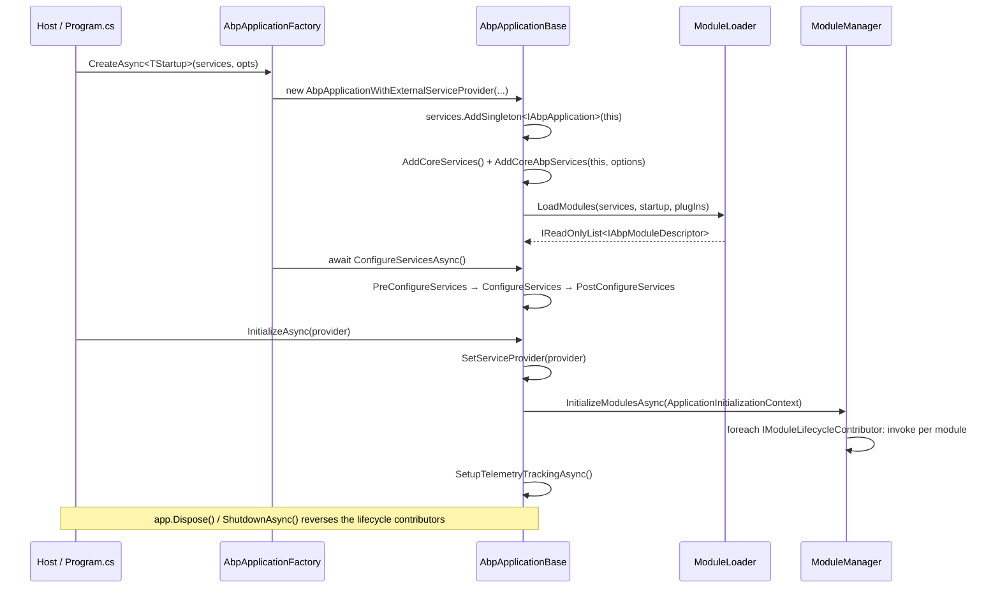
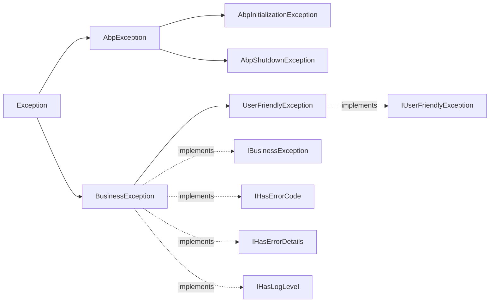

This page dissects the root namespace `Volo.Abp` inside `framework/src/Volo.Abp.Core/`. It covers the project file, the boot pipeline owned by `AbpApplicationBase`, the two `IAbpApplication` flavours (internal vs external service provider), the universal interfaces that decorate cross-cutting types (`ISoftDelete`, `IRemoteService`, `IKeyedObject`, `IOnApplicationInitialization`, `IOnApplicationShutdown`), the foundational exceptions, and the small utilities (`Check`, `DisposeAction`, `RandomHelper`, attributes) that show up across the entire codebase.

## Project file

`framework/src/Volo.Abp.Core/Volo.Abp.Core.csproj` is multi-targeted across `netstandard2.0;netstandard2.1;net8.0;net9.0;net10.0` and pulls in only the abstractions it needs. The `RootNamespace` element is empty so folders may pick their own `Volo.Abp.<Area>` namespaces.

```xml
<TargetFrameworks>netstandard2.0;netstandard2.1;net8.0;net9.0;net10.0</TargetFrameworks>
<Nullable>enable</Nullable>
<WarningsAsErrors>Nullable</WarningsAsErrors>
<RootNamespace />
```

Notable package references (from the same csproj):

| Package | Purpose |
| --- | --- |
| `Microsoft.Extensions.DependencyInjection` | `IServiceCollection` &amp; `IServiceProvider` used throughout the boot pipeline. |
| `Microsoft.Extensions.Options` & `.ConfigurationExtensions` | Backbone for `AbpOptionsFactory` and `Configure<TOptions>()`. |
| `Microsoft.Extensions.Configuration.{EnvironmentVariables,UserSecrets,CommandLine}` | Default sources stitched together by `AbpConfigurationBuilderOptions`. |
| `Microsoft.Extensions.Logging` | Used by every init logger and exception extension. |
| `Microsoft.Extensions.Hosting.Abstractions` | Provides `Environments.Production` used by `AbpApplicationBase.TryToSetEnvironment`. |
| `System.Management` | Needed for telemetry hardware id collection (see `Internal/Telemetry/`). |
| `Nito.AsyncEx.Context` | Powers `AsyncHelper.RunSync` via `AsyncContext.Run`. |
| `JetBrains.Annotations` | `[NotNull]`, `[ContractAnnotation]` attributes used in `Check`. |
| `System.Linq.Dynamic.Core` | Dynamic LINQ used by query helpers. |

The repository's `configureawait.props` file (in the repo root `/home/daytona/repos/abpframework/abp/configureawait.props`) is imported as the first line of `Volo.Abp.Core.csproj` and rewrites every Release-mode async method with `.ConfigureAwait(false)` via the `ConfigureAwait.Fody` weaver.

## Boot surface

The core entry points all live directly under `Volo/Abp/`:

| File | Role |
| --- | --- |
| `IAbpApplication.cs` | Public application contract: `StartupModuleType`, `Services`, `ServiceProvider`, `ConfigureServicesAsync()`, `Shutdown[Async]()`. Extends `IModuleContainer`, `IApplicationInfoAccessor`, `IDisposable`. |
| `IAbpApplicationWithInternalServiceProvider.cs` | Adds `Initialize[Async]()` and `CreateServiceProvider()` so ABP can build its own scope. |
| `IAbpApplicationWithExternalServiceProvider.cs` | Adds `SetServiceProvider` + `Initialize[Async](IServiceProvider)` so ASP.NET Core can supply the container. |
| `AbpApplicationBase.cs` | Abstract orchestrator; owns module loading, `ConfigureServices()`, `InitializeModules()`. |
| `AbpApplicationWithInternalServiceProvider.cs` | Internal class that owns a `ServiceCollection`, then calls `BuildServiceProviderFromFactory().CreateScope()`. |
| `AbpApplicationWithExternalServiceProvider.cs` | Internal class that receives a `IServiceProvider` from the host (ASP.NET Core, generic host, tests). |
| `AbpApplicationFactory.cs` | Static factory exposing `Create[Async]` overloads for both providers. |
| `AbpApplicationCreationOptions.cs` | Options bag passed to factories. |
| `ApplicationInitializationContext.cs` | Context object delivered to `IOnApplicationInitialization`. |
| `ApplicationShutdownContext.cs` | Context object delivered to `IOnApplicationShutdown`. |
| `AbpHostEnvironment.cs` / `IAbpHostEnvironment.cs` | Mutable host environment used early in boot, before `IHostEnvironment` is available. |

### `AbpApplicationCreationOptions`

Declared in `framework/src/Volo.Abp.Core/Volo/Abp/AbpApplicationCreationOptions.cs`:

```csharp
public class AbpApplicationCreationOptions
{
    public IServiceCollection Services { get; }
    public PlugInSourceList PlugInSources { get; }
    public AbpConfigurationBuilderOptions Configuration { get; }
    public bool SkipConfigureServices { get; set; }
    public string? ApplicationName { get; set; }
    public string? Environment { get; set; }
}
```

The `PlugInSources` property is consumed by `ModuleLoader.LoadModules`. The `Configuration` property is only honoured when `IConfiguration` has not already been registered (see `InternalServiceCollectionExtensions.AddCoreAbpServices`).

### `AbpApplicationFactory`

The static factory in `AbpApplicationFactory.cs` exposes four overloads each for sync/async:

```csharp
AbpApplicationFactory.Create<TStartupModule>(opts);
AbpApplicationFactory.Create(typeof(TStartupModule), opts);
AbpApplicationFactory.Create<TStartupModule>(services, opts);
AbpApplicationFactory.Create(typeof(TStartupModule), services, opts);
// async variants set SkipConfigureServices = true and await ConfigureServicesAsync()
await AbpApplicationFactory.CreateAsync<TStartupModule>(opts);
```

The async overloads always set `SkipConfigureServices = true` before delegating to `Create(...)` so they can await the user-supplied async `Configure*Services` methods.

## Boot sequence

The mermaid below traces what happens for `await AbpApplicationFactory.CreateAsync<MyModule>(services)` followed by `app.InitializeAsync(provider)`:



### What `AddCoreServices` and `AddCoreAbpServices` register

From `framework/src/Volo.Abp.Core/Volo/Abp/Internal/InternalServiceCollectionExtensions.cs`:

```csharp
internal static void AddCoreServices(this IServiceCollection services)
{
    services.AddOptions();
    services.AddLogging();
    services.AddLocalization();
}
```

`AddCoreAbpServices(IAbpApplication, AbpApplicationCreationOptions)` then:

- Builds default `IConfiguration` from `AbpConfigurationBuilderOptions` if none is already registered.
- Registers singletons: `IModuleLoader → ModuleLoader`, `IAssemblyFinder → AssemblyFinder`, `IInitLoggerFactory → DefaultInitLoggerFactory`, `ITypeFinder → TypeFinder`.
- Calls `services.AddAssemblyOf<IAbpApplication>()` which drives every `IConventionalRegistrar` (the default is `DefaultConventionalRegistrar`).
- Adds generic transients: `ISimpleStateCheckerManager<>` → `SimpleStateCheckerManager<>` and singleton `IStaticDefinitionCache<,>` → `StaticDefinitionCache<,>`.
- Configures `AbpModuleLifecycleOptions` with the four built-in contributors in this exact order: `OnPreApplicationInitialization`, `OnApplicationInitialization`, `OnPostApplicationInitialization`, `OnApplicationShutdown`.

### `ConfigureServices` order

`AbpApplicationBase.ConfigureServices()` (the synchronous overload at ~line 307 in `AbpApplicationBase.cs`; the async sibling `ConfigureServicesAsync()` lives at ~line 214 with identical structure) enforces the canonical order:

1. Construct a single `ServiceConfigurationContext` and assign it to every `AbpModule.ServiceConfigurationContext`.
2. `IPreConfigureServices.PreConfigureServices(context)` on each module that implements it.
3. For each module: if `SkipAutoServiceRegistration == false`, call `services.AddAssembly(assembly)` for each entry in `module.AllAssemblies` (the union of `module.Type.Assembly` and any `AdditionalAssemblyAttribute`). Then invoke `ConfigureServices(context)` (or its async sibling).
4. `IPostConfigureServices.PostConfigureServices(context)` on each module that implements it.
5. Detach `ServiceConfigurationContext` (set to `null`) — accessing it later throws `AbpException`.
6. `TryToSetEnvironment(services)` defaults `IAbpHostEnvironment.EnvironmentName` to `Environments.Production` if still unset.

Any exception inside the inner phases is wrapped: `throw new AbpInitializationException($"An error occurred during {nameof(...)} phase of the module {module.Type.AssemblyQualifiedName}. See the inner exception for details.", ex);`

<Warning>Calling `ConfigureServices()` twice raises `AbpInitializationException("Services have already been configured! ...")` via `CheckMultipleConfigureServices()`.</Warning>

## Application info & shutdown

`ApplicationInitializationContext` (`framework/src/Volo.Abp.Core/Volo/Abp/ApplicationInitializationContext.cs`) implements `IServiceProviderAccessor` so initialization handlers can read other services without taking a constructor dependency:

```csharp
public class ApplicationInitializationContext : IServiceProviderAccessor
{
    public IServiceProvider ServiceProvider { get; set; }
    public ApplicationInitializationContext(IServiceProvider serviceProvider) { ... }
}
```

`ApplicationShutdownContext` is its inverse twin used by `IOnApplicationShutdown`. Both are scoped via `ServiceProvider.CreateScope()` inside `AbpApplicationBase.InitializeModules[Async]()` / `ShutdownModules[Async]()`.

`AbpApplicationBase.ShutdownAsync()`:

```csharp
using (var scope = ServiceProvider.CreateScope())
{
    await scope.ServiceProvider
        .GetRequiredService<IModuleManager>()
        .ShutdownModulesAsync(new ApplicationShutdownContext(scope.ServiceProvider));
}
```

## Cross-cutting interfaces and attributes

These small interfaces are sprinkled across the entire framework. Every higher-level subsystem treats them as marker contracts.

| Type | File | Purpose |
| --- | --- | --- |
| `ISoftDelete` | `Volo/Abp/ISoftDelete.cs` | Standardises the `IsDeleted` boolean. Detected by EF Core/MongoDB repositories to auto-filter and by the unit-of-work to redirect deletes into updates. |
| `IRemoteService` | `Volo/Abp/IRemoteService.cs` | Marker interface; HTTP-API generators (e.g. `Volo.Abp.Http.Client.DynamicProxying`) expose only services that implement it. |
| `IKeyedObject` | `Volo/Abp/IKeyedObject.cs` | Provides `string? GetObjectKey()` used by deduplication helpers in `KeyedObjectHelper`. |
| `IOnApplicationInitialization` | `Volo/Abp/IOnApplicationInitialization.cs` | Init hook implemented by modules and any service registered as a singleton/scoped at boot. |
| `IOnApplicationShutdown` | `Volo/Abp/IOnApplicationShutdown.cs` | Mirror of the above for graceful shutdown. |
| `IApplicationInfoAccessor` | `Volo/Abp/IApplicationInfoAccessor.cs` | Surfaces `ApplicationName` and `InstanceId` (Guid string assigned in `AbpApplicationBase` constructor). |
| `IntegrationServiceAttribute` | `Volo/Abp/IntegrationServiceAttribute.cs` | Marks integration boundaries. The static `IsDefinedOrInherited<T>()` walks interfaces too. |
| `DisableAbpFeaturesAttribute` | `Volo/Abp/DisableAbpFeaturesAttribute.cs` | Opt-out for interceptors / middleware / MVC filters. Properties: `DisableInterceptors`, `DisableMiddleware`, `DisableMvcFilters` (all default `true`). |
| `RemoteServiceAttribute` | `Volo/Abp/RemoteServiceAttribute.cs` | Controls whether a class participates in HTTP-API generation. |
| `ApplicationServiceTypes` | `Volo/Abp/ApplicationServiceTypes.cs` | `[Flags]` enum (`ApplicationServices=1`, `IntegrationServices=2`, `All=3`). |

### Exceptions



- **`AbpException`** (`Volo/Abp/AbpException.cs`): base type for framework-thrown exceptions. Plain `Exception` subclass with the three usual constructors.
- **`AbpInitializationException`** / **`AbpShutdownException`**: wrap any error thrown during `ConfigureServices`, `OnApplicationInitialization`, or `OnApplicationShutdown`.
- **`BusinessException`** (`Volo/Abp/BusinessException.cs`): implements `IBusinessException`, `IHasErrorCode`, `IHasErrorDetails`, `IHasLogLevel`. Constructor takes `code`, `message`, `details`, `innerException`, `logLevel = LogLevel.Warning`. Exposes the fluent `WithData(name, value)` helper.
- **`UserFriendlyException`** (`Volo/Abp/UserFriendlyException.cs`): subclass that implements `IUserFriendlyException`; ABP middleware/filters surface its message verbatim to the client.
- **`IUserFriendlyException`** / **`IBusinessException`**: marker interfaces in `Volo/Abp/IUserFriendlyException.cs` and `Volo/Abp/IBusinessException.cs` consumed by `AbpExceptionFilter` and `ExceptionHttpStatusCodeOptions`.

Refer to [Exception handling](/core/exception-handling) for the notifier/subscriber pipeline that consumes these.

## Convenience primitives

`framework/src/Volo.Abp.Core/Volo/Abp/` includes a number of small helpers that the rest of the framework leans on heavily.

### `Check`

`Volo/Abp/Check.cs` is a `[DebuggerStepThrough]` static class that ABP uses instead of plain `if (x == null) throw`. Methods include `NotNull<T>`, `NotNullOrWhiteSpace`, `NotNullOrEmpty`, `Length`, `Positive` (Int16/Int32/Int64/float/double/decimal), `Range<T>`, `AssignableTo<TBase>`, and `NotDefaultOrNull<T>`. Every method is annotated with JetBrains `[ContractAnnotation("value:null => halt")]` for IDE flow-analysis.

```csharp
StartupModuleType = Check.NotNull(startupModuleType, nameof(startupModuleType));
```

### `DisposeAction` / `DisposeAction<T>`

`Volo/Abp/DisposeAction.cs` runs an `Action` when `Dispose()` is invoked. Used by:

- `AbpCrossCuttingConcerns.Applying(obj, concerns)` for scoped concern toggling.
- `DefaultCorrelationIdProvider.Change(id)` to restore the previous correlation id.
- `CancellationTokenProviderBase.Use(ct)` via `IAmbientScopeProvider.BeginScope`.

The generic `DisposeAction<T>` accepts a state parameter, enabling static lambdas without closure allocations (see `Aspects/AbpCrossCuttingConcerns.cs`).

### Null & async sentinels

- `NullDisposable.cs` — singleton with a no-op `Dispose()`.
- `NullAsyncDisposable.cs` — async equivalent.
- `AsyncDisposeFunc.cs` — wraps a `Func<ValueTask>` as `IAsyncDisposable`.

### Other root utilities

| File | Role |
| --- | --- |
| `RandomHelper.cs` | Thread-safe `GetRandom(min,max)` and `GetRandomOf<T>(list)` built on `ThreadLocal<Random>`. |
| `ObjectHelper.cs` | Boxed-value helpers used by reflection-heavy code paths. |
| `KeyedObjectHelper.cs` | Bridges `IKeyedObject.GetObjectKey()` with deduplication. |
| `NameValue.cs` / `NamedAction.cs` / `NamedObject.cs` / `NamedTypeSelector.cs` | Lightweight named tuples reused across menu, navigation, options, and selector lists. |
| `NamedTypeSelectorListExtensions.cs` | LINQ-style helpers (`AddNew`, `FirstOrDefault`) over named type selectors. |

## Telemetry

`SetupTelemetryTrackingAsync()` (defined alongside the sync `SetupTelemetryTracking()` at ~lines 157-195 of `AbpApplicationBase.cs`) opt-out reports a single activity via `Internal.Telemetry.ITelemetryService.AddActivityAsync(ActivityNameConsts.ApplicationRun)` only when:

```csharp
return abpHostEnvironment.IsDevelopment()
    && configuration.GetValue<bool?>("Abp:Telemetry:IsEnabled") != false;
```

Errors during telemetry are swallowed via the init logger (`Services.GetInitLogger<AbpApplicationBase>().LogException(ex, LogLevel.Trace)`).

<Note>Telemetry is **off** outside Windows/Linux/macOS and **off** when `Abp:Telemetry:IsEnabled` is explicitly `false` in configuration.</Note>

## Mini-utilities checklist

The following tiny helpers live directly under `framework/src/Volo.Abp.Core/Volo/Abp/` and are used everywhere — knowing what they exist saves agents from inventing parallel utilities:

| Symbol | File | Quick description |
| --- | --- | --- |
| `NullDisposable.Instance` | `NullDisposable.cs` | No-op `IDisposable` returned by `IInitLogger.BeginScope` and other "nothing to clean up" helpers. |
| `NullAsyncDisposable.Instance` | `NullAsyncDisposable.cs` | Async equivalent. |
| `AsyncDisposeFunc(Func<ValueTask>)` | `AsyncDisposeFunc.cs` | Adapter that lets a raw async cleanup function be passed as `IAsyncDisposable`. |
| `RandomHelper.GetRandom(int, int)` / `GetRandomOf<T>(IList<T>)` | `RandomHelper.cs` | Thread-safe sampling using `ThreadLocal<Random>`. |
| `ObjectHelper.TrySetProperty(obj, name, value)` | `ObjectHelper.cs` | Reflection-based "set if the property exists" used heavily by EF Core change tracking and serializers. |
| `KeyedObjectHelper` | `KeyedObjectHelper.cs` | Pairs with `IKeyedObject` for deduplication of objects by string key. |
| `NameValue` / `NameValue<T>` | `NameValue.cs` | Two-property serializable DTO. |
| `NamedObject` / `NamedAction<T>` / `NamedTypeSelector` | `NamedObject.cs`, `NamedAction.cs`, `NamedTypeSelector.cs` | Building blocks for "name + payload" collections. |
| `NullCancellationTokenProvider.Instance` | `Volo.Abp.Threading/Volo/Abp/Threading/NullCancellationTokenProvider.cs` | Default `ICancellationTokenProvider` registered by `AbpThreadingModule`. |
| `NullExceptionNotifier.Instance` | `Volo/Abp/ExceptionHandling/NullExceptionNotifier.cs` | Default fallback for components without DI access. |

## Internal helpers

Two helper namespaces are marked `internal` and are not meant for external consumption:

- `Volo/Abp/Internal/InternalServiceCollectionExtensions.cs` — `AddCoreServices()` and `AddCoreAbpServices(IAbpApplication, AbpApplicationCreationOptions)`. These two methods, called from `AbpApplicationBase`'s constructor, are the single source of truth for "what `Volo.Abp.Core` registers".
- `Volo/Abp/Internal/Telemetry/` — `ITelemetryService` plus its constants. Used only by `AbpApplicationBase.SetupTelemetryTracking*` and the official telemetry implementation provided by Volosoft.

The internal modifier keeps consumers from accidentally re-registering core services or producing telemetry through unsupported APIs.

## Where the constructor runs

The full code path for `await AbpApplicationFactory.CreateAsync<TStartup>()`:

<Steps>
  <Step title="`AbpApplicationFactory.CreateAsync<TStartup>(opts)`">Forces `SkipConfigureServices = true` then `new AbpApplicationWithInternalServiceProvider(typeof(TStartup), wrappedOpts)`.</Step>
  <Step title="`AbpApplicationWithInternalServiceProvider` ctor">Forwards to `AbpApplicationBase` ctor with a brand-new `ServiceCollection`.</Step>
  <Step title="`AbpApplicationBase` ctor">Runs all the framework registrations described in [Boot surface](#boot-surface) and `LoadModules(...)`.</Step>
  <Step title="Back in the factory">`await app.ConfigureServicesAsync()` executes the Pre/Configure/PostConfigureServices pipeline.</Step>
  <Step title="Returned to caller">The caller eventually calls `app.InitializeAsync()` which:<br/>1. `CreateServiceProvider()` (build provider, capture scope, call `SetServiceProvider`).<br/>2. `InitializeModulesAsync()` (dispatch contributors).<br/>3. `SetupTelemetryTrackingAsync()` (best-effort, swallowing errors).</Step>
</Steps>

The external-provider flavour (`AbpApplicationWithExternalServiceProvider`) is what the ASP.NET Core integration uses: the host owns the `IServiceProvider`, and `Initialize(serviceProvider)` plugs it in via `SetServiceProvider`.

## See also

- [Modularity system](/core/modularity-system) for what `LoadModules` returns.
- [Dependency injection](/core/dependency-injection) for what `services.AddAssemblyOf<IAbpApplication>()` actually registers.
- [Application startup flow](/flows/application-startup) for an end-to-end walk-through that includes ASP.NET Core hosting.
- [Module loading lifecycle](/flows/module-loading-lifecycle) for the contributor invocation order.
