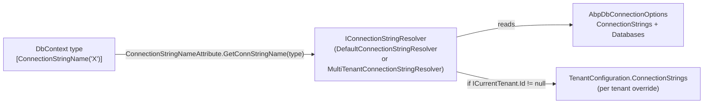

In ABP, a "connection string name" is a logical identifier. The mapping from name → connection-string value is resolved at runtime by `IConnectionStringResolver`, which means the same `DbContext` can talk to different physical databases per tenant, per environment, or per request.

Source: `framework/src/Volo.Abp.Data/Volo/Abp/Data/`. Multi-tenant override: `framework/src/Volo.Abp.MultiTenancy/Volo/Abp/MultiTenancy/MultiTenantConnectionStringResolver.cs`.

## The four moving parts



## `ConnectionStrings` dictionary

File: `ConnectionStrings.cs`.

```csharp
[Serializable]
public class ConnectionStrings : Dictionary<string, string?>
{
    public const string DefaultConnectionStringName = "Default";

    public string? Default {
        get => this.GetOrDefault(DefaultConnectionStringName);
        set => this[DefaultConnectionStringName] = value;
    }
}
```

Populated from `appsettings.json`:

```json
{
  "ConnectionStrings": {
    "Default": "Server=...;Database=MyHost;...",
    "MyProject.Identity": "Server=...;Database=MyIdentity;...",
    "AbpAuditLogging": "Server=...;Database=MyAudit;..."
  }
}
```

`AbpDataModule.ConfigureServices` calls `Configure<AbpDbConnectionOptions>(configuration)` which binds the `ConnectionStrings:` section into `AbpDbConnectionOptions.ConnectionStrings`.

## `AbpDbConnectionOptions`

File: `AbpDbConnectionOptions.cs`.

```csharp
public class AbpDbConnectionOptions
{
    public ConnectionStrings ConnectionStrings { get; set; }       // Default + named
    public AbpDatabaseInfoDictionary Databases { get; set; }       // Logical databases

    public string? GetConnectionStringOrNull(
        string connectionStringName,
        bool fallbackToDatabaseMappings = true,
        bool fallbackToDefault = true) { ... }
}
```

The lookup algorithm in `GetConnectionStringOrNull`:

1. **Exact match** — `ConnectionStrings.GetOrDefault(connectionStringName)`. If non-empty, return it.
2. **Database mapping** — if `fallbackToDatabaseMappings == true`, ask `AbpDatabaseInfoDictionary.GetMappedDatabaseOrNull(connectionStringName)` for the logical database that owns this connection name, then look up its `DatabaseName` in `ConnectionStrings`.
3. **Default** — if `fallbackToDefault == true`, return `ConnectionStrings.Default`.
4. Otherwise `null`.

### Database mappings — `AbpDatabaseInfo` / `AbpDatabaseInfoDictionary`

Files: `AbpDatabaseInfo.cs`, `AbpDatabaseInfoDictionary.cs`.

```csharp
Configure<AbpDbConnectionOptions>(options =>
{
    options.Databases.Configure("MyShared", database =>
    {
        database.MapConnection("MyProject.Identity", "MyProject.PermissionManagement", "AbpAuditLogging");
        database.IsUsedByTenants = true;
    });
});
```

Three modules' connection-string names ("MyProject.Identity", etc.) all resolve to the single physical connection string named `"MyShared"`. `AbpDataModule.PostConfigureServices` calls `options.Databases.RefreshIndexes()` after binding so `GetMappedDatabaseOrNull` is O(1). `IsUsedByTenants` (default `true`) excludes a logical database from per-tenant override when set to `false` (e.g. host-only databases like audit log).

### `[ConnectionStringName]`

File: `ConnectionStringNameAttribute.cs`.

```csharp
[ConnectionStringName("MyProject.Identity")]
public class MyProjectDbContext : AbpDbContext<MyProjectDbContext> { ... }
```

If absent, `ConnectionStringNameAttribute.GetConnStringName(type)` falls back to `type.FullName`. The module's modeling layer also uses this attribute when registering entity types so the connection-string-name → DbContext relationship is preserved.

## `IConnectionStringResolver`

File: `IConnectionStringResolver.cs`.

```csharp
public interface IConnectionStringResolver
{
    [Obsolete("Use ResolveAsync method.")] string Resolve(string? connectionStringName = null);
    Task<string> ResolveAsync(string? connectionStringName = null);
}
```

`ConnectionStringResolverExtensions.cs` adds typed helpers that read the attribute:

```csharp
public static Task<string> ResolveAsync<T>(this IConnectionStringResolver resolver);
public static Task<string> ResolveAsync(this IConnectionStringResolver resolver, Type type);
// both call ConnectionStringNameAttribute.GetConnStringName(type) internally
```

### `DefaultConnectionStringResolver`

File: `DefaultConnectionStringResolver.cs`. Transient.

```csharp
public class DefaultConnectionStringResolver : IConnectionStringResolver, ITransientDependency
{
    protected AbpDbConnectionOptions Options { get; }

    public DefaultConnectionStringResolver(IOptionsMonitor<AbpDbConnectionOptions> options)
        => Options = options.CurrentValue;

    public virtual Task<string> ResolveAsync(string? connectionStringName = null)
        => Task.FromResult(ResolveInternal(connectionStringName))!;

    private string? ResolveInternal(string? connectionStringName)
    {
        if (connectionStringName == null)
            return Options.ConnectionStrings.Default;
        var conn = Options.GetConnectionStringOrNull(connectionStringName);
        return !conn.IsNullOrEmpty() ? conn : null;
    }
}
```

Uses `IOptionsMonitor` so reload-on-change configuration sources (Azure App Configuration, file watcher) reflect immediately.

### `MultiTenantConnectionStringResolver`

File: `framework/src/Volo.Abp.MultiTenancy/Volo/Abp/MultiTenancy/MultiTenantConnectionStringResolver.cs`. Replaces the default via `[Dependency(ReplaceServices = true)]` when `AbpMultiTenancyModule` is loaded.

```csharp
[Dependency(ReplaceServices = true)]
public class MultiTenantConnectionStringResolver : DefaultConnectionStringResolver
{
    public override async Task<string> ResolveAsync(string? connectionStringName = null)
    {
        if (_currentTenant.Id == null) return await base.ResolveAsync(connectionStringName);

        var tenant = await FindTenantConfigurationAsync(_currentTenant.Id.Value);
        if (tenant == null || tenant.ConnectionStrings.IsNullOrEmpty())
            return await base.ResolveAsync(connectionStringName);

        var tenantDefault = tenant.ConnectionStrings?.Default;

        if (connectionStringName == null
            || connectionStringName == ConnectionStrings.DefaultConnectionStringName)
        {
            return !tenantDefault.IsNullOrWhiteSpace() ? tenantDefault! : Options.ConnectionStrings.Default!;
        }

        var conn = tenant.ConnectionStrings?.GetOrDefault(connectionStringName);
        if (!conn.IsNullOrWhiteSpace()) return conn!;

        var database = Options.Databases.GetMappedDatabaseOrNull(connectionStringName);
        if (database != null && database.IsUsedByTenants)
        {
            conn = tenant.ConnectionStrings?.GetOrDefault(database.DatabaseName);
            if (!conn.IsNullOrWhiteSpace()) return conn!;
        }

        if (!tenantDefault.IsNullOrWhiteSpace()) return tenantDefault!;
        return await base.ResolveAsync(connectionStringName);
    }
}
```

Resolution chain when a tenant is active:

1. Tenant's exact `connectionStringName`.
2. Tenant's logical-database mapping (only if `IsUsedByTenants == true`).
3. Tenant's `Default`.
4. Host's resolution (via `base.ResolveAsync`).

See `/multitenancy/connection-string-resolver` for the full per-tenant override flow.

## `IConnectionStringChecker`

File: `IConnectionStringChecker.cs`.

```csharp
public interface IConnectionStringChecker
{
    Task<AbpConnectionStringCheckResult> CheckAsync(string connectionString);
}
```

Used by the Tenant Management module to validate a connection string before saving a tenant. Returns `AbpConnectionStringCheckResult { Connected, DatabaseExists }`.

`DefaultConnectionStringChecker` (file `DefaultConnectionStringChecker.cs`) returns `{ false, false }` — providers replace it:

| Package | Implementation | Strategy |
| --- | --- | --- |
| `Volo.Abp.EntityFrameworkCore.SqlServer` | `SqlServerConnectionStringChecker` | Opens against `master`, `ChangeDatabaseAsync(original)`. `ConnectTimeout = 1`. |
| `Volo.Abp.EntityFrameworkCore.PostgreSql` | `NpgsqlConnectionStringChecker` | Similar approach using `template1`. |
| `Volo.Abp.EntityFrameworkCore.MySQL` | `MySQLConnectionStringChecker` | Opens with `information_schema`. |
| `Volo.Abp.EntityFrameworkCore.MySQL.Pomelo` | `PomeloMySQLConnectionStringChecker` | Same. |
| `Volo.Abp.EntityFrameworkCore.Sqlite` | `SqliteConnectionStringChecker` | Opens the file (creates if missing). |
| `Volo.Abp.EntityFrameworkCore.Oracle` | `OracleConnectionStringChecker` | Opens the service. |
| `Volo.Abp.EntityFrameworkCore.Oracle.Devart` | `OracleDevartConnectionStringChecker` | Same via Devart driver. |
| `Volo.Abp.MongoDB` | `MongoDBConnectionStringChecker` | `MongoClient.ListDatabaseNamesAsync`. |

All providers register their checker with `[Dependency(ReplaceServices = true)]`, so referencing the dialect package automatically swaps the implementation.

## `ConnectionStringResolverExtensions`

File: `ConnectionStringResolverExtensions.cs`. Provides:

```csharp
ResolveAsync<T>(this IConnectionStringResolver resolver)               // by DbContext type
ResolveAsync(this IConnectionStringResolver resolver, Type type)       // by Type
```

Both wrap `ConnectionStringNameAttribute.GetConnStringName(type)` and forward to `ResolveAsync(name)`. `UnitOfWorkDbContextProvider<TDbContext>` and `UnitOfWorkMongoDbContextProvider<TDbContext>` use these helpers.

## Putting it together

```csharp
// 1. Configure connection strings (appsettings.json or code)
Configure<AbpDbConnectionOptions>(options =>
{
    options.ConnectionStrings.Default                    = "Server=...;Database=Default;";
    options.ConnectionStrings["MyProject.Identity"]      = "Server=...;Database=Identity;";
    options.Databases.Configure("Shared", db =>
        db.MapConnection("AbpAuditLogging", "AbpPermissionManagement"));
});

// 2. Tag the DbContext
[ConnectionStringName("MyProject.Identity")]
public class IdentityServiceDbContext : AbpDbContext<IdentityServiceDbContext> { ... }

// 3. Repository resolves at runtime
public class UserAppService { ... }
// → UnitOfWorkDbContextProvider<IdentityServiceDbContext>
//     calls _connectionStringResolver.ResolveAsync<IdentityServiceDbContext>()
//     → returns the "MyProject.Identity" entry, or tenant-specific override.
```

## Cross-references

- `/data/volo-abp-data` — full type catalog under `Volo.Abp.Data`.
- `/data/ef-core-providers` — per-provider `IConnectionStringChecker` implementations.
- `/multitenancy/connection-string-resolver` — multi-tenant flow and `ITenantStore` lookup.
- `/multitenancy/current-tenant` — `ICurrentTenant.Id` source of truth.
- `/modules/tenant-management` — UI for per-tenant connection strings (uses `IConnectionStringChecker`).
- `/flows/multi-tenant-request` — how a request flows from tenant resolution to per-tenant connection string.
