A "data filter" in ABP is a named boolean toggle stored in `AsyncLocal<DataFilterState>`. When the toggle is **on**, every query against an entity that implements the filter interface (`ISoftDelete`, `IMultiTenant`, or a custom one) gets an automatic `WHERE` clause appended by the persistence provider. When the toggle is **off** (inside a `using (DataFilter.Disable<TFilter>())` block), the clause is skipped.

The toggle state is stored at the application layer (`Volo.Abp.Data`). The translation into SQL / Mongo filters happens in the provider layer (`AbpDbContext`, `MongoDbRepositoryFilterer`, `MemoryDbRepository.GetQueryable`).

## Abstractions (in `Volo.Abp.Data`)

| File | Type | Notes |
| --- | --- | --- |
| `IDataFilter.cs` | `IDataFilter` (non-generic) + `IDataFilter<TFilter>` | Methods `Enable()`, `Disable()`, `IsEnabled`. |
| `DataFilter.cs` | `DataFilter : IDataFilter, ISingletonDependency` | Facade caching `IDataFilter<TFilter>` in `ConcurrentDictionary<Type, object>`. |
| `DataFilter.cs` (cont.) | `DataFilter<TFilter> : IDataFilter<TFilter>` | Uses `AsyncLocal<DataFilterState>` so toggles never bleed across requests. |
| `DataFilterState.cs` | `DataFilterState { bool IsEnabled }` | `Clone()` snapshots state when an async-flow boundary is crossed. |
| `AbpDataFilterOptions.cs` | `AbpDataFilterOptions { DefaultStates : Dictionary<Type, DataFilterState> }` | Override the initial state of a filter. |

Registration (in `AbpDataModule.ConfigureServices`):

```csharp
context.Services.AddSingleton(typeof(IDataFilter<>), typeof(DataFilter<>));
```

`DataFilter<TFilter>` reads its default state from `AbpDataFilterOptions.DefaultStates[typeof(TFilter)]` (defaulting to `IsEnabled = true` for ABP-defined filters).

### Variadic disable helpers — `DataFilterExtensions.cs`

```csharp
using (_dataFilter.Disable<ISoftDelete, IMultiTenant>())
{
    var rows = await repository.GetListAsync();
}
```

The extension returns a `CompositeDisposable` that re-enables each filter on dispose in reverse order.

## Built-in filters

| Filter interface | Defined in | Default state | What it does |
| --- | --- | --- | --- |
| `ISoftDelete` | `Volo.Abp.Domain.Entities` (`/ddd/entities-and-aggregates`) | enabled | Hides rows where `IsDeleted == true`. On delete, `AbpDbContext.ApplyAbpConceptsForDeletedEntity` flips `EntityState.Deleted` to `EntityState.Modified` and sets `IsDeleted = true` (unless `IsHardDeleted(entry)`). |
| `IMultiTenant` | `Volo.Abp.MultiTenancy` | enabled | Filters rows where `TenantId != CurrentTenant.Id`. |

`AbpDbContext.IsSoftDeleteFilterEnabled` and `IsMultiTenantFilterEnabled` read directly from `IDataFilter`:

```csharp
protected virtual bool IsMultiTenantFilterEnabled => DataFilter?.IsEnabled<IMultiTenant>() ?? false;
protected virtual bool IsSoftDeleteFilterEnabled => DataFilter?.IsEnabled<ISoftDelete>() ?? false;
```

## How EF Core hooks them in — `AbpDbContext.OnModelCreating`

File: `framework/src/Volo.Abp.EntityFrameworkCore/Volo/Abp/EntityFrameworkCore/AbpDbContext.cs`. Per-entity, the flow is:

```mermaid
flowchart LR
  OMC[OnModelCreating] --> CET[ConfigureEntityTypeProperties&lt;TEntity&gt;]
  CET --> CBP[ConfigureBaseProperties&lt;TEntity&gt;]
  CBP --> Conv[entityTypeBuilder.ConfigureByConvention&#40;&#41;]
  CBP --> CGF[ConfigureGlobalFilters&lt;TEntity&gt;]
  CGF --> SFE[ShouldFilterEntity&lt;TEntity&gt;]
  CGF --> CFE[CreateFilterExpression&lt;TEntity&gt;]
  CFE --> HQF[entityTypeBuilder.HasAbpQueryFilter&#40;expression&#41;]
```



### `ShouldFilterEntity<TEntity>`

```csharp
protected virtual bool ShouldFilterEntity<TEntity>(IMutableEntityType entityType) where TEntity : class
{
    if (typeof(IMultiTenant).IsAssignableFrom(typeof(TEntity))) return true;
    if (typeof(ISoftDelete).IsAssignableFrom(typeof(TEntity))) return true;
    return false;
}
```

Override this in your `DbContext` to filter additional interfaces — but you must also override `CreateFilterExpression<TEntity>` to add the matching expression.

### `CreateFilterExpression<TEntity>`

```csharp
protected virtual Expression<Func<TEntity, bool>>? CreateFilterExpression<TEntity>(
    ModelBuilder modelBuilder, EntityTypeBuilder<TEntity> entityTypeBuilder) where TEntity : class
{
    Expression<Func<TEntity, bool>>? expression = null;

    if (typeof(ISoftDelete).IsAssignableFrom(typeof(TEntity)))
    {
        var col = entityTypeBuilder.Metadata.FindProperty(nameof(ISoftDelete.IsDeleted))?.GetColumnName() ?? "IsDeleted";
        expression = e => !IsSoftDeleteFilterEnabled || !EF.Property<bool>(e, col);

        if (UseDbFunction())
        {
            expression = e => AbpEfCoreDataFilterDbFunctionMethods.SoftDeleteFilter(((ISoftDelete)e).IsDeleted, true);
            modelBuilder.ConfigureSoftDeleteDbFunction(
                AbpEfCoreDataFilterDbFunctionMethods.SoftDeleteFilterMethodInfo,
                this.GetService<AbpEfCoreCurrentDbContext>());
        }
    }

    if (typeof(IMultiTenant).IsAssignableFrom(typeof(TEntity)))
    {
        var col = entityTypeBuilder.Metadata.FindProperty(nameof(IMultiTenant.TenantId))?.GetColumnName() ?? "TenantId";
        Expression<Func<TEntity, bool>> multiTenantFilter =
            e => !IsMultiTenantFilterEnabled || EF.Property<Guid>(e, col) == CurrentTenantId;

        if (UseDbFunction())
        {
            multiTenantFilter = e => AbpEfCoreDataFilterDbFunctionMethods.MultiTenantFilter(
                ((IMultiTenant)e).TenantId, CurrentTenantId, true);
            modelBuilder.ConfigureMultiTenantDbFunction(
                AbpEfCoreDataFilterDbFunctionMethods.MultiTenantFilterMethodInfo,
                this.GetService<AbpEfCoreCurrentDbContext>());
        }

        expression = expression == null
            ? multiTenantFilter
            : QueryFilterExpressionHelper.CombineExpressions(expression, multiTenantFilter);
    }

    return expression;
}
```

`HasAbpQueryFilter` (in `AbpEntityTypeBuilderExtensions`) chains expressions when a user has already called `HasQueryFilter`.

### Why two code paths — `UseDbFunction`

`AbpEfCoreGlobalFilterOptions.UseDbFunction` (file `GlobalFilters/AbpEfCoreGlobalFilterOptions.cs`) toggles between:

- **Lambda form** — `!IsSoftDeleteFilterEnabled || !EF.Property<bool>(e, "IsDeleted")`. EF Core inlines the boolean into the generated SQL, producing a different SQL string each time the filter is enabled/disabled, polluting the plan cache.
- **DB function form** — `AbpEfCoreDataFilterDbFunctionMethods.SoftDeleteFilter(((ISoftDelete)e).IsDeleted, true)` / `.MultiTenantFilter(...)`. These are static methods registered as `DbFunction`s; the generated SQL embeds a parameterised function call that the database evaluates at execution time, so the same SQL string is cached regardless of toggle state.

Dialect modules opt in:

```csharp
// AbpEntityFrameworkCoreSqlServerModule.ConfigureServices
Configure<AbpEfCoreGlobalFilterOptions>(options => { options.UseDbFunction = true; });
```

Same in PostgreSql, MySQL, MySQL.Pomelo, Sqlite, Oracle and Oracle.Devart. See `/data/ef-core-providers`.

`AbpCompiledQueryCacheKeyGenerator` (in `GlobalFilters/`) injects the current `IDataFilter` state into the EF Core compiled-query cache key when `UseDbFunction = false`, so plan reuse stays correct.

### `AbpEfCoreCurrentDbContext`

File: `GlobalFilters/AbpEfCoreCurrentDbContext.cs`. Scoped service that the DB function methods use to look up the current `IDataFilter` / `ICurrentTenant`. Without it, the static `DbFunction` methods would have no way back to the per-request services.

## MongoDB

`MongoDbRepositoryFilterer<TEntity>` (file `framework/src/Volo.Abp.MongoDB/Volo/Abp/Domain/Repositories/MongoDB/MongoDbRepositoryFilterer.cs`) reads the same `IDataFilter<ISoftDelete>` / `IDataFilter<IMultiTenant>` state and produces a `FilterDefinition<TEntity>` that callers AND into their queries.

## MemoryDb

`MemoryDbRepository.GetQueryable()` (file `framework/src/Volo.Abp.MemoryDb/Volo/Abp/Domain/Repositories/MemoryDb/MemoryDbRepository.cs`) applies LINQ-to-objects predicates when the filters are enabled.

## Dapper

Dapper does **not** auto-apply filters (see `/data/dapper`). You must write `WHERE TenantId = @tenantId AND IsDeleted = 0` by hand.

## Defining a custom filter

```csharp
// 1. Marker interface
public interface IIsActive { bool IsActive { get; } }

// 2. Default state (opt-in)
public class MyAppDataModule : AbpModule
{
    public override void ConfigureServices(ServiceConfigurationContext context)
    {
        Configure<AbpDataFilterOptions>(options =>
        {
            options.DefaultStates[typeof(IIsActive)] = new DataFilterState(isEnabled: true);
        });
    }
}

// 3. Plug into AbpDbContext
public class MyAppDbContext : AbpDbContext<MyAppDbContext>
{
    public IDataFilter DataFilter => LazyServiceProvider.LazyGetRequiredService<IDataFilter>();

    protected override bool ShouldFilterEntity<TEntity>(IMutableEntityType entityType)
    {
        if (typeof(IIsActive).IsAssignableFrom(typeof(TEntity))) return true;
        return base.ShouldFilterEntity<TEntity>(entityType);
    }

    protected override Expression<Func<TEntity, bool>>? CreateFilterExpression<TEntity>(
        ModelBuilder modelBuilder, EntityTypeBuilder<TEntity> entityTypeBuilder)
    {
        var expr = base.CreateFilterExpression<TEntity>(modelBuilder, entityTypeBuilder);
        if (typeof(IIsActive).IsAssignableFrom(typeof(TEntity)))
        {
            Expression<Func<TEntity, bool>> active = e =>
                !DataFilter.IsEnabled<IIsActive>() || EF.Property<bool>(e, nameof(IIsActive.IsActive));
            expr = expr == null ? active : QueryFilterExpressionHelper.CombineExpressions(expr, active);
        }
        return expr;
    }
}
```

## Disabling a filter

```csharp
using (_dataFilter.Disable<ISoftDelete>())
{
    // returns soft-deleted rows too
    var all = await _bookRepository.GetListAsync();
}

// across multiple filters:
using (_dataFilter.Disable<ISoftDelete, IMultiTenant>())
{
    var crossTenantRows = await _bookRepository.GetListAsync();
}
```

The `Disable<T1, T2>` overload comes from `DataFilterExtensions.cs`. The toggle is `AsyncLocal`, so `await` inside the `using` block keeps the disabled state. Re-entering the same disable call is a no-op (it returns `NullDisposable.Instance`).

## Cross-references

- `/data/volo-abp-data` — `IDataFilter`, `DataFilter`, `AbpDataFilterOptions` catalog.
- `/data/entity-framework-core` — full `AbpDbContext` pipeline including the change-tracker hooks that flip `IsDeleted`.
- `/data/ef-core-providers` — which dialects enable `UseDbFunction`.
- `/multitenancy/current-tenant` — `ICurrentTenant.Id` value that powers `IMultiTenant` filtering.
- `/ddd/entities-and-aggregates` — `ISoftDelete`, `IMultiTenant` marker interfaces.
- `/modules/audit-logging` — toggles `ISoftDelete` filter when scrubbing data.
