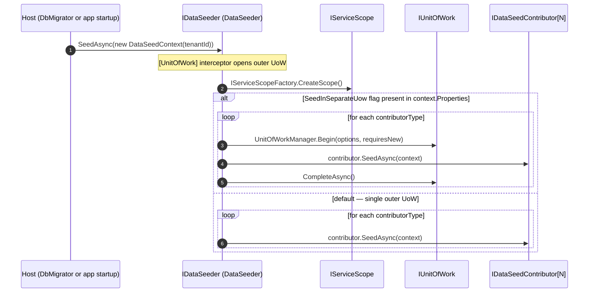

ABP separates **seeding** (writing the initial business data — admin user, default tenant, sample books) from **schema migration** (creating / altering tables). Seeding is provider-agnostic and lives in `Volo.Abp.Data`. Migration is provider-specific (EF Core `Migrate()`, or Mongo's index-ensure logic).

Source: `framework/src/Volo.Abp.Data/Volo/Abp/Data/`. Example contributor: `modules/identity/src/Volo.Abp.Identity.Domain/Volo/Abp/Identity/IdentityDataSeedContributor.cs`. Template: `templates/app/aspnet-core/src/MyCompanyName.MyProjectName.DbMigrator/`.

## Seeding pipeline



The `[UnitOfWork]` attribute on `DataSeeder.SeedAsync` (file `DataSeeder.cs`) guarantees an outer UoW. By default every contributor shares it, which means **all contributors commit together or all roll back together** — convenient for first-time bootstrap. The `SeedInSeparateUowAsync` helper opt-out is useful when a single contributor crashing must not block downstream ones.

## `IDataSeedContributor`

File: `IDataSeedContributor.cs`.

```csharp
public interface IDataSeedContributor
{
    Task SeedAsync(DataSeedContext context);
}
```

`AbpDataModule.PreConfigureServices` (file `AbpDataModule.cs`) auto-discovers every implementation via `services.OnRegistered` and adds it to `AbpDataSeedOptions.Contributors` (a `TypeList<IDataSeedContributor>`). The execution order is insertion order. To force ordering, register your contributors in module dependency order — modules earlier in the `[DependsOn]` chain run first.

Canonical example — `IdentityDataSeedContributor.cs`:

```csharp
public class IdentityDataSeedContributor : IDataSeedContributor, ITransientDependency
{
    public const string AdminEmailPropertyName = "AdminEmail";
    public const string AdminEmailDefaultValue = "admin@abp.io";
    public const string AdminUserNamePropertyName = "AdminUserName";
    public const string AdminUserNameDefaultValue = "admin";
    public const string AdminPasswordPropertyName = "AdminPassword";
    public const string AdminPasswordDefaultValue = "1q2w3E*";

    protected IIdentityDataSeeder IdentityDataSeeder { get; }

    public IdentityDataSeedContributor(IIdentityDataSeeder identityDataSeeder)
    {
        IdentityDataSeeder = identityDataSeeder;
    }

    public virtual Task SeedAsync(DataSeedContext context)
    {
        return IdentityDataSeeder.SeedAsync(
            context?[AdminEmailPropertyName] as string ?? AdminEmailDefaultValue,
            context?[AdminPasswordPropertyName] as string ?? AdminPasswordDefaultValue,
            context?.TenantId,
            context?[AdminUserNamePropertyName] as string ?? AdminUserNameDefaultValue
        );
    }
}
```

Pattern to copy:

1. Implement `IDataSeedContributor, ITransientDependency`.
2. Read everything you need from `DataSeedContext` (indexer falls back to `null`).
3. Delegate to a domain-service "seeder" (`IIdentityDataSeeder`) that does the actual write. Domain seeders are easier to unit-test than contributors because they don't depend on `DataSeedContext`.

## `DataSeedContext`

File: `DataSeedContext.cs`.

```csharp
public class DataSeedContext
{
    public Guid? TenantId { get; set; }
    public Dictionary<string, object?> Properties { get; }
    public object? this[string name] { get => Properties.GetOrDefault(name); set => Properties[name] = value; }
    public DataSeedContext(Guid? tenantId = null) { TenantId = tenantId; Properties = new(); }
    public virtual DataSeedContext WithProperty(string key, object? value) { Properties[key] = value; return this; }
}
```

Properties are how callers pass configuration. The DbMigrator template, for example, sets the admin password via:

```csharp
await dataSeeder.SeedAsync(
    new DataSeedContext(tenantId)
        .WithProperty(IdentityDataSeedContributor.AdminEmailPropertyName, "admin@example.com")
        .WithProperty(IdentityDataSeedContributor.AdminPasswordPropertyName, password));
```

## `DataSeederExtensions`

File: `DataSeederExtensions.cs`. Three constant keys:

```csharp
public const string SeedInSeparateUow              = "__SeedInSeparateUow";
public const string SeedInSeparateUowOptions       = "__SeedInSeparateUowOptions";
public const string SeedInSeparateUowRequiresNew   = "__SeedInSeparateUowRequiresNew";
```

Methods:

- `SeedAsync(this IDataSeeder seeder, Guid? tenantId = null)` — shortcut, no UoW flags.
- `SeedInSeparateUowAsync(this IDataSeeder, Guid? tenantId, AbpUnitOfWorkOptions? options, bool requiresNew)` — sets the three properties above and calls `SeedAsync`. `DataSeeder` then opens a fresh UoW per contributor (or a child if `requiresNew == false`).

## Schema migrations

ABP layers two concepts on EF Core's `Migrate()`:

1. **Code-first migrations** — generated with `dotnet ef migrations add ...` against the `.EntityFrameworkCore` project of your solution. Stored in `Migrations/` next to `MyProjectDbContext`.
2. **Runtime migration application** — provided by `EfCoreDatabaseMigrationEventHandlerBase` (file `framework/src/Volo.Abp.EntityFrameworkCore/Volo/Abp/EntityFrameworkCore/Migrations/EfCoreDatabaseMigrationEventHandlerBase.cs`) and `EfCoreRuntimeDatabaseMigratorBase` (same folder). They turn migrations into a distributed-event-driven workflow so a tenant's database can be migrated by any node.

### Migration event pair

| File | ETO | Direction | Purpose |
| --- | --- | --- | --- |
| `ApplyDatabaseMigrationsEto.cs` | `[EventName("abp.data.apply_database_migrations")] : EtoBase` | Producer → workers | Requests migrations be applied. Properties: `DatabaseName`, `TenantId?`. |
| `AppliedDatabaseMigrationsEto.cs` | `[EventName("abp.data.applied_database_migrations")]` | Workers → consumers | Confirms migrations finished. Properties: `DatabaseName`, `TenantId?`. |

A typical flow when a new tenant is created:

1. `TenantManagementModule` (or your code) publishes `ApplyDatabaseMigrationsEto { TenantId = newTenantId, DatabaseName = "Default" }`.
2. An `EfCoreDatabaseMigrationEventHandlerBase` subclass consumes it, opens a UoW for the tenant connection string, calls `DbContext.Database.MigrateAsync()`, then seeds via `IDataSeeder.SeedAsync(tenantId)`.
3. The handler publishes `AppliedDatabaseMigrationsEto` so other modules (cache invalidation, search index rebuild, ...) react.

See `/flows/distributed-event-publish` for the event-bus mechanics.

### `AbpDataMigrationEnvironment`

File: `AbpDataMigrationEnvironment.cs` (empty marker class). Registered as an `IObjectAccessor<AbpDataMigrationEnvironment>` via `AbpDataMigrationEnvironmentExtensions.AddDataMigrationEnvironment`. Modules can check `IServiceCollection.IsDataMigrationEnvironment()` / `IServiceProvider.IsDataMigrationEnvironment()` to suppress runtime-only behaviour (background workers, HTTP listeners) when the host is the DbMigrator console app.

## DbMigrator project pattern

The `templates/app/` solution template ships a console project called `<MyProject>.DbMigrator`. Its job:

```csharp
public class Program
{
    public async static Task<int> Main(string[] args)
    {
        using var application = await AbpApplicationFactory.CreateAsync<MyProjectDbMigratorModule>(options =>
        {
            options.Services.AddLogging(c => c.AddSerilog());
            options.Services.AddDataMigrationEnvironment(); // ← marks this host as a migration runner
        });
        await application.InitializeAsync();
        await application.ServiceProvider
            .GetRequiredService<MyProjectDbMigrationService>()
            .MigrateAsync();
        await application.ShutdownAsync();
        return 0;
    }
}
```

`MyProjectDbMigrationService` typically:

1. Migrates the host database (`hostDbContext.Database.MigrateAsync()`).
2. Calls `IDataSeeder.SeedAsync()` (no tenant id ⇒ host) to seed the admin user, languages, default permissions.
3. For each tenant in `TenantRepository`:
   - Uses `ICurrentTenant.Change(tenant.Id)` to scope down,
   - Migrates the tenant DbContext,
   - Calls `IDataSeeder.SeedAsync(tenant.Id)`.

This template-level orchestration is why ABP-style solutions never call `Database.Migrate()` from `Program.cs` of the web host — the DbMigrator owns it.

## Cross-references

- `/data/volo-abp-data` — the seeding type catalog (`IDataSeeder`, `AbpDataSeedOptions`).
- `/data/unit-of-work` — `[UnitOfWork]` semantics on `DataSeeder.SeedAsync`.
- `/data/entity-framework-core` — `EfCoreDatabaseMigrationEventHandlerBase` and `EfCoreRuntimeDatabaseMigratorBase` source files.
- `/flows/data-seeding-flow` — end-to-end sequence with the multi-tenant fan-out.
- `/flows/distributed-event-publish` — how the migration ETOs travel between nodes.
- `/modules/identity` — `IdentityDataSeedContributor` example.
- `/modules/tenant-management` — emitter of `ApplyDatabaseMigrationsEto`.
